<p align="center">
  
</p>

<h1 align="center">🚀 Future Workflows & Enhancements</h1>

<p align="center">
  <strong>Planned CI/CD Improvements for European Parliament MCP Server</strong><br>
  <em>Roadmap for workflow automation following Hack23 ISMS standards</em>
</p>

---

## 📋 Document Information

| Property | Value |
|----------|-------|
| **Owner** | DevOps Team |
| **Version** | 1.0 |
| **Last Updated** | 2026-02-18 |
| **Classification** | Internal |
| **Review Cycle** | Quarterly |
| **Next Review** | 2026-05-18 |

[](https://github.com/Hack23)
[](https://github.com/Hack23/European-Parliament-MCP-Server)
[](https://github.com/Hack23/European-Parliament-MCP-Server)
[](https://github.com/Hack23/European-Parliament-MCP-Server)

---

## 🔗 Related Documents

| Document | Description | Link |
|----------|-------------|------|
| **Workflows Documentation** | Current workflow documentation | [WORKFLOWS.md](./WORKFLOWS.md) |
| **Security Architecture** | Security design and controls | [SECURITY_ARCHITECTURE.md](../SECURITY_ARCHITECTURE.md) |
| **Secure Development Policy** | ISMS secure development guidelines | [Secure_Development_Policy.md](https://github.com/Hack23/ISMS-PUBLIC/blob/main/Secure_Development_Policy.md) |
| **Future Security Architecture** | Planned security enhancements | [FUTURE_SECURITY_ARCHITECTURE.md](../FUTURE_SECURITY_ARCHITECTURE.md) |

---

## 🎯 Overview

This document outlines planned workflow enhancements and improvements to the CI/CD pipeline for the European Parliament MCP Server. All planned changes follow Hack23 ISMS requirements and industry best practices for security, quality, and compliance.

### 📊 Roadmap Timeline


---

## 🧪 1. Performance Testing Automation

### 📋 Overview

Implement automated performance testing in CI/CD pipeline to ensure consistent API response times and resource usage.

### 🎯 Objectives

- Automated performance benchmarking on every PR
- Historical performance tracking
- Performance regression detection
- Load testing for European Parliament API integration

### 🔧 Implementation Plan

**Workflow:** `performance-testing.yml`

**Trigger:**
- Pull requests to main
- Nightly schedule
- Manual workflow dispatch

**Test Categories:**

1. **API Response Time Testing**
   ```typescript
   // Target: <200ms for 95th percentile
   - GET /tools/get_meps
   - GET /tools/get_plenary_sessions
   - GET /tools/get_mep_details
   ```

2. **Load Testing**
   - Concurrent requests: 50, 100, 200
   - Duration: 5 minutes per test
   - Rate limiting validation

3. **Memory Profiling**
   - Heap usage monitoring
   - Memory leak detection
   - Cache efficiency metrics

4. **European Parliament API Performance**
   - EP API response time tracking
   - Cache hit ratio validation
   - Network resilience testing

### 📊 Performance Thresholds

| Metric | Target | Warning | Failure |
|--------|--------|---------|---------|
| API Response Time (P95) | <200ms | 200-300ms | >300ms |
| Memory Usage | <256MB | 256-512MB | >512MB |
| Cache Hit Ratio | >80% | 70-80% | <70% |
| EP API Success Rate | >99% | 95-99% | <95% |

### 🔐 ISMS Evidence

- **ISO 27001 A.14.2.8** - System test data protection
- **NIST CSF PR.IP-6** - Data destroyed per policy
- **CIS Controls 15.1** - Network monitoring

---

## 🔒 2. Advanced Security Scanning

### 📋 Overview

Enhance security scanning with additional tools and deeper analysis beyond current CodeQL implementation.

### 🎯 Objectives

- OWASP ZAP dynamic application security testing (DAST)
- Secrets scanning in commit history
- License compliance automation
- Container image vulnerability scanning (future Docker support)

### 🔧 Implementation Plan

**Workflow:** `advanced-security.yml`

**Components:**

1. **OWASP ZAP DAST**
   ```yaml
   - name: ZAP Baseline Scan
     uses: zaproxy/action-baseline@v0.10.0
     with:
       target: 'http://localhost:3000'
       rules_file_name: '.zap/rules.tsv'
   ```

2. **Secret Scanning**
   - Gitleaks for commit history
   - TruffleHog for deep scanning
   - Custom regex patterns for API keys

3. **License Compliance**
   - FOSSA integration
   - License policy enforcement
   - Dependency license audit

4. **Supply Chain Security**
   - Sigstore/Cosign for artifact signing
   - SLSA provenance verification
   - Package attestation validation

### 🔐 ISMS Evidence

- **ISO 27001 A.14.2.1** - Secure development policy
- **NIST CSF PR.DS-6** - Integrity checking mechanisms
- **CIS Controls 16.6** - Application software security

---

## 🌍 3. Multi-Environment Deployment

### 📋 Overview

Implement automated deployment to multiple environments (development, staging, production) with environment-specific configurations.

### 🎯 Objectives

- Automated deployment to dev/staging/prod
- Environment-specific configuration management
- Blue-green deployment support
- Rollback automation

### 🔧 Implementation Plan

**Workflow:** `deploy-environments.yml`

**Environments:**

1. **Development**
   - Auto-deploy on merge to main
   - Relaxed rate limiting
   - Debug logging enabled
   - Test data allowed

2. **Staging**
   - Manual approval required
   - Production-like configuration
   - Integration test execution
   - Performance validation

3. **Production**
   - Multi-approver requirement
   - Blue-green deployment
   - Automated health checks
   - Rollback on failure

### 🔄 Deployment Strategy

```mermaid
graph LR
    subgraph "Deployment Pipeline"
        D1[🔨 Build] --> D2[🧪 Test Dev]
        D2 --> D3{Approval?}
        D3 -->|Yes| D4[🎭 Deploy Staging]
        D4 --> D5[🧪 Test Staging]
        D5 --> D6{Approval?}
        D6 -->|Yes| D7[🚀 Deploy Prod]
        D7 --> D8[🏥 Health Check]
        D8 --> D9{Healthy?}
        D9 -->|No| D10[↩️ Rollback]
        D9 -->|Yes| D11[✅ Complete]
    end
    
    style D1 fill:#2979FF,stroke:#1565C0,stroke-width:2px,color:white
    style D4 fill:#673AB7,stroke:#4527A0,stroke-width:2px,color:white
    style D7 fill:#00C853,stroke:#00695C,stroke-width:2px,color:white
    style D10 fill:#FF3D00,stroke:#BF360C,stroke-width:2px,color:white
    style D11 fill:#00C853,stroke:#00695C,stroke-width:2px,color:white
```



### 🔐 ISMS Evidence

- **ISO 27001 A.12.1.4** - Separation of environments
- **NIST CSF PR.IP-3** - Configuration change control
- **CIS Controls 4.1** - Secure configuration management

---

## 🐳 4. Container Image Scanning

### 📋 Overview

Implement container vulnerability scanning for future Docker deployment support.

### 🎯 Objectives

- Automated vulnerability scanning of container images
- Base image security validation
- CVE tracking and remediation
- Minimal image size enforcement

### 🔧 Implementation Plan

**Workflow:** `container-security.yml`

**Tools:**
- Trivy for vulnerability scanning
- Grype for CVE detection
- Snyk for dependency analysis
- Dive for image layer analysis

### 🔐 ISMS Evidence

- **ISO 27001 A.14.2.2** - System change control procedures
- **NIST CSF DE.CM-8** - Vulnerability scans performed
- **CIS Controls 7.3** - Remediate vulnerabilities

---

## 🌀 5. Chaos Engineering Tests

### 📋 Overview

Implement chaos engineering practices to validate system resilience and failure recovery.

### 🎯 Objectives

- Automated resilience testing
- Failure injection scenarios
- Recovery time validation
- Graceful degradation verification

### 🔧 Implementation Plan

**Workflow:** `chaos-testing.yml`

**Test Scenarios:**

1. **Network Chaos**
   - EP API timeout simulation
   - Network latency injection
   - Connection failure testing

2. **Resource Chaos**
   - Memory pressure testing
   - CPU throttling
   - Disk I/O constraints

3. **Application Chaos**
   - Cache failure scenarios
   - Rate limiter overflow
   - Invalid data handling

### 🔐 ISMS Evidence

- **ISO 27001 A.17.1.3** - ICT readiness verification
- **NIST CSF RS.RP-1** - Response plan executed
- **CIS Controls 11.5** - Data recovery capability

---

## 🤖 6. Intelligent Auto-Remediation

### 📋 Overview

Implement AI-assisted automatic issue remediation for common problems detected in CI/CD.

### 🎯 Objectives

- Auto-fix dependency vulnerabilities
- Automated code formatting fixes
- License compliance auto-correction
- Security patch automation

### 🔧 Implementation Plan

**Workflow:** `auto-remediation.yml`

**Auto-Fix Categories:**

1. **Dependency Updates**
   - Security patch auto-merge
   - Minor version bump automation
   - Breaking change detection

2. **Code Quality**
   - ESLint auto-fix
   - Prettier formatting
   - TypeScript migration helpers

3. **Security**
   - Secret rotation
   - Vulnerability patching
   - Configuration hardening

### 🔐 ISMS Evidence

- **ISO 27001 A.16.1.4** - Assessment of information security events
- **NIST CSF RS.MI-3** - Incident mitigation
- **CIS Controls 18.3** - Remediate penetration test findings

---

## 📈 7. ML-Based Quality Prediction

### 📋 Overview

Implement machine learning models to predict code quality issues and test failures before execution.

### 🎯 Objectives

- Predict test failures based on code changes
- Estimate coverage impact
- Identify high-risk changes
- Optimize test execution order

### 🔧 Implementation Plan

**Workflow:** `ml-quality-prediction.yml`

**ML Models:**

1. **Failure Prediction**
   - Train on historical test results
   - Analyze code diff patterns
   - Predict failure probability

2. **Coverage Prediction**
   - Estimate coverage impact
   - Identify undertested areas
   - Suggest test priorities

3. **Risk Assessment**
   - Security risk scoring
   - Performance regression likelihood
   - Breaking change probability

### 🔐 ISMS Evidence

- **ISO 27001 A.12.6.1** - Management of technical vulnerabilities
- **NIST CSF PR.IP-12** - Vulnerability management plan
- **CIS Controls 7.5** - Automated vulnerability management

---

## 🔄 8. Additional Planned Enhancements

### 8.1 Documentation as Code Improvements

- **Auto-generated architecture diagrams** from code
- **API documentation diff** on PRs
- **Coverage visualization** with interactive reports
- **Dependency graph visualization**

### 8.2 Advanced Testing

- **Mutation testing** with Stryker
- **Fuzz testing** for input validation
- **Property-based testing** with fast-check
- **Contract testing** for EP API integration

### 8.3 Developer Experience

- **Pre-commit hooks** automation
- **Local CI execution** with Act
- **PR preview environments**
- **Interactive test reports**

### 8.4 Compliance Automation

- **Automated compliance reports** (ISO 27001, NIST, CIS)
- **Policy-as-Code** validation
- **Audit trail generation**
- **Evidence collection automation**

---

## 📊 Implementation Priorities

### Priority Matrix

| Enhancement | Impact | Effort | Priority | Quarter |
|-------------|--------|--------|----------|---------|
| Performance Testing | High | Medium | 🟢 High | Q1 2026 |
| Advanced Security | High | High | 🟢 High | Q1 2026 |
| Multi-Environment | High | High | 🟡 Medium | Q2 2026 |
| Container Scanning | Medium | Low | 🟡 Medium | Q2 2026 |
| Chaos Engineering | Medium | High | 🟡 Medium | Q3 2026 |
| Auto-Remediation | High | High | 🟢 High | Q3 2026 |
| ML Prediction | Low | Very High | 🔴 Low | Q4 2026 |
| Doc Improvements | Medium | Medium | 🟡 Medium | Ongoing |

---

## 🎯 Success Criteria

### Key Performance Indicators

| KPI | Current | Target |
|-----|---------|--------|
| **Workflow Execution Time** | ~8 minutes | <5 minutes |
| **Deployment Frequency** | On-demand | Multiple/day |
| **Change Failure Rate** | Unknown | <5% |
| **Mean Time to Recovery** | Manual | <1 hour |
| **Security Scan Coverage** | CodeQL only | Multi-tool |
| **Test Execution Time** | ~5 minutes | <3 minutes |

### Compliance Targets

- **SLSA Level 4** - Enhanced supply chain security
- **OpenSSF Scorecard** - ≥9.0/10 (currently 8.5/10)
- **CIS Benchmarks** - Level 2 compliance
- **ISO 27001** - Full evidence automation

---

## 📚 Resources

### Learning & Documentation

- [GitHub Actions Best Practices](https://docs.github.com/en/actions/security-guides/security-hardening-for-github-actions)
- [SLSA Framework](https://slsa.dev/)
- [OpenSSF Best Practices](https://bestpractices.coreinfrastructure.org/)
- [Hack23 ISMS Policies](https://github.com/Hack23/ISMS-PUBLIC)

### Tools & Services

- **Performance Testing**: k6, Artillery, Apache JMeter
- **Security Scanning**: OWASP ZAP, Snyk, Trivy
- **Chaos Engineering**: Chaos Toolkit, Gremlin
- **ML/AI**: TensorFlow.js, ML.NET, GitHub Copilot

---

## 🔄 Review & Updates

This document is reviewed quarterly and updated based on:

- **Technology evolution** - New tools and practices
- **ISMS requirements** - Policy updates
- **Lessons learned** - Incident retrospectives
- **Team feedback** - Developer experience improvements

**Next Review:** 2026-05-18

---

**Maintained by:** Hack23 DevOps Team  
**Contact:** See [CONTRIBUTING.md](../CONTRIBUTING.md) for support channels
