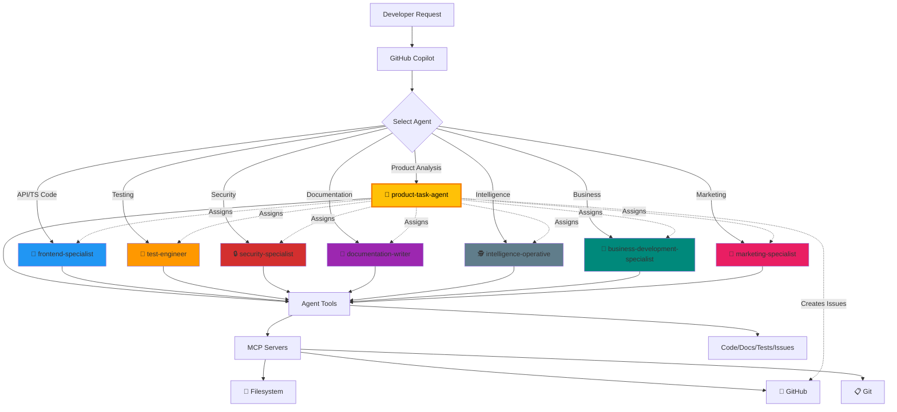

# GitHub Copilot Custom Agents

This directory contains custom agent configurations for GitHub Copilot coding agent. Each agent is specialized for different aspects of European Parliament MCP Server development and provides expert guidance following the project's standards.

## 🎯 Available Agents

### 🎯 product-task-agent
**Expert in product analysis, quality improvement, and GitHub issue creation**

Specialized in:
- Product quality analysis across code, API, documentation, and performance
- Creating well-structured GitHub issues with proper labels and assignments
- Coordinating between specialized agents for task implementation
- ISMS compliance verification and security alignment
- Using GitHub MCP and other tools for comprehensive analysis
- Identifying improvements for European Parliament dataset integrations

**Tools:** `["*"]` (all tools allowed)

**Key Capabilities:**
- 🔍 Analyze codebase for quality, security, and API design improvements
- 📝 Create structured GitHub issues with clear acceptance criteria
- 🤝 Assign tasks to appropriate specialized agents
- 🔒 Verify ISMS policy alignment and compliance
- 🌐 Analyze European Parliament API integrations and dataset handling
- 📊 Generate comprehensive product improvement plans

---

### 📝 documentation-writer
**Expert in technical documentation and user guides**

Specialized in:
- README and project documentation
- API documentation with JSDoc
- Security documentation (SECURITY.md)
- Code comments and inline documentation
- User guides and tutorials
- Mermaid diagrams and architecture docs

**Tools:** `["*"]` (all tools allowed)

---

### 🎨 frontend-specialist
**Expert in TypeScript development with strict typing**

Specialized in:
- Strict TypeScript typing and best practices
- Component-based architecture
- API client development
- Testing with Vitest
- Build optimization

**Tools:** `["*"]` (all tools allowed)

---

### 🔒 security-specialist
**Expert in security, compliance, and supply chain protection**

Specialized in:
- Supply chain security (OSSF Scorecard, SLSA)
- License compliance verification
- SBOM quality validation
- Secure coding practices and OWASP guidelines
- CodeQL and vulnerability scanning
- Dependency management and audit
- [ISMS-PUBLIC](https://github.com/Hack23/ISMS-PUBLIC) policy compliance
- Security documentation aligned with [Secure Development Policy](https://github.com/Hack23/ISMS-PUBLIC/blob/main/Secure_Development_Policy.md)

**Tools:** `["*"]` (all tools allowed)

---

### 🧪 test-engineer
**Expert in comprehensive testing strategies and quality assurance**

Specialized in:
- Unit testing with Vitest and jsdom
- API testing and integration tests
- Test coverage and quality metrics (80%+ target)
- Testing data transformations and API clients
- CI/CD integration and test automation

**Tools:** `["*"]` (all tools allowed)

---

### 🔌 mcp-developer
**Expert in Model Context Protocol implementation and MCP server architecture**

Specialized in:
- MCP protocol specification compliance (tools, resources, prompts)
- Tool development with Zod schema validation
- Resource URI patterns and handlers
- Prompt template design for AI assistants
- StdioServerTransport and HTTP transport
- MCP-compliant error handling and logging
- @modelcontextprotocol/sdk best practices

**Tools:** `["*"]` (all tools allowed)

**Key Capabilities:**
- 🛠️ Implement MCP tools with comprehensive input validation
- 📦 Design resource URIs for European Parliament data
- 💬 Create effective prompt templates for AI workflows
- ⚡ Optimize MCP handler performance
- 🔒 Implement security controls for MCP endpoints

---

### 🏛️ european-parliament-specialist
**Expert in European Parliament datasets, APIs, and GDPR compliance**

Specialized in:
- European Parliament Open Data Portal (`data.europarl.europa.eu`)
- MEPs, plenary sessions, committees, documents, questions datasets
- Parliamentary procedures and legislative processes
- GDPR compliance for parliamentary data
- Multilingual support (24 EU languages)
- Data attribution and European Parliament terms of use
- API rate limiting and caching strategies

**Tools:** `["*"]` (all tools allowed)

**Key Capabilities:**
- 🗳️ Navigate all 5 core European Parliament datasets
- 📊 Implement proper API caching (1h-24h based on data type)
- 🌍 Handle multilingual parliamentary data
- 🔒 Ensure GDPR compliance for MEP personal data
- ⚖️ Apply proper European Parliament data attribution

---

### 🔗 api-integration-engineer
**Expert in API client design, rate limiting, retry strategies, and fault tolerance**

Specialized in:
- RESTful API client architecture
- HTTP caching with ETag and Cache-Control
- Rate limiting algorithms (token bucket, leaky bucket)
- Retry strategies with exponential backoff and jitter
- Circuit breaker patterns for fault tolerance
- Connection pooling and HTTP/2
- Request metrics and latency tracking

**Tools:** `["*"]` (all tools allowed)

**Key Capabilities:**
- 🚀 Design high-performance API clients with connection pooling
- 🔄 Implement robust retry logic with exponential backoff
- ⚡ Optimize response caching for <200ms API responses
- 📊 Track request metrics (P50, P95, P99 latencies)
- 🛡️ Implement circuit breakers for resilience

---

### 📐 zod-schema-architect
**Expert in Zod schema design, runtime validation, and TypeScript type inference**

Specialized in:
- Comprehensive Zod schema design and validation
- TypeScript type inference with `z.infer<>`
- Branded types for IDs and sensitive data
- Discriminated unions for type-safe variants
- Custom refinements and transformations
- Async validation patterns
- Schema composition and reusability

**Tools:** `["*"]` (all tools allowed)

**Key Capabilities:**
- ✅ Create bulletproof input validation with Zod schemas
- 🏷️ Design branded types to prevent ID mixing
- 🔀 Implement discriminated unions for type safety
- 🔄 Build reusable schema patterns (extend, merge, pick)
- 📝 Provide clear, actionable validation error messages

---

### ⚡ performance-optimizer
**Expert in Node.js performance optimization and sub-200ms response times**

Specialized in:
- API response time optimization (<200ms P95 target)
- LRU caching strategies with proper TTL
- Memory management and leak detection
- Event loop monitoring and async optimization
- Database query optimization
- HTTP/2 and response compression
- CPU profiling and flame graph analysis

**Tools:** `["*"]` (all tools allowed)

**Key Capabilities:**
- 🏃 Achieve <200ms P95 API response times
- 💾 Implement multi-tier caching (L1: memory, L2: Redis)
- 🧠 Monitor memory usage and detect leaks
- 📊 Profile CPU bottlenecks with flame graphs
- ⚙️ Optimize Promise usage for parallel execution

---

### 🔐 isms-compliance-auditor
**Expert in ISMS policy alignment, ISO 27001, NIST CSF, CIS Controls, and compliance**

Specialized in:
- ISO 27001:2022 control implementation and mapping
- NIST Cybersecurity Framework 2.0 alignment
- CIS Controls v8.1 safeguard implementation
- GDPR compliance verification
- SLSA Level 3 and OSSF Scorecard optimization
- Security audit logging and monitoring
- Vulnerability management and SLA tracking

**Tools:** `["*"]` (all tools allowed)

**Key Capabilities:**
- 📋 Map code to ISO 27001, NIST CSF, CIS Controls
- 🔍 Audit ISMS policy compliance across codebase
- 📝 Generate compliance checklists and reports
- 🚨 Track vulnerabilities with remediation SLAs
- 🛡️ Verify GDPR and supply chain security controls

---

### 🕵️ intelligence-operative
**Expert in political analysis, OSINT, and EU parliamentary intelligence**

Specialized in:
- Political science analysis and comparative politics across 27 EU member states
- Open-source intelligence (OSINT) from European Parliament data
- Structured analytic techniques (ACH, SWOT, Devil's Advocacy)
- MEP behavioral analysis and voting pattern intelligence
- Coalition analysis and political risk assessment
- Strategic communication and narrative analysis

**Tools:** All tools (`*`)

**Key Capabilities:**
- 🔍 Produce political scorecards and MEP activity profiles
- 📊 Analyze voting coalitions and political group dynamics
- 🗳️ Forecast legislative outcomes and coalition stability
- ⚠️ Assess political risk and institutional accountability
- 📢 Analyze EP communication patterns and media influence

---

### 💼 business-development-specialist
**Expert in strategic planning, revenue models, and market expansion for EU parliamentary data**

Specialized in:
- Strategic planning with Business Model Canvas framework
- Partnership development (EU institutions, civic tech, academia, media)
- Revenue models (open core, API monetization, consulting, EU grants)
- Market segmentation (AI developers, journalists, researchers, NGOs, government)
- Go-to-market strategy for MCP ecosystem
- Competitive analysis in civic tech and parliamentary data space

**Tools:** All tools (`*`)

**Key Capabilities:**
- 💰 Design GDPR-compliant revenue models for parliamentary data
- 🤝 Develop partnership proposals for EU institutions and civic tech
- 📈 Create growth strategies for MCP ecosystem adoption
- 🎯 Segment and target customer personas
- 📋 Build business cases for EP data product features

---

### 📢 marketing-specialist
**Expert in digital marketing, developer advocacy, and brand positioning for EU parliamentary data**

Specialized in:
- Developer marketing and MCP ecosystem advocacy
- Content strategy for civic tech and parliamentary transparency
- SEO optimization for npm packages and documentation sites
- Community building in open-source and AI developer communities
- Brand positioning with strict political neutrality
- GDPR-compliant marketing practices

**Tools:** All tools (`*`)

**Key Capabilities:**
- 🚀 Drive adoption of EP MCP Server in AI developer community
- ✍️ Create content pillars (EU Democracy, MCP/AI Integration, Developer Guides)
- 📈 Optimize SEO for npm, GitHub, and documentation discoverability
- 🌐 Build developer community around parliamentary transparency
- 🎨 Maintain brand consistency with political neutrality

---

## 🔄 Agent Workflow


```mermaid
graph TB
    User[Developer Request] --> Copilot[GitHub Copilot]
    Copilot --> AgentSelect{Select Agent}
    
    AgentSelect -->|Product Analysis| TaskAgent[🎯 product-task-agent]
    AgentSelect -->|API/TS Code| Frontend[🎨 frontend-specialist]
    AgentSelect -->|Testing| TestEng[🧪 test-engineer]
    AgentSelect -->|Security| Security[🔒 security-specialist]
    AgentSelect -->|Documentation| DocWriter[📝 documentation-writer]
    AgentSelect -->|Intelligence| Intel[🕵️ intelligence-operative]
    AgentSelect -->|Business| BizDev[💼 business-development-specialist]
    AgentSelect -->|Marketing| Marketing[📢 marketing-specialist]
    
    TaskAgent --> Tools[Agent Tools]
    Frontend --> Tools
    TestEng --> Tools
    Security --> Tools
    DocWriter --> Tools
    Intel --> Tools
    BizDev --> Tools
    Marketing --> Tools
    
    Tools --> MCP[MCP Servers]
    MCP --> FS[📁 Filesystem]
    MCP --> GH[🐙 GitHub]
    MCP --> Git[📋 Git]
    
    Tools --> Output[Code/Docs/Tests/Issues]
    
    TaskAgent -.->|Creates Issues| GH
    TaskAgent -.->|Assigns| Frontend
    TaskAgent -.->|Assigns| TestEng
    TaskAgent -.->|Assigns| Security
    TaskAgent -.->|Assigns| DocWriter
    TaskAgent -.->|Assigns| Intel
    TaskAgent -.->|Assigns| BizDev
    TaskAgent -.->|Assigns| Marketing
    
    style TaskAgent fill:#FFC107,stroke:#F57C00,stroke-width:3px,color:#000
    style Frontend fill:#2196F3
    style TestEng fill:#FF9800
    style Security fill:#D32F2F
    style DocWriter fill:#9C27B0
    style Intel fill:#607D8B
    style BizDev fill:#00897B
    style Marketing fill:#E91E63
```

## 💡 How to Use

When working with GitHub Copilot, request help from specific agents using natural language:

**Example Requests:**
```
@workspace Use the product-task-agent to analyze the codebase and create improvement issues

@workspace Ask the product-task-agent to review API design and create enhancement issues

@workspace Use the frontend-specialist to create TypeScript API client for new endpoint

@workspace Ask the security-specialist to review this dependency for vulnerabilities

@workspace Have the test-engineer write Vitest tests for this component

@workspace Request the documentation-writer to create API documentation for this module
```

The coding agent will automatically apply the specialized knowledge and guidelines from the relevant agent.

### 🎯 Product Task Agent Usage

The product-task-agent is your go-to for:
- **Product Analysis:** Comprehensive quality, security, and API assessment
- **Issue Creation:** Creating structured GitHub issues with proper categorization
- **Agent Coordination:** Assigning tasks to specialized agents
- **ISMS Compliance:** Verifying alignment with Hack23 AB security policies

**Example Workflows:**
```
@workspace Use product-task-agent to:
- Analyze the codebase for quality improvements and create prioritized issues
- Review API design and create enhancement issues
- Check ISMS compliance and create security alignment issues
- Identify test coverage gaps and assign to test-engineer
- Review documentation completeness and assign to documentation-writer
```

## 🛠️ Agent Tools & Scope

All repository-level agents are configured with `tools: ["*"]` — every tool that Copilot has available for this repository is accessible. This keeps the agents below any per-agent limit while giving them full capability to read, edit, create, run CLI commands, search code, invoke other agents, and fetch web resources as needed.

| Alias | Description |
|-------|-------------|
| `view` (read) | Read file contents |
| `edit` | Modify existing files |
| `create` | Create new files |
| `bash` (shell) | Run commands, tests, builds, lint, coverage, license checks |
| `search_code` (search) | Search codebase |
| `custom-agent` | Invoke other specialist agents |
| `web` | Fetch remote resources where allowed |

### Repository vs. Organization Agent Scope

- **Repository-level agents** (this directory, `.github/agents/`) do **not** declare `mcp-servers` in their frontmatter. MCP server configuration is repository-wide via [`.github/copilot-mcp.json`](../copilot-mcp.json). All agents here consume whichever MCP servers the repository has enabled.
- **Organization-level agents** live in the `Hack23/.github-private` repository under `/agents/` and may define their own `mcp-servers` block (e.g. GitHub MCP with Insiders toolset for cross-repo governance).

### MCP Server Capabilities (repository-wide)

All agents can leverage MCP (Model Context Protocol) servers configured in [`.github/copilot-mcp.json`](../copilot-mcp.json) — examples include filesystem, GitHub, git, memory, sequential-thinking, and project-specific European Parliament MCP tools.

## ⚙️ Agent Configuration

Each agent is defined in a markdown file with YAML frontmatter:

```yaml
---
name: agent-name
description: Brief description of agent expertise (max 200 chars)
tools: ["*"]
---

You are the [Agent Name], a specialized expert in...

## 📋 Required Context Files

- Project context files
- ISMS policy references

## 🔒 ISMS Policy Alignment

- Information_Security_Policy.md linkage
- Secure_Development_Policy.md linkage
- Open_Source_Policy.md linkage
- Other applicable policies

## Core Expertise

- Area 1
- Area 2

## Enforcement Rules

- Rule 1 (with policy citation)
- Rule 2 (with policy citation)

## Decision Framework

- If X then Y

## Quality Gates

- Gate 1
- Gate 2

## Remember

- Key principle 1
- Key principle 2
```

### Required Properties

- **name:** Lowercase with hyphens (e.g., `product-task-agent`)
- **description:** Max 200 characters describing expertise
- **tools:** `["*"]` — all tools allowed for repository-level agents

### Agent Design Principles

✅ **Single Responsibility** — Each agent focuses on one domain
✅ **Full Tool Access** — `tools: ["*"]` so agents never lose capability
✅ **Policy-Linked** — Every enforcement rule cites a Hack23 ISMS policy
✅ **Small, Verifiable Output** — Favours tests, CI gates, and measurable outcomes
✅ **Consistent Structure** — Required-context → ISMS alignment → expertise → rules → framework → gates → remember

## 📊 Agent Specialization Matrix

| Domain | Primary Agent | Secondary Agent | MCP Server |
|--------|--------------|-----------------|------------|
| Product Analysis | 🎯 product-task-agent | All agents | GitHub |
| Issue Management | 🎯 product-task-agent | - | GitHub |
| MCP Protocol | 🔌 mcp-developer | 🎨 frontend-specialist | Filesystem |
| EP Data Integration | 🏛️ european-parliament-specialist | 🔗 api-integration-engineer | Filesystem |
| API Client Design | 🔗 api-integration-engineer | 🏛️ european-parliament-specialist | Filesystem |
| Input Validation | 📐 zod-schema-architect | 🔌 mcp-developer | Filesystem |
| Performance | ⚡ performance-optimizer | 🔗 api-integration-engineer | Filesystem |
| TypeScript/API | 🎨 frontend-specialist | 📐 zod-schema-architect | Filesystem |
| Testing | 🧪 test-engineer | 🎨 frontend-specialist | Filesystem |
| Security | 🔒 security-specialist | 🔐 isms-compliance-auditor | GitHub |
| Documentation | 📝 documentation-writer | - | Filesystem |
| ISMS Compliance | 🔐 isms-compliance-auditor | 🔒 security-specialist | GitHub |
| GDPR Compliance | 🏛️ european-parliament-specialist | 🔐 isms-compliance-auditor | Filesystem |
| Political Intelligence | 🕵️ intelligence-operative | 🏛️ european-parliament-specialist | Filesystem |
| Business Strategy | 💼 business-development-specialist | 🎯 product-task-agent | GitHub |
| Marketing & Growth | 📢 marketing-specialist | 💼 business-development-specialist | GitHub |
| Coalition Analysis | 🕵️ intelligence-operative | 📊 data-science | Filesystem |
| Legislative Tracking | 🕵️ intelligence-operative | 🏛️ european-parliament-specialist | Filesystem |

## 📚 Resources

### Agent Documentation
- [GitHub Copilot Custom Agents Documentation](https://docs.github.com/en/copilot/concepts/agents/coding-agent/about-custom-agents)

### Repository Configuration
- [Repository Custom Instructions](../copilot-instructions.md)
- [MCP Configuration](../copilot-mcp.json)

### External Resources
- [GitHub Awesome Copilot](https://github.com/github/awesome-copilot) - Community resources
- [Hack23 ISMS-PUBLIC](https://github.com/Hack23/ISMS-PUBLIC) - Security policies

## 🔒 ISMS Policy Alignment (all agents)

Every agent in this directory is aligned with the Hack23 Information Security Management System. At minimum each agent references:

- [Information Security Policy](https://github.com/Hack23/ISMS-PUBLIC/blob/main/Information_Security_Policy.md) — Top-level governance
- [Secure Development Policy](https://github.com/Hack23/ISMS-PUBLIC/blob/main/Secure_Development_Policy.md) — SDLC, validation, testing, supply-chain security
- [Open Source Policy](https://github.com/Hack23/ISMS-PUBLIC/blob/main/Open_Source_Policy.md) — Licensing, SBOM, Scorecard, disclosure
- [Privacy Policy](https://github.com/Hack23/ISMS-PUBLIC/blob/main/Privacy_Policy.md) — GDPR, MEP personal data
- [Data Classification Policy](https://github.com/Hack23/ISMS-PUBLIC/blob/main/Data_Classification_Policy.md) — Public vs. personal parliamentary data
- Domain-specific policies (Access Control, Cryptography, Vulnerability Management, Threat Modeling, Incident Response, Change Management, AI Policy, OWASP LLM Security Policy, Third Party Management, Business Continuity) — referenced by the agents whose scope they touch

Every PR opened by these agents should cite the applicable policies in its description, following the Change Management policy.
