# GitHub Copilot Custom Agents

This directory contains custom agent configurations for GitHub Copilot coding agent. Each agent is specialized for different aspects of European Parliament MCP Server development and provides expert guidance following the project's standards.

## 🎯 Available Agents

### 🎯 product-task-agent
**Expert in product analysis, quality improvement, and GitHub issue creation**

Specialized in:
- Product quality analysis across code, API, documentation, and performance
- Creating well-structured GitHub issues with proper labels and assignments
- Coordinating between specialized agents for task implementation
- ISMS compliance verification and security alignment
- Using GitHub MCP and other tools for comprehensive analysis
- Identifying improvements for European Parliament dataset integrations

**Tools:** `view`, `edit`, `create`, `bash`, `search_code`, `custom-agent`

**Key Capabilities:**
- 🔍 Analyze codebase for quality, security, and API design improvements
- 📝 Create structured GitHub issues with clear acceptance criteria
- 🤝 Assign tasks to appropriate specialized agents
- 🔒 Verify ISMS policy alignment and compliance
- 🌐 Analyze European Parliament API integrations and dataset handling
- 📊 Generate comprehensive product improvement plans

---

### 📝 documentation-writer
**Expert in technical documentation and user guides**

Specialized in:
- README and project documentation
- API documentation with JSDoc
- Security documentation (SECURITY.md)
- Code comments and inline documentation
- User guides and tutorials
- Mermaid diagrams and architecture docs

**Tools:** `view`, `edit`, `create`, `search_code`, `custom-agent`

---

### 🎨 frontend-specialist
**Expert in TypeScript development with strict typing**

Specialized in:
- Strict TypeScript typing and best practices
- Component-based architecture
- API client development
- Testing with Vitest
- Build optimization

**Tools:** `view`, `edit`, `create`, `bash`, `custom-agent`

---

### 🔒 security-specialist
**Expert in security, compliance, and supply chain protection**

Specialized in:
- Supply chain security (OSSF Scorecard, SLSA)
- License compliance verification
- SBOM quality validation
- Secure coding practices and OWASP guidelines
- CodeQL and vulnerability scanning
- Dependency management and audit
- [ISMS-PUBLIC](https://github.com/Hack23/ISMS-PUBLIC) policy compliance
- Security documentation aligned with [Secure Development Policy](https://github.com/Hack23/ISMS-PUBLIC/blob/main/Secure_Development_Policy.md)

**Tools:** `view`, `edit`, `bash`, `search_code`, `custom-agent`

---

### 🧪 test-engineer
**Expert in comprehensive testing strategies and quality assurance**

Specialized in:
- Unit testing with Vitest and jsdom
- API testing and integration tests
- Test coverage and quality metrics (80%+ target)
- Testing data transformations and API clients
- CI/CD integration and test automation

**Tools:** `view`, `edit`, `create`, `bash`, `search_code`, `custom-agent`

---

## 🔄 Agent Workflow

```mermaid
graph TB
    User[Developer Request] --> Copilot[GitHub Copilot]
    Copilot --> AgentSelect{Select Agent}
    
    AgentSelect -->|Product Analysis| TaskAgent[🎯 product-task-agent]
    AgentSelect -->|API/TS Code| Frontend[🎨 frontend-specialist]
    AgentSelect -->|Testing| TestEng[🧪 test-engineer]
    AgentSelect -->|Security| Security[🔒 security-specialist]
    AgentSelect -->|Documentation| DocWriter[📝 documentation-writer]
    
    TaskAgent --> Tools[Agent Tools]
    Frontend --> Tools
    TestEng --> Tools
    Security --> Tools
    DocWriter --> Tools
    
    Tools --> MCP[MCP Servers]
    MCP --> FS[📁 Filesystem]
    MCP --> GH[🐙 GitHub]
    MCP --> Git[📋 Git]
    
    Tools --> Output[Code/Docs/Tests/Issues]
    
    TaskAgent -.->|Creates Issues| GH
    TaskAgent -.->|Assigns| Frontend
    TaskAgent -.->|Assigns| TestEng
    TaskAgent -.->|Assigns| Security
    TaskAgent -.->|Assigns| DocWriter
    
    style TaskAgent fill:#FFC107,stroke:#F57C00,stroke-width:3px,color:#000
    style Frontend fill:#2196F3
    style TestEng fill:#FF9800
    style Security fill:#D32F2F
    style DocWriter fill:#9C27B0
```



## 💡 How to Use

When working with GitHub Copilot, request help from specific agents using natural language:

**Example Requests:**
```
@workspace Use the product-task-agent to analyze the codebase and create improvement issues

@workspace Ask the product-task-agent to review API design and create enhancement issues

@workspace Use the frontend-specialist to create TypeScript API client for new endpoint

@workspace Ask the security-specialist to review this dependency for vulnerabilities

@workspace Have the test-engineer write Vitest tests for this component

@workspace Request the documentation-writer to create API documentation for this module
```

The coding agent will automatically apply the specialized knowledge and guidelines from the relevant agent.

### 🎯 Product Task Agent Usage

The product-task-agent is your go-to for:
- **Product Analysis:** Comprehensive quality, security, and API assessment
- **Issue Creation:** Creating structured GitHub issues with proper categorization
- **Agent Coordination:** Assigning tasks to specialized agents
- **ISMS Compliance:** Verifying alignment with Hack23 AB security policies

**Example Workflows:**
```
@workspace Use product-task-agent to:
- Analyze the codebase for quality improvements and create prioritized issues
- Review API design and create enhancement issues
- Check ISMS compliance and create security alignment issues
- Identify test coverage gaps and assign to test-engineer
- Review documentation completeness and assign to documentation-writer
```

## 🛠️ Agent Tools

Each agent has access to specific tools based on their responsibilities:

| Tool | Alias | Description | Agents |
|------|-------|-------------|---------|
| **view** | read | Read file contents, inspect code | All agents |
| **edit** | edit | Modify existing files | All agents |
| **create** | create | Create new files | 🎨 🧪 📝 🎯 |
| **bash** | shell | Execute shell commands, run npm scripts, build, test | 🎨 🧪 🔒 🎯 |
| **search_code** | search | Search codebase for patterns | 🧪 🔒 📝 🎯 |
| **custom-agent** | - | Invoke other custom agents for specialized tasks | All agents |

### MCP Server Capabilities

All agents can leverage MCP (Model Context Protocol) servers configured in `.github/copilot-mcp.json`:

- **📁 Filesystem Server:** Secure file access and project structure navigation
- **🐙 GitHub Server:** Repository metadata, issues, PRs, and workflow status
- **📋 Git Server:** Commit history, branches, and code evolution tracking
- **💭 Memory Server:** Conversation context and session history

MCP servers provide enhanced capabilities beyond basic agent tools, enabling agents to perform complex operations like repository analysis and contextual memory.

## ⚙️ Agent Configuration

Each agent is defined in a markdown file with YAML frontmatter:

```yaml
---
name: agent-name
description: Brief description of agent expertise (max 200 chars)
tools: ["view", "edit", "create", "bash"]
---

You are the [Agent Name], a specialized expert in...

## Core Expertise

You specialize in:
- Area 1
- Area 2

## Guidelines

- Guideline 1
- Guideline 2

## Remember

- Key principle 1
- Key principle 2
```

### Required Properties

- **name:** Lowercase with hyphens (e.g., `product-task-agent`)
- **description:** Max 200 characters describing expertise
- **tools:** Array of tool aliases the agent needs

### Agent Design Principles

✅ **Single Responsibility:** Each agent focuses on one domain
✅ **Minimal Tools:** Only include tools the agent actually needs
✅ **Clear Expertise:** Well-defined areas of specialization
✅ **Consistent Standards:** All agents follow project guidelines

## 📊 Agent Specialization Matrix

| Domain | Primary Agent | Secondary Agent | MCP Server |
|--------|--------------|-----------------|------------|
| Product Analysis | 🎯 product-task-agent | All agents | GitHub |
| Issue Management | 🎯 product-task-agent | - | GitHub |
| TypeScript/API | 🎨 frontend-specialist | 🧪 test-engineer | Filesystem |
| Testing | 🧪 test-engineer | 🎨 frontend-specialist | Filesystem |
| Security | 🔒 security-specialist | 🎯 product-task-agent | GitHub |
| Documentation | 📝 documentation-writer | - | Filesystem |
| ISMS Compliance | 🔒 security-specialist | 🎯 product-task-agent | GitHub |

## 📚 Resources

### Agent Documentation
- [GitHub Copilot Custom Agents Documentation](https://docs.github.com/en/copilot/concepts/agents/coding-agent/about-custom-agents)

### Repository Configuration
- [Repository Custom Instructions](../copilot-instructions.md)
- [MCP Configuration](../copilot-mcp.json)

### External Resources
- [GitHub Awesome Copilot](https://github.com/github/awesome-copilot) - Community resources
- [Hack23 ISMS-PUBLIC](https://github.com/Hack23/ISMS-PUBLIC) - Security policies
