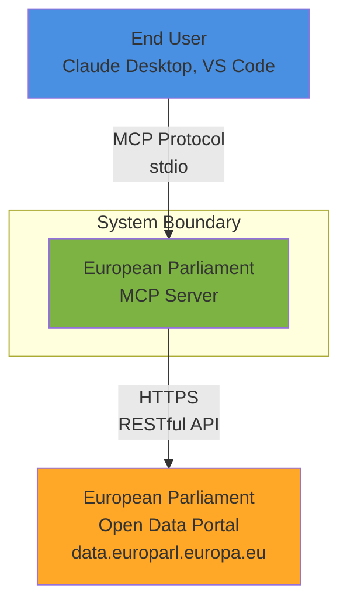
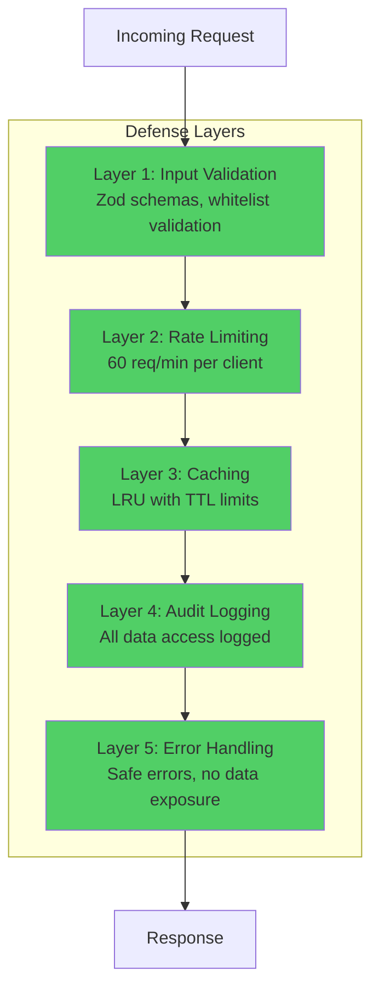
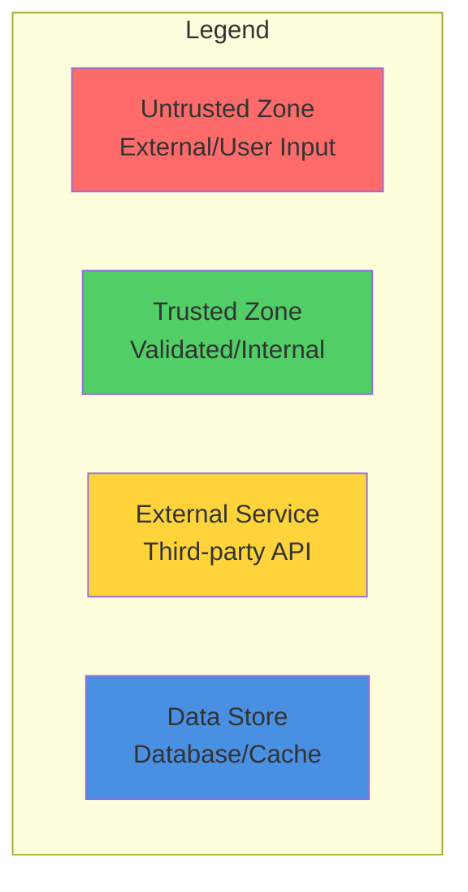
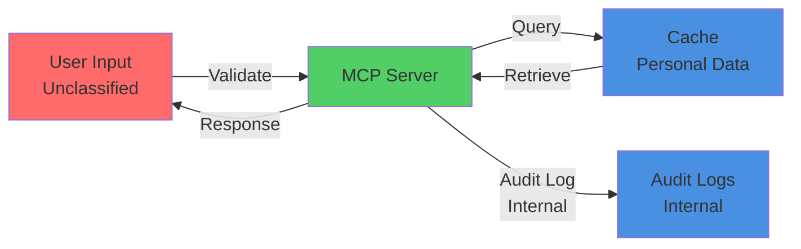
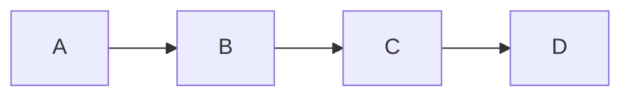

# Architecture Documentation Skill

## Context

This skill applies when:
- Creating SECURITY_ARCHITECTURE.md for new repositories
- Documenting system architecture using C4 model
- Creating Mermaid diagrams for security architecture
- Planning future security architecture (FUTURE_SECURITY_ARCHITECTURE.md)
- Documenting data flows and trust boundaries
- Creating architecture decision records (ADRs)
- Conducting architecture reviews

This skill enforces **[Hack23 Secure Development Policy Section 🏗️](https://github.com/Hack23/ISMS-PUBLIC/blob/main/Secure_Development_Policy.md#architecture-documentation-matrix)** requirements for comprehensive architecture documentation.

## Rules

### 1. C4 Architecture Model (Policy Section 📐)

1. **Level 1 - Context**: System context with external dependencies
2. **Level 2 - Container**: Applications, data stores, microservices
3. **Level 3 - Component**: Internal components within containers
4. **Level 4 - Code**: Implementation details (optional, for critical security)

### 2. Required Documentation Files (Policy Section 🏗️)

5. **SECURITY_ARCHITECTURE.md**: Current security architecture
6. **FUTURE_SECURITY_ARCHITECTURE.md**: Planned security improvements
7. **ARCHITECTURE.md**: General system architecture
8. **DATA_FLOW.md**: Data flow diagrams with classifications
9. **DEPLOYMENT.md**: Deployment architecture and infrastructure

### 3. Mandatory Security Architecture Content (Policy Section 🏗️.3)

10. **Authentication & Authorization**: Auth mechanisms and identity management
11. **Data Protection**: Encryption, data classification, GDPR compliance
12. **Network Security**: Network topology, VPCs, security groups
13. **Audit & Logging**: Logging strategy, audit trails, SIEM integration
14. **Threat Model Integration**: Links to threat model documentation
15. **Compliance Mapping**: ISO 27001, NIST CSF, CIS Controls mapping

### 4. Mermaid Diagram Standards (Policy Section 🏗️)

16. **Color Coding**: Red (untrusted), Green (trusted), Yellow (external), Blue (data)
17. **Trust Boundaries**: Clearly marked trust boundaries
18. **Data Flow**: Direction and data classification labels
19. **Security Controls**: Security controls annotated on diagram
20. **Legend**: Always include legend explaining symbols

## Examples

### ✅ Good Pattern: SECURITY_ARCHITECTURE.md Template

```markdown
# Security Architecture

**Project**: European Parliament MCP Server  
**Classification**: Public with Personal Data  
**Last Updated**: 2026-02-16  
**Review Cycle**: Quarterly

## Executive Summary

The European Parliament MCP Server implements Model Context Protocol to provide secure access to European Parliament open data. Security architecture follows defense-in-depth principles with:
- Input validation at MCP tool boundaries
- GDPR-compliant data handling with 24-hour cache limits
- Audit logging for all personal data access
- Rate limiting to prevent abuse

## C4 Architecture Model

### Level 1: System Context



**External Dependencies**:
- **European Parliament API**: https://data.europarl.europa.eu/api/v2/
- **MCP Clients**: Claude Desktop, VS Code, custom clients

### Level 2: Container Diagram

```mermaid
graph TB
    Client[MCP Client<br/>Untrusted]
    
    subgraph "MCP Server Process"
        Transport[StdioServerTransport<br/>@modelcontextprotocol/sdk]
        Tools[Tool Handlers<br/>search_meps, get_mep]
        Resources[Resource Handlers<br/>ep://meps/{id}]
        Prompts[Prompt Templates]
        Validation[Input Validation<br/>Zod Schemas]
        Cache[LRU Cache<br/>In-Memory]
        Audit[Audit Logger]
    end
    
    EPAPI[European Parliament API<br/>External]
    
    Client -->|JSON-RPC 2.0| Transport
    Transport --> Validation
    Validation --> Tools
    Validation --> Resources
    Validation --> Prompts
    Tools --> Cache
    Tools --> Audit
    Tools -->|HTTPS| EPAPI
    
    style Client fill:#ff6b6b
    style Transport fill:#51cf66
    style Tools fill:#51cf66
    style Resources fill:#51cf66
    style Prompts fill:#51cf66
    style Validation fill:#51cf66
    style Cache fill:#51cf66
    style Audit fill:#51cf66
    style EPAPI fill:#ffd43b
```

### Level 3: Component Diagram (Tool Handler)

```mermaid
graph TB
    Input[MCP Request]
    
    subgraph "search_meps Tool"
        Schema[SearchMEPsSchema<br/>Zod Validation]
        RateLimit[Rate Limiter<br/>60 req/min]
        CacheCheck[Cache Check<br/>LRU]
        APIClient[EP API Client<br/>Undici]
        Transform[Data Transform<br/>EP → MCP Format]
        AuditLog[GDPR Audit Log]
    end
    
    Output[MCP Response]
    
    Input --> Schema
    Schema -->|Valid| RateLimit
    RateLimit --> CacheCheck
    CacheCheck -->|Miss| APIClient
    CacheCheck -->|Hit| Transform
    APIClient --> Transform
    Transform --> AuditLog
    AuditLog --> Output
    
    style Input fill:#4a90e2
    style Schema fill:#51cf66
    style RateLimit fill:#51cf66
    style CacheCheck fill:#51cf66
    style APIClient fill:#ffd43b
    style Transform fill:#51cf66
    style AuditLog fill:#51cf66
    style Output fill:#4a90e2
```



## Authentication & Authorization

**MCP Protocol Security**:
- Transport: stdio (no network exposure, process-level isolation)
- No authentication required (runs in user's local environment)
- Authorization: Process owner has full access

**European Parliament API**:
- Public API (no authentication required)
- Rate limiting via client-side implementation
- HTTPS with certificate validation mandatory

## Data Protection

### Data Classification

| Data Type | Classification | Retention | Encryption |
|-----------|---------------|-----------|------------|
| MEP Names & Roles | Public | Cache 1h | None (public) |
| MEP Email/Phone | Personal Data | Cache 1h | TLS in transit |
| API Responses | Public | Cache 1-24h | TLS in transit |
| Audit Logs | Internal | 1 year | None (no PII in logs) |

### GDPR Compliance

**Data Minimization**: Only collect public parliamentary data  
**Purpose Limitation**: Parliamentary information queries only  
**Storage Limitation**: Max 24-hour cache per GDPR-compliance skill  
**Audit Trail**: All personal data access logged

**Evidence**: [.github/skills/gdpr-compliance/SKILL.md](../gdpr-compliance/SKILL.md)

## Network Security

**Network Architecture**: Node.js process, no inbound network connections

**Communication Channels**:
- stdin/stdout: MCP client communication (local IPC)
- HTTPS outbound: European Parliament API (TLS 1.3)

**Security Controls**:
- No open network ports
- HTTPS certificate validation
- DNS resolution via system resolver

## Audit & Logging

**Audit Events**:
- Tool invocations (tool name, parameters)
- Personal data access (MEP ID, timestamp, purpose)
- Validation failures (invalid inputs, rejected requests)
- API errors (rate limits, timeouts, failures)

**Log Format**: Structured JSON to stderr

```typescript
{
  "timestamp": "2026-02-16T15:30:00.000Z",
  "level": "info",
  "event": "personal_data_access",
  "mepId": 12345,
  "purpose": "MCP tool invocation: search_meps",
  "clientId": "claude-desktop"
}
```

**Retention**: 1 year minimum per ISMS policy

## Threat Model Integration

**Threat Model**: [THREAT_MODEL.md](./THREAT_MODEL.md)

**Key Threats Addressed**:
- **Spoofing**: Process-level isolation via stdio
- **Tampering**: Input validation with Zod schemas
- **Repudiation**: Comprehensive audit logging
- **Information Disclosure**: Safe error handling, no data in errors
- **Denial of Service**: Rate limiting, result size limits
- **Elevation of Privilege**: No privilege boundaries (single-user tool)

## Compliance Mapping

### ISO 27001:2022

| Control | Implementation | Evidence |
|---------|---------------|----------|
| A.8.3 (Handling of assets) | Input validation, data classification | [src/validation/](link) |
| A.8.10 (Information deletion) | Cache TTL, GDPR erasure support | [src/cache.ts](link) |
| A.13.1.1 (Network controls) | HTTPS only, no open ports | [src/api/client.ts](link) |
| A.14.2.5 (Secure system engineering) | Defense-in-depth, threat modeling | [THREAT_MODEL.md](link) |

### NIST CSF 2.0

| Function | Category | Implementation |
|----------|----------|---------------|
| PROTECT | PR.DS-01 (Data Security) | Encryption in transit, GDPR compliance |
| DETECT | DE.CM-01 (Continuous Monitoring) | Audit logging, error monitoring |
| RESPOND | RS.AN-01 (Analysis) | Error analysis, security incident tracking |

### CIS Controls v8.1

| Control | Safeguard | Implementation |
|---------|-----------|---------------|
| 3.3 (Configure Data Access Control Lists) | Basic | Zod validation, least privilege |
| 8.2 (Collect Audit Logs) | Basic | Structured audit logging |
| 16.10 (Apply Secure Design Principles) | Foundational | Defense-in-depth, fail-secure |

## Security Controls Summary



## Future Security Architecture

See: [FUTURE_SECURITY_ARCHITECTURE.md](./FUTURE_SECURITY_ARCHITECTURE.md)

**Planned Improvements**:
1. Redis-based distributed cache (Q2 2026)
2. OAuth 2.0 authentication for multi-user scenarios (Q3 2026)
3. Prometheus metrics endpoint for monitoring (Q2 2026)
4. OWASP ZAP integration in CI/CD (Q1 2026)

## Review & Approval

- [x] Architecture reviewed by Security Team
- [x] Threat model aligned
- [x] Compliance mapping validated
- [x] Defense-in-depth verified

**Last Review**: 2026-02-16  
**Next Review**: 2026-05-16 (Quarterly)  
**Approved By**: Security Team, CEO
```

**Policy Reference**: [Secure Development Policy Section 🏗️](https://github.com/Hack23/ISMS-PUBLIC/blob/main/Secure_Development_Policy.md#architecture-documentation-matrix)

**Evidence**: 
- [CIA SECURITY_ARCHITECTURE.md](https://github.com/Hack23/cia/blob/master/SECURITY_ARCHITECTURE.md)
- [Black Trigram SECURITY_ARCHITECTURE.md](https://github.com/Hack23/blacktrigram/blob/main/SECURITY_ARCHITECTURE.md)

### ✅ Good Pattern: Mermaid Color Coding Standard



**Color Standards**:
- **Red (#ff6b6b)**: Untrusted - user input, external clients
- **Green (#51cf66)**: Trusted - validated components, internal services
- **Yellow (#ffd43b)**: External - third-party APIs, external services
- **Blue (#4a90e2)**: Data - databases, caches, data stores

### ✅ Good Pattern: Data Flow with Classification



## Anti-Patterns

### ❌ Bad: No Security Architecture Documentation

```
README.md exists, but no SECURITY_ARCHITECTURE.md
```

**Why**: Violates Secure Development Policy Section 🏗️ - All repos require security architecture documentation

### ❌ Bad: Diagram Without Trust Boundaries



**Why**: No color coding, no trust boundaries, no security context

## Evidence Portfolio

### Reference Implementations

1. **Citizen Intelligence Agency (CIA)**
   - Security Architecture: https://github.com/Hack23/cia/blob/master/SECURITY_ARCHITECTURE.md
   - C4 Diagrams: https://github.com/Hack23/cia/blob/master/ARCHITECTURE.md
   - Future Architecture: https://github.com/Hack23/cia/blob/master/FUTURE_SECURITY_ARCHITECTURE.md

2. **Black Trigram Game**
   - Security Architecture: https://github.com/Hack23/blacktrigram/blob/main/SECURITY_ARCHITECTURE.md
   - Data Flow: https://github.com/Hack23/blacktrigram/blob/main/DATA_FLOW.md

3. **CIA Compliance Manager**
   - Compliance Architecture: https://github.com/Hack23/cia-compliance-manager/blob/main/SECURITY_ARCHITECTURE.md

### Policy Documents

- **Secure Development Policy Section 🏗️**: https://github.com/Hack23/ISMS-PUBLIC/blob/main/Secure_Development_Policy.md#architecture-documentation-matrix
- **C4 Model**: https://c4model.com/

## Architecture Documentation Checklist

- [ ] SECURITY_ARCHITECTURE.md created with all required sections
- [ ] C4 Level 1 (Context) diagram included
- [ ] C4 Level 2 (Container) diagram included
- [ ] Trust boundaries clearly marked with color coding
- [ ] Authentication & authorization documented
- [ ] Data protection and GDPR compliance documented
- [ ] Network security architecture documented
- [ ] Audit & logging strategy documented
- [ ] Threat model integration referenced
- [ ] Compliance mapping (ISO 27001, NIST CSF, CIS) included
- [ ] Security controls summarized
- [ ] FUTURE_SECURITY_ARCHITECTURE.md created
- [ ] Quarterly review cycle established
- [ ] Architecture approved by security team

## ISMS Compliance

This skill enforces:
- **SD-ARCH-001**: Security architecture documentation requirements
- **SD-ARCH-002**: C4 model implementation standards
- **SD-ARCH-003**: Mermaid diagram standards
- **SD-ARCH-004**: Compliance mapping requirements

**Policy Reference**: [Hack23 Secure Development Policy Section 🏗️](https://github.com/Hack23/ISMS-PUBLIC/blob/main/Secure_Development_Policy.md#architecture-documentation-matrix)
