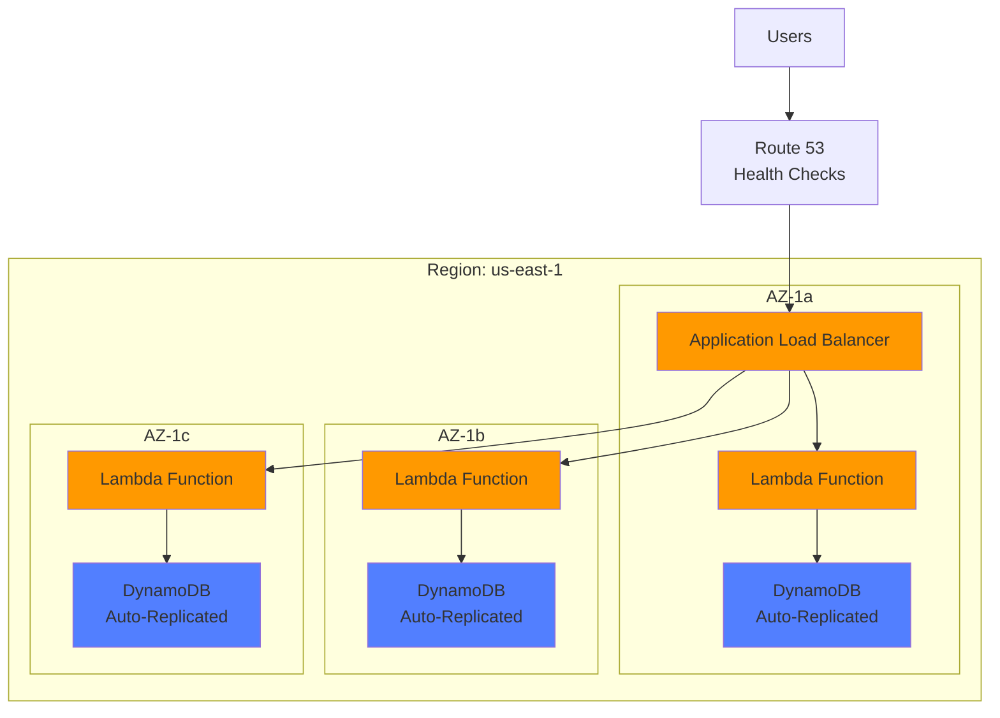

# AWS Security Architecture Skill

## Context

This skill applies when:
- Designing AWS cloud architecture
- Implementing AWS Control Tower objectives
- Following AWS Well-Architected Framework
- Configuring VPC endpoints and private connectivity
- Setting up AWS GuardDuty, Security Hub, CloudTrail
- Implementing high availability and disaster recovery
- Conducting chaos engineering with AWS FIS

This skill enforces **[Hack23 Secure Development Policy AWS sections](https://github.com/Hack23/ISMS-PUBLIC/blob/main/Secure_Development_Policy.md#aws-control-tower-objective-mapping)** for AWS-native security services.

## Rules

### 1. AWS Control Tower Objectives (Policy Section 🎯)

1. **CO.1**: Establish identity and access management (IAM)
2. **CO.2**: Establish network security (VPC, security groups)
3. **CO.3**: Establish data protection (encryption, backups)
4. **CO.4**: Establish detective controls (CloudTrail, GuardDuty)
5. **CO.5-15**: Operational excellence, cost optimization, performance

### 2. AWS Well-Architected Framework (Policy Section 🏛️)

6. **Security Pillar**: Identity, detective controls, infrastructure protection, data protection, incident response
7. **Reliability Pillar**: Foundations, workload architecture, change management, failure management
8. **Operational Excellence**: Organization, prepare, operate, evolve
9. **Performance Efficiency**: Selection, review, monitoring, tradeoffs
10. **Cost Optimization**: Practice Cloud Financial Management, expenditure awareness
11. **Sustainability**: Region selection, user behavior patterns, software patterns, data patterns, hardware patterns

### 3. Network Security (Policy Section 🌐)

12. **Zero Trust Architecture**: Never trust, always verify
13. **VPC Endpoints**: Private connectivity for AWS services
14. **Security Groups**: Least privilege network access
15. **NACLs**: Network layer protection
16. **VPC Flow Logs**: Network traffic monitoring

### 4. Security Monitoring (Policy Section 🔍)

17. **AWS GuardDuty**: Threat detection and continuous monitoring
18. **AWS Security Hub**: Centralized security findings
19. **AWS CloudTrail**: API activity logging and auditing
20. **AWS Config**: Configuration change tracking
21. **Amazon CloudWatch**: Metrics and log aggregation

## Examples

### ✅ Good Pattern: AWS Control Tower Objectives Implementation

```typescript
/**
 * AWS Control Tower Objective CO.1: Identity and Access Management
 * 
 * ISMS Policy: Secure Development Policy Section 🎯
 * Evidence: https://github.com/Hack23/ISMS-PUBLIC/blob/main/Secure_Development_Policy.md#aws-control-tower-objective-mapping
 */

// IAM Policy for Lambda function - Least Privilege
const lambdaExecutionPolicy = {
  Version: '2012-10-17',
  Statement: [
    {
      Sid: 'LoggingPermissions',
      Effect: 'Allow',
      Action: [
        'logs:CreateLogGroup',
        'logs:CreateLogStream',
        'logs:PutLogEvents'
      ],
      Resource: 'arn:aws:logs:*:*:log-group:/aws/lambda/european-parliament-mcp-*'
    },
    {
      Sid: 'SecretsManagerAccess',
      Effect: 'Allow',
      Action: [
        'secretsmanager:GetSecretValue'
      ],
      Resource: 'arn:aws:secretsmanager:*:*:secret:ep-api-credentials-*'
    },
    {
      Sid: 'DynamoDBReadWrite',
      Effect: 'Allow',
      Action: [
        'dynamodb:GetItem',
        'dynamodb:PutItem',
        'dynamodb:Query',
        'dynamodb:UpdateItem'
      ],
      Resource: 'arn:aws:dynamodb:*:*:table/ep-cache'
    }
  ]
};

/**
 * AWS Control Tower Objective CO.2: Network Security
 */

// Security Group - Restrict inbound to Application Load Balancer only
const apiSecurityGroup = {
  ingress: [
    {
      description: 'HTTPS from ALB',
      from_port: 443,
      to_port: 443,
      protocol: 'tcp',
      security_groups: ['sg-alb-12345']  // Only from ALB
    }
  ],
  egress: [
    {
      description: 'HTTPS to European Parliament API',
      from_port: 443,
      to_port: 443,
      protocol: 'tcp',
      cidr_blocks: ['0.0.0.0/0']  // Outbound to internet
    }
  ]
};

/**
 * AWS Control Tower Objective CO.3: Data Protection
 */

// S3 Bucket Encryption
const s3BucketEncryption = {
  bucket: 'ep-mcp-data',
  rule: {
    apply_server_side_encryption_by_default: {
      sse_algorithm: 'aws:kms',
      kms_master_key_id: 'arn:aws:kms:us-east-1:123456789012:key/12345678-1234-1234-1234-123456789012'
    }
  }
};

// DynamoDB Encryption at Rest
const dynamoDBEncryption = {
  table_name: 'ep-cache',
  server_side_encryption: {
    enabled: true,
    kms_key_id: 'arn:aws:kms:us-east-1:123456789012:key/12345678-1234-1234-1234-123456789012'
  }
};

/**
 * AWS Control Tower Objective CO.4: Detective Controls
 */

// Enable CloudTrail for API logging
const cloudTrailConfig = {
  name: 'ep-mcp-trail',
  s3_bucket_name: 'ep-mcp-cloudtrail-logs',
  enable_logging: true,
  include_global_service_events: true,
  is_multi_region_trail: true,
  enable_log_file_validation: true,  // Integrity checking
  event_selectors: [
    {
      read_write_type: 'All',
      include_management_events: true
    }
  ]
};

// Enable GuardDuty
const guardDutyConfig = {
  enable: true,
  finding_publishing_frequency: 'FIFTEEN_MINUTES',
  datasources: {
    s3_logs: { enable: true },
    kubernetes: { audit_logs: { enable: true } },
    malware_protection: { scan_ec2_instance_with_findings: { ebs_volumes: { enable: true } } }
  }
};
```

**Evidence**: [CIA AWS Architecture](https://github.com/Hack23/cia/blob/master/AWS_ARCHITECTURE.md)

### ✅ Good Pattern: VPC Endpoints for Private Connectivity

```typescript
/**
 * VPC Endpoints - Policy Section 🔌
 * Provides private connectivity to AWS services without internet gateway
 * 
 * ISMS Policy: Secure Development Policy Section 🔌
 * Evidence: https://github.com/Hack23/ISMS-PUBLIC/blob/main/Secure_Development_Policy.md#vpc-endpoints--private-connectivity
 */

// VPC Endpoint for DynamoDB (Gateway Endpoint)
const dynamoDBEndpoint = {
  vpc_id: 'vpc-12345678',
  service_name: 'com.amazonaws.us-east-1.dynamodb',
  vpc_endpoint_type: 'Gateway',
  route_table_ids: ['rtb-12345678', 'rtb-87654321']
};

// VPC Endpoint for Secrets Manager (Interface Endpoint)
const secretsManagerEndpoint = {
  vpc_id: 'vpc-12345678',
  service_name: 'com.amazonaws.us-east-1.secretsmanager',
  vpc_endpoint_type: 'Interface',
  subnet_ids: ['subnet-12345678', 'subnet-87654321'],
  security_group_ids: ['sg-12345678'],
  private_dns_enabled: true
};

// VPC Endpoint for S3 (Gateway Endpoint)
const s3Endpoint = {
  vpc_id: 'vpc-12345678',
  service_name: 'com.amazonaws.us-east-1.s3',
  vpc_endpoint_type: 'Gateway',
  route_table_ids: ['rtb-12345678', 'rtb-87654321'],
  policy: JSON.stringify({
    Version: '2012-10-17',
    Statement: [
      {
        Effect: 'Allow',
        Principal: '*',
        Action: ['s3:GetObject', 's3:PutObject'],
        Resource: 'arn:aws:s3:::ep-mcp-data/*'
      }
    ]
  })
};
```

**Policy Reference**: [Secure Development Policy Section 🔌](https://github.com/Hack23/ISMS-PUBLIC/blob/main/Secure_Development_Policy.md#vpc-endpoints--private-connectivity)

### ✅ Good Pattern: High Availability Architecture



**RTO/RPO**:
- RTO (Recovery Time Objective): 5 minutes
- RPO (Recovery Point Objective): 0 (real-time replication)

**Evidence**: [Black Trigram HA Architecture](https://github.com/Hack23/blacktrigram/blob/main/HA_ARCHITECTURE.md)

### ✅ Good Pattern: AWS Resilience Hub Assessment

```typescript
/**
 * AWS Resilience Hub Integration
 * 
 * ISMS Policy: Secure Development Policy Section ⚡
 * Evidence: https://github.com/Hack23/ISMS-PUBLIC/blob/main/Secure_Development_Policy.md#resilience--operational-readiness-framework
 */

const resilienceAssessment = {
  applicationName: 'european-parliament-mcp-server',
  resiliencyPolicy: {
    tier: 'MissionCritical',  // Or: Important, CoreServices, NonCritical
    rto: 300,  // 5 minutes
    rpo: 0,    // Real-time
  },
  assessmentSchedule: 'Daily',
  recommendations: [
    'Enable multi-AZ deployment',
    'Configure DynamoDB global tables for cross-region',
    'Implement automated failover with Route 53',
    'Add chaos engineering tests with AWS FIS'
  ]
};

// Chaos Engineering with AWS Fault Injection Simulator (FIS)
const fisExperiment = {
  description: 'Test Lambda function resilience to AZ failure',
  actions: {
    'stop-az-instances': {
      actionId: 'aws:ec2:stop-instances',
      parameters: {
        availabilityZoneIdentifier: 'us-east-1a',
        duration: 'PT5M'  // 5 minutes
      },
      targets: {
        instances: 'lambda-execution-environment'
      }
    }
  },
  stopConditions: [
    {
      source: 'aws:cloudwatch:alarm',
      value: 'arn:aws:cloudwatch:us-east-1:123456789012:alarm:HighErrorRate'
    }
  ],
  roleArn: 'arn:aws:iam::123456789012:role/FISExperimentRole'
};
```

**Policy Reference**: [Secure Development Policy Section ⚡](https://github.com/Hack23/ISMS-PUBLIC/blob/main/Secure_Development_Policy.md#resilience--operational-readiness-framework)

### ✅ Good Pattern: Data Protection & Backup Strategy

```typescript
/**
 * Centralized Backup Management with AWS Backup
 * 
 * ISMS Policy: Secure Development Policy Section 💾
 * Evidence: https://github.com/Hack23/ISMS-PUBLIC/blob/main/Secure_Development_Policy.md#data-protection--backup-strategy
 */

const backupPlan = {
  plan_name: 'ep-mcp-backup-plan',
  rules: [
    {
      rule_name: 'daily-backup',
      target_vault_name: 'ep-mcp-backup-vault',
      schedule: 'cron(0 2 * * ? *)',  // 2 AM UTC daily
      lifecycle: {
        delete_after: 90,  // 90 days retention
        move_to_cold_storage_after: 30  // Archive after 30 days
      },
      recovery_point_tags: {
        Environment: 'production',
        Application: 'european-parliament-mcp-server'
      }
    }
  ],
  selections: [
    {
      name: 'dynamodb-backup-selection',
      resources: ['arn:aws:dynamodb:*:*:table/ep-cache']
    },
    {
      name: 's3-backup-selection',
      resources: ['arn:aws:s3:::ep-mcp-data']
    }
  ]
};

// Service-native backup for DynamoDB
const dynamoDBBackup = {
  table_name: 'ep-cache',
  point_in_time_recovery: {
    enabled: true  // Continuous backups, 35-day retention
  }
};
```

## Anti-Patterns

### ❌ Bad: Public S3 Bucket

```typescript
const badS3Bucket = {
  bucket: 'ep-data',
  acl: 'public-read'  // NEVER! Violates AWS best practices
};
```

### ❌ Bad: Overly Permissive IAM Policy

```typescript
const badIAMPolicy = {
  Effect: 'Allow',
  Action: '*',  // NEVER! Violates least privilege
  Resource: '*'
};
```

## Evidence Portfolio

### Reference Implementations

1. **Citizen Intelligence Agency (CIA)**
   - AWS Architecture: https://github.com/Hack23/cia/blob/master/AWS_ARCHITECTURE.md
   - Terraform: https://github.com/Hack23/cia/tree/master/terraform

2. **Black Trigram Game**
   - HA Architecture: https://github.com/Hack23/blacktrigram/blob/main/HA_ARCHITECTURE.md
   - AWS CDK: https://github.com/Hack23/blacktrigram/tree/main/cdk

3. **CIA Compliance Manager**
   - Compliance AWS Setup: https://github.com/Hack23/cia-compliance-manager/blob/main/AWS_SETUP.md

### Policy Documents

- **Secure Development Policy AWS Sections**: https://github.com/Hack23/ISMS-PUBLIC/blob/main/Secure_Development_Policy.md#aws-control-tower-objective-mapping
- **AWS Well-Architected Framework**: https://docs.aws.amazon.com/wellarchitected/latest/framework/welcome.html

## ISMS Compliance

This skill enforces:
- **SD-AWS-001**: AWS Control Tower objectives
- **SD-AWS-002**: Well-Architected Framework alignment
- **SD-AWS-003**: VPC security and private connectivity
- **SD-AWS-004**: Security monitoring with GuardDuty/Security Hub
- **SD-AWS-005**: High availability and resilience

**Policy Reference**: [Hack23 Secure Development Policy AWS Sections](https://github.com/Hack23/ISMS-PUBLIC/blob/main/Secure_Development_Policy.md#aws-control-tower-objective-mapping)
