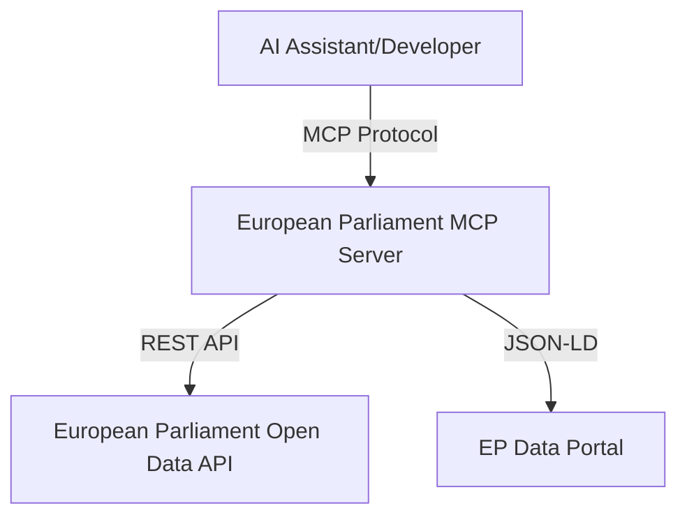
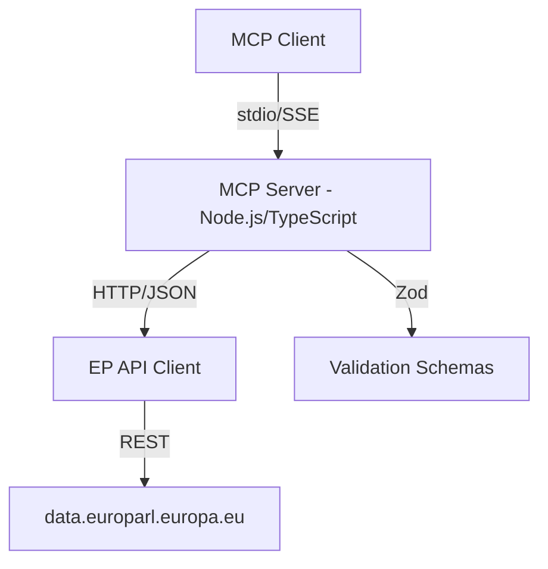
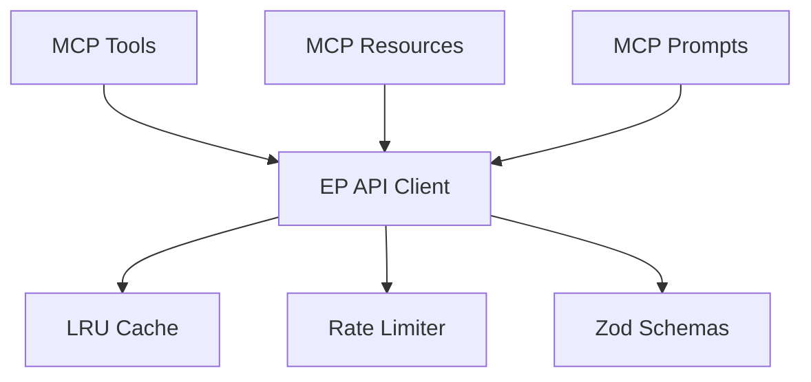

# C4 Architecture Documentation Skill

## Purpose

Document MCP server architecture using C4 model for different abstraction levels with Mermaid diagrams.

## When to Use

- ✅ Documenting system architecture (ARCHITECTURE.md)
- ✅ Security architecture documentation (SECURITY_ARCHITECTURE.md)
- ✅ Future architecture planning (FUTURE_ARCHITECTURE.md)
- ✅ Architecture decision records
- ✅ Onboarding new developers

## Required Documentation Portfolio

### Current State

| Document | Purpose |
|----------|---------|
| ARCHITECTURE.md | Complete C4 models (Context, Container, Component) |
| DATA_MODEL.md | Data structures, entities, relationships |
| FLOWCHART.md | Business process and data flows |
| STATEDIAGRAM.md | System state transitions and lifecycles |
| MINDMAP.md | System conceptual relationships |
| SWOT.md | Strategic analysis and positioning |
| SECURITY_ARCHITECTURE.md | Current security design and controls |

### Future State

| Document | Purpose |
|----------|---------|
| FUTURE_ARCHITECTURE.md | Architectural evolution roadmap |
| FUTURE_DATA_MODEL.md | Enhanced data architecture plans |
| FUTURE_FLOWCHART.md | Improved process workflows |
| FUTURE_STATEDIAGRAM.md | Advanced state management |
| FUTURE_MINDMAP.md | Capability expansion plans |
| FUTURE_SWOT.md | Future strategic opportunities |
| FUTURE_SECURITY_ARCHITECTURE.md | Planned security improvements |

## C4 Model Levels

### Level 1: System Context

### Level 2: Container Diagram

### Level 3: Component Diagram

## Mermaid Diagram Standards

- Use `graph TB` for top-bottom flow diagrams
- Use `sequenceDiagram` for interaction flows
- Use `stateDiagram-v2` for state machines
- Use `mindmap` for conceptual relationships
- Include legends and descriptions

## ISMS Policy References

- [Secure Development Policy](https://github.com/Hack23/ISMS-PUBLIC/blob/main/Secure_Development_Policy.md) - Architecture documentation requirements
- [Information Security Policy](https://github.com/Hack23/ISMS-PUBLIC/blob/main/Information_Security_Policy.md) - Security architecture governance
