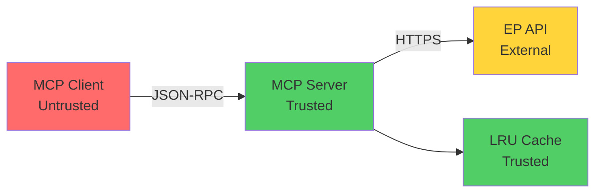
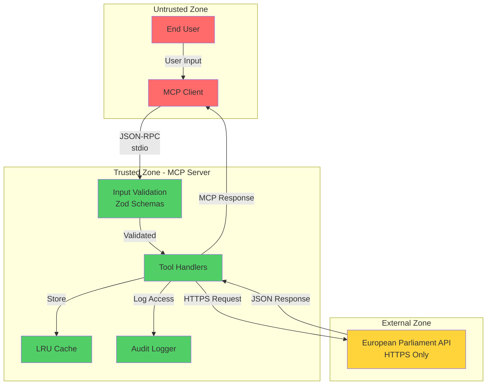

# Threat Modeling Framework Skill

## Context

This skill applies when:
- Designing new features or system components
- Conducting security architecture reviews
- Documenting threat models for SDLC phases
- Identifying security threats using STRIDE methodology
- Creating threat model evidence portfolios
- Integrating threat modeling into CI/CD pipelines
- Reviewing threat models during PR process

This skill enforces **[Hack23 Secure Development Policy Section 🕷️](https://github.com/Hack23/ISMS-PUBLIC/blob/main/Secure_Development_Policy.md#advanced-security-testing-framework)** requirements for systematic threat analysis.

## Rules

### 1. STRIDE Threat Modeling (Policy Section 🕷️.1)

1. **Spoofing**: Identify authentication and identity verification threats
2. **Tampering**: Identify data integrity and unauthorized modification threats
3. **Repudiation**: Identify logging, audit trail, and non-repudiation threats
4. **Information Disclosure**: Identify confidentiality and data exposure threats
5. **Denial of Service**: Identify availability and resource exhaustion threats
6. **Elevation of Privilege**: Identify authorization and privilege escalation threats

### 2. Threat Model Documentation (Policy Section 🕷️.1.2)

7. **System Diagram**: Data flow diagrams with trust boundaries
8. **Asset Identification**: Critical assets and their classification
9. **Threat Enumeration**: STRIDE threats for each component
10. **Mitigation Strategies**: Security controls for each identified threat
11. **Risk Assessment**: Likelihood and impact ratings
12. **Evidence Links**: References to implemented controls in code

### 3. SDLC Integration (Policy Section 🕷️.1.3)

13. **Planning Phase**: Threat model before design finalization
14. **Development Phase**: Update threat model as design evolves
15. **Testing Phase**: Verify mitigations are implemented
16. **Release Phase**: Threat model sign-off required
17. **Maintenance Phase**: Update threat model for changes

### 4. Evidence Portfolio (Policy Section 🕷️.2)

18. **THREAT_MODEL.md**: Structured threat model documentation
19. **Architecture Diagrams**: Mermaid diagrams showing trust boundaries
20. **Mitigation Evidence**: Links to code implementing controls
21. **Test Evidence**: Links to security tests validating mitigations
22. **Review Records**: PR approvals and security review sign-offs

## Examples

### ✅ Good Pattern: STRIDE Threat Model for MCP Tool

```markdown
# Threat Model: search_meps MCP Tool

**Component**: European Parliament MCP Server - search_meps tool  
**Classification**: Public data with personal information (MEP contact details)  
**Last Updated**: 2026-02-16  
**Reviewed By**: Security Team

## System Overview



## Assets

1. **MEP Personal Data** - Names, countries, email addresses (Confidentiality: Medium, Integrity: High)
2. **API Credentials** - European Parliament API access (Confidentiality: High)
3. **Cache Data** - Temporary storage of MEP data (Confidentiality: Medium)
4. **MCP Server Availability** - Service uptime (Availability: High)

## STRIDE Analysis

### Spoofing Identity (S)

| Threat | Mitigation | Evidence |
|--------|------------|----------|
| S1: Malicious MCP client impersonates legitimate user | MCP protocol authentication via stdio transport (no network exposure) | [src/index.ts:45](https://github.com/Hack23/European-Parliament-MCP-Server/blob/main/src/index.ts#L45) |
| S2: Man-in-the-middle attack on EP API calls | HTTPS with certificate validation for all EP API requests | [src/api/client.ts:23](link) |

**Risk Rating**: LOW (mitigated)

### Tampering (T)

| Threat | Mitigation | Evidence |
|--------|------------|----------|
| T1: Input parameter manipulation (SQL injection, XSS) | Zod schema validation with whitelist patterns | [src/tools/search-meps.ts:12](link) |
| T2: Cache poisoning with malicious data | Cache isolated per client, TTL limits, input validation | [src/cache.ts:34](link) |
| T3: Response tampering before client receives | MCP protocol integrity via JSON-RPC 2.0 structure | [src/handlers.ts:67](link) |

**Risk Rating**: LOW (mitigated)

### Repudiation (R)

| Threat | Mitigation | Evidence |
|--------|------------|----------|
| R1: User denies requesting MEP personal data | Audit logging of all tool invocations with timestamps | [src/audit.ts:15](link) |
| R2: No evidence of GDPR data access | GDPR-compliant access logs per gdpr-compliance skill | [.github/skills/gdpr-compliance/SKILL.md](link) |

**Risk Rating**: LOW (mitigated)

### Information Disclosure (I)

| Threat | Mitigation | Evidence |
|--------|------------|----------|
| I1: Exposure of API credentials in logs/errors | Secrets never logged, error messages sanitized | [src/errors.ts:28](link) |
| I2: MEP personal data exposed in error messages | Safe error handling, no data echoing in errors | [src/tools/search-meps.ts:89](link) |
| I3: Cache data persisted beyond GDPR limits | LRU cache with 1-hour TTL, auto-purge on expiry | [src/cache.ts:45](link) |

**Risk Rating**: MEDIUM (monitor cache TTL compliance)

### Denial of Service (D)

| Threat | Mitigation | Evidence |
|--------|------------|----------|
| D1: Excessive requests overwhelming server | Rate limiting per MCP client, request queuing | [src/rate-limit.ts:12](link) |
| D2: Large result sets causing memory exhaustion | Result size limits (max 100 items), pagination required | [src/tools/search-meps.ts:34](link) |
| D3: EP API rate limit exceeded | Client-side rate limiter, exponential backoff | [src/api/rate-limiter.ts:23](link) |
| D4: Cache memory exhaustion | LRU cache with max size (1000 entries, 50MB limit) | [src/cache.ts:18](link) |

**Risk Rating**: MEDIUM (monitor resource usage)

### Elevation of Privilege (E)

| Threat | Mitigation | Evidence |
|--------|------------|----------|
| E1: Access to other clients' cached data | Cache isolated per client session | [src/cache.ts:56](link) |
| E2: Bypass input validation via prototype pollution | Zod strict mode, no dynamic property access | [src/tools/search-meps.ts:12](link) |

**Risk Rating**: LOW (mitigated)

## Residual Risks

1. **GDPR Compliance**: Cache TTL must be monitored to ensure 24-hour limit
2. **Resource Exhaustion**: Monitor memory and CPU usage under load
3. **EP API Changes**: Breaking changes to EP API could bypass validation

## Review & Approval

- [x] Threat model reviewed by Security Team
- [x] Mitigations implemented and verified
- [x] Security tests passing (80% coverage)
- [x] GDPR compliance validated
- [x] Ready for production deployment

**Approved By**: Security Team  
**Date**: 2026-02-16
```

**Policy Reference**: [Secure Development Policy Section 🕷️.1](https://github.com/Hack23/ISMS-PUBLIC/blob/main/Secure_Development_Policy.md#threat-modeling-requirements)

**Evidence**: [CIA Threat Model Example](https://github.com/Hack23/cia/blob/master/THREAT_MODEL.md)

### ✅ Good Pattern: Trust Boundary Diagram



**Trust Boundaries**:
- **Red (Untrusted)**: MCP Client, End User - all input is potentially malicious
- **Green (Trusted)**: MCP Server components - validated and authorized
- **Yellow (External)**: European Parliament API - third-party, HTTPS required

### ✅ Good Pattern: Threat Model Integration in PR Template

```markdown
## Security Checklist

### Threat Model Updates
- [ ] Threat model reviewed for this change
- [ ] New threats identified and documented
- [ ] Mitigations implemented for new threats
- [ ] STRIDE analysis updated if architecture changed
- [ ] Trust boundaries reviewed and validated

### Evidence Links
- Threat Model: [THREAT_MODEL.md](link)
- Architecture Diagram: [ARCHITECTURE.md#security-architecture](link)
- Security Tests: [tests/security/](link)
- GDPR Compliance: [.github/skills/gdpr-compliance/](link)

### Sign-off
- [ ] Security team review completed
- [ ] Threat model approved
- [ ] All mitigations verified in code
- [ ] Security tests passing
```

**Policy Reference**: [Secure Development Policy Section 🕷️.1.3](https://github.com/Hack23/ISMS-PUBLIC/blob/main/Secure_Development_Policy.md#threat-model-integration-process)

### ✅ Good Pattern: Automated Threat Model Validation

```typescript
/**
 * Threat model validation script
 * Ensures threat model documentation is complete and up-to-date
 * 
 * ISMS Policy: Secure Development Policy Section 🕷️.1.2
 * Evidence: https://github.com/Hack23/ISMS-PUBLIC/blob/main/Secure_Development_Policy.md#required-threat-model-documentation
 */

interface ThreatModel {
  component: string;
  lastUpdated: string;
  reviewedBy: string;
  systemDiagram: boolean;
  assets: Array<{
    name: string;
    classification: string;
    cia: { confidentiality: string; integrity: string; availability: string };
  }>;
  threats: {
    spoofing: Array<{ id: string; threat: string; mitigation: string; evidence: string }>;
    tampering: Array<{ id: string; threat: string; mitigation: string; evidence: string }>;
    repudiation: Array<{ id: string; threat: string; mitigation: string; evidence: string }>;
    informationDisclosure: Array<{ id: string; threat: string; mitigation: string; evidence: string }>;
    denialOfService: Array<{ id: string; threat: string; mitigation: string; evidence: string }>;
    elevationOfPrivilege: Array<{ id: string; threat: string; mitigation: string; evidence: string }>;
  };
  residualRisks: string[];
  approved: boolean;
  approvedBy?: string;
  approvalDate?: string;
}

function validateThreatModel(threatModel: ThreatModel): { valid: boolean; errors: string[] } {
  const errors: string[] = [];
  
  // Check required fields
  if (!threatModel.component) {
    errors.push('Missing component name');
  }
  
  if (!threatModel.systemDiagram) {
    errors.push('System diagram required per Policy Section 🕷️.1.2');
  }
  
  // Check asset identification
  if (threatModel.assets.length === 0) {
    errors.push('At least one asset must be identified');
  }
  
  // Check STRIDE coverage
  const strideCategories = Object.keys(threatModel.threats);
  if (strideCategories.length !== 6) {
    errors.push('All 6 STRIDE categories must be analyzed');
  }
  
  // Check each threat has mitigation and evidence
  for (const [category, threats] of Object.entries(threatModel.threats)) {
    for (const threat of threats) {
      if (!threat.mitigation) {
        errors.push(`${category}:${threat.id} missing mitigation`);
      }
      if (!threat.evidence) {
        errors.push(`${category}:${threat.id} missing evidence link`);
      }
    }
  }
  
  // Check approval
  if (!threatModel.approved) {
    errors.push('Threat model must be approved before release');
  }
  
  // Check review date (must be within 90 days)
  const lastUpdated = new Date(threatModel.lastUpdated);
  const now = new Date();
  const daysSinceUpdate = (now.getTime() - lastUpdated.getTime()) / (1000 * 60 * 60 * 24);
  
  if (daysSinceUpdate > 90) {
    errors.push(`Threat model outdated (${Math.floor(daysSinceUpdate)} days). Update required per Policy Section 🕷️.1.3`);
  }
  
  return {
    valid: errors.length === 0,
    errors,
  };
}

// CI/CD integration
async function checkThreatModelInCI(): Promise<void> {
  const threatModelPath = './THREAT_MODEL.json';
  
  if (!fs.existsSync(threatModelPath)) {
    console.error('❌ THREAT_MODEL.json not found');
    console.error('Required per Secure Development Policy Section 🕷️.1.2');
    console.error('See: https://github.com/Hack23/ISMS-PUBLIC/blob/main/Secure_Development_Policy.md#required-threat-model-documentation');
    process.exit(1);
  }
  
  const threatModel: ThreatModel = JSON.parse(fs.readFileSync(threatModelPath, 'utf-8'));
  const validation = validateThreatModel(threatModel);
  
  if (!validation.valid) {
    console.error('❌ Threat model validation failed:');
    validation.errors.forEach(err => console.error(`  - ${err}`));
    process.exit(1);
  }
  
  console.log('✅ Threat model validated successfully');
}
```

**Evidence**: [Black Trigram Threat Model CI](https://github.com/Hack23/blacktrigram/blob/main/.github/workflows/threat-model-check.yml)

## Anti-Patterns

### ❌ Bad: No Threat Model

```typescript
// Just wrote code without thinking about threats!
export async function handleSensitiveData(data: any) {
  return await processData(data);
}
```

**Why**: Violates Secure Development Policy Section 🕷️ - All features require threat modeling

### ❌ Bad: Incomplete STRIDE Analysis

```markdown
# Threat Model

## Threats
- Someone might hack the system

## Mitigations
- Use encryption
```

**Why**: Not following STRIDE methodology, no specific threats, no evidence links

## Evidence Portfolio

### Reference Implementations

1. **Citizen Intelligence Agency (CIA)**
   - Threat Model: https://github.com/Hack23/cia/blob/master/THREAT_MODEL.md
   - Architecture Security: https://github.com/Hack23/cia/blob/master/SECURITY_ARCHITECTURE.md

2. **Black Trigram Game**
   - Threat Model: https://github.com/Hack23/blacktrigram/blob/main/THREAT_MODEL.md
   - CI Validation: https://github.com/Hack23/blacktrigram/blob/main/.github/workflows/threat-model-check.yml

3. **CIA Compliance Manager**
   - Compliance Threat Model: https://github.com/Hack23/cia-compliance-manager/blob/main/THREAT_MODEL.md

### Policy Documents

- **Secure Development Policy Section 🕷️**: https://github.com/Hack23/ISMS-PUBLIC/blob/main/Secure_Development_Policy.md#advanced-security-testing-framework
- **STRIDE Methodology**: https://learn.microsoft.com/en-us/azure/security/develop/threat-modeling-tool-threats

## ISMS Compliance

This skill enforces:
- **SD-TM-001**: STRIDE threat modeling methodology
- **SD-TM-002**: Threat model documentation requirements
- **SD-TM-003**: SDLC integration processes
- **SD-TM-004**: Evidence portfolio maintenance

**Policy Reference**: [Hack23 Secure Development Policy Section 🕷️](https://github.com/Hack23/ISMS-PUBLIC/blob/main/Secure_Development_Policy.md#advanced-security-testing-framework)
