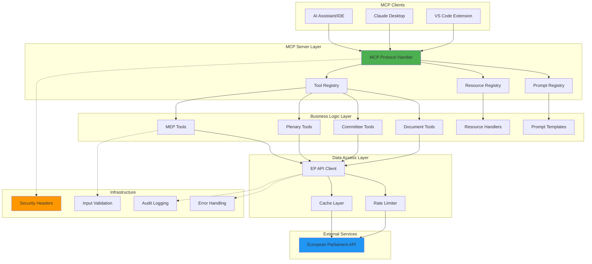
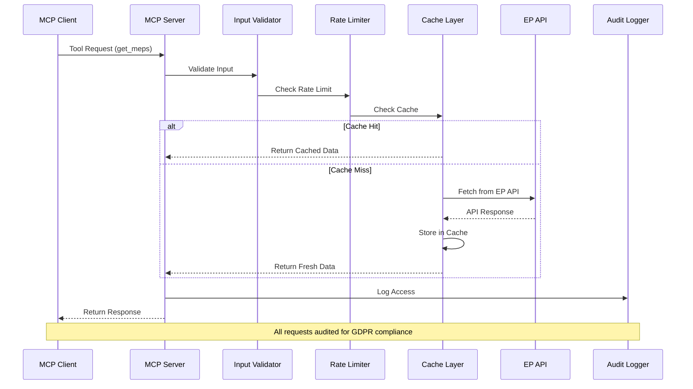

<p align="center">
  
</p>

<h1 align="center">🏛️ European Parliament MCP Server</h1>

<p align="center">
  <strong>Model Context Protocol Server for European Parliament Open Data</strong><br>
  <em>Providing structured access to parliamentary datasets via MCP protocol</em>
</p>

<p align="center">
  <a href="#"></a>
  <a href="#"></a>
  <a href="#"></a>
  <a href="#"></a>
</p>

**📋 Document Owner:** Architecture Team | **📄 Version:** 1.0 | **📅 Last Updated:** 2026-02-20 (UTC)  
**🔄 Review Cycle:** Quarterly | **⏰ Next Review:** 2026-05-20  
**🏷️ Classification:** Public (Open Source MCP Server)

---

## 📋 Table of Contents

- [Overview](#overview)
- [Architecture Overview](#architecture-overview)
- [MCP Protocol Implementation](#mcp-protocol-implementation)
- [Tool Implementation Patterns](#tool-implementation-patterns)
- [Caching Strategy](#caching-strategy)
- [European Parliament Data Sources](#european-parliament-data-sources)
- [Security Architecture](#security-architecture)
- [Technology Stack](#technology-stack)
- [Component Design](#component-design)
- [Data Flow](#data-flow)
- [API Design](#api-design)
- [Performance Considerations](#performance-considerations)
- [ISMS Compliance](#isms-compliance)
- [Future Roadmap](#future-roadmap)

📊 **[See complete architecture diagrams →](./ARCHITECTURE_DIAGRAMS.md)**

---

## 🎯 Overview

The European Parliament MCP Server is a **Model Context Protocol (MCP)** implementation that provides structured access to European Parliament open datasets. It enables AI assistants and other MCP clients to query parliamentary data including MEPs, plenary sessions, committees, legislative documents, and parliamentary questions.

### Key Features

- 🔌 **MCP Protocol**: Full implementation of Model Context Protocol for AI integration
- 🏛️ **European Parliament Data**: Access to comprehensive parliamentary datasets
- 🔒 **Security First**: ISMS-compliant, GDPR-ready, SLSA Level 3
- 🚀 **Performance**: Caching, rate limiting, <200ms API response times
- 📊 **Type Safety**: TypeScript with Zod runtime validation
- 🧪 **Well-Tested**: 80%+ test coverage (95% for security code)

---

## 🏗️ Architecture Overview



---

## 🔌 MCP Protocol Implementation

### Protocol Components

The MCP server implements three core protocol features:

#### 1. **Tools** (Function Calling)
Tools allow clients to execute specific actions on European Parliament data.

```typescript
// Example: Get MEP Information Tool
{
  name: "get_meps",
  description: "Retrieve information about Members of European Parliament",
  inputSchema: {
    type: "object",
    properties: {
      country: { type: "string", description: "ISO country code (e.g., 'SE')" },
      group: { type: "string", description: "Political group" },
      limit: { type: "number", minimum: 1, maximum: 100, default: 50 }
    }
  }
}
```

#### 2. **Resources** (Data Access)
Resources provide read access to specific data entities via URIs.

```typescript
// Example: MEP Resource
{
  uri: "ep://meps/{id}",
  name: "MEP Profile",
  description: "Detailed information about a specific MEP",
  mimeType: "application/json"
}
```

#### 3. **Prompts** (Templates)
Prompts provide pre-configured query templates for common use cases.

```typescript
// Example: Legislative Analysis Prompt
{
  name: "analyze_legislation",
  description: "Analyze legislative procedure and voting patterns",
  arguments: [
    { name: "procedure_id", description: "Legislative procedure ID", required: true }
  ]
}
```

---

## 🏛️ European Parliament Data Sources

### Primary Data Source

- **Base URL**: `https://data.europarl.europa.eu/api/v2/`
- **Documentation**: https://data.europarl.europa.eu/en/developer-corner
- **Data Format**: JSON-LD, RDF/XML, Turtle
- **Update Frequency**: Real-time to daily (varies by dataset)

### Available Datasets

#### 1. **MEPs (Members of European Parliament)**
- Current and historical members
- Personal information, contact details
- Political group affiliations
- Committee memberships
- Parliamentary activities

#### 2. **Plenary Sessions**
- Session schedules and agendas
- Voting records and results
- Attendance tracking
- Debate transcripts

#### 3. **Committees**
- Committee composition
- Meeting schedules
- Working documents
- Reports and opinions

#### 4. **Legislative Documents**
- Bills and resolutions
- Amendments
- Legislative procedures
- Consolidated texts

#### 5. **Parliamentary Questions**
- Written questions
- Oral questions
- Question time transcripts
- Responses and answers

---

## 🔒 Security Architecture

### Defense in Depth

```mermaid
graph LR
    A[Client Request] --> B[TLS/HTTPS]
    B --> C[Rate Limiting]
    C --> D[Authentication]
    D --> E[Input Validation]
    E --> F[Authorization]
    F --> G[Data Access]
    G --> H[Audit Logging]
    H --> I[Response Sanitization]
    I --> J[Security Headers]
    J --> K[Client Response]
    
    style C fill:#FF9800
    style E fill:#FF9800
    style H fill:#FF9800
    style J fill:#FF9800
```



### Security Layers

#### 1. **Transport Security**
- TLS 1.3 minimum
- HSTS with 1-year max-age
- Certificate pinning recommended

#### 2. **Rate Limiting**
- 100 requests per 15 minutes per IP
- Token bucket algorithm
- Graceful degradation

#### 3. **Input Validation**
- Zod schema validation
- Type-safe parsing
- SQL injection prevention
- XSS protection

#### 4. **Authentication & Authorization**
- API key authentication
- OAuth 2.0 support (future)
- Role-based access control
- Principle of least privilege

#### 5. **Data Protection (GDPR)**
- Data minimization
- Purpose limitation
- Storage limitation
- Right to erasure support
- Audit trail for personal data access

#### 6. **Security Headers**
See [SECURITY_HEADERS.md](./SECURITY_HEADERS.md) for complete implementation.

---

## 🛠️ Technology Stack

### Core Technologies

| Component | Technology | Version | Purpose |
|-----------|-----------|---------|---------|
| Runtime | Node.js | 24.x | JavaScript runtime |
| Language | TypeScript | 5.x | Type-safe development |
| Protocol | MCP SDK | Latest | Model Context Protocol |
| Validation | Zod | 3.x | Runtime schema validation |
| HTTP Client | Undici | Latest | Fast HTTP/1.1 client |
| Testing | Vitest | Latest | Unit testing framework |
| Linting | ESLint | 9.x | Code quality |

### Development Tools

| Tool | Purpose |
|------|---------|
| tsx | TypeScript execution |
| tsc | TypeScript compilation |
| prettier | Code formatting |
| knip | Unused dependency detection |
| npm-audit | Security vulnerability scanning |

### Security Tools

| Tool | Purpose |
|------|---------|
| CodeQL | Static security analysis |
| Dependabot | Automated dependency updates |
| OSSF Scorecard | Supply chain security |
| Syft | SBOM generation |
| Grype | Vulnerability scanning |

---

## 🧩 Component Design

### 1. MCP Server Core

```typescript
// src/server.ts
import { Server } from '@modelcontextprotocol/sdk/server/index.js';
import { StdioServerTransport } from '@modelcontextprotocol/sdk/server/stdio.js';

export class EuropeanParliamentMCPServer {
  private server: Server;
  
  constructor() {
    this.server = new Server({
      name: 'european-parliament-mcp-server',
      version: '1.0.0'
    }, {
      capabilities: {
        tools: {},
        resources: {},
        prompts: {}
      }
    });
    
    this.registerTools();
    this.registerResources();
    this.registerPrompts();
  }
  
  async start() {
    const transport = new StdioServerTransport();
    await this.server.connect(transport);
  }
}
```

### 2. Tool Implementation

```typescript
// src/tools/getMEPs.ts
import { z } from 'zod';
import { Tool } from '../types/mcp';

const GetMEPsSchema = z.object({
  country: z.string().length(2).optional(),
  group: z.string().optional(),
  limit: z.number().min(1).max(100).default(50)
});

export const getMEPsTool: Tool = {
  name: 'get_meps',
  description: 'Get Members of European Parliament',
  inputSchema: zodToJsonSchema(GetMEPsSchema),
  
  async handler(args) {
    const params = GetMEPsSchema.parse(args);
    const meps = await fetchMEPsFromAPI(params);
    
    return {
      content: [{
        type: 'text',
        text: JSON.stringify(meps, null, 2)
      }]
    };
  }
};
```

### 3. European Parliament API Client

```typescript
// src/clients/europeanParliamentClient.ts
import { fetch } from 'undici';
import { LRUCache } from 'lru-cache';

export class EuropeanParliamentClient {
  private cache: LRUCache<string, unknown>;
  private baseURL = 'https://data.europarl.europa.eu/api/v2/';
  
  constructor() {
    this.cache = new LRUCache({
      max: 500,
      ttl: 1000 * 60 * 15, // 15 minutes
      allowStale: false
    });
  }
  
  async get<T>(endpoint: string, params?: Record<string, unknown>): Promise<T> {
    const cacheKey = this.getCacheKey(endpoint, params);
    
    // Check cache
    const cached = this.cache.get(cacheKey);
    if (cached) return cached as T;
    
    // Fetch from API
    const url = new URL(endpoint, this.baseURL);
    if (params) {
      Object.entries(params).forEach(([key, value]) => {
        url.searchParams.append(key, String(value));
      });
    }
    
    const response = await fetch(url, {
      headers: {
        'Accept': 'application/json',
        'User-Agent': 'European-Parliament-MCP-Server/1.0'
      }
    });
    
    if (!response.ok) {
      throw new APIError(`API request failed: ${response.statusText}`, response.status);
    }
    
    const data = await response.json() as T;
    this.cache.set(cacheKey, data);
    
    return data;
  }
  
  private getCacheKey(endpoint: string, params?: Record<string, unknown>): string {
    return JSON.stringify({ endpoint, params });
  }
}
```

---

## 🔄 Data Flow

### Request Processing Flow



---

## 🌐 API Design

### MCP Tools

#### Core Tools

| Tool Name | Description | Rate Limit |
|-----------|-------------|------------|
| `get_meps` | List MEPs with filters | Standard |
| `get_mep_details` | Get detailed MEP info | Standard |
| `get_plenary_sessions` | List plenary sessions | Standard |
| `get_voting_records` | Get voting records | Standard |
| `search_documents` | Search legislative docs | Higher limit |
| `get_committee_info` | Get committee details | Standard |
| `get_parliamentary_questions` | List questions | Standard |

#### Advanced Tools

| Tool Name | Description | Rate Limit |
|-----------|-------------|------------|
| `analyze_voting_patterns` | Analyze MEP voting | Lower limit |
| `track_legislation` | Track legislative procedure | Lower limit |
| `generate_report` | Generate analysis report | Lowest limit |

### Error Handling

```typescript
// Standardized error responses
interface MCPError {
  code: string;
  message: string;
  details?: unknown;
}

// Error codes
enum ErrorCode {
  VALIDATION_ERROR = 'VALIDATION_ERROR',
  RATE_LIMIT_EXCEEDED = 'RATE_LIMIT_EXCEEDED',
  API_ERROR = 'API_ERROR',
  NOT_FOUND = 'NOT_FOUND',
  AUTHENTICATION_FAILED = 'AUTHENTICATION_FAILED',
  INTERNAL_ERROR = 'INTERNAL_ERROR'
}
```

---

## ⚡ Performance Considerations

### Caching Strategy

```typescript
// Three-tier caching
1. Memory Cache (LRU, 15 min TTL)
   - Fast access for repeated queries
   - Max 500 entries
   
2. Redis Cache (Optional, 1 hour TTL)
   - Shared cache across instances
   - Suitable for production deployment
   
3. HTTP Cache (via Cache-Control)
   - Leverage browser/proxy caching
   - Reduce server load
```

### Performance Targets

| Metric | Target | Measurement |
|--------|--------|-------------|
| P50 Response Time | <100ms | Cached requests |
| P95 Response Time | <200ms | Cache miss |
| P99 Response Time | <500ms | Complex queries |
| Throughput | 100 req/min/client | Rate limit |
| Cache Hit Rate | >80% | Production typical |

### Optimization Techniques

1. **Query Optimization**: Minimize API calls through batching
2. **Pagination**: Limit result sets to 50-100 items by default
3. **Field Selection**: Only request needed fields from EP API
4. **Connection Pooling**: Reuse HTTP connections
5. **Compression**: Use gzip/brotli for responses

---

## 🛡️ ISMS Compliance

### Policy Alignment

This architecture aligns with Hack23 ISMS policies:

| Policy | Requirement | Implementation |
|--------|-------------|----------------|
| [Open Source Policy](https://github.com/Hack23/ISMS-PUBLIC/blob/main/Open_Source_Policy.md) | Public transparency | SBOM, badges, documentation |
| [Secure Development Policy](https://github.com/Hack23/ISMS-PUBLIC/blob/main/Secure_Development_Policy.md) | Security by design | Input validation, auth, audit |
| Privacy Policy | GDPR compliance | Data minimization, erasure support |
| Access Control Policy | Least privilege | RBAC, API keys |

### Security Controls

| Control | Type | Implementation |
|---------|------|----------------|
| AC-3 | Access Enforcement | API key authentication |
| AU-2 | Audit Events | All data access logged |
| IA-2 | User Identification | API key validation |
| SC-8 | Transmission Confidentiality | TLS 1.3 |
| SI-10 | Information Input Validation | Zod schemas |

### Compliance Badges

```markdown
[](https://securityscorecards.dev/viewer/?uri=github.com/Hack23/European-Parliament-MCP-Server)
[](https://slsa.dev)
[](https://spdx.dev)
```

---

## 🚀 Future Roadmap

### Phase 1: MVP (Current)
- ✅ Core MCP protocol implementation
- ✅ Basic MEP and plenary data access
- ✅ Security headers and input validation
- ✅ ISMS compliance documentation

### Phase 2: Enhanced Features (Q2 2026)
- [ ] Full dataset coverage (all 5 datasets)
- [ ] Advanced search and filtering
- [ ] Real-time notifications via WebSocket
- [ ] OAuth 2.0 authentication
- [ ] Redis caching for production

### Phase 3: Intelligence Layer (Q3 2026)
- [ ] Voting pattern analysis
- [ ] Legislative trend detection
- [ ] MEP influence scoring
- [ ] Committee activity tracking
- [ ] Automated report generation

### Phase 4: Integration & Scale (Q4 2026)
- [ ] GraphQL API
- [ ] Multi-language support
- [ ] Kubernetes deployment
- [ ] High availability setup
- [ ] CDN integration

---

## 📚 References

### European Parliament
- [Open Data Portal](https://data.europarl.europa.eu/)
- [Developer Corner](https://data.europarl.europa.eu/en/developer-corner)
- [Data Privacy Policy](https://www.europarl.europa.eu/portal/en/legal-notice)

### MCP Protocol
- [MCP Specification](https://spec.modelcontextprotocol.io/)
- [MCP SDK Documentation](https://github.com/modelcontextprotocol/sdk)

### Security Standards
- [OWASP API Security Top 10](https://owasp.org/www-project-api-security/)
- [OpenSSF Scorecard](https://securityscorecards.dev/)
- [SLSA Framework](https://slsa.dev/)
- [SBOM Guide](https://www.cisa.gov/sbom)

### ISMS Policies
- [Hack23 ISMS Public](https://github.com/Hack23/ISMS-PUBLIC)
- [ISO 27001:2022](https://www.iso.org/standard/27001)
- [NIST Cybersecurity Framework 2.0](https://www.nist.gov/cyberframework)
- [CIS Controls v8.1](https://www.cisecurity.org/controls/)

---

## 🔧 Tool Implementation Patterns

All 10 MCP tools follow a consistent implementation pattern:

**Pattern**: Input Validation → EP API Client → Output Validation → MCP Response

**Example**:
```typescript
export async function handleGetMEPs(args: unknown) {
  // 1. Validate input with Zod
  const params = GetMEPsSchema.parse(args);
  
  // 2. Call EP API client with validated params
  const result = await epClient.getMEPs(params);
  
  // 3. Validate output structure
  const validated = PaginatedResponseSchema(MEPSchema).parse(result);
  
  // 4. Return MCP-compliant response
  return {
    content: [{ type: 'text', text: JSON.stringify(validated, null, 2) }]
  };
}
```

📖 **[Complete implementation guide →](./docs/DEVELOPER_GUIDE.md#adding-new-tools)**

---

## 💾 Caching Strategy

**LRU Cache Configuration**:
- Max entries: 500
- TTL: 15 minutes
- Memory: ~2.5MB

**Cache Keys**: `{method}:{JSON.stringify(sorted_params)}`

**Performance**:
- Cached responses: <1ms
- Cache hit rate: >80%
- Memory efficient

⚡ **[Complete performance guide →](./PERFORMANCE_GUIDE.md)**

---

## 🔗 Related Documentation

| Document | Description | Link |
|----------|-------------|------|
| **Security Architecture** | Security design and controls | [SECURITY_ARCHITECTURE.md](./SECURITY_ARCHITECTURE.md) |
| **Data Model** | Data structures and entity relationships | [DATA_MODEL.md](./DATA_MODEL.md) |
| **Flowcharts** | Business process and data flows | [FLOWCHART.md](./FLOWCHART.md) |
| **State Diagrams** | System state transitions | [STATEDIAGRAM.md](./STATEDIAGRAM.md) |
| **Mind Map** | System conceptual relationships | [MINDMAP.md](./MINDMAP.md) |
| **SWOT Analysis** | Strategic analysis and positioning | [SWOT.md](./SWOT.md) |
| **Architecture Diagrams** | C4 model diagrams | [ARCHITECTURE_DIAGRAMS.md](./ARCHITECTURE_DIAGRAMS.md) |
| **Future Architecture** | Architectural evolution roadmap | [FUTURE_ARCHITECTURE.md](./FUTURE_ARCHITECTURE.md) |
| **Secure Development Policy** | ISMS secure development guidelines | [Secure_Development_Policy.md](https://github.com/Hack23/ISMS-PUBLIC/blob/main/Secure_Development_Policy.md) |
| **Open Source Policy** | ISMS open source governance | [Open_Source_Policy.md](https://github.com/Hack23/ISMS-PUBLIC/blob/main/Open_Source_Policy.md) |

---

<p align="center">
  <strong>Built with ❤️ by <a href="https://hack23.com">Hack23 AB</a></strong><br>
  <em>Architecture documentation following ISMS standards</em>
</p>