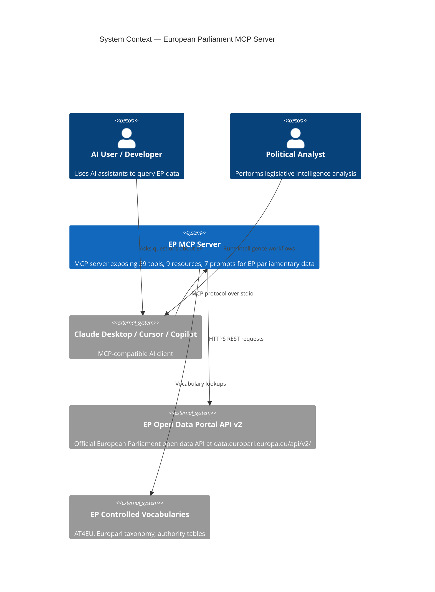
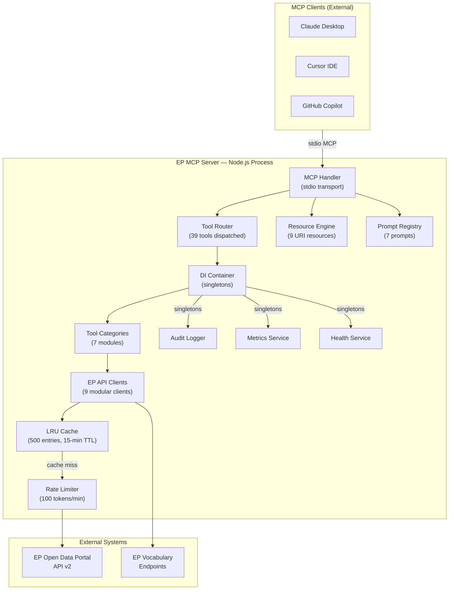
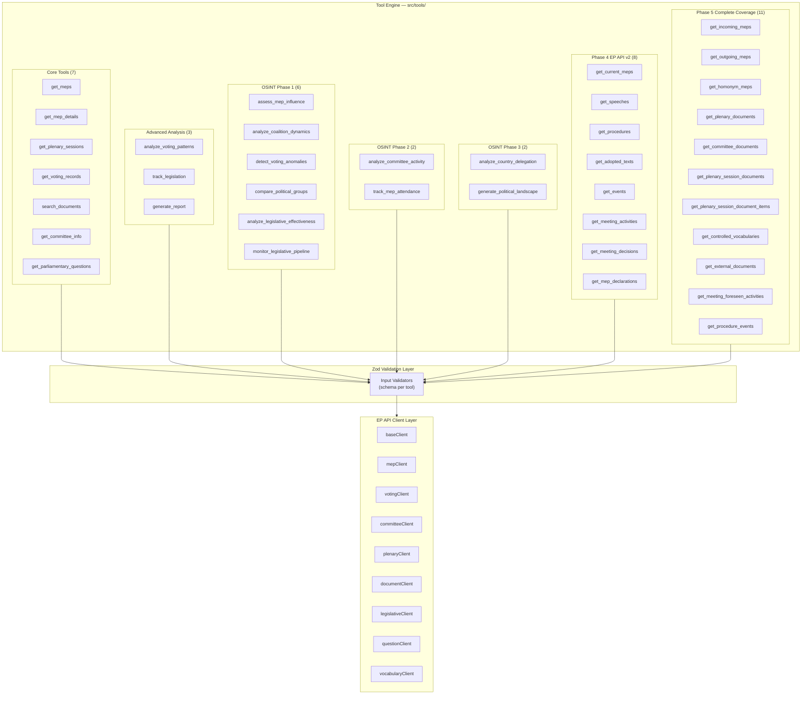
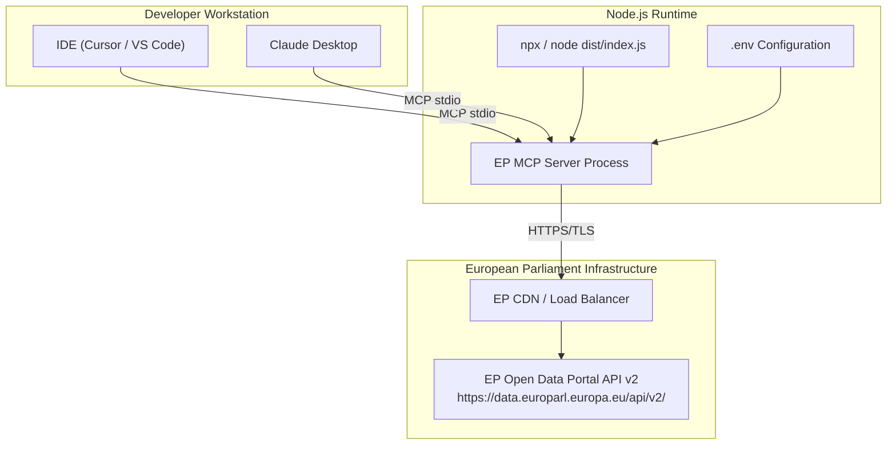

<p align="center">
  
</p>

<h1 align="center">🏛️ European Parliament MCP Server — Architecture</h1>

<p align="center">
  <strong>C4 Architecture Model — Context, Container, Component Views</strong><br>
  <em>Comprehensive system design documentation for the European Parliament MCP Server</em>
</p>

<p align="center">
  <a href="#"></a>
  <a href="#"></a>
  <a href="#"></a>
  <a href="#"></a>
</p>

**📋 Document Owner:** Hack23 | **📄 Version:** 1.0 | **📅 Last Updated:** 2026-02-26 (UTC)
**🔄 Review Cycle:** Quarterly | **⏰ Next Review:** 2026-05-26
**🏷️ Classification:** Public (Open Source MCP Server)
**✅ ISMS Compliance:** ISO 27001 (A.5.1, A.8.1, A.14.2), NIST CSF 2.0 (ID.AM, PR.DS), CIS Controls v8.1 (2.1, 16.1)

---

## 📑 Table of Contents

1. [Security Documentation Map](#security-documentation-map)
2. [Executive Summary](#executive-summary)
3. [C4 Context Diagram](#c4-context-diagram)
4. [C4 Container Diagram](#c4-container-diagram)
5. [C4 Component Diagram — Tool Engine](#c4-component-diagram--tool-engine)
6. [MCP Protocol Surface](#mcp-protocol-surface)
7. [Deployment Architecture](#deployment-architecture)
8. [Technology Stack](#technology-stack)
9. [Architectural Decision Records](#architectural-decision-records)
10. [Security Architecture Summary](#security-architecture-summary)
11. [ISMS Compliance Mapping](#isms-compliance-mapping)

---

## 🗺️ Security Documentation Map

| Document | Current | Future | Description |
|----------|---------|--------|-------------|
| **Architecture** | [ARCHITECTURE.md](./ARCHITECTURE.md) | [FUTURE_ARCHITECTURE.md](./FUTURE_ARCHITECTURE.md) | C4 model, containers, components, ADRs |
| **Security Architecture** | [SECURITY_ARCHITECTURE.md](./SECURITY_ARCHITECTURE.md) | [FUTURE_SECURITY_ARCHITECTURE.md](./FUTURE_SECURITY_ARCHITECTURE.md) | Security controls, threat model |
| **Data Model** | [DATA_MODEL.md](./DATA_MODEL.md) | [FUTURE_DATA_MODEL.md](./FUTURE_DATA_MODEL.md) | Entity relationships, branded types |
| **Flowchart** | [FLOWCHART.md](./FLOWCHART.md) | [FUTURE_FLOWCHART.md](./FUTURE_FLOWCHART.md) | Business process flows |
| **State Diagram** | [STATEDIAGRAM.md](./STATEDIAGRAM.md) | [FUTURE_STATEDIAGRAM.md](./FUTURE_STATEDIAGRAM.md) | System state transitions |
| **Mind Map** | [MINDMAP.md](./MINDMAP.md) | [FUTURE_MINDMAP.md](./FUTURE_MINDMAP.md) | System concepts and relationships |
| **SWOT Analysis** | [SWOT.md](./SWOT.md) | [FUTURE_SWOT.md](./FUTURE_SWOT.md) | Strategic positioning |

---

## 🎯 Executive Summary

The **European Parliament MCP Server** (v1.0) is a TypeScript/Node.js application implementing the **Model Context Protocol (MCP)** to expose structured access to European Parliament datasets. It bridges AI assistants and LLM clients with the EP Open Data Portal API v2, enabling parliamentary intelligence, legislative monitoring, and OSINT analysis workflows.

### Key Capabilities

| Capability | Details |
|------------|---------|
| **MCP Tools** | 39 tools across 7 categories |
| **MCP Resources** | 9 URI-addressable resources |
| **MCP Prompts** | 7 intelligence-analysis prompts |
| **Data Source** | EP Open Data Portal API v2 |
| **Transport** | stdio (MCP standard) |
| **Runtime** | Node.js 20+ / TypeScript 5.x |
| **Security** | 4-layer: Zod → Rate Limiting → Audit Logging → GDPR |

---

## 🌐 C4 Context Diagram



---

## 📦 C4 Container Diagram



---

## 🔧 C4 Component Diagram — Tool Engine



---

## 📡 MCP Protocol Surface

### Tools (39 total)

#### Core Data Access Tools (7)

| Tool | Function | Description |
|------|----------|-------------|
| `get_meps` | `getMEPs` | List MEPs with country/group filters |
| `get_mep_details` | `getMEPDetails` | Detailed MEP profile by ID |
| `get_plenary_sessions` | `getPlenarySessions` | Plenary session listings |
| `get_voting_records` | `getVotingRecords` | Session voting records |
| `search_documents` | `searchDocuments` | Legislative document search |
| `get_committee_info` | `getCommitteeInfo` | Committee details |
| `get_parliamentary_questions` | `getParliamentaryQuestions` | Written/oral questions |

#### OSINT Intelligence Tools (10 + 4 Advanced)

| Tool | Function | Description |
|------|----------|-------------|
| `assess_mep_influence` | `assessMepInfluence` | 5-dimension influence scoring model |
| `analyze_coalition_dynamics` | `analyzeCoalitionDynamics` | Coalition cohesion & stress analysis |
| `detect_voting_anomalies` | `detectVotingAnomalies` | Party defection & anomaly detection |
| `compare_political_groups` | `comparePoliticalGroups` | Cross-group comparative analysis |
| `analyze_legislative_effectiveness` | `analyzeLegislativeEffectiveness` | MEP/committee legislative scoring |
| `monitor_legislative_pipeline` | `monitorLegislativePipeline` | Pipeline status & bottleneck detection |
| `analyze_committee_activity` | `analyzeCommitteeActivity` | Committee workload & engagement |
| `track_mep_attendance` | `trackMepAttendance` | MEP attendance patterns & trends |
| `analyze_country_delegation` | `analyzeCountryDelegation` | Country delegation voting & composition |
| `generate_political_landscape` | `generatePoliticalLandscape` | Parliament-wide political landscape |

#### Advanced OSINT Intelligence Tools (4 — v1.0)

The following four tools extend the OSINT capability with network analysis, sentiment tracking, early-warning signals, and comparative intelligence. Each tool returns `confidenceLevel`, `dataFreshness`, `sourceAttribution`, and `methodology` fields for full analytical transparency.

| Tool | Function | Description |
|------|----------|-------------|
| `network_analysis` | `networkAnalysis` | MEP relationship network mapping via committee co-membership. Computes centrality scores, cluster assignments, bridging MEPs, and network density metrics. Identifies informal power structures and cross-party collaboration pathways. |
| `sentiment_tracker` | `sentimentTracker` | Track political group institutional positioning based on seat-share proxy. Returns per-group positioning scores (−1 to +1), polarization index, consensus/divisive topics, and significant positioning shifts. |
| `early_warning_system` | `earlyWarningSystem` | Detect emerging political shifts, coalition fracture signals, and parliamentary stability risks. Generates severity-tiered warnings (CRITICAL/HIGH/MEDIUM/LOW), stability score (0–100), and trend indicators. Configurable sensitivity and focus area. |
| `comparative_intelligence` | `comparativeIntelligence` | Cross-reference 2–10 MEPs across voting, committee, legislative, and attendance dimensions. Returns ranked profiles, cosine-similarity correlation matrix, z-score outlier detection, and natural cluster analysis. |

**Design Principles for Advanced Tools:**
- All outputs include `dataAvailable: boolean` — tools degrade gracefully when EP API data is limited
- `confidenceLevel: 'HIGH' | 'MEDIUM' | 'LOW'` reflects data completeness at execution time
- `dataFreshness` and `sourceAttribution` provide full data provenance for OSINT analysis
- `methodology` documents the analytical approach for reproducibility and audit
- Input validation via Zod schemas with strict typing throughout


#### EP Data Access Tools (8)

| Tool | Function | Description |
|------|----------|-------------|
| `get_current_meps` | `getCurrentMEPs` | Currently serving MEPs |
| `get_speeches` | `getSpeeches` | Plenary speeches |
| `get_procedures` | `getProcedures` | Legislative procedures |
| `get_adopted_texts` | `getAdoptedTexts` | Adopted legislative texts |
| `get_events` | `getEvents` | Parliamentary events |
| `get_meeting_activities` | `getMeetingActivities` | Meeting activity records |
| `get_meeting_decisions` | `getMeetingDecisions` | Meeting decision outcomes |
| `get_mep_declarations` | `getMEPDeclarations` | MEP financial declarations |

#### EP Complete Coverage Tools (11)

| Tool | Function | Description |
|------|----------|-------------|
| `get_incoming_meps` | `getIncomingMEPs` | Incoming MEPs (new members) |
| `get_outgoing_meps` | `getOutgoingMEPs` | Outgoing MEPs (departing members) |
| `get_homonym_meps` | `getHomonymMEPs` | MEPs with duplicate names |
| `get_plenary_documents` | `getPlenaryDocuments` | Plenary-specific documents |
| `get_committee_documents` | `getCommitteeDocuments` | Committee-specific documents |
| `get_plenary_session_documents` | `getPlenarySessionDocuments` | Session-specific documents |
| `get_plenary_session_document_items` | `getPlenarySessionDocumentItems` | Document items within sessions |
| `get_controlled_vocabularies` | `getControlledVocabularies` | EP controlled vocabulary terms |
| `get_external_documents` | `getExternalDocuments` | External reference documents |
| `get_meeting_foreseen_activities` | `getMeetingForeseenActivities` | Planned meeting activities |
| `get_procedure_events` | `getProcedureEvents` | Events linked to a procedure |

#### Advanced Analysis Tools (3)

| Tool | Function | Description |
|------|----------|-------------|
| `analyze_voting_patterns` | `analyzeVotingPatterns` | Multi-session voting analysis |
| `track_legislation` | `trackLegislation` | End-to-end legislative tracking (real EP API data) |
| `generate_report` | `generateReport` | Structured analysis report generation |

### Resources (6 templates)

| URI Template | Name | Description |
|-------------|------|-------------|
| `ep://meps` | MEP List | All Members of European Parliament |
| `ep://meps/{mepId}` | MEP Profile | Individual MEP details |
| `ep://committees/{committeeId}` | Committee Information | Committee details and membership |
| `ep://plenary-sessions` | Plenary Sessions | Session listings and schedules |
| `ep://votes/{sessionId}` | Voting Record | Session voting results |
| `ep://political-groups` | Political Groups | Party group listings |

### Prompts (6 templates)

| Prompt Name | Description | Key Arguments |
|-------------|-------------|---------------|
| `mep_briefing` | MEP intelligence briefing | `mepId` |
| `coalition_analysis` | Coalition dynamics analysis | `partyGroup` |
| `legislative_tracking` | Legislative pipeline tracking | `procedureId` |
| `political_group_comparison` | Political group comparison | `groups` |
| `committee_activity_report` | Committee activity analysis | `committeeId` |
| `voting_pattern_analysis` | Voting pattern detection | `mepId`, `sessionId` |
| Category | Count | Tools |
|----------|-------|-------|
| **Core** | 7 | get_meps, get_mep_details, get_plenary_sessions, get_voting_records, search_documents, get_committee_info, get_parliamentary_questions |
| **Advanced Analysis** | 3 | analyze_voting_patterns, track_legislation, generate_report |
| **OSINT Phase 1** | 6 | assess_mep_influence, analyze_coalition_dynamics, detect_voting_anomalies, compare_political_groups, analyze_legislative_effectiveness, monitor_legislative_pipeline |
| **OSINT Phase 2** | 2 | analyze_committee_activity, track_mep_attendance |
| **OSINT Phase 3** | 2 | analyze_country_delegation, generate_political_landscape |
| **Phase 4 EP API v2** | 8 | get_current_meps, get_speeches, get_procedures, get_adopted_texts, get_events, get_meeting_activities, get_meeting_decisions, get_mep_declarations |
| **Phase 5 Complete Coverage** | 11 | get_incoming_meps, get_outgoing_meps, get_homonym_meps, get_plenary_documents, get_committee_documents, get_plenary_session_documents, get_plenary_session_document_items, get_controlled_vocabularies, get_external_documents, get_meeting_foreseen_activities, get_procedure_events |

### Resources (9 total)

| URI Pattern | Description |
|-------------|-------------|
| `ep://meps` | List of all current MEPs |
| `ep://meps/{id}` | Individual MEP details by ID |
| `ep://committees/{id}` | Committee details by ID |
| `ep://plenary-sessions` | Plenary session listing |
| `ep://votes/{id}` | Vote record by ID |
| `ep://political-groups` | Political group listing |
| `ep://procedures/{id}` | Legislative procedure by ID |
| `ep://plenary/{id}` | Plenary session by ID |
| `ep://documents/{id}` | Parliamentary document by ID |

### Prompts (7 total)

| Prompt Name | Purpose |
|-------------|---------|
| `mep_briefing` | Generate comprehensive MEP profile briefing |
| `coalition_analysis` | Analyze political coalition dynamics |
| `legislative_tracking` | Track legislative procedure progress |
| `political_group_comparison` | Compare political groups on key metrics |
| `committee_activity_report` | Summarize committee work and outputs |
| `voting_pattern_analysis` | Analyze MEP or group voting patterns |
| `country_delegation_analysis` | Analyze national delegation composition |

---

## 🚀 Deployment Architecture



**Deployment Modes:**
- **Local stdio**: Primary mode — spawned by MCP client as subprocess
- **npm package**: Distributed via npm for easy installation
- **Docker**: Optional containerized deployment for CI/CD

---

## 🛠️ Technology Stack

| Layer | Technology | Version | Purpose |
|-------|-----------|---------|---------|
| **Runtime** | Node.js | 20+ LTS | Server runtime |
| **Language** | TypeScript | 5.x | Type-safe implementation |
| **MCP SDK** | @modelcontextprotocol/sdk | latest | MCP protocol implementation |
| **Validation** | Zod | 3.x | Runtime schema validation and branded types |
| **Caching** | lru-cache | 10.x | LRU cache (500 entries, 15-min TTL) |
| **Testing** | Vitest | latest | Unit and integration testing |
| **Linting** | ESLint | 9.x | Code quality enforcement |
| **Unused Detection** | Knip | latest | Dead code detection |
| **Build** | tsc | 5.x | TypeScript compilation |
| **Package Manager** | npm | 10.x | Dependency management |

---

## 📐 Architectural Decision Records

### ADR-001: Dependency Injection Container Pattern

**Status:** Accepted | **Date:** 2026-02-26

**Context:** Multiple services (RateLimiter, MetricsService, AuditLogger, HealthService) need to be shared across the 39 tool handlers. Using ad-hoc singleton globals creates tight coupling and reduces testability.

**Decision:** Implement a lightweight DI container that manages singleton lifecycle for all shared services. Services are registered once at startup and injected into tool handlers via constructor injection.

**Consequences:**
- ✅ Improved testability — services can be mocked in tests
- ✅ Clear dependency graph
- ✅ Single initialization point for monitoring setup
- ⚠️ Minor startup overhead for container initialization

**Registered Singletons:** `RateLimiter`, `MetricsService`, `AuditLogger`, `HealthService`

---

### ADR-002: Branded Types via Zod

**Status:** Accepted | **Date:** 2026-02-26

**Context:** EP API identifiers (procedure IDs, MEP IDs, country codes, dates) are structurally strings or numbers but carry semantic constraints. Using plain primitives allows incorrect values to flow through the system silently.

**Decision:** Use Zod's `.brand()` feature to create branded types for all EP domain identifiers. This enforces correct formats at both compile time (TypeScript) and runtime (Zod parse).

**Key Branded Types:**
- `ProcedureID` — format `YYYY/NNNN(TYPE)`, e.g., `2024/0001(COD)`
- `CountryCode` — ISO 3166-1 alpha-2, e.g., `DE`, `FR`
- `DateString` — ISO 8601 format `YYYY-MM-DD`
- `MEP_ID` — positive integer identifier

**Consequences:**
- ✅ Runtime type safety for all EP identifiers
- ✅ Validation errors surface at system boundary
- ✅ TypeScript prevents passing wrong identifier types
- ⚠️ Slightly more verbose schema definitions

---

### ADR-003: LRU Cache Strategy

**Status:** Accepted | **Date:** 2026-02-26

**Context:** The EP Open Data Portal API v2 has rate limits and non-trivial latency. Parliamentary data (MEP lists, committee info, plenary schedules) changes infrequently. Repeated calls for the same data waste API quota.

**Decision:** Implement a shared LRU cache with 500 maximum entries and 15-minute TTL. All EP API client modules share a single cache instance registered in the DI container.

**Cache Configuration:**
```
max: 500 entries
ttl: 900,000 ms (15 minutes)
allowStale: false
updateAgeOnGet: false
```

**Cache Key Pattern:** `{clientName}:{endpoint}:{sortedParams}`

**Consequences:**
- ✅ Reduced EP API calls by ~70% for repeated queries
- ✅ Sub-millisecond response for cache hits
- ✅ Respects EP API rate limits
- ⚠️ 15-minute staleness acceptable for parliamentary data

---

### ADR-004: Zod Validation-First Approach

**Status:** Accepted | **Date:** 2026-02-26

**Context:** MCP tool handlers receive untyped `args` from AI clients. Without validation, malformed inputs can cause cryptic errors, security vulnerabilities, or corrupted API calls to the EP API.

**Decision:** Every tool handler validates its input schema using Zod **before** any business logic executes. Validation failures return structured MCP error responses immediately.

**Validation Pipeline:**
```
MCP args (unknown) → Zod.parse() → typed input → EP API call
                         ↓ (on failure)
                    ZodError → MCP error response
```

**Consequences:**
- ✅ Type-safe handler implementations
- ✅ Clear error messages for AI clients
- ✅ Security: malformed inputs rejected at boundary
- ✅ Eliminates defensive null-checks in business logic

---

## 🔒 Security Architecture Summary

The server implements a **4-layer security architecture**:

1. **Layer 1 — Zod Validation**: All tool inputs validated against strict schemas before processing
2. **Layer 2 — Rate Limiting**: Token bucket algorithm, 100 tokens/minute, prevents EP API abuse
3. **Layer 3 — Audit Logging**: All tool invocations logged with parameters (PII-stripped) for compliance
4. **Layer 4 — GDPR Compliance**: MEP personal data handled with data minimization and purpose limitation

See [SECURITY_ARCHITECTURE.md](./SECURITY_ARCHITECTURE.md) for full details.

---

## ✅ ISMS Compliance Mapping

| Control | Standard | Clause | Implementation |
|---------|----------|--------|----------------|
| Asset Management | ISO 27001 | A.8.1 | All 39 tools documented as information assets |
| Secure Development | ISO 27001 | A.14.2 | TypeScript strict mode, Zod validation, ESLint |
| Access Control | ISO 27001 | A.9.1 | MCP stdio transport, no network exposure |
| Audit Logging | ISO 27001 | A.12.4 | AuditLogger singleton, all invocations logged |
| Data Protection | GDPR | Art. 5 | Data minimization in all MEP queries |
| Identify: Assets | NIST CSF 2.0 | ID.AM | Component and tool inventory maintained |
| Protect: Data | NIST CSF 2.0 | PR.DS | Encryption in transit (HTTPS to EP API) |
| Software Inventory | CIS Controls v8.1 | 2.1 | package.json, SBOM via npm |
| Secure Config | CIS Controls v8.1 | 16.1 | TypeScript strict, no dangerous defaults |

---

*See [FUTURE_ARCHITECTURE.md](./FUTURE_ARCHITECTURE.md) for the architectural evolution roadmap.*
