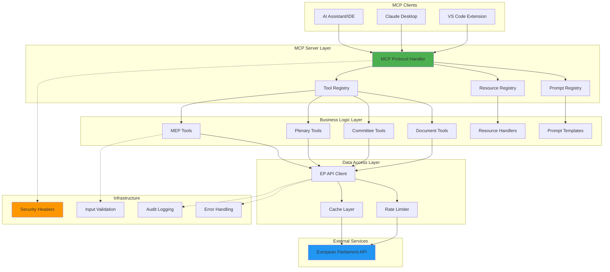
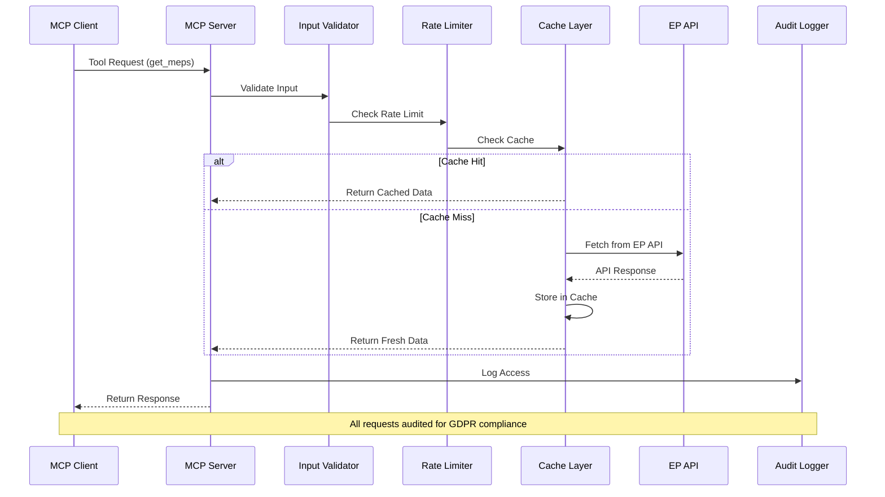

# European Parliament MCP Server - Architecture

<p align="center">
  
</p>

<h1 align="center">🏛️ European Parliament MCP Server</h1>

<p align="center">
  <strong>Model Context Protocol Server for European Parliament Open Data</strong><br>
  <em>Providing structured access to parliamentary datasets via MCP protocol</em>
</p>

---

## 📋 Table of Contents

- [Overview](#overview)
- [Architecture Overview](#architecture-overview)
- [MCP Protocol Implementation](#mcp-protocol-implementation)
- [European Parliament Data Sources](#european-parliament-data-sources)
- [Security Architecture](#security-architecture)
- [Technology Stack](#technology-stack)
- [Component Design](#component-design)
- [Data Flow](#data-flow)
- [API Design](#api-design)
- [Performance Considerations](#performance-considerations)
- [ISMS Compliance](#isms-compliance)
- [Future Roadmap](#future-roadmap)

---

## 🎯 Overview

The European Parliament MCP Server is a **Model Context Protocol (MCP)** implementation that provides structured access to European Parliament open datasets. It enables AI assistants and other MCP clients to query parliamentary data including MEPs, plenary sessions, committees, legislative documents, and parliamentary questions.

### Key Features

- 🔌 **MCP Protocol**: Full implementation of Model Context Protocol for AI integration
- 🏛️ **European Parliament Data**: Access to comprehensive parliamentary datasets
- 🔒 **Security First**: ISMS-compliant, GDPR-ready, SLSA Level 3
- 🚀 **Performance**: Caching, rate limiting, <200ms API response times
- 📊 **Type Safety**: TypeScript with Zod runtime validation
- 🧪 **Well-Tested**: 80%+ test coverage (95% for security code)

---

## 🏗️ Architecture Overview



---

## 🔌 MCP Protocol Implementation

### Protocol Components

The MCP server implements three core protocol features:

#### 1. **Tools** (Function Calling)
Tools allow clients to execute specific actions on European Parliament data.

```typescript
// Example: Get MEP Information Tool
{
  name: "get_meps",
  description: "Retrieve information about Members of European Parliament",
  inputSchema: {
    type: "object",
    properties: {
      country: { type: "string", description: "ISO country code (e.g., 'SE')" },
      group: { type: "string", description: "Political group" },
      limit: { type: "number", minimum: 1, maximum: 100, default: 50 }
    }
  }
}
```

#### 2. **Resources** (Data Access)
Resources provide read access to specific data entities via URIs.

```typescript
// Example: MEP Resource
{
  uri: "ep://meps/{id}",
  name: "MEP Profile",
  description: "Detailed information about a specific MEP",
  mimeType: "application/json"
}
```

#### 3. **Prompts** (Templates)
Prompts provide pre-configured query templates for common use cases.

```typescript
// Example: Legislative Analysis Prompt
{
  name: "analyze_legislation",
  description: "Analyze legislative procedure and voting patterns",
  arguments: [
    { name: "procedure_id", description: "Legislative procedure ID", required: true }
  ]
}
```

---

## 🏛️ European Parliament Data Sources

### Primary Data Source

- **Base URL**: `https://data.europarl.europa.eu/api/v2/`
- **Documentation**: https://data.europarl.europa.eu/en/developer-corner
- **Data Format**: JSON-LD, RDF/XML, Turtle
- **Update Frequency**: Real-time to daily (varies by dataset)

### Available Datasets

#### 1. **MEPs (Members of European Parliament)**
- Current and historical members
- Personal information, contact details
- Political group affiliations
- Committee memberships
- Parliamentary activities

#### 2. **Plenary Sessions**
- Session schedules and agendas
- Voting records and results
- Attendance tracking
- Debate transcripts

#### 3. **Committees**
- Committee composition
- Meeting schedules
- Working documents
- Reports and opinions

#### 4. **Legislative Documents**
- Bills and resolutions
- Amendments
- Legislative procedures
- Consolidated texts

#### 5. **Parliamentary Questions**
- Written questions
- Oral questions
- Question time transcripts
- Responses and answers

---

## 🔒 Security Architecture

### Defense in Depth


### Security Layers

#### 1. **Transport Security**
- TLS 1.3 minimum
- HSTS with 1-year max-age
- Certificate pinning recommended

#### 2. **Rate Limiting**
- 100 requests per 15 minutes per IP
- Token bucket algorithm
- Graceful degradation

#### 3. **Input Validation**
- Zod schema validation
- Type-safe parsing
- SQL injection prevention
- XSS protection

#### 4. **Authentication & Authorization**
- API key authentication
- OAuth 2.0 support (future)
- Role-based access control
- Principle of least privilege

#### 5. **Data Protection (GDPR)**
- Data minimization
- Purpose limitation
- Storage limitation
- Right to erasure support
- Audit trail for personal data access

#### 6. **Security Headers**
See [SECURITY_HEADERS.md](./SECURITY_HEADERS.md) for complete implementation.

---

## 🛠️ Technology Stack

### Core Technologies

| Component | Technology | Version | Purpose |
|-----------|-----------|---------|---------|
| Runtime | Node.js | 22.x | JavaScript runtime |
| Language | TypeScript | 5.x | Type-safe development |
| Protocol | MCP SDK | Latest | Model Context Protocol |
| Validation | Zod | 3.x | Runtime schema validation |
| HTTP Client | Undici | Latest | Fast HTTP/1.1 client |
| Testing | Vitest | Latest | Unit testing framework |
| Linting | ESLint | 9.x | Code quality |

### Development Tools

| Tool | Purpose |
|------|---------|
| tsx | TypeScript execution |
| tsc | TypeScript compilation |
| prettier | Code formatting |
| knip | Unused dependency detection |
| npm-audit | Security vulnerability scanning |

### Security Tools

| Tool | Purpose |
|------|---------|
| CodeQL | Static security analysis |
| Dependabot | Automated dependency updates |
| OSSF Scorecard | Supply chain security |
| Syft | SBOM generation |
| Grype | Vulnerability scanning |

---

## 🧩 Component Design

### 1. MCP Server Core

```typescript
// src/server.ts
import { Server } from '@modelcontextprotocol/sdk/server/index.js';
import { StdioServerTransport } from '@modelcontextprotocol/sdk/server/stdio.js';

export class EuropeanParliamentMCPServer {
  private server: Server;
  
  constructor() {
    this.server = new Server({
      name: 'european-parliament-mcp-server',
      version: '1.0.0'
    }, {
      capabilities: {
        tools: {},
        resources: {},
        prompts: {}
      }
    });
    
    this.registerTools();
    this.registerResources();
    this.registerPrompts();
  }
  
  async start() {
    const transport = new StdioServerTransport();
    await this.server.connect(transport);
  }
}
```

### 2. Tool Implementation

```typescript
// src/tools/getMEPs.ts
import { z } from 'zod';
import { Tool } from '../types/mcp';

const GetMEPsSchema = z.object({
  country: z.string().length(2).optional(),
  group: z.string().optional(),
  limit: z.number().min(1).max(100).default(50)
});

export const getMEPsTool: Tool = {
  name: 'get_meps',
  description: 'Get Members of European Parliament',
  inputSchema: zodToJsonSchema(GetMEPsSchema),
  
  async handler(args) {
    const params = GetMEPsSchema.parse(args);
    const meps = await fetchMEPsFromAPI(params);
    
    return {
      content: [{
        type: 'text',
        text: JSON.stringify(meps, null, 2)
      }]
    };
  }
};
```

### 3. European Parliament API Client

```typescript
// src/clients/europeanParliamentClient.ts
import { fetch } from 'undici';
import { LRUCache } from 'lru-cache';

export class EuropeanParliamentClient {
  private cache: LRUCache<string, unknown>;
  private baseURL = 'https://data.europarl.europa.eu/api/v2/';
  
  constructor() {
    this.cache = new LRUCache({
      max: 500,
      ttl: 1000 * 60 * 15, // 15 minutes
      allowStale: false
    });
  }
  
  async get<T>(endpoint: string, params?: Record<string, unknown>): Promise<T> {
    const cacheKey = this.getCacheKey(endpoint, params);
    
    // Check cache
    const cached = this.cache.get(cacheKey);
    if (cached) return cached as T;
    
    // Fetch from API
    const url = new URL(endpoint, this.baseURL);
    if (params) {
      Object.entries(params).forEach(([key, value]) => {
        url.searchParams.append(key, String(value));
      });
    }
    
    const response = await fetch(url, {
      headers: {
        'Accept': 'application/json',
        'User-Agent': 'European-Parliament-MCP-Server/1.0'
      }
    });
    
    if (!response.ok) {
      throw new APIError(`API request failed: ${response.statusText}`, response.status);
    }
    
    const data = await response.json() as T;
    this.cache.set(cacheKey, data);
    
    return data;
  }
  
  private getCacheKey(endpoint: string, params?: Record<string, unknown>): string {
    return JSON.stringify({ endpoint, params });
  }
}
```

---

## 🔄 Data Flow

### Request Processing Flow



---

## 🌐 API Design

### MCP Tools

#### Core Tools

| Tool Name | Description | Rate Limit |
|-----------|-------------|------------|
| `get_meps` | List MEPs with filters | Standard |
| `get_mep_details` | Get detailed MEP info | Standard |
| `get_plenary_sessions` | List plenary sessions | Standard |
| `get_voting_records` | Get voting records | Standard |
| `search_documents` | Search legislative docs | Higher limit |
| `get_committee_info` | Get committee details | Standard |
| `get_parliamentary_questions` | List questions | Standard |

#### Advanced Tools

| Tool Name | Description | Rate Limit |
|-----------|-------------|------------|
| `analyze_voting_patterns` | Analyze MEP voting | Lower limit |
| `track_legislation` | Track legislative procedure | Lower limit |
| `generate_report` | Generate analysis report | Lowest limit |

### Error Handling

```typescript
// Standardized error responses
interface MCPError {
  code: string;
  message: string;
  details?: unknown;
}

// Error codes
enum ErrorCode {
  VALIDATION_ERROR = 'VALIDATION_ERROR',
  RATE_LIMIT_EXCEEDED = 'RATE_LIMIT_EXCEEDED',
  API_ERROR = 'API_ERROR',
  NOT_FOUND = 'NOT_FOUND',
  AUTHENTICATION_FAILED = 'AUTHENTICATION_FAILED',
  INTERNAL_ERROR = 'INTERNAL_ERROR'
}
```

---

## ⚡ Performance Considerations

### Caching Strategy

```typescript
// Three-tier caching
1. Memory Cache (LRU, 15 min TTL)
   - Fast access for repeated queries
   - Max 500 entries
   
2. Redis Cache (Optional, 1 hour TTL)
   - Shared cache across instances
   - Suitable for production deployment
   
3. HTTP Cache (via Cache-Control)
   - Leverage browser/proxy caching
   - Reduce server load
```

### Performance Targets

| Metric | Target | Measurement |
|--------|--------|-------------|
| P50 Response Time | <100ms | Cached requests |
| P95 Response Time | <200ms | Cache miss |
| P99 Response Time | <500ms | Complex queries |
| Throughput | 100 req/min/client | Rate limit |
| Cache Hit Rate | >80% | Production typical |

### Optimization Techniques

1. **Query Optimization**: Minimize API calls through batching
2. **Pagination**: Limit result sets to 50-100 items by default
3. **Field Selection**: Only request needed fields from EP API
4. **Connection Pooling**: Reuse HTTP connections
5. **Compression**: Use gzip/brotli for responses

---

## 🛡️ ISMS Compliance

### Policy Alignment

This architecture aligns with Hack23 ISMS policies:

| Policy | Requirement | Implementation |
|--------|-------------|----------------|
| [Open Source Policy](https://github.com/Hack23/ISMS-PUBLIC/blob/main/Open_Source_Policy.md) | Public transparency | SBOM, badges, documentation |
| [Secure Development Policy](https://github.com/Hack23/ISMS-PUBLIC/blob/main/Secure_Development_Policy.md) | Security by design | Input validation, auth, audit |
| Privacy Policy | GDPR compliance | Data minimization, erasure support |
| Access Control Policy | Least privilege | RBAC, API keys |

### Security Controls

| Control | Type | Implementation |
|---------|------|----------------|
| AC-3 | Access Enforcement | API key authentication |
| AU-2 | Audit Events | All data access logged |
| IA-2 | User Identification | API key validation |
| SC-8 | Transmission Confidentiality | TLS 1.3 |
| SI-10 | Information Input Validation | Zod schemas |

### Compliance Badges

```markdown
[](https://securityscorecards.dev/viewer/?uri=github.com/Hack23/European-Parliament-MCP-Server)
[](https://slsa.dev)
[](https://spdx.dev)
```

---

## 🚀 Future Roadmap

### Phase 1: MVP (Current)
- ✅ Core MCP protocol implementation
- ✅ Basic MEP and plenary data access
- ✅ Security headers and input validation
- ✅ ISMS compliance documentation

### Phase 2: Enhanced Features (Q2 2026)
- [ ] Full dataset coverage (all 5 datasets)
- [ ] Advanced search and filtering
- [ ] Real-time notifications via WebSocket
- [ ] OAuth 2.0 authentication
- [ ] Redis caching for production

### Phase 3: Intelligence Layer (Q3 2026)
- [ ] Voting pattern analysis
- [ ] Legislative trend detection
- [ ] MEP influence scoring
- [ ] Committee activity tracking
- [ ] Automated report generation

### Phase 4: Integration & Scale (Q4 2026)
- [ ] GraphQL API
- [ ] Multi-language support
- [ ] Kubernetes deployment
- [ ] High availability setup
- [ ] CDN integration

---

## 📚 References

### European Parliament
- [Open Data Portal](https://data.europarl.europa.eu/)
- [Developer Corner](https://data.europarl.europa.eu/en/developer-corner)
- [Data Privacy Policy](https://www.europarl.europa.eu/portal/en/legal-notice)

### MCP Protocol
- [MCP Specification](https://spec.modelcontextprotocol.io/)
- [MCP SDK Documentation](https://github.com/modelcontextprotocol/sdk)

### Security Standards
- [OWASP API Security Top 10](https://owasp.org/www-project-api-security/)
- [OpenSSF Scorecard](https://securityscorecards.dev/)
- [SLSA Framework](https://slsa.dev/)
- [SBOM Guide](https://www.cisa.gov/sbom)

### ISMS Policies
- [Hack23 ISMS Public](https://github.com/Hack23/ISMS-PUBLIC)
- [ISO 27001:2022](https://www.iso.org/standard/27001)
- [NIST Cybersecurity Framework 2.0](https://www.nist.gov/cyberframework)
- [CIS Controls v8.1](https://www.cisecurity.org/controls/)

---

**Document Version**: 1.0  
**Last Updated**: 2026-02-16  
**Owner**: Hack23 AB  
**Review Cycle**: Quarterly

---

## 🏗️ Code Quality & Architecture Improvements

### Modular Structure

The codebase has been refactored to follow clean architecture principles with focused, single-responsibility modules:

#### Report Generation Module (`src/tools/generateReport/`)

- **index.ts** (114 lines): Main handler with map-based report type dispatcher
- **reportGenerators.ts** (194 lines): Report generation logic for all report types
- **reportBuilders.ts** (153 lines): Reusable section builders
- **types.ts** (40 lines): Type definitions for reports

**Benefits:**
- Cyclomatic complexity reduced to <10 per function
- Easy to add new report types via factory pattern
- Clear separation between data fetching and formatting
- Improved testability with isolated units

#### Legislation Tracking Module (`src/tools/trackLegislation/`)

- **index.ts** (79 lines): Main handler with error handling
- **procedureTracker.ts** (105 lines): Procedure tracking logic
- **timelineBuilder.ts** (52 lines): Timeline construction utilities
- **types.ts** (72 lines): Type definitions for legislative procedures

**Benefits:**
- Builder pattern for complex timeline construction
- Separate concerns for different aspects of legislation tracking
- Easy to extend with additional legislative stages
- Maintainable, focused modules

### Dependency Injection Container

Located in `src/di/container.ts`, provides type-safe service registration and resolution:

```typescript
import { DIContainer } from './di/container.js';

// Create a container instance
const container = new DIContainer();

// Define injection tokens
const ReportServiceToken = Symbol('ReportService');
const EPClientToken = Symbol('EPClient');

// Register a service
container.register(
  ReportServiceToken,
  (c) => new ReportService(c.resolve(EPClientToken)),
  'singleton'
);

// Resolve a service
const reportService = container.resolve<ReportService>(ReportServiceToken);
```

**Features:**
- **Singleton lifetime**: Single instance shared across application
- **Transient lifetime**: New instance created on each resolution
- **Type-safe**: Full TypeScript type inference
- **Dependency injection**: Services can depend on other services

**Benefits:**
- Improved testability (easy to mock dependencies)
- Loose coupling between components
- Centralized service configuration
- Better separation of concerns

### Performance Monitoring

The `MetricsService` (`src/services/MetricsService.ts`) provides Prometheus-style metrics:

```typescript
import { MetricsService } from './services/MetricsService.js';

const metrics = new MetricsService();

// Counter for request counts
metrics.incrementCounter('http_requests_total', 1, { 
  method: 'GET', 
  endpoint: '/meps' 
});

// Gauge for current memory usage
metrics.setGauge('memory_usage_bytes', process.memoryUsage().heapUsed);

// Histogram for request durations
metrics.observeHistogram('request_duration_ms', 125, { 
  endpoint: '/meps' 
});

// Get histogram summary with percentiles
const summary = metrics.getHistogramSummary('request_duration_ms', { 
  endpoint: '/meps' 
});
console.log(`p95: ${summary?.p95}ms, p99: ${summary?.p99}ms`);
```

**Metric Types:**
- **Counter**: Monotonically increasing values (requests, errors)
- **Gauge**: Values that can go up or down (memory, active connections)
- **Histogram**: Distribution of values (latencies, response sizes)

**Benefits:**
- Track performance metrics over time
- Identify bottlenecks and optimization opportunities
- Monitor cache hit rates and API response times
- Support for multi-dimensional metrics via labels

### Code Quality Metrics

**Cyclomatic Complexity:**
- All functions maintain complexity <10
- Enforced via ESLint with `complexity: ['error', { max: 10 }]`
- Complex switch statements replaced with map-based dispatchers

**File Size:**
- All files under 200 lines (target: <150)
- Large files refactored into focused modules
- Each module has single, clear responsibility

**Test Coverage:**
- Coverage thresholds (configured in `vitest.config.ts`):
  - Statements: ≥ 80%
  - Lines: ≥ 78.9%
  - Branches: ≥ 70%
  - Functions: ≥ 80%
  - Security-critical code: ≥ 95% coverage target
- For up-to-date coverage metrics and test counts, run `npm run test:coverage` and refer to the generated coverage report.

### Design Patterns Applied

1. **Factory Pattern**: Report type dispatcher in `generateReport/index.ts`
2. **Builder Pattern**: Timeline and section builders
3. **Dependency Injection**: Service registration and resolution
4. **Strategy Pattern**: Different report generators for different types
5. **Observer Pattern**: Metrics collection (implicit)

### Future Architectural Enhancements

**Service Layer Expansion:**
- Extract business logic from MCP tool handlers
- Implement `ReportService`, `LegislationService`, `AnalyticsService`
- Use DI for all service dependencies

**Advanced Caching:**
- Cache warming for frequently accessed data
- Smart cache invalidation based on data age
- Multi-tier caching (L1: memory, L2: Redis)
- Cache hit/miss metrics tracking

**Observability:**
- Integration with external monitoring systems
- Structured logging with correlation IDs
- Distributed tracing for API calls
- Health check endpoints

### Migration Guide

The refactoring maintains backward compatibility:

```typescript
// Old import (still works)
import { handleGenerateReport } from './tools/generateReport.js';

// New modular imports (also available)
import { handleGenerateReport } from './tools/generateReport/index.js';
import { generateMEPActivityReport } from './tools/generateReport/reportGenerators.js';
import type { Report, ReportType } from './tools/generateReport/types.js';
```

All existing tests pass without modification, ensuring no breaking changes to the public API.

