# Architecture Diagrams

<p align="center">
  
</p>

<h1 align="center">European Parliament MCP Server - Architecture Diagrams</h1>

<p align="center">
  <strong>Visual architecture documentation using C4 Model and sequence diagrams</strong><br>
  <em>Context, Container, Component, and Data Flow visualizations</em>
</p>

---

## 📋 Table of Contents

- [Overview](#overview)
- [C4 Model Diagrams](#c4-model-diagrams)
  - [Level 1: System Context](#level-1-system-context)
  - [Level 2: Container Diagram](#level-2-container-diagram)
  - [Level 3: Component Diagram](#level-3-component-diagram)
- [Sequence Diagrams](#sequence-diagrams)
  - [Tool Invocation Flow](#tool-invocation-flow)
  - [Authentication Flow](#authentication-flow)
  - [Error Handling Flow](#error-handling-flow)
- [Data Flow Diagrams](#data-flow-diagrams)
  - [EP API to MCP Client](#ep-api-to-mcp-client)
  - [Caching Flow](#caching-flow)
  - [Rate Limiting Flow](#rate-limiting-flow)
- [Deployment Architectures](#deployment-architectures)
  - [Claude Desktop](#claude-desktop-deployment)
  - [VS Code Extension](#vs-code-extension-deployment)
  - [Docker Deployment](#docker-deployment)

---

## 🎯 Overview

This document provides comprehensive visual architecture documentation for the European Parliament MCP Server following the [C4 Model](https://c4model.com/) convention. The diagrams illustrate system context, containers, components, and data flows using Mermaid syntax.

### C4 Model Levels

1. **System Context**: How the MCP server fits into the overall ecosystem
2. **Container**: High-level technology choices and communication patterns
3. **Component**: Internal structure and organization
4. **Code**: Implementation details (see code documentation)

---

## 🏗️ C4 Model Diagrams

### Level 1: System Context

**Purpose**: Shows how the European Parliament MCP Server fits within the broader ecosystem of users, external systems, and data sources.

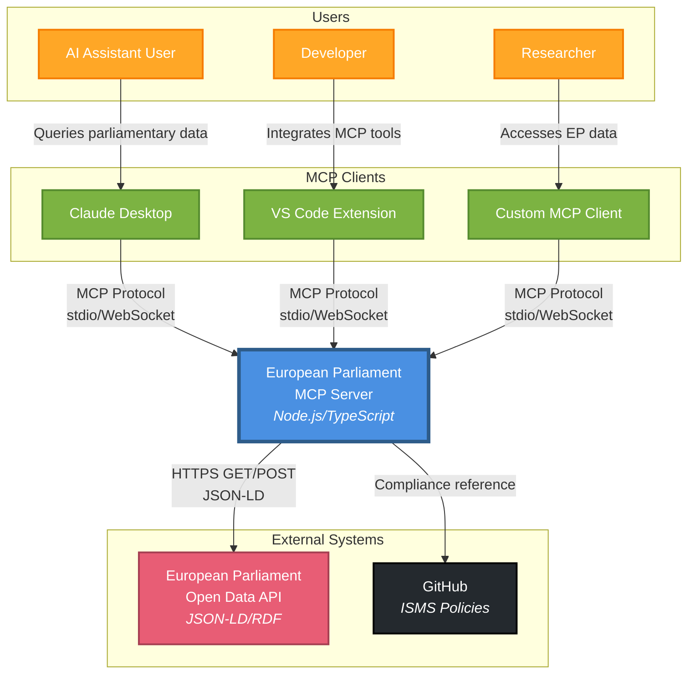

**Key Relationships**:

| From | To | Protocol | Purpose |
|------|-----|----------|---------|
| MCP Clients | MCP Server | MCP over stdio/WebSocket | Tool invocation, resource access |
| MCP Server | EP API | HTTPS/JSON-LD | Parliamentary data retrieval |
| MCP Server | GitHub | Reference only | ISMS policy compliance |

---

### Level 2: Container Diagram

**Purpose**: Shows the high-level technology choices and how containers communicate with each other.

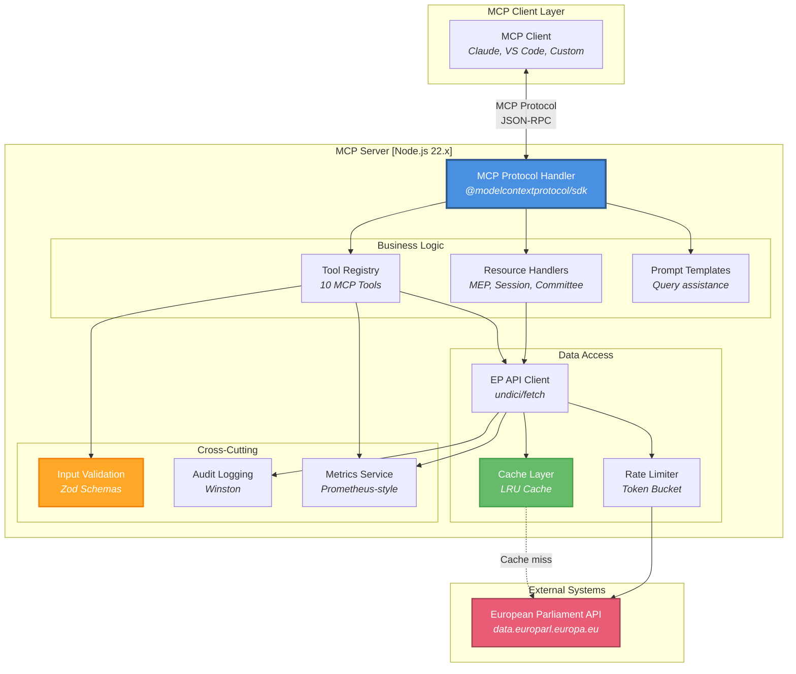

**Container Descriptions**:

1. **MCP Protocol Handler**: Implements Model Context Protocol for client communication
2. **Tool Registry**: 10 registered MCP tools for parliamentary data access
3. **Resource Handlers**: MCP resource endpoints for structured data
4. **EP API Client**: HTTP client for European Parliament API integration
5. **Cache Layer**: LRU cache with 15-minute TTL for performance
6. **Rate Limiter**: Token bucket algorithm (100 req/15min)
7. **Input Validation**: Zod schema validation for all inputs
8. **Audit Logging**: Winston-based logging for GDPR compliance

---

### Level 3: Component Diagram

**Purpose**: Shows the internal components of the MCP Server container and their relationships.

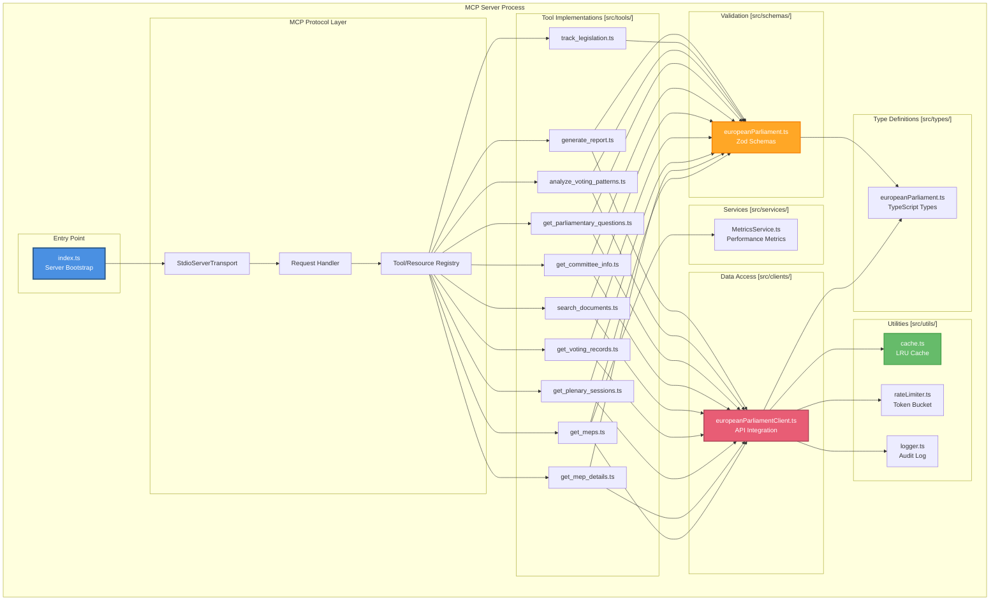

**Component Responsibilities**:

| Component | Responsibility | Key Dependencies |
|-----------|----------------|------------------|
| `index.ts` | Server bootstrap, MCP setup | `@modelcontextprotocol/sdk` |
| `get_meps.ts` | MEP listing with filters | `schemas`, `epClient` |
| `get_mep_details.ts` | Individual MEP details | `schemas`, `epClient` |
| `europeanParliamentClient.ts` | EP API integration | `undici`, `cache`, `rateLimiter` |
| `europeanParliament.ts` (schemas) | Input/output validation | `zod` |
| `cache.ts` | LRU caching mechanism | `lru-cache` |
| `rateLimiter.ts` | Token bucket rate limiting | Built-in |
| `MetricsService.ts` | Performance monitoring | Built-in |

---

## 🔄 Sequence Diagrams

### Tool Invocation Flow

**Purpose**: Shows the complete flow when an MCP client invokes a tool.

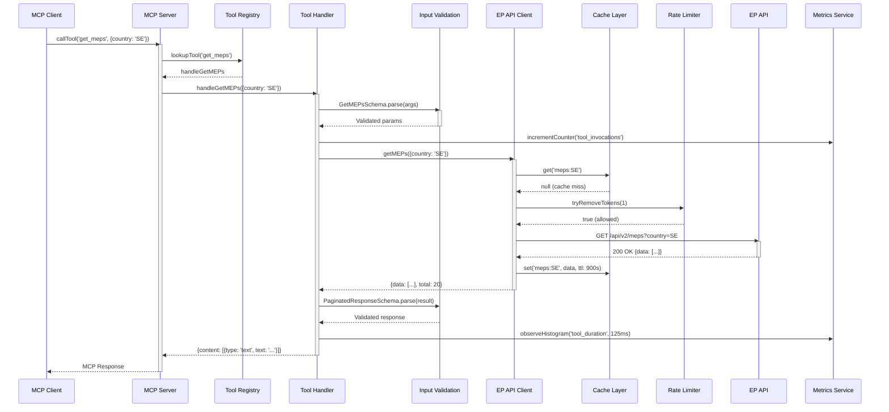

**Key Steps**:

1. **Tool Lookup**: Registry maps tool name to handler function
2. **Input Validation**: Zod schema validates all parameters
3. **Cache Check**: LRU cache checked before API call
4. **Rate Limiting**: Token bucket ensures compliance with limits
5. **API Call**: HTTP request to European Parliament API
6. **Cache Update**: Successful responses cached for 15 minutes
7. **Output Validation**: Response structure validated
8. **Metrics**: Performance metrics recorded

---

### Authentication Flow

**Purpose**: Shows authentication flow (planned for future implementation).

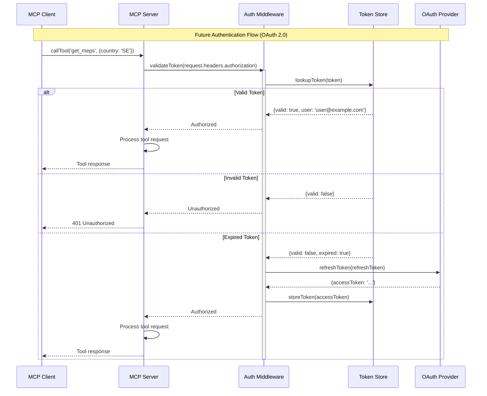

**Note**: Currently, the server does not implement authentication. This diagram shows the planned OAuth 2.0 flow for future versions.

---

### Error Handling Flow

**Purpose**: Shows how errors are handled and propagated through the system.

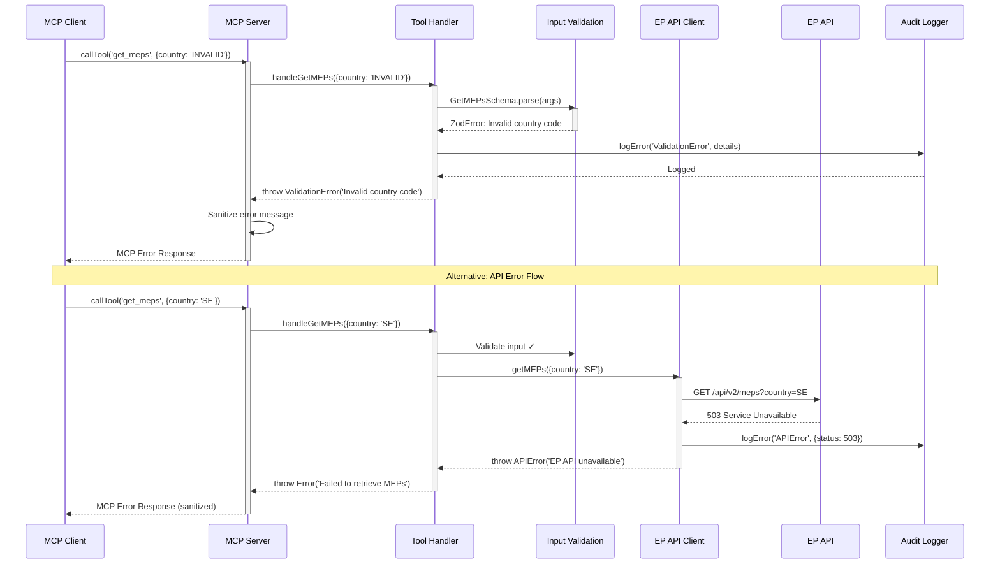

**Error Types Handled**:

1. **ValidationError**: Invalid input parameters (Zod validation)
2. **RateLimitError**: Rate limit exceeded
3. **APIError**: European Parliament API errors
4. **NotFoundError**: Resource not found
5. **InternalError**: Unexpected server errors (sanitized)

---

## 💾 Data Flow Diagrams

### EP API to MCP Client

**Purpose**: Complete data flow from European Parliament API through the MCP server to the client.

```mermaid
graph LR
    subgraph "European Parliament"
        EP_DB[(EP Database)]
        EP_API[EP Open Data API<br/>JSON-LD]
    end
    
    subgraph "MCP Server"
        RATE[Rate Limiter<br/>100/15min]
        CACHE[Cache Layer<br/>15min TTL]
        TRANSFORM[Data Transform<br/>JSON-LD → JSON]
        VALIDATE[Output Validation<br/>Zod Schema]
        MCP_HANDLER[MCP Protocol<br/>Handler]
    end
    
    subgraph "MCP Client"
        CLIENT[AI Assistant<br/>Claude/VS Code]
        DISPLAY[User Display]
    end
    
    EP_DB --> EP_API
    EP_API -->|HTTPS GET<br/>JSON-LD| RATE
    RATE -->|Allowed| CACHE
    CACHE -->|Cache Miss| EP_API
    CACHE -->|Cached/Fresh Data| TRANSFORM
    TRANSFORM --> VALIDATE
    VALIDATE --> MCP_HANDLER
    MCP_HANDLER -->|MCP Response<br/>JSON| CLIENT
    CLIENT --> DISPLAY
    
    style EP_API fill:#E85D75,stroke:#A53F52,stroke-width:2px,color:#fff
    style CACHE fill:#66BB6A,stroke:#43A047,stroke-width:2px,color:#fff
    style TRANSFORM fill:#FFA726,stroke:#F57C00,stroke-width:2px,color:#fff
    style MCP_HANDLER fill:#4A90E2,stroke:#2E5C8A,stroke-width:2px,color:#fff
```

**Data Transformations**:

| Stage | Input Format | Output Format | Purpose |
|-------|-------------|---------------|---------|
| EP API | Database | JSON-LD | Structured linked data |
| Transform | JSON-LD | JSON | Remove @context, normalize fields |
| Validate | JSON | Typed JSON | Ensure schema compliance |
| MCP Handler | Typed JSON | MCP Response | Wrap in MCP content structure |

---

### Caching Flow

**Purpose**: Shows how caching reduces API calls and improves performance.

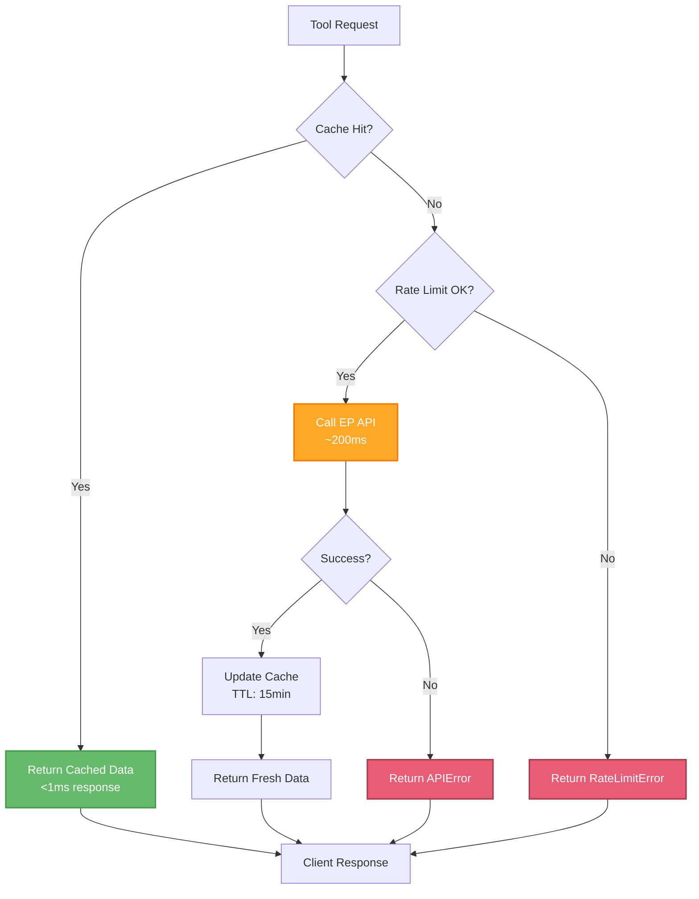

**Cache Configuration**:

```typescript
// Cache settings
const cacheConfig = {
  max: 500,              // Maximum 500 entries
  ttl: 15 * 60 * 1000,  // 15 minutes TTL
  updateAgeOnGet: false  // TTL not refreshed on read
};
```

**Cache Key Strategy**:

- `meps:{country}:{group}:{committee}` - MEP listings
- `mep:{id}` - Individual MEP details
- `plenary:{dateFrom}:{dateTo}` - Plenary sessions
- `votes:{mepId}:{sessionId}:{topic}` - Voting records

---

### Rate Limiting Flow

**Purpose**: Token bucket algorithm for rate limiting.

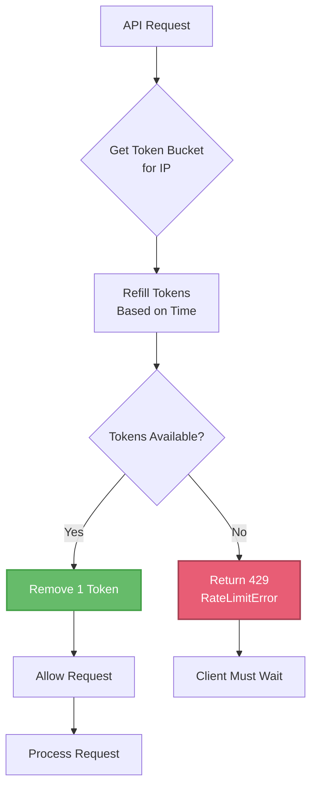

**Rate Limit Configuration**:

```typescript
// Rate limiter settings
const rateLimiter = new RateLimiter({
  maxTokens: 100,        // Maximum 100 tokens
  refillRate: 100,       // Refill 100 tokens per window
  windowMs: 15 * 60 * 1000  // 15 minute window
});
```

**Headers** (planned):
```
X-RateLimit-Limit: 100
X-RateLimit-Remaining: 85
X-RateLimit-Reset: 1640995200
```

---

## 🚀 Deployment Architectures

### Claude Desktop Deployment

**Purpose**: MCP server as a subprocess of Claude Desktop.

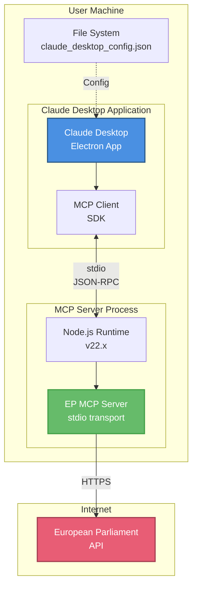

**Configuration** (`~/.config/claude/claude_desktop_config.json`):

```json
{
  "mcpServers": {
    "european-parliament": {
      "command": "node",
      "args": [
        "/path/to/European-Parliament-MCP-Server/dist/index.js"
      ],
      "env": {
        "LOG_LEVEL": "info"
      }
    }
  }
}
```

---

### VS Code Extension Deployment

**Purpose**: MCP server integrated with VS Code extension.

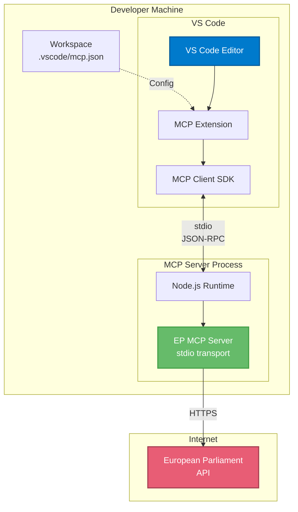

**Configuration** (`.vscode/mcp.json`):

```json
{
  "servers": {
    "european-parliament": {
      "type": "stdio",
      "command": "node",
      "args": ["./dist/index.js"],
      "cwd": "${workspaceFolder}/European-Parliament-MCP-Server"
    }
  }
}
```

---

### Docker Deployment

**Purpose**: Containerized MCP server for production deployments.

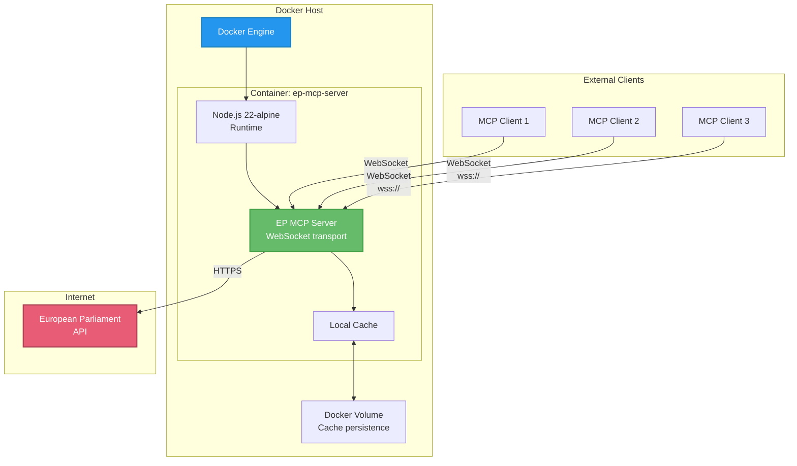

**Dockerfile**:

```dockerfile
FROM node:22-alpine

WORKDIR /app

COPY package*.json ./
RUN npm ci --only=production

COPY dist/ ./dist/

EXPOSE 3000

VOLUME ["/app/cache"]

ENV NODE_ENV=production
ENV LOG_LEVEL=info

CMD ["node", "dist/index.js", "--transport", "websocket", "--port", "3000"]
```

**Docker Compose** (`docker-compose.yml`):

```yaml
version: '3.8'

services:
  ep-mcp-server:
    build: .
    ports:
      - "3000:3000"
    environment:
      - NODE_ENV=production
      - LOG_LEVEL=info
      - CACHE_TTL=900
      - RATE_LIMIT_REQUESTS=100
      - RATE_LIMIT_WINDOW=900000
    volumes:
      - cache-data:/app/cache
    restart: unless-stopped
    healthcheck:
      test: ["CMD", "node", "-e", "require('http').get('http://localhost:3000/health')"]
      interval: 30s
      timeout: 10s
      retries: 3

volumes:
  cache-data:
```

---

## 🔒 Security Architecture

### Security Layers

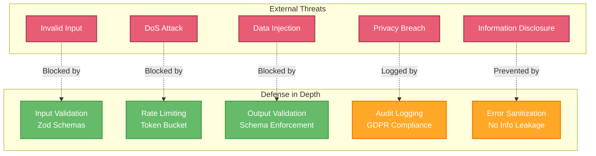

**Security Controls**:

| Control | Purpose | Implementation | ISMS Reference |
|---------|---------|----------------|----------------|
| Input Validation | Prevent injection attacks | Zod schemas with regex | ISO 27001 A.14.1.2 |
| Rate Limiting | Prevent DoS attacks | Token bucket (100/15min) | ISO 27001 A.12.1.3 |
| Output Validation | Ensure data integrity | Zod schema validation | ISO 27001 A.14.1.3 |
| Audit Logging | Track data access | Winston logging | ISO 27001 A.12.4.1 |
| Error Sanitization | Prevent info disclosure | Generic error messages | ISO 27001 A.14.1.2 |

---

## 📊 Performance Architecture

### Response Time Optimization

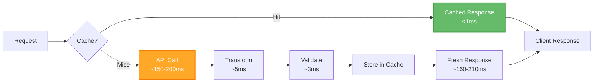

**Performance Metrics**:

| Scenario | Response Time | Cache Hit Rate | Throughput |
|----------|---------------|----------------|------------|
| Cached request | <1ms | 100% | >10,000 req/s |
| API call (EP responsive) | 150-200ms | 0% | ~5 req/s |
| API call (EP slow) | 500-1000ms | 0% | ~1-2 req/s |

---

## 📚 Additional Resources

### Related Documentation
- [API Usage Guide](./API_USAGE_GUIDE.md) - Detailed tool documentation
- [Troubleshooting Guide](./TROUBLESHOOTING.md) - Common issues
- [Developer Guide](./DEVELOPER_GUIDE.md) - Contributing guidelines
- [Deployment Guide](./DEPLOYMENT_GUIDE.md) - Installation instructions
- [Performance Guide](./PERFORMANCE_GUIDE.md) - Optimization strategies

### External Resources
- [C4 Model](https://c4model.com/) - Architecture documentation standard
- [MCP Specification](https://spec.modelcontextprotocol.io/) - Protocol specification
- [Mermaid Documentation](https://mermaid.js.org/) - Diagram syntax

### ISMS Compliance
- [ISO 27001](https://www.iso.org/standard/27001) - Information security management
- [NIST CSF 2.0](https://www.nist.gov/cyberframework) - Cybersecurity framework
- [Hack23 ISMS](https://github.com/Hack23/ISMS-PUBLIC) - Public ISMS policies

---

<p align="center">
  <strong>Built with ❤️ by <a href="https://hack23.com">Hack23 AB</a></strong><br>
  <em>ISMS-compliant architecture demonstrating security excellence</em>
</p>
