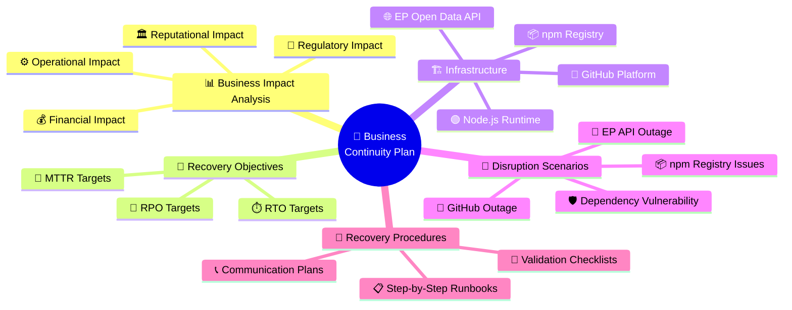
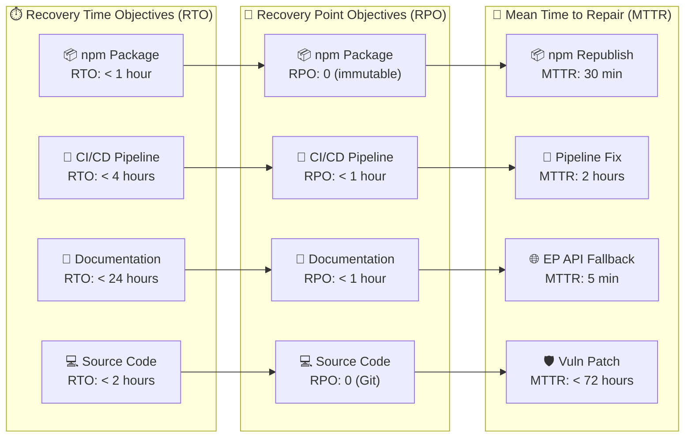

  

<h1 align="center">🔄 European Parliament MCP Server — Business Continuity Plan</h1>

  <strong>🛡️ Classification-Driven Business Resilience Framework</strong> 
  <em>🎯 Systematic Recovery Planning Through Enterprise-Grade Business Continuity</em>

  
  
  
  

**📋 Document Owner:** CEO | **📄 Version:** 1.0 | **📅 Last Updated:** 2026-02-20 (UTC)  
**🔄 Review Cycle:** Semi-Annual | **⏰ Next Review:** 2026-08-20 | **✅ Status:** Production Ready

---

## 📑 Table of Contents

- [🎯 Purpose Statement](#-purpose-statement)
- [📊 Business Impact Analysis](#-business-impact-analysis)
- [🏷️ System Classification](#️-system-classification)
- [🔄 Recovery Objectives](#-recovery-objectives)
- [📦 Service Dependencies](#-service-dependencies)
- [🚨 Disruption Scenarios](#-disruption-scenarios)
- [🔧 Recovery Procedures](#-recovery-procedures)
- [📋 Testing \& Maintenance](#-testing--maintenance)
- [🔗 Policy Alignment](#-policy-alignment)
- [📚 Related Documents](#-related-documents)
- [📝 Revision History](#-revision-history)

---

## 🎯 Purpose Statement

This Business Continuity Plan (BCP) establishes a **classification-driven business resilience framework** for the European Parliament MCP Server — a TypeScript/Node.js MCP server enabling AI assistants to access European Parliament open data. The plan demonstrates systematic recovery planning aligned with [Hack23 AB's Information Security Management System (ISMS)](https://github.com/Hack23/ISMS-PUBLIC) and ensures that service delivery can be maintained or rapidly restored following any disruption.

### 🔍 Transparency Commitment

This BCP is published as part of Hack23 AB's commitment to **open source security transparency**. By documenting continuity strategies publicly, we enable the community to understand our resilience posture and contribute to its improvement. This aligns with the [Hack23 Open Source Policy](https://github.com/Hack23/ISMS-PUBLIC/blob/main/Open_Source_Policy.md).

### 📐 Scope Definition

| Component | Description | Continuity Relevance |
|-----------|-------------|----------------------|
| **TypeScript/Node.js MCP Server** | Core server runtime (`src/`) | Primary service — must be recoverable from source control |
| **npm Package Distribution** | Published package `european-parliament-mcp-server` | User-facing distribution channel — RTO < 1 hour |
| **CI/CD Pipeline** | GitHub Actions workflows with SLSA Level 3 | Build integrity and automated release — RTO < 4 hours |
| **European Parliament API** | External data source (`data.europarl.europa.eu`) | Upstream dependency — graceful degradation required |
| **GitHub Pages Documentation** | Public-facing documentation site | Informational — RTO < 24 hours |
| **10 MCP Tools** | `get_meps`, `get_mep_details`, `get_plenary_sessions`, etc. | Core functionality — must degrade gracefully per tool |

### 🧠 BCP Structure Overview

---

## 📊 Business Impact Analysis

### 💰 Financial Impact Assessment

| Disruption Type | Duration | Financial Impact | Severity |
|----------------|----------|-----------------|----------|
| **npm package unavailable** | < 1 hour | 🟢 Minimal — users use cached versions | Low |
| **npm package unavailable** | 1–24 hours | 🟡 Moderate — new installations blocked | Medium |
| **CI/CD pipeline failure** | < 4 hours | 🟢 Minimal — delayed releases only | Low |
| **CI/CD pipeline failure** | > 24 hours | 🟡 Moderate — security patches delayed | Medium |
| **EP API outage** | Any duration | 🟢 Minimal — open source, no SLA revenue | Low |
| **Supply chain compromise** | Any duration | 🔴 Critical — trust and reputation damage | Critical |

### ⚙️ Operational Impact Assessment

| Service Component | Users Affected | Degradation Mode | Maximum Tolerable Downtime |
|-------------------|---------------|-------------------|---------------------------|
| **npm package** | All new installations | Cached versions available via npm mirror | 24 hours |
| **MCP tool responses** | Active AI assistant sessions | Return cached data or informative error messages | 4 hours |
| **GitHub source code** | Contributors and developers | Local clones available | 48 hours |
| **CI/CD automation** | Release pipeline | Manual build and publish fallback | 24 hours |
| **Documentation site** | New users and integrators | README available in npm package | 72 hours |

### 🏛️ Reputational Impact Assessment

| Scenario | Impact Level | Mitigation Strategy |
|----------|-------------|---------------------|
| **Data integrity failure** (serving incorrect EP data) | 🔴 Critical | Zod schema validation, automated integration tests, data source verification |
| **Supply chain attack** (compromised npm package) | 🔴 Critical | SLSA Level 3 provenance, Sigstore signing, reproducible builds |
| **Extended service unavailability** | 🟡 Moderate | Status communication via GitHub Issues, graceful degradation |
| **Security vulnerability disclosure** | 🟡 Moderate | Responsible disclosure process, rapid patching (< 72h for critical) |

### 📜 Regulatory Impact Assessment

| Regulation | Requirement | BCP Relevance |
|-----------|-------------|---------------|
| **GDPR** | Data protection, minimal personal data processing | Ensure audit logs are recoverable; no personal data in caches |
| **EU Cyber Resilience Act** | Software supply chain security | SLSA provenance, SBOM generation, vulnerability management |
| **ISO 27001 A.17** | Information security continuity | This BCP document and regular testing |
| **NIST CSF PR.IP-9** | Response and recovery plans | Recovery procedures and testing schedule |

---

## 🏷️ System Classification

### 📐 CIA Triad Classification

Classification based on the [Hack23 ISMS Classification Framework](https://github.com/Hack23/ISMS-PUBLIC/blob/main/CLASSIFICATION.md):

  
  
  

| Dimension | Rating | Justification |
|-----------|--------|---------------|
| **🔓 Confidentiality** | 🟢 Public | All data sourced from European Parliament open data portal; source code is open source (Apache-2.0 License) |
| **🔒 Integrity** | 🟡 Moderate | Data accuracy is important for trust — incorrect parliamentary data undermines credibility, but it is not safety-critical |
| **⏱️ Availability** | 🔵 Standard | No real-time SLA obligations; users can tolerate brief outages since AI assistants can retry or fall back |

### ⏱️ Recovery Time and Point Objectives

| Service Component | RTO Target | RPO Target | Rationale |
|-------------------|-----------|-----------|-----------|
| **npm package availability** | < 1 hour | 0 (immutable releases) | Packages are immutable once published; recovery means republishing |
| **CI/CD pipeline (GitHub Actions)** | < 4 hours | < 1 hour | Source code in Git; pipeline config is version-controlled |
| **EP API access** | N/A (external) | N/A | Graceful degradation — return cached data or meaningful error |
| **Source code repository** | < 2 hours | 0 (distributed Git) | Every contributor has a full clone; Git is inherently distributed |
| **Documentation site** | < 24 hours | < 1 hour | Static site; can be rebuilt from source in minutes |

---

## 🔄 Recovery Objectives

### 📊 Recovery Metrics Dashboard

### 🎯 Detailed Recovery Targets

| Metric | npm Registry | GitHub Actions | EP API Access | Source Code |
|--------|-------------|---------------|---------------|-------------|
| **RTO** | < 1 hour | < 4 hours | N/A (external) | < 2 hours |
| **RPO** | 0 (immutable) | < 1 hour | N/A | 0 (Git distributed) |
| **MTTR** | 30 minutes | 2 hours | 5 minutes (fallback) | 1 hour |
| **MTBF** | > 8,760 hours | > 2,190 hours | Variable (external) | > 8,760 hours |
| **Availability Target** | 99.9% | 99.5% | Best effort | 99.9% |

### 🔔 Escalation Thresholds

| Level | Trigger | Response Time | Action |
|-------|---------|--------------|--------|
| **🟢 L1 — Informational** | Service degradation detected | < 1 hour | Monitor and log; no immediate action needed |
| **🟡 L2 — Warning** | Single service component unavailable | < 2 hours | Activate graceful degradation; notify maintainers |
| **🟠 L3 — Major** | Multiple components affected or CI/CD broken | < 4 hours | Activate recovery procedures; status communication |
| **🔴 L4 — Critical** | Supply chain compromise or data integrity issue | < 30 minutes | Immediate incident response; package yanking if needed |

---

## 📦 Service Dependencies

### 🗺️ Dependency Map

| Dependency | Type | Criticality | Fallback Strategy |
|-----------|------|-------------|-------------------|
| **npm Registry** (`npmjs.com`) | Distribution | 🟠 High | Users cache packages locally; mirror registries available |
| **European Parliament API** (`data.europarl.europa.eu`) | Data Source | 🟡 Medium | Graceful degradation with cached responses and error messages |
| **GitHub** (Source Code) | Source Control | 🟠 High | Distributed Git clones; contributors have full repository copies |
| **GitHub Actions** (CI/CD) | Automation | 🟡 Medium | Manual build and publish fallback via local npm scripts |
| **GitHub Pages** (Documentation) | Documentation | 🟢 Low | README in npm package; docs in source repository |
| **Node.js Runtime** (≥ 18.x) | Runtime | 🟠 High | Pinned versions; multiple LTS versions supported (18, 20, 22) |
| **TypeScript Compiler** | Build Tool | 🟡 Medium | Version-locked in `package-lock.json`; offline build possible |
| **Zod** (Validation) | Library | 🟠 High | Locked version; no external runtime dependency |
| **MCP SDK** (`@modelcontextprotocol/sdk`) | Protocol | 🟠 High | Locked version; protocol is standardized |

### 🔗 External Service SLAs

| Service | Published SLA | Historical Uptime | Our Dependency Level |
|---------|--------------|-------------------|---------------------|
| **npm Registry** | 99.9% | ~99.95% | Build-time and install-time only |
| **GitHub** | 99.9% | ~99.95% | Source control, CI/CD, issue tracking |
| **EP Open Data API** | No published SLA | ~99% | Runtime data source (degradation-tolerant) |
| **GitHub Pages** | 99.9% | ~99.99% | Documentation hosting only |

---

## 🚨 Disruption Scenarios

### 🔌 Scenario 1: European Parliament API Outage

| Attribute | Detail |
|-----------|--------|
| **Probability** | 🟡 Medium (external service, no SLA guarantee) |
| **Impact** | 🟡 Medium (MCP tools return errors instead of data) |
| **Detection** | Automated health checks; HTTP error responses from EP API |
| **Affected Tools** | All 10 MCP tools (`get_meps`, `get_plenary_sessions`, etc.) |

**🛡️ Graceful Degradation Strategy:**

1. **Cache Layer**: LRU cache with 15-minute TTL provides short-term resilience for repeated queries
2. **Informative Errors**: Tools return structured error messages indicating EP API unavailability
3. **Partial Availability**: Tools not requiring live EP data (e.g., cached legislative data) continue operating
4. **Status Communication**: GitHub Issue created automatically for extended outages (> 1 hour)

### 📦 Scenario 2: npm Registry Issues

| Attribute | Detail |
|-----------|--------|
| **Probability** | 🟢 Low (npm has 99.9%+ uptime) |
| **Impact** | 🟡 Medium (new installations blocked) |
| **Detection** | Failed `npm install` commands; npm status page monitoring |
| **Affected Users** | New installations and CI/CD pipelines pulling latest version |

**🛡️ Mitigation Strategy:**

1. **Cached Packages**: Existing `node_modules` and `package-lock.json` continue working
2. **Mirror Registries**: Users can configure alternative npm mirrors (e.g., Verdaccio, GitHub Packages)
3. **Direct Install**: Package can be installed directly from GitHub releases as a tarball
4. **Lockfile Resilience**: `package-lock.json` ensures reproducible installs when registry recovers

### 🐙 Scenario 3: GitHub Platform Outage

| Attribute | Detail |
|-----------|--------|
| **Probability** | 🟢 Low (GitHub has 99.9%+ uptime) |
| **Impact** | 🟠 High (source code, CI/CD, issues, and documentation affected) |
| **Detection** | GitHub status page; failed CI/CD runs; inability to push code |
| **Affected Services** | Source control, CI/CD pipeline, issue tracking, documentation |

**🛡️ Mitigation Strategy:**

1. **Distributed Git**: Every contributor has a full clone of the repository with complete history
2. **Local Builds**: Project can be built locally with `npm run build` without GitHub
3. **Manual Publishing**: `npm publish` can be executed from any developer machine with credentials
4. **Alternative Hosting**: Repository can be mirrored to GitLab or Bitbucket as a contingency

### 🛡️ Scenario 4: Critical Dependency Vulnerability

| Attribute | Detail |
|-----------|--------|
| **Probability** | 🟡 Medium (supply chain attacks increasing industry-wide) |
| **Impact** | 🔴 Critical (compromised package integrity) |
| **Detection** | Dependabot alerts; Snyk scans; CodeQL analysis; OSSF Scorecard |
| **Affected Components** | Depends on the vulnerable dependency |

**🛡️ Response Strategy:**

1. **Immediate Assessment**: Evaluate CVE severity and exploitability within 30 minutes
2. **Patch or Pin**: Update to patched version, or pin to last known-good version
3. **Emergency Release**: Trigger expedited CI/CD pipeline for patch release
4. **Advisory Publication**: Create GitHub Security Advisory for transparency
5. **SLSA Verification**: Ensure patched release maintains SLSA Level 3 provenance

---

## 🔧 Recovery Procedures

### 📋 Procedure 1: npm Package Recovery

**Trigger:** npm package is unavailable, corrupted, or needs emergency replacement.

| Step | Action | Owner | Time Estimate |
|------|--------|-------|---------------|
| 1 | ✅ Verify the issue — confirm package is truly unavailable via `npm view european-parliament-mcp-server` | Maintainer | 2 min |
| 2 | 🔍 Check npm status page at `status.npmjs.org` for platform-wide issues | Maintainer | 2 min |
| 3 | 🏗️ If package is corrupted: checkout latest release tag from Git | Maintainer | 5 min |
| 4 | 🔧 Build locally: `npm ci && npm run build && npm run test` | Maintainer | 10 min |
| 5 | 📦 Publish: `npm publish` (requires npm credentials with 2FA) | Maintainer | 5 min |
| 6 | ✅ Verify: `npm install european-parliament-mcp-server@latest` in a clean directory | Maintainer | 3 min |
| 7 | 📢 Communicate resolution via GitHub Issue or Discussion | Maintainer | 3 min |

**⏱️ Total Estimated Time:** 30 minutes

### 📋 Procedure 2: CI/CD Pipeline Recovery

**Trigger:** GitHub Actions workflows are failing or GitHub Actions is unavailable.

| Step | Action | Owner | Time Estimate |
|------|--------|-------|---------------|
| 1 | ✅ Check GitHub Actions status at `githubstatus.com` | Maintainer | 2 min |
| 2 | 🔍 Review recent workflow runs for error patterns | Maintainer | 10 min |
| 3 | 🔧 If configuration issue: fix workflow YAML and push to trigger re-run | Maintainer | 15 min |
| 4 | 🏗️ If GitHub-wide issue: execute local build and test suite | Maintainer | 10 min |
| 5 | 📦 If release is urgent: manual `npm publish` from local machine | Maintainer | 10 min |
| 6 | ✅ Verify pipeline recovery by pushing a test commit | Maintainer | 5 min |
| 7 | 📝 Document incident and update runbook if new failure mode | Maintainer | 15 min |

**⏱️ Total Estimated Time:** ~1 hour

### 📋 Procedure 3: EP API Outage Response

**Trigger:** European Parliament Open Data API is unreachable or returning errors.

| Step | Action | Owner | Time Estimate |
|------|--------|-------|---------------|
| 1 | ✅ Verify API status: `curl -s -o /dev/null -w "%{http_code}" https://data.europarl.europa.eu/api/v2/meps` | Maintainer | 1 min |
| 2 | 🔍 Check EP data portal for maintenance notices | Maintainer | 5 min |
| 3 | 🛡️ Confirm graceful degradation is active — MCP tools return informative errors | Maintainer | 5 min |
| 4 | 📢 If extended outage (> 1 hour): create GitHub Issue with status update | Maintainer | 5 min |
| 5 | ⏳ Monitor EP API for recovery at 30-minute intervals | Maintainer | Ongoing |
| 6 | ✅ Once recovered: verify all 10 MCP tools return valid data | Maintainer | 10 min |
| 7 | 📝 Close GitHub Issue with resolution summary | Maintainer | 5 min |

**⏱️ Total Estimated Time:** 30 minutes (active work) + monitoring

### 📋 Procedure 4: Dependency Vulnerability Response

**Trigger:** Dependabot alert, Snyk notification, or CVE disclosure for a dependency.

| Step | Action | Owner | Time Estimate |
|------|--------|-------|---------------|
| 1 | 🔍 Assess CVE severity (CVSS score) and exploitability | Maintainer | 15 min |
| 2 | 📊 Determine if vulnerability affects production code paths | Maintainer | 30 min |
| 3 | 🔧 Update dependency: `npm update <package>` or pin safe version | Maintainer | 10 min |
| 4 | 🧪 Run full test suite: `npm run test:coverage` | Maintainer | 10 min |
| 5 | 🔒 Run security scans: CodeQL, license check, OSSF Scorecard | CI/CD | 15 min |
| 6 | 📦 Publish patched release via CI/CD pipeline | CI/CD | 15 min |
| 7 | 📢 Create GitHub Security Advisory if user action needed | Maintainer | 15 min |

**⏱️ Total Estimated Time:** ~2 hours

**🚨 SLA by Severity:**

| CVSS Score | Severity | Patch SLA |
|-----------|----------|-----------|
| 9.0–10.0 | 🔴 Critical | < 24 hours |
| 7.0–8.9 | 🟠 High | < 72 hours |
| 4.0–6.9 | 🟡 Medium | < 30 days |
| 0.1–3.9 | 🟢 Low | Next release cycle |

---

## 📋 Testing & Maintenance

### 🧪 BCP Testing Schedule

| Test Type | Frequency | Description | Owner |
|-----------|-----------|-------------|-------|
| **📋 Document Review** | Semi-Annual | Review BCP for accuracy and completeness | CEO |
| **🧪 Tabletop Exercise** | Annual | Walk through disruption scenarios with team | CEO + Maintainers |
| **🔧 Recovery Drill — npm** | Annual | Practice manual npm publish from local machine | Maintainer |
| **🔧 Recovery Drill — CI/CD** | Semi-Annual | Test local build fallback process | Maintainer |
| **🛡️ Dependency Audit** | Monthly | Review Dependabot alerts and dependency health | Maintainer |
| **🌐 EP API Health Check** | Automated (daily) | Verify EP API availability via integration tests | CI/CD |
| **📦 Package Integrity Check** | Per Release | Verify SLSA provenance and Sigstore signatures | CI/CD |

### 📊 Testing Success Criteria

| Test | Pass Criteria |
|------|--------------|
| **npm Recovery Drill** | Successfully publish a test package from local machine within 30 minutes |
| **CI/CD Recovery Drill** | Successfully build, test, and lint the project locally without GitHub Actions |
| **EP API Degradation Test** | All 10 MCP tools return structured error responses when EP API is mocked as unavailable |
| **Dependency Vulnerability Drill** | Successfully patch a simulated vulnerable dependency and release within 2 hours |

### 📝 Maintenance Activities

| Activity | Frequency | Description |
|----------|-----------|-------------|
| **🔄 BCP Document Update** | Semi-Annual | Update recovery procedures, contacts, and dependencies |
| **📦 Dependency Map Review** | Quarterly | Update service dependency inventory and SLA data |
| **📊 Recovery Metrics Review** | Quarterly | Review actual RTO/RPO/MTTR against targets |
| **🔗 Policy Alignment Check** | Annual | Verify BCP alignment with ISMS policy updates |
| **📢 Communication Plan Update** | Annual | Update escalation contacts and notification channels |

---

## 🔗 Policy Alignment

### 📜 ISMS Policy Mapping

This BCP aligns with the following [Hack23 AB ISMS policies](https://github.com/Hack23/ISMS-PUBLIC):

| ISMS Policy | BCP Section | Alignment |
|-------------|-------------|-----------|
| [**Backup & Recovery Policy**](https://github.com/Hack23/ISMS-PUBLIC/blob/main/Backup_Recovery_Policy.md) | Recovery Procedures, Recovery Objectives | ✅ RPO/RTO targets defined; Git distributed backup for source code |
| [**Incident Response Plan**](https://github.com/Hack23/ISMS-PUBLIC/blob/main/Incident_Response_Plan.md) | Disruption Scenarios, Recovery Procedures | ✅ Escalation thresholds and response procedures documented |
| [**Open Source Policy**](https://github.com/Hack23/ISMS-PUBLIC/blob/main/Open_Source_Policy.md) | Purpose Statement, Transparency | ✅ BCP published as part of open source transparency commitment |
| [**Secure Development Policy**](https://github.com/Hack23/ISMS-PUBLIC/blob/main/Secure_Development_Policy.md) | Dependency Vulnerability Response | ✅ SLSA Level 3 provenance; supply chain security controls |
| [**Classification Framework**](https://github.com/Hack23/ISMS-PUBLIC/blob/main/CLASSIFICATION.md) | System Classification | ✅ CIA triad classification drives recovery priority |
| [**Risk Management Policy**](https://github.com/Hack23/ISMS-PUBLIC/blob/main/Risk_Management_Policy.md) | Business Impact Analysis | ✅ Risk-based impact assessment for all disruption scenarios |

### 📐 Standards Compliance

| Standard | Requirement | Implementation |
|----------|-------------|----------------|
| **ISO 27001 A.17.1** | Information security continuity planning | This BCP document with defined recovery procedures |
| **ISO 27001 A.17.2** | Redundancies | Distributed Git, npm mirror fallback, local build capability |
| **ISO 22301** | Business continuity management | BIA, recovery objectives, testing schedule |
| **NIST CSF PR.IP-9** | Response plans and recovery plans | Recovery procedures with step-by-step runbooks |
| **NIST CSF RC.RP-1** | Recovery plan execution | Documented procedures with owner assignments |
| **CIS Controls v8.1 #17** | Incident response management | Escalation thresholds and communication plans |

---

## 📚 Related Documents

| Document | Description | Link |
|----------|-------------|------|
| **Security Architecture** | Defense-in-depth implementation and security controls | [SECURITY_ARCHITECTURE.md](./SECURITY_ARCHITECTURE.md) |
| **Threat Model** | STRIDE threat analysis and risk assessment | [THREAT_MODEL.md](./THREAT_MODEL.md) |
| **Architecture** | C4 model system architecture documentation | [ARCHITECTURE.md](./ARCHITECTURE.md) |
| **Security Policy** | Vulnerability disclosure and security practices | [SECURITY.md](./SECURITY.md) |
| **Deployment Guide** | Production deployment and operations | [DEPLOYMENT_GUIDE.md](./DEPLOYMENT_GUIDE.md) |
| **Troubleshooting** | Common issues and resolution steps | [TROUBLESHOOTING.md](./TROUBLESHOOTING.md) |
| **Contributing** | Development workflow and contribution guidelines | [CONTRIBUTING.md](./CONTRIBUTING.md) |
| **CI/CD Workflows** | GitHub Actions automation documentation | [WORKFLOWS.md](./.github/WORKFLOWS.md) |
| **Data Model** | Data structures and entity relationships | [DATA_MODEL.md](./DATA_MODEL.md) |
| **ISMS Public Policies** | Hack23 AB Information Security Management System | [ISMS-PUBLIC](https://github.com/Hack23/ISMS-PUBLIC) |

---

## 📝 Revision History

| Version | Date | Author | Changes |
|---------|------|--------|---------|
| 1.0 | 2026-02-20 | CEO | Initial BCP document — business impact analysis, recovery objectives, disruption scenarios, recovery procedures, testing schedule, and ISMS policy alignment |

---

  <em>This document is part of the <a href="https://github.com/Hack23/ISMS-PUBLIC">Hack23 AB ISMS</a> and is maintained under the European Parliament MCP Server project's documentation portfolio.</em>

