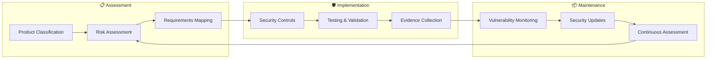

  

<h1 align="center">🛡️ European Parliament MCP Server — CRA Conformity Assessment</h1>

  <strong>Evidence-Driven Conformity Through Systematic Assessment</strong> 
  <em>Demonstrating CRA Compliance Excellence for Open Source MCP Server</em>

  
  
  
  

**📋 Document Owner:** CEO | **📄 Version:** 1.0 | **📅 Last Updated:** 2026-02-20 (UTC)  
**🔄 Review Cycle:** Quarterly | **⏰ Next Review:** 2026-05-20

---

## 📑 Table of Contents

- [Purpose Statement](#-purpose-statement)
- [Product Classification](#-product-classification)
- [Security Classification](#️-security-classification)
- [CRA Annex I Essential Requirements](#-cra-annex-i-essential-requirements)
- [CRA Annex V Technical Documentation](#-cra-annex-v-technical-documentation)
- [Vulnerability Disclosure](#️-vulnerability-disclosure)
- [Evidence Summary](#-evidence-summary)
- [Reference Implementations](#-reference-implementations)
- [Policy Alignment](#-policy-alignment)
- [Related Documents](#-related-documents)

---

## 🎯 Purpose Statement

**Hack23 AB's** CRA conformity assessment demonstrates how **systematic regulatory compliance directly enables business growth rather than creating operational burden.** Our comprehensive assessment framework serves as both operational tool and client demonstration of our cybersecurity consulting methodologies.

This assessment documents the European Parliament MCP Server's conformity with the EU Cyber Resilience Act (CRA), providing evidence-based compliance verification for open-source software distribution via npm.

*— James Pether Sörling, CEO/Founder*

---

## 📦 Product Classification

| Property | Value |
|----------|-------|
| **Product Name** | European Parliament MCP Server |
| **npm Package** | `european-parliament-mcp-server` |
| **Version** | 0.1.2 |
| **License** | Apache-2.0 |
| **CRA Classification** | Standard (Non-commercial Open Source Software) |
| **Distribution** | npm registry |
| **Product Category** | Developer tool / AI integration middleware |
| **Target Users** | AI assistant developers, political researchers |

### **📊 CRA Compliance Lifecycle**

---

## 🛡️ Security Classification

| Dimension | Level | Rationale |
|----------|-------|-----------|
| **🔐 Confidentiality** |  | Open source, processes only public EP data |
| **🔒 Integrity** |  | Parliamentary data accuracy important |
| **⚡ Availability** |  | Tolerates brief outages |

---

## 📋 CRA Annex I Essential Requirements

| # | Requirement | Implementation | Evidence | Status |
|---|-------------|---------------|----------|--------|
| 1 | Security by design | TypeScript strict mode, Zod validation, defense-in-depth | [SECURITY_ARCHITECTURE.md](SECURITY_ARCHITECTURE.md) | ✅ |
| 2 | Secure default configuration | Safe defaults, no credentials required, public data only | `src/clients/europeanParliamentClient.ts` | ✅ |
| 3 | Protection against unauthorized access | stdio transport (local only), input validation | [SECURITY_ARCHITECTURE.md](SECURITY_ARCHITECTURE.md) | ✅ |
| 4 | Confidentiality of data | Public data only, no PII storage, GDPR compliance | [SECURITY_ARCHITECTURE.md](SECURITY_ARCHITECTURE.md) | ✅ |
| 5 | Integrity of data | HTTPS for API calls, response validation, Zod schemas | `src/tools/` (all tool handlers) | ✅ |
| 6 | Data minimization | Request only needed fields, TTL-based caching | API client implementation | ✅ |
| 7 | Availability | Rate limiting, graceful error handling, circuit patterns | `src/clients/europeanParliamentClient.ts` | ✅ |
| 8 | Minimize negative impact | Error isolation, no cascade failures | Error handling patterns | ✅ |
| 9 | Security updates | Dependabot, automated CI/CD, npm publishing | `.github/workflows/` | ✅ |
| 10 | Vulnerability handling | CodeQL, npm audit, responsible disclosure | [SECURITY.md](SECURITY.md) | ✅ |
| 11 | Information and instructions | README, API docs, security documentation | [README.md](README.md) | ✅ |
| 12 | Software Bill of Materials | CycloneDX SBOM generation | [docs/SBOM.md](docs/SBOM.md) | ✅ |
| 13 | Coordinated vulnerability disclosure | Security policy, GitHub advisories | [SECURITY.md](SECURITY.md) | ✅ |

---

## 📋 CRA Annex V Technical Documentation

| # | Documentation Item | Location | Status |
|---|-------------------|----------|--------|
| 1 | Product description | [README.md](README.md) | ✅ |
| 2 | Design and development | [ARCHITECTURE.md](ARCHITECTURE.md) | ✅ |
| 3 | Cybersecurity risk assessment | [THREAT_MODEL.md](THREAT_MODEL.md) | ✅ |
| 4 | Security architecture | [SECURITY_ARCHITECTURE.md](SECURITY_ARCHITECTURE.md) | ✅ |
| 5 | Vulnerability assessment | [THREAT_MODEL.md](THREAT_MODEL.md) | ✅ |
| 6 | Security testing results | CI/CD test reports, coverage | ✅ |
| 7 | SBOM | [docs/SBOM.md](docs/SBOM.md) | ✅ |
| 8 | Build provenance | SLSA Level 3 attestations | ✅ |
| 9 | User documentation | [API_USAGE_GUIDE.md](API_USAGE_GUIDE.md), [DEVELOPER_GUIDE.md](DEVELOPER_GUIDE.md) | ✅ |

---

## 🛡️ Vulnerability Disclosure

### **📋 Disclosure Process**

| Step | Action | Timeline |
|------|--------|----------|
| 1 | Report via [SECURITY.md](SECURITY.md) or GitHub Security Advisories | Immediate |
| 2 | Acknowledgment of report | 48 hours |
| 3 | Initial assessment and triage | 72 hours |
| 4 | Fix development and testing | Based on severity |
| 5 | Security advisory publication | With fix release |
| 6 | npm package update | Same day as fix |

### **⏱️ Remediation SLAs**

| Severity | CVSS Score | Remediation Target |
|----------|-----------|-------------------|
| 🔴 Critical | 9.0 - 10.0 | 24 hours |
| 🟠 High | 7.0 - 8.9 | 7 days |
| 🟡 Medium | 4.0 - 6.9 | 30 days |
| 🟢 Low | 0.1 - 3.9 | 90 days |

### **🛡️ Proactive Security Measures**

- ✅ Dependabot automated dependency updates
- ✅ CodeQL static analysis on every PR
- ✅ npm audit in CI/CD pipeline
- ✅ OpenSSF Scorecard monitoring
- ✅ SLSA Level 3 build provenance

---

## 📊 Evidence Summary

| Evidence Type | Location | Verification | CRA Mapping |
|--------------|----------|-------------|-------------|
| OpenSSF Scorecard | [Scorecard](https://scorecard.dev/viewer/?uri=github.com/Hack23/European-Parliament-MCP-Server) | Automated | Annex I §10 |
| SLSA Level 3 | [Attestations](https://github.com/Hack23/European-Parliament-MCP-Server/attestations) | Build provenance | Annex V §8 |
| SBOM (CycloneDX) | [docs/SBOM.md](docs/SBOM.md) | Generated per build | Annex V §7 |
| Test Coverage (80%+) | CI/CD reports | Automated | Annex I §1 |
| Dependency Scanning | Dependabot alerts | Automated | Annex I §10 |
| Static Analysis | CodeQL results | Automated per PR | Annex I §1 |
| Security Documentation | This repository | Manual review | Annex V §1-9 |
| npm Audit | CI/CD pipeline | Automated | Annex I §9 |
| License Compliance | FOSSA | Automated | Annex V §1 |
| Branch Protection | GitHub settings | Configured | Annex I §2 |

---

## 🔗 Reference Implementations

| 🚀 Project | 📦 Product Type | 🏷️ CRA Classification | 🔗 Reference |
|------------|----------------|----------------------|-------------|
| **🕵️ CIA** | Political transparency platform | Standard (Non-commercial OSS) | [📄 CRA Assessment](https://github.com/Hack23/cia/blob/master/CRA-ASSESSMENT.md) |
| **⚫ Black Trigram** | Korean martial arts game | Standard (Non-commercial OSS) | [📄 CRA Assessment](https://github.com/Hack23/blacktrigram/blob/main/CRA-ASSESSMENT.md) |
| **🛡️ CIA Compliance Manager** | Compliance automation tool | Standard (Non-commercial OSS) | [📄 CRA Assessment](https://github.com/Hack23/cia-compliance-manager/blob/main/CRA-ASSESSMENT.md) |

---

## 🔗 Policy Alignment

| ISMS Policy | Relevance | Link |
|-------------|-----------|------|
| 🔒 Secure Development | Development security practices | [Secure_Development_Policy.md](https://github.com/Hack23/ISMS-PUBLIC/blob/main/Secure_Development_Policy.md) |
| 🔍 Vulnerability Management | Vulnerability handling | [Vulnerability_Management.md](https://github.com/Hack23/ISMS-PUBLIC/blob/main/Vulnerability_Management.md) |
| 🏷️ Classification | Data classification | [CLASSIFICATION.md](https://github.com/Hack23/ISMS-PUBLIC/blob/main/CLASSIFICATION.md) |
| 🌐 Open Source Policy | OSS governance | [Open_Source_Policy.md](https://github.com/Hack23/ISMS-PUBLIC/blob/main/Open_Source_Policy.md) |
| 🔐 Cryptography | Encryption standards | [Cryptography_Policy.md](https://github.com/Hack23/ISMS-PUBLIC/blob/main/Cryptography_Policy.md) |
| 🚨 Incident Response | Incident procedures | [Incident_Response_Plan.md](https://github.com/Hack23/ISMS-PUBLIC/blob/main/Incident_Response_Plan.md) |

---

## 📚 Related Documents

| Document | Description | Link |
|----------|-------------|------|
| 🎯 Threat Model | STRIDE analysis and risk assessment | [THREAT_MODEL.md](THREAT_MODEL.md) |
| 🛡️ Security Architecture | Current security controls | [SECURITY_ARCHITECTURE.md](SECURITY_ARCHITECTURE.md) |
| 🔄 Business Continuity Plan | Recovery procedures | [BCPPlan.md](BCPPlan.md) |
| 💰 Financial Security Plan | Security investment strategy | [FinancialSecurityPlan.md](FinancialSecurityPlan.md) |
| 📦 End-of-Life Strategy | Technology lifecycle | [End-of-Life-Strategy.md](End-of-Life-Strategy.md) |
| 🏛️ Architecture | System design overview | [ARCHITECTURE.md](ARCHITECTURE.md) |

---

  <em>This CRA assessment is maintained as part of the <a href="https://github.com/Hack23/ISMS-PUBLIC">Hack23 AB ISMS</a> framework.</em> 
  <em>Licensed under <a href="LICENSE.md">Apache-2.0</a></em>

