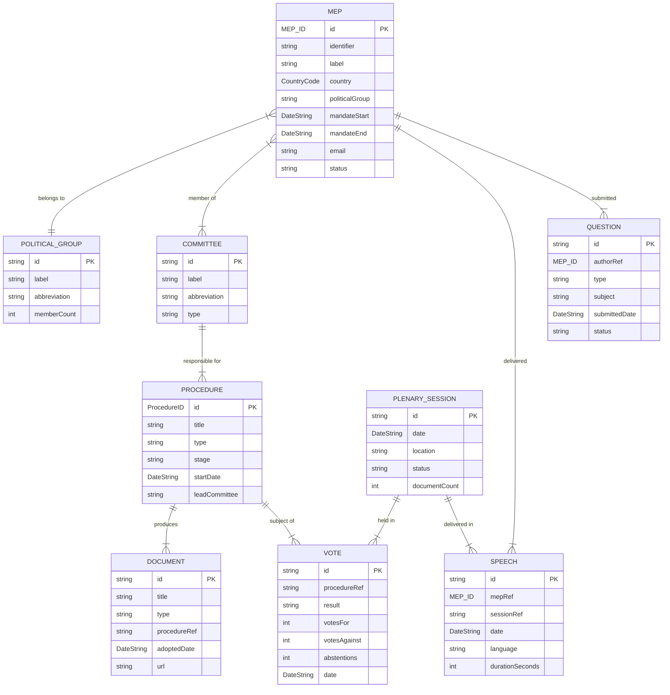
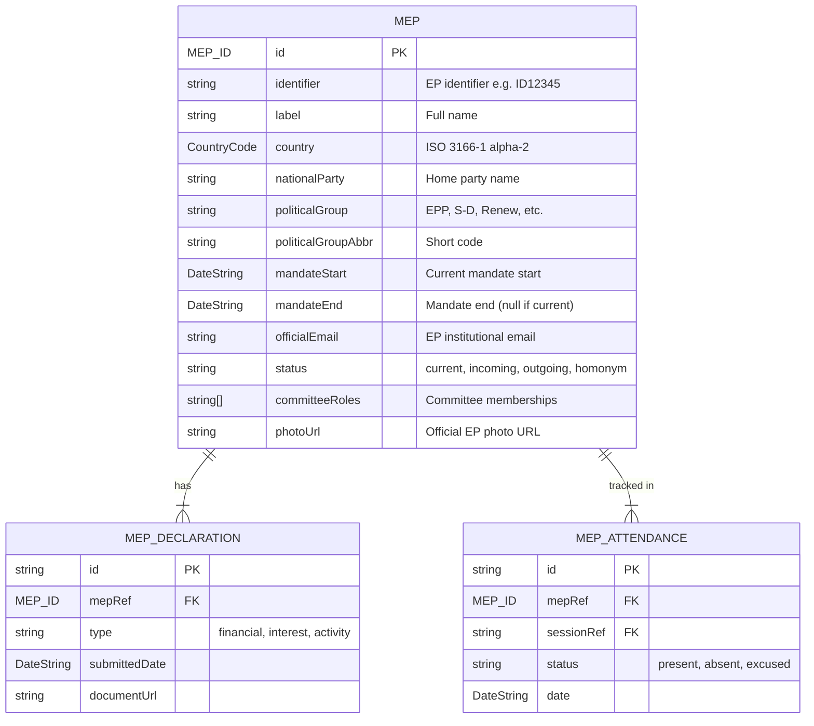
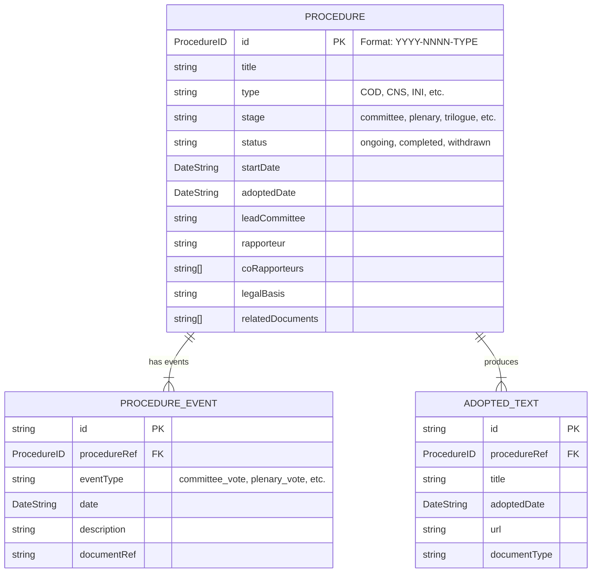
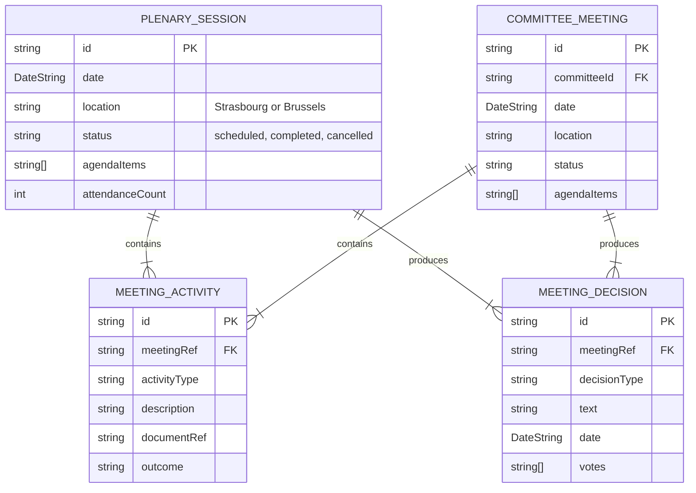
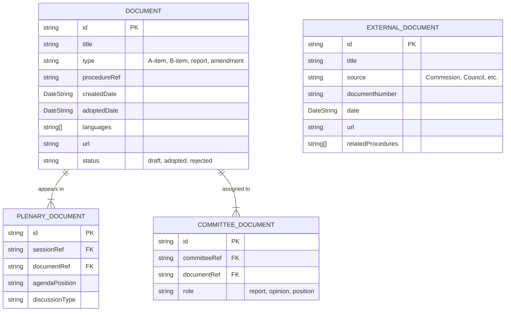
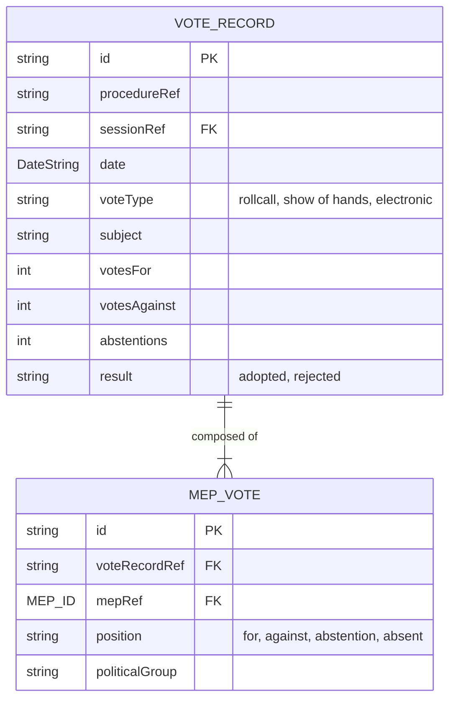

<p align="center">
  
</p>

<h1 align="center">📊 European Parliament MCP Server — Data Model</h1>

<p align="center">
  <strong>Entity Relationships, Branded Types, and EP API Data Structures</strong><br>
  <em>Comprehensive data model documentation for parliamentary intelligence data</em>
</p>

<p align="center">
  <a href="#"></a>
  <a href="#"></a>
  <a href="#"></a>
  <a href="#"></a>
</p>

**📋 Document Owner:** Hack23 | **📄 Version:** 1.0 | **📅 Last Updated:** 2026-02-26 (UTC)
**🔄 Review Cycle:** Quarterly | **⏰ Next Review:** 2026-05-26
**🏷️ Classification:** Public (Open Source MCP Server)
**✅ ISMS Compliance:** ISO 27001 (A.5.1, A.8.1, A.14.2), NIST CSF 2.0 (ID.AM, PR.DS), CIS Controls v8.1 (2.1, 16.1)

---

## 📑 Table of Contents

1. [Security Documentation Map](#security-documentation-map)
2. [Overview](#overview)
3. [Core Entity Relationships](#core-entity-relationships)
4. [MEP Entity Model](#mep-entity-model)
5. [Procedure Entity Model](#procedure-entity-model)
6. [Meeting and Session Model](#meeting-and-session-model)
7. [Document Entity Model](#document-entity-model)
8. [Vote Entity Model](#vote-entity-model)
9. [Branded Type Documentation](#branded-type-documentation)
10. [Zod Schema Overview](#zod-schema-overview)
11. [EP API JSON-LD Structure](#ep-api-json-ld-structure)
12. [Cache Key Patterns](#cache-key-patterns)

---

## 🗺️ Security Documentation Map

| Document | Current | Future | Description |
|----------|---------|--------|-------------|
| **Architecture** | [ARCHITECTURE.md](./ARCHITECTURE.md) | [FUTURE_ARCHITECTURE.md](./FUTURE_ARCHITECTURE.md) | C4 model, containers, components, ADRs |
| **Security Architecture** | [SECURITY_ARCHITECTURE.md](./SECURITY_ARCHITECTURE.md) | [FUTURE_SECURITY_ARCHITECTURE.md](./FUTURE_SECURITY_ARCHITECTURE.md) | Security controls, threat model |
| **Data Model** | [DATA_MODEL.md](./DATA_MODEL.md) | [FUTURE_DATA_MODEL.md](./FUTURE_DATA_MODEL.md) | Entity relationships, branded types |
| **Flowchart** | [FLOWCHART.md](./FLOWCHART.md) | [FUTURE_FLOWCHART.md](./FUTURE_FLOWCHART.md) | Business process flows |
| **State Diagram** | [STATEDIAGRAM.md](./STATEDIAGRAM.md) | [FUTURE_STATEDIAGRAM.md](./FUTURE_STATEDIAGRAM.md) | System state transitions |
| **Mind Map** | [MINDMAP.md](./MINDMAP.md) | [FUTURE_MINDMAP.md](./FUTURE_MINDMAP.md) | System concepts and relationships |
| **SWOT Analysis** | [SWOT.md](./SWOT.md) | [FUTURE_SWOT.md](./FUTURE_SWOT.md) | Strategic positioning |

---

## 🎯 Overview

The EP MCP Server's data model reflects the structure of the **European Parliament Open Data Portal API v2** (JSON-LD format). All entities are defined as TypeScript interfaces with corresponding Zod schemas for runtime validation. Branded types enforce semantic correctness for EP-specific identifiers.

### Data Source
- **Base URL**: `https://data.europarl.europa.eu/api/v2/`
- **Format**: JSON-LD (also supports RDF/XML)
- **Authentication**: None required (public open data)
- **Rate Limits**: 100 requests/minute (enforced server-side)

---

## 🔗 Core Entity Relationships



---

## 👤 MEP Entity Model



---

## 📜 Procedure Entity Model



---

## 🏛️ Meeting and Session Model



---

## 📄 Document Entity Model



---

## 🗳️ Vote Entity Model



---

## 🏷️ Branded Type Documentation

Branded types enforce semantic correctness for EP domain identifiers at both compile-time and runtime.

### Implemented Branded Types

```typescript
import { z } from 'zod';

// Procedure ID: YYYY/NNNN(TYPE) format
// Example: 2024/0001(COD), 2023/0089(INI)
const ProcedureIDSchema = z
  .string()
  .regex(/^\d{4}\/\d{4}\([A-Z]{2,4}\)$/)
  .brand<'ProcedureID'>();
type ProcedureID = z.infer<typeof ProcedureIDSchema>;

// ISO 3166-1 alpha-2 country code
// Example: DE, FR, SE, PL
const CountryCodeSchema = z
  .string()
  .length(2)
  .regex(/^[A-Z]{2}$/)
  .brand<'CountryCode'>();
type CountryCode = z.infer<typeof CountryCodeSchema>;

// ISO 8601 date string
// Example: 2024-03-15
const DateStringSchema = z
  .string()
  .regex(/^\d{4}-\d{2}-\d{2}$/)
  .brand<'DateString'>();
type DateString = z.infer<typeof DateStringSchema>;

// MEP identifier (positive integer)
const MEP_IDSchema = z
  .number()
  .int()
  .positive()
  .brand<'MEP_ID'>();
type MEP_ID = z.infer<typeof MEP_IDSchema>;

// Political group abbreviation
// Example: EPP, SD, Renew, Greens, ECR, ID, GUE
const PoliticalGroupSchema = z
  .string()
  .min(1)
  .max(20)
  .brand<'PoliticalGroup'>();
type PoliticalGroup = z.infer<typeof PoliticalGroupSchema>;
```

### Branded Type Validation Matrix

| Type | Format | Example | Validation Rule |
|------|--------|---------|----------------|
| `ProcedureID` | `YYYY/NNNN(TYPE)` | `2024/0001(COD)` | Regex: `^\d{4}\/\d{4}\([A-Z]{2,4}\)$` |
| `CountryCode` | `AA` | `DE`, `FR` | 2 uppercase letters |
| `DateString` | `YYYY-MM-DD` | `2024-03-15` | ISO 8601 format |
| `MEP_ID` | Integer | `12345` | Positive integer |
| `PoliticalGroup` | String | `EPP`, `SD` | 1-20 chars |

---

## 🔍 Zod Schema Overview

Each of the 39 MCP tools has a corresponding Zod input schema. Representative examples:

```typescript
// get_meps tool schema
const GetMEPsInputSchema = z.object({
  country: CountryCodeSchema.optional(),
  politicalGroup: PoliticalGroupSchema.optional(),
  term: z.number().int().positive().optional(),
  limit: z.number().int().min(1).max(100).default(50),
  offset: z.number().int().min(0).default(0),
});

// get_mep_details tool schema
const GetMEPDetailsInputSchema = z.object({
  mepId: MEP_IDSchema,
  includeDeclarations: z.boolean().default(false),
  includeAttendance: z.boolean().default(false),
});

// get_procedures tool schema
const GetProceduresInputSchema = z.object({
  procedureId: ProcedureIDSchema.optional(),
  type: z.enum(['COD', 'CNS', 'INI', 'RSP', 'BUD']).optional(),
  status: z.enum(['ongoing', 'completed', 'withdrawn']).optional(),
  fromDate: DateStringSchema.optional(),
  toDate: DateStringSchema.optional(),
  limit: z.number().int().min(1).max(100).default(20),
});
```

---

## 🌐 EP API JSON-LD Structure

The EP API returns JSON-LD format. The server normalizes this to plain TypeScript objects:

```json
{
  "@context": "https://data.europarl.europa.eu/api/v2/",
  "@graph": [
    {
      "@type": "ep:Member",
      "@id": "https://data.europarl.europa.eu/api/v2/meps/12345",
      "identifier": "12345",
      "label": "Maria Example",
      "country": "DE",
      "politicalGroup": "EPP",
      "mandateStart": "2024-07-16",
      "mandateEnd": null
    }
  ],
  "meta": {
    "total": 720,
    "offset": 0,
    "limit": 50
  }
}
```

### Normalization Pipeline

```
EP API JSON-LD → JSON.parse() → Extract @graph array → Map to typed objects → Zod validation → Branded types applied
```

---

## 🗝️ Cache Key Patterns

The LRU cache uses deterministic key generation for all EP API calls:

| Pattern | Example Key | TTL |
|---------|-------------|-----|
| `mep:{id}` | `mep:12345` | 15 min |
| `meps:list:{country}:{group}:{offset}:{limit}` | `meps:list:DE:EPP:0:50` | 15 min |
| `procedure:{id}` | `procedure:2024/0001(COD)` | 15 min |
| `procedures:list:{type}:{status}:{from}:{to}:{limit}` | `procedures:list:COD:ongoing:::20` | 15 min |
| `plenary:{id}` | `plenary:20240315` | 15 min |
| `plenary:list:{from}:{to}:{limit}` | `plenary:list:2024-01-01:2024-03-31:20` | 15 min |
| `votes:{id}` | `votes:V-2024-001` | 15 min |
| `committee:{id}` | `committee:ENVI` | 15 min |
| `vocab:{type}` | `vocab:countries` | 60 min |

**Cache Key Construction:**
```typescript
function buildCacheKey(client: string, params: Record<string, unknown>): string {
  const sortedParams = Object.keys(params)
    .sort()
    .map(k => `${k}:${params[k] ?? ''}`)
    .join(':');
  return `${client}:${sortedParams}`;
}
```

---

*See [FUTURE_DATA_MODEL.md](./FUTURE_DATA_MODEL.md) for planned enhancements including graph database support and temporal data models.*
