<p align="center">
  
</p>

<h1 align="center">📊 European Parliament MCP Server — Data Model</h1>

<p align="center">
  <strong>Entity Relationships, Type Definitions, and Data Flow Architecture</strong><br>
  <em>Stateless MCP Server — 12 Domain Types, 5 Branded IDs, 12 Analytical Output Types</em>
</p>

<p align="center">
  <a href="#"></a>
  <a href="#"></a>
  <a href="#"></a>
  <a href="#"></a>
</p>

**📋 Document Owner:** Architecture Team | **📄 Version:** 0.6.2 | **📅 Last Updated:** 2025-06-20 (UTC)  
**🔄 Review Cycle:** Quarterly | **⏰ Next Review:** 2025-09-20  
**🏷️ Classification:** Public (Open Source MCP Server)  
**✅ ISMS Compliance:** ISO 27001 (A.8.1, A.8.2, A.18.1), NIST CSF 2.0 (ID.AM, PR.DS), CIS Controls v8.1 (3.1, 3.3)

---

## 📋 Table of Contents

1. [Architecture Documentation Map](#-architecture-documentation-map)
2. [Data Model Overview](#-data-model-overview)
3. [Core Data Model — Entity Relationships](#-core-data-model--entity-relationships)
4. [MEP Data Model](#-mep-data-model)
5. [Parliamentary Session & Voting Data Model](#-parliamentary-session--voting-data-model)
6. [Committee Data Model](#-committee-data-model)
7. [Legislative Document Data Model](#-legislative-document-data-model)
8. [Legislative Procedure Data Model](#-legislative-procedure-data-model)
9. [Parliamentary Activity Data Model](#-parliamentary-activity-data-model)
10. [Analytical Output Data Model](#-analytical-output-data-model)
11. [Pagination & Response Wrapper](#-pagination--response-wrapper)
12. [Data Flow Architecture](#-data-flow-architecture)
13. [Type Safety — Branded Types](#-type-safety--branded-types)
14. [Data Classification](#-data-classification)
15. [ISMS Compliance](#-isms-compliance)
16. [Related Documentation](#-related-documentation)

---

## 🗺️ Architecture Documentation Map

| Document | Current | Future | Description |
|----------|---------|--------|-------------|
| **Architecture** | [ARCHITECTURE.md](./ARCHITECTURE.md) | [FUTURE_ARCHITECTURE.md](./FUTURE_ARCHITECTURE.md) | C4 model, containers, components |
| **Mind Map** | [MINDMAP.md](./MINDMAP.md) | [FUTURE_MINDMAP.md](./FUTURE_MINDMAP.md) | System concepts and relationships |
| **SWOT Analysis** | [SWOT.md](./SWOT.md) | [FUTURE_SWOT.md](./FUTURE_SWOT.md) | Strategic positioning |
| **Data Model** | **[DATA_MODEL.md](./DATA_MODEL.md)** ← You are here | [FUTURE_DATA_MODEL.md](./FUTURE_DATA_MODEL.md) | Entity relationships and schemas |
| **Flowchart** | [FLOWCHART.md](./FLOWCHART.md) | [FUTURE_FLOWCHART.md](./FUTURE_FLOWCHART.md) | Business process flows |
| **State Diagram** | [STATEDIAGRAM.md](./STATEDIAGRAM.md) | [FUTURE_STATEDIAGRAM.md](./FUTURE_STATEDIAGRAM.md) | System state transitions |
| **Workflows** | [WORKFLOWS.md](./WORKFLOWS.md) | [FUTURE_WORKFLOWS.md](./FUTURE_WORKFLOWS.md) | CI/CD pipeline documentation |
| **Security Architecture** | [SECURITY_ARCHITECTURE.md](./SECURITY_ARCHITECTURE.md) | [FUTURE_SECURITY_ARCHITECTURE.md](./FUTURE_SECURITY_ARCHITECTURE.md) | Security controls and design |
| **Threat Model** | [THREAT_MODEL.md](./THREAT_MODEL.md) | — | STRIDE-based threat analysis |
| **CRA Assessment** | [CRA-ASSESSMENT.md](./CRA-ASSESSMENT.md) | — | EU Cyber Resilience Act review |
| **Architecture Diagrams** | [ARCHITECTURE_DIAGRAMS.md](./ARCHITECTURE_DIAGRAMS.md) | — | Supplementary C4 diagrams |

---

## 🎯 Data Model Overview

The **European Parliament MCP Server** (v0.6.2) is a **stateless, read-only** [Model Context Protocol](https://spec.modelcontextprotocol.io/) server. It has **no local database** — all parliamentary data is fetched on demand from the [European Parliament Open Data Portal API v2](https://data.europarl.europa.eu/api/v2/) in JSON-LD format, transformed into strongly-typed TypeScript interfaces, and returned as structured MCP content blocks.

### Key Data Architecture Characteristics

| Characteristic | Detail |
|----------------|--------|
| **Data Source** | European Parliament Open Data Portal API v2 (JSON-LD) |
| **Storage** | None — stateless proxy; no local database |
| **Caching** | LRU in-memory cache: 500 entries max, 15-minute TTL |
| **Domain Types** | 12 core interfaces (+ 5 supporting types) |
| **Branded IDs** | 5 compile-time-safe identifier types (MEPID, SessionID, CommitteeID, DocumentID, GroupID) |
| **Analytical Types** | 12 computed output interfaces (OSINT intelligence products) |
| **Validation** | Zod schemas for all 39 tool inputs; runtime type guards for branded IDs |
| **Pagination** | Offset-based `PaginatedResponse<T>` wrapper |
| **GDPR** | Personal data fields tagged `@gdpr`; audit logging for access; 15-min cache TTL |

### Data Type Inventory

| # | Interface | Source File | EP API Endpoint | Description |
|---|-----------|-------------|-----------------|-------------|
| 1 | `MEP` | `europeanParliament.ts` | `/meps` | Member of European Parliament |
| 2 | `MEPDetails` | `europeanParliament.ts` | `/meps/{id}` | Extended MEP profile (extends MEP) |
| 3 | `VotingStatistics` | `europeanParliament.ts` | `/meps/{id}/voting-statistics` | MEP voting behavior metrics |
| 4 | `PlenarySession` | `europeanParliament.ts` | `/plenary-sessions` | Plenary meetings |
| 5 | `VotingRecord` | `europeanParliament.ts` | `/voting-records` | Roll-call vote results |
| 6 | `Committee` | `europeanParliament.ts` | `/committees` | Parliamentary committees |
| 7 | `LegislativeDocument` | `europeanParliament.ts` | `/documents` | Parliamentary documents |
| 8 | `ParliamentaryQuestion` | `europeanParliament.ts` | `/parliamentary-questions` | Questions to EU institutions |
| 9 | `Speech` | `europeanParliament.ts` | `/speeches` | Plenary speeches |
| 10 | `Procedure` | `europeanParliament.ts` | `/procedures` | Legislative procedures |
| 11 | `AdoptedText` | `europeanParliament.ts` | `/adopted-texts` | Adopted texts |
| 12 | `EPEvent` | `europeanParliament.ts` | `/events` | Parliamentary events |
| 13 | `MeetingActivity` | `europeanParliament.ts` | `/meeting-activities` | Meeting activities |
| 14 | `MEPDeclaration` | `europeanParliament.ts` | `/declarations` | MEP declarations |
| 15 | `PaginatedResponse<T>` | `europeanParliament.ts` | — | Generic pagination wrapper |

---

## 🏛️ Core Data Model — Entity Relationships


---

## 👤 MEP Data Model

The MEP (Member of European Parliament) data model forms the core entity. `MEPDetails` extends `MEP` with biographical, social, and statistical information.


### MEP Field Reference

| Field | Type | Required | GDPR | Description |
|-------|------|----------|------|-------------|
| `id` | `string` | ✅ | — | Unique identifier (`"person/{numeric-id}"`) |
| `name` | `string` | ✅ | — | Full name in official format |
| `country` | `string` | ✅ | — | ISO 3166-1 alpha-2 country code |
| `politicalGroup` | `string` | ✅ | — | Political group abbreviation (EPP, S&D, Renew, etc.) |
| `committees` | `string[]` | ✅ | — | Committee abbreviations (DEVE, ENVI, ECON, etc.) |
| `email` | `string` | ❌ | ⚠️ | EP email address — GDPR audit required |
| `active` | `boolean` | ✅ | — | Currently serving in Parliament |
| `termStart` | `string` | ✅ | — | Term start date (ISO 8601) |
| `termEnd` | `string` | ❌ | — | Term end date (ISO 8601), undefined if active |

### MEPDetails Extended Fields

| Field | Type | Required | GDPR | Description |
|-------|------|----------|------|-------------|
| `biography` | `string` | ❌ | — | Free-text biography |
| `phone` | `string` | ❌ | ⚠️ | Office phone — GDPR audit required |
| `address` | `string` | ❌ | ⚠️ | Office address — GDPR audit required |
| `website` | `string` | ❌ | — | Personal/official website URL |
| `twitter` | `string` | ❌ | — | Twitter/X handle |
| `facebook` | `string` | ❌ | — | Facebook profile identifier |
| `votingStatistics` | `VotingStatistics` | ❌ | — | Aggregated voting behavior metrics |
| `roles` | `string[]` | ❌ | — | Parliamentary roles and positions |

---

## 🗳️ Parliamentary Session & Voting Data Model


### VotingRecord Field Reference

| Field | Type | Required | Description |
|-------|------|----------|-------------|
| `id` | `string` | ✅ | Unique vote ID (`"VOTE-YYYY-MM-DD-NNN"`) |
| `sessionId` | `string` | ✅ | Reference to PlenarySession.id |
| `topic` | `string` | ✅ | Vote subject description |
| `date` | `string` | ✅ | ISO 8601 datetime with timezone |
| `votesFor` | `number` | ✅ | Count of votes in favor |
| `votesAgainst` | `number` | ✅ | Count of votes against |
| `abstentions` | `number` | ✅ | Count of abstentions |
| `result` | `'ADOPTED' \| 'REJECTED'` | ✅ | Vote outcome |
| `mepVotes` | `Record<string, 'FOR' \| 'AGAINST' \| 'ABSTAIN'>` | ❌ | Individual MEP vote positions |

---

## 🏢 Committee Data Model


### Committee Field Reference

| Field | Type | Required | Description |
|-------|------|----------|-------------|
| `id` | `string` | ✅ | Unique ID (`"COMM-{ABBREV}"`, e.g., `"COMM-DEVE"`) |
| `name` | `string` | ✅ | Full official committee name |
| `abbreviation` | `string` | ✅ | 4-letter code (DEVE, ENVI, ECON, etc.) |
| `members` | `string[]` | ✅ | Array of MEP IDs (full members) |
| `chair` | `string` | ❌ | MEP ID of committee chair |
| `viceChairs` | `string[]` | ❌ | MEP IDs of vice-chairs (1–4 typically) |
| `meetingSchedule` | `string[]` | ❌ | ISO 8601 datetime strings for scheduled meetings |
| `responsibilities` | `string[]` | ❌ | Policy areas within committee mandate |

---

## 📄 Legislative Document Data Model


### DocumentType Values

| Value | Legal Effect | Reference Format | Description |
|-------|-------------|------------------|-------------|
| `REPORT` | Non-binding | `A9-{number}/{year}` | Committee report on legislative proposal |
| `RESOLUTION` | Non-binding | `B9-{number}/{year}` | Motion for a resolution |
| `DECISION` | Binding on addressees | Varies | Binding legal act addressed to specific recipients |
| `DIRECTIVE` | Binding (requires transposition) | Varies | Requires member state implementation |
| `REGULATION` | Directly applicable | Varies | Binding law with direct effect in all member states |
| `OPINION` | Non-binding | Working documents | Opinion on another committee's report |
| `AMENDMENT` | Modifies text if adopted | Amendment number | Proposed change to draft legislation |

### DocumentStatus Workflow

| Status | Description | Next Status |
|--------|-------------|-------------|
| `DRAFT` | Initial document preparation | → `SUBMITTED` |
| `SUBMITTED` | Officially tabled/registered | → `IN_COMMITTEE` |
| `IN_COMMITTEE` | Committee examination and amendments | → `PLENARY` or `DRAFT` |
| `PLENARY` | Scheduled for full Parliament vote | → `ADOPTED` or `REJECTED` |
| `ADOPTED` | Approved by Parliament (final) | — |
| `REJECTED` | Not approved (final) | — |

---

## ⚖️ Legislative Procedure Data Model


### Procedure Field Reference

| Field | Type | Required | Description |
|-------|------|----------|-------------|
| `id` | `string` | ✅ | Unique procedure identifier |
| `title` | `string` | ✅ | Procedure title |
| `reference` | `string` | ✅ | EP reference (e.g., `"2023/0123(COD)"`) |
| `type` | `string` | ✅ | Procedure type (ordinary, consent, consultation) |
| `subjectMatter` | `string` | ✅ | Policy area / subject |
| `stage` | `string` | ✅ | Current legislative stage |
| `status` | `string` | ✅ | Current status |
| `dateInitiated` | `string` | ✅ | ISO 8601 date when procedure started |
| `dateLastActivity` | `string` | ✅ | ISO 8601 date of most recent activity |
| `responsibleCommittee` | `string` | ✅ | Lead committee ID |
| `rapporteur` | `string` | ✅ | MEP ID of rapporteur |
| `documents` | `string[]` | ✅ | Array of related document IDs |

### ParliamentaryQuestion Field Reference

| Field | Type | Required | Description |
|-------|------|----------|-------------|
| `id` | `string` | ✅ | Question reference (`"E-000123/2024"`, `"O-000045/2024"`) |
| `type` | `'WRITTEN' \| 'ORAL'` | ✅ | Question type |
| `author` | `string` | ✅ | MEP ID of question author |
| `date` | `string` | ✅ | Submission date (ISO 8601) |
| `topic` | `string` | ✅ | Subject matter (50–150 chars) |
| `questionText` | `string` | ✅ | Full question text |
| `answerText` | `string` | ❌ | Answer from institution (when answered) |
| `answerDate` | `string` | ❌ | Date answer was provided (ISO 8601) |
| `status` | `'PENDING' \| 'ANSWERED'` | ✅ | Current question status |

---

## 📅 Parliamentary Activity Data Model


---

## 🔬 Analytical Output Data Model

The OSINT intelligence tools produce **computed analytical data** derived from core entities. These are **real-time aggregations returned by MCP tools**, not stored entities. All analytical outputs include `confidenceLevel` and `methodology` fields for transparency.

```mermaid
classDiagram
    class LegislativePipelineAnalysis {
        +period: from, to
        +filter: committee, status
        +PipelineItem[] pipeline
        +summary: totalProcedures, activeCount, stalledCount, completedCount, avgDaysInPipeline
        +BottleneckInfo[] bottlenecks
        +computedAttributes: pipelineHealthScore, throughputRate, bottleneckIndex, stalledProcedureRate, estimatedClearanceTime, legislativeMomentum
        +string confidenceLevel
        +string methodology
    }

    class CommitteeActivityAnalysis {
        +string committeeId
        +string committeeName
        +period: from, to
        +workload: activeLegislativeFiles, documentsProduced, meetingsHeld, opinionsIssued
        +memberEngagement: totalMembers, averageAttendance, activeContributors
        +legislativeOutput: reportsAdopted, amendmentsProcessed, successRate
        +computedAttributes: workloadIntensity, productivityScore, engagementLevel, policyImpactRating
        +string confidenceLevel
        +string methodology
    }

    class AttendanceAnalysis {
        +period: from, to
        +string scope
        +MepAttendanceRecord[] records
        +summary: totalMEPs, averageAttendance, highAttendance, mediumAttendance, lowAttendance
        +computedAttributes: overallEngagement, attendanceTrend, absenteeismRisk
        +string confidenceLevel
        +string methodology
    }

    class CountryDelegationAnalysis {
        +string country
        +period: from, to
        +delegation: totalMEPs, activeMEPs, groupDistribution
        +votingBehavior: averageAttendance, averageLoyalty, nationalCohesion
        +committeePresence: committeesRepresented, leadershipRoles
        +computedAttributes: delegationInfluence, nationalCohesionLevel, groupFragmentation, engagementLevel
        +string confidenceLevel
        +string methodology
    }

    class PoliticalLandscape {
        +period: from, to
        +parliament: totalMEPs, politicalGroups, countriesRepresented
        +GroupSummary[] groups
        +powerDynamics: largestGroup, majorityThreshold, grandCoalitionSize, progressiveBloc, conservativeBloc
        +activityMetrics: averageAttendance, recentSessionCount
        +computedAttributes: fragmentationIndex, majorityType, politicalBalance, overallEngagement
        +string confidenceLevel
        +string methodology
    }

    LegislativePipelineAnalysis ..> Procedure : monitors
    CommitteeActivityAnalysis ..> Committee : evaluates
    AttendanceAnalysis ..> MEP : tracks
    CountryDelegationAnalysis ..> MEP : groups by country
    PoliticalLandscape ..> PoliticalGroup : maps
```




### Analytical Output Inventory

| # | Type | MCP Tool | Input Entity | Description |
|---|------|----------|-------------|-------------|
| 1 | `VotingPatternAnalysis` | `analyze_voting_patterns` | MEP, VotingRecord | MEP voting behavior and group alignment |
| 2 | `MepInfluenceAssessment` | `assess_mep_influence` | MEP, Committee | Multi-dimensional MEP influence scoring |
| 3 | `CoalitionDynamicsAnalysis` | `analyze_coalition_dynamics` | VotingRecord | Political group cohesion and alliances |
| 4 | `VotingAnomalyAnalysis` | `detect_voting_anomalies` | VotingRecord | Statistical anomaly detection in voting |
| 5 | `PoliticalGroupComparison` | `compare_political_groups` | VotingRecord | Cross-group performance ranking |
| 6 | `LegislativeEffectivenessAnalysis` | `evaluate_legislative_effectiveness` | MEP, Procedure | Legislative productivity scoring |
| 7 | `LegislativePipelineAnalysis` | `monitor_legislative_pipeline` | Procedure | Pipeline health and bottleneck detection |
| 8 | `CommitteeActivityAnalysis` | `analyze_committee_activity` | Committee | Committee workload and productivity |
| 9 | `AttendanceAnalysis` | `analyze_mep_attendance` | MEP, PlenarySession | Attendance tracking and trends |
| 10 | `CountryDelegationAnalysis` | `analyze_country_delegation` | MEP | National delegation analysis |
| 11 | `PoliticalLandscape` | `get_political_landscape` | All entities | Parliament-wide political mapping |
| 12 | `LegislativeProcedure` | `track_legislation` | Procedure | Detailed procedure tracking with timeline |

---

## 📦 Pagination & Response Wrapper

All list-returning MCP tools use the generic `PaginatedResponse<T>` wrapper for offset-based pagination.


| Field | Type | Description |
|-------|------|-------------|
| `data` | `T[]` | Array of items for current page (0 to `limit` items) |
| `total` | `number` | Total count of matching items across all pages |
| `limit` | `number` | Maximum items per page (recommended: 50–100) |
| `offset` | `number` | Current offset position (0-indexed) |
| `hasMore` | `boolean` | `true` if more pages are available after this one |

---

## 🔄 Data Flow Architecture

### End-to-End Data Flow


### Data Transformation Pipeline


---

## 🛡️ Type Safety — Branded Types

The server uses **branded types** (`src/types/branded.ts`) for compile-time type safety, preventing accidental mixing of different ID types at the TypeScript level.

```mermaid
classDiagram
    class Brand~K_T~ {
        <<type>>
        K & __brand: T
    }

    class MEPID {
        <<branded string>>
        format: numeric string
        example: "124936"
        guard: isMEPID()
        factory: createMEPID()
    }

    class SessionID {
        <<branded string>>
        format: P{term}-YYYY-MM-DD
        example: "P9-2024-11-20"
        guard: isSessionID()
        factory: createSessionID()
    }

    class CommitteeID {
        <<branded string>>
        format: 2-6 uppercase letters
        example: "DEVE"
        guard: isCommitteeID()
        factory: createCommitteeID()
    }

    class DocumentID {
        <<branded string>>
        format: A{parliament}-YYYY/NNNN
        example: "A9-2024/0123"
        guard: isDocumentID()
        factory: createDocumentID()
    }

    class GroupID {
        <<branded string>>
        values: EPP, S&D, Renew, Greens/EFA, ECR, ID, The Left, NI
        guard: isGroupID()
        factory: createGroupID()
    }

    Brand <|-- MEPID
    Brand <|-- SessionID
    Brand <|-- CommitteeID
    Brand <|-- DocumentID
    Brand <|-- GroupID
```

### Branded Type Reference

| Branded Type | Base Type | Format / Validation | Factory Function | Type Guard |
|-------------|-----------|---------------------|-----------------|------------|
| `MEPID` | `string` | Numeric string (`/^[0-9]+$/`) | `createMEPID(value)` | `isMEPID(value)` |
| `SessionID` | `string` | `P{term}-YYYY-MM-DD` (`/^P\d+-\d{4}-\d{2}-\d{2}$/`) | `createSessionID(value)` | `isSessionID(value)` |
| `CommitteeID` | `string` | 2–6 uppercase letters (`/^[A-Z]{2,6}$/`) | `createCommitteeID(value)` | `isCommitteeID(value)` |
| `DocumentID` | `string` | `A{parliament}-YYYY/NNNN` (`/^[A-Z]\d+-\d{4}\/\d{4}$/`) | `createDocumentID(value)` | `isDocumentID(value)` |
| `GroupID` | `string` | Known abbreviations (EPP, S&D, Renew, Greens/EFA, ECR, ID, The Left, NI) | `createGroupID(value)` | `isGroupID(value)` |

Each factory function **throws an `Error`** if the value does not match the expected format — preventing invalid IDs from entering the system at runtime.

---

## 🔐 Data Classification

| Data Type | Classification | Sensitivity | Retention | Encryption |
|-----------|----------------|-------------|-----------|------------|
| MEP Public Info | Public | Low | 15 min cache | In-transit (TLS) |
| MEP Contact Info (email, phone) | Public (GDPR-tagged) | Medium | 15 min cache | In-transit (TLS) |
| Voting Records | Public | Low | 15 min cache | In-transit (TLS) |
| Legislative Documents | Public | Low | 15 min cache | In-transit (TLS) |
| Analytical Outputs | Computed (not stored) | Low | Not retained | In-transit (TLS) |
| Audit Logs (IDs only) | Internal | Medium | 90 days | At-rest + TLS |
| Configuration | Internal | Medium | Permanent | Environment vars |

**GDPR Compliance:**
- ✅ **No persistent storage** of personal data — stateless architecture
- ✅ **Cache TTL: 15 minutes** — minimal retention per ISMS Policy DP-003
- ✅ **Audit logs: MEP IDs only** — no names, emails, or phone numbers in logs
- ✅ **Right to erasure:** Automatic via cache expiration
- ✅ **Data minimization:** Only fields needed for MCP response are fetched
- ✅ **GDPR-tagged fields:** `email`, `phone`, `address` marked with `@gdpr` in source

---

## 📋 ISMS Compliance

### ISO 27001 Controls

| Control | Requirement | Implementation |
|---------|-------------|----------------|
| **A.8.1** | Asset Inventory | All 15 data types documented with field-level detail in this document |
| **A.8.2** | Information Classification | Data classification table with sensitivity levels and retention |
| **A.8.3** | Media Handling | No persistent storage; LRU cache-only architecture |
| **A.14.2** | Secure Development | Branded types, Zod validation, TypeScript strict mode |
| **A.18.1** | Privacy & Data Protection | GDPR compliance: no persistent PII, 15-min TTL, audit logging |

### NIST CSF 2.0 Functions

| Function | Category | Implementation |
|----------|----------|----------------|
| **ID.AM** | Asset Management | Complete entity relationship documentation with field references |
| **PR.DS** | Data Security | GDPR-compliant data handling, TLS in transit, cache-only storage |
| **PR.IP** | Information Protection | Data minimization, purpose limitation, branded type safety |
| **DE.AE** | Anomalies & Events | GDPR audit logging for personal data access (IDs only) |

### CIS Controls v8.1

| Control | Description | Implementation |
|---------|-------------|----------------|
| **3.1** | Data Inventory | Complete data type inventory with 15 domain types documented |
| **3.3** | Protect Data | Encryption in transit (TLS), minimal retention (15 min), no at-rest storage |
| **3.6** | Encrypt Data on End-User Devices | No persistent storage on server — stateless proxy |
| **8.2** | Audit Logging | Access logging with 90-day retention, MEP IDs only |
| **16.1** | Application Software Security | Zod input validation, branded types, TypeScript strict mode |

### ISMS Policy References

| Policy | Relevance | Link |
|--------|-----------|------|
| 🔒 **Secure Development Policy** | Data type safety, input validation, GDPR tagging | [Secure_Development_Policy.md](https://github.com/Hack23/ISMS-PUBLIC/blob/main/Secure_Development_Policy.md) |
| 🌐 **Open Source Policy** | Public data transparency, open-source licensing | [Open_Source_Policy.md](https://github.com/Hack23/ISMS-PUBLIC/blob/main/Open_Source_Policy.md) |
| 🔑 **Information Security Policy** | Data classification, access controls, audit requirements | [Information_Security_Policy.md](https://github.com/Hack23/ISMS-PUBLIC/blob/main/Information_Security_Policy.md) |
| 📋 **Risk Management Policy** | Data handling risk assessment, GDPR compliance | [Risk_Management_Policy.md](https://github.com/Hack23/ISMS-PUBLIC/blob/main/Risk_Management_Policy.md) |

---

## 🔗 Related Documentation

| Document | Description |
|----------|-------------|
| [ARCHITECTURE.md](./ARCHITECTURE.md) | C4 system architecture, containers, components |
| [SECURITY_ARCHITECTURE.md](./SECURITY_ARCHITECTURE.md) | Security controls, GDPR architecture, audit design |
| [API_USAGE_GUIDE.md](./API_USAGE_GUIDE.md) | MCP tool usage, parameters, and response examples |
| [DEVELOPER_GUIDE.md](./DEVELOPER_GUIDE.md) | TypeScript development patterns, type system usage |
| [THREAT_MODEL.md](./THREAT_MODEL.md) | STRIDE threat analysis for data flow |
| [FUTURE_DATA_MODEL.md](./FUTURE_DATA_MODEL.md) | Planned data model enhancements |

---

<p align="center">
  <strong>Built with ❤️ by <a href="https://hack23.com">Hack23 AB</a></strong><br>
  <em>Data Model Documentation — Source: <code>src/types/europeanParliament.ts</code>, <code>src/types/branded.ts</code></em>
</p>
