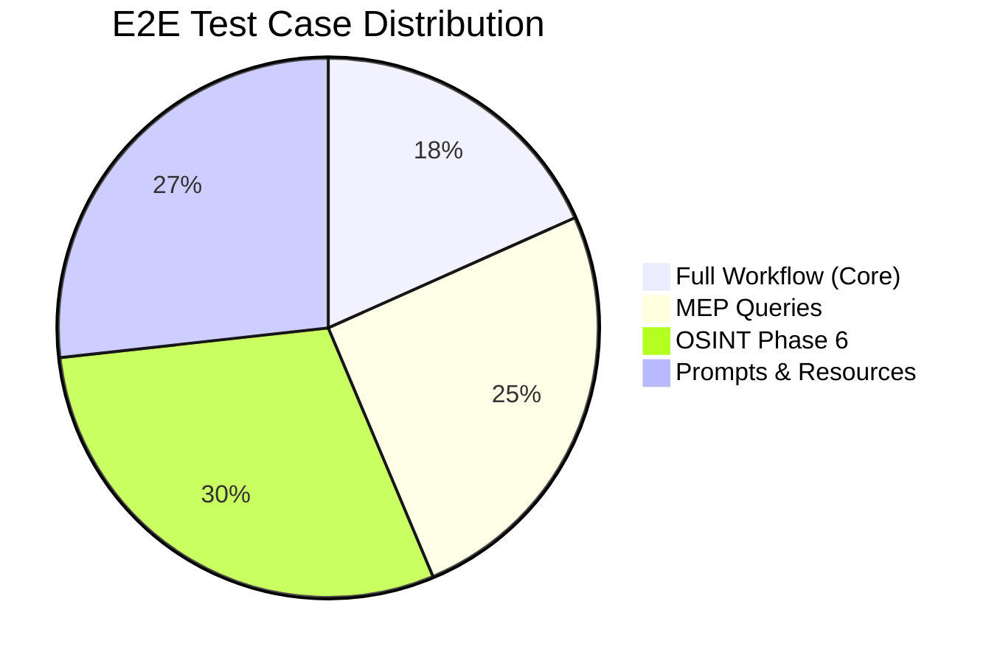
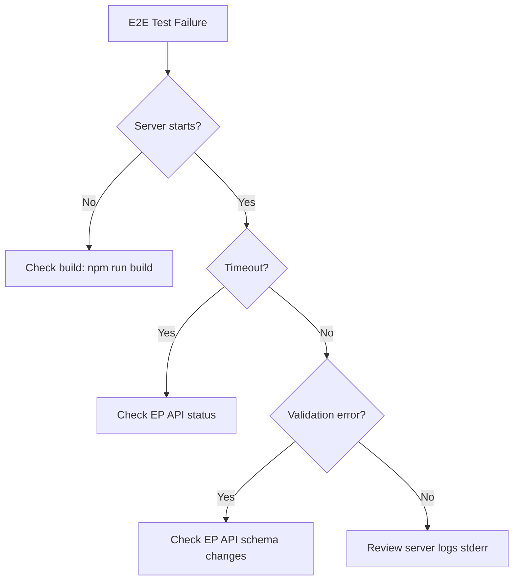

<p align="center">
  
</p>

<h1 align="center">🧪 European Parliament MCP Server — End-to-End Test Plan</h1>

<p align="center">
  <strong>🛡️ Comprehensive E2E Testing Strategy for MCP Protocol Compliance</strong><br>
  <em>🔍 Validating Full Tool · Resource · Prompt Lifecycle via stdio JSON-RPC</em>
</p>

<p align="center">
  <a href="#"></a>
  <a href="#"></a>
  <a href="#"></a>
  <a href="#"></a>
</p>

**📋 Document Owner:** CEO | **📄 Version:** 1.0 | **📅 Last Updated:** 2026-04-28 (UTC)  
**🔄 Review Cycle:** Quarterly | **⏰ Next Review:** 2026-07-28  
**🏷️ Classification:** Public (Open Source MCP Server)

---

## 📑 Table of Contents

- [Purpose \& Scope](#-purpose--scope)
- [Test Framework](#-test-framework)
- [Test Inventory](#-test-inventory)
- [E2E Coverage Matrix](#-e2e-coverage-matrix)
- [Pre-conditions](#-pre-conditions)
- [Execution](#-execution)
- [Quality Gates](#-quality-gates)
- [Reporting](#-reporting)
- [Failure Triage Guidance](#-failure-triage-guidance)
- [ISMS Secure Development Policy Alignment](#-isms-secure-development-policy-alignment)
- [Compliance Framework Mapping](#-compliance-framework-mapping)
- [Related Documents](#-related-documents)

---

## 🎯 Purpose & Scope

### Purpose

This End-to-End (E2E) Test Plan defines the testing strategy for validating the European Parliament MCP Server as a **complete, integrated system** — from MCP protocol handshake through tool execution to structured response delivery. E2E tests complement unit tests and integration tests by exercising the full server binary (`dist/index.js`) over its native stdio JSON-RPC transport.

### Scope Boundaries

| Scope | What is Tested | What is NOT Tested |
|-------|----------------|-------------------|
| **E2E (this plan)** | Full server process spawned via `node dist/index.js`; MCP protocol handshake; tool/resource/prompt invocation via JSON-RPC over stdio; response validation; error handling; audit logging | Individual function logic (unit tests); mocked API responses (integration tests); performance benchmarks |
| **Unit Tests** | Individual tool handlers, Zod schemas, utility functions, client methods | Full process lifecycle, stdio transport, MCP protocol compliance |
| **Integration Tests** | API client + cache + rate limiter interaction with mocked EP API | Full binary, stdio transport, prompt templates |

### Testing Pyramid Position

```
          ╱╲
         ╱  ╲         E2E Tests (71 cases)
        ╱ E2E╲        Full server binary over stdio
       ╱──────╲
      ╱        ╲       Integration Tests
     ╱Integration╲     API + cache + rate limiter
    ╱──────────────╲
   ╱                ╲   Unit Tests (1000+ cases)
  ╱   Unit Tests     ╲  Individual functions & schemas
 ╱────────────────────╲
```

---

## 🔧 Test Framework

### Technology Stack

| Component | Tool | Version | Purpose |
|-----------|------|---------|---------|
| **Test Runner** | Vitest | Latest | E2E test execution via `vitest.e2e.config.ts` |
| **MCP Client Harness** | `tests/e2e/mcpClient.ts` | Custom | Spawns server process, manages stdio JSON-RPC communication |
| **Transport** | `StdioClientTransport` | MCP SDK | Connects to server via stdin/stdout pipes |
| **Protocol** | `Client` (MCP SDK) | Latest | JSON-RPC 2.0 protocol implementation |
| **Server Binary** | `dist/index.js` | Built | Compiled TypeScript server (requires `npm run build` first) |

### Test Harness Architecture

The `MCPTestClient` class (in `tests/e2e/mcpClient.ts`) provides:

```typescript
class MCPTestClient {
  // Lifecycle
  async connect(serverPath?: string): Promise<void>  // Spawns node dist/index.js
  async disconnect(): Promise<void>                    // Graceful shutdown
  isConnected(): boolean

  // MCP Protocol Operations
  async listTools(): Promise<Array<{ name: string; description?: string }>>
  async listResourceTemplates(): Promise<Array<{ uriTemplate: string; name: string }>>
  async listPrompts(): Promise<Array<{ name: string; description?: string }>>
  async callTool(name: string, args?: Record<string, unknown>, timeoutMs?: number): Promise<ToolResult>
}
```

**Key design decisions:**
- Default timeout: **100 seconds** per tool call (EP API can be slow)
- Server spawned as a child process with stdio pipes
- JSON-RPC `id` correlation handled by MCP SDK
- Error responses detected via `isError` flag in tool results
- Policy reference: [Secure Development Policy §SC-002](https://github.com/Hack23/ISMS-PUBLIC/blob/main/Secure_Development_Policy.md)

---

## 📋 Test Inventory

### E2E Test Files

| File | Purpose | Test Cases | EP API Endpoints Exercised | MCP Surface Covered |
|------|---------|------------|---------------------------|---------------------|
| **`fullWorkflow.e2e.test.ts`** | Core lifecycle: server startup, tool/resource/prompt listing, basic tool calls, diagnostics | 13 | `/meps`, `/plenary-sessions`, `/documents`, `/committees`, `/votes` | `tools/list`, `resources/list`, `prompts/list`, core tool calls, `get_server_health` |
| **`mepQueries.e2e.test.ts`** | MEP-focused queries: member lookup, voting patterns, attendance, committee membership, influence scoring | 18 | `/meps`, `/mep-details`, `/votes`, `/committees`, `/plenary-sessions` | `get_meps`, `get_mep_details`, `get_current_meps`, `analyze_voting_patterns`, `track_mep_attendance`, `assess_mep_influence`, `analyze_legislative_effectiveness` |
| **`osintPhase6.e2e.test.ts`** | OSINT and advanced analytics: coalition dynamics, political landscape, network analysis, early warning, intelligence correlation | 21 | `/meps`, `/committees`, `/votes`, `/plenary-sessions`, `/procedures` | `analyze_coalition_dynamics`, `generate_political_landscape`, `network_analysis`, `sentiment_tracker`, `early_warning_system`, `correlate_intelligence`, `comparative_intelligence`, `detect_voting_anomalies` |
| **`promptsAndResources.e2e.test.ts`** | Prompt template rendering and resource template reading: all 7 prompts, all 9 resources, edge cases | 19 | `/meps`, `/committees`, `/plenary-sessions`, `/votes`, `/procedures`, `/documents` | All 7 prompt templates, all 9 resource templates, prompt argument validation |
| | **Total** | **71** | | |

### Test Case Distribution by Category



---

## 🗺️ E2E Coverage Matrix

### MCP Tool Category → E2E File Mapping

| Tool Category | Tools | `fullWorkflow` | `mepQueries` | `osintPhase6` | `promptsAndResources` |
|---------------|-------|:--------------:|:------------:|:--------------:|:---------------------:|
| **Core** | `get_meps`, `get_mep_details`, `get_plenary_sessions`, `get_voting_records`, `search_documents`, `get_committee_info`, `get_parliamentary_questions`, `get_server_health` | ✅ | ✅ | — | ✅ |
| **Advanced** | `analyze_voting_patterns`, `track_legislation`, `generate_report` | — | ✅ | — | — |
| **OSINT (Phase 1–3)** | `assess_mep_influence`, `analyze_coalition_dynamics`, `detect_voting_anomalies`, `compare_political_groups`, `analyze_legislative_effectiveness`, `monitor_legislative_pipeline`, `analyze_committee_activity`, `track_mep_attendance`, `analyze_country_delegation`, `generate_political_landscape` | — | ✅ | ✅ | — |
| **OSINT (Phase 6)** | `network_analysis`, `sentiment_tracker`, `early_warning_system`, `comparative_intelligence`, `correlate_intelligence` | — | — | ✅ | — |
| **Phase 4–5 (Endpoint)** | `get_current_meps`, `get_speeches`, `get_procedures`, `get_adopted_texts`, `get_events`, etc. | ✅ | ✅ | — | ✅ |
| **Feed** | `get_meps_feed`, `get_events_feed`, `get_procedures_feed`, etc. | ✅ | — | — | ✅ |
| **Diagnostics** | `get_server_health` | ✅ | — | — | — |
| **Prompts** | All 7 prompt templates | — | — | — | ✅ |
| **Resources** | All 9 resource templates | — | — | — | ✅ |

### MCP Protocol Operation Coverage

| MCP Operation | Covered By | Verified Assertions |
|---------------|-----------|---------------------|
| `initialize` (handshake) | All files (via `mcpClient.connect()`) | Server starts, capabilities negotiated |
| `tools/list` | `fullWorkflow` | 62 tools returned with names and descriptions |
| `tools/call` | All files | Tool execution, response structure, error handling |
| `resources/list` | `fullWorkflow`, `promptsAndResources` | 9 resource templates returned |
| `resources/read` | `promptsAndResources` | Resource content returned for valid URIs |
| `prompts/list` | `fullWorkflow`, `promptsAndResources` | 7 prompts returned |
| `prompts/get` | `promptsAndResources` | Prompt messages rendered with arguments |

---

## ⚙️ Pre-conditions

### Environment Requirements

| Requirement | Value | Notes |
|-------------|-------|-------|
| **Node.js** | 25+ (Current) | Required for ES module support and MCP SDK compatibility |
| **Build artifacts** | `dist/index.js` must exist | Run `npm run build` before E2E tests |
| **EP API reachability** | European Parliament Open Data Portal must be accessible | Tests make live HTTP requests to `https://data.europarl.europa.eu/` |
| **Network access** | Outbound HTTPS on port 443 | For EP API calls |
| **Timeout tolerance** | EP API responses may take 10–60 seconds | Default tool call timeout: 100 seconds |

### Environment Variables

| Variable | Required | Default | Purpose |
|----------|----------|---------|---------|
| `EP_REQUEST_TIMEOUT_MS` | No | `60000` | EP API request timeout (set in CI) |
| `NODE_ENV` | No | `test` | Runtime environment |
| `EP_API_URL` | No | `https://data.europarl.europa.eu/api/v2` | EP Open Data API base URL |

### CI Environment

In the `integration-tests.yml` workflow, E2E tests run as step 10 of the pipeline:

```yaml
- name: Run E2E tests
  run: npm run test:e2e
  env:
    EP_REQUEST_TIMEOUT_MS: 60000
    NODE_ENV: test
```

---

## ▶️ Execution

### Local Execution

```bash
# 1. Install dependencies
npm ci

# 2. Build the server
npm run build

# 3. Run E2E tests
npm run test:e2e
```

The `test:e2e` script is defined in `package.json` as:

```json
"test:e2e": "vitest run --config vitest.e2e.config.ts"
```

### Run All Test Suites

```bash
# Run all test types (unit + integration + e2e + performance)
npm run test:all
```

### Run with Reporting

```bash
# Generate E2E results with JUnit output for CI
npm run docs:e2e-reports
```

---

## ✅ Quality Gates

### Must-Pass Criteria (Release Blocking)

| Gate | Threshold | Enforcement |
|------|-----------|-------------|
| **All E2E tests pass** | 71/71 green | CI blocks merge on failure |
| **Server starts successfully** | `mcpClient.connect()` succeeds | First assertion in every test file |
| **Tool listing complete** | 62 tools returned | Verified in `fullWorkflow` |
| **Resource listing complete** | 9 resources returned | Verified in `fullWorkflow` / `promptsAndResources` |
| **Prompt listing complete** | 7 prompts returned | Verified in `promptsAndResources` |
| **No unhandled exceptions** | Server process exits cleanly | Harness monitors child process |
| **Timeout compliance** | All tool calls complete within 100s | `mcpClient.callTool()` timeout parameter |

### CI Integration

E2E tests are integrated into the `integration-tests.yml` GitHub Actions workflow:
- **Trigger:** Push to main, pull requests, daily schedule (2 AM UTC), manual dispatch
- **Runner:** `ubuntu-latest` with 45-minute timeout
- **Node.js:** Version 25.x
- **Dependencies:** Build step must complete before E2E execution
- **Failure action:** Workflow fails; PR merge blocked

---

## 📊 Reporting

### Output Formats

| Format | Purpose | Location |
|--------|---------|----------|
| **Console output** | Developer feedback during local runs | Terminal stdout |
| **Vitest reporter** | Structured test results | Console (default reporter) |
| **JUnit XML** | CI integration (GitHub Actions) | `coverage/junit.xml` (when using `test:ci`) |
| **HTML report** | Visual test results (via `docs:e2e-reports`) | `docs/e2e-results/` |
| **Coverage data** | Code coverage from E2E execution | Codecov (flags: `e2e`) |

### Codecov Flags

E2E test coverage is uploaded to Codecov with the `e2e` flag, enabling separate tracking from unit and integration coverage.

---

## 🔧 Failure Triage Guidance

### Common Failure Patterns

| Symptom | Likely Cause | Resolution |
|---------|-------------|------------|
| `ECONNREFUSED` during connect | Server binary not built | Run `npm run build` |
| `Timeout` on tool calls | EP API slow or unreachable | Check EP API status; increase `EP_REQUEST_TIMEOUT_MS` |
| Tool count mismatch (≠62) | Tool added/removed without test update | Update `fullWorkflow` assertion |
| Zod validation error in response | EP API schema change | Update Zod schema in corresponding tool handler |
| `SIGTERM` / process crash | Server bug or OOM | Check Node.js memory; review recent code changes |
| Rate limit errors | Previous test run didn't clean up | Wait 1 minute for token bucket refill |

### Triage Decision Tree



---

## 📜 ISMS Secure Development Policy Alignment

This E2E Test Plan fulfills the requirements specified in [Hack23 Secure Development Policy](https://github.com/Hack23/ISMS-PUBLIC/blob/main/Secure_Development_Policy.md):

| Policy Requirement | Implementation | Evidence |
|-------------------|----------------|----------|
| **§E2E Testing Requirements** | Separate E2E test plan (this document) alongside UnitTestPlan.md | `E2ETestPlan.md` |
| **§SC-002 Secure Testing** | MCP test harness uses `StdioClientTransport` — no elevated privileges | `tests/e2e/mcpClient.ts` |
| **§Continuous Testing** | E2E tests run on every PR and daily schedule | `.github/workflows/integration-tests.yml` |
| **§Test Coverage** | 71 E2E test cases covering all tool categories, resources, and prompts | Test inventory table above |
| **§Quality Gates** | E2E pass is required before release | CI enforcement |
| **§Threat Model Validation** | E2E tests validate controls for threats S-1 (stdio isolation), E-1 (input validation), D-1 (rate limiting) | Test assertions verify expected behaviour under security controls |

---

## 🏛️ Compliance Framework Mapping

| Framework | Control | E2E Test Plan Coverage |
|-----------|---------|----------------------|
| **ISO 27001:2022** | A.8.29 — Security testing in development and acceptance | Full E2E test suite validating security controls; CI-enforced quality gates |
| **ISO 27001:2022** | A.8.25 — Secure development lifecycle | E2E tests integrated into SDLC via CI pipeline |
| **NIST CSF 2.0** | DE.CM-9 — Testing for unauthorized changes | E2E tests detect unexpected tool count changes or response schema drift |
| **NIST CSF 2.0** | PR.IP-1 — Configuration management baseline | E2E tests validate server configuration (tools, resources, prompts) matches expected baseline |
| **CIS Controls v8.1** | 16.2 — Establish and maintain a process for assessing security | E2E test plan documents systematic security validation process |
| **CIS Controls v8.1** | 16.9 — Test penetration, incident response | E2E tests simulate realistic client interactions including edge cases |
| **EU CRA** | Annex I §2(c) — Regular testing and review | E2E tests executed on every PR and daily; quarterly test plan review |

---

## 📚 Related Documents

| Document | Description | Link |
|----------|-------------|------|
| 🧪 Unit Test Plan | Unit testing strategy and coverage targets | [docs/UnitTestPlan.md](docs/UnitTestPlan.md) |
| 🛡️ Security Architecture | Security controls validated by E2E tests | [SECURITY_ARCHITECTURE.md](SECURITY_ARCHITECTURE.md) |
| 🎯 Threat Model | Threats mitigated by E2E-validated controls | [THREAT_MODEL.md](THREAT_MODEL.md) |
| 🏛️ Architecture | System architecture and component inventory | [ARCHITECTURE.md](ARCHITECTURE.md) |
| 📋 CRA Assessment | EU Cyber Resilience Act conformity | [CRA-ASSESSMENT.md](CRA-ASSESSMENT.md) |
| 🔒 Security Policy | Security reporting and ISMS governance | [SECURITY.md](SECURITY.md) |
| 🛠️ Secure Development Policy | ISMS testing requirements | [View Policy](https://github.com/Hack23/ISMS-PUBLIC/blob/main/Secure_Development_Policy.md) |
| 🔄 Integration Tests Workflow | CI workflow executing E2E tests | [.github/workflows/integration-tests.yml](.github/workflows/integration-tests.yml) |

---

<p align="center">
  <em>This E2E test plan is maintained as part of the <a href="https://github.com/Hack23/ISMS-PUBLIC">Hack23 AB ISMS</a> framework.</em><br>
  <em>Licensed under <a href="LICENSE.md">Apache-2.0</a></em>
</p>
