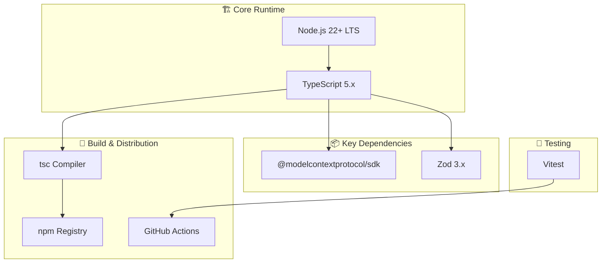

<p align="center">
  
</p>

<h1 align="center">📦 European Parliament MCP Server — End-of-Life Strategy</h1>

<p align="center">
  <strong>🛡️ Proactive Technology Lifecycle Management for MCP Server</strong><br>
  <em>📦 Current Stack Maintenance • 🔄 Technology Transitions • ⚡ Future-Ready Architecture</em>
</p>

<p align="center">
  <a href="#"></a>
  <a href="#"></a>
  <a href="#"></a>
  <a href="#"></a>
</p>

**📋 Document Owner:** CEO | **📄 Version:** 1.0 | **📅 Last Updated:** 2026-02-20 (UTC)  
**🔄 Review Cycle:** Annual | **⏰ Next Review:** 2027-02-20  
**🏷️ Classification:** Public (Open Source MCP Server)

---

## 📑 Table of Contents

- [EOL Strategy Overview](#-eol-strategy-overview)
- [Current Technology Stack](#-current-technology-stack-analysis)
- [Technology Lifecycle Matrix](#-technology-lifecycle-matrix)
- [Node.js Version Strategy](#-nodejs-version-strategy)
- [Dependency EOL Monitoring](#️-dependency-eol-monitoring)
- [npm Package Lifecycle](#-npm-package-lifecycle)
- [EOL Trigger Criteria](#-eol-trigger-criteria)
- [Migration Procedures](#-migration-procedures)
- [Archive & Preservation](#-archive--preservation)
- [Policy Alignment](#-policy-alignment)
- [Related Documents](#-related-documents)

---

## 🎯 EOL Strategy Overview

### **📋 Strategic Objective**

The European Parliament MCP Server will maintain its current technology stack, utilizing modern TypeScript/Node.js with the MCP SDK, following Hack23 AB's **"Living on the Edge"** philosophy — maintaining latest stable releases with comprehensive automated testing and security validation.

This strategy aligns with [Hack23 AB's Vulnerability Management Policy](https://github.com/Hack23/ISMS-PUBLIC/blob/main/Vulnerability_Management.md).

### **🏷️ Business Impact Classification**

| Dimension | Level | EOL Impact | Rationale |
|----------|-------|------------|-----------|
| **🔐 Confidentiality** | [](https://github.com/Hack23/ISMS-PUBLIC/blob/main/CLASSIFICATION.md#confidentiality-levels) | Low | Open source, public data |
| **🔒 Integrity** | [](https://github.com/Hack23/ISMS-PUBLIC/blob/main/CLASSIFICATION.md#integrity-levels) | Medium | Data accuracy matters |
| **⚡ Availability** | [](https://github.com/Hack23/ISMS-PUBLIC/blob/main/CLASSIFICATION.md#availability-levels) | Medium | Tolerates maintenance windows |

---

## 📦 Current Technology Stack Analysis



---

## 🔄 Technology Lifecycle Matrix

| Component | Current Version | EOL Date | Risk Level | Migration Path |
|-----------|----------------|----------|------------|---------------|
| **Node.js** | 22.x LTS | April 2027 | 🟢 Low | Upgrade to Node.js 24 LTS |
| **TypeScript** | 5.x | Active | 🟢 Low | Follow semver updates |
| **MCP SDK** | Latest | Active | 🟡 Medium | Track protocol evolution |
| **Zod** | 3.x | Active | 🟢 Low | Follow semver updates |
| **Vitest** | Latest | Active | 🟢 Low | Follow semver updates |
| **npm** | Registry | Indefinite | 🟢 Low | N/A |
| **GitHub Actions** | Latest | Indefinite | 🟢 Low | Pin action versions |

### **📅 Key Dates**

| Event | Date | Action Required |
|-------|------|----------------|
| Node.js 22 LTS active | Oct 2024 - Oct 2025 | Current stable |
| Node.js 22 maintenance | Oct 2025 - April 2027 | Security updates only |
| Node.js 24 LTS release | Oct 2025 | Begin testing compatibility |
| Node.js 22 EOL | April 2027 | Must migrate to Node.js 24+ |

---

## 📋 Node.js Version Strategy

Following the **"Living on the Edge"** philosophy from [Vulnerability Management Policy](https://github.com/Hack23/ISMS-PUBLIC/blob/main/Vulnerability_Management.md):

1. **Track LTS:** Always target the current Node.js LTS version
2. **Early Testing:** Begin testing with next LTS version 3 months before release
3. **Rapid Adoption:** Migrate to new LTS within 1 month of release
4. **CI Matrix:** Test against current LTS and next LTS in CI/CD
5. **Automated Alerts:** Dependabot monitors for Node.js security updates

### **🔄 Upgrade Process**

```
1. Update engines field in package.json
2. Update CI/CD workflow matrix
3. Run full test suite (unit + E2E)
4. Update documentation
5. Publish new npm version
```

---

## 🛡️ Dependency EOL Monitoring

### **🤖 Automated Monitoring**

| Tool | Purpose | Frequency |
|------|---------|-----------|
| Dependabot | Dependency version updates | Daily |
| npm audit | Vulnerability scanning | Per CI/CD run |
| OpenSSF Scorecard | Project health monitoring | Weekly |
| GitHub Security Advisories | CVE notifications | Real-time |

### **📋 Manual Reviews**

| Activity | Frequency | Owner |
|----------|-----------|-------|
| Dependency audit | Quarterly | Development team |
| Node.js roadmap review | Semi-annual | Tech lead |
| MCP protocol evolution | Quarterly | Development team |
| EP API changes | Monthly | Development team |

---

## 📦 npm Package Lifecycle

### **📋 Version Strategy**

| Phase | Version Range | Support Level |
|-------|-------------|---------------|
| Active Development | Current major | Full support |
| Maintenance | Previous major | Security fixes only |
| Deprecated | Older versions | No support, deprecation notice |
| Archived | N/A | npm deprecation, GitHub archive |

### **⚠️ Deprecation Process**

1. **Notice Period:** 6 months before EOL
2. **npm Deprecation:** `npm deprecate` with migration instructions
3. **README Update:** Clear deprecation banner
4. **GitHub Archive:** Repository archived with read-only access
5. **Documentation:** Preserved for reference

---

## 🚨 EOL Trigger Criteria

The project reaches End-of-Life when any of the following occur:

| Trigger | Description | Impact |
|---------|-------------|--------|
| 🔌 MCP Protocol Obsolescence | MCP protocol replaced by successor | Architecture rewrite required |
| 🏛️ EP API Discontinued | European Parliament data API shut down | Core functionality lost |
| 📦 Node.js Platform EOL | No supported Node.js LTS available | Runtime unavailable |
| 🔒 Unresolvable Security Issue | Critical vulnerability with no fix | Security risk unacceptable |
| 👥 Maintainer Unavailability | No active maintainers for > 12 months | No security updates |

---

## 🔧 Migration Procedures

### **Node.js Version Upgrade**

```
Step 1: Update package.json engines field
Step 2: Update GitHub Actions workflow (Node.js version matrix)
Step 3: Run: npm install (rebuild native modules)
Step 4: Run: npm test (full test suite)
Step 5: Run: npm run test:e2e (E2E integration tests)
Step 6: Run: npm run lint (code quality check)
Step 7: Update documentation (README, DEVELOPER_GUIDE)
Step 8: Publish new npm version
```

### **TypeScript Version Upgrade**

```
Step 1: Update typescript dependency
Step 2: Review tsconfig.json for new options
Step 3: Fix any new type errors
Step 4: Run full test suite
Step 5: Publish patch release
```

### **MCP SDK Upgrade**

```
Step 1: Review MCP SDK changelog for breaking changes
Step 2: Update @modelcontextprotocol/sdk dependency
Step 3: Update tool/resource registrations if needed
Step 4: Run E2E tests with MCP client
Step 5: Update API documentation
Step 6: Publish new version
```

---

## 📊 Archive & Preservation

### **📦 Archive Checklist**

| Item | Action | Status |
|------|--------|--------|
| npm deprecation notice | `npm deprecate` with message | On EOL |
| GitHub repository archive | Set repository to archived | On EOL |
| README deprecation banner | Add clear deprecation notice | On EOL |
| Documentation preservation | Docs remain accessible | Permanent |
| Release artifacts | GitHub releases preserved | Permanent |
| SBOM records | Final SBOM archived | On EOL |

### **🔒 GDPR Compliance**

- No personal data stored in the application
- EP data is publicly available parliamentary records
- No user accounts or tracking data to delete
- Repository archives comply with data retention policies

---

## 🔗 Policy Alignment

| ISMS Policy | Relevance | Link |
|-------------|-----------|------|
| 🔍 Vulnerability Management | "Living on the Edge" philosophy | [Vulnerability_Management.md](https://github.com/Hack23/ISMS-PUBLIC/blob/main/Vulnerability_Management.md) |
| 🔒 Secure Development | Technology lifecycle requirements | [Secure_Development_Policy.md](https://github.com/Hack23/ISMS-PUBLIC/blob/main/Secure_Development_Policy.md) |
| 🔄 Backup & Recovery | Archive and preservation | [Backup_Recovery_Policy.md](https://github.com/Hack23/ISMS-PUBLIC/blob/main/Backup_Recovery_Policy.md) |
| 🏷️ Classification | Impact-driven lifecycle decisions | [CLASSIFICATION.md](https://github.com/Hack23/ISMS-PUBLIC/blob/main/CLASSIFICATION.md) |
| 🌐 Open Source Policy | OSS governance and lifecycle | [Open_Source_Policy.md](https://github.com/Hack23/ISMS-PUBLIC/blob/main/Open_Source_Policy.md) |

---

## 📚 Related Documents

| Document | Description | Link |
|----------|-------------|------|
| 🛡️ Security Architecture | Current security controls | [SECURITY_ARCHITECTURE.md](SECURITY_ARCHITECTURE.md) |
| 🎯 Threat Model | Risk assessment | [THREAT_MODEL.md](THREAT_MODEL.md) |
| 🔄 Business Continuity Plan | Recovery procedures | [BCPPlan.md](BCPPlan.md) |
| 💰 Financial Security Plan | Cost planning | [FinancialSecurityPlan.md](FinancialSecurityPlan.md) |
| 🏛️ Architecture | System design | [ARCHITECTURE.md](ARCHITECTURE.md) |

---

<p align="center">
  <em>This EOL strategy is maintained as part of the <a href="https://github.com/Hack23/ISMS-PUBLIC">Hack23 AB ISMS</a> framework.</em><br>
  <em>Licensed under <a href="LICENSE.md">Apache-2.0</a></em>
</p>
