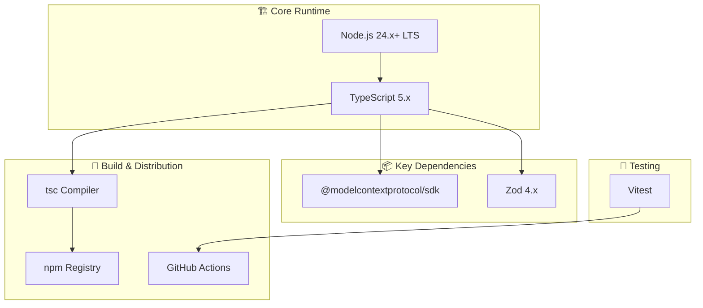
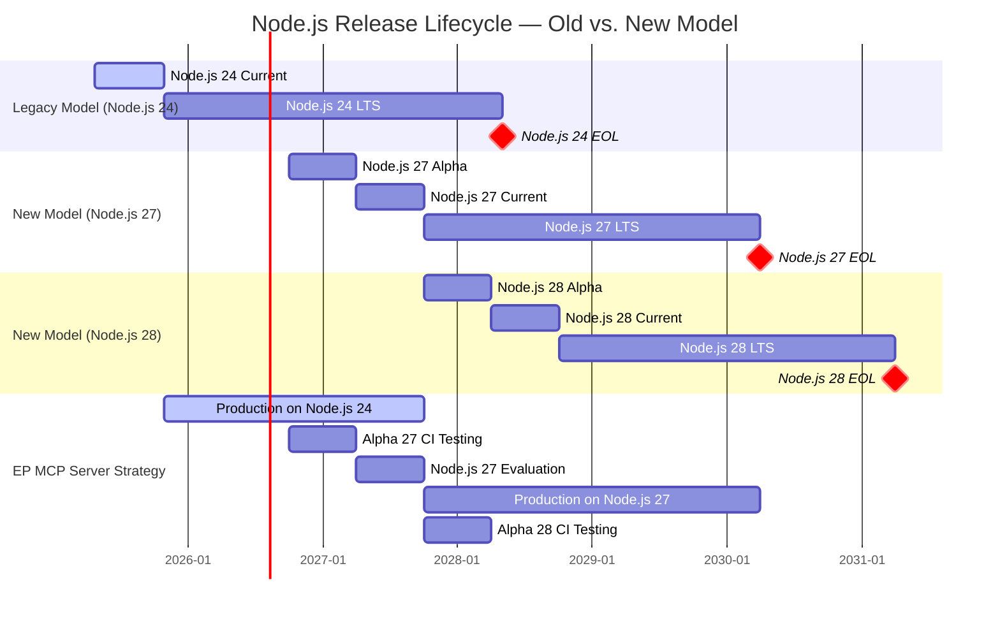

<p align="center">
  
</p>

<h1 align="center">📦 European Parliament MCP Server — End-of-Life Strategy</h1>

<p align="center">
  <strong>🛡️ Proactive Technology Lifecycle Management for MCP Server</strong><br>
  <em>📦 Current Stack Maintenance • 🔄 Node.js New Release Model • ⚡ Future-Ready Architecture</em>
</p>

<p align="center">
  <a href="#"></a>
  <a href="#"></a>
  <a href="#"></a>
  <a href="#"></a>
</p>

**📋 Document Owner:** CEO | **📄 Version:** 2.0 | **📅 Last Updated:** 2026-03-12 (UTC)  
**🔄 Review Cycle:** Annual | **⏰ Next Review:** 2027-03-12  
**🏷️ Classification:** Public (Open Source MCP Server)

---

## 📑 Table of Contents

- [EOL Strategy Overview](#-eol-strategy-overview)
- [Current Technology Stack](#-current-technology-stack-analysis)
- [Technology Lifecycle Matrix](#-technology-lifecycle-matrix)
- [Node.js Release Schedule Evolution](#-nodejs-release-schedule-evolution)
- [Node.js Version Strategy](#-nodejs-version-strategy)
- [Node.js Transition Roadmap](#-nodejs-transition-roadmap)
- [Dependency EOL Monitoring](#-dependency-eol-monitoring)
- [npm Package Lifecycle](#-npm-package-lifecycle)
- [EOL Trigger Criteria](#-eol-trigger-criteria)
- [Migration Procedures](#-migration-procedures)
- [Archive & Preservation](#-archive--preservation)
- [Policy Alignment](#-policy-alignment)
- [Related Documents](#-related-documents)
- [Revision History](#-revision-history)

---

## 🎯 EOL Strategy Overview

### **📋 Strategic Objective**

The European Parliament MCP Server will maintain its current technology stack, utilizing modern TypeScript/Node.js with the MCP SDK, following Hack23 AB's **"Living on the Edge"** philosophy — maintaining latest stable releases with comprehensive automated testing and security validation.

This strategy aligns with [Hack23 AB's Vulnerability Management Policy](https://github.com/Hack23/ISMS-PUBLIC/blob/main/Vulnerability_Management.md).

### **🏷️ Business Impact Classification**

| Dimension | Level | EOL Impact | Rationale |
|----------|-------|------------|-----------|
| **🔐 Confidentiality** | [](https://github.com/Hack23/ISMS-PUBLIC/blob/main/CLASSIFICATION.md#confidentiality-levels) | Low | Open source, public data |
| **🔒 Integrity** | [](https://github.com/Hack23/ISMS-PUBLIC/blob/main/CLASSIFICATION.md#integrity-levels) | Medium | Data accuracy matters |
| **⚡ Availability** | [](https://github.com/Hack23/ISMS-PUBLIC/blob/main/CLASSIFICATION.md#availability-levels) | Medium | Tolerates maintenance windows |

---

## 📦 Current Technology Stack Analysis


```mermaid
graph TB
    subgraph "🏗️ Core Runtime"
        NODE[Node.js 24.x+ LTS]
        TS[TypeScript 5.x]
    end
    subgraph "📦 Key Dependencies"
        MCP["@modelcontextprotocol/sdk"]
        ZOD[Zod 4.x]
    end
    subgraph "🧪 Testing"
        VIT[Vitest]
    end
    subgraph "🔧 Build & Distribution"
        NPM[npm Registry]
        GHA[GitHub Actions]
        TSC[tsc Compiler]
    end

    NODE --> TS --> MCP & ZOD
    TS --> TSC --> NPM
    VIT --> GHA
```

---

## 🔄 Technology Lifecycle Matrix

| Component | Current Version | EOL Date | Risk Level | Migration Path |
|-----------|----------------|----------|------------|---------------|
| **Node.js** | >=24.0.0 (24.x LTS) | April 2028 | 🟢 Low | Stay on Node.js 24 LTS; migrate to Node.js 27 LTS (new annual release model) |
| **TypeScript** | 5.x | Active | 🟢 Low | Follow semver updates |
| **MCP SDK** | Latest | Active | 🟡 Medium | Track protocol evolution |
| **Zod** | ^4.3.6 (4.x) | Active | 🟢 Low | Follow semver updates |
| **Vitest** | Latest | Active | 🟢 Low | Follow semver updates |
| **npm** | Registry | Indefinite | 🟢 Low | N/A |
| **GitHub Actions** | Latest | Indefinite | 🟢 Low | Pin action versions |

### **📅 Key Dates**

| Event | Date | Action Required |
|-------|------|----------------|
| Node.js 24 LTS active | Oct 2025 – Oct 2026 | Current stable runtime |
| Node.js 24 maintenance | Oct 2026 – April 2028 | Security updates only |
| Node.js 27 Alpha opens | Oct 2026 | Begin CI testing on alpha channel |
| Node.js 27 Current release | April 2027 | Stabilization; evaluate for production |
| Node.js 27 LTS promotion | Oct 2027 | Begin production migration |
| Node.js 24 EOL | April 2028 | Must have migrated to Node.js 27+ |
| Node.js 28 Alpha opens | Oct 2027 | Monitor for early testing |
| Node.js 28 Current release | April 2028 | Next annual release |
| Node.js 27 EOL | April 2030 | 36 months total support |

> **Note:** Starting with Node.js 27, the release schedule changes to **one major release per year** with **every release becoming LTS**. See [Node.js Release Schedule Evolution](#-nodejs-release-schedule-evolution) for details.

---

## 🔄 Node.js Release Schedule Evolution

### **📢 New Release Model (Starting Node.js 27.x)**

In March 2026, the Node.js project [announced a fundamental change](https://nodejs.org/en/blog/announcements/evolving-the-nodejs-release-schedule) to its release schedule, effective from October 2026. This section documents the impact on the European Parliament MCP Server's lifecycle management.

#### **🔀 Old Model vs. New Model**

| Aspect | Old Model (≤ Node.js 26) | New Model (≥ Node.js 27) |
|--------|--------------------------|--------------------------|
| **Major releases per year** | 2 (April + October) | 1 (April) |
| **LTS eligibility** | Even-numbered only | **Every release** |
| **Odd-numbered releases** | Current only (no LTS) | N/A — distinction removed |
| **LTS promotion** | October (even releases) | October (all releases) |
| **Total support lifetime** | ~30 months (LTS only) | **36 months** (Current + LTS) |
| **Alpha channel** | None | **New:** Oct–Mar, semver-major allowed |
| **Version numbering** | Sequential (24, 25, 26…) | Calendar-year aligned (27 in 2027, 28 in 2028) |

#### **📊 New Release Phases**

| Phase | Duration | Description |
|-------|----------|-------------|
| **Alpha** | 6 months (Oct → Mar) | Early testing, semver-major changes allowed |
| **Current** | 6 months (Apr → Oct) | Stabilization, no new breaking changes |
| **LTS** | 30 months (Oct → EOL) | Long-term support with security fixes |
| **EOL** | — | No further support |
| **Total support** | **36 months** | From first Current release to End of Life |

#### **📈 Impact on This Project**

| Impact Area | Assessment | Action |
|-------------|-----------|--------|
| **Upgrade frequency** | 🟢 Positive | One major upgrade/year instead of two evaluation cycles |
| **LTS availability** | 🟢 Positive | Every release becomes LTS — no more skipping odd versions |
| **Alpha testing** | 🟡 Requires action | Must integrate alpha channel into CI for early bug detection |
| **Planning predictability** | 🟢 Positive | Calendar-year versioning simplifies upgrade scheduling |
| **Support window** | 🟢 Positive | 36-month total support provides longer runway |
| **Library compatibility** | 🟡 Monitor | Library authors encouraged to test on alpha early |

#### **🗓️ Node.js Release Timeline Visualization**


```mermaid
gantt
    title Node.js Release Lifecycle — Old vs. New Model
    dateFormat YYYY-MM-DD
    axisFormat %Y-%m

    section Legacy Model (Node.js 24)
    Node.js 24 Current         :active, n24c, 2025-04-22, 2025-10-28
    Node.js 24 LTS             :n24lts, 2025-10-28, 2028-04-30
    Node.js 24 EOL             :crit, milestone, n24eol, 2028-04-30, 0d

    section New Model (Node.js 27)
    Node.js 27 Alpha           :n27a, 2026-10-01, 2027-03-31
    Node.js 27 Current         :n27c, 2027-04-01, 2027-10-01
    Node.js 27 LTS             :n27lts, 2027-10-01, 2030-04-01
    Node.js 27 EOL             :crit, milestone, n27eol, 2030-04-01, 0d

    section New Model (Node.js 28)
    Node.js 28 Alpha           :n28a, 2027-10-01, 2028-03-31
    Node.js 28 Current         :n28c, 2028-04-01, 2028-10-01
    Node.js 28 LTS             :n28lts, 2028-10-01, 2031-04-01
    Node.js 28 EOL             :crit, milestone, n28eol, 2031-04-01, 0d

    section EP MCP Server Strategy
    Production on Node.js 24   :active, ep24, 2025-10-28, 2027-10-01
    Alpha 27 CI Testing        :ep27alpha, 2026-10-01, 2027-04-01
    Node.js 27 Evaluation      :ep27eval, 2027-04-01, 2027-10-01
    Production on Node.js 27   :ep27prod, 2027-10-01, 2030-04-01
    Alpha 28 CI Testing        :ep28alpha, 2027-10-01, 2028-04-01
```

> **Source:** [Evolving the Node.js Release Schedule](https://nodejs.org/en/blog/announcements/evolving-the-nodejs-release-schedule) — see also [nodejs/Release#1113](https://github.com/nodejs/Release/issues/1113) for background discussion.

---

## 📋 Node.js Version Strategy

Following the **"Living on the Edge"** philosophy from [Vulnerability Management Policy](https://github.com/Hack23/ISMS-PUBLIC/blob/main/Vulnerability_Management.md):

1. **Track LTS:** Always target the current Node.js LTS version
2. **Alpha CI Integration:** Add Node.js alpha releases to CI matrix as soon as the alpha channel opens (per Node.js project guidance for library authors)
3. **Early Testing:** Begin production evaluation during the Current phase (April–October)
4. **Rapid Adoption:** Migrate to new LTS within 1 month of LTS promotion (October)
5. **CI Matrix:** Test against current LTS, next Current/alpha, and previous LTS
6. **Automated Alerts:** Dependabot monitors for Node.js security updates

### **🔄 Upgrade Process (Updated for New Release Model)**

```
Phase 1 — Alpha Testing (Oct–Mar, 6 months before release)
  1. Add Node.js alpha to CI matrix (non-blocking)
  2. Report upstream bugs found during testing
  3. Track dependency compatibility with alpha

Phase 2 — Current Evaluation (Apr–Oct, pre-LTS)
  4. Promote alpha CI jobs to required status
  5. Run full test suite (unit + E2E) on Current release
  6. Benchmark performance against current LTS
  7. Review breaking changes and update code as needed

Phase 3 — LTS Migration (Oct, on LTS promotion)
  8. Update engines field in package.json
  9. Update GitHub Actions workflow matrix
  10. Run: npm install (rebuild native modules if any)
  11. Run: npm test && npm run lint (full validation)
  12. Update documentation (README, DEVELOPER_GUIDE, this EOL Strategy)
  13. Publish new npm version
```

---

## 🗺️ Node.js Transition Roadmap

### **📋 Node.js 24 → 27 Transition Plan**

| Phase | Timeline | Actions | Risk |
|-------|----------|---------|------|
| **Current Production** | Now – Oct 2027 | Node.js 24 LTS in production | 🟢 Low |
| **Alpha 27 CI** | Oct 2026 – Mar 2027 | Add `27.0.0-alpha.*` to CI matrix (non-blocking) | 🟢 Low |
| **Current 27 Eval** | Apr 2027 – Oct 2027 | Test on Node.js 27.x Current; fix compatibility issues | 🟡 Medium |
| **LTS 27 Migration** | Oct 2027 | Upgrade production to Node.js 27 LTS | 🟡 Medium |
| **Node.js 24 Sunset** | Apr 2028 | Node.js 24 reaches EOL; must be fully on 27+ | 🟢 Low (if planned) |

### **🧪 Node.js 27 Alpha Integration Strategy**

Per the Node.js project's guidance, **library authors should integrate Alpha releases into CI as early as possible** to report bugs before they affect users. As an npm-published MCP server, this project will:

1. **Add alpha CI job** (non-blocking, `continue-on-error: true`) when Node.js 27 alpha opens in October 2026
2. **Report regressions** upstream to Node.js via GitHub issues
3. **Track breaking V8 changes** that may affect TypeScript compilation or runtime behavior
4. **Monitor MCP SDK compatibility** with the new Node.js version
5. **Validate Zod runtime behavior** under new V8 engine optimizations

---

## 🛡️ Dependency EOL Monitoring

### **🤖 Automated Monitoring**

| Tool | Purpose | Frequency |
|------|---------|-----------|
| Dependabot | Dependency version updates | Daily |
| npm audit | Vulnerability scanning | Per CI/CD run |
| OpenSSF Scorecard | Project health monitoring | Weekly |
| GitHub Security Advisories | CVE notifications | Real-time |

### **📋 Manual Reviews**

| Activity | Frequency | Owner |
|----------|-----------|-------|
| Dependency audit | Quarterly | Development team |
| Node.js roadmap review | Semi-annual | Tech lead |
| MCP protocol evolution | Quarterly | Development team |
| EP API changes | Monthly | Development team |

---

## 📦 npm Package Lifecycle

### **📋 Version Strategy**

| Phase | Version Range | Support Level |
|-------|-------------|---------------|
| Active Development | Current major | Full support |
| Maintenance | Previous major | Security fixes only |
| Deprecated | Older versions | No support, deprecation notice |
| Archived | N/A | npm deprecation, GitHub archive |

### **⚠️ Deprecation Process**

1. **Notice Period:** 6 months before EOL
2. **npm Deprecation:** `npm deprecate` with migration instructions
3. **README Update:** Clear deprecation banner
4. **GitHub Archive:** Repository archived with read-only access
5. **Documentation:** Preserved for reference

---

## 🚨 EOL Trigger Criteria

The project reaches End-of-Life when any of the following occur:

| Trigger | Description | Impact |
|---------|-------------|--------|
| 🔌 MCP Protocol Obsolescence | MCP protocol replaced by successor | Architecture rewrite required |
| 🏛️ EP API Discontinued | European Parliament data API shut down | Core functionality lost |
| 📦 Node.js Platform EOL | No supported Node.js LTS available | Runtime unavailable |
| 🔒 Unresolvable Security Issue | Critical vulnerability with no fix | Security risk unacceptable |
| 👥 Maintainer Unavailability | No active maintainers for > 12 months | No security updates |

---

## 🔧 Migration Procedures

### **Node.js Version Upgrade (New Annual Release Model)**

Starting with Node.js 27+, upgrades follow the new **annual release cadence** with a 6-month alpha → 6-month Current → 30-month LTS lifecycle:

```
Pre-Migration (Alpha Phase, Oct–Mar):
  Step 1: Add alpha version to CI matrix as non-blocking job
  Step 2: Monitor test failures and file upstream issues
  Step 3: Track dependency compatibility reports

Migration (On LTS Promotion, October):
  Step 4: Update package.json engines field to new LTS version
  Step 5: Update GitHub Actions workflow (Node.js version matrix)
  Step 6: Run: npm install (rebuild native modules if any)
  Step 7: Run: npm test (full test suite — 2500+ unit tests)
  Step 8: Run: npm run lint (code quality check)
  Step 9: Run: npm run build (TypeScript compilation)
  Step 10: Update documentation (README, DEVELOPER_GUIDE, End-of-Life-Strategy.md)
  Step 11: Publish new npm version

Post-Migration Validation:
  Step 12: Verify npm package installs correctly on new Node.js version
  Step 13: Test MCP client connectivity (stdio transport)
  Step 14: Monitor production for 1 week before removing old Node.js from CI
```

### **TypeScript Version Upgrade**

```
Step 1: Update typescript dependency
Step 2: Review tsconfig.json for new options
Step 3: Fix any new type errors
Step 4: Run full test suite
Step 5: Publish patch release
```

### **MCP SDK Upgrade**

```
Step 1: Review MCP SDK changelog for breaking changes
Step 2: Update @modelcontextprotocol/sdk dependency
Step 3: Update tool/resource registrations if needed
Step 4: Run E2E tests with MCP client
Step 5: Update API documentation
Step 6: Publish new version
```

---

## 📊 Archive & Preservation

### **📦 Archive Checklist**

| Item | Action | Status |
|------|--------|--------|
| npm deprecation notice | `npm deprecate` with message | On EOL |
| GitHub repository archive | Set repository to archived | On EOL |
| README deprecation banner | Add clear deprecation notice | On EOL |
| Documentation preservation | Docs remain accessible | Permanent |
| Release artifacts | GitHub releases preserved | Permanent |
| SBOM records | Final SBOM archived | On EOL |

### **🔒 GDPR Compliance**

- No personal data stored in the application
- EP data is publicly available parliamentary records
- No user accounts or tracking data to delete
- Repository archives comply with data retention policies

---

## 🔗 Policy Alignment

| ISMS Policy | Relevance | Link |
|-------------|-----------|------|
| 🔍 Vulnerability Management | "Living on the Edge" philosophy | [Vulnerability_Management.md](https://github.com/Hack23/ISMS-PUBLIC/blob/main/Vulnerability_Management.md) |
| 🔒 Secure Development | Technology lifecycle requirements | [Secure_Development_Policy.md](https://github.com/Hack23/ISMS-PUBLIC/blob/main/Secure_Development_Policy.md) |
| 🔄 Backup & Recovery | Archive and preservation | [Backup_Recovery_Policy.md](https://github.com/Hack23/ISMS-PUBLIC/blob/main/Backup_Recovery_Policy.md) |
| 🏷️ Classification | Impact-driven lifecycle decisions | [CLASSIFICATION.md](https://github.com/Hack23/ISMS-PUBLIC/blob/main/CLASSIFICATION.md) |
| 🌐 Open Source Policy | OSS governance and lifecycle | [Open_Source_Policy.md](https://github.com/Hack23/ISMS-PUBLIC/blob/main/Open_Source_Policy.md) |

---

## 📚 Related Documents

| Document | Description | Link |
|----------|-------------|------|
| 🛡️ Security Architecture | Current security controls | [SECURITY_ARCHITECTURE.md](SECURITY_ARCHITECTURE.md) |
| 🎯 Threat Model | Risk assessment | [THREAT_MODEL.md](THREAT_MODEL.md) |
| 🔄 Business Continuity Plan | Recovery procedures | [BCPPlan.md](BCPPlan.md) |
| 💰 Financial Security Plan | Cost planning | [FinancialSecurityPlan.md](FinancialSecurityPlan.md) |
| ⚡ Performance Testing | Benchmarks & analysis | [performance-testing.md](performance-testing.md) |
| 🏛️ Architecture | System design | [ARCHITECTURE.md](ARCHITECTURE.md) |

---

## 📝 Revision History

| Version | Date | Author | Changes |
|---------|------|--------|---------|
| 1.0 | 2026-02-20 | CEO | Initial EOL strategy — technology stack analysis, lifecycle matrix, dependency monitoring, migration procedures |
| 2.0 | 2026-03-12 | CEO | Major update: Node.js new release schedule (one major/year, every release LTS, alpha channel); added transition roadmap, Gantt timeline, release model comparison; updated version strategy for alpha CI integration; aligned with [nodejs/Release#1113](https://github.com/nodejs/Release/issues/1113) |

---

<p align="center">
  <em>This EOL strategy is maintained as part of the <a href="https://github.com/Hack23/ISMS-PUBLIC">Hack23 AB ISMS</a> framework.</em><br>
  <em>Licensed under <a href="LICENSE.md">Apache-2.0</a></em>
</p>
