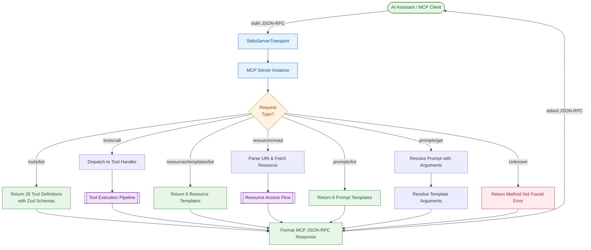
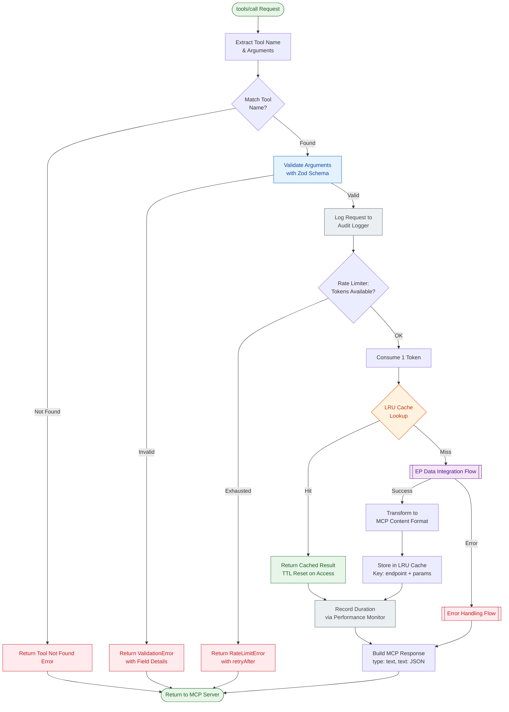
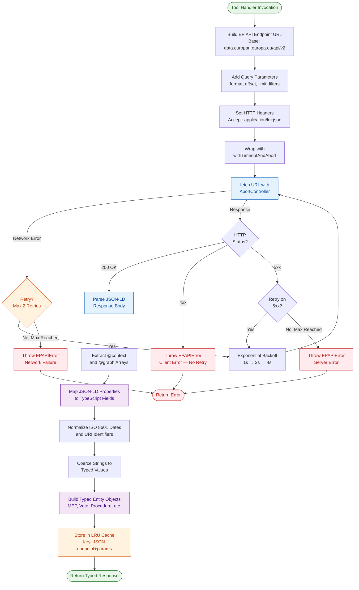
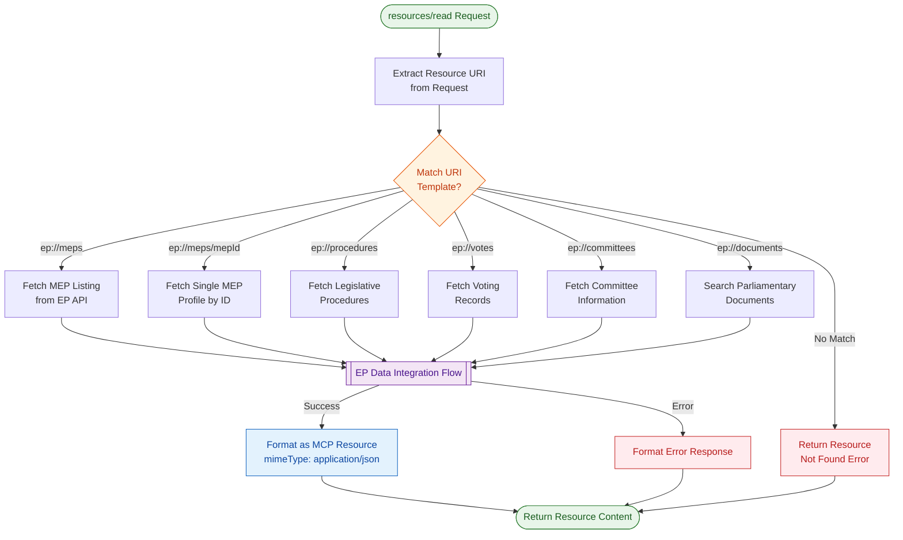
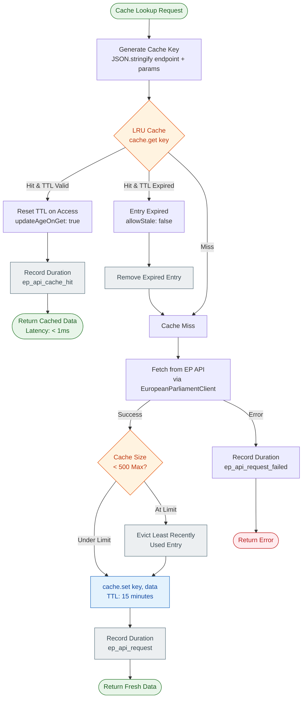
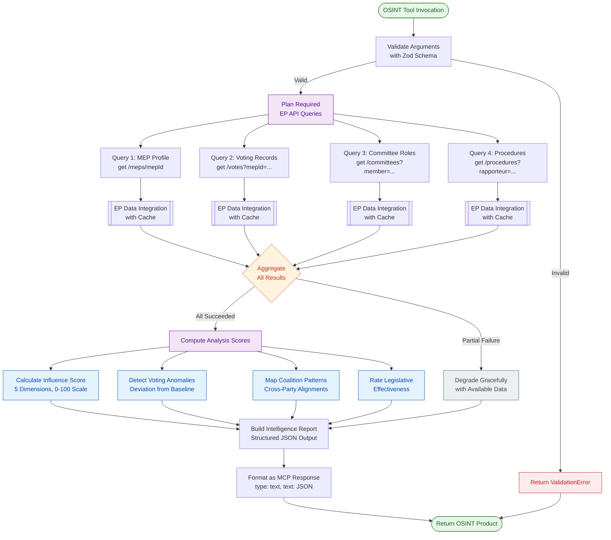
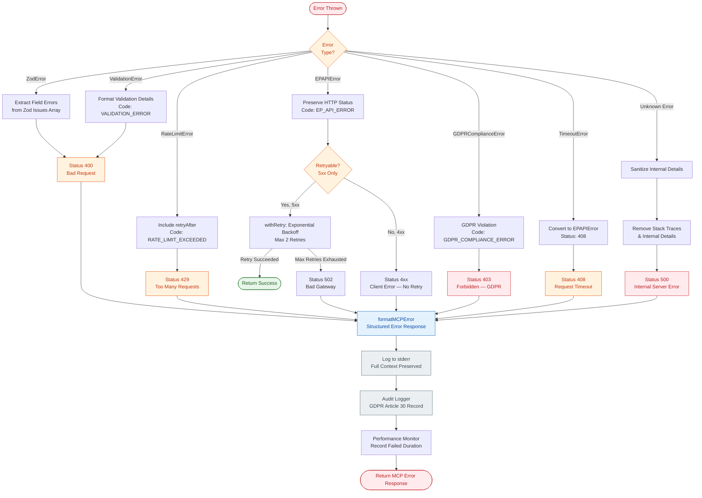

<p align="center">
  
</p>

<h1 align="center">🔄 European Parliament MCP Server — Process Flowcharts</h1>

<p align="center">
  <strong>Model Context Protocol Server for European Parliament Open Data</strong><br>
  <em>Request Processing, Tool Execution, Data Integration &amp; OSINT Analysis Flows — 28 Tools, 6 Resources, 6 Prompts</em>
</p>

<p align="center">
  <a href="#"></a>
  <a href="#"></a>
  <a href="#"></a>
  <a href="#"></a>
</p>

**📋 Document Owner:** Architecture Team | **📄 Version:** 0.6.2 | **📅 Last Updated:** 2025-06-20 (UTC)
**🔄 Review Cycle:** Quarterly | **⏰ Next Review:** 2025-09-20
**🏷️ Classification:** Public (Open Source MCP Server)
**✅ ISMS Compliance:** ISO 27001 (A.8.1, A.12.4, A.14.2), NIST CSF 2.0 (ID.AM, PR.DS, DE.CM), CIS Controls v8.1 (2.1, 8.2, 16.1)

---

## 📋 Table of Contents

1. [Architecture Documentation Map](#-architecture-documentation-map)
2. [Executive Summary](#-executive-summary)
3. [MCP Request Processing Flow](#-mcp-request-processing-flow)
4. [Tool Execution Pipeline](#-tool-execution-pipeline)
5. [EP Data Integration Flow](#-ep-data-integration-flow)
6. [Resource Access Flow](#-resource-access-flow)
7. [Cache Management Flow](#-cache-management-flow)
8. [OSINT Analysis Pipeline](#-osint-analysis-pipeline)
9. [Error Handling Flow](#-error-handling-flow)
10. [Color Legend](#-color-legend)
11. [ISMS Compliance Mapping](#-isms-compliance-mapping)
12. [Related Documentation](#-related-documentation)

---

## 🗺️ Architecture Documentation Map

| Document | Current | Future | Description |
|----------|---------|--------|-------------|
| **Architecture** | [ARCHITECTURE.md](./ARCHITECTURE.md) | [FUTURE_ARCHITECTURE.md](./FUTURE_ARCHITECTURE.md) | C4 model, containers, components |
| **Data Model** | [DATA_MODEL.md](./DATA_MODEL.md) | [FUTURE_DATA_MODEL.md](./FUTURE_DATA_MODEL.md) | Entity relationships and schemas |
| **Flowchart** | **FLOWCHART.md** *(this document)* | [FUTURE_FLOWCHART.md](./FUTURE_FLOWCHART.md) | Request processing and data flows |
| **Mind Map** | [MINDMAP.md](./MINDMAP.md) | [FUTURE_MINDMAP.md](./FUTURE_MINDMAP.md) | System concepts and relationships |
| **State Diagram** | [STATEDIAGRAM.md](./STATEDIAGRAM.md) | [FUTURE_STATEDIAGRAM.md](./FUTURE_STATEDIAGRAM.md) | System state transitions |
| **SWOT Analysis** | [SWOT.md](./SWOT.md) | [FUTURE_SWOT.md](./FUTURE_SWOT.md) | Strategic positioning |
| **Workflows** | [WORKFLOWS.md](./WORKFLOWS.md) | [FUTURE_WORKFLOWS.md](./FUTURE_WORKFLOWS.md) | CI/CD pipeline documentation |
| **Security Architecture** | [SECURITY_ARCHITECTURE.md](./SECURITY_ARCHITECTURE.md) | [FUTURE_SECURITY_ARCHITECTURE.md](./FUTURE_SECURITY_ARCHITECTURE.md) | Security controls and design |
| **Threat Model** | [THREAT_MODEL.md](./THREAT_MODEL.md) | — | STRIDE-based threat analysis |
| **CRA Assessment** | [CRA-ASSESSMENT.md](./CRA-ASSESSMENT.md) | — | EU Cyber Resilience Act review |
| **Architecture Diagrams** | [ARCHITECTURE_DIAGRAMS.md](./ARCHITECTURE_DIAGRAMS.md) | — | Supplementary C4 diagrams |

---

## 🎯 Executive Summary

The **European Parliament MCP Server** (v0.7.1) is a stateless TypeScript/Node.js server implementing the [Model Context Protocol](https://spec.modelcontextprotocol.io/) over **stdio transport**. It proxies requests to the **EP Open Data Portal API v2** (`https://data.europarl.europa.eu/api/v2/`), transforming JSON-LD responses into structured MCP tool results. The server exposes **39 tools**, **6 resource templates**, and **6 prompt templates** — all validated with Zod schemas and backed by an LRU cache (500 entries, 15-minute TTL).

This document maps every process flow in the system: from MCP request ingestion through stdio, to tool dispatch and Zod validation, EP API integration with retry logic, LRU cache management, multi-source OSINT analysis, and comprehensive error handling with GDPR compliance.

**Key Architectural Characteristics:**

- **Stateless** — No database, no persistent storage; all data sourced live from EP API
- **Stdio Transport** — Communication via stdin/stdout (no HTTP server)
- **Type-Safe** — Zod schema validation on all tool inputs and API responses
- **Cached** — LRU cache with 500 entries and 15-minute TTL for performance
- **Rate-Limited** — Token bucket algorithm (100 requests/minute) protects EP API
- **GDPR-Compliant** — Audit logging, data minimization, no PII persistence

---

## 🔀 MCP Request Processing Flow

The complete lifecycle of an MCP request from client connection through stdio transport to response delivery.



**Request Routing Details:**

| Method | Handler | Response |
|--------|---------|----------|
| `tools/list` | `ListToolsRequestSchema` | 39 tool definitions with JSON Schema |
| `tools/call` | `CallToolRequestSchema` → `dispatchToolCall()` | Tool execution result |
| `resources/templates/list` | `ListResourceTemplatesRequestSchema` | 6 URI templates |
| `resources/read` | `ReadResourceRequestSchema` | Resource content |
| `prompts/list` | `ListPromptsRequestSchema` | 6 prompt definitions |
| `prompts/get` | `GetPromptRequestSchema` | Resolved prompt messages |

---

## ⚙️ Tool Execution Pipeline

How a `tools/call` request is validated, dispatched to the correct handler, calls the EP API, and returns a formatted response.



**Tool Categories (28 Total):**

| Category | Tools | Description |
|----------|-------|-------------|
| **Core Data** (7) | `get_meps`, `get_mep_details`, `get_plenary_sessions`, `get_voting_records`, `search_documents`, `get_committee_info`, `get_parliamentary_questions` | Direct EP data access |
| **Advanced Analysis** (3) | `analyze_voting_patterns`, `track_legislation`, `generate_report` | Multi-query analytical tools |
| **OSINT Phase 1** (6) | `assess_mep_influence`, `analyze_coalition_dynamics`, `detect_voting_anomalies`, `compare_political_groups`, `analyze_legislative_effectiveness`, `monitor_legislative_pipeline` | Political intelligence |
| **OSINT Phase 2** (2) | `analyze_committee_activity`, `track_mep_attendance` | Committee & attendance analysis |
| **OSINT Phase 3** (2) | `analyze_country_delegation`, `generate_political_landscape` | National & strategic analysis |
| **EP API v2** (8) | `get_current_meps`, `get_speeches`, `get_procedures`, `get_adopted_texts`, `get_events`, `get_meeting_activities`, `get_meeting_decisions`, `get_mep_declarations` | Direct v2 endpoint access |

---

## 🌐 EP Data Integration Flow

How the `EuropeanParliamentClient` makes HTTP requests to the EP Open Data Portal API v2, parses JSON-LD responses, and transforms them into typed internal models.



**EP API v2 Integration Details:**

| Parameter | Value |
|-----------|-------|
| **Base URL** | `https://data.europarl.europa.eu/api/v2/` |
| **Response Format** | JSON-LD (`application/ld+json`) |
| **Authentication** | None (public open data API) |
| **Timeout** | Configurable via `withTimeoutAndAbort()` |
| **Max Retries** | 2 (with exponential backoff) |
| **Retry Conditions** | 5xx server errors, network failures |
| **No Retry** | 4xx client errors, timeout errors |

**JSON-LD Transformation Example:**

```typescript
// EP API JSON-LD Response
{
  "@context": "https://data.europarl.europa.eu/def/context.json",
  "@graph": [{
    "@id": "http://data.europarl.europa.eu/person/124810",
    "label": "Manfred WEBER",
    "eli-dl:nationality": "http://publications.europa.eu/resource/authority/country/DEU",
    "org:memberOf": "http://data.europarl.europa.eu/org/PPE"
  }]
}

// → Transformed Internal Model
{
  id: 124810,
  fullName: "Manfred WEBER",
  country: "DE",
  partyGroup: "PPE",
  active: true
}
```

---

## 📂 Resource Access Flow

How `resources/read` requests resolve URI templates, query the EP API, and return formatted resource content.



**Resource Templates (6 Total):**

| URI Template | Description | EP API Endpoint |
|--------------|-------------|-----------------|
| `ep://meps` | List of MEPs with filters | `/meps` |
| `ep://meps/{mepId}` | Individual MEP profile | `/meps/{mepId}` |
| `ep://procedures` | Legislative procedures | `/procedures` |
| `ep://votes` | Voting records | `/votes` |
| `ep://committees` | Committee information | `/committees` |
| `ep://documents` | Document search | `/documents` |

---

## 💾 Cache Management Flow

LRU cache lookup, hit/miss paths, TTL expiry, and eviction strategy using the `lru-cache` library.



**LRU Cache Configuration:**

```typescript
new LRUCache<string, Record<string, unknown>>({
  max: 500,             // Maximum 500 cached entries
  ttl: 900_000,         // 15-minute TTL (milliseconds)
  allowStale: false,    // Never serve expired entries
  updateAgeOnGet: true  // Reset TTL on cache hit
});
```

| Parameter | Value | Rationale |
|-----------|-------|-----------|
| **Max Entries** | 500 | Bounded memory; covers active tool calls |
| **TTL** | 15 minutes (900s) | Balance freshness vs. EP API load |
| **Stale Policy** | `allowStale: false` | GDPR: no stale PII served |
| **Age Reset** | `updateAgeOnGet: true` | Frequently-accessed data stays cached |
| **Key Strategy** | `JSON.stringify({endpoint, params})` | Deterministic, collision-free |
| **Eviction** | Least Recently Used | Optimal for temporal access patterns |

**Performance Impact:**

| Metric | Cache Hit | Cache Miss |
|--------|-----------|------------|
| **P50 Latency** | < 1ms | ~500ms |
| **P95 Latency** | < 5ms | ~1.5s |
| **P99 Latency** | < 10ms | ~2s |

---

## 🔍 OSINT Analysis Pipeline

How OSINT intelligence tools (`assess_mep_influence`, `analyze_coalition_dynamics`, `detect_voting_anomalies`, etc.) aggregate data from multiple EP API calls into composite intelligence products.



**Influence Assessment Scoring Model (CIA Political Scorecards Methodology):**

| Dimension | Weight | Data Source | Metric |
|-----------|--------|-------------|--------|
| **Voting Activity** | 25% | Voting records | Attendance rate + participation volume |
| **Legislative Output** | 25% | Procedures | Rapporteurships + adopted texts |
| **Committee Engagement** | 20% | Committees | Committee roles + diversity |
| **Parliamentary Oversight** | 15% | Questions, declarations | Questions filed + declarations made |
| **Coalition Building** | 15% | Cross-party votes | Cross-group voting frequency |

**OSINT Tool Pipeline Summary:**

| Tool | Queries Required | Output |
|------|-----------------|--------|
| `assess_mep_influence` | 4–5 EP API calls | Composite score (0–100), rank, confidence |
| `detect_voting_anomalies` | 2–3 EP API calls | Anomalies with severity (HIGH/MED/LOW) |
| `analyze_coalition_dynamics` | 3–4 EP API calls | Voting blocs, stability index |
| `compare_political_groups` | 2–3 EP API calls | Group comparisons, cohesion scores |
| `generate_political_landscape` | 5–6 EP API calls | Full strategic overview |

---

## ⚠️ Error Handling Flow

Comprehensive error classification, handling, and response formatting across all error types defined in `src/types/errors.ts`.



**Error Type Reference:**

| Error Type | Status | Code | Retryable | Use Case |
|-----------|--------|------|-----------|----------|
| `ValidationError` | 400 | `VALIDATION_ERROR` | No | Invalid tool arguments (bad country code, out-of-range limit) |
| `RateLimitError` | 429 | `RATE_LIMIT_EXCEEDED` | Yes (after `retryAfter`) | Token bucket exhausted |
| `EPAPIError` | 3xx–5xx | `EP_API_ERROR` | 5xx only | Upstream EP API failure |
| `GDPRComplianceError` | 403 | `GDPR_COMPLIANCE_ERROR` | No | Data minimization or consent violation |
| `TimeoutError` | 408 | `EP_API_ERROR` | No | `withTimeoutAndAbort()` exceeded |
| Unknown | 500 | `INTERNAL_ERROR` | No | Unexpected runtime error (sanitized) |

**Security Principle:** Internal error details (stack traces, internal paths, dependency versions) are **never** exposed to clients. All errors pass through `formatMCPError()` which strips sensitive information before responding, while the full context is logged to stderr for debugging.

---

## 🎨 Color Legend

All flowcharts in this document use a consistent color scheme to indicate node purpose at a glance.

| Color | Hex | Meaning | Example Nodes |
|-------|-----|---------|---------------|
| 🟢 Green | `#E8F5E9` | Start/End, Success path | Request entry, successful return |
| 🔵 Blue | `#E3F2FD` | Processing, Data transformation | Zod validation, JSON-LD parsing, response formatting |
| 🟣 Purple | `#F3E5F5` | Sub-process, Pipeline reference | EP Data Integration, OSINT computation |
| 🟠 Orange | `#FFF3E0` | Decision point, Branching logic | Route request, cache lookup, retry decision |
| 🔴 Red | `#FFEBEE` | Error state, Failure path | Validation error, API error, GDPR violation |
| ⚪ Grey | `#ECEFF1` | Observability, Logging | Audit log, performance metrics, eviction |

---

## 📋 ISMS Compliance Mapping

### ISO 27001 Controls

| Control | Requirement | Flowchart Implementation |
|---------|-------------|--------------------------|
| **A.8.1** | Inventory of Assets | Architecture Documentation Map; all processes documented |
| **A.12.4** | Logging and Monitoring | Audit Logger in tool pipeline; Performance Monitor in all flows |
| **A.14.2** | Security in Development | Zod input validation; error sanitization; no PII in responses |
| **A.18.1** | Compliance with Legal Requirements | GDPR compliance errors; data minimization in cache |

### NIST CSF 2.0 Functions

| Function | Category | Flowchart Implementation |
|----------|----------|--------------------------|
| **ID.AM** | Asset Management | Complete process documentation with data flows |
| **PR.DS** | Data Security | LRU cache TTL expiry; no persistent PII storage |
| **PR.AC** | Access Control | Rate limiting pipeline; token bucket algorithm |
| **DE.CM** | Continuous Monitoring | Performance Monitor metrics in all execution paths |
| **RS.RP** | Response Planning | Error handling flow with retry and graceful degradation |

### CIS Controls v8.1

| Control | Description | Flowchart Implementation |
|---------|-------------|--------------------------|
| **2.1** | Maintain Asset Inventory | Architecture Documentation Map cross-referencing all docs |
| **8.2** | Audit Logging | Audit Logger integration in tool execution and error paths |
| **16.1** | Establish Incident Response | Error classification, retry logic, GDPR error handling |

---

## 🔗 Related Documentation

| Document | Relevance |
|----------|-----------|
| [ARCHITECTURE.md](./ARCHITECTURE.md) | C4 architecture — containers and components referenced in these flows |
| [DATA_MODEL.md](./DATA_MODEL.md) | Entity schemas for MEP, Vote, Procedure objects in data flows |
| [SECURITY_ARCHITECTURE.md](./SECURITY_ARCHITECTURE.md) | Security controls implemented across all pipelines |
| [STATEDIAGRAM.md](./STATEDIAGRAM.md) | State transitions for cache entries and request lifecycle |
| [WORKFLOWS.md](./WORKFLOWS.md) | CI/CD pipeline that builds and tests these processes |
| [THREAT_MODEL.md](./THREAT_MODEL.md) | STRIDE threats mitigated by error handling and validation |
| [API_USAGE_GUIDE.md](./API_USAGE_GUIDE.md) | Tool usage examples that exercise these flows |
| [PERFORMANCE_GUIDE.md](./PERFORMANCE_GUIDE.md) | Performance targets referenced in cache management |
| [FUTURE_FLOWCHART.md](./FUTURE_FLOWCHART.md) | Planned enhancements to these process flows |

---

<p align="center">
  <strong>Built with ❤️ by <a href="https://hack23.com">Hack23 AB</a></strong><br>
  <em>Process flowchart documentation following ISMS standards</em><br>
  <em>European Parliament MCP Server v0.6.2 — 28 Tools · 6 Resources · 6 Prompts</em>
</p>
