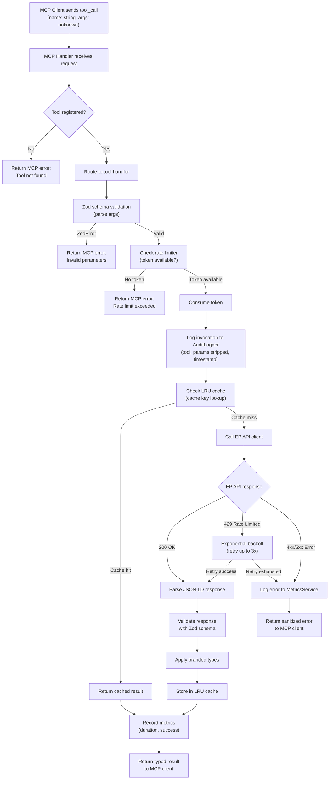
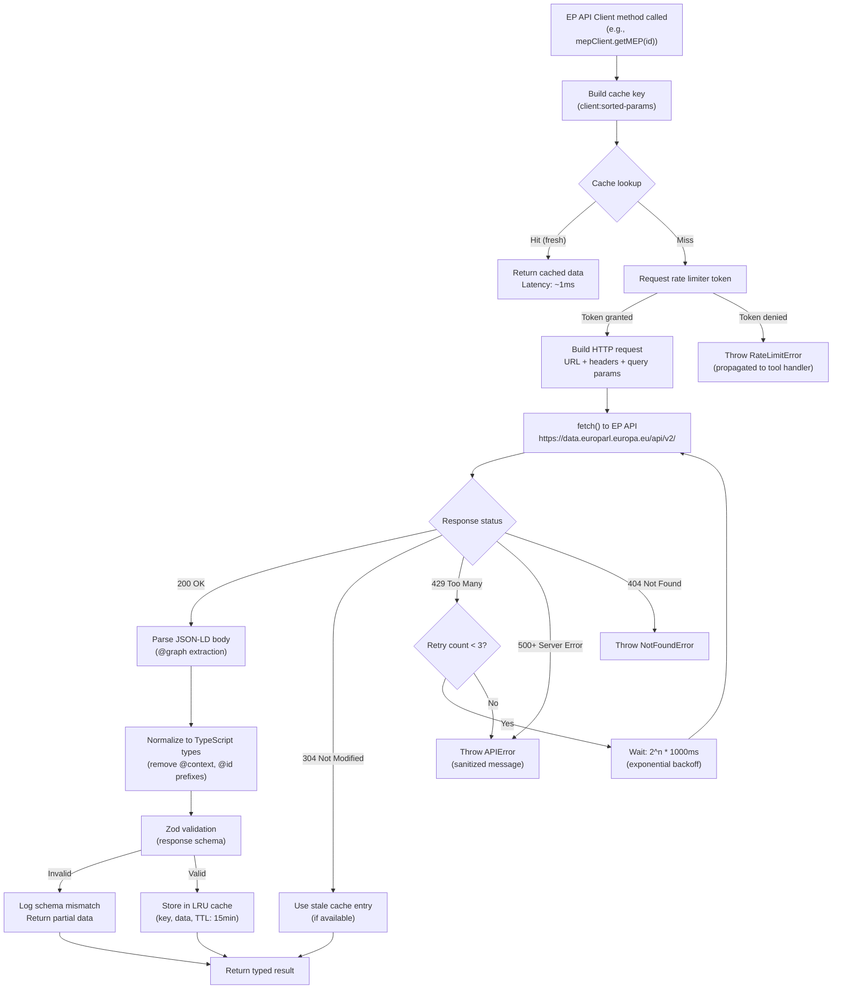
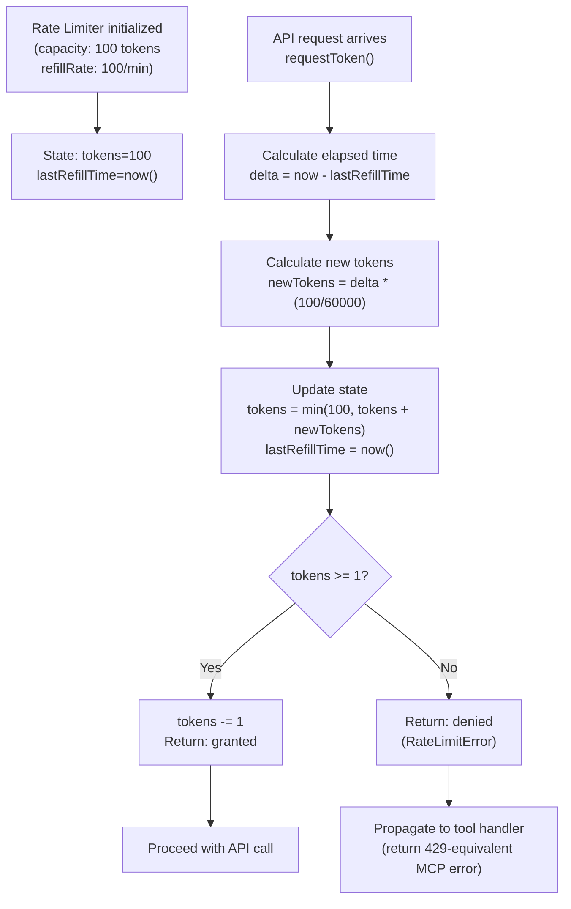
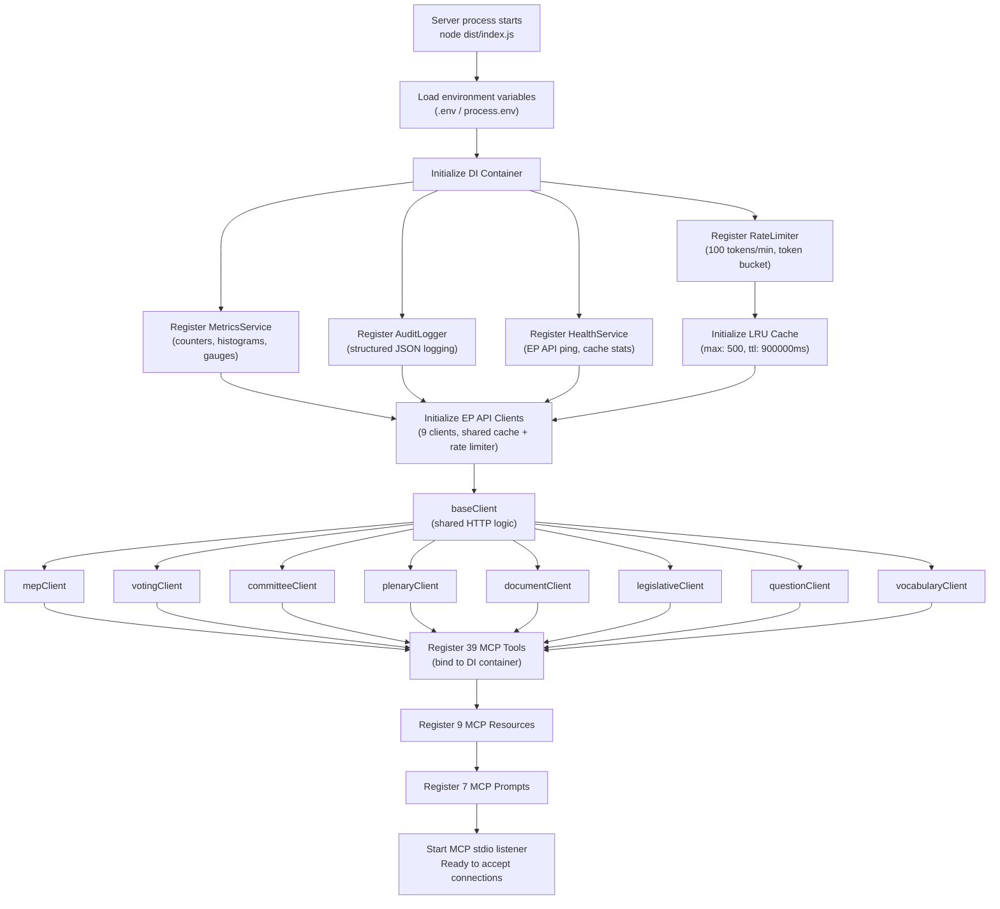
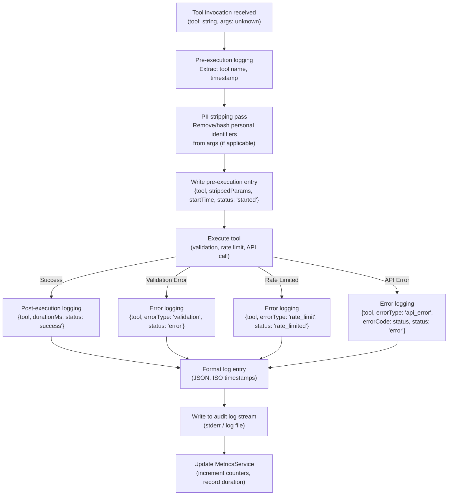
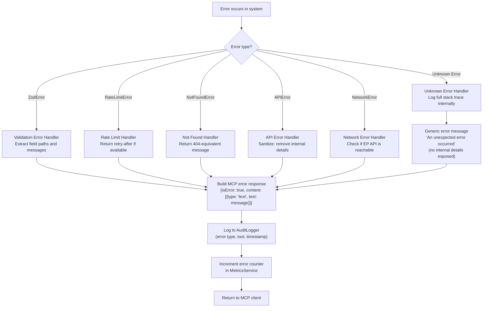
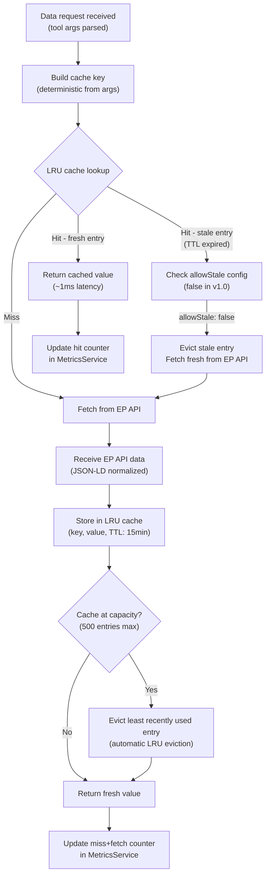

  

<h1 align="center">🔄 European Parliament MCP Server — Flowcharts</h1>

  <strong>Business Process Flows, Data Pipelines, and Operational Workflows</strong> 
  <em>Detailed flow documentation for MCP tool execution and EP API integration</em>

  
  
  
  

**📋 Document Owner:** Hack23 | **📄 Version:** 1.0 | **📅 Last Updated:** 2026-02-26 (UTC)
**🔄 Review Cycle:** Quarterly | **⏰ Next Review:** 2026-05-26
**🏷️ Classification:** Public (Open Source MCP Server)
**✅ ISMS Compliance:** ISO 27001 (A.5.1, A.8.1, A.14.2), NIST CSF 2.0 (ID.AM, PR.DS), CIS Controls v8.1 (2.1, 16.1)

---

## 📑 Table of Contents

1. [Security Documentation Map](#security-documentation-map)
2. [MCP Tool Execution Flow](#mcp-tool-execution-flow)
3. [EP API Client Request Lifecycle](#ep-api-client-request-lifecycle)
4. [Rate Limiter Token Bucket Flow](#rate-limiter-token-bucket-flow)
5. [DI Container Initialization Flow](#di-container-initialization-flow)
6. [Audit Logging Flow](#audit-logging-flow)
7. [Error Handling Flow](#error-handling-flow)
8. [Cache Management Flow](#cache-management-flow)

---

## 🗺️ Security Documentation Map

| Document | Current | Future | Description |
|----------|---------|--------|-------------|
| **Architecture** | [ARCHITECTURE.md](./ARCHITECTURE.md) | [FUTURE_ARCHITECTURE.md](./FUTURE_ARCHITECTURE.md) | C4 model, containers, components, ADRs |
| **Security Architecture** | [SECURITY_ARCHITECTURE.md](./SECURITY_ARCHITECTURE.md) | [FUTURE_SECURITY_ARCHITECTURE.md](./FUTURE_SECURITY_ARCHITECTURE.md) | Security controls, threat model |
| **Data Model** | [DATA_MODEL.md](./DATA_MODEL.md) | [FUTURE_DATA_MODEL.md](./FUTURE_DATA_MODEL.md) | Entity relationships, branded types |
| **Flowchart** | [FLOWCHART.md](./FLOWCHART.md) | [FUTURE_FLOWCHART.md](./FUTURE_FLOWCHART.md) | Business process flows |
| **State Diagram** | [STATEDIAGRAM.md](./STATEDIAGRAM.md) | [FUTURE_STATEDIAGRAM.md](./FUTURE_STATEDIAGRAM.md) | System state transitions |
| **Mind Map** | [MINDMAP.md](./MINDMAP.md) | [FUTURE_MINDMAP.md](./FUTURE_MINDMAP.md) | System concepts and relationships |
| **SWOT Analysis** | [SWOT.md](./SWOT.md) | [FUTURE_SWOT.md](./FUTURE_SWOT.md) | Strategic positioning |

---

## 🔧 MCP Tool Execution Flow

Complete flow from MCP client tool call to response:

---

## 🌐 EP API Client Request Lifecycle

Detailed flow for EP API calls including cache and retry logic:

---

## ⏱️ Rate Limiter Token Bucket Flow

Token bucket algorithm implementation:

---

## 🏗️ DI Container Initialization Flow

Server startup and dependency injection setup:

---

## 📝 Audit Logging Flow

How invocations are logged for GDPR and ISMS compliance:

---

## ⚠️ Error Handling Flow

Comprehensive error propagation and sanitization:

---

## 💾 Cache Management Flow

LRU cache lifecycle management:

---

*See [FUTURE_FLOWCHART.md](./FUTURE_FLOWCHART.md) for planned improvements including real-time data pipelines, streaming execution, and webhook notification flows.*
