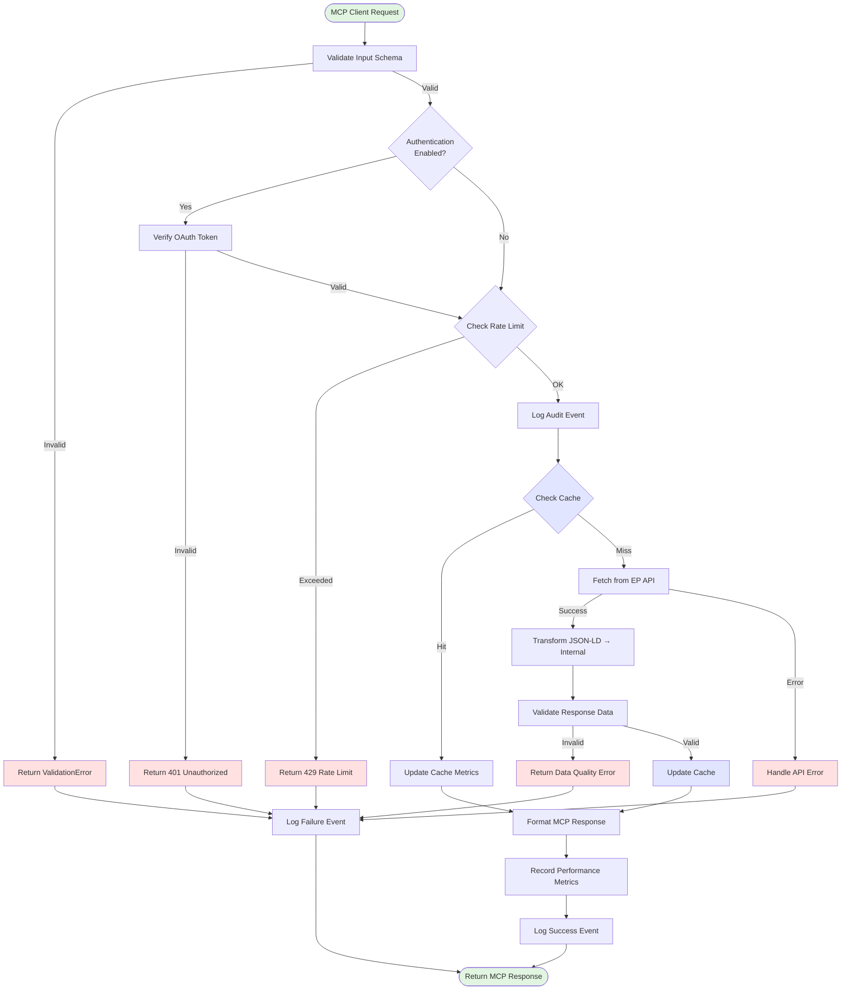
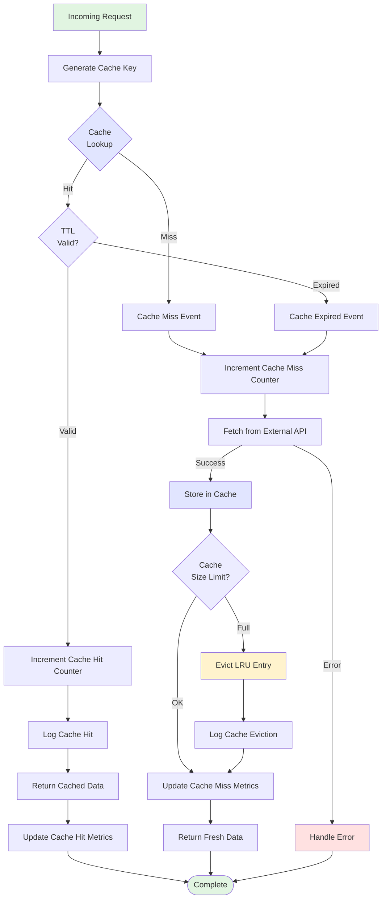
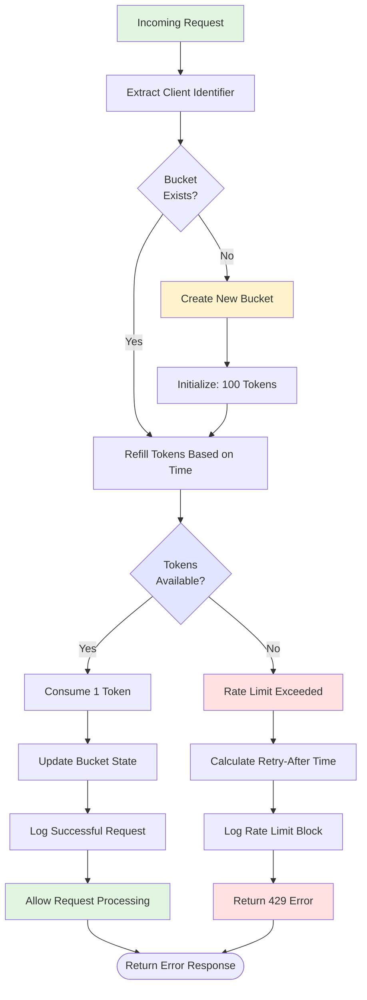
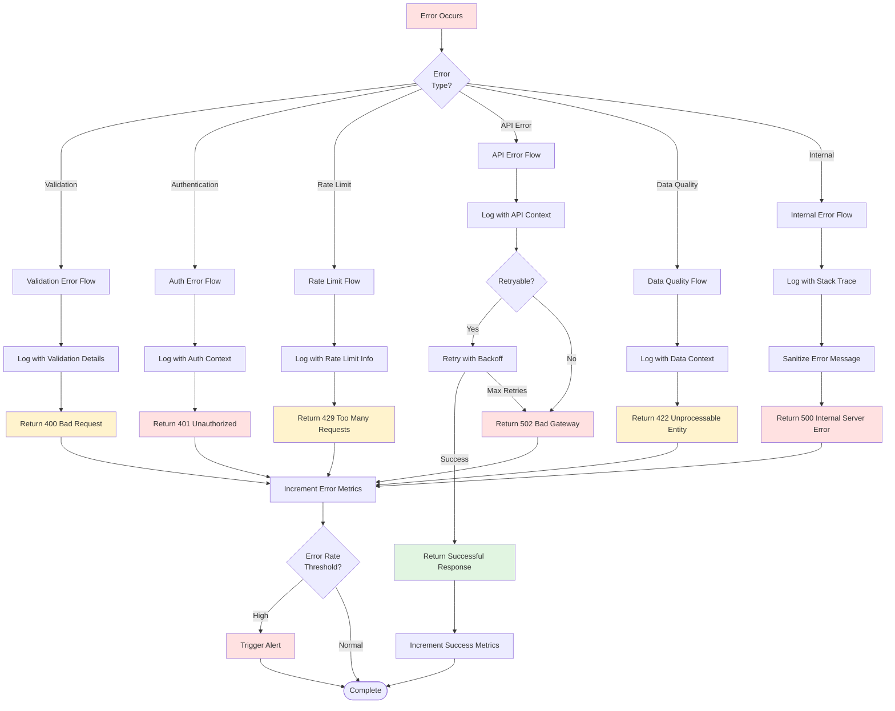
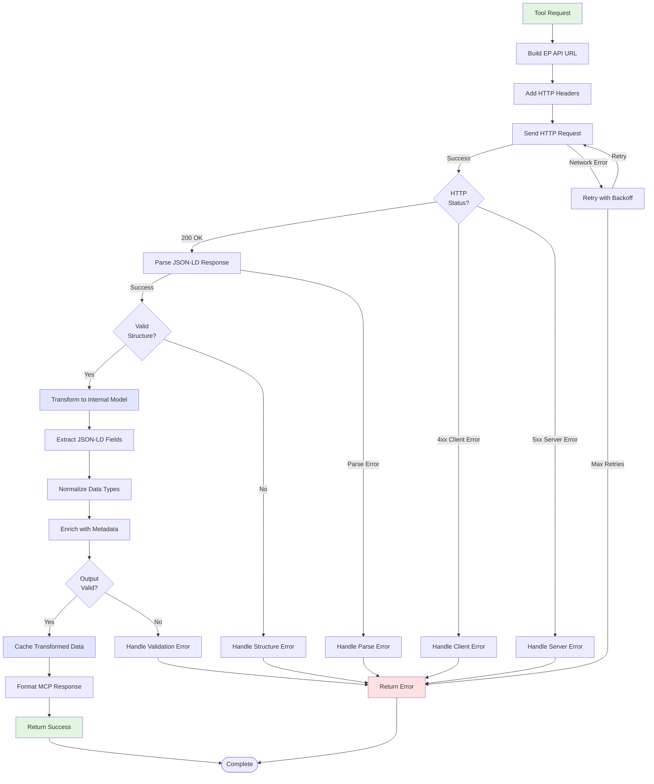
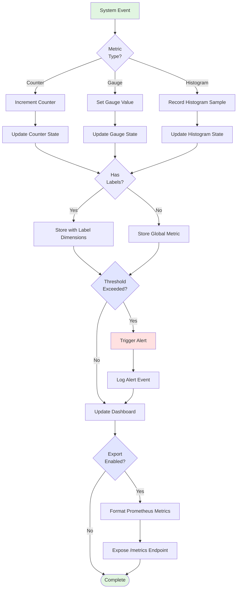
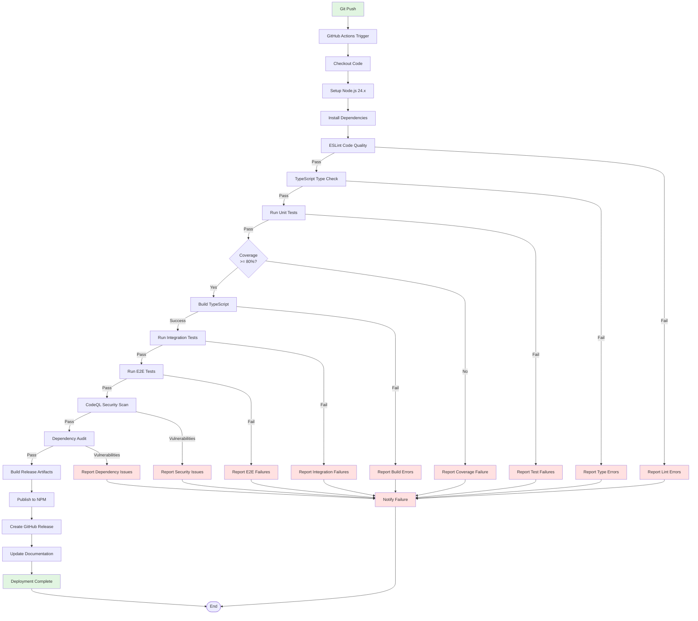
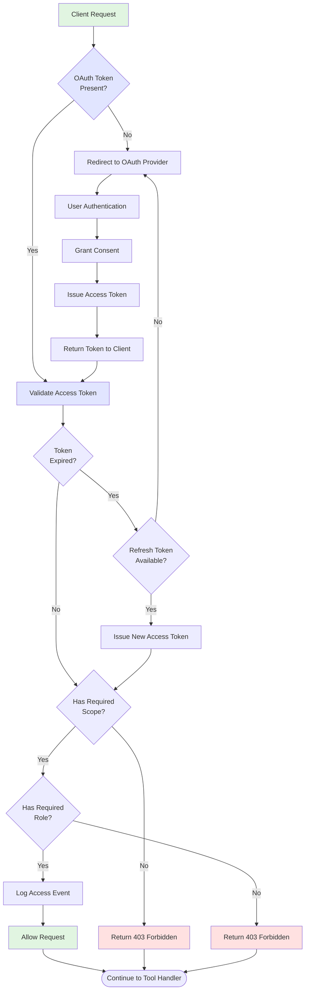

<p align="center">
  
</p>

<h1 align="center">🔄 European Parliament MCP Server - Process Flowcharts</h1>

<p align="center">
  <strong>Business Process and Data Flows</strong><br>
  <em>Comprehensive Workflow Documentation for Operations and Compliance</em>
</p>

<p align="center">
  <a href="#"></a>
  <a href="#"></a>
  <a href="#"></a>
  <a href="#"></a>
</p>

**📋 Document Owner:** Architecture Team | **📄 Version:** 1.0 | **📅 Last Updated:** 2026-02-17 (UTC)  
**🔄 Review Cycle:** Quarterly | **⏰ Next Review:** 2026-08-17  
**🏷️ Classification:** Public (Open Source MCP Server)  
**✅ ISMS Compliance:** ISO 27001 (A.8.1), NIST CSF 2.0 (ID.AM), CIS Controls v8.1 (2.1)

---

## 📋 Table of Contents

1. [Overview](#overview)
2. [MCP Tool Invocation Workflow](#mcp-tool-invocation-workflow)
3. [Cache Management Flow](#cache-management-flow)
4. [Rate Limiting Flow](#rate-limiting-flow)
5. [Error Handling Workflow](#error-handling-workflow)
6. [Data Retrieval and Transformation](#data-retrieval-and-transformation)
7. [Monitoring and Metrics Collection](#monitoring-and-metrics-collection)
8. [CI/CD Deployment Pipeline](#cicd-deployment-pipeline)
9. [Future Authentication Flow](#future-authentication-flow)

---

## 🎯 Overview

This document provides comprehensive flowcharts for all business processes and data flows in the European Parliament MCP Server. All diagrams use Mermaid syntax for version control and transparency.

**Purpose:**
- Document operational workflows for maintenance and troubleshooting
- Provide audit trail for security and compliance reviews
- Enable new developer onboarding with visual process maps
- Support architectural decision making and optimization

---

## 🔧 MCP Tool Invocation Workflow

### Primary Tool Execution Flow



**Key Process Steps:**
1. **Input Validation** - Zod schema validation prevents invalid requests
2. **Authentication** - Future OAuth 2.0 integration (currently no-auth)
3. **Rate Limiting** - Token bucket algorithm (100 req/15min)
4. **Audit Logging** - Winston structured logging for all requests
5. **Cache Check** - LRU cache (15-min TTL) for performance
6. **API Integration** - EP Open Data API with retry logic
7. **Data Transformation** - JSON-LD → Internal TypeScript types
8. **Response Formatting** - MCP protocol compliance
9. **Metrics Recording** - Prometheus-style metrics collection

---

## 💾 Cache Management Flow

### Cache Hit/Miss Processing



**Cache Configuration:**
- **Algorithm**: LRU (Least Recently Used)
- **Max Size**: 500 entries
- **TTL**: 15 minutes (900 seconds)
- **Key Strategy**: `${toolName}:${JSON.stringify(params)}`
- **GDPR Compliance**: No persistent storage, automatic expiration

**Cache Key Examples:**
```typescript
// MEP list query
"get_meps:{\"country\":\"SE\",\"limit\":50,\"offset\":0}"

// MEP details query
"get_mep_details:{\"id\":\"124810\"}"

// Plenary sessions query
"get_plenary_sessions:{\"dateFrom\":\"2024-01-01\",\"limit\":25}"
```

---

## 🚦 Rate Limiting Flow

### Token Bucket Algorithm Implementation



**Rate Limit Configuration:**
- **Capacity**: 100 tokens per bucket
- **Refill Rate**: 100 tokens per 15 minutes (0.111 tokens/second)
- **Identifier**: Client IP address (future: OAuth client ID)
- **Response**: HTTP 429 with `Retry-After` header

**Example Rate Limit Response:**
```json
{
  "error": {
    "type": "RateLimitError",
    "message": "Rate limit exceeded. Try again in 240 seconds.",
    "retryAfter": 240,
    "limit": 100,
    "window": 900
  }
}
```

---

## ⚠️ Error Handling Workflow

### Comprehensive Error Processing



**Error Categories:**
1. **Validation Errors (400)** - Invalid input parameters
2. **Authentication Errors (401)** - Invalid or missing credentials
3. **Rate Limit Errors (429)** - Too many requests
4. **API Errors (502)** - External API failures
5. **Data Quality Errors (422)** - Invalid response data
6. **Internal Errors (500)** - Unexpected server errors

**Error Handling Best Practices:**
- **Never expose internal details** - Sanitize error messages for clients
- **Always log full context** - Include stack traces in logs
- **Implement retry logic** - Exponential backoff for transient failures
- **Monitor error rates** - Alert on abnormal patterns
- **Maintain error budget** - Track SLI/SLO compliance

---

## 🔄 Data Retrieval and Transformation

### EP API Integration Flow



**EP API Integration Details:**
- **Base URL**: `https://data.europarl.europa.eu/api/v2/`
- **Format**: JSON-LD (application/ld+json)
- **Authentication**: None (public API)
- **Rate Limit**: 500 requests per 5 minutes per endpoint
- **Retry Strategy**: 3 retries with exponential backoff (1s, 2s, 4s)

**Data Transformation Pipeline:**
1. **JSON-LD Parsing** - Parse @context and extract data arrays
2. **Field Mapping** - Map JSON-LD field names to internal types
3. **Type Coercion** - Convert strings to proper TypeScript types
4. **Normalization** - Standardize date formats, IDs, enums
5. **Enrichment** - Add derived fields (e.g., full names, formatted dates)
6. **Validation** - Zod schema validation for type safety

**Example Transformation:**
```typescript
// EP API JSON-LD Response
{
  "@context": [...],
  "data": [{
    "person/124810": {
      "label": "Petter JÄRNVALL",
      "eli-dl:activity_date": "2024-07-16T00:00:00Z",
      "hasLocality": "FRA_SXB"
    }
  }]
}

// Transformed Internal Model
{
  id: "124810",
  name: "Petter JÄRNVALL",
  activityDate: "2024-07-16",
  location: "Strasbourg",
  country: "Sweden",
  politicalGroup: "S&D"
}
```

---

## 📊 Monitoring and Metrics Collection

### Metrics Collection Flow



**Collected Metrics:**

**Counters:**
- `mcp_requests_total{tool, status}` - Total requests per tool
- `cache_hits_total{tool}` - Cache hit count
- `cache_misses_total{tool}` - Cache miss count
- `rate_limit_exceeded_total` - Rate limit violations
- `errors_total{type, tool}` - Error count by type

**Gauges:**
- `cache_size` - Current cache entry count
- `active_connections` - Active MCP connections
- `rate_limit_tokens{client}` - Available rate limit tokens

**Histograms:**
- `request_duration_seconds{tool}` - Request latency (p50, p95, p99)
- `api_response_time_seconds{endpoint}` - EP API response time
- `cache_latency_seconds` - Cache operation latency

**Alert Thresholds:**
- Error rate > 5% over 5 minutes
- p95 latency > 2 seconds
- Cache hit rate < 60%
- Rate limit violations > 10/minute

---

## 🚀 CI/CD Deployment Pipeline

### GitHub Actions Workflow



**Pipeline Stages:**
1. **Code Quality** - ESLint with complexity checks (<10)
2. **Type Safety** - TypeScript strict mode validation
3. **Unit Tests** - Vitest with 80% coverage requirement
4. **Build** - TypeScript → JavaScript compilation
5. **Integration Tests** - MCP protocol integration tests
6. **E2E Tests** - Full workflow validation
7. **Security Scan** - CodeQL analysis, dependency audit
8. **Deployment** - NPM publish, GitHub release

**Pipeline SLAs:**
- Build time: < 10 minutes (target: 5 minutes)
- Test execution: < 5 minutes (target: 2 minutes)
- Deployment time: < 2 minutes
- Total pipeline: < 15 minutes end-to-end

---

## 🔐 Future Authentication Flow

### OAuth 2.0 Integration (Planned Q2 2026)



**OAuth 2.0 Configuration (Planned):**
- **Provider**: GitHub OAuth, Auth0, or Keycloak
- **Grant Type**: Authorization Code with PKCE
- **Scopes**: `read:meps`, `read:plenary`, `read:documents`, `admin`
- **Token Lifetime**: 1 hour (access), 7 days (refresh)
- **Storage**: Redis for token cache, PostgreSQL for refresh tokens

**RBAC Roles (Planned):**
- `anonymous` - Public read-only access (rate limited)
- `user` - Authenticated access (higher rate limits)
- `premium` - Premium features (advanced analytics, exports)
- `admin` - Full access including system management

---

## 📋 ISMS Compliance Mapping

### ISO 27001 Controls

| Control | Requirement | Implementation |
|---------|------------|----------------|
| A.8.1 | Inventory of Assets | Architecture documentation, dependency SBOM |
| A.8.2 | Information Classification | Data classification in DATA_MODEL.md |
| A.8.3 | Media Handling | No persistent storage, cache-only architecture |
| A.12.1 | Operational Procedures | CI/CD automation, deployment runbooks |
| A.12.4 | Logging and Monitoring | Winston audit logging, Prometheus metrics |
| A.14.2 | Security in Development | SAST/SCA/DAST in CI/CD pipeline |

### NIST CSF 2.0 Functions

| Function | Category | Implementation |
|----------|----------|----------------|
| ID.AM | Asset Management | Complete architecture documentation |
| PR.DS | Data Security | GDPR compliance, no persistent PII storage |
| PR.AC | Identity Management | OAuth 2.0 (planned), RBAC authorization |
| DE.CM | Continuous Monitoring | Metrics collection, log aggregation |
| RS.RP | Response Planning | Error handling workflows, incident runbooks |

### CIS Controls v8.1

| Control | Description | Implementation |
|---------|-------------|----------------|
| 2.1 | Maintain Asset Inventory | Architecture documentation, SBOM |
| 3.3 | Protect Data | Data classification, encryption in transit |
| 6.1 | Establish Access Control | OAuth 2.0 (planned), API authentication |
| 8.2 | Audit Logging | Winston structured logging, audit trail |
| 16.14 | Establish Incident Response | Error handling workflows, alerting |

---

## 🔗 Related Documentation

- [SECURITY_ARCHITECTURE.md](./SECURITY_ARCHITECTURE.md) - Security implementation details
- [DATA_MODEL.md](./DATA_MODEL.md) - Data structures and entities
- [STATEDIAGRAM.md](./STATEDIAGRAM.md) - System state transitions
- [ARCHITECTURE_DIAGRAMS.md](./ARCHITECTURE_DIAGRAMS.md) - C4 model diagrams
- [TROUBLESHOOTING.md](./TROUBLESHOOTING.md) - Common issues and solutions

---

<p align="center">
  <strong>Built with ❤️ by <a href="https://hack23.com">Hack23 AB</a></strong><br>
  <em>Flowchart documentation following ISMS standards</em>
</p>
