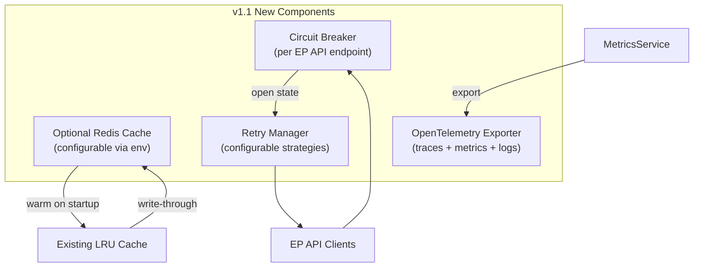
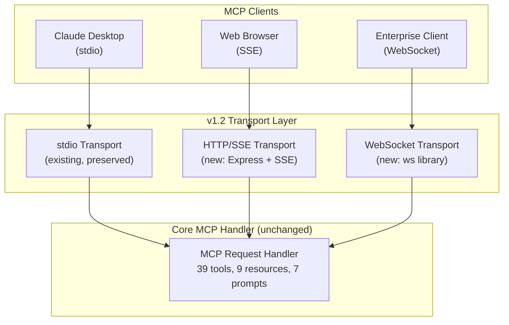
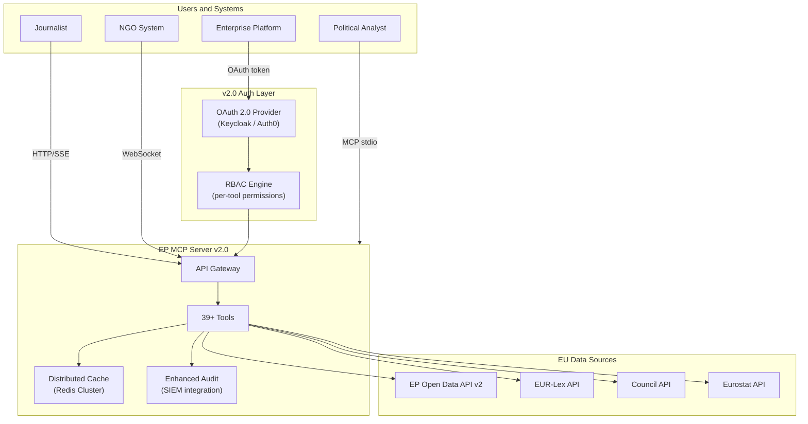

<p align="center">
  
</p>

<h1 align="center">🚀 European Parliament MCP Server — Future Architecture</h1>

<p align="center">
  <strong>Architectural Evolution Roadmap — v1.1, v1.2, v2.0</strong><br>
  <em>Planned capabilities, migration paths, and next-generation architecture design</em>
</p>

<p align="center">
  <a href="#"></a>
  <a href="#"></a>
  <a href="#"></a>
  <a href="#"></a>
</p>

**📋 Document Owner:** Hack23 | **📄 Version:** 1.0 | **📅 Last Updated:** 2026-02-26 (UTC)
**🔄 Review Cycle:** Quarterly | **⏰ Next Review:** 2026-05-26
**🏷️ Classification:** Public (Open Source MCP Server)
**✅ ISMS Compliance:** ISO 27001 (A.5.1, A.8.1, A.14.2), NIST CSF 2.0 (ID.AM, PR.DS), CIS Controls v8.1 (2.1, 16.1)

---

## 📑 Table of Contents

1. [Security Documentation Map](#security-documentation-map)
2. [Roadmap Overview](#roadmap-overview)
3. [v1.1 — Performance and Reliability](#v11--performance-and-reliability)
4. [v1.2 — HTTP Transport and Streaming](#v12--http-transport-and-streaming)
5. [v2.0 — Enterprise Platform](#v20--enterprise-platform)
6. [Future C4 Context Diagram](#future-c4-context-diagram)
7. [Future Container Architecture](#future-container-architecture)
8. [Migration Path](#migration-path)
9. [Technology Evolution](#technology-evolution)

---

## 🗺️ Security Documentation Map

| Document | Current | Future | Description |
|----------|---------|--------|-------------|
| **Architecture** | [ARCHITECTURE.md](./ARCHITECTURE.md) | [FUTURE_ARCHITECTURE.md](./FUTURE_ARCHITECTURE.md) | C4 model, containers, components, ADRs |
| **Security Architecture** | [SECURITY_ARCHITECTURE.md](./SECURITY_ARCHITECTURE.md) | [FUTURE_SECURITY_ARCHITECTURE.md](./FUTURE_SECURITY_ARCHITECTURE.md) | Security controls, threat model |
| **Data Model** | [DATA_MODEL.md](./DATA_MODEL.md) | [FUTURE_DATA_MODEL.md](./FUTURE_DATA_MODEL.md) | Entity relationships, branded types |
| **Flowchart** | [FLOWCHART.md](./FLOWCHART.md) | [FUTURE_FLOWCHART.md](./FUTURE_FLOWCHART.md) | Business process flows |
| **State Diagram** | [STATEDIAGRAM.md](./STATEDIAGRAM.md) | [FUTURE_STATEDIAGRAM.md](./FUTURE_STATEDIAGRAM.md) | System state transitions |
| **Mind Map** | [MINDMAP.md](./MINDMAP.md) | [FUTURE_MINDMAP.md](./FUTURE_MINDMAP.md) | System concepts and relationships |
| **SWOT Analysis** | [SWOT.md](./SWOT.md) | [FUTURE_SWOT.md](./FUTURE_SWOT.md) | Strategic positioning |

---

## 🗓️ Roadmap Overview

```mermaid
flowchart LR
    subgraph v10["v1.0 - Current (2026-02)"]
        T1["39 tools\n9 resources\n7 prompts"]
        T2["stdio transport"]
        T3["LRU cache\n500 entries, 15-min"]
        T4["4-layer security"]
    end

    subgraph v11["v1.1 - Q2 2026"]
        U1["Persistent cache\n(Redis optional)"]
        U2["Enhanced metrics\n(OpenTelemetry)"]
        U3["Retry strategies\nimproved"]
        U4["More tool coverage"]
    end

    subgraph v12["v1.2 - Q3 2026"]
        V1["HTTP transport\n(SSE streaming)"]
        V2["WebSocket support"]
        V3["GraphQL endpoint"]
        V4["Docker packaging"]
    end

    subgraph v20["v2.0 - Q4 2026 / Q1 2027"]
        W1["OAuth 2.0 auth"]
        W2["RBAC per tool"]
        W3["Multi-instance\nhorizontal scale"]
        W4["EU institution\ndata federation"]
    end

    v10 --> v11
    v11 --> v12
    v12 --> v20
```



---

## 🔧 v1.1 — Performance and Reliability

**Target:** Q2 2026

### New Capabilities

| Feature | Description | Priority |
|---------|-------------|----------|
| **Optional Redis Cache** | Persistent cache backend for cross-restart warm cache | High |
| **OpenTelemetry Integration** | Structured observability with traces, metrics, logs | High |
| **Improved Retry Logic** | Configurable retry strategies per endpoint type | Medium |
| **Circuit Breaker** | Prevent cascade failures when EP API degrades | Medium |
| **Tool Coverage +5** | 5 additional tools for emerging EP API endpoints | Medium |
| **Cache Warmup** | Pre-load frequently accessed data on startup | Low |

### v1.1 Architecture Changes



---

## 🌐 v1.2 — HTTP Transport and Streaming

**Target:** Q3 2026

### New Capabilities

| Feature | Description | Priority |
|---------|-------------|----------|
| **HTTP/SSE Transport** | MCP over HTTP with Server-Sent Events for streaming | Critical |
| **WebSocket Transport** | Real-time bidirectional MCP communication | High |
| **GraphQL API** | Optional GraphQL interface for complex queries | Medium |
| **Docker Container** | Official Docker image with multi-arch support | High |
| **Kubernetes Helm Chart** | Enterprise deployment via Helm | Medium |
| **Health Endpoint** | HTTP `/health` endpoint for load balancer integration | High |

### v1.2 Transport Architecture



---

## 🏢 v2.0 — Enterprise Platform

**Target:** Q4 2026 / Q1 2027

### New Capabilities

| Feature | Description | Priority |
|---------|-------------|----------|
| **OAuth 2.0** | User authentication with OAuth 2.0 / OIDC | Critical |
| **Fine-grained RBAC** | Per-tool, per-dataset access control | Critical |
| **Multi-instance Scaling** | Horizontal scaling with shared Redis cache | High |
| **EU Data Federation** | EUR-Lex, Council, Eurostat data integration | High |
| **Webhook Notifications** | Subscribe to EP data change events | Medium |
| **GraphQL Subscriptions** | Real-time data updates via GraphQL | Medium |
| **Tenant Isolation** | Multi-tenant deployment for SaaS | Low |
| **Audit Trail Export** | Compliance export (CSV, JSON, SIEM integration) | High |

### v2.0 Context Diagram



---

## 🔄 Migration Path

### v1.0 → v1.1 (Non-Breaking)

All v1.0 configurations remain valid. New features are opt-in via environment variables:

```bash
# v1.1 optional features (all off by default for backward compat)
EP_MCP_REDIS_URL=redis://localhost:6379  # Optional Redis cache
EP_MCP_OTEL_ENDPOINT=http://jaeger:4317  # Optional OpenTelemetry
EP_MCP_CIRCUIT_BREAKER=true              # Optional circuit breaker
```

### v1.1 → v1.2 (Additive)

New transport options added. stdio remains default and unchanged:

```bash
# v1.2 optional transport (stdio remains default)
EP_MCP_HTTP_PORT=3000        # Enable HTTP/SSE transport
EP_MCP_WS_PORT=3001          # Enable WebSocket transport
EP_MCP_GRAPHQL_PORT=3002     # Enable GraphQL endpoint
```

### v1.2 → v2.0 (Breaking for Enterprise)

v2.0 introduces mandatory authentication for non-local deployments:

```bash
# v2.0 auth configuration (required for HTTP/WS transport)
EP_MCP_AUTH_ISSUER=https://auth.example.com
EP_MCP_AUTH_AUDIENCE=ep-mcp-server
EP_MCP_AUTH_REQUIRED=true
```

stdio transport remains unauthenticated for local development.

---

## 🛠️ Technology Evolution

| Component | v1.0 | v1.1 | v1.2 | v2.0 |
|-----------|------|------|------|------|
| Cache | LRU in-memory | LRU + optional Redis | LRU + Redis | Redis Cluster |
| Transport | stdio only | stdio | stdio + HTTP + WS | All + GraphQL |
| Auth | None | None | None | OAuth 2.0 + RBAC |
| Observability | Console | OpenTelemetry | OpenTelemetry | SIEM integration |
| Deployment | npm / npx | npm + Docker | Docker + K8s Helm | Multi-tenant SaaS |
| Data Sources | EP API v2 | EP API v2 | EP API v2 | EP + EUR-Lex + Council |
| Tools | 39 | 44 | 50 | 60+ |

---

*This document defines the planned evolution. Actual delivery timelines depend on community contributions and EP API developments. See [ARCHITECTURE.md](./ARCHITECTURE.md) for the current implemented architecture.*
