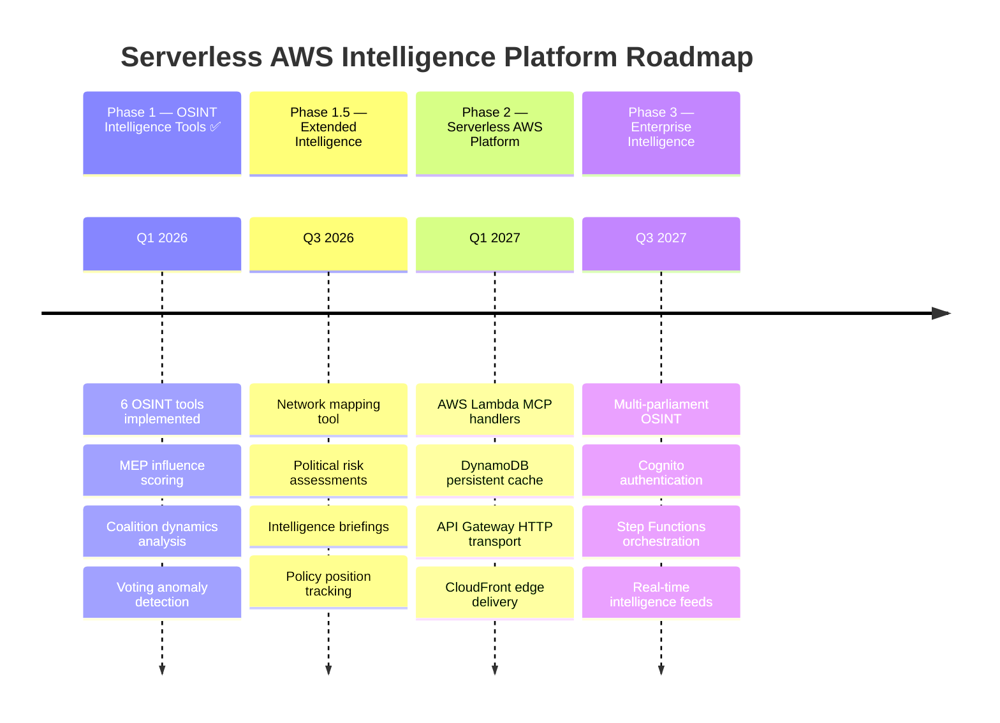
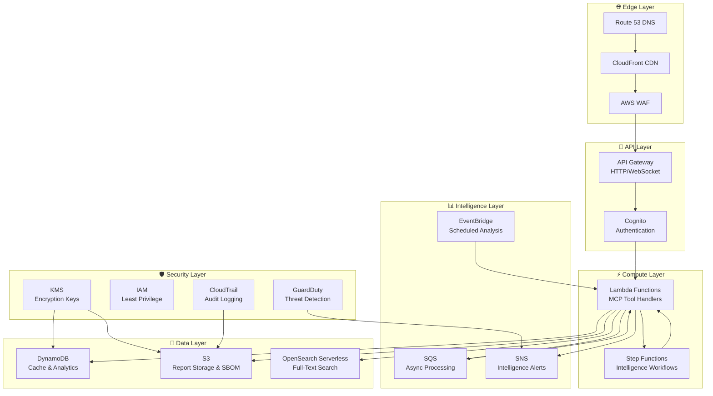
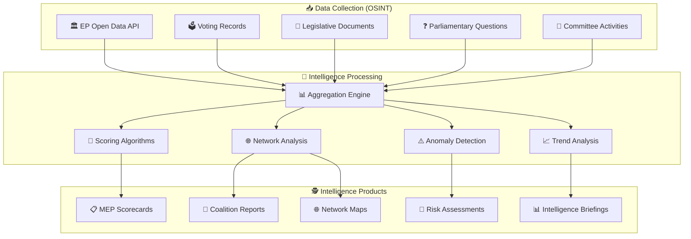
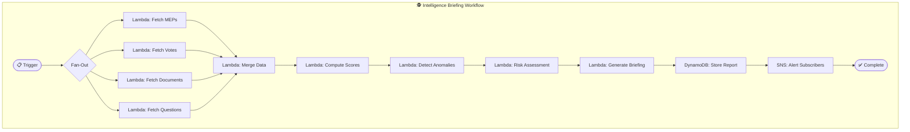
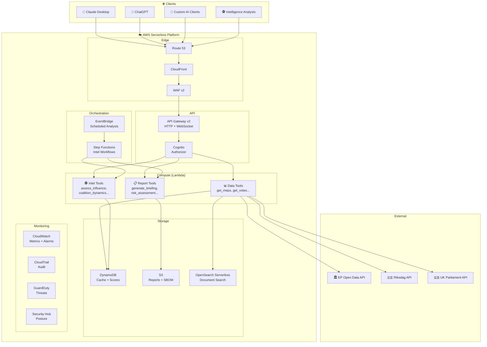

<p align="center">
  
</p>

<h1 align="center">🚀 European Parliament MCP Server — Future Architecture</h1>

<p align="center">
  <strong>🏗️ Serverless AWS Intelligence Platform</strong><br>
  <em>🕵️ OSINT-Grade Parliamentary Intelligence • ☁️ Serverless AWS-Only • 📈 Advanced Aggregate Analytics</em>
</p>

<p align="center">
  <a href="#"></a>
  <a href="#"></a>
  <a href="#"></a>
  <a href="#"></a>
  <a href="#"></a>
</p>

**📋 Document Owner:** CEO | **📄 Version:** 2.0 | **📅 Last Updated:** 2026-02-20 (UTC)  
**🔄 Review Cycle:** Quarterly | **⏰ Next Review:** 2026-05-20  
**🏷️ Classification:** Public (Open Source MCP Server)  
**☁️ Infrastructure Strategy:** Serverless AWS-Only

---

## 📑 Table of Contents

- [Executive Summary](#-executive-summary)
- [Serverless AWS Strategy](#️-serverless-aws-strategy)
- [Current Architecture Baseline](#-current-architecture-baseline)
- [Phase 1: OSINT Intelligence Tools](#️-phase-1-osint-intelligence-tools)
- [Phase 2: Serverless AWS Intelligence Platform](#️-phase-2-serverless-aws-intelligence-platform)
- [Phase 3: Enterprise Intelligence Operations](#-phase-3-enterprise-intelligence-operations)
- [Advanced Aggregate Intelligence Tools](#-advanced-aggregate-intelligence-tools)
- [Serverless Architecture Diagram](#️-serverless-architecture-diagram)
- [Future MCP Protocol Enhancements](#-future-mcp-protocol-enhancements)
- [Security Architecture Evolution](#️-security-architecture-evolution)
- [Policy Alignment](#-policy-alignment)
- [Related Documents](#-related-documents)

---

## 🎯 Executive Summary

This document outlines the architectural evolution of the European Parliament MCP Server from a local 10-tool MCP server into a **serverless AWS-powered parliamentary intelligence platform** — inspired by [Hack23 Citizen Intelligence Agency (CIA)](https://github.com/Hack23/cia) OSINT methodologies.

The future architecture embraces **advanced aggregate analytics** for political intelligence, combining European Parliament open data with structured analytic techniques (ACH, SWOT, network analysis) to provide AI assistants with **OSINT-grade parliamentary intelligence capabilities**.

**All future infrastructure is serverless AWS-only** — leveraging Lambda, API Gateway, DynamoDB, S3, CloudFront, and Step Functions — ensuring zero-server-management, pay-per-use economics, and enterprise-grade scalability.

### **📊 Evolution Timeline**



---

## ☁️ Serverless AWS Strategy

### **🎯 Design Principles**

All future architecture follows a **serverless AWS-only** strategy:

| Principle | Implementation | Rationale |
|----------|---------------|-----------|
| **Zero Server Management** | AWS Lambda, Fargate | No EC2 instances to patch/manage |
| **Pay-Per-Use** | Lambda invocation billing | Cost-effective for variable workloads |
| **Auto-Scaling** | Lambda concurrency, DynamoDB on-demand | Handles traffic spikes automatically |
| **Edge Delivery** | CloudFront, Lambda@Edge | Global low-latency access |
| **Managed Security** | IAM, Cognito, KMS, WAF | AWS-managed security controls |
| **Infrastructure as Code** | CDK / CloudFormation | Reproducible, auditable deployments |

### **☁️ AWS Services Map**



### **💵 Cost Model**

| Component | Free Tier | Est. Monthly Cost (Production) |
|-----------|-----------|-------------------------------|
| Lambda | 1M requests/month | $0 - $5 |
| API Gateway | 1M calls/month | $0 - $3.50 |
| DynamoDB | 25 GB + 25 WCU/RCU | $0 - $10 |
| S3 | 5 GB storage | $0 - $1 |
| CloudFront | 1 TB/month transfer | $0 - $5 |
| Cognito | 50K MAU | $0 |
| **Total** | | **$0 - $25/month** |

---

## 📊 Current Architecture Baseline

The current architecture is documented in [ARCHITECTURE.md](ARCHITECTURE.md).

**Current Capabilities (16 MCP Tools):**

#### Core Data Tools (10)

| # | Tool | Type | Purpose |
|---|------|------|---------|
| 1 | `get_meps` | Data Retrieval | MEP listing with filtering |
| 2 | `get_mep_details` | Data Retrieval | Individual MEP details |
| 3 | `get_plenary_sessions` | Data Retrieval | Plenary session listing |
| 4 | `get_voting_records` | Data Retrieval | Vote records with filtering |
| 5 | `search_documents` | Search | Document search |
| 6 | `get_committee_info` | Data Retrieval | Committee information |
| 7 | `get_parliamentary_questions` | Data Retrieval | Parliamentary questions |
| 8 | `analyze_voting_patterns` | Analytics | Voting pattern analysis |
| 9 | `track_legislation` | Tracking | Legislative procedure tracking |
| 10 | `generate_report` | Reporting | Multi-source report generation |

#### OSINT Intelligence Tools (6) — Phase 1 Complete ✅

| # | Tool | Type | Purpose |
|---|------|------|---------|
| 11 | `assess_mep_influence` | 🕵️ Intelligence Scorecard | 5-dimension MEP influence scoring |
| 12 | `analyze_coalition_dynamics` | 🤝 Coalition Analysis | Cohesion, stress, defection detection |
| 13 | `detect_voting_anomalies` | ⚠️ Anomaly Detection | Party defection & pattern detection |
| 14 | `compare_political_groups` | ⚖️ Comparative Analysis | Cross-group comparison metrics |
| 15 | `analyze_legislative_effectiveness` | 📈 Performance Analysis | MEP/committee legislative scoring |
| 16 | `monitor_legislative_pipeline` | 🔄 Pipeline Monitoring | Pipeline status & bottleneck detection |

**Current Infrastructure:** Local Node.js process, stdio transport, in-memory LRU cache.

---

## 🕵️ Phase 1: OSINT Intelligence Tools — ✅ COMPLETE

**Timeline:** Completed | **Priority:** Critical | **Infrastructure:** Local + Lambda-ready

Phase 1 OSINT intelligence tools have been **successfully implemented** as part of the current 16-tool MCP server, inspired by [Hack23 CIA Intelligence Operative](https://github.com/Hack23/cia/blob/master/.github/agents/intelligence-operative.md) OSINT methodologies.

### **🔍 Implemented OSINT Intelligence MCP Tools**

| # | Tool | Category | Status |
|---|------|----------|--------|
| 11 | `assess_mep_influence` | 🕵️ Intelligence Scorecard | ✅ Implemented |
| 12 | `analyze_coalition_dynamics` | 🤝 Coalition Analysis | ✅ Implemented |
| 13 | `detect_voting_anomalies` | ⚠️ Anomaly Detection | ✅ Implemented |
| 14 | `compare_political_groups` | ⚖️ Comparative Analysis | ✅ Implemented |
| 15 | `analyze_legislative_effectiveness` | 📈 Performance Analysis | ✅ Implemented |
| 16 | `monitor_legislative_pipeline` | 🔄 Pipeline Monitoring | ✅ Implemented |

### **🔮 Phase 1.5: Future OSINT Tools (Planned)**

| # | Tool | Category | Purpose | CIA Methodology |
|---|------|----------|---------|----------------|
| 17 | `map_political_network` | 🌐 Network Analysis | Build MEP relationship graph from co-voting patterns, shared committee memberships, co-authored questions | Network Analysis |
| 18 | `generate_political_risk_assessment` | 🎯 Risk Assessment | Assess political risk indicators — legislative gridlock, coalition fragmentation, procedural delays | Risk Assessments |
| 19 | `track_policy_positions` | 📋 Policy Tracking | Track party/MEP positions across policy domains using voting history on tagged legislation | Policy Tracking |
| 20 | `generate_intelligence_briefing` | 📊 Intelligence Product | Produce structured intelligence briefing combining multiple data sources with confidence levels | Estimative Intelligence |

### **📊 Intelligence Scorecard Architecture**



### **🎯 MEP Influence Scoring Model**

Inspired by CIA Political Scorecards methodology:

| Dimension | Weight | Metrics | Source |
|-----------|--------|---------|--------|
| **🗳️ Voting Activity** | 25% | Attendance rate, participation in roll-calls | `get_voting_records` |
| **📝 Legislative Output** | 25% | Reports authored, amendments tabled, opinions drafted | `search_documents` |
| **🏢 Committee Engagement** | 20% | Committee memberships, chair/vice-chair roles, rapporteurships | `get_committee_info` |
| **❓ Parliamentary Oversight** | 15% | Questions filed, follow-up rate, topic diversity | `get_parliamentary_questions` |
| **🤝 Coalition Building** | 15% | Cross-party co-voting, co-authored initiatives, bridging score | Network analysis |

### **🤝 Coalition Dynamics Detection**

Using CIA Coalition Analysis methodology:

```
Coalition Cohesion Score = Σ(shared_votes) / Σ(total_votes) per group pair
Stress Indicator = Δ(cohesion_score) over rolling 90-day window
Alliance Signal = cohesion_score > 0.7 for non-allied groups
Defection Rate = party_line_breaks / total_roll_calls per MEP
```

---

## ☁️ Phase 2: Serverless AWS Intelligence Platform

**Timeline:** Q1 2027 | **Priority:** High | **Infrastructure:** AWS Serverless

### **⚡ AWS Lambda MCP Handlers**

Each MCP tool becomes an independent Lambda function:

| Lambda Function | Runtime | Memory | Timeout | Trigger |
|----------------|---------|--------|---------|---------|
| `mcp-get-meps` | Node.js 24.x | 256 MB | 30s | API Gateway |
| `mcp-analyze-coalition` | Node.js 24.x | 512 MB | 60s | API Gateway |
| `mcp-intelligence-briefing` | Node.js 24.x | 1024 MB | 120s | API Gateway / Step Functions |
| `mcp-network-analysis` | Node.js 24.x | 512 MB | 60s | API Gateway |
| `mcp-scheduled-aggregation` | Node.js 24.x | 1024 MB | 300s | EventBridge (hourly) |
| `mcp-risk-assessment` | Node.js 24.x | 512 MB | 60s | API Gateway |

### **💾 DynamoDB Data Architecture**

| Table | Partition Key | Sort Key | Purpose |
|-------|--------------|----------|---------|
| `ep-cache` | `endpoint#params_hash` | `timestamp` | API response cache (TTL) |
| `ep-mep-scores` | `mep_id` | `score_date` | Pre-computed MEP influence scores |
| `ep-coalition-metrics` | `group_pair` | `period` | Coalition cohesion time series |
| `ep-intelligence-reports` | `report_type` | `report_date` | Generated intelligence products |
| `ep-voting-anomalies` | `mep_id` | `detected_date` | Anomaly detection results |
| `ep-network-graph` | `mep_id` | `connection_mep_id` | Political network edges |

### **🔄 Step Functions Intelligence Workflows**



### **📡 API Gateway MCP Transport**

```
                          ┌─────────────────────────────────────────────┐
                          │         AWS Serverless MCP Platform         │
                          │                                             │
  ┌──────────┐    HTTPS   │  ┌──────────┐  ┌────────┐  ┌───────────┐  │
  │ AI Client├────────────┤──┤CloudFront ├──┤  WAF   ├──┤API Gateway│  │
  │ (Claude) │            │  └──────────┘  └────────┘  └─────┬─────┘  │
  └──────────┘            │                                   │        │
                          │                            ┌──────┴──────┐ │
                          │                            │   Cognito   │ │
                          │                            │   Auth      │ │
                          │                            └──────┬──────┘ │
                          │                                   │        │
                          │  ┌────────────────────────────────┤        │
                          │  │  Lambda Functions              │        │
                          │  │  ┌──────┐ ┌──────┐ ┌────────┐ │        │
                          │  │  │ Tool │ │ Tool │ │ Tool   │ │        │
                          │  │  │  #1  │ │  #2  │ │ #3-#20 │ │        │
                          │  │  └──┬───┘ └──┬───┘ └───┬────┘ │        │
                          │  └─────┤────────┤─────────┤──────┘        │
                          │        │        │         │                │
                          │  ┌─────┴────────┴─────────┴──────┐        │
                          │  │       DynamoDB / S3 / ES       │        │
                          │  └────────────────────────────────┘        │
                          └─────────────────────────────────────────────┘
```

---

## 🏗️ Phase 3: Enterprise Intelligence Operations

**Timeline:** Q3 2027 | **Priority:** Medium | **Infrastructure:** Full AWS Serverless

### **🌍 Multi-Parliament OSINT**

| Parliament | Data Source | Lambda Adapter | Intelligence Products |
|-----------|------------|---------------|----------------------|
| 🇪🇺 European Parliament | data.europarl.europa.eu | `ep-adapter` | ✅ Full suite |
| 🇸🇪 Swedish Riksdag | data.riksdagen.se | `riksdag-adapter` | Voting, MEP scorecards |
| 🇬🇧 UK Parliament | api.parliament.uk | `uk-adapter` | Voting, questions |
| 🇩🇪 German Bundestag | bundestag.de/services | `bundestag-adapter` | Voting, documents |

Each parliament adapter is a **separate Lambda layer**, enabling:
- **Cross-parliament voting analysis** — Compare how different parliaments vote on similar topics
- **Pan-European network mapping** — Detect cross-border political alliances
- **Comparative legislative effectiveness** — Benchmark parliamentary performance

### **🔒 Cognito Authentication**

| Feature | Implementation |
|---------|---------------|
| User pools | Cognito User Pool with MFA |
| API keys | Cognito App Client credentials |
| RBAC | Cognito Groups → IAM policies |
| Rate limits | API Gateway usage plans per client |
| Audit | CloudTrail + CloudWatch Logs |

### **📊 Real-Time Intelligence Feeds**

| Feed | Trigger | Delivery | Content |
|------|---------|----------|---------|
| 🗳️ Vote Alert | New roll-call vote published | SNS → WebSocket | Vote result + anomaly flags |
| 📝 Document Alert | New legislative document | EventBridge → Lambda → SNS | Document summary + impact |
| ⚠️ Risk Alert | Risk score threshold exceeded | CloudWatch Alarm → SNS | Risk assessment summary |
| 📊 Daily Briefing | EventBridge (06:00 UTC) | Step Functions → S3 → SNS | Full intelligence briefing |

---

## 🔍 Advanced Aggregate Intelligence Tools

### **🕵️ Intelligence Product Catalog**

Inspired by [Hack23 CIA Intelligence Operative](https://github.com/Hack23/cia/blob/master/.github/agents/intelligence-operative.md) analytical frameworks:

#### **📋 MEP Intelligence Scorecards**

Comprehensive MEP assessment combining multiple data dimensions:

```
┌──────────────────────────────────────────────────┐
│  🕵️ MEP Intelligence Scorecard                   │
│  ═══════════════════════════════════════════════  │
│  MEP: [Name] | Country: [CC] | Group: [EPG]     │
│                                                  │
│  📊 Overall Influence Score: 7.8/10              │
│  ├─ 🗳️ Voting Activity:     8.5/10 ████████░░  │
│  ├─ 📝 Legislative Output:  7.2/10 ███████░░░  │
│  ├─ 🏢 Committee Engagement: 8.0/10 ████████░░  │
│  ├─ ❓ Oversight Activity:  6.5/10 ██████░░░░  │
│  └─ 🤝 Coalition Building:  8.1/10 ████████░░  │
│                                                  │
│  ⚠️ Anomalies: 2 party defections (last 90d)    │
│  🎯 Risk Level: LOW                             │
│  📈 Trend: ↑ Rising (+0.3 from last quarter)    │
│  🔗 Network: 47 strong connections, 3 clusters  │
└──────────────────────────────────────────────────┘
```

#### **🤝 Coalition Analysis Products**

| Product | Inputs | Output | Frequency |
|---------|--------|--------|-----------|
| Cohesion Matrix | All roll-call votes | Group×Group cohesion scores | Weekly |
| Alliance Detection | 90-day voting window | Cross-party alliance signals | Daily |
| Stress Indicators | Cohesion time series | Coalition fragmentation warnings | Daily |
| Defection Report | Individual MEP votes | Party line break analysis | Per session |

#### **🌐 Political Network Analysis**

Using CIA Network Analysis methodologies:

| Metric | Description | Intelligence Value |
|--------|-------------|-------------------|
| **Degree Centrality** | Number of co-voting connections | Identifies most-connected MEPs |
| **Betweenness Centrality** | Bridge between political groups | Identifies consensus-builders |
| **Clustering Coefficient** | Tight-knit voting blocs | Identifies factional structures |
| **PageRank** | Recursive influence propagation | Identifies true power brokers |
| **Community Detection** | Voting cluster identification | Reveals hidden alliances |

#### **🎯 Political Risk Assessment Framework**

Using CIA Risk Assessment methodologies:

| Risk Dimension | Indicators | Data Sources | Weight |
|---------------|------------|-------------|--------|
| **Legislative Gridlock** | Bill passage rate, procedure duration, amendment volume | `track_legislation`, `search_documents` | 25% |
| **Coalition Fragmentation** | Cohesion decline, defection rate, abstention spikes | `analyze_coalition_dynamics` | 25% |
| **Policy Instability** | Position reversals, committee conflicts, question hostility | `track_policy_positions` | 20% |
| **Procedural Anomalies** | Urgent procedures, rule suspensions, session irregularities | `get_plenary_sessions` | 15% |
| **External Pressure** | Debate intensity on crisis topics, emergency resolutions | `search_documents` | 15% |

---

## ☁️ Serverless Architecture Diagram



---

## 🔌 Future MCP Protocol Enhancements

| Feature | Description | AWS Implementation | Priority |
|---------|-------------|-------------------|----------|
| **Streamable HTTP Transport** | Remote MCP over HTTPS | API Gateway + Lambda | 🔴 Critical |
| **Streaming Responses** | Progressive data delivery | API Gateway WebSocket | 🟠 High |
| **Batch Operations** | Multi-tool single request | Step Functions parallel | 🟠 High |
| **Resource Subscriptions** | Real-time data change alerts | EventBridge + SNS | 🟡 Medium |
| **Server-Sent Events** | Push notifications | API Gateway WebSocket | 🟡 Medium |

---

## 🛡️ Security Architecture Evolution

Security roadmap is detailed in [FUTURE_SECURITY_ARCHITECTURE.md](FUTURE_SECURITY_ARCHITECTURE.md).

### **☁️ AWS Security Controls**

| Control | AWS Service | ISMS Alignment |
|---------|-------------|---------------|
| Authentication | Cognito (MFA, OIDC) | [Access_Control_Policy.md](https://github.com/Hack23/ISMS-PUBLIC/blob/main/Access_Control_Policy.md) |
| Authorization | IAM policies, Cognito Groups | [Access_Control_Policy.md](https://github.com/Hack23/ISMS-PUBLIC/blob/main/Access_Control_Policy.md) |
| Encryption at rest | KMS (DynamoDB, S3) | [Cryptography_Policy.md](https://github.com/Hack23/ISMS-PUBLIC/blob/main/Cryptography_Policy.md) |
| Encryption in transit | TLS 1.3 (CloudFront, API GW) | [Cryptography_Policy.md](https://github.com/Hack23/ISMS-PUBLIC/blob/main/Cryptography_Policy.md) |
| Audit logging | CloudTrail → S3 | [Secure_Development_Policy.md](https://github.com/Hack23/ISMS-PUBLIC/blob/main/Secure_Development_Policy.md) |
| Threat detection | GuardDuty | [Incident_Response_Plan.md](https://github.com/Hack23/ISMS-PUBLIC/blob/main/Incident_Response_Plan.md) |
| Security posture | Security Hub | [Vulnerability_Management.md](https://github.com/Hack23/ISMS-PUBLIC/blob/main/Vulnerability_Management.md) |
| Web protection | WAF v2 (OWASP ruleset) | [Network_Security_Policy.md](https://github.com/Hack23/ISMS-PUBLIC/blob/main/Network_Security_Policy.md) |
| DDoS protection | Shield Standard | [Network_Security_Policy.md](https://github.com/Hack23/ISMS-PUBLIC/blob/main/Network_Security_Policy.md) |

---

## 🔗 Policy Alignment

| ISMS Policy | Relevance | Link |
|-------------|-----------|------|
| 🔒 Secure Development | Architecture security, IaC requirements | [Secure_Development_Policy.md](https://github.com/Hack23/ISMS-PUBLIC/blob/main/Secure_Development_Policy.md) |
| 🌐 Network Security | AWS VPC, WAF, CloudFront security | [Network_Security_Policy.md](https://github.com/Hack23/ISMS-PUBLIC/blob/main/Network_Security_Policy.md) |
| 🔑 Access Control | Cognito, IAM least privilege | [Access_Control_Policy.md](https://github.com/Hack23/ISMS-PUBLIC/blob/main/Access_Control_Policy.md) |
| 🔐 Cryptography | KMS, TLS 1.3, encryption standards | [Cryptography_Policy.md](https://github.com/Hack23/ISMS-PUBLIC/blob/main/Cryptography_Policy.md) |
| 🏷️ Classification | Data handling in DynamoDB/S3 | [CLASSIFICATION.md](https://github.com/Hack23/ISMS-PUBLIC/blob/main/CLASSIFICATION.md) |
| 🔄 Backup & Recovery | S3 versioning, DynamoDB PITR | [Backup_Recovery_Policy.md](https://github.com/Hack23/ISMS-PUBLIC/blob/main/Backup_Recovery_Policy.md) |
| 🚨 Incident Response | GuardDuty, CloudWatch alarms | [Incident_Response_Plan.md](https://github.com/Hack23/ISMS-PUBLIC/blob/main/Incident_Response_Plan.md) |

### **AWS Well-Architected Alignment**

| Pillar | Implementation |
|--------|---------------|
| **Security** | Cognito, IAM, KMS, WAF, GuardDuty, Security Hub |
| **Reliability** | Lambda auto-scaling, DynamoDB on-demand, multi-AZ |
| **Performance** | CloudFront edge, Lambda provisioned concurrency |
| **Cost Optimization** | Pay-per-use Lambda, DynamoDB on-demand, free tier |
| **Operational Excellence** | CloudWatch, X-Ray, CDK IaC |
| **Sustainability** | Serverless = no idle resources |

---

## 📚 Related Documents

### **Current State Documentation**

| Document | Link |
|----------|------|
| 🏛️ Architecture | [ARCHITECTURE.md](ARCHITECTURE.md) |
| 📊 Data Model | [DATA_MODEL.md](DATA_MODEL.md) |
| 🔄 Flowchart | [FLOWCHART.md](FLOWCHART.md) |
| 📈 State Diagram | [STATEDIAGRAM.md](STATEDIAGRAM.md) |
| 🧠 Mindmap | [MINDMAP.md](MINDMAP.md) |
| 💼 SWOT | [SWOT.md](SWOT.md) |
| ⚙️ Workflows | [WORKFLOWS.md](WORKFLOWS.md) |
| 🛡️ Security Architecture | [SECURITY_ARCHITECTURE.md](SECURITY_ARCHITECTURE.md) |

### **Future State Documentation**

| Document | Link |
|----------|------|
| 📊 Future Data Model | [FUTURE_DATA_MODEL.md](FUTURE_DATA_MODEL.md) |
| 🔄 Future Flowchart | [FUTURE_FLOWCHART.md](FUTURE_FLOWCHART.md) |
| 📈 Future State Diagram | [FUTURE_STATEDIAGRAM.md](FUTURE_STATEDIAGRAM.md) |
| 🧠 Future Mindmap | [FUTURE_MINDMAP.md](FUTURE_MINDMAP.md) |
| 💼 Future SWOT | [FUTURE_SWOT.md](FUTURE_SWOT.md) |
| 🚀 Future Security Architecture | [FUTURE_SECURITY_ARCHITECTURE.md](FUTURE_SECURITY_ARCHITECTURE.md) |
| ⚙️ Future Workflows | [FUTURE_WORKFLOWS.md](FUTURE_WORKFLOWS.md) |

### **Hack23 Reference Implementations**

| Project | Intelligence Methodology | Link |
|---------|------------------------|------|
| 🕵️ Citizen Intelligence Agency | Political OSINT, scorecards, network analysis | [github.com/Hack23/cia](https://github.com/Hack23/cia) |
| 🛡️ CIA Compliance Manager | Compliance automation, security analytics | [github.com/Hack23/cia-compliance-manager](https://github.com/Hack23/cia-compliance-manager) |

---

<p align="center">
  <em>This architecture roadmap is maintained as part of the <a href="https://github.com/Hack23/ISMS-PUBLIC">Hack23 AB ISMS</a> framework.</em><br>
  <em>Licensed under <a href="LICENSE.md">Apache-2.0</a> • ☁️ Serverless AWS-Only Strategy</em>
</p>
