  

<h1 align="center">🚀 European Parliament MCP Server — Future Architecture</h1>

  <strong>🏗️ Architectural Evolution Roadmap</strong> 
  <em>📈 Scaling MCP Protocol Server for Enterprise Parliamentary Data Access</em>

  
  
  
  

**📋 Document Owner:** CEO | **📄 Version:** 1.0 | **📅 Last Updated:** 2026-02-20 (UTC)  
**🔄 Review Cycle:** Quarterly | **⏰ Next Review:** 2026-05-20  
**🏷️ Classification:** Public (Open Source MCP Server)

---

## 📑 Table of Contents

- [Executive Summary](#-executive-summary)
- [Current Architecture Baseline](#-current-architecture-baseline)
- [Phase 1: Enhanced Data Coverage](#-phase-1-enhanced-data-coverage)
- [Phase 2: Performance & Reliability](#-phase-2-performance--reliability)
- [Phase 3: Enterprise Features](#-phase-3-enterprise-features)
- [Architecture Evolution Diagram](#-architecture-evolution-diagram)
- [Future MCP Protocol Enhancements](#-future-mcp-protocol-enhancements)
- [Security Architecture Evolution](#️-security-architecture-evolution)
- [Policy Alignment](#-policy-alignment)
- [Related Documents](#-related-documents)

---

## 🎯 Executive Summary

This document outlines the architectural evolution roadmap for the European Parliament MCP Server, transforming it from a 9-tool MCP server into an enterprise-grade parliamentary data intelligence platform.

### **📊 Evolution Timeline**

---

## 📊 Current Architecture Baseline

The current architecture is documented in [ARCHITECTURE.md](ARCHITECTURE.md).

**Current Capabilities:**
- 9 MCP tools (get_meps, get_plenary_sessions, get_voting_records, search_documents, get_committee_info, get_parliamentary_questions, analyze_voting_patterns, track_legislation, generate_report)
- Single data source (European Parliament Open Data API)
- In-memory LRU caching
- stdio transport (local process)
- TypeScript/Node.js runtime

---

## 🚀 Phase 1: Enhanced Data Coverage

**Timeline:** Q3 2026 | **Priority:** High

### **🔌 New MCP Tools**

| Tool | Purpose | Data Source |
|------|---------|------------|
| `get_amendments` | Track legislative amendments | EP API amendments endpoint |
| `get_debates` | Access plenary debate transcripts | EP API debates endpoint |
| `get_delegations` | Inter-parliamentary delegations | EP API delegations endpoint |
| `compare_meps` | Side-by-side MEP comparison | Aggregated EP data |
| `get_political_groups` | Political group details and history | EP API groups endpoint |

### **📊 Enhanced Existing Tools**

- **get_meps:** Add social media links, assistant info, financial declarations
- **get_voting_records:** Include roll-call details, explanation of votes
- **search_documents:** Full-text search improvements, faceted filtering
- **get_committee_info:** Rapporteur assignments, upcoming agendas

---

## 🔧 Phase 2: Performance & Reliability

**Timeline:** Q1 2027 | **Priority:** High

### **⚡ Performance Enhancements**

| Enhancement | Current | Future | Impact |
|-------------|---------|--------|--------|
| Caching | In-memory LRU | Persistent (SQLite/Redis) | Survives restarts |
| API Calls | Sequential | Parallel with batching | 3-5x faster |
| Response Size | Full payload | Streaming + pagination | Lower memory |
| Connection | Per-request | Connection pooling | Reduced latency |

### **🏗️ Architecture Changes**

```mermaid
graph TB
    subgraph "🔌 MCP Layer"
        CLIENT[AI Client] --> TRANSPORT[MCP Transport]
        TRANSPORT --> ROUTER[Tool Router]
    end
    subgraph "⚡ Processing Layer"
        ROUTER --> QUEUE[Request Queue]
        QUEUE --> POOL[Worker Pool]
        POOL --> CACHE[Multi-tier Cache]
    end
    subgraph "🌐 Data Layer"
        CACHE --> PERSISTENT[Persistent Cache]
        CACHE --> API[EP API Client]
        API --> LIMITER[Rate Limiter]
        LIMITER --> EP[EP Open Data API]
    end
```

---

## 🏗️ Phase 3: Enterprise Features

**Timeline:** Q3 2027 | **Priority:** Medium

### **🔒 Authentication & Authorization**

- API key management for MCP clients
- Role-based access control (RBAC)
- OAuth 2.0 / OIDC integration
- Usage quotas per client

### **🌍 Multi-Parliament Support**

| Parliament | API | Status |
|-----------|-----|--------|
| European Parliament | data.europarl.europa.eu | ✅ Current |
| Swedish Riksdag | data.riksdagen.se | 📋 Planned |
| UK Parliament | api.parliament.uk | 📋 Planned |
| German Bundestag | www.bundestag.de/services | 📋 Planned |

### **📊 Analytics & Monitoring**

- Usage analytics dashboard
- Performance metrics (response times, cache hit rates)
- Data freshness monitoring
- Health check endpoints

---

## 📦 Architecture Evolution Diagram

```mermaid
graph TB
    subgraph "Phase 3: Enterprise"
        AUTH[🔒 Auth Layer]
        MULTI[🌍 Multi-Parliament]
        ANALYTICS[📊 Analytics]
    end
    subgraph "Phase 2: Performance"
        STREAM[⚡ Streaming]
        PCACHE[💾 Persistent Cache]
        POOL2[🔄 Connection Pool]
    end
    subgraph "Phase 1: Enhanced Data"
        TOOLS[🔌 New Tools]
        ENHANCED[📊 Enhanced Data]
    end
    subgraph "Current: Foundation"
        MCP[🏛️ MCP Server v1]
        EPAPI[🇪🇺 EP API]
        CACHE2[📦 LRU Cache]
    end

    MCP --> TOOLS --> STREAM --> AUTH
    EPAPI --> ENHANCED --> PCACHE --> MULTI
    CACHE2 --> POOL2 --> ANALYTICS
```

---

## 🔌 Future MCP Protocol Enhancements

| Feature | Description | Priority |
|---------|-------------|----------|
| **Streaming Responses** | Progressive data delivery for large datasets | High |
| **Server-Sent Events** | Real-time notifications for legislative updates | Medium |
| **Batch Operations** | Multiple tool calls in single request | High |
| **Resource Subscriptions** | Subscribe to data changes | Medium |
| **HTTP Transport** | Remote MCP server deployment | High |

---

## 🛡️ Security Architecture Evolution

Security roadmap is detailed in [FUTURE_SECURITY_ARCHITECTURE.md](FUTURE_SECURITY_ARCHITECTURE.md).

**Key Future Security Controls:**
- 🔒 OAuth 2.0 / OIDC authentication
- 🛡️ RBAC for tool access
- 📊 Security monitoring and alerting
- 🔐 End-to-end encryption for HTTP transport
- 📋 Enhanced audit logging

---

## 🔗 Policy Alignment

| ISMS Policy | Relevance | Link |
|-------------|-----------|------|
| 🔒 Secure Development | Architecture security requirements | [Secure_Development_Policy.md](https://github.com/Hack23/ISMS-PUBLIC/blob/main/Secure_Development_Policy.md) |
| 🌐 Network Security | Transport security evolution | [Network_Security_Policy.md](https://github.com/Hack23/ISMS-PUBLIC/blob/main/Network_Security_Policy.md) |
| 🔑 Access Control | Future auth/authz patterns | [Access_Control_Policy.md](https://github.com/Hack23/ISMS-PUBLIC/blob/main/Access_Control_Policy.md) |
| 🏷️ Classification | Data handling evolution | [CLASSIFICATION.md](https://github.com/Hack23/ISMS-PUBLIC/blob/main/CLASSIFICATION.md) |

---

## 📚 Related Documents

### **Current State Documentation**

| Document | Link |
|----------|------|
| 🏛️ Architecture | [ARCHITECTURE.md](ARCHITECTURE.md) |
| 📊 Data Model | [DATA_MODEL.md](DATA_MODEL.md) |
| 🔄 Flowchart | [FLOWCHART.md](FLOWCHART.md) |
| 📈 State Diagram | [STATEDIAGRAM.md](STATEDIAGRAM.md) |
| 🧠 Mindmap | [MINDMAP.md](MINDMAP.md) |
| 💼 SWOT | [SWOT.md](SWOT.md) |
| 🛡️ Security Architecture | [SECURITY_ARCHITECTURE.md](SECURITY_ARCHITECTURE.md) |

### **Future State Documentation**

| Document | Link |
|----------|------|
| 📊 Future Data Model | [FUTURE_DATA_MODEL.md](FUTURE_DATA_MODEL.md) |
| 🔄 Future Flowchart | [FUTURE_FLOWCHART.md](FUTURE_FLOWCHART.md) |
| 📈 Future State Diagram | [FUTURE_STATEDIAGRAM.md](FUTURE_STATEDIAGRAM.md) |
| 🧠 Future Mindmap | [FUTURE_MINDMAP.md](FUTURE_MINDMAP.md) |
| 💼 Future SWOT | [FUTURE_SWOT.md](FUTURE_SWOT.md) |
| 🚀 Future Security Architecture | [FUTURE_SECURITY_ARCHITECTURE.md](FUTURE_SECURITY_ARCHITECTURE.md) |
| ⚙️ Future Workflows | [FUTURE_WORKFLOWS.md](FUTURE_WORKFLOWS.md) |

---

  <em>This architecture roadmap is maintained as part of the <a href="https://github.com/Hack23/ISMS-PUBLIC">Hack23 AB ISMS</a> framework.</em> 
  <em>Licensed under <a href="LICENSE.md">Apache-2.0</a></em>

