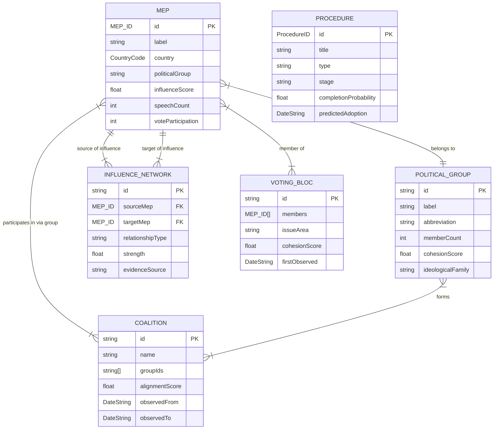
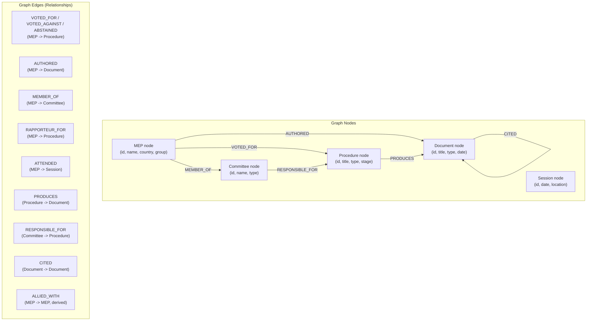
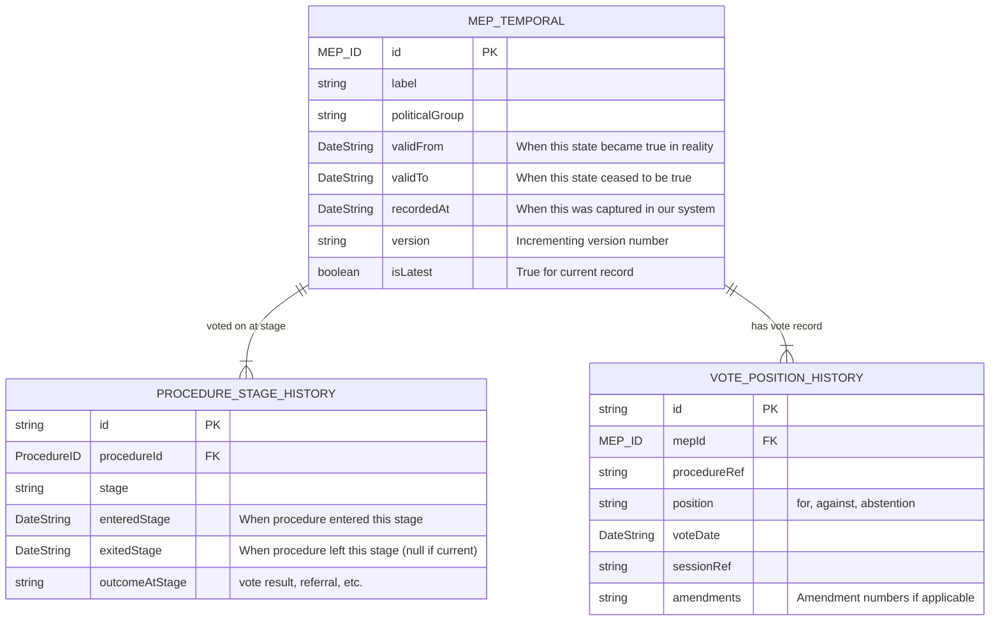
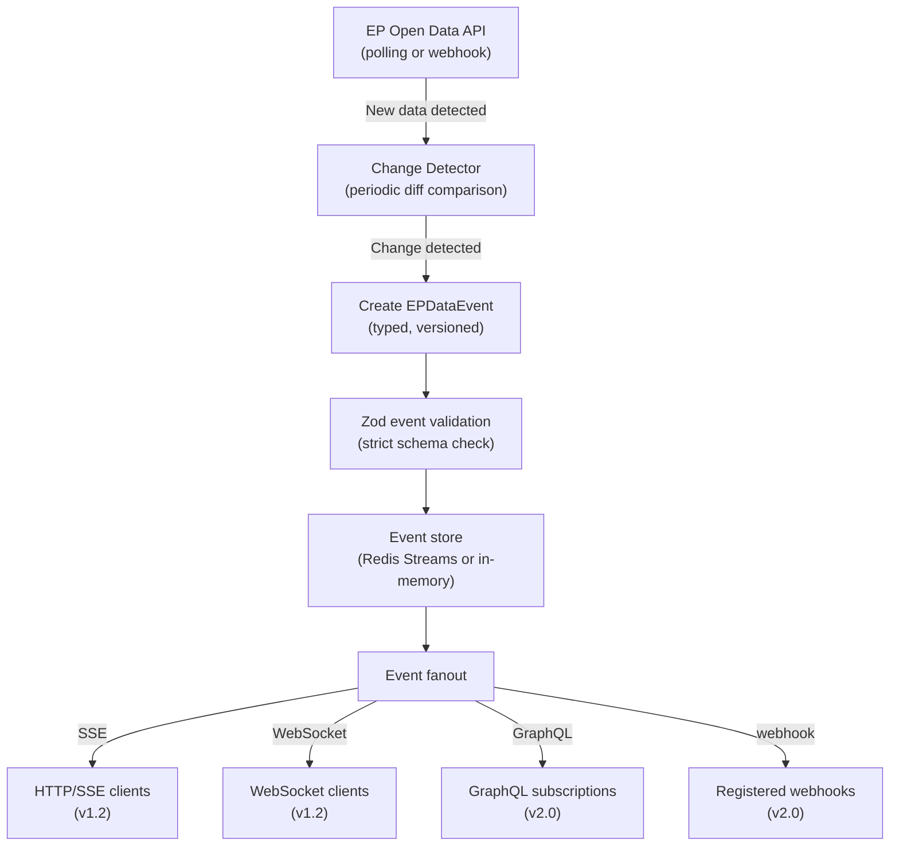
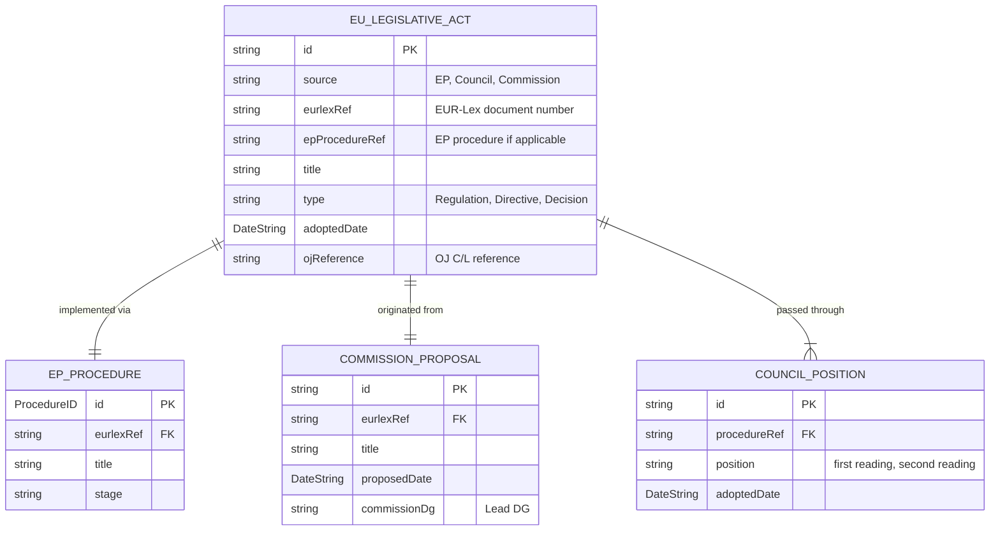

<p align="center">
  
</p>

<h1 align="center">📊 European Parliament MCP Server — Future Data Model</h1>

<p align="center">
  <strong>Enhanced Entity Relationships, Graph Support, Temporal Models, and Real-Time Streaming</strong><br>
  <em>Data architecture evolution roadmap for the EP MCP Server</em>
</p>

<p align="center">
  <a href="#"></a>
  <a href="#"></a>
  <a href="#"></a>
  <a href="#"></a>
</p>

**📋 Document Owner:** Hack23 | **📄 Version:** 1.0 | **📅 Last Updated:** 2026-02-26 (UTC)
**🔄 Review Cycle:** Quarterly | **⏰ Next Review:** 2026-05-26
**🏷️ Classification:** Public (Open Source MCP Server)
**✅ ISMS Compliance:** ISO 27001 (A.5.1, A.8.1, A.14.2), NIST CSF 2.0 (ID.AM, PR.DS), CIS Controls v8.1 (2.1, 16.1)

---

## 📑 Table of Contents

1. [Security Documentation Map](#security-documentation-map)
2. [Data Model Evolution Overview](#data-model-evolution-overview)
3. [Enhanced Entity Relationships v1.1](#enhanced-entity-relationships-v11)
4. [Graph Database Support Plan](#graph-database-support-plan)
5. [Temporal Data Models](#temporal-data-models)
6. [Real-Time Event Streaming Schema](#real-time-event-streaming-schema)
7. [EU Data Federation Schema](#eu-data-federation-schema)
8. [Enhanced Branded Types](#enhanced-branded-types)

---

## 🗺️ Security Documentation Map

| Document | Current | Future | Description |
|----------|---------|--------|-------------|
| **Architecture** | [ARCHITECTURE.md](./ARCHITECTURE.md) | [FUTURE_ARCHITECTURE.md](./FUTURE_ARCHITECTURE.md) | C4 model, containers, components, ADRs |
| **Security Architecture** | [SECURITY_ARCHITECTURE.md](./SECURITY_ARCHITECTURE.md) | [FUTURE_SECURITY_ARCHITECTURE.md](./FUTURE_SECURITY_ARCHITECTURE.md) | Security controls, threat model |
| **Data Model** | [DATA_MODEL.md](./DATA_MODEL.md) | [FUTURE_DATA_MODEL.md](./FUTURE_DATA_MODEL.md) | Entity relationships, branded types |
| **Flowchart** | [FLOWCHART.md](./FLOWCHART.md) | [FUTURE_FLOWCHART.md](./FUTURE_FLOWCHART.md) | Business process flows |
| **State Diagram** | [STATEDIAGRAM.md](./STATEDIAGRAM.md) | [FUTURE_STATEDIAGRAM.md](./FUTURE_STATEDIAGRAM.md) | System state transitions |
| **Mind Map** | [MINDMAP.md](./MINDMAP.md) | [FUTURE_MINDMAP.md](./FUTURE_MINDMAP.md) | System concepts and relationships |
| **SWOT Analysis** | [SWOT.md](./SWOT.md) | [FUTURE_SWOT.md](./FUTURE_SWOT.md) | Strategic positioning |

---

## 🗓️ Data Model Evolution Overview

| Version | Key Data Model Changes | Target |
|---------|----------------------|--------|
| v1.0 | Current: 9 entities, LRU cache, JSON-LD normalization | Live |
| v1.1 | +5 entities, Redis persistence, enhanced relationships | Q2 2026 |
| v1.2 | Cross-source data federation, EUR-Lex entities | Q3 2026 |
| v2.0 | Graph model, temporal versioning, event streaming | Q4 2026 |

---

## 🔗 Enhanced Entity Relationships v1.1

The v1.1 data model adds cross-entity relationships for OSINT intelligence analysis:



---

## 🕸️ Graph Database Support Plan

### Target Version: v2.0

Parliamentary data is inherently graph-structured — MEPs form coalitions, procedures flow through institutions, documents reference other documents. A graph model captures these relationships natively.

### Graph Schema Design



### Graph Query Examples (Planned Cypher/GQL)

```cypher
-- Find MEPs who consistently vote with MEP X (coalition detection)
MATCH (mep1:MEP {id: $mepId})-[:VOTED_FOR]->(proc:Procedure)
      <-[:VOTED_FOR]-(mep2:MEP)
WHERE mep1 <> mep2
WITH mep2, count(proc) AS sharedVotes
ORDER BY sharedVotes DESC
LIMIT 20
RETURN mep2.label, sharedVotes

-- Find shortest path between two political groups through procedures
MATCH path = shortestPath(
  (g1:Group {abbr: 'EPP'})-[*]-(g2:Group {abbr: 'SD'})
)
RETURN path
```

---

## ⏱️ Temporal Data Models

### Bi-Temporal Entity Design (v2.0)

Parliamentary data changes over time — MEPs change parties, procedures change stages, votes are recorded at specific moments. Bi-temporal modeling captures both when data was valid and when it was recorded.



### Temporal Query Patterns

```typescript
// Query MEP's party at a specific historical date
interface TemporalQuery<T> {
  entityId: string;
  asOf: DateString;       // Retrieve state valid on this date
  recordedBefore?: DateString;  // Filter to records captured before this time
}

// Get MEP's political group as of 2022-01-01
const query: TemporalQuery<MEP> = {
  entityId: 'mep:12345',
  asOf: '2022-01-01' as DateString
};
```

---

## 📡 Real-Time Event Streaming Schema

### Target Version: v1.2 / v2.0

When the EP publishes new data (new votes, new procedures, new documents), the server should be able to notify subscribed clients in real-time.

### Event Schema

```typescript
interface EPDataEvent {
  eventId: string;
  eventType: EPEventType;
  timestamp: string;         // ISO 8601
  source: 'ep-api-v2';
  entityType: 'mep' | 'procedure' | 'vote' | 'document' | 'session';
  entityId: string;
  changeType: 'created' | 'updated' | 'deleted';
  payload: unknown;          // Entity snapshot
  metadata: {
    apiVersion: string;
    dataVersion: string;
    checksum: string;
  };
}

type EPEventType =
  | 'vote.published'
  | 'procedure.stage_changed'
  | 'procedure.adopted'
  | 'document.published'
  | 'session.scheduled'
  | 'session.completed'
  | 'mep.group_changed'
  | 'mep.term_started'
  | 'mep.term_ended';
```

### Event Stream Architecture



---

## 🌐 EU Data Federation Schema (v2.0)

When the server integrates with additional EU institution data sources, a unified cross-source entity model is needed:



---

## 🏷️ Enhanced Branded Types (v1.1+)

Additional branded types planned for v1.1 to cover emerging EP API entities:

```typescript
// EUR-Lex document identifier
const EURLexRefSchema = z
  .string()
  .regex(/^(COM|SEC|SWD|JOIN|C|L)\(\d{4}\)\d+$/)
  .brand<'EURLexRef'>();

// EP Term number (1979 = Term 1, 2024 = Term 10)
const TermNumberSchema = z
  .number()
  .int()
  .min(1)
  .max(20)
  .brand<'TermNumber'>();

// Session identifier (YYYYMMDD format)
const SessionIDSchema = z
  .string()
  .regex(/^\d{8}$/)
  .brand<'SessionID'>();

// Amendment number
const AmendmentNumberSchema = z
  .number()
  .int()
  .positive()
  .brand<'AmendmentNumber'>();

// Vote result
const VoteResultSchema = z
  .enum(['adopted', 'rejected', 'lapsed', 'withdrawn'])
  .brand<'VoteResult'>();
```

---

*See [DATA_MODEL.md](./DATA_MODEL.md) for the current implemented data model.*
