  

<h1 align="center">📊 European Parliament MCP Server — Future Data Model</h1>

  <strong>🏗️ Enhanced Data Architecture Plans</strong> 
  <em>📈 Evolving Parliamentary Data Structures for Enterprise Integration</em>

  
  
  
  

**📋 Document Owner:** CEO | **📄 Version:** 1.0 | **📅 Last Updated:** 2026-02-20 (UTC)  
**🔄 Review Cycle:** Quarterly | **⏰ Next Review:** 2026-05-20  
**🏷️ Classification:** Public (Open Source MCP Server)

---

## 📑 Table of Contents

- [Executive Summary](#-executive-summary)
- [Current Data Model Baseline](#-current-data-model-baseline)
- [Enhanced Entity Models](#-enhanced-entity-models)
- [New Data Entities](#-new-data-entities)
- [Data Relationship Enhancements](#-data-relationship-enhancements)
- [Search & Analytics Models](#-search--analytics-models)
- [Data Privacy Enhancements](#️-data-privacy-enhancements)
- [Policy Alignment](#-policy-alignment)
- [Related Documents](#-related-documents)

---

## 🎯 Executive Summary

This document outlines the future data model evolution for the European Parliament MCP Server, expanding from the current entity set to support richer parliamentary data, analytics, and multi-parliament integration.

**Key Objectives:**
- 📊 Enrich existing entity models with additional fields
- 🔄 Add new entities (amendments, debates, delegations)
- 🔍 Support advanced search and analytics queries
- 🛡️ GDPR-compliant data handling patterns

---

## 📊 Current Data Model Baseline

Current data model is documented in [DATA_MODEL.md](DATA_MODEL.md).

**Current Entities:**

| Entity | Tool | Fields |
|--------|------|--------|
| MEP | `get_meps` | id, name, country, politicalGroup, committees |
| Plenary Session | `get_plenary_sessions` | id, date, title, location, agenda |
| Voting Record | `get_voting_records` | id, date, subject, for, against, abstain |
| Committee | `get_committee_info` | id, name, type, members |
| Document | `search_documents` | id, title, type, date, reference |
| Parliamentary Question | `get_parliamentary_questions` | id, title, author, date, subject |

---

## 🚀 Enhanced Entity Models

### **👤 Enhanced MEP Profile**

| Field | Type | Status | Purpose |
|-------|------|--------|---------|
| socialMedia | object | 📋 Planned | Twitter, Facebook, website links |
| assistants | array | 📋 Planned | Accredited assistants |
| financialDeclarations | array | 📋 Planned | Transparency declarations |
| votingStatistics | object | 📋 Planned | Aggregated voting patterns |
| speeches | array | 📋 Planned | Plenary speech references |
| biography | string | 📋 Planned | Extended biography |

### **🗳️ Enhanced Voting Record**

| Field | Type | Status | Purpose |
|-------|------|--------|---------|
| rollCallDetails | array | 📋 Planned | Individual MEP votes per roll call |
| explanationOfVote | string | 📋 Planned | MEP voting explanations |
| legislativeContext | object | 📋 Planned | Linked legislative procedure |
| groupCohesion | number | 📋 Planned | Political group agreement rate |
| amendments | array | 📋 Planned | Related amendments voted on |

---

## 🔄 New Data Entities

### **📝 Amendment**

| Field | Type | Description |
|-------|------|-------------|
| id | string | Unique amendment identifier |
| documentRef | string | Parent document reference |
| author | string | MEP or committee author |
| text | string | Amendment text |
| status | enum | tabled, adopted, rejected, withdrawn |
| votes | object | For, against, abstain counts |

### **🎤 Debate / Speech**

| Field | Type | Description |
|-------|------|-------------|
| id | string | Unique debate identifier |
| sessionId | string | Plenary session reference |
| speaker | string | MEP identifier |
| topic | string | Debate topic |
| language | string | Original language |
| duration | number | Speech duration in seconds |

### **🌍 Delegation**

| Field | Type | Description |
|-------|------|-------------|
| id | string | Delegation identifier |
| name | string | Delegation name |
| type | enum | inter-parliamentary, ACP, joint |
| members | array | Member MEP references |
| mandate | string | Delegation mandate description |

---

## 📦 Data Relationship Enhancements

---

## 🔍 Search & Analytics Models

### **📊 Analytics Capabilities**

| Capability | Description | Data Required |
|-----------|-------------|---------------|
| **Voting Pattern Analysis** | Group cohesion, cross-party alliances | Votes, MEPs, Groups |
| **MEP Activity Scoring** | Attendance, speeches, questions filed | Sessions, Speeches, Questions |
| **Legislative Tracking** | Procedure progress and timeline | Procedures, Documents, Votes |
| **Political Group Analysis** | Group alignment and fragmentation | Votes, Groups, MEPs |
| **Country Representation** | National delegation analysis | MEPs, Votes, Countries |

### **🔍 Future Search Enhancements (Serverless AWS)**

```mermaid
graph LR
    subgraph "🔍 Search Layer (OpenSearch Serverless)"
        FT[Full-Text Search]
        FAC[Faceted Filtering]
        SEM[Semantic Search]
    end
    subgraph "📊 Analytics Layer (Lambda + Step Functions)"
        AGG[Aggregation Pipelines]
        TREND[Trend Analysis]
        COMP[Comparative Analysis]
    end
    subgraph "📦 Data Layer (DynamoDB + S3)"
        IDX[OpenSearch Indices]
        CACHE[DynamoDB Score Cache]
        RAW[S3 Raw Data Archive]
    end

    FT & FAC & SEM --> AGG & TREND & COMP --> IDX & CACHE & RAW
```

> **☁️ AWS Strategy:** All search and analytics run on **serverless AWS** — OpenSearch Serverless for full-text search, DynamoDB for pre-computed scores and cache, S3 for raw data archive, Lambda for aggregation pipelines. See [FUTURE_ARCHITECTURE.md](FUTURE_ARCHITECTURE.md) for full serverless AWS strategy.

---

## 🛡️ Data Privacy Enhancements

### **📋 GDPR Field Classification**

| Data Category | Classification | Handling | Retention |
|--------------|---------------|----------|-----------|
| MEP Names | Public (official role) | Direct access | Indefinite |
| MEP Contact Info | Public (official) | HTTPS only | Cache TTL |
| Voting Records | Public (parliamentary) | Direct access | Indefinite |
| Financial Declarations | Public (transparency) | HTTPS only | Cache TTL |
| Session Transcripts | Public (parliamentary) | Direct access | Indefinite |

All European Parliament data is publicly available under parliamentary transparency requirements. No private personal data is processed.

---

## 🔗 Policy Alignment

| ISMS Policy | Relevance | Link |
|-------------|-----------|------|
| 🔒 Secure Development | Data model security patterns | [Secure_Development_Policy.md](https://github.com/Hack23/ISMS-PUBLIC/blob/main/Secure_Development_Policy.md) |
| 🏷️ Classification | Data classification framework | [CLASSIFICATION.md](https://github.com/Hack23/ISMS-PUBLIC/blob/main/CLASSIFICATION.md) |
| 🌐 Open Source Policy | Public data governance | [Open_Source_Policy.md](https://github.com/Hack23/ISMS-PUBLIC/blob/main/Open_Source_Policy.md) |

---

## 📚 Related Documents

| Document | Description | Link |
|----------|-------------|------|
| 📊 Data Model (Current) | Current data structures | [DATA_MODEL.md](DATA_MODEL.md) |
| 🚀 Future Architecture | Architecture roadmap | [FUTURE_ARCHITECTURE.md](FUTURE_ARCHITECTURE.md) |
| 🏛️ Architecture | System overview | [ARCHITECTURE.md](ARCHITECTURE.md) |
| 🛡️ Security Architecture | Security controls | [SECURITY_ARCHITECTURE.md](SECURITY_ARCHITECTURE.md) |

---

  <em>This future data model is maintained as part of the <a href="https://github.com/Hack23/ISMS-PUBLIC">Hack23 AB ISMS</a> framework.</em> 
  <em>Licensed under <a href="LICENSE.md">Apache-2.0</a></em>

