<p align="center">
  
</p>

<h1 align="center">📊 European Parliament MCP Server — Future Data Model</h1>

<p align="center">
  <strong>🏗️ Enhanced Data Architecture Plans</strong><br>
  <em>📈 Evolving Parliamentary Data Structures for Enterprise Integration</em>
</p>

<p align="center">
  <a href="#"></a>
  <a href="#"></a>
  <a href="#"></a>
  <a href="#"></a>
</p>

**📋 Document Owner:** CEO | **📄 Version:** 2.0 | **📅 Last Updated:** 2026-02-23 (UTC)  
**🔄 Review Cycle:** Quarterly | **⏰ Next Review:** 2026-05-23  
**🏷️ Classification:** Public (Open Source MCP Server)

---

## 📑 Table of Contents

- [Executive Summary](#-executive-summary)
- [Current Data Model Baseline](#-current-data-model-baseline)
- [Enhanced Entity Models](#-enhanced-entity-models)
- [New Data Entities](#-new-data-entities)
- [Data Relationship Enhancements](#-data-relationship-enhancements)
- [Search & Analytics Models](#-search--analytics-models)
- [Data Privacy Enhancements](#️-data-privacy-enhancements)
- [🔮 Visionary Roadmap: 2027–2037](#-visionary-roadmap-20272037)
- [Policy Alignment](#-policy-alignment)
- [Related Documents](#-related-documents)

---

## 🎯 Executive Summary

This document outlines the future data model evolution for the European Parliament MCP Server, expanding from the current entity set to support richer parliamentary data, analytics, and multi-parliament integration.

**Key Objectives:**
- 📊 Enrich existing entity models with additional fields
- 🔄 Add new entities (amendments, debates, delegations)
- 🔍 Support advanced search and analytics queries
- 🛡️ GDPR-compliant data handling patterns

> **🤖 AI Evolution Context:** Data model evolution assumes progression from **Anthropic Opus 4.6** (2026) through future AI generations, with **minor updates every ~2.3 months** and **major version upgrades annually** through 2037. Data structures must accommodate increasingly sophisticated AI analysis capabilities, from structured queries to knowledge graph reasoning and eventually AGI-driven semantic understanding.

---

## 📊 Current Data Model Baseline

Current data model is documented in [DATA_MODEL.md](DATA_MODEL.md).

**Current Entities:**

#### Core Data Entities

| Entity | Tool | Fields |
|--------|------|--------|
| MEP | `get_meps` | id, name, country, politicalGroup, committees |
| Plenary Session | `get_plenary_sessions` | id, date, title, location, agenda |
| Voting Record | `get_voting_records` | id, date, subject, for, against, abstain |
| Committee | `get_committee_info` | id, name, type, members |
| Document | `search_documents` | id, title, type, date, reference |
| Parliamentary Question | `get_parliamentary_questions` | id, title, author, date, subject |

#### OSINT Intelligence Computed Entities (Phase 1 ✅)

| Entity | Tool | Fields |
|--------|------|--------|
| Influence Score | `assess_mep_influence` | mepId, overallScore, dimensions (5), confidence, trend |
| Coalition Metric | `analyze_coalition_dynamics` | groupPair, cohesionScore, stressIndicator, defectionRate |
| Voting Anomaly | `detect_voting_anomalies` | mepId, anomalyType, severity, description |
| Group Comparison | `compare_political_groups` | groupId, votingDiscipline, activityLevel, legislativeOutput |
| Legislative Effectiveness | `analyze_legislative_effectiveness` | subjectId, effectivenessScore, billsPassed, amendmentsAdopted |
| Pipeline Status | `monitor_legislative_pipeline` | procedureId, currentStage, bottleneck, forecast |

---

## 🚀 Enhanced Entity Models

### **👤 Enhanced MEP Profile**

| Field | Type | Status | Purpose |
|-------|------|--------|---------|
| socialMedia | object | 📋 Planned | Twitter, Facebook, website links |
| assistants | array | 📋 Planned | Accredited assistants |
| financialDeclarations | array | 📋 Planned | Transparency declarations |
| votingStatistics | object | 📋 Planned | Aggregated voting patterns |
| speeches | array | 📋 Planned | Plenary speech references |
| biography | string | 📋 Planned | Extended biography |

### **🗳️ Enhanced Voting Record**

| Field | Type | Status | Purpose |
|-------|------|--------|---------|
| rollCallDetails | array | 📋 Planned | Individual MEP votes per roll call |
| explanationOfVote | string | 📋 Planned | MEP voting explanations |
| legislativeContext | object | 📋 Planned | Linked legislative procedure |
| groupCohesion | number | 📋 Planned | Political group agreement rate |
| amendments | array | 📋 Planned | Related amendments voted on |

---

## 🔄 New Data Entities

### **📝 Amendment**

| Field | Type | Description |
|-------|------|-------------|
| id | string | Unique amendment identifier |
| documentRef | string | Parent document reference |
| author | string | MEP or committee author |
| text | string | Amendment text |
| status | enum | tabled, adopted, rejected, withdrawn |
| votes | object | For, against, abstain counts |

### **🎤 Debate / Speech**

| Field | Type | Description |
|-------|------|-------------|
| id | string | Unique debate identifier |
| sessionId | string | Plenary session reference |
| speaker | string | MEP identifier |
| topic | string | Debate topic |
| language | string | Original language |
| duration | number | Speech duration in seconds |

### **🌍 Delegation**

| Field | Type | Description |
|-------|------|-------------|
| id | string | Delegation identifier |
| name | string | Delegation name |
| type | enum | inter-parliamentary, ACP, joint |
| members | array | Member MEP references |
| mandate | string | Delegation mandate description |

---

## 📦 Data Relationship Enhancements


---

## 🔍 Search & Analytics Models

### **📊 Analytics Capabilities**

| Capability | Description | Data Required |
|-----------|-------------|---------------|
| **Voting Pattern Analysis** | Group cohesion, cross-party alliances | Votes, MEPs, Groups |
| **MEP Activity Scoring** | Attendance, speeches, questions filed | Sessions, Speeches, Questions |
| **Legislative Tracking** | Procedure progress and timeline | Procedures, Documents, Votes |
| **Political Group Analysis** | Group alignment and fragmentation | Votes, Groups, MEPs |
| **Country Representation** | National delegation analysis | MEPs, Votes, Countries |

### **🔍 Future Search Enhancements (Serverless AWS)**

```mermaid
graph LR
    subgraph "🔍 Search Layer (OpenSearch Serverless)"
        FT[Full-Text Search]
        FAC[Faceted Filtering]
        SEM[Semantic Search]
    end
    subgraph "📊 Analytics Layer (Lambda + Step Functions)"
        AGG[Aggregation Pipelines]
        TREND[Trend Analysis]
        COMP[Comparative Analysis]
    end
    subgraph "📦 Data Layer (DynamoDB + S3)"
        IDX[OpenSearch Indices]
        CACHE[DynamoDB Score Cache]
        RAW[S3 Raw Data Archive]
    end

    FT & FAC & SEM --> AGG & TREND & COMP --> IDX & CACHE & RAW
```



> **☁️ AWS Strategy:** All search and analytics run on **serverless AWS** — OpenSearch Serverless for full-text search, DynamoDB for pre-computed scores and cache, S3 for raw data archive, Lambda for aggregation pipelines. See [FUTURE_ARCHITECTURE.md](FUTURE_ARCHITECTURE.md) for full serverless AWS strategy.

---

## 🔮 Visionary Data Model Advancements

### **🌐 Political Network Graph Model**

Future network analysis will require a graph-based data model for MEP relationship mapping:


### **🎯 Political Risk Assessment Model**

| Field | Type | Description |
|-------|------|-------------|
| assessmentId | string | Unique risk assessment identifier |
| period | string | Assessment time window |
| overallRiskLevel | enum | low, medium, high, critical |
| dimensions | object | Multi-dimensional risk breakdown |
| dimensions.legislativeGridlock | number | Bill passage rate and procedure duration |
| dimensions.coalitionFragmentation | number | Cohesion decline and defection rate |
| dimensions.policyInstability | number | Position reversals and committee conflicts |
| dimensions.proceduralAnomalies | number | Rule suspensions and session irregularities |
| dimensions.externalPressure | number | Crisis topic debate intensity |
| confidence | number | 0-1 confidence level |
| mitigationSuggestions | string[] | Recommended actions |

### **📊 Intelligence Briefing Model**

```typescript
interface IntelligenceBriefing {
  briefingId: string;
  generatedAt: string;             // ISO 8601
  period: string;                  // Analysis window
  classification: 'ROUTINE' | 'PRIORITY' | 'URGENT';
  
  executiveSummary: string;
  
  sections: {
    keyDevelopments: Development[];
    riskAssessment: RiskSummary;
    coalitionStatus: CoalitionSummary;
    legislativeProgress: PipelineSummary;
    anomaliesDetected: AnomalySummary[];
    outlook: string;
  };
  
  confidence: number;              // 0-1 overall confidence
  dataSources: string[];           // EP API endpoints used
  methodology: string;             // Analytical methodology applied
}
```

### **📈 Time-Series Intelligence Model**

Future analytics will require time-series storage for trend detection:

| Table | Partition Key | Sort Key | Purpose |
|-------|--------------|----------|---------|
| `ep-influence-history` | `mep_id` | `timestamp` | MEP influence score evolution |
| `ep-cohesion-history` | `group_pair` | `timestamp` | Coalition cohesion trends |
| `ep-anomaly-history` | `entity_id` | `detected_at` | Historical anomaly timeline |
| `ep-pipeline-history` | `procedure_id` | `snapshot_at` | Legislative progress snapshots |
| `ep-risk-history` | `assessment_type` | `timestamp` | Political risk time series |

### **🌍 Multi-Parliament Data Federation**

| Parliament | Entity Prefix | Adapter | Status |
|-----------|--------------|---------|--------|
| 🇪🇺 European Parliament | `EP::` | `ep-adapter` | ✅ Active |
| 🇸🇪 Swedish Riksdag | `SE::` | `riksdag-adapter` | 📋 Planned |
| 🇬🇧 UK Parliament | `UK::` | `uk-adapter` | 📋 Planned |
| 🇩🇪 German Bundestag | `DE::` | `bundestag-adapter` | 📋 Planned |
| 🇫🇷 French Assemblée | `FR::` | `assemblee-adapter` | 🔮 Vision |

Cross-parliament analysis will require a **unified entity schema** that normalizes:
- Member identifiers across parliaments
- Voting record formats
- Legislative procedure stages
- Committee structures and mappings

---

## 🛡️ Data Privacy Enhancements

### **📋 GDPR Field Classification**

| Data Category | Classification | Handling | Retention |
|--------------|---------------|----------|-----------|
| MEP Names | Public (official role) | Direct access | Indefinite |
| MEP Contact Info | Public (official) | HTTPS only | Cache TTL |
| Voting Records | Public (parliamentary) | Direct access | Indefinite |
| Financial Declarations | Public (transparency) | HTTPS only | Cache TTL |
| Session Transcripts | Public (parliamentary) | Direct access | Indefinite |

All European Parliament data is publicly available under parliamentary transparency requirements. No private personal data is processed.

---

## 🔄 Data Migration Strategy

### **Migration Approach**

Migrating from in-memory data structures to **serverless AWS DynamoDB + S3** architecture requires careful planning to ensure zero downtime and data integrity.

```mermaid
flowchart TB
    START([🚀 Migration Start]) --> ASSESS[📊 Assess Current Data]
    ASSESS --> DESIGN[🏗️ Design DynamoDB Schema]
    DESIGN --> PARALLEL{Parallel Migration?}
    
    PARALLEL -->|Yes| DUAL[🔄 Dual Write Mode]
    DUAL --> VERIFY[✅ Verify Data Consistency]
    VERIFY --> CUTOVER[🔀 Traffic Cutover]
    CUTOVER --> MONITOR[📊 Monitor Performance]
    
    PARALLEL -->|No| EXPORT[📤 Export Current Data]
    EXPORT --> TRANSFORM[🔄 Transform to DynamoDB Format]
    TRANSFORM --> IMPORT[📥 Bulk Import to DynamoDB]
    IMPORT --> VALIDATE[✅ Validate Import]
    VALIDATE --> SWITCH[🔀 Switch to DynamoDB]
    SWITCH --> MONITOR
    
    MONITOR --> ROLLBACK{Issues Detected?}
    ROLLBACK -->|Yes| REVERT[⏮️ Rollback to In-Memory]
    ROLLBACK -->|No| COMPLETE[✅ Migration Complete]
    REVERT --> ANALYZE[🔍 Analyze Issues]
    ANALYZE --> DESIGN
    COMPLETE --> END([🎉 Production on DynamoDB])
```



### **Migration Phases**

| Phase | Duration | Activities | Success Criteria |
|-------|----------|-----------|------------------|
| **Phase 1: Schema Design** | 2 weeks | DynamoDB table design, partition/sort key selection, GSI planning | Schema review approved |
| **Phase 2: Dual Write** | 3 weeks | Implement dual-write logic, write to both in-memory + DynamoDB | 100% write consistency |
| **Phase 3: Data Sync** | 1 week | Backfill historical data, validate checksums | Zero data discrepancies |
| **Phase 4: Read Cutover** | 2 weeks | Gradually shift reads to DynamoDB (10%→50%→100%) | <200ms p95 latency |
| **Phase 5: Cleanup** | 1 week | Remove dual-write code, decommission in-memory cache | Code simplified |

**Total Migration Timeline:** 9 weeks

---

## 🗄️ DynamoDB Data Model Design

### **Table Structure**

**Primary Table: `ep-mcp-data`**

| Attribute | Type | Purpose |
|-----------|------|----------|
| **PK** (Partition Key) | String | Entity type + ID (e.g., `MEP#123`, `VOTE#456`) |
| **SK** (Sort Key) | String | Version timestamp or related entity (e.g., `v#2026-02-20`, `COMMITTEE#789`) |
| **EntityType** | String | `MEP`, `VOTE`, `SESSION`, `DOCUMENT`, etc. |
| **Data** | Map | Full entity JSON |
| **TTL** | Number | Expiration timestamp (Unix epoch) for cache eviction |
| **GSI1PK** | String | Secondary access pattern (e.g., `COUNTRY#FR`) |
| **GSI1SK** | String | Secondary sort key (e.g., `NAME#SURNAME`) |

**GSI1 (Global Secondary Index):** Enables queries by country, political group, committee

**Example Records:**

```json
{
  "PK": "MEP#197846",
  "SK": "v#2026-02-20T10:30:00Z",
  "EntityType": "MEP",
  "Data": {
    "id": "197846",
    "name": "Jane Doe",
    "country": "FR",
    "politicalGroup": "EPP",
    "committees": ["ENVI", "ITRE"]
  },
  "TTL": 1740211200,
  "GSI1PK": "COUNTRY#FR",
  "GSI1SK": "MEP#DOE"
}
```

### **Access Patterns**

| Query | Primary/GSI | Key Condition |
|-------|-------------|---------------|
| Get MEP by ID | Primary | `PK = MEP#123` |
| Get all MEPs from France | GSI1 | `GSI1PK = COUNTRY#FR` |
| Get voting record | Primary | `PK = VOTE#456` |
| Get all votes by MEP | Primary | `PK = MEP#123, SK begins_with VOTE#` |
| Get all EPP group members | GSI1 | `GSI1PK = GROUP#EPP` |

---

## 🔄 GDPR Data Lifecycle


### **GDPR Compliance Table**

| GDPR Article | Requirement | Implementation |
|--------------|-------------|----------------|
| Art. 6(1)(e) | Lawful basis (public task) | European Parliament data is public parliamentary information |
| Art. 5(1)(b) | Purpose limitation | Data used solely for parliamentary transparency |
| Art. 5(1)(c) | Data minimization | Only public parliamentary data collected |
| Art. 5(1)(e) | Storage limitation | 7-year retention policy, automatic deletion |
| Art. 15 | Right to access | All data publicly accessible via EP portal |
| Art. 17 | Right to erasure | Not applicable (public parliamentary records) |
| Art. 25 | Data protection by design | Privacy by default, no tracking, HTTPS-only |

---

## 📋 Validation Schema Evolution

### **Schema Version History**

| Version | Date | Changes | Breaking? |
|---------|------|---------|----------|
| v1.0 | 2024-12-01 | Initial MEP, VOTE, SESSION schemas | N/A |
| v1.1 | 2025-03-15 | Added `socialMedia` field to MEP | ❌ No |
| v1.2 | 2025-06-01 | Added `rollCallDetails` to VOTE | ❌ No |
| v2.0 | 2026-01-15 | Renamed `politicalGroup` to `group` (deprecated old field) | ⚠️ Yes |
| v2.1 | 2026-09-01 | Added AMENDMENT, SPEECH entities | ❌ No |

### **Backward Compatibility Strategy**

**Approach:** Dual-field deprecation with 6-month sunset period

```typescript
// v2.0: Deprecated field with migration warning
const MEPSchema = z.object({
  id: z.string(),
  name: z.string(),
  politicalGroup: z.string().optional().describe('DEPRECATED: Use group instead'),
  group: z.string().optional(),
  // ... other fields
})
  // Ensure at least one of `group` or `politicalGroup` is provided.
  .refine(
    (data) => Boolean(data.group || data.politicalGroup),
    {
      message: 'Either group or politicalGroup must be provided',
      path: ['group'],
    }
  )
  .transform(data => {
    // Auto-migrate old field to new field when only the deprecated field is present.
    // If both fields exist, `group` takes precedence and `politicalGroup` is ignored.
    if (data.politicalGroup && !data.group) {
      data.group = data.politicalGroup;
    }
    return data;
  });
```

---

## 📊 Implementation Phases

### **Phase 1: DynamoDB Foundation** (Q3 2026)

**Objectives:**
- Design and deploy DynamoDB tables with proper partition/sort keys
- Implement dual-write mode (in-memory + DynamoDB)
- Achieve 100% write consistency

**Success Metrics:**
- ✅ DynamoDB tables deployed in `us-east-1` and `eu-west-1`
- ✅ 100% write success rate to both datastores
- ✅ <50ms p95 write latency to DynamoDB
- ✅ Zero data loss during dual-write period

**KPIs:**
- Write consistency rate: 100%
- DynamoDB write latency p95: <50ms
- Data integrity checks passed: 100%

---

### **Phase 2: Read Cutover** (Q4 2026)

**Objectives:**
- Gradually shift read traffic from in-memory to DynamoDB
- Implement DynamoDB query optimization (GSI usage)
- Monitor performance and error rates

**Success Metrics:**
- ✅ 10% → 50% → 100% read traffic migrated
- ✅ <200ms p95 read latency from DynamoDB
- ✅ Zero data discrepancies between datastores
- ✅ 99.9% read success rate

**KPIs:**
- Read latency p95: <200ms (target <150ms)
- Cache hit rate: >80%
- Error rate: <0.1%

---

### **Phase 3: S3 Archival** (Q1 2027)

**Objectives:**
- Implement S3 cold storage for historical data
- Configure lifecycle policies (Glacier Deep Archive after 90 days)
- Enable cross-region replication for compliance

**Success Metrics:**
- ✅ S3 bucket with versioning and MFA delete enabled
- ✅ Lifecycle policy: Standard → Glacier → Deep Archive → Delete (7 years)
- ✅ Cross-region replication to EU backup region
- ✅ Data restoration test completed successfully

**KPIs:**
- Storage cost reduction: 70% (vs. DynamoDB hot storage)
- Data durability: 99.999999999% (11 nines)
- Restoration time: <12 hours (Glacier Deep Archive)

---

## ⚠️ Risk Assessment

### **Data Migration Risks**

| Risk | Severity | Probability | Impact | Mitigation |
|------|----------|-------------|--------|------------|
| **Data loss during migration** | 🔴 Critical | 🟡 Low | Production outage, data integrity issues | Dual-write mode, continuous validation, rollback plan |
| **Performance degradation** | 🟠 High | 🟠 Medium | Slow response times, user dissatisfaction | Load testing, DynamoDB auto-scaling, caching |
| **Schema incompatibility** | 🟡 Medium | 🟡 Low | Tool failures, parsing errors | Schema versioning, backward compatibility tests |
| **Cost overrun** | 🟡 Medium | 🟠 Medium | Budget exceeded | DynamoDB on-demand mode initially, monitor costs |
| **Compliance violation** | 🟠 High | 🟢 Very Low | GDPR/ISO 27001 non-compliance | Legal review, GDPR compliance checklist |

### **Risk Mitigation Timeline**

| Risk | Mitigation Action | Owner | Deadline |
|------|-------------------|-------|----------|
| Data loss | Implement dual-write + checksums | Engineering | Before Phase 2 |
| Performance | Load test with 10x expected traffic | DevOps | Before Phase 2 cutover |
| Schema issues | Implement schema versioning + tests | Engineering | Before Phase 1 |
| Cost overrun | Set CloudWatch billing alarms | FinOps | Week 1 of Phase 1 |
| Compliance | Complete GDPR impact assessment | Legal + CISO | Before Phase 1 |

---

## 🔗 ISO 27001 Controls Mapping

| Control | Description | Implementation |
|---------|-------------|----------------|
| **A.8.1.1** | Inventory of assets | DynamoDB tables and S3 buckets documented in Asset Register |
| **A.8.1.2** | Ownership of assets | Data Owner: CEO; Data Custodian: Engineering Team |
| **A.8.1.3** | Acceptable use of assets | All data classified as Public per Classification Framework |
| **A.8.2.1** | Classification of information | All EP data classified as Public (no PII processing) |
| **A.8.2.2** | Labelling of information | EntityType field indicates data category |
| **A.8.2.3** | Handling of assets | Public data, HTTPS-only transport, CloudTrail audit logging |
| **A.18.1.3** | Protection of records | 7-year retention in S3 Glacier, cross-region replication |
| **A.18.1.4** | Privacy and protection of PII | No PII processing; parliamentary data is public |

### **NIST CSF 2.0 Mapping**

| Function | Category | Implementation |
|----------|----------|----------------|
| **ID.AM-1** | Physical devices and systems inventoried | DynamoDB, S3, Lambda documented in CMDB |
| **ID.AM-2** | Software platforms inventoried | Node.js 24, TypeScript 5, AWS SDK v3 |
| **ID.AM-5** | Resources prioritized by classification | Public data, medium integrity, high availability |
| **PR.DS-1** | Data at rest protected | DynamoDB encryption with KMS, S3 SSE-KMS |
| **PR.DS-2** | Data in transit protected | TLS 1.3 for all connections |
| **PR.DS-5** | Protections against data leaks | No sensitive data processed; CloudTrail monitoring |

### **CIS Controls v8.1 Mapping**

| Control | Safeguard | Implementation |
|---------|-----------|----------------|
| **1.1** | Establish and maintain asset inventory | DynamoDB tables, S3 buckets in Asset Register |
| **3.3** | Configure data access control lists | IAM policies restrict DynamoDB/S3 access to authorized Lambda functions |
| **3.11** | Encrypt sensitive data at rest | All DynamoDB tables use KMS encryption |
| **11.1** | Establish and maintain data recovery processes | Daily DynamoDB backups to S3 with cross-region replication |
| **11.3** | Protect recovery data | S3 versioning, MFA delete, Vault Lock for immutability |

---

## 🔮 Visionary Roadmap: 2027–2037

> **Data Model Evolution** — From relational parliamentary entities to federated knowledge graphs and AGI-native semantic data layers, evolving alongside AI model generations.

### 📅 Data Model Version Strategy

| Year | Version | AI Context | Data Model Milestone |
|------|---------|-----------|---------------------|
| **2026** | v1.0 | Anthropic Opus 4.6 | Foundation: MEP, Vote, Committee, Document entities with Zod validation |
| **2027** | v2.0 | Opus 5.x | Extended entities: Amendments, Debates, Delegations + DynamoDB migration |
| **2028** | v3.0 | Next-gen multimodal | Knowledge Graph: Neo4j/Neptune graph database for parliamentary relationships |
| **2029** | v4.0 | Specialized political AI | Semantic Data Layer: RDF/OWL ontologies for legislative domain modeling |
| **2030** | v5.0 | Near-AGI reasoning | Federated Data Mesh: cross-parliament entity resolution across 27 EU states |
| **2031** | v6.0 | Early AGI | Self-describing schemas: AI-generated and AI-maintained data models |
| **2032** | v7.0 | AGI-assisted | Predictive Data Structures: temporal models for legislative outcome prediction |
| **2033** | v8.0 | AGI co-development | Global Parliament Ontology: standardized schema for 50+ democratic systems |
| **2034** | v9.0 | Mature AGI | Causal Data Models: encode cause-effect relationships in policy data |
| **2035** | v10.0 | Post-AGI | Decentralized Data Sovereignty: cryptographically verifiable legislative records |
| **2036** | v11.0 | AGI-native | Universal Democracy Schema: ISO standard for democratic data interchange |
| **2037** | v12.0 | Superintelligent | Living Data Models: continuously self-optimizing schemas with AGI governance |

> **Minor updates every ~2.3 months** deliver schema extensions, new entity fields, and validation improvements.

### 🧬 Data Architecture Evolution

#### Phase 4: Knowledge Graph Era (2028–2029)

```mermaid
graph TB
    subgraph "Knowledge Graph Layer"
        KG[Parliamentary Knowledge Graph]
        ONT[Legislative Ontology - OWL/RDF]
        ER[Entity Resolution Engine]
    end
    subgraph "Multi-Parliament Federation"
        EP[EU Parliament Data]
        BT[Bundestag Data]
        RK[Riksdag Data]
        AN[Assemblée nationale Data]
        MP[More Parliaments...]
    end
    subgraph "AI Query Interface"
        NLQ[Natural Language Queries]
        SEM[Semantic Search]
        INF[Graph Inference Engine]
    end
    EP & BT & RK & AN & MP --> ER
    ER --> KG
    KG --> ONT
    ONT --> NLQ & SEM & INF
```



- **Graph database** (AWS Neptune) replacing relational models for complex parliamentary relationships
- **Entity resolution** across parliaments — matching MEPs, parties, and policies across systems
- **Multilingual entity normalization** — canonical representations across 24 EU languages
- **Temporal versioning** — full history of every entity change with point-in-time queries

#### Phase 5: Semantic Intelligence Layer (2030–2031)

- **AI-generated schemas** — LLMs analyze parliamentary data patterns and propose schema optimizations
- **Self-healing data pipelines** — automatic detection and correction of data quality issues
- **Predictive entity modeling** — ML models anticipate new legislative entities before they emerge
- **Cross-domain linking** — connect parliamentary data with economic, social, and environmental datasets

#### Phase 6: Global Democracy Data (2032–2035)

- **Universal legislative ontology** — standardized vocabulary for democratic processes worldwide
- **Real-time data streaming** — event-sourced architecture for instant data propagation
- **Causal inference models** — data structures that encode "why" not just "what" in legislative decisions
- **Privacy-preserving analytics** — differential privacy and homomorphic encryption for sensitive parliamentary data

#### Phase 7: AGI-Native Data (2036–2037)

- **Living schemas** — data models that autonomously evolve based on usage patterns and AI needs
- **Semantic embeddings** — every entity represented as high-dimensional vectors for AGI reasoning
- **Zero-schema queries** — AGI systems query data without predefined schemas or SQL
- **Verifiable data provenance** — every datum traceable to its source with cryptographic proof

### 🔄 Disruption Scenarios

| Disruption | Data Model Impact | Response Strategy |
|-----------|------------------|-------------------|
| **New parliament data standards** emerge (EU, UN) | Adopt standards as primary schema | Design for schema evolution from day one |
| **Graph databases** become dominant over relational | Neptune/Neo4j migration path already planned | Phase 4 knowledge graph transition |
| **AGI eliminates need for structured data** | Maintain structured layer for auditability | Dual-mode: structured + semantic access |
| **Data sovereignty regulations** fragment global data | Per-jurisdiction data residency controls | Federated architecture with edge deployment |
| **Quantum-safe data** requirements | Migrate hashing and encryption | Post-quantum cryptography integration |

---

## 🔗 Policy Alignment

| ISMS Policy | Relevance | Link |
|-------------|-----------|------|
| 🔒 Secure Development | Data model security patterns | [Secure_Development_Policy.md](https://github.com/Hack23/ISMS-PUBLIC/blob/main/Secure_Development_Policy.md) |
| 🏷️ Classification | Data classification framework | [CLASSIFICATION.md](https://github.com/Hack23/ISMS-PUBLIC/blob/main/CLASSIFICATION.md) |
| 🌐 Open Source Policy | Public data governance | [Open_Source_Policy.md](https://github.com/Hack23/ISMS-PUBLIC/blob/main/Open_Source_Policy.md) |

---

## 📚 Related Documents

| Document | Description | Link |
|----------|-------------|------|
| 📊 Data Model (Current) | Current data structures | [DATA_MODEL.md](DATA_MODEL.md) |
| 🚀 Future Architecture | Architecture roadmap | [FUTURE_ARCHITECTURE.md](FUTURE_ARCHITECTURE.md) |
| 🏛️ Architecture | System overview | [ARCHITECTURE.md](ARCHITECTURE.md) |
| 🛡️ Security Architecture | Security controls | [SECURITY_ARCHITECTURE.md](SECURITY_ARCHITECTURE.md) |

---

<p align="center">
  <em>This future data model is maintained as part of the <a href="https://github.com/Hack23/ISMS-PUBLIC">Hack23 AB ISMS</a> framework.</em><br>
  <em>Licensed under <a href="LICENSE.md">Apache-2.0</a></em>
</p>
