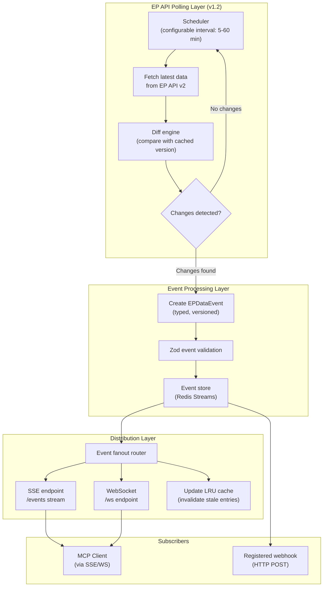
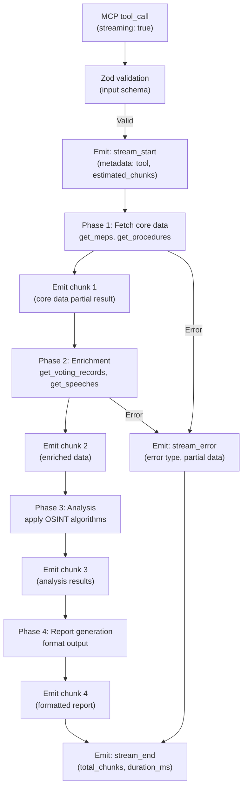
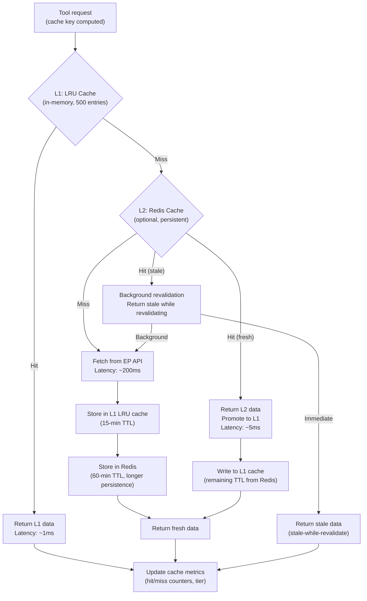
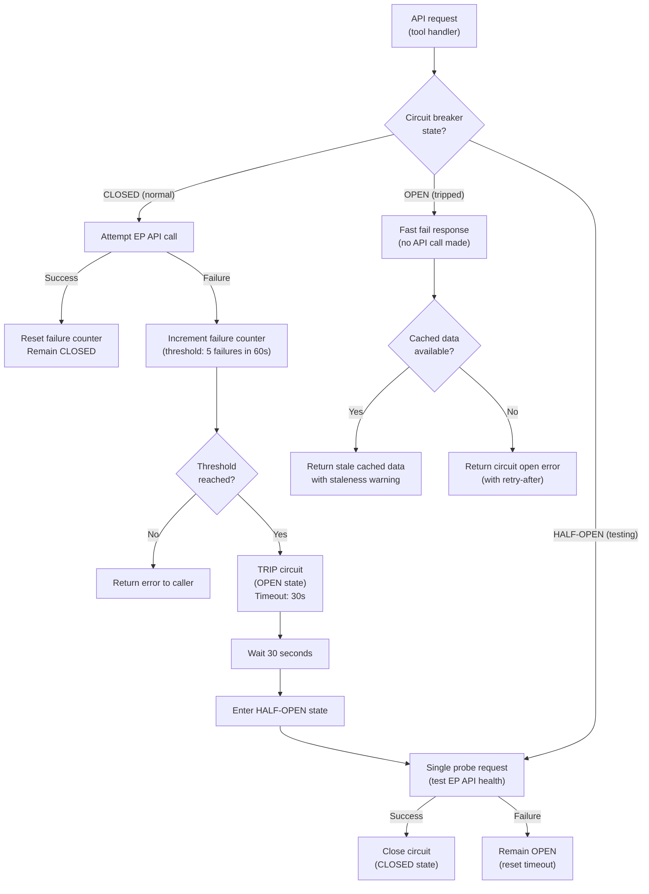
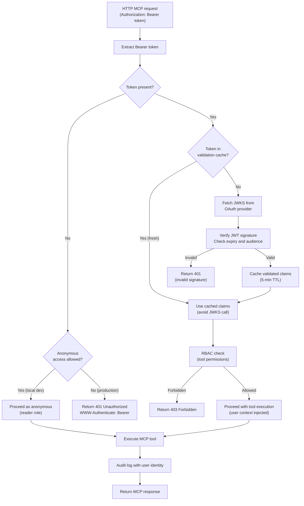

  

<h1 align="center">🔄 European Parliament MCP Server — Future Flowcharts</h1>

  <strong>Planned Workflow Improvements, Real-Time Pipelines, and Streaming Execution</strong> 
  <em>Future process flow documentation for EP MCP Server evolution</em>

  
  
  
  

**📋 Document Owner:** Hack23 | **📄 Version:** 2.0 | **📅 Last Updated:** 2026-02-26 (UTC)
**🔄 Review Cycle:** Quarterly | **⏰ Next Review:** 2026-05-26
**🏷️ Classification:** Public (Open Source MCP Server)
**✅ ISMS Compliance:** ISO 27001 (A.5.1, A.8.1, A.14.2), NIST CSF 2.0 (ID.AM, PR.DS), CIS Controls v8.1 (2.1, 16.1)

---

## 📑 Table of Contents

1. [Security Documentation Map](#security-documentation-map)
2. [Real-Time Data Pipeline Flow (v1.2)](#real-time-data-pipeline-flow-v12)
3. [Streaming Tool Execution Flow (v1.2)](#streaming-tool-execution-flow-v12)
4. [Enhanced Caching Strategy (v1.1)](#enhanced-caching-strategy-v11)
5. [Webhook Notification Flow (v2.0)](#webhook-notification-flow-v20)
6. [Circuit Breaker Flow (v1.1)](#circuit-breaker-flow-v11)
7. [OAuth Authentication Flow (v2.0)](#oauth-authentication-flow-v20)

---

## 🗺️ Security Documentation Map

| Document | Current | Future | Description |
|----------|---------|--------|-------------|
| **Architecture** | [ARCHITECTURE.md](./ARCHITECTURE.md) | [FUTURE_ARCHITECTURE.md](./FUTURE_ARCHITECTURE.md) | C4 model, containers, components, ADRs |
| **Security Architecture** | [SECURITY_ARCHITECTURE.md](./SECURITY_ARCHITECTURE.md) | [FUTURE_SECURITY_ARCHITECTURE.md](./FUTURE_SECURITY_ARCHITECTURE.md) | Security controls, threat model |
| **Data Model** | [DATA_MODEL.md](./DATA_MODEL.md) | [FUTURE_DATA_MODEL.md](./FUTURE_DATA_MODEL.md) | Entity relationships, branded types |
| **Flowchart** | [FLOWCHART.md](./FLOWCHART.md) | [FUTURE_FLOWCHART.md](./FUTURE_FLOWCHART.md) | Business process flows |
| **State Diagram** | [STATEDIAGRAM.md](./STATEDIAGRAM.md) | [FUTURE_STATEDIAGRAM.md](./FUTURE_STATEDIAGRAM.md) | System state transitions |
| **Mind Map** | [MINDMAP.md](./MINDMAP.md) | [FUTURE_MINDMAP.md](./FUTURE_MINDMAP.md) | System concepts and relationships |
| **SWOT Analysis** | [SWOT.md](./SWOT.md) | [FUTURE_SWOT.md](./FUTURE_SWOT.md) | Strategic positioning |

---

## 📡 Real-Time Data Pipeline Flow (v1.2)

Planned flow for detecting and propagating EP data changes to subscribed clients:

---

## 🌊 Streaming Tool Execution Flow (v1.2)

MCP supports streaming responses for long-running tools. v1.2 plans streaming for report generation and multi-step OSINT analysis:

### Tools That Will Support Streaming (v1.2)

| Tool | Streaming Use Case |
|------|--------------------|
| `generate_report` | Multi-section report generation |
| `analyze_voting_patterns` | Progressive pattern analysis |
| `generate_political_landscape` | Multi-dimensional landscape analysis |
| `track_legislation` | Multi-procedure timeline tracking |
| `assess_mep_influence` | Multi-metric influence calculation |

---

## 💾 Enhanced Caching Strategy (v1.1)

Two-tier caching with optional Redis persistence:

### Cache TTL Strategy (v1.1)

| Data Type | L1 TTL (LRU) | L2 TTL (Redis) | Rationale |
|-----------|-------------|----------------|-----------|
| MEP details | 15 min | 60 min | Changes infrequently |
| Vote records | 30 min | 2 hours | Historical, immutable after adoption |
| Plenary sessions | 10 min | 30 min | Schedules can change |
| Procedures | 15 min | 60 min | Stage changes daily max |
| Documents | 60 min | 6 hours | Published docs don't change |
| Vocabularies | 120 min | 24 hours | Very stable taxonomy data |

---

## 🔔 Webhook Notification Flow (v2.0)

Clients can register webhooks to receive notifications when EP data changes:

```mermaid
flowchart TD
    subgraph Registration["Webhook Registration (v2.0)"]
        REG_REQ["POST /webhooks\n(url, events[], secret)"]
        REG_VAL["Validate webhook URL\n(ping test)"]
        REG_STORE["Store webhook config\n(id, url, events, secret, active)"]
        REG_RESP["Return webhook ID"]
    end

    subgraph Delivery["Webhook Delivery"]
        EVENT_TRIGGER["EP data change event\n(EPDataEvent)"]
        MATCH["Match event type\nto registered webhooks"]
        SIGN["HMAC-SHA256 signature\n(X-EP-MCP-Signature header)"]
        DELIVER["HTTP POST to webhook URL\n(payload: EPDataEvent JSON)"]
        CHECK{"HTTP 200 response?"}
        SUCCESS["Mark delivery success\nLog in audit trail"]
        RETRY_Q["Add to retry queue\n(max 3 retries)"]
        RETRY["Retry with backoff\n(1min, 5min, 15min)"]
        FAIL["Mark delivery failed\nAlert webhook owner"]
    end

    REG_REQ --> REG_VAL
    REG_VAL --> REG_STORE
    REG_STORE --> REG_RESP

    EVENT_TRIGGER --> MATCH
    MATCH --> SIGN
    SIGN --> DELIVER
    DELIVER --> CHECK
    CHECK -->|"Yes"| SUCCESS
    CHECK -->|"No"| RETRY_Q
    RETRY_Q --> RETRY
    RETRY -->|"Success"| SUCCESS
    RETRY -->|"All failed"| FAIL
```

---

## ⚡ Circuit Breaker Flow (v1.1)

Prevents cascade failures when the EP API is degraded:

---

## 🔑 OAuth Authentication Flow (v2.0)

For HTTP transport mode with OAuth 2.0:

---

*See [FLOWCHART.md](./FLOWCHART.md) for the current implemented workflows.*
