  

<h1 align="center">🔄 European Parliament MCP Server — Future Flowchart</h1>

  <strong>🏗️ Improved Process Workflows</strong> 
  <em>📈 Optimized Data Processing and Request Handling Flows</em>

  
  
  
  

**📋 Document Owner:** CEO | **📄 Version:** 1.0 | **📅 Last Updated:** 2026-02-20 (UTC)  
**🔄 Review Cycle:** Quarterly | **⏰ Next Review:** 2026-05-20  
**🏷️ Classification:** Public (Open Source MCP Server)

---

## 📑 Table of Contents

- [Executive Summary](#-executive-summary)
- [Current Workflow Baseline](#-current-workflow-baseline)
- [Enhanced Request Processing](#-enhanced-request-processing-flow)
- [Data Pipeline Enhancement](#-data-pipeline-enhancement)
- [Tool Orchestration Flows](#-tool-orchestration-flows)
- [Security Flow Enhancements](#️-security-flow-enhancements)
- [CI/CD Pipeline Evolution](#-cicd-pipeline-evolution)
- [Policy Alignment](#-policy-alignment)
- [Related Documents](#-related-documents)

---

## 🎯 Executive Summary

This document outlines future process workflow improvements for the European Parliament MCP Server, including enhanced request processing, data pipelines, tool orchestration, and CI/CD evolution.

---

## 📊 Current Workflow Baseline

Current workflows are documented in [FLOWCHART.md](FLOWCHART.md).

**Current Flow:** AI Client → MCP Transport → Tool Handler → EP API → Response

---

## 🔄 Enhanced Request Processing Flow

```mermaid
flowchart TB
    START([🔌 MCP Request]) --> VALIDATE{✅ Validate Input}
    VALIDATE -->|Invalid| ERROR[❌ Error Response]
    VALIDATE -->|Valid| AUTH{🔒 Authenticate}
    AUTH -->|Unauthorized| DENY[🚫 Access Denied]
    AUTH -->|Authorized| RATE{⏱️ Rate Limit Check}
    RATE -->|Exceeded| THROTTLE[⏳ Throttled Response]
    RATE -->|OK| CACHE{📦 Cache Check}
    CACHE -->|Hit| CACHED[✅ Cached Response]
    CACHE -->|Miss| CIRCUIT{🔄 Circuit Breaker}
    CIRCUIT -->|Open| FALLBACK[⚠️ Fallback Response]
    CIRCUIT -->|Closed| FETCH[🌐 Fetch from EP API]
    FETCH --> TRANSFORM[🔄 Transform Response]
    TRANSFORM --> STORE[💾 Update Cache]
    STORE --> STREAM[📡 Stream Response]
    STREAM --> AUDIT[📋 Audit Log]
    AUDIT --> END([✅ Complete])
```

### **🆕 New Processing Features**

| Feature | Current | Future | Benefit |
|---------|---------|--------|---------|
| Input validation | Zod schemas | Zod + custom validators | Richer validation |
| Authentication | None (stdio) | OAuth 2.0 / API keys | Multi-user support |
| Rate limiting | Basic | Sliding window + quotas | Fair usage |
| Caching | In-memory LRU | Multi-tier (memory + disk) | Persistence |
| Circuit breaker | None | Per-endpoint breakers | Fault tolerance |
| Response delivery | Full payload | Streaming + pagination | Lower memory |
| Audit logging | stderr | Structured JSON audit trail | Compliance |

---

## 📦 Data Pipeline Enhancement

```mermaid
flowchart LR
    subgraph "📥 Ingestion"
        API[EP API] --> FETCH2[Fetcher]
        FETCH2 --> VALIDATE2[Validator]
        VALIDATE2 --> TRANSFORM2[Transformer]
    end
    subgraph "💾 Storage"
        TRANSFORM2 --> CACHE2[Memory Cache]
        TRANSFORM2 --> DISK[Disk Cache]
        TRANSFORM2 --> INDEX[Search Index]
    end
    subgraph "📤 Delivery"
        CACHE2 --> STREAM2[Streamer]
        DISK --> STREAM2
        INDEX --> SEARCH[Search Engine]
        STREAM2 --> CLIENT[MCP Client]
        SEARCH --> CLIENT
    end
```

### **📊 Pipeline Improvements**

| Stage | Enhancement | Impact |
|-------|-------------|--------|
| **Ingestion** | Parallel fetching, batch requests | 3-5x throughput |
| **Validation** | Schema versioning, migration support | Forward compatibility |
| **Storage** | Multi-tier caching, TTL management | Reduced API calls |
| **Delivery** | Streaming, compression, pagination | Lower latency |
| **Monitoring** | Pipeline metrics, health checks | Observability |

---

## 🔍 Tool Orchestration Flows

```mermaid
flowchart TB
    subgraph "🔍 Multi-Tool Workflow"
        REQ([📋 Complex Request]) --> PLAN[🧠 Query Planner]
        PLAN --> PARALLEL{Parallelizable?}
        PARALLEL -->|Yes| PAR1[Tool A] & PAR2[Tool B] & PAR3[Tool C]
        PARALLEL -->|No| SEQ1[Tool A] --> SEQ2[Tool B] --> SEQ3[Tool C]
        PAR1 & PAR2 & PAR3 --> MERGE[🔄 Merge Results]
        SEQ3 --> MERGE
        MERGE --> ENRICH[📊 Enrich & Format]
        ENRICH --> RESP([✅ Response])
    end
```

### **🔌 Orchestration Patterns**

| Pattern | Description | Use Case |
|---------|-------------|----------|
| **Fan-out** | Parallel independent tool calls | MEP data + voting + committees |
| **Pipeline** | Sequential dependent calls | Legislation tracking with amendments |
| **Scatter-gather** | Parallel calls with aggregation | Cross-parliament comparison |
| **Saga** | Long-running multi-step workflows | Comprehensive report generation |

---

## 🛡️ Security Flow Enhancements

```mermaid
flowchart TB
    subgraph "🔒 Authentication Flow"
        CLIENT2[MCP Client] --> TOKEN{Has Token?}
        TOKEN -->|No| AUTH2[🔑 Authenticate]
        AUTH2 --> ISSUE[📜 Issue Token]
        ISSUE --> CLIENT2
        TOKEN -->|Yes| VERIFY[✅ Verify Token]
        VERIFY -->|Invalid| AUTH2
        VERIFY -->|Valid| RBAC{🛡️ RBAC Check}
        RBAC -->|Denied| DENY2[🚫 Forbidden]
        RBAC -->|Allowed| PROCESS[⚙️ Process Request]
        PROCESS --> LOG[📋 Audit Log]
    end
```

---

## 📈 CI/CD Pipeline Evolution

```mermaid
flowchart LR
    subgraph "🔄 Future CI/CD"
        PUSH[📝 Push] --> LINT[ESLint]
        LINT --> TYPE[TypeCheck]
        TYPE --> UNIT[Unit Tests]
        UNIT --> SAST[CodeQL SAST]
        SAST --> SCA[Dependency Scan]
        SCA --> BUILD[Build]
        BUILD --> E2E[E2E Tests]
        E2E --> PERF[Performance Tests]
        PERF --> SBOM[Generate SBOM]
        SBOM --> ATTEST[SLSA Attestation]
        ATTEST --> PUBLISH[npm Publish]
        PUBLISH --> VERIFY[Post-Deploy Verify]
    end
```

---

## 🔗 Policy Alignment

| ISMS Policy | Relevance | Link |
|-------------|-----------|------|
| 🔒 Secure Development | Pipeline security requirements | [Secure_Development_Policy.md](https://github.com/Hack23/ISMS-PUBLIC/blob/main/Secure_Development_Policy.md) |
| 🌐 Network Security | Transport and API security | [Network_Security_Policy.md](https://github.com/Hack23/ISMS-PUBLIC/blob/main/Network_Security_Policy.md) |
| 🔑 Access Control | Authentication flow patterns | [Access_Control_Policy.md](https://github.com/Hack23/ISMS-PUBLIC/blob/main/Access_Control_Policy.md) |
| 🚨 Incident Response | Error handling and recovery | [Incident_Response_Plan.md](https://github.com/Hack23/ISMS-PUBLIC/blob/main/Incident_Response_Plan.md) |

---

## 📚 Related Documents

| Document | Description | Link |
|----------|-------------|------|
| 🔄 Flowchart (Current) | Current process workflows | [FLOWCHART.md](FLOWCHART.md) |
| 🚀 Future Architecture | Architecture roadmap | [FUTURE_ARCHITECTURE.md](FUTURE_ARCHITECTURE.md) |
| ⚙️ Workflows | CI/CD documentation | [.github/WORKFLOWS.md](.github/WORKFLOWS.md) |
| 🛡️ Security Architecture | Security controls | [SECURITY_ARCHITECTURE.md](SECURITY_ARCHITECTURE.md) |

---

  <em>This future flowchart is maintained as part of the <a href="https://github.com/Hack23/ISMS-PUBLIC">Hack23 AB ISMS</a> framework.</em> 
  <em>Licensed under <a href="LICENSE.md">Apache-2.0</a></em>

