<p align="center">
  
</p>

<h1 align="center">🔄 European Parliament MCP Server — Future Flowchart</h1>

<p align="center">
  <strong>🏗️ Improved Process Workflows</strong><br>
  <em>📈 Optimized Data Processing and Request Handling Flows</em>
</p>

<p align="center">
  <a href="#"></a>
  <a href="#"></a>
  <a href="#"></a>
  <a href="#"></a>
</p>

**📋 Document Owner:** CEO | **📄 Version:** 2.0 | **📅 Last Updated:** 2026-02-23 (UTC)  
**🔄 Review Cycle:** Quarterly | **⏰ Next Review:** 2026-05-23  
**🏷️ Classification:** Public (Open Source MCP Server)

---

## 📑 Table of Contents

- [Executive Summary](#-executive-summary)
- [Current Workflow Baseline](#-current-workflow-baseline)
- [Enhanced Request Processing](#-enhanced-request-processing-flow)
- [Data Pipeline Enhancement](#-data-pipeline-enhancement)
- [Tool Orchestration Flows](#-tool-orchestration-flows)
- [Security Flow Enhancements](#️-security-flow-enhancements)
- [CI/CD Pipeline Evolution](#-cicd-pipeline-evolution)
- [🔮 Visionary Roadmap: 2027–2037](#-visionary-roadmap-20272037)
- [Policy Alignment](#-policy-alignment)
- [Related Documents](#-related-documents)

---

## 🎯 Executive Summary

This document outlines future process workflow improvements for the European Parliament MCP Server, including enhanced request processing, data pipelines, tool orchestration, and CI/CD evolution. **All future infrastructure follows a serverless AWS-only strategy** — see [FUTURE_ARCHITECTURE.md](FUTURE_ARCHITECTURE.md).

> **🤖 AI Evolution Context:** Workflow evolution assumes progression from **Anthropic Opus 4.6** (2026) through future AI generations, with **minor updates every ~2.3 months** and **major version upgrades annually** through 2037. Process flows must accommodate increasingly autonomous AI-driven orchestration, from human-prompted tool chains to fully autonomous agent workflows.

---

## 📊 Current Workflow Baseline

Current workflows are documented in [FLOWCHART.md](FLOWCHART.md).

**Current Flow:** AI Client → MCP Transport → Tool Handler → EP API → Response

---

## 🔄 Enhanced Request Processing Flow


### **🆕 New Processing Features**

| Feature | Current | Future | Benefit |
|---------|---------|--------|---------|
| Input validation | Zod schemas | Zod + custom validators | Richer validation |
| Authentication | None (stdio) | OAuth 2.0 / API keys | Multi-user support |
| Rate limiting | Basic | Sliding window + quotas | Fair usage |
| Caching | In-memory LRU | Multi-tier (memory + disk) | Persistence |
| Circuit breaker | None | Per-endpoint breakers | Fault tolerance |
| Response delivery | Full payload | Streaming + pagination | Lower memory |
| Audit logging | stderr | Structured JSON audit trail | Compliance |

---

## 📦 Data Pipeline Enhancement

```mermaid
flowchart LR
    subgraph "📥 Ingestion"
        API[EP API] --> FETCH2[Fetcher]
        FETCH2 --> VALIDATE2[Validator]
        VALIDATE2 --> TRANSFORM2[Transformer]
    end
    subgraph "💾 Storage"
        TRANSFORM2 --> CACHE2[Memory Cache]
        TRANSFORM2 --> DISK[Disk Cache]
        TRANSFORM2 --> INDEX[Search Index]
    end
    subgraph "📤 Delivery"
        CACHE2 --> STREAM2[Streamer]
        DISK --> STREAM2
        INDEX --> SEARCH[Search Engine]
        STREAM2 --> CLIENT[MCP Client]
        SEARCH --> CLIENT
    end
```



### **📊 Pipeline Improvements (Serverless AWS)**

| Stage | Enhancement | AWS Service | Impact |
|-------|-------------|-------------|--------|
| **Ingestion** | Parallel fetching, batch requests | Lambda + SQS | 3-5x throughput |
| **Validation** | Schema versioning, migration support | Lambda | Forward compatibility |
| **Storage** | Multi-tier caching, TTL management | DynamoDB + S3 | Reduced API calls |
| **Delivery** | Streaming, compression, pagination | API Gateway + CloudFront | Lower latency |
| **Monitoring** | Pipeline metrics, health checks | CloudWatch + X-Ray | Observability |

> **☁️ AWS Strategy:** All pipeline stages run on serverless AWS — Lambda for compute, DynamoDB for cache, S3 for archives, CloudWatch for monitoring. See [FUTURE_ARCHITECTURE.md](FUTURE_ARCHITECTURE.md).

---

## 🔍 Tool Orchestration Flows


### **🔌 Orchestration Patterns**

| Pattern | Description | Use Case |
|---------|-------------|----------|
| **Fan-out** | Parallel independent tool calls | MEP data + voting + committees |
| **Pipeline** | Sequential dependent calls | Legislation tracking with amendments |
| **Scatter-gather** | Parallel calls with aggregation | Cross-parliament comparison |
| **Saga** | Long-running multi-step workflows | Comprehensive report generation |

---

## 🛡️ Security Flow Enhancements

```mermaid
flowchart TB
    subgraph "🔒 Authentication Flow"
        CLIENT2[MCP Client] --> TOKEN{Has Token?}
        TOKEN -->|No| AUTH2[🔑 Authenticate]
        AUTH2 --> ISSUE[📜 Issue Token]
        ISSUE --> CLIENT2
        TOKEN -->|Yes| VERIFY[✅ Verify Token]
        VERIFY -->|Invalid| AUTH2
        VERIFY -->|Valid| RBAC{🛡️ RBAC Check}
        RBAC -->|Denied| DENY2[🚫 Forbidden]
        RBAC -->|Allowed| PROCESS[⚙️ Process Request]
        PROCESS --> LOG[📋 Audit Log]
    end
```



---

## 📈 CI/CD Pipeline Evolution

```mermaid
flowchart LR
    subgraph "🔄 Future CI/CD"
        PUSH[📝 Push] --> LINT[ESLint]
        LINT --> TYPE[TypeCheck]
        TYPE --> UNIT[Unit Tests]
        UNIT --> SAST[CodeQL SAST]
        SAST --> SCA[Dependency Scan]
        SCA --> BUILD[Build]
        BUILD --> E2E[E2E Tests]
        E2E --> PERF[Performance Tests]
        PERF --> SBOM[Generate SBOM]
        SBOM --> ATTEST[SLSA Attestation]
        ATTEST --> PUBLISH[npm Publish]
        PUBLISH --> VERIFY[Post-Deploy Verify]
    end
```



---

## ⚡ Serverless Lambda Orchestration Flow

### **Lambda Function Architecture**

```mermaid
flowchart TB
    subgraph "🌐 API Gateway"
        APIGW[REST API / HTTP API]
    end
    
    subgraph "⚡ Lambda Orchestration Layer"
        ROUTER[🎯 Router Lambda]
        AUTH[🔐 Auth Lambda]
        RATE[⏱️ Rate Limiter Lambda]
    end
    
    subgraph "🔧 Tool Handler Lambdas"
        MEP[👤 MEP Handler]
        VOTE[🗳️ Vote Handler]
        DOC[📄 Document Handler]
        QUERY[🔍 Query Handler]
        REPORT[📊 Report Generator]
    end
    
    subgraph "💾 Data Layer"
        DDB[(DynamoDB)]
        S3[(S3)]
        OPENSEARCH[(OpenSearch)]
    end
    
    subgraph "📡 External APIs"
        EP_API[European Parliament API]
    end
    
    APIGW --> ROUTER
    ROUTER --> AUTH
    AUTH --> RATE
    RATE -->|get_meps| MEP
    RATE -->|get_voting_records| VOTE
    RATE -->|search_documents| DOC
    RATE -->|analyze_patterns| QUERY
    RATE -->|generate_report| REPORT
    
    MEP --> DDB
    VOTE --> DDB
    DOC --> DDB
    QUERY --> OPENSEARCH
    REPORT --> S3
    
    MEP -->|Cache Miss| EP_API
    VOTE -->|Cache Miss| EP_API
    DOC -->|Cache Miss| EP_API
    
    EP_API -->|Fresh Data| MEP
    EP_API -->|Fresh Data| VOTE
    EP_API -->|Fresh Data| DOC
```



### **Lambda Execution Flow Details**

| Lambda Function | Trigger | Memory | Timeout | Concurrency | Purpose |
|----------------|---------|--------|---------|-------------|----------|
| **Router Lambda** | API Gateway | 256 MB | 3s | 1000 | Route requests to tool handlers |
| **Auth Lambda** | Authorizer | 128 MB | 2s | 100 | Validate JWT tokens, enforce RBAC |
| **Rate Limiter Lambda** | Inline | 128 MB | 1s | 1000 | Token bucket algorithm, DynamoDB tracking |
| **MEP Handler** | Router invoke | 512 MB | 10s | 500 | Process MEP data requests |
| **Vote Handler** | Router invoke | 512 MB | 10s | 500 | Process voting record requests |
| **Document Handler** | Router invoke | 512 MB | 15s | 300 | Process document search requests |
| **Query Handler** | Router invoke | 1024 MB | 30s | 100 | Execute complex analytics queries |
| **Report Generator** | Step Functions | 2048 MB | 300s | 10 | Generate comprehensive reports |

---

## 🕵️ OSINT Intelligence Tool Invocation Flow

Inspired by **[Hack23 CIA](https://github.com/Hack23/cia)** OSINT methodology, these intelligence tools provide actionable political insights:

```mermaid
flowchart TB
    START([📋 Intelligence Request]) --> CLASSIFY{Request Type?}
    
    CLASSIFY -->|MEP Influence| INFLUENCE[🎯 assess_mep_influence]
    CLASSIFY -->|Coalition Analysis| COALITION[🤝 analyze_coalition_dynamics]
    CLASSIFY -->|Network Mapping| NETWORK[🌐 map_political_network]
    CLASSIFY -->|Anomaly Detection| ANOMALY[⚠️ detect_voting_anomalies]
    CLASSIFY -->|Risk Assessment| RISK[🎲 generate_political_risk_assessment]
    
    INFLUENCE --> FETCH_MEP[Fetch MEP Profile]
    FETCH_MEP --> FETCH_VOTES[Fetch Voting History]
    FETCH_VOTES --> FETCH_SPEECHES[Fetch Speech Records]
    FETCH_SPEECHES --> CALC_INFLUENCE[Calculate Influence Score]
    CALC_INFLUENCE --> GEN_SCORECARD[Generate MEP Scorecard]
    
    COALITION --> FETCH_GROUP[Fetch Group Membership]
    FETCH_GROUP --> FETCH_GROUP_VOTES[Fetch Group Voting Patterns]
    FETCH_GROUP_VOTES --> CALC_COHESION[Calculate Group Cohesion]
    CALC_COHESION --> IDENTIFY_FACTIONS[Identify Factions]
    IDENTIFY_FACTIONS --> GEN_COALITION_REPORT[Generate Coalition Report]
    
    NETWORK --> FETCH_ALL_MEPS[Fetch All MEPs]
    FETCH_ALL_MEPS --> FETCH_RELATIONSHIPS[Analyze Co-voting Patterns]
    FETCH_RELATIONSHIPS --> BUILD_GRAPH[Build Network Graph]
    BUILD_GRAPH --> CALC_CENTRALITY[Calculate Centrality Metrics]
    CALC_CENTRALITY --> GEN_NETWORK_MAP[Generate Network Visualization]
    
    ANOMALY --> FETCH_RECENT_VOTES[Fetch Recent Votes]
    FETCH_RECENT_VOTES --> BASELINE_PATTERN[Establish Baseline Pattern]
    BASELINE_PATTERN --> DETECT_OUTLIERS[Detect Statistical Outliers]
    DETECT_OUTLIERS --> FLAG_ANOMALIES[Flag Anomalies]
    FLAG_ANOMALIES --> GEN_ANOMALY_REPORT[Generate Anomaly Alert]
    
    RISK --> FETCH_POLITICAL_DATA[Fetch Multi-Source Political Data]
    FETCH_POLITICAL_DATA --> ANALYZE_STABILITY[Analyze Coalition Stability]
    ANALYZE_STABILITY --> ASSESS_THREATS[Assess Policy Threats]
    ASSESS_THREATS --> CALC_RISK_SCORE[Calculate Risk Score]
    CALC_RISK_SCORE --> GEN_RISK_BRIEFING[Generate Risk Briefing]
    
    GEN_SCORECARD --> CACHE_RESULT[Cache in DynamoDB]
    GEN_COALITION_REPORT --> CACHE_RESULT
    GEN_NETWORK_MAP --> CACHE_RESULT
    GEN_ANOMALY_REPORT --> CACHE_RESULT
    GEN_RISK_BRIEFING --> CACHE_RESULT
    
    CACHE_RESULT --> AUDIT_LOG[CloudTrail Audit Log]
    AUDIT_LOG --> RESPONSE([✅ Intelligence Product Delivered])
```



### **OSINT Intelligence Products**

| Tool | Output | Use Case | Cache TTL |
|------|--------|----------|----------|
| **assess_mep_influence** | MEP Scorecard (JSON + PDF) | Identify key decision-makers, lobbying targets | 24 hours |
| **analyze_coalition_dynamics** | Coalition Stability Report | Predict voting outcomes, alliance shifts | 12 hours |
| **map_political_network** | Network Graph (GraphML + PNG) | Visualize power structures, hidden alliances | 48 hours |
| **detect_voting_anomalies** | Anomaly Alert (JSON) | Monitor unusual voting behavior, party discipline breaks | 6 hours |
| **generate_political_risk_assessment** | Risk Briefing (PDF) | Strategic planning, policy impact analysis | 24 hours |

---

## 🔄 Error Handling and Retry Flow

```mermaid
flowchart TB
    START([⚡ Lambda Invocation]) --> EXECUTE{Execute Request}
    
    EXECUTE -->|Success| LOG_SUCCESS[📝 Log Success Metric]
    LOG_SUCCESS --> RETURN_SUCCESS([✅ Return 200 OK])
    
    EXECUTE -->|Transient Error| CLASSIFY_ERROR{Error Type?}
    
    CLASSIFY_ERROR -->|Timeout| RETRY_TIMEOUT[⏱️ Timeout Retry]
    CLASSIFY_ERROR -->|Rate Limit| RETRY_RATE[🚦 Rate Limit Backoff]
    CLASSIFY_ERROR -->|Network| RETRY_NETWORK[🌐 Network Retry]
    CLASSIFY_ERROR -->|Throttle| RETRY_THROTTLE[⏳ Throttle Backoff]
    
    RETRY_TIMEOUT --> BACKOFF_CALC[📊 Calculate Exponential Backoff]
    RETRY_RATE --> BACKOFF_CALC
    RETRY_NETWORK --> BACKOFF_CALC
    RETRY_THROTTLE --> BACKOFF_CALC
    
    BACKOFF_CALC --> WAIT{Retry Count?}
    WAIT -->|< 3| SLEEP[⏱️ Sleep: 2^n * 100ms + jitter]
    SLEEP --> EXECUTE
    
    WAIT -->|>= 3| MAX_RETRIES[❌ Max Retries Exceeded]
    MAX_RETRIES --> FALLBACK{Fallback Available?}
    
    FALLBACK -->|Yes| SERVE_CACHED[📦 Serve Cached Data]
    SERVE_CACHED --> RETURN_DEGRADED([⚠️ Return 200 OK - Degraded])
    
    FALLBACK -->|No| LOG_FAILURE[📝 Log Failure Metric]
    LOG_FAILURE --> ALARM[🚨 Trigger CloudWatch Alarm]
    ALARM --> RETURN_ERROR([❌ Return 503 Service Unavailable])
    
    EXECUTE -->|Permanent Error| CLASSIFY_PERMANENT{Permanent Error Type?}
    CLASSIFY_PERMANENT -->|Validation| RETURN_400([❌ Return 400 Bad Request])
    CLASSIFY_PERMANENT -->|Auth| RETURN_401([❌ Return 401 Unauthorized])
    CLASSIFY_PERMANENT -->|Forbidden| RETURN_403([❌ Return 403 Forbidden])
    CLASSIFY_PERMANENT -->|Not Found| RETURN_404([❌ Return 404 Not Found])
    CLASSIFY_PERMANENT -->|Internal| LOG_FAILURE
```



### **Exponential Backoff Strategy**

| Retry Attempt | Delay (before jitter) | Jitter Range | Max Delay | Cumulative Time |
|--------------|------------------------|--------------|-----------|------------------|
| 1 | 200ms | ±50ms | 200ms | 200ms |
| 2 | 400ms | ±100ms | 400ms | 600ms |
| 3 | 800ms | ±200ms | 800ms | 1400ms |
| 4 (final) | - | - | - | Circuit breaker opens |

**Formula:** `delay = min(base_delay * 2^(attempt-1) + random(0, jitter), max_delay)`

---

## 🔄 Step Functions Workflow State Machine

### **Comprehensive Report Generation Workflow**


### **Step Functions State Machine Definition (Illustrative)**

> **Note:** The following JSON illustrates the Step Functions pattern and is not exhaustive. Intermediate states (`FetchVotingData`, `FetchDocuments`) and branch task states (`AnalyzeVotingPatterns`, `AnalyzeCoalitions`, `GenerateNetworkGraph`) are omitted for brevity; a complete implementation would define all referenced states in the `States` object.

```json
{
  "Comment": "Comprehensive Parliamentary Report Generation (illustrative excerpt)",
  "StartAt": "ValidateRequest",
  "States": {
    "ValidateRequest": {
      "Type": "Task",
      "Resource": "arn:aws:lambda:REGION:ACCOUNT:function:ValidateReportRequest",
      "Next": "FetchMEPData",
      "Catch": [{
        "ErrorEquals": ["ValidationException"],
        "ResultPath": "$.error",
        "Next": "ValidationFailed"
      }]
    },
    "FetchMEPData": {
      "Type": "Task",
      "Resource": "arn:aws:lambda:REGION:ACCOUNT:function:FetchMEPData",
      "Next": "FetchVotingData",
      "Retry": [{
        "ErrorEquals": ["TransientError"],
        "IntervalSeconds": 2,
        "MaxAttempts": 3,
        "BackoffRate": 2.0
      }]
    },
    "ParallelAnalysis": {
      "Type": "Parallel",
      "Branches": [
        {"StartAt": "AnalyzeVotingPatterns", "States": {"AnalyzeVotingPatterns": {"Type": "Task", "Resource": "...", "End": true}}},
        {"StartAt": "AnalyzeCoalitions", "States": {"AnalyzeCoalitions": {"Type": "Task", "Resource": "...", "End": true}}},
        {"StartAt": "GenerateNetworkGraph", "States": {"GenerateNetworkGraph": {"Type": "Task", "Resource": "...", "End": true}}}
      ],
      "Next": "GeneratePDFReport"
    },
    "ValidationFailed": {
      "Type": "Fail",
      "Error": "ValidationException",
      "Cause": "Input validation failed"
    },
    "GeneratePDFReport": {
      "Type": "Task",
      "Resource": "arn:aws:lambda:REGION:ACCOUNT:function:GeneratePDFReport",
      "End": true
    }
  }
}
```

---

## 📊 Implementation Phases

### **Phase 1: Lambda Foundation** (Q3 2026)

**Objectives:**
- Migrate current stdio MCP server to Lambda + API Gateway
- Implement router, auth, and rate limiter Lambdas
- Deploy 5 core tool handler Lambdas

**Success Metrics:**
- ✅ All 10 current MCP tools migrated to Lambda handlers
- ✅ API Gateway HTTP API deployed with custom domain
- ✅ <100ms cold start time for router Lambda
- ✅ <500ms warm invocation latency p95

**KPIs:**
- Lambda cold start p95: <100ms
- Lambda warm latency p95: <500ms
- API Gateway availability: 99.95%
- Cost per 1M requests: <$5

---

### **Phase 2: OSINT Intelligence Tools** (Q4 2026)

**Objectives:**
- Implement 5 new OSINT intelligence tools
- Deploy Step Functions workflow for complex report generation
- Add OpenSearch Serverless for semantic search

**Success Metrics:**
- ✅ All 5 OSINT tools (assess_mep_influence, analyze_coalition_dynamics, etc.) deployed
- ✅ Step Functions workflow executes <120s for standard reports
- ✅ OpenSearch index populated with parliamentary data
- ✅ Intelligence products cached in S3 with CloudFront CDN

**KPIs:**
- OSINT tool response time p95: <3s
- Step Functions success rate: >99%
- OpenSearch query latency p95: <200ms
- Report generation time: <120s

---

### **Phase 3: Error Handling & Observability** (Q1 2027)

**Objectives:**
- Implement exponential backoff retry logic
- Deploy CloudWatch dashboards and alarms
- Add X-Ray distributed tracing
- Implement circuit breaker pattern

**Success Metrics:**
- ✅ Exponential backoff reduces error rate by 80%
- ✅ CloudWatch alarms trigger within 1 minute of incident
- ✅ X-Ray traces cover 100% of requests
- ✅ Circuit breaker prevents cascade failures

**KPIs:**
- Error rate: <0.5%
- Mean time to detection (MTTD): <1 minute
- Mean time to recovery (MTTR): <5 minutes
- X-Ray trace coverage: 100%

---

## ⚠️ Risk Assessment

### **Lambda Orchestration Risks**

| Risk | Severity | Probability | Impact | Mitigation |
|------|----------|-------------|--------|------------|
| **Lambda cold start latency** | 🟡 Medium | 🟠 Medium | Slow initial responses, poor UX | Provisioned concurrency for critical functions, <256MB functions |
| **Step Functions timeout** | 🟠 High | 🟡 Low | Report generation failures | Increase timeout to 300s, implement checkpointing |
| **API Gateway throttling** | 🟠 High | 🟡 Low | Request rejections during spikes | Set account limits to 10,000 RPS, implement client retry |
| **Lambda concurrency limits** | 🟡 Medium | 🟠 Medium | Throttled invocations | Request limit increase to 1000 concurrent, use reserved concurrency |
| **Cost overrun** | 🟡 Medium | 🟠 Medium | Budget exceeded | Set billing alarms, optimize Lambda memory/timeout |

### **Risk Mitigation Strategies**

| Risk | Mitigation Strategy | Owner | Timeline |
|------|---------------------|-------|----------|
| Cold start | Provisioned concurrency (10 instances) for router Lambda | DevOps | Phase 1 |
| Step Functions timeout | Implement Task Token pattern for long-running jobs | Engineering | Phase 2 |
| API Gateway throttle | Request AWS limit increase to 10K RPS | DevOps | Before Phase 1 |
| Concurrency limits | Monitor CloudWatch metrics, set alarms at 80% usage | SRE | Phase 1 |
| Cost overrun | Weekly cost review, optimize by downsizing over-provisioned functions | FinOps | Ongoing |

---

## 🔗 ISO 27001 Controls Mapping

| Control | Description | Implementation |
|---------|-------------|----------------|
| **A.12.1.1** | Documented operating procedures | Lambda execution flows documented in runbooks |
| **A.12.1.2** | Change management | All Lambda deployments via CI/CD with approval gates |
| **A.12.1.3** | Capacity management | CloudWatch alarms for Lambda concurrency and API Gateway RPS |
| **A.14.2.1** | Secure development policy | All Lambda code follows Secure Development Policy |
| **A.14.2.2** | System change control procedures | Blue/green deployments with Lambda aliases |
| **A.14.2.8** | System security testing | Lambda integration tests with 80%+ coverage |
| **A.17.1.1** | Planning information security continuity | Step Functions retry logic, exponential backoff |
| **A.17.1.2** | Implementing information security continuity | Multi-AZ Lambda deployment, DynamoDB global tables |
| **A.17.2.1** | Availability of information processing facilities | Lambda auto-scaling, API Gateway 99.95% SLA |

### **NIST CSF 2.0 Mapping**

| Function | Category | Implementation |
|----------|----------|----------------|
| **PR.IP-1** | Baseline configuration | Lambda runtime: Node.js 24, standardized IAM roles |
| **PR.IP-2** | System development life cycle | CI/CD with CodePipeline, automated testing |
| **PR.PT-1** | Audit/log records | CloudTrail captures all Lambda invocations |
| **DE.AE-1** | Baseline network operations | CloudWatch metrics baseline for latency/errors |
| **DE.AE-3** | Event data aggregated | CloudWatch Logs Insights aggregates Lambda logs |
| **DE.CM-1** | Network monitored | API Gateway access logs, VPC Flow Logs |
| **RS.RP-1** | Response plan executed | Exponential backoff, circuit breaker, fallback responses |

### **CIS Controls v8.1 Mapping**

| Control | Safeguard | Implementation |
|---------|-----------|----------------|
| **4.1** | Establish and maintain secure configuration | Lambda runtime configurations in IaC (CDK) |
| **4.7** | Manage default accounts | IAM roles follow least privilege, no default credentials |
| **8.2** | Collect audit logs | CloudTrail logs all API calls, 90-day retention |
| **8.5** | Collect detailed audit logs | Lambda logs sent to CloudWatch Logs |
| **11.1** | Establish data recovery processes | Lambda code in Git, infrastructure in CDK |
| **12.2** | Establish and maintain network infrastructure | API Gateway in VPC, private integrations |
| **17.1** | Perform incident response exercises | Quarterly DR drills with Lambda failover |

---

## 🔮 Visionary Roadmap: 2027–2037

> **Process Flow Evolution** — From human-prompted MCP tool chains to autonomous AI agent orchestration, evolving alongside AI model generations from Anthropic Opus 4.6 through future AGI.

### 📅 Workflow Evolution Strategy

| Year | Version | AI Context | Process Flow Milestone |
|------|---------|-----------|----------------------|
| **2026** | v1.0 | Anthropic Opus 4.6 | Sequential tool invocation with human prompting |
| **2027** | v2.0 | Opus 5.x | Parallel tool orchestration with Step Functions |
| **2028** | v3.0 | Next-gen multimodal | Cross-parliament data pipeline federation |
| **2029** | v4.0 | Specialized political AI | AI-selected tool chains without human prompt engineering |
| **2030** | v5.0 | Near-AGI reasoning | Self-optimizing workflows that learn from usage patterns |
| **2031** | v6.0 | Early AGI | Autonomous agent workflows with goal-directed execution |
| **2032** | v7.0 | AGI-assisted | Predictive workflow pre-computation for anticipated queries |
| **2033** | v8.0 | AGI co-development | Cross-platform workflow federation across 50+ parliaments |
| **2034** | v9.0 | Mature AGI | Human-AGI collaborative decision flows |
| **2035** | v10.0 | Post-AGI | Intent-based workflows — describe goals, not steps |
| **2036** | v11.0 | AGI-native | Self-healing process graphs with zero-downtime evolution |
| **2037** | v12.0 | Superintelligent | Emergent workflows — AGI discovers novel analysis patterns |

> **Minor updates every ~2.3 months** deliver pipeline optimizations, new flow patterns, and error handling improvements.

### 🔄 Advanced Flow Architectures

#### Phase 4: Autonomous Orchestration (2029–2030)


- **Goal-directed execution** — AI interprets high-level objectives and plans multi-step tool chains
- **Dynamic replanning** — workflows adapt in real-time based on intermediate results
- **Cross-parliament orchestration** — unified flows spanning EU and national parliament APIs
- **Execution learning** — system remembers successful patterns and reuses them

#### Phase 5: Predictive & Emergent Flows (2031–2034)

- **Anticipatory processing** — predict likely queries and pre-compute results before users ask
- **Emergent analysis patterns** — AGI discovers novel combinations of tools that humans hadn't designed
- **Multi-agent collaboration** — multiple AGI agents coordinate on complex political analysis tasks
- **Continuous intelligence streams** — event-driven flows that maintain always-current political dashboards

#### Phase 6: Intent-Based Governance Flows (2035–2037)

- **Natural language workflow definition** — describe desired analysis in plain language, AGI builds the flow
- **Self-healing error recovery** — workflows autonomously diagnose and fix failures without human intervention
- **Provenance-tracked results** — every output includes a verifiable chain of reasoning and data sources
- **Democratic participation flows** — citizen engagement pipelines connecting public input to legislative analysis

### 🏛️ Disruption Response Flows

| Disruption Scenario | Flow Architecture Response |
|---------------------|---------------------------|
| **New MCP protocol versions** | Protocol adapter layer; flows remain stable across MCP versions |
| **Competitor intelligence platforms** | Interoperability flows for cross-platform tool composition |
| **Real-time legislative streaming** | Event-driven architecture replaces batch processing |
| **AGI replaces prompt-based interaction** | Intent-based flow definition; backward-compatible with prompt flows |
| **Quantum computing availability** | Quantum-accelerated analysis paths for complex simulations |

---

## 🔗 Policy Alignment

| ISMS Policy | Relevance | Link |
|-------------|-----------|------|
| 🔒 Secure Development | Pipeline security requirements | [Secure_Development_Policy.md](https://github.com/Hack23/ISMS-PUBLIC/blob/main/Secure_Development_Policy.md) |
| 🌐 Network Security | Transport and API security | [Network_Security_Policy.md](https://github.com/Hack23/ISMS-PUBLIC/blob/main/Network_Security_Policy.md) |
| 🔑 Access Control | Authentication flow patterns | [Access_Control_Policy.md](https://github.com/Hack23/ISMS-PUBLIC/blob/main/Access_Control_Policy.md) |
| 🚨 Incident Response | Error handling and recovery | [Incident_Response_Plan.md](https://github.com/Hack23/ISMS-PUBLIC/blob/main/Incident_Response_Plan.md) |

---

## 📚 Related Documents

| Document | Description | Link |
|----------|-------------|------|
| 🔄 Flowchart (Current) | Current process workflows | [FLOWCHART.md](FLOWCHART.md) |
| 🚀 Future Architecture | Architecture roadmap | [FUTURE_ARCHITECTURE.md](FUTURE_ARCHITECTURE.md) |
| ⚙️ Workflows | CI/CD documentation | [.github/WORKFLOWS.md](.github/WORKFLOWS.md) |
| 🛡️ Security Architecture | Security controls | [SECURITY_ARCHITECTURE.md](SECURITY_ARCHITECTURE.md) |

---

<p align="center">
  <em>This future flowchart is maintained as part of the <a href="https://github.com/Hack23/ISMS-PUBLIC">Hack23 AB ISMS</a> framework.</em><br>
  <em>Licensed under <a href="LICENSE.md">Apache-2.0</a></em>
</p>
