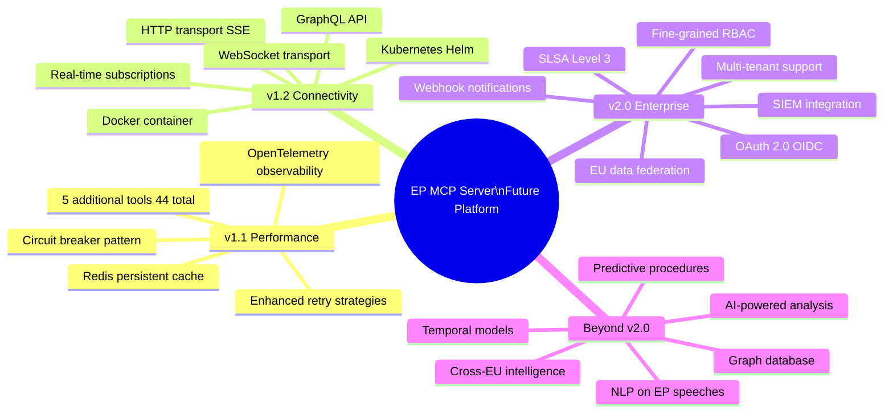
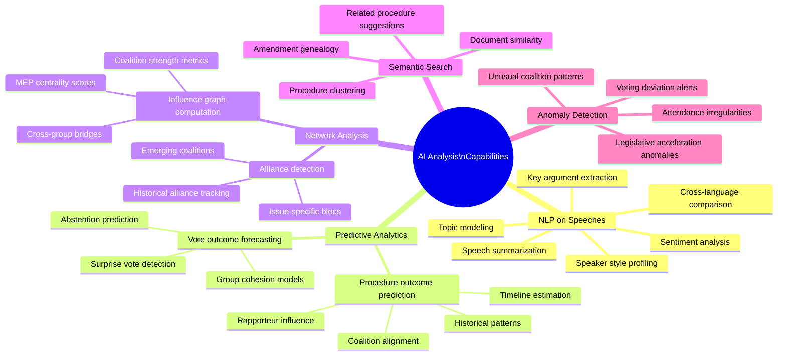
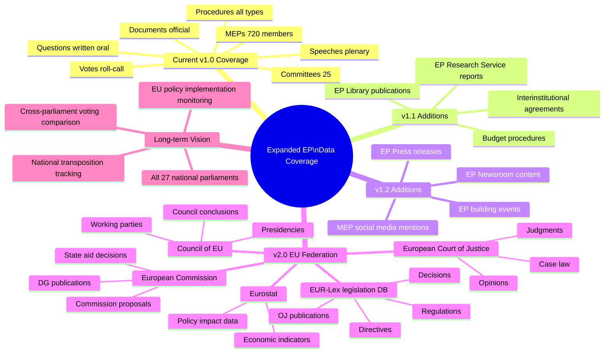
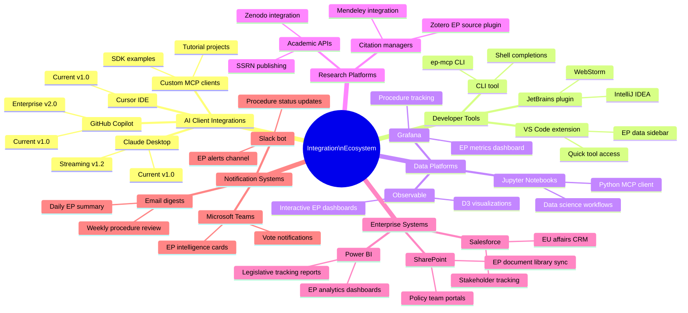
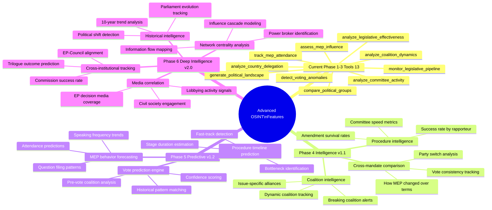
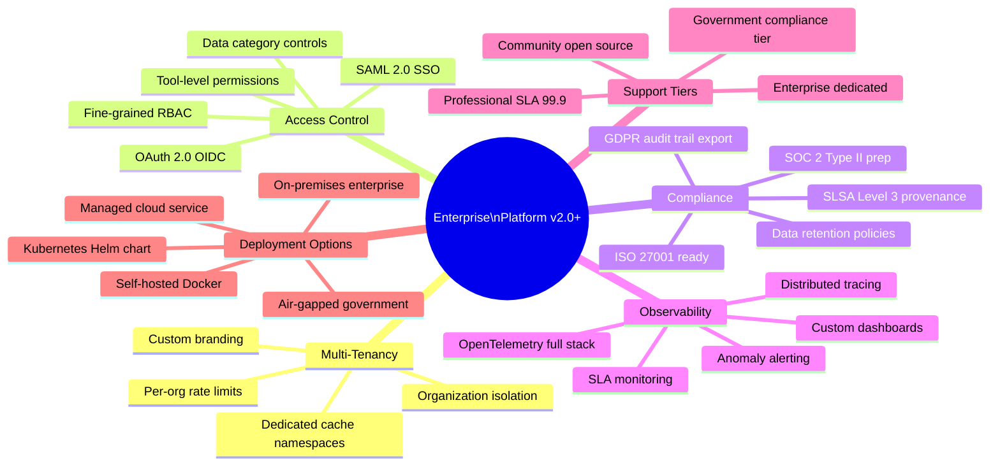

  

<h1 align="center">🧠 European Parliament MCP Server — Future Mind Map</h1>

  <strong>Planned Capability Expansion: AI Analysis, Expanded Coverage, Integration Ecosystem</strong> 
  <em>Vision map for the evolution of the EP MCP Server platform</em>

  
  
  
  

**📋 Document Owner:** Hack23 | **📄 Version:** 2.0 | **📅 Last Updated:** 2026-02-26 (UTC)
**🔄 Review Cycle:** Quarterly | **⏰ Next Review:** 2026-05-26
**🏷️ Classification:** Public (Open Source MCP Server)
**✅ ISMS Compliance:** ISO 27001 (A.5.1, A.8.1, A.14.2), NIST CSF 2.0 (ID.AM, PR.DS), CIS Controls v8.1 (2.1, 16.1)

---

## 📑 Table of Contents

1. [Security Documentation Map](#security-documentation-map)
2. [Future Platform Vision](#future-platform-vision)
3. [AI-Powered Analysis Capabilities](#ai-powered-analysis-capabilities)
4. [Expanded EP Data Coverage](#expanded-ep-data-coverage)
5. [Integration Ecosystem Map](#integration-ecosystem-map)
6. [Advanced OSINT Features](#advanced-osint-features)
7. [Enterprise Platform Evolution](#enterprise-platform-evolution)

---

## 🗺️ Security Documentation Map

| Document | Current | Future | Description |
|----------|---------|--------|-------------|
| **Architecture** | [ARCHITECTURE.md](./ARCHITECTURE.md) | [FUTURE_ARCHITECTURE.md](./FUTURE_ARCHITECTURE.md) | C4 model, containers, components, ADRs |
| **Security Architecture** | [SECURITY_ARCHITECTURE.md](./SECURITY_ARCHITECTURE.md) | [FUTURE_SECURITY_ARCHITECTURE.md](./FUTURE_SECURITY_ARCHITECTURE.md) | Security controls, threat model |
| **Data Model** | [DATA_MODEL.md](./DATA_MODEL.md) | [FUTURE_DATA_MODEL.md](./FUTURE_DATA_MODEL.md) | Entity relationships, branded types |
| **Flowchart** | [FLOWCHART.md](./FLOWCHART.md) | [FUTURE_FLOWCHART.md](./FUTURE_FLOWCHART.md) | Business process flows |
| **State Diagram** | [STATEDIAGRAM.md](./STATEDIAGRAM.md) | [FUTURE_STATEDIAGRAM.md](./FUTURE_STATEDIAGRAM.md) | System state transitions |
| **Mind Map** | [MINDMAP.md](./MINDMAP.md) | [FUTURE_MINDMAP.md](./FUTURE_MINDMAP.md) | System concepts and relationships |
| **SWOT Analysis** | [SWOT.md](./SWOT.md) | [FUTURE_SWOT.md](./FUTURE_SWOT.md) | Strategic positioning |

---

## 🌐 Future Platform Vision

---

## 🤖 AI-Powered Analysis Capabilities

---

## 🏛️ Expanded EP Data Coverage

---

## 🔗 Integration Ecosystem Map

---

## 🕵️ Advanced OSINT Features

---

## 🏢 Enterprise Platform Evolution

---

*See [MINDMAP.md](./MINDMAP.md) for the current system capabilities mindmap.*
