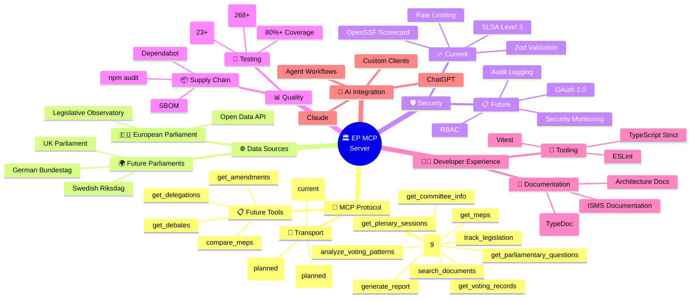
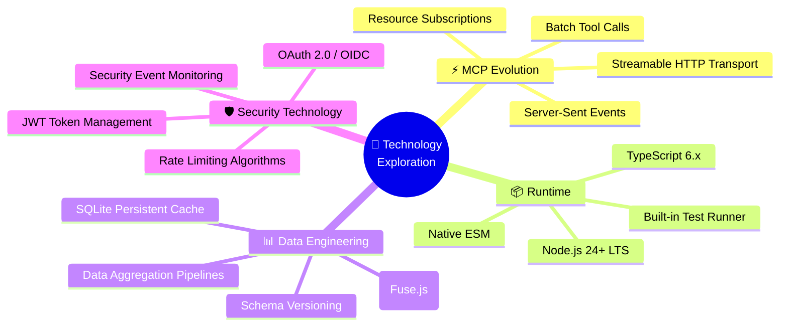

  

<h1 align="center">🧠 European Parliament MCP Server — Future Mindmap</h1>

  <strong>🏗️ Capability Expansion Plans</strong> 
  <em>📈 Strategic Vision for Parliamentary Data Intelligence Platform</em>

  
  
  
  

**📋 Document Owner:** CEO | **📄 Version:** 1.0 | **📅 Last Updated:** 2026-02-20 (UTC)  
**🔄 Review Cycle:** Quarterly | **⏰ Next Review:** 2026-05-20  
**🏷️ Classification:** Public (Open Source MCP Server)

---

## 📑 Table of Contents

- [Executive Summary](#-executive-summary)
- [Strategic Capability Mindmap](#-strategic-capability-mindmap)
- [Current vs Future Capabilities](#-current-vs-future-capabilities)
- [Capability Roadmap](#-capability-roadmap)
- [Technology Exploration](#-technology-exploration)
- [Security Capability Growth](#️-security-capability-growth)
- [Policy Alignment](#-policy-alignment)
- [Related Documents](#-related-documents)

---

## 🎯 Executive Summary

This document maps the strategic capability expansion for the European Parliament MCP Server, visualizing the evolution from a focused EP data access tool to a comprehensive parliamentary data intelligence platform.

---

## 🧠 Strategic Capability Mindmap

---

## 📊 Current vs Future Capabilities

### **🔌 Protocol Capabilities**

| Capability | Current | Future |
|-----------|---------|--------|
| MCP Tools | 9 tools | 15+ tools |
| Transport | stdio | stdio, HTTP, WebSocket |
| Streaming | ❌ | ✅ Progressive delivery |
| Batch Operations | ❌ | ✅ Multi-tool batching |
| Subscriptions | ❌ | ✅ Real-time updates |

### **📊 Data Capabilities**

| Capability | Current | Future |
|-----------|---------|--------|
| Data Sources | 1 (EP API) | 4+ parliaments |
| Entities | 6 types | 10+ types |
| Search | Basic filtering | Full-text + semantic |
| Analytics | Voting patterns | Multi-dimensional analysis |
| Caching | In-memory LRU | Multi-tier persistent |

### **🛡️ Security Capabilities**

| Capability | Current | Future |
|-----------|---------|--------|
| Authentication | None (stdio) | OAuth 2.0 / API keys |
| Authorization | None | RBAC |
| Audit Logging | Basic stderr | Structured JSON |
| Monitoring | OpenSSF Scorecard | Real-time alerting |
| Compliance | ISO 27001, NIST CSF | + SOC 2, EU CRA |

---

## 🚀 Capability Roadmap

### **Phase 1: Foundation Enhancement** (Q3 2026)

- 🔧 Add 5 new MCP tools
- 📊 Enhance existing entity models
- ⚡ Improve caching and performance
- 📖 Comprehensive API documentation

### **Phase 2: Scale & Reliability** (Q1 2027)

- 📡 HTTP transport support
- 💾 Persistent caching layer
- 🔄 Connection pooling
- 📊 Performance monitoring

### **Phase 3: Enterprise Intelligence** (Q3 2027)

- 🔒 Authentication and authorization
- 🌍 Multi-parliament data sources
- 🤖 Advanced analytics and AI features
- 📊 Usage analytics dashboard

---

## 🔍 Technology Exploration

---

## 🛡️ Security Capability Growth

| Maturity Level | Description | Status |
|---------------|-------------|--------|
| **L1: Basic** | Input validation, HTTPS, dependency scanning | ✅ Current |
| **L2: Managed** | Rate limiting, SLSA provenance, security headers | ✅ Current |
| **L3: Defined** | Threat model, security architecture, BCP | ✅ Current |
| **L4: Measured** | Authentication, RBAC, monitoring, analytics | 📋 Planned |
| **L5: Optimized** | Automated response, ML anomaly detection | 🔮 Future |

---

## 🔗 Policy Alignment

| ISMS Policy | Relevance | Link |
|-------------|-----------|------|
| 🔒 Secure Development | Capability security requirements | [Secure_Development_Policy.md](https://github.com/Hack23/ISMS-PUBLIC/blob/main/Secure_Development_Policy.md) |
| 🌐 Open Source Policy | OSS governance and growth | [Open_Source_Policy.md](https://github.com/Hack23/ISMS-PUBLIC/blob/main/Open_Source_Policy.md) |
| 🏷️ Classification | Impact-driven capability planning | [CLASSIFICATION.md](https://github.com/Hack23/ISMS-PUBLIC/blob/main/CLASSIFICATION.md) |

---

## 📚 Related Documents

| Document | Description | Link |
|----------|-------------|------|
| 🧠 Mindmap (Current) | Current capability map | [MINDMAP.md](MINDMAP.md) |
| 🚀 Future Architecture | Architecture roadmap | [FUTURE_ARCHITECTURE.md](FUTURE_ARCHITECTURE.md) |
| 📊 Future Data Model | Data evolution | [FUTURE_DATA_MODEL.md](FUTURE_DATA_MODEL.md) |
| 🛡️ Future Security Architecture | Security roadmap | [FUTURE_SECURITY_ARCHITECTURE.md](FUTURE_SECURITY_ARCHITECTURE.md) |

---

  <em>This future mindmap is maintained as part of the <a href="https://github.com/Hack23/ISMS-PUBLIC">Hack23 AB ISMS</a> framework.</em> 
  <em>Licensed under <a href="LICENSE.md">Apache-2.0</a></em>

