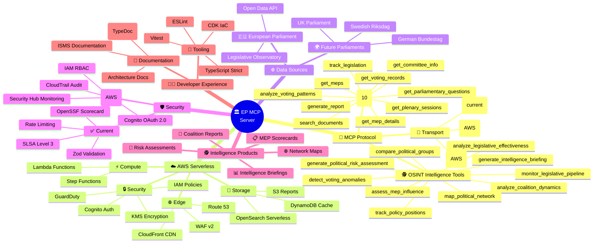
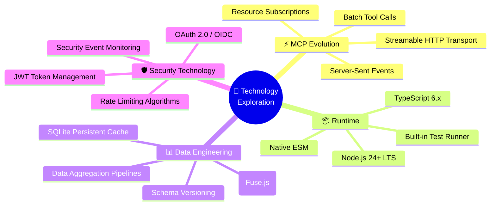
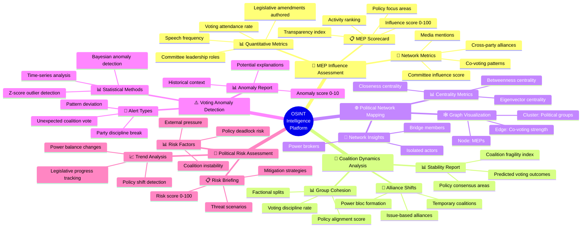
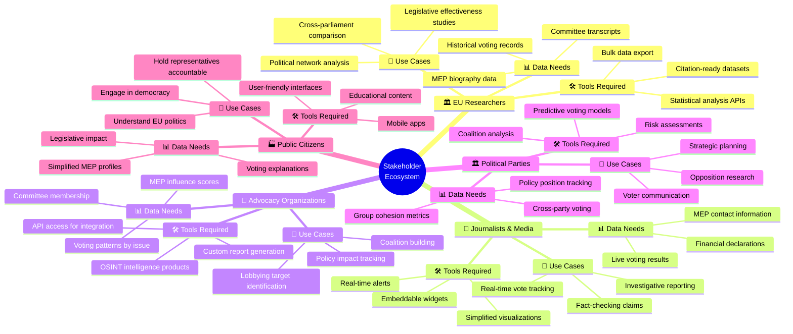
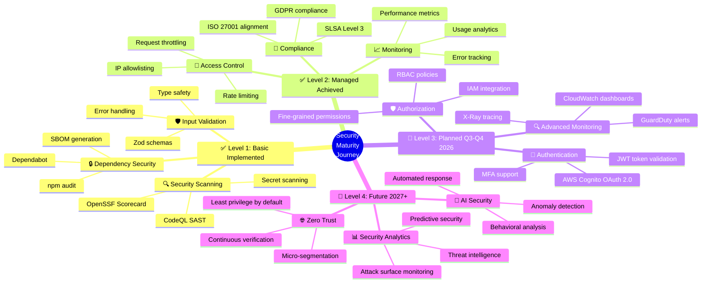
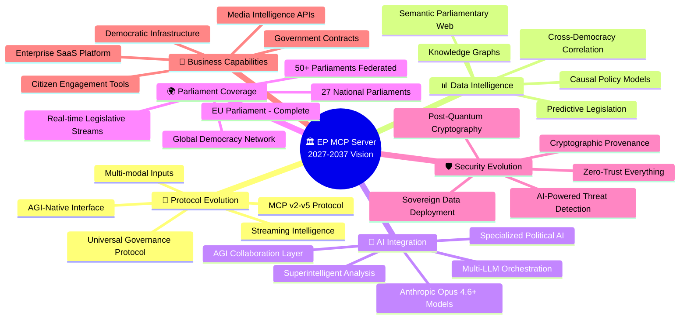
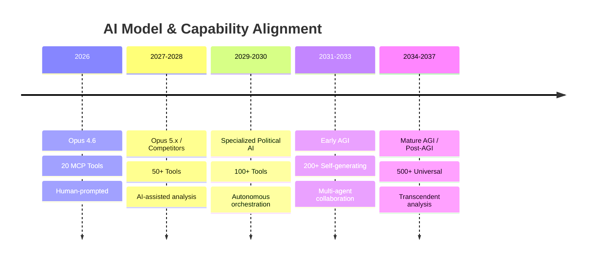

  

<h1 align="center">🧠 European Parliament MCP Server — Future Mindmap</h1>

  <strong>🏗️ Capability Expansion Plans</strong> 
  <em>📈 Strategic Vision for Parliamentary Data Intelligence Platform</em>

  
  
  
  

**📋 Document Owner:** CEO | **📄 Version:** 2.0 | **📅 Last Updated:** 2026-02-23 (UTC)  
**🔄 Review Cycle:** Quarterly | **⏰ Next Review:** 2026-05-23  
**🏷️ Classification:** Public (Open Source MCP Server)

---

## 📑 Table of Contents

- [Executive Summary](#-executive-summary)
- [Strategic Capability Mindmap](#-strategic-capability-mindmap)
- [Current vs Future Capabilities](#-current-vs-future-capabilities)
- [Capability Roadmap](#-capability-roadmap)
- [Technology Exploration](#-technology-exploration)
- [Security Capability Growth](#️-security-capability-growth)
- [🔮 Visionary Roadmap: 2027–2037](#-visionary-roadmap-20272037)
- [Policy Alignment](#-policy-alignment)
- [Related Documents](#-related-documents)

---

## 🎯 Executive Summary

This document maps the strategic capability expansion for the European Parliament MCP Server, visualizing the evolution from a focused EP data access tool to a **serverless AWS-powered parliamentary intelligence platform** inspired by [Hack23 CIA](https://github.com/Hack23/cia) OSINT methodologies. **All future infrastructure is serverless AWS-only** — see [FUTURE_ARCHITECTURE.md](FUTURE_ARCHITECTURE.md).

> **🤖 AI Evolution Context:** Capability expansion assumes progression from **Anthropic Opus 4.6** (2026) through future AI generations, with **minor updates every ~2.3 months** and **major version upgrades annually** through 2037. The capability mindmap extends to encompass AI-native intelligence, multi-parliament federation, and eventual AGI-powered democratic analysis tools.

---

## 🧠 Strategic Capability Mindmap

---

## 📊 Current vs Future Capabilities

### **🔌 Protocol Capabilities**

| Capability | Current | Future |
|-----------|---------|--------|
| MCP Tools | 16 tools (10 core + 6 OSINT) | 20+ tools |
| Transport | stdio | stdio, HTTP, WebSocket |
| Streaming | ❌ | ✅ Progressive delivery |
| Batch Operations | ❌ | ✅ Multi-tool batching |
| Subscriptions | ❌ | ✅ Real-time updates |

### **📊 Data Capabilities**

| Capability | Current | Future |
|-----------|---------|--------|
| Data Sources | 1 (EP API) | 4+ parliaments |
| Entities | 6 types | 10+ types |
| Search | Basic filtering | Full-text + semantic |
| Analytics | Voting patterns | Multi-dimensional analysis |
| Caching | In-memory LRU | Multi-tier persistent |

### **🛡️ Security Capabilities**

| Capability | Current | Future |
|-----------|---------|--------|
| Authentication | None (stdio) | OAuth 2.0 / API keys |
| Authorization | None | RBAC |
| Audit Logging | Basic stderr | Structured JSON |
| Monitoring | OpenSSF Scorecard | Real-time alerting |
| Compliance | ISO 27001, NIST CSF | + SOC 2, EU CRA |

---

## 🚀 Capability Roadmap

### **Phase 1: Foundation Enhancement** (Q3 2026)

- 🔧 Add 5 new MCP tools
- 📊 Enhance existing entity models
- ⚡ Improve caching and performance
- 📖 Comprehensive API documentation

### **Phase 2: Scale & Reliability** (Q1 2027)

- 📡 HTTP transport support
- 💾 Persistent caching layer
- 🔄 Connection pooling
- 📊 Performance monitoring

### **Phase 3: Enterprise Intelligence** (Q3 2027)

- 🔒 Authentication and authorization
- 🌍 Multi-parliament data sources
- 🤖 Advanced analytics and AI features
- 📊 Usage analytics dashboard

---

## 🔍 Technology Exploration

---

## 🛡️ Security Capability Growth

| Maturity Level | Description | Status |
|---------------|-------------|--------|
| **L1: Basic** | Input validation, HTTPS, dependency scanning | ✅ Current |
| **L2: Managed** | Rate limiting, SLSA provenance, security headers | ✅ Current |
| **L3: Defined** | Threat model, security architecture, BCP | ✅ Current |
| **L4: Measured** | Authentication, RBAC, monitoring, analytics | 📋 Planned |
| **L5: Optimized** | Automated response, ML anomaly detection | 🔮 Future |

---

## 🕵️ OSINT Intelligence Capability Mindmap

---

## 👥 Stakeholder Impact Mindmap

---

## 🔒 Security Capability Growth Mindmap

---

## 📊 Implementation Phases Table

### **Phase 1: Foundation Enhancement** (Q3 2026)

| Deliverable | Description | Owner | Status |
|------------|-------------|-------|--------|
| **New MCP Tools** | Add 5 OSINT intelligence tools | Engineering | 📅 Planned |
| **Enhanced Data Models** | Expand MEP, Vote, Session entities | Engineering | 📅 Planned |
| **DynamoDB Migration** | Migrate from in-memory to DynamoDB | DevOps | 📅 Planned |
| **API Documentation** | TypeDoc comprehensive docs | Technical Writer | 📅 Planned |
| **Performance Optimization** | Sub-200ms p95 latency target | SRE | 📅 Planned |

**Duration:** 12 weeks  
**Budget:** $25,000 (engineering time + AWS costs)  
**Risk Level:** 🟡 Medium

---

### **Phase 2: Scale & Reliability** (Q1 2027)

| Deliverable | Description | Owner | Status |
|------------|-------------|-------|--------|
| **HTTP Transport** | API Gateway + Lambda backend | DevOps | 📅 Planned |
| **Persistent Caching** | DynamoDB with TTL management | Engineering | 📅 Planned |
| **Circuit Breakers** | Per-endpoint fault tolerance | SRE | 📅 Planned |
| **CloudWatch Observability** | Dashboards, alarms, X-Ray | DevOps | 📅 Planned |
| **Load Testing** | 10,000 RPS capacity validation | QA | 📅 Planned |

**Duration:** 16 weeks  
**Budget:** $40,000 (engineering + infrastructure)  
**Risk Level:** 🟠 High (architectural changes)

---

### **Phase 3: Enterprise Intelligence** (Q3 2027)

| Deliverable | Description | Owner | Status |
|------------|-------------|-------|--------|
| **Cognito Authentication** | OAuth 2.0 + MFA integration | Security | 🔮 Future |
| **Multi-Parliament Support** | Riksdag, Bundestag, UK Parliament | Engineering | 🔮 Future |
| **OpenSearch Integration** | Semantic search capabilities | Data Engineering | 🔮 Future |
| **Step Functions Workflows** | Complex report generation | Engineering | 🔮 Future |
| **Usage Analytics Dashboard** | Customer insights and metrics | Product | 🔮 Future |

**Duration:** 20 weeks  
**Budget:** $60,000 (enterprise features + data sources)  
**Risk Level:** 🟠 High (external dependencies)

---

## 🎯 KPI Success Metrics Table

### **Performance KPIs**

| KPI | Baseline | Phase 1 Target | Phase 2 Target | Phase 3 Target | Measurement |
|-----|----------|----------------|----------------|----------------|-------------|
| **Response Time p95** | 500ms | 200ms | 150ms | 100ms | CloudWatch metrics |
| **Cache Hit Rate** | 60% | 75% | 85% | 90% | DynamoDB metrics |
| **Availability** | 99.5% | 99.9% | 99.95% | 99.99% | API Gateway uptime |
| **Error Rate** | 2% | 1% | 0.5% | 0.1% | Lambda error logs |
| **Cold Start Rate** | 5% | 2% | 1% | <0.5% | Lambda metrics |

---

### **Capability KPIs**

| KPI | Baseline | Phase 1 Target | Phase 2 Target | Phase 3 Target | Measurement |
|-----|----------|----------------|----------------|----------------|-------------|
| **MCP Tools** | 10 | 15 | 20 | 25 | Tool registry |
| **Data Entities** | 6 | 10 | 12 | 15 | Schema count |
| **Data Sources** | 1 (EP) | 1 | 1 | 4 parliaments | API integrations |
| **Intelligence Products** | 2 | 7 | 10 | 15 | OSINT tool count |
| **API Coverage** | 40% | 60% | 80% | 95% | TypeDoc coverage |

---

### **Security KPIs**

| KPI | Baseline | Phase 1 Target | Phase 2 Target | Phase 3 Target | Measurement |
|-----|----------|----------------|----------------|----------------|-------------|
| **OpenSSF Score** | 7.5/10 | 8.0/10 | 8.5/10 | 9.0/10 | Scorecard scan |
| **SLSA Level** | 3 | 3 (+ Provenance V1) | 3 (+ SBOM attestation) | 4 | SLSA attestation |
| **Vulnerability SLA** | 30 days | 14 days | 7 days | 3 days | Dependabot metrics |
| **Audit Log Coverage** | 80% | 90% | 95% | 100% | CloudTrail events |
| **Security Incidents** | 0 | 0 | 0 | 0 | Incident log |

---

### **Business KPIs**

| KPI | Baseline | Phase 1 Target | Phase 2 Target | Phase 3 Target | Measurement |
|-----|----------|----------------|----------------|----------------|-------------|
| **Monthly Active Users** | 50 | 200 | 500 | 1000 | Analytics |
| **API Requests/Month** | 100K | 500K | 2M | 5M | CloudWatch |
| **GitHub Stars** | 15 | 50 | 100 | 250 | GitHub metrics |
| **Documentation Quality** | 70% | 85% | 90% | 95% | Readability score |
| **Community PRs** | 0 | 2 | 5 | 10 | GitHub PRs |

---

## ⚠️ Risk Register

### **Strategic Risks**

| Risk ID | Risk | Impact | Probability | Severity | Mitigation | Owner |
|---------|------|--------|-------------|----------|------------|-------|
| **R1** | MCP protocol breaking changes | High | Low | 🟠 High | Active MCP community participation | CTO |
| **R2** | EP API deprecation or changes | High | Medium | 🔴 Critical | Adapter pattern, API versioning | Engineering |
| **R3** | Competitor launches superior product | Medium | Medium | 🟡 Medium | Feature leadership, OSINT differentiation | Product |
| **R4** | Funding sustainability | High | Medium | 🟠 High | Sponsorship program, consulting services | CEO |
| **R5** | EU AI Act compliance burden | Medium | Low | 🟡 Medium | Proactive GDPR compliance, legal review | Legal |

---

### **Technical Risks**

| Risk ID | Risk | Impact | Probability | Severity | Mitigation | Owner |
|---------|------|--------|-------------|----------|------------|-------|
| **T1** | DynamoDB throttling | Medium | Low | 🟡 Medium | On-demand mode, auto-scaling | DevOps |
| **T2** | Lambda cold start latency | Low | Medium | 🟢 Low | Provisioned concurrency, optimization | SRE |
| **T3** | Data migration failure | High | Low | 🟠 High | Dual-write mode, rollback plan | Engineering |
| **T4** | OpenSearch cost overrun | Medium | Medium | 🟡 Medium | Serverless OpenSearch, query optimization | FinOps |
| **T5** | Multi-parliament API complexity | High | Medium | 🟠 High | Adapter pattern, phased rollout | Architecture |

---

### **Operational Risks**

| Risk ID | Risk | Impact | Probability | Severity | Mitigation | Owner |
|---------|------|--------|-------------|----------|------------|-------|
| **O1** | Insufficient documentation | Medium | Medium | 🟡 Medium | Documentation sprints, TypeDoc automation | Tech Writer |
| **O2** | Team scaling challenges | High | Low | 🟠 High | Modular architecture, clear ownership | CTO |
| **O3** | Security incident | High | Very Low | 🔴 Critical | ISMS compliance, incident response plan | CISO |
| **O4** | Community engagement decline | Medium | Medium | 🟡 Medium | Regular updates, responsive maintainership | Product |
| **O5** | Technical debt accumulation | High | Medium | 🟠 High | 20% time for refactoring, code reviews | Engineering |

---

## 🔗 ISO 27001 Controls Mapping

| Control | Description | Implementation |
|---------|-------------|----------------|
| **A.6.1.1** | Information security roles and responsibilities | Documented in ISMS, RACI matrix for capability development |
| **A.6.1.2** | Segregation of duties | Separate roles for development, operations, security |
| **A.12.6.1** | Management of technical vulnerabilities | Dependabot automated vulnerability scanning |
| **A.12.6.2** | Restrictions on software installation | Lambda runtime managed by AWS, no custom OS packages |
| **A.14.2.1** | Secure development policy | All capabilities follow Secure Development Policy |
| **A.14.2.5** | Secure system engineering principles | Zero-trust architecture, least privilege, defense-in-depth |
| **A.14.2.8** | System security testing | Integration tests with 80%+ coverage for all new capabilities |

### **NIST CSF 2.0 Mapping**

| Function | Category | Implementation |
|----------|----------|----------------|
| **ID.BE-3** | Priorities for organizational mission established | KPI framework aligns capabilities with business objectives |
| **ID.RA-1** | Asset vulnerabilities identified | Risk register tracks technical and strategic risks |
| **ID.RA-5** | Threats, vulnerabilities, likelihoods, impacts determined | Risk assessment per capability with mitigation plans |
| **PR.IP-1** | Baseline configuration established | All infrastructure as code (CDK), version controlled |
| **PR.IP-2** | System development life cycle managed | Phased implementation with gates and reviews |
| **DE.CM-4** | Malicious code detected | CodeQL SAST scans on every commit |

### **CIS Controls v8.1 Mapping**

| Control | Safeguard | Implementation |
|---------|-----------|----------------|
| **1.1** | Establish and maintain detailed enterprise asset inventory | All AWS resources documented in Asset Register |
| **2.1** | Establish and maintain software inventory | SBOM generated for all dependencies |
| **4.1** | Establish and maintain secure configuration | Lambda configurations in IaC, immutable |
| **16.1** | Establish and maintain security awareness program | Security training for all contributors |
| **16.11** | Establish and maintain security incident response processes | Incident response plan documented in ISMS |
| **18.3** | Remediate penetration test findings | Annual security audit with remediation SLA |

---

## 🔮 Visionary Roadmap: 2027–2037

> **Capability Expansion Vision** — From 20-tool MCP server to universal democratic intelligence platform, mapping capability growth alongside AI model evolution from Anthropic Opus 4.6 through future AGI.

### 📅 Capability Version Strategy

| Year | Version | AI Context | Capability Milestone |
|------|---------|-----------|---------------------|
| **2026** | v1.0 | Anthropic Opus 4.6 | 20 tools, 6 prompts, 6 resources — OSINT parliamentary intelligence |
| **2027** | v2.0 | Opus 5.x | 35+ tools with cloud-native analytics and enterprise APIs |
| **2028** | v3.0 | Next-gen multimodal | 50+ tools spanning EU + national parliament federation |
| **2029** | v4.0 | Specialized political AI | 75+ tools with AI-autonomous orchestration |
| **2030** | v5.0 | Near-AGI reasoning | 100+ tools with knowledge graph reasoning |
| **2031** | v6.0 | Early AGI | Self-generating tools — AI creates new analysis capabilities |
| **2032** | v7.0 | AGI-assisted | 200+ tools with predictive governance capabilities |
| **2033** | v8.0 | AGI co-development | Global parliament coverage — 50+ democracies |
| **2034** | v9.0 | Mature AGI | AGI-native tool composition — emergent capabilities |
| **2035** | v10.0 | Post-AGI | 500+ tools across decentralized instances |
| **2036** | v11.0 | AGI-native | Universal governance toolkit — ISO standardized |
| **2037** | v12.0 | Superintelligent | Transcendent analysis — capabilities beyond human design |

> **Minor updates every ~2.3 months** deliver new tools, capability refinements, and integration expansions.

### 🧠 Long-Term Capability Mindmap

### 🎯 Capability Growth Phases

#### Phase 4: AI-Native Intelligence (2029–2030)

- **Autonomous tool composition** — AI discovers optimal tool combinations for complex political analysis
- **Multilingual intelligence** — native analysis across all 24 EU official languages
- **Real-time event processing** — streaming pipeline for live parliamentary proceedings
- **Predictive analytics** — forecast voting outcomes, coalition stability, and policy trajectories
- **Cross-domain enrichment** — integrate economic, social, and environmental data with parliamentary data

#### Phase 5: Global Democracy Platform (2031–2033)

- **50+ parliament federation** — unified intelligence across global democratic institutions
- **AI-generated tools** — AGI creates new analysis tools based on user needs and data patterns
- **Collaborative intelligence** — multiple AGI agents cooperate on complex geopolitical analysis
- **Legislative impact simulation** — digital twin of democratic systems for scenario modeling
- **Institutional memory** — preserve and reason over decades of legislative history

#### Phase 6: Universal Democratic Infrastructure (2034–2037)

- **Democratic standard protocol** — ISO/W3C standard for democratic data interchange
- **Citizen intelligence tools** — AGI-powered tools for direct citizen engagement with democracy
- **Sovereignty-preserving federation** — each nation runs sovereign instances with shared intelligence
- **Continuous governance monitoring** — 24/7 autonomous oversight of democratic health indicators
- **Post-human analysis** — AGI capabilities that exceed human analytical capacity for governance

### 🤖 AI Model Co-Evolution

### 🏛️ Disruption Capability Mapping

| Disruption Scenario | Capability Response | Timeline |
|---------------------|-------------------|----------|
| **Competitor MCP ecosystems** emerge | Interoperability layer; become the federation hub | 2027–2028 |
| **LLM paradigm shift** (beyond transformers) | Protocol abstraction; capabilities survive model changes | 2028–2030 |
| **Open-source AGI** eliminates proprietary advantage | Domain expertise moat; parliamentary data is irreplaceable | 2030–2033 |
| **Government AI regulation** constrains capabilities | Compliance-by-design; participate in regulation drafting | 2027–2029 |
| **Quantum computing** enables new analysis | Quantum-ready algorithms for complex policy simulation | 2032–2037 |

---

## 🔗 Policy Alignment

| ISMS Policy | Relevance | Link |
|-------------|-----------|------|
| 🔒 Secure Development | Capability security requirements | [Secure_Development_Policy.md](https://github.com/Hack23/ISMS-PUBLIC/blob/main/Secure_Development_Policy.md) |
| 🌐 Open Source Policy | OSS governance and growth | [Open_Source_Policy.md](https://github.com/Hack23/ISMS-PUBLIC/blob/main/Open_Source_Policy.md) |
| 🏷️ Classification | Impact-driven capability planning | [CLASSIFICATION.md](https://github.com/Hack23/ISMS-PUBLIC/blob/main/CLASSIFICATION.md) |

---

## 📚 Related Documents

| Document | Description | Link |
|----------|-------------|------|
| 🧠 Mindmap (Current) | Current capability map | [MINDMAP.md](MINDMAP.md) |
| 🚀 Future Architecture | Architecture roadmap | [FUTURE_ARCHITECTURE.md](FUTURE_ARCHITECTURE.md) |
| 📊 Future Data Model | Data evolution | [FUTURE_DATA_MODEL.md](FUTURE_DATA_MODEL.md) |
| 🛡️ Future Security Architecture | Security roadmap | [FUTURE_SECURITY_ARCHITECTURE.md](FUTURE_SECURITY_ARCHITECTURE.md) |

---

  <em>This future mindmap is maintained as part of the <a href="https://github.com/Hack23/ISMS-PUBLIC">Hack23 AB ISMS</a> framework.</em> 
  <em>Licensed under <a href="LICENSE.md">Apache-2.0</a></em>

