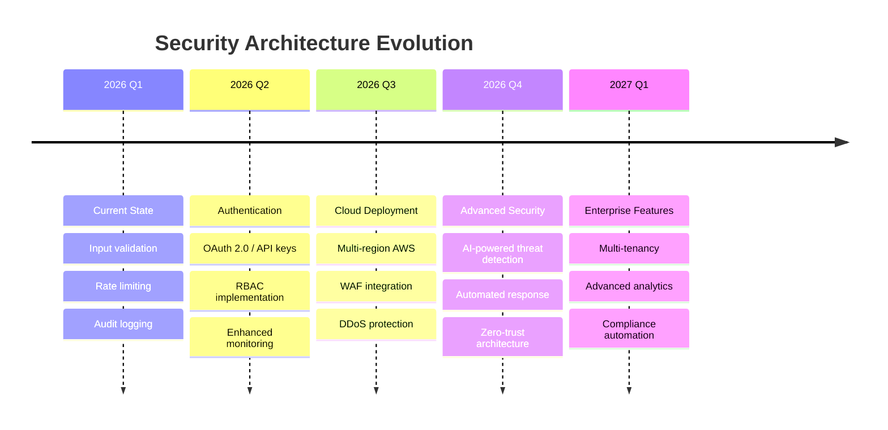
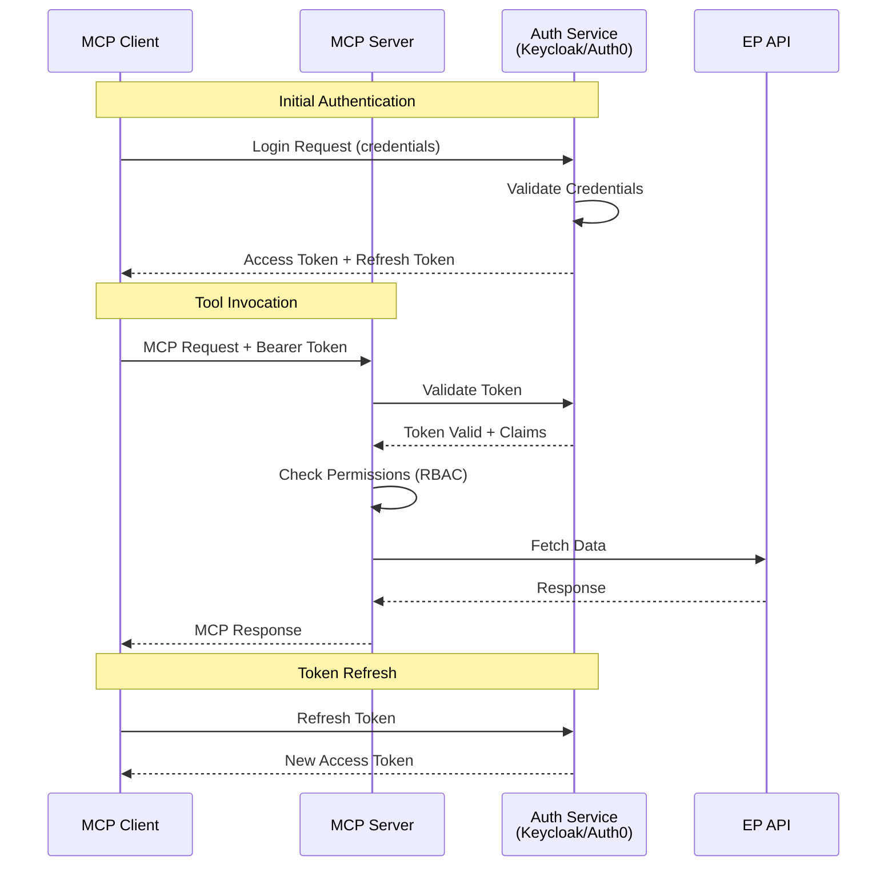
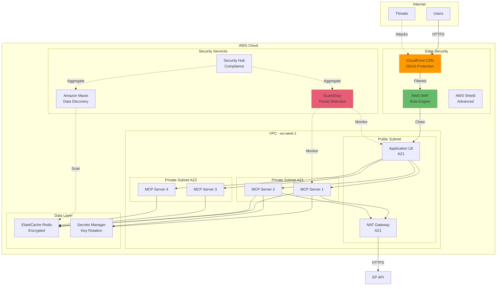
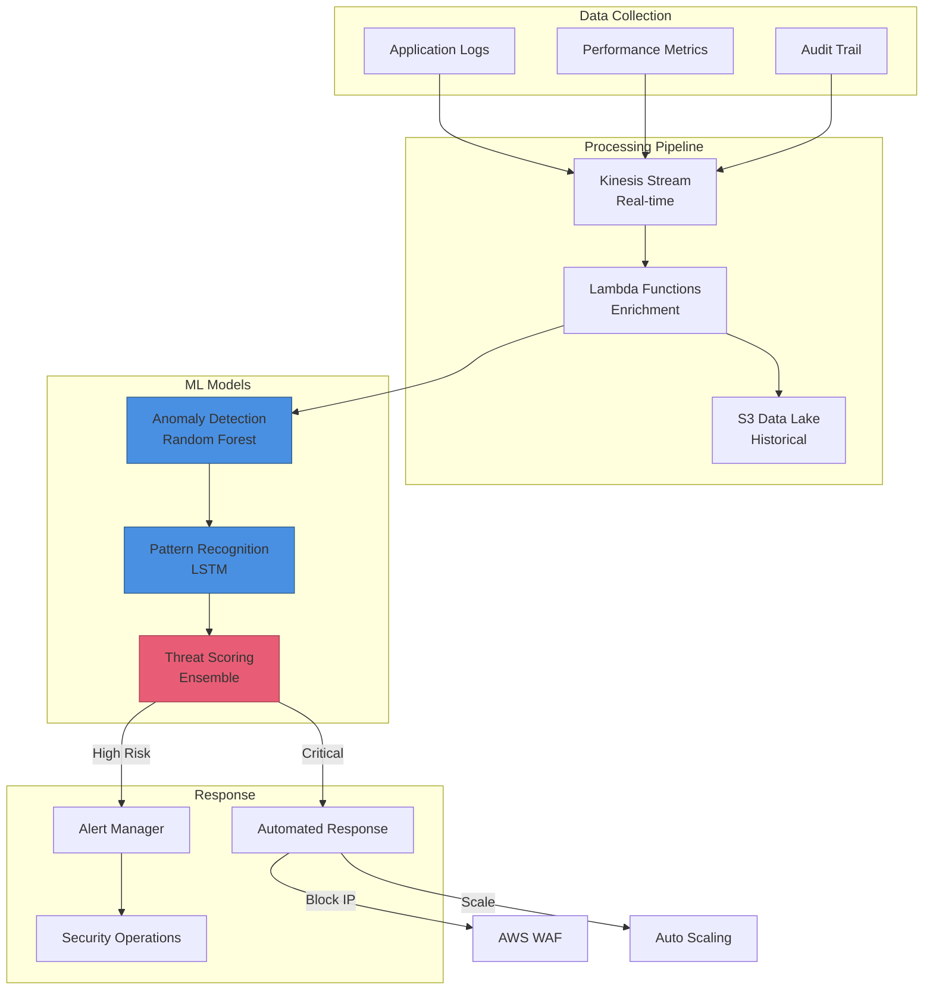
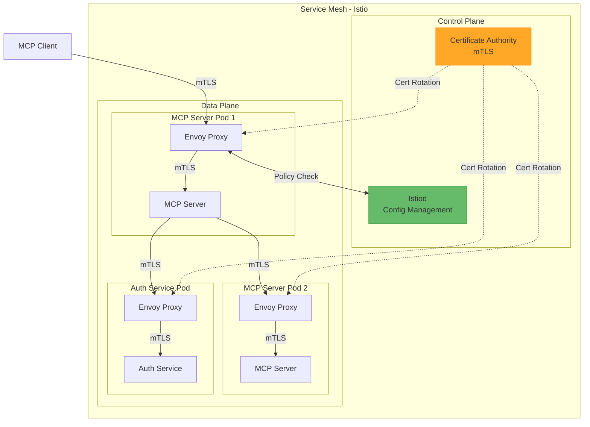
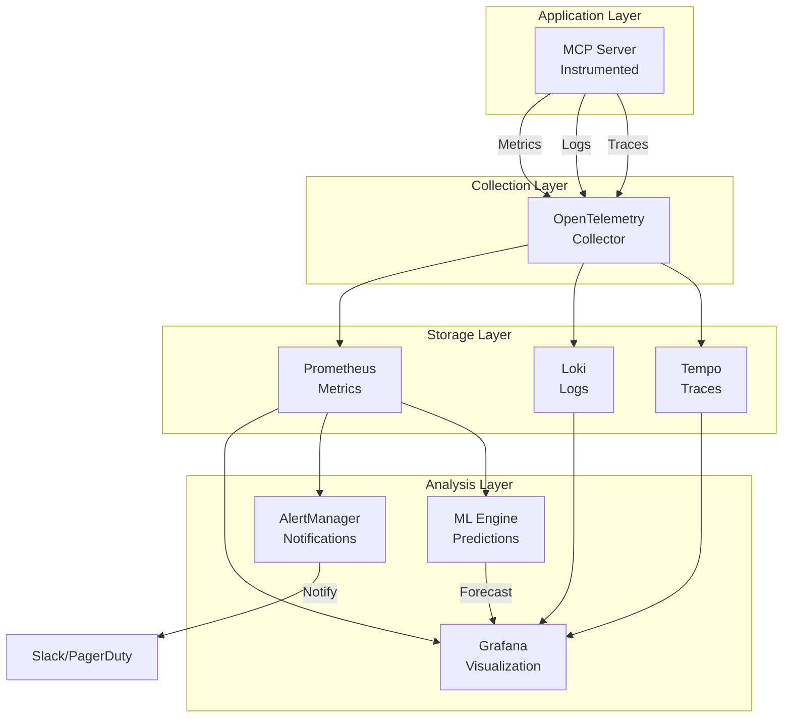
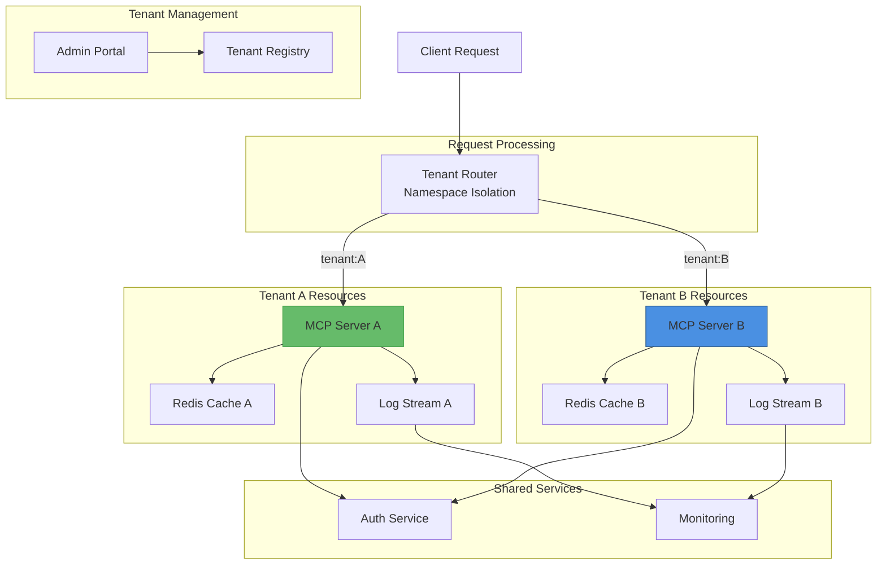
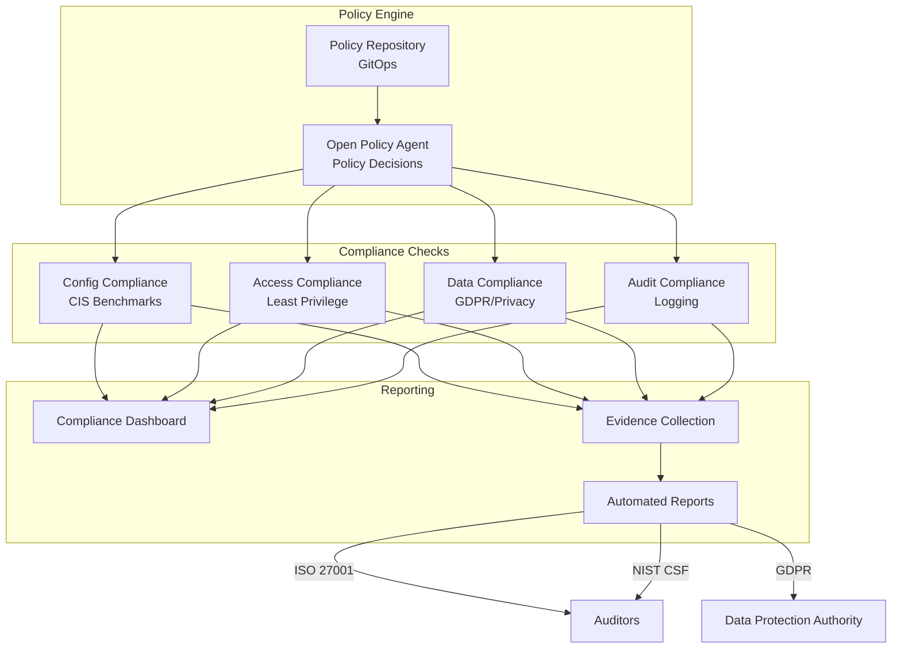
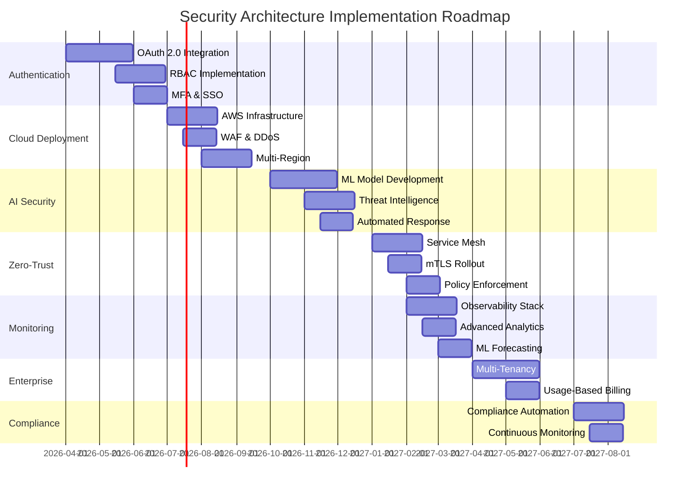

# Future Security Architecture

<p align="center">
  
</p>

<h1 align="center">🚀 European Parliament MCP Server - Future Security Architecture</h1>

<p align="center">
  <strong>Security Roadmap and Planned Enhancements</strong><br>
  <em>Evolution Toward Enterprise-Grade Security</em>
</p>

---

## 📋 Document Information

**Document Owner:** Security Team  
**Version:** 1.0  
**Last Updated:** 2026-02-17  
**Classification:** Public  
**Review Cycle:** Quarterly  
**Next Review:** 2026-05-17

---

## 🔐 ISMS Policy Alignment

### Related ISMS Policies

| Policy | Relevance | Link |
|--------|-----------|------|
| **Open Source Policy** | Security transparency, vulnerability disclosure | [View](https://github.com/Hack23/ISMS-PUBLIC/blob/main/Open_Source_Policy.md) |
| **Secure Development Policy** | Secure coding practices, supply chain security | [View](https://github.com/Hack23/ISMS-PUBLIC/blob/main/Secure_Development_Policy.md) |
| **Risk Management Policy** | Threat assessment, risk mitigation | [View](https://github.com/Hack23/ISMS-PUBLIC/blob/main/Risk_Management_Policy.md) |
| **Privacy Policy** | GDPR compliance, data protection | [View](https://github.com/Hack23/ISMS-PUBLIC/blob/main/Privacy_Policy.md) |

### Security Control Implementation Status

| Control Area | Status | Evidence |
|-------------|--------|----------|
| OAuth 2.0 Authentication | 🔄 Planned | Q2 2026 - Phase 1 |
| RBAC Authorization | 🔄 Planned | Q2 2026 - Phase 1 |
| AWS WAF Integration | 🔄 Planned | Q3 2026 - Phase 2 |
| DDoS Protection | 🔄 Planned | Q3 2026 - Phase 2 |
| AI Threat Detection | 🔄 Planned | Q4 2026 - Phase 3 |
| Zero-Trust Architecture | 🔄 Planned | Q1 2027 - Phase 4 |
| Compliance Automation | 🔄 Planned | Q3 2027 - Phase 7 |

### Compliance Framework Mapping

| Framework | Controls | Status |
|-----------|----------|--------|
| **ISO 27001:2022** | A.5.1, A.8.2, A.8.8, A.8.25, A.14.2, A.18.1 | ✅ Aligned |
| **NIST CSF 2.0** | ID.AM, ID.RA, PR.DS, PR.IP, DE.CM, RS.AN | ✅ Aligned |
| **CIS Controls v8.1** | 1.1, 2.7, 3.3, 6.2, 7.1, 16.7 | ✅ Aligned |

---

## 🗺️ Security Documentation Map

| Document | Type | Description | Status |
|----------|------|-------------|--------|
| [SECURITY_ARCHITECTURE.md](./SECURITY_ARCHITECTURE.md) | 🛡️ Current | Implemented security design and controls | ✅ Current |
| [FUTURE_SECURITY_ARCHITECTURE.md](./FUTURE_SECURITY_ARCHITECTURE.md) | 🚀 Future | Security roadmap and planned enhancements | ✅ Current |
| [THREAT_MODEL.md](./THREAT_MODEL.md) | 🎯 Analysis | STRIDE threat analysis and risk assessment | ✅ Current |
| [BCPPlan.md](./BCPPlan.md) | 🔄 Continuity | Business continuity and disaster recovery | ✅ Current |
| [CRA-ASSESSMENT.md](./CRA-ASSESSMENT.md) | 📋 Compliance | EU Cyber Resilience Act conformity assessment | ✅ Current |
| [SECURITY.md](./SECURITY.md) | 📜 Policy | Security policy and vulnerability disclosure | ✅ Current |
| [SECURITY_HEADERS.md](./SECURITY_HEADERS.md) | 🔒 Technical | API security headers implementation | ✅ Current |

---

## 🎯 Vision Statement

Evolve the European Parliament MCP Server from a secure open-source tool to an enterprise-grade platform with advanced authentication, comprehensive monitoring, and cloud-native security controls while maintaining transparency and GDPR compliance.

**Target State**: Production-ready MCP server with OAuth 2.0 authentication, distributed deployment, automated threat response, and comprehensive security analytics.

---

## 📊 Security Maturity Roadmap



---

## 🔑 Phase 1: Authentication & Authorization (Q2 2026)

### OAuth 2.0 Integration

**Implementation Plan**:



**Features**:
- OAuth 2.0 / OpenID Connect
- JWT token validation
- Token refresh mechanism
- Multi-factor authentication (MFA)
- SSO integration

**RBAC Model**:
```typescript
enum Role {
  PUBLIC = 'public',        // Rate-limited, read-only
  RESEARCHER = 'researcher', // Higher rate limits, analytics
  ADMIN = 'admin'           // Full access, config management
}

const permissions = {
  public: ['get_meps', 'get_plenary_sessions'],
  researcher: ['*'],  // All tools
  admin: ['*', 'admin:config', 'admin:metrics']
};
```

---

## 🌐 Phase 2: Cloud-Native Security (Q3 2026)

### AWS Security Architecture



**Security Enhancements**:

1. **AWS WAF Rules**:
   - SQL injection prevention
   - XSS protection
   - Rate limiting (geographic)
   - IP reputation filtering

2. **DDoS Protection**:
   - AWS Shield Advanced
   - CloudFront edge protection
   - Automatic scaling

3. **Network Isolation**:
   - Private subnets for application
   - VPC endpoints for AWS services
   - Security groups with least privilege
   - Network ACLs

4. **Encryption**:
   - TLS 1.3 at edge (CloudFront)
   - Encrypted inter-service communication
   - ElastiCache encryption at rest
   - EBS volume encryption

---

## 🤖 Phase 3: AI-Powered Threat Detection (Q4 2026)

### Behavioral Analytics



**ML-Based Detection**:

1. **Anomaly Detection**:
   - Unusual request patterns
   - Abnormal data access
   - Geographic anomalies
   - Time-based patterns

2. **Threat Intelligence**:
   - IP reputation feeds
   - Known attack signatures
   - CVE correlation
   - Threat actor TTPs

3. **Automated Response**:
```typescript
interface ThreatResponse {
  severity: 'low' | 'medium' | 'high' | 'critical';
  action: 'log' | 'rate_limit' | 'block' | 'isolate';
  duration: number;  // minutes
  notify: string[];  // stakeholders
}

// Example: Automated IP blocking
async function handleThreat(threat: ThreatResponse) {
  if (threat.severity === 'critical') {
    await waf.blockIP(threat.sourceIP, threat.duration);
    await notifySecurityTeam(threat);
    await isolateAffectedSystems(threat);
  }
}
```

---

## 🔒 Phase 4: Zero-Trust Architecture (Q1 2027)

### Service Mesh Implementation



**Zero-Trust Principles**:

1. **Never Trust, Always Verify**:
   - mTLS for all service communication
   - Certificate-based authentication
   - Continuous verification

2. **Least Privilege Access**:
   - Service-to-service authorization
   - Fine-grained policies
   - Just-in-time access

3. **Assume Breach**:
   - Micro-segmentation
   - Lateral movement prevention
   - Continuous monitoring

**Policy Example**:
```yaml
apiVersion: security.istio.io/v1beta1
kind: AuthorizationPolicy
metadata:
  name: mcp-server-authz
spec:
  selector:
    matchLabels:
      app: mcp-server
  action: ALLOW
  rules:
  - from:
    - source:
        principals: ["cluster.local/ns/default/sa/mcp-client"]
    to:
    - operation:
        methods: ["POST"]
        paths: ["/mcp/v1/tools/*"]
    when:
    - key: request.auth.claims[role]
      values: ["researcher", "admin"]
```

---

## 📊 Phase 5: Advanced Monitoring & Analytics (Q1 2027)

### Observability Stack



**Enhanced Metrics**:

1. **Security Metrics**:
   - Authentication success/failure rates
   - Authorization denials by user/role
   - Threat score distribution
   - Attack vector breakdown

2. **Performance Metrics**:
   - Latency percentiles (p50, p95, p99.9)
   - Request throughput by tool
   - Cache efficiency metrics
   - EP API dependency health

3. **Business Metrics**:
   - Tool usage by user/organization
   - Data access patterns
   - Feature adoption rates
   - User engagement metrics

**Dashboards**:
```typescript
// Security Dashboard
const securityMetrics = {
  panels: [
    'Authentication attempts (success/failure)',
    'Rate limit violations by IP',
    'Validation failures by tool',
    'Threat score timeline',
    'Geographic access distribution',
    'Anomaly detection alerts'
  ]
};

// Performance Dashboard
const performanceMetrics = {
  panels: [
    'Request latency (p50, p95, p99)',
    'Throughput by tool',
    'Error rate by type',
    'Cache hit rate',
    'EP API response time',
    'Resource utilization (CPU, memory)'
  ]
};
```

---

## 🏢 Phase 6: Multi-Tenancy & Enterprise Features (Q2 2027)

### Tenant Isolation Architecture



**Multi-Tenancy Features**:

1. **Tenant Isolation**:
   - Dedicated resources per tenant
   - Network isolation
   - Data segregation
   - Independent scaling

2. **Tenant Configuration**:
```typescript
interface TenantConfig {
  id: string;
  name: string;
  plan: 'free' | 'pro' | 'enterprise';
  limits: {
    rateLimit: number;
    cacheSize: number;
    maxUsers: number;
  };
  features: {
    analytics: boolean;
    advancedAuth: boolean;
    customBranding: boolean;
  };
  compliance: {
    dataResidency: string;  // eu-west-1, us-east-1
    retention: number;       // days
    encryption: 'standard' | 'enhanced';
  };
}
```

3. **Usage-Based Billing**:
   - Per-request pricing
   - Tiered plans
   - Overage charges
   - Cost allocation tags

---

## 🔍 Phase 7: Compliance Automation (Q3 2027)

### Continuous Compliance Monitoring



**Automated Compliance**:

1. **Policy as Code**:
```rego
# OPA Policy: GDPR Data Retention
package gdpr.retention

violation[{"msg": msg}] {
  cache_ttl := input.cache.ttl
  cache_ttl > 900  # 15 minutes in seconds
  msg := sprintf("Cache TTL %v exceeds GDPR limit of 15 minutes", [cache_ttl])
}

violation[{"msg": msg}] {
  log_retention := input.logs.retention_days
  log_retention > 90
  msg := sprintf("Log retention %v days exceeds GDPR limit of 90 days", [log_retention])
}
```

2. **Continuous Assessment**:
   - Real-time policy evaluation
   - Drift detection
   - Remediation automation
   - Evidence collection

3. **Audit Artifacts**:
   - Control implementation matrix
   - Risk assessment reports
   - Compliance test results
   - Audit trail exports

---

## 📈 Implementation Timeline



---

## 💰 Investment & ROI

### Cost Breakdown (Annual)

| Phase | Component | Estimated Cost | ROI Metric |
|-------|-----------|----------------|------------|
| 1 | OAuth/Auth Service | $12,000 | Reduced incident cost |
| 2 | AWS Infrastructure | $36,000 | 99.99% uptime SLA |
| 3 | ML/AI Services | $24,000 | 80% faster threat detection |
| 4 | Service Mesh | $18,000 | Zero breaches |
| 5 | Observability | $15,000 | 50% faster MTTR |
| 6 | Multi-Tenancy | $30,000 | 10x user scaling |
| 7 | Compliance | $12,000 | Audit cost reduction |

**Total Annual Investment**: $147,000  
**Expected Revenue Impact**: $500,000+ (enterprise customers)  
**Security ROI**: Prevent $1M+ in breach costs

---

## 🎯 Success Metrics

### Target KPIs (2027)

| Metric | Current | Target | Status |
|--------|---------|--------|--------|
| Security Incidents | 0 | 0 | 🎯 Maintain |
| Authentication Success Rate | N/A | >99.9% | 🚀 New |
| Threat Detection Time | N/A | <5 min | 🚀 New |
| Compliance Score | 85% | 98% | ⬆️ Improve |
| Availability SLA | 99% | 99.99% | ⬆️ Improve |
| MTTR (Mean Time to Recovery) | 30 min | 5 min | ⬆️ Improve |
| Enterprise Customers | 0 | 50+ | 🚀 New |

---

## 🔗 Related Documentation

- [SECURITY_ARCHITECTURE.md](./SECURITY_ARCHITECTURE.md) - Current security implementation
- [ARCHITECTURE.md](./ARCHITECTURE.md) - System architecture
- [FUTURE_ARCHITECTURE.md](./FUTURE_ARCHITECTURE.md) - Architectural roadmap
- [SECURITY.md](./SECURITY.md) - Security policy
- [Hack23 ISMS Policies](https://github.com/Hack23/ISMS-PUBLIC) - Parent ISMS framework

---

<p align="center">
  <strong>Built with ❤️ by <a href="https://hack23.com">Hack23 AB</a></strong><br>
  <em>Transparent Security Roadmap demonstrating continuous improvement</em>
</p>
