# Future Security Architecture

<p align="center">
  
</p>

<h1 align="center">🚀 European Parliament MCP Server - Future Security Architecture</h1>

<p align="center">
  <strong>Security Roadmap and Planned Enhancements</strong><br>
  <em>Evolution Toward Enterprise-Grade Serverless AWS Security</em>
</p>

<p align="center">
  <a href="https://github.com/Hack23/ISMS-PUBLIC/blob/main/Secure_Development_Policy.md"></a>
  <a href="https://github.com/Hack23/ISMS-PUBLIC/blob/main/Risk_Management_Policy.md"></a>
  <a href="https://github.com/Hack23/ISMS-PUBLIC/blob/main/Open_Source_Policy.md"></a>
  <a href="https://bestpractices.coreinfrastructure.org/projects/9978"></a>
  <a href="https://scorecard.dev/viewer/?uri=github.com/Hack23/European-Parliament-MCP-Server"></a>
</p>

---

## 📑 Table of Contents

- [Document Information](#-document-information)
- [Security Documentation Map](#-security-documentation-map)
- [ISMS Policy Alignment](#-isms-policy-alignment)
- [Executive Overview](#-executive-overview)
- [Vision Statement](#-vision-statement)
- [Security Maturity Roadmap](#-security-maturity-roadmap)
- [Phase 1: Authentication & Authorization](#-phase-1-authentication--authorization-q2-2026)
- [Phase 2: Cloud-Native Security](#-phase-2-cloud-native-security-q3-2026)
- [Phase 3: AI-Powered Threat Detection](#-phase-3-ai-powered-threat-detection-q4-2026)
- [Phase 4: Zero-Trust Architecture](#-phase-4-zero-trust-architecture-q1-2027)
- [Phase 5: Advanced Monitoring & Analytics](#-phase-5-advanced-monitoring--analytics-q1-2027)
- [Phase 6: Multi-Tenancy & Enterprise Features](#-phase-6-multi-tenancy--enterprise-features-q2-2027)
- [Phase 7: Compliance Automation](#-phase-7-compliance-automation-q3-2027)
- [Data Protection & Encryption Roadmap](#-data-protection--encryption-roadmap)
- [Identity & Access Management Evolution](#-identity--access-management-evolution)
- [Network & DNS Security Architecture](#-network--dns-security-architecture)
- [Vulnerability Management Program](#-vulnerability-management-program)
- [Configuration & Compliance Management](#-configuration--compliance-management)
- [AI-Augmented Security Operations](#-ai-augmented-security-operations)
- [Security Operations Center](#-security-operations-center)
- [Implementation Timeline](#-implementation-timeline)
- [Investment & ROI](#-investment--roi)
- [Success Metrics](#-success-metrics)
- [Related Documentation](#-related-documentation)

---

## 📋 Document Information

**Document Owner:** Security Team  
**Version:** 2.0  
**Last Updated:** 2026-02-20  
**Classification:** Public  
**Review Cycle:** Quarterly  
**Next Review:** 2026-05-20

---

## 🗺️ Security Documentation Map

This document is part of the comprehensive security documentation portfolio for the European Parliament MCP Server.

| Document | Purpose | Status | Link |
|----------|---------|--------|------|
| **SECURITY_ARCHITECTURE.md** | Current implemented security design and controls | ✅ Active | [View](./SECURITY_ARCHITECTURE.md) |
| **FUTURE_SECURITY_ARCHITECTURE.md** | Planned security enhancements and roadmap | ✅ This Document | — |
| **THREAT_MODEL.md** | STRIDE threat analysis and risk register | ✅ Active | [View](./THREAT_MODEL.md) |
| **SECURITY.md** | Security policy and vulnerability disclosure | ✅ Active | [View](./SECURITY.md) |
| **SECURITY_HEADERS.md** | HTTP security headers implementation | ✅ Active | [View](./SECURITY_HEADERS.md) |
| **CRA-ASSESSMENT.md** | EU Cyber Resilience Act compliance assessment | ✅ Active | [View](./CRA-ASSESSMENT.md) |
| **BCPPlan.md** | Business Continuity Plan | ✅ Active | [View](./BCPPlan.md) |
| **ARCHITECTURE.md** | Current C4 system architecture | ✅ Active | [View](./ARCHITECTURE.md) |
| **FUTURE_ARCHITECTURE.md** | Planned serverless AWS architecture | ✅ Active | [View](./FUTURE_ARCHITECTURE.md) |
| **Hack23 ISMS Policies** | Parent ISMS framework and policies | ✅ Active | [View](https://github.com/Hack23/ISMS-PUBLIC) |

### Security Documentation Relationships

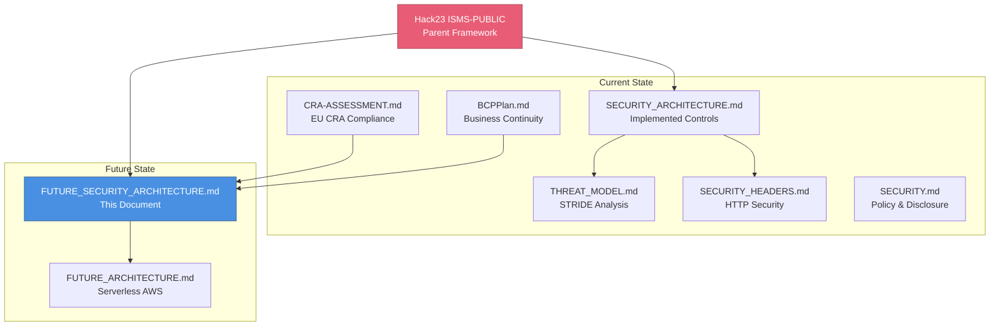
```mermaid
graph TD
    ISMS[Hack23 ISMS-PUBLIC<br/>Parent Framework]

    subgraph "Current State"
        SA[SECURITY_ARCHITECTURE.md<br/>Implemented Controls]
        TM[THREAT_MODEL.md<br/>STRIDE Analysis]
        SH[SECURITY_HEADERS.md<br/>HTTP Security]
        SEC[SECURITY.md<br/>Policy & Disclosure]
        CRA[CRA-ASSESSMENT.md<br/>EU CRA Compliance]
        BCP[BCPPlan.md<br/>Business Continuity]
    end

    subgraph "Future State"
        FSA[FUTURE_SECURITY_ARCHITECTURE.md<br/>This Document]
        FA[FUTURE_ARCHITECTURE.md<br/>Serverless AWS]
    end

    ISMS --> SA
    ISMS --> FSA
    SA --> TM
    SA --> SH
    FSA --> FA
    CRA --> FSA
    BCP --> FSA

    style FSA fill:#4A90E2,stroke:#2E5C8A,color:#fff
    style ISMS fill:#E85D75,stroke:#A53F52,color:#fff
```

---

## 🔐 ISMS Policy Alignment

### Related ISMS Policies

The future security architecture aligns with the following Hack23 AB ISMS policies:

| Policy | Relevance | Control Areas | Link |
|--------|-----------|---------------|------|
| **Secure Development Policy** | Primary — SDLC security, DevSecOps, SLSA Level 3 | SDL, code signing, supply chain | [View](https://github.com/Hack23/ISMS-PUBLIC/blob/main/Secure_Development_Policy.md) |
| **Risk Management Policy** | Primary — Risk identification and treatment roadmap | Risk register, residual risk, PDCA | [View](https://github.com/Hack23/ISMS-PUBLIC/blob/main/Risk_Management_Policy.md) |
| **Access Control Policy** | Phase 1 — Authentication, RBAC, Cognito | IAM, least privilege, Zero Trust | [View](https://github.com/Hack23/ISMS-PUBLIC/blob/main/Access_Control_Policy.md) |
| **Incident Response Policy** | Phase 3-5 — SOC, automated response | IR playbooks, MTTD/MTTR SLAs | [View](https://github.com/Hack23/ISMS-PUBLIC/blob/main/Incident_Response_Policy.md) |
| **Open Source Policy** | Ongoing — Supply chain security | SBOM, license compliance, Scorecard | [View](https://github.com/Hack23/ISMS-PUBLIC/blob/main/Open_Source_Policy.md) |

### Security Control Implementation Roadmap

The following table maps ISO 27001 / NIST CSF 2.0 controls to implementation phases:

| Control Domain | ISO 27001 Clause | NIST CSF | Current State | Target Phase | Target State |
|----------------|------------------|----------|---------------|-------------|--------------|
| **Identity Management** | A.9.2 | PR.AA | API key (planned) | Phase 1 | OAuth 2.0 + Cognito |
| **Access Control** | A.9.4 | PR.AA | Rate limiting | Phase 1 | RBAC + Attribute-based |
| **Cryptography** | A.10.1 | PR.DS | TLS 1.3 | Phase 2 | AWS KMS + envelope encryption |
| **Network Security** | A.13.1 | PR.IR | None (local) | Phase 2 | VPC + WAF + Network Firewall |
| **Vulnerability Management** | A.12.6 | ID.RA | Dependabot + CodeQL | Phase 2-3 | Automated scanning + patching SLA |
| **Security Monitoring** | A.12.4 | DE.AE | CloudWatch logs | Phase 2 | GuardDuty + Security Hub + SIEM |
| **Incident Response** | A.16.1 | RS.RP | Manual | Phase 3 | Automated playbooks + Step Functions |
| **Supplier Security** | A.15.2 | ID.SC | Dependabot | Phase 2 | SLSA Level 3 + SBOM attestation |
| **Compliance** | A.18.1 | GV.RM | Manual audit | Phase 7 | Automated compliance (AWS Audit Manager) |
| **Data Protection** | A.8.2 | PR.DS | Minimal caching | Phase 2 | KMS + DLP + data classification |
| **Business Continuity** | A.17.1 | RC.RP | Stateless design | Phase 2 | Multi-region + RTO/RPO targets |
| **Physical Security** | A.11.1 | PR.IR | Cloud-managed | Phase 2 | AWS data center controls |

### GDPR Alignment Roadmap

| GDPR Article | Requirement | Current State | Future Target |
|-------------|-------------|---------------|---------------|
| **Art. 25** | Privacy by Design | Minimal data collection | DLP + automated PII detection |
| **Art. 32** | Security of Processing | TLS + validation | End-to-end encryption + KMS |
| **Art. 33** | Breach Notification | Manual process | Automated detection + 72h notification pipeline |
| **Art. 35** | DPIA | Manual assessment | Automated DPIA triggers |
| **Art. 44** | International Transfers | N/A (EU data) | SCCs + transfer impact assessments |

---

## 🎯 Executive Overview

### Strategic Security Vision

The European Parliament MCP Server is evolving from a secure open-source MCP tool into an enterprise-grade serverless intelligence platform on AWS. This document defines the security architecture roadmap for that transition, ensuring that every phase of growth is matched by commensurate security controls.

### Business Context

The server provides structured access to European Parliament open datasets — MEP profiles, plenary votes, committee activities, legislative procedures, and parliamentary questions. Future enhancements include **10 OSINT intelligence tools** for political risk assessment, coalition analysis, and legislative effectiveness tracking. This sensitive analytical capability demands a security architecture that:

1. **Protects EP data integrity** — Parliamentary data must be accurate and tamper-evident
2. **Ensures GDPR compliance** — MEP personal data (contact info, voting records) requires careful handling
3. **Prevents unauthorized analytics abuse** — Rate limiting and authentication prevent bulk harvesting
4. **Supports EU CRA compliance** — Future product liability requirements under the Cyber Resilience Act
5. **Enables enterprise customers** — Organizations, think tanks, and journalists require SLA-backed reliability

### Architecture Evolution Summary

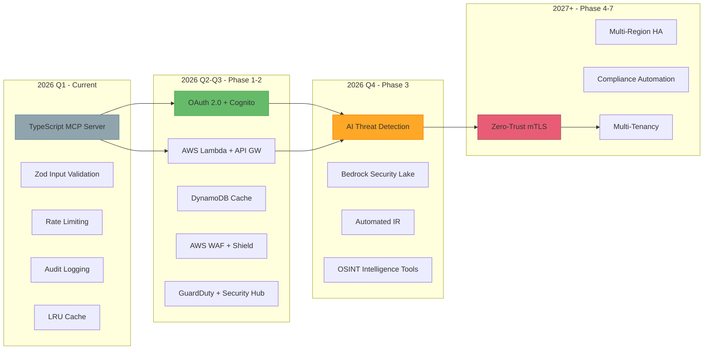
```mermaid
graph LR
    subgraph "2026 Q1 - Current"
        C1[TypeScript MCP Server]
        C2[Zod Input Validation]
        C3[Rate Limiting]
        C4[Audit Logging]
        C5[LRU Cache]
    end

    subgraph "2026 Q2-Q3 - Phase 1-2"
        P1[OAuth 2.0 + Cognito]
        P2[AWS Lambda + API GW]
        P3[DynamoDB Cache]
        P4[AWS WAF + Shield]
        P5[GuardDuty + Security Hub]
    end

    subgraph "2026 Q4 - Phase 3"
        P6[AI Threat Detection]
        P7[Bedrock Security Lake]
        P8[Automated IR]
        P9[OSINT Intelligence Tools]
    end

    subgraph "2027+ - Phase 4-7"
        P10[Zero-Trust mTLS]
        P11[Multi-Region HA]
        P12[Compliance Automation]
        P13[Multi-Tenancy]
    end

    C1 --> P1
    C1 --> P2
    P1 --> P6
    P2 --> P6
    P6 --> P10
    P10 --> P13

    style C1 fill:#90A4AE,stroke:#607D8B
    style P1 fill:#66BB6A,stroke:#43A047
    style P6 fill:#FFA726,stroke:#F57C00
    style P10 fill:#E85D75,stroke:#A53F52
```

### Key Security Principles

| Principle | Description | Implementation Phase |
|-----------|-------------|---------------------|
| **Least Privilege** | Every component gets minimum required access | Phase 1 (IAM roles) |
| **Defense in Depth** | Multiple overlapping security layers | Phase 1-2 |
| **Zero Trust** | Never trust, always verify — even internal traffic | Phase 4 |
| **Shift Left Security** | Security integrated into CI/CD pipeline | Ongoing |
| **Privacy by Design** | GDPR controls built into architecture | Phase 1-2 |
| **Immutable Infrastructure** | No mutable servers; Lambda + containers only | Phase 2 |
| **Continuous Compliance** | Automated compliance evidence collection | Phase 7 |

---

## 🎯 Vision Statement

Evolve the European Parliament MCP Server from a secure open-source tool to an enterprise-grade serverless platform with advanced authentication, comprehensive monitoring, and cloud-native security controls while maintaining transparency and GDPR compliance.

**Target State**: Production-ready serverless MCP server on AWS with OAuth 2.0 authentication via Cognito, multi-region deployment, automated threat response via GuardDuty + Step Functions, and comprehensive security analytics through Security Lake and Amazon Bedrock.

---

## 📊 Security Maturity Roadmap

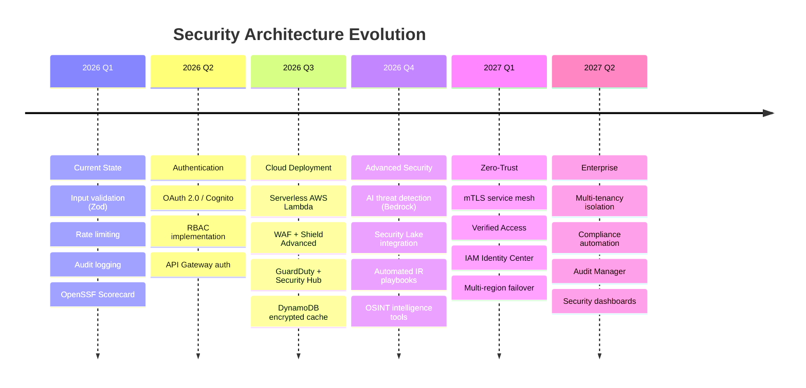
```mermaid
timeline
    title Security Architecture Evolution
    2026 Q1 : Current State
            : Input validation (Zod)
            : Rate limiting
            : Audit logging
            : OpenSSF Scorecard
    2026 Q2 : Authentication
            : OAuth 2.0 / Cognito
            : RBAC implementation
            : API Gateway auth
    2026 Q3 : Cloud Deployment
            : Serverless AWS Lambda
            : WAF + Shield Advanced
            : GuardDuty + Security Hub
            : DynamoDB encrypted cache
    2026 Q4 : Advanced Security
            : AI threat detection (Bedrock)
            : Security Lake integration
            : Automated IR playbooks
            : OSINT intelligence tools
    2027 Q1 : Zero-Trust
            : mTLS service mesh
            : Verified Access
            : IAM Identity Center
            : Multi-region failover
    2027 Q2 : Enterprise
            : Multi-tenancy isolation
            : Compliance automation
            : Audit Manager
            : Security dashboards
```

---

## 🔑 Phase 1: Authentication & Authorization (Q2 2026)

### OAuth 2.0 Integration with Amazon Cognito

**Implementation Plan**:

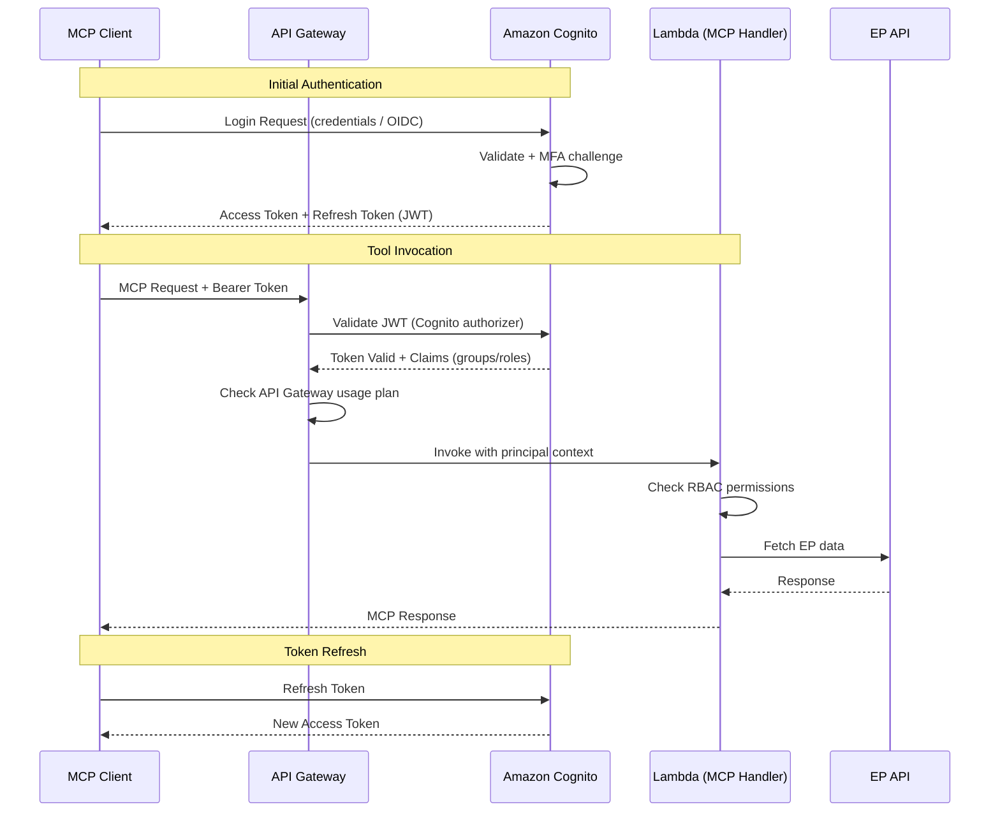
```mermaid
sequenceDiagram
    participant Client as MCP Client
    participant APIGW as API Gateway
    participant Cognito as Amazon Cognito
    participant Lambda as Lambda (MCP Handler)
    participant EP as EP API

    Note over Client,Cognito: Initial Authentication
    Client->>Cognito: Login Request (credentials / OIDC)
    Cognito->>Cognito: Validate + MFA challenge
    Cognito-->>Client: Access Token + Refresh Token (JWT)

    Note over Client,Lambda: Tool Invocation
    Client->>APIGW: MCP Request + Bearer Token
    APIGW->>Cognito: Validate JWT (Cognito authorizer)
    Cognito-->>APIGW: Token Valid + Claims (groups/roles)
    APIGW->>APIGW: Check API Gateway usage plan
    APIGW->>Lambda: Invoke with principal context
    Lambda->>Lambda: Check RBAC permissions
    Lambda->>EP: Fetch EP data
    EP-->>Lambda: Response
    Lambda-->>Client: MCP Response

    Note over Client,Cognito: Token Refresh
    Client->>Cognito: Refresh Token
    Cognito-->>Client: New Access Token
```

**Cognito User Pool Configuration**:

```typescript
// Future: Cognito User Pool setup
const userPool = {
  userPoolName: 'ep-mcp-server-users',
  policies: {
    passwordPolicy: {
      minimumLength: 12,
      requireUppercase: true,
      requireLowercase: true,
      requireNumbers: true,
      requireSymbols: true,
      temporaryPasswordValidityDays: 7,
    },
  },
  mfaConfiguration: 'OPTIONAL',
  enabledMfas: ['SOFTWARE_TOKEN_MFA', 'SMS_MFA'],
  accountRecoverySetting: {
    recoveryMechanisms: [{ name: 'verified_email', priority: 1 }],
  },
  deletionProtection: 'ACTIVE',
  advancedSecurityMode: 'ENFORCED', // Adaptive authentication
};
```

**RBAC Model**:
```typescript
enum Role {
  PUBLIC = 'public',          // Rate-limited (10 req/min), read-only MEP/session data
  RESEARCHER = 'researcher',  // Higher rate limits (100 req/min), analytics tools
  JOURNALIST = 'journalist',  // OSINT intelligence tools, briefing generation
  ADMIN = 'admin'             // Full access, config management, metrics
}

const permissions: Record<Role, string[]> = {
  [Role.PUBLIC]: ['get_meps', 'get_plenary_sessions', 'get_committees'],
  [Role.RESEARCHER]: ['*'],  // All standard tools
  [Role.JOURNALIST]: [
    '*',
    'generate_intelligence_briefing',
    'generate_political_risk_assessment',
    'analyze_coalition_dynamics'
  ],
  [Role.ADMIN]: ['*', 'admin:config', 'admin:metrics', 'admin:user_management']
};
```

### API Gateway Integration

| Feature | Configuration | Security Benefit |
|---------|--------------|-----------------|
| **Cognito Authorizer** | JWT validation on every request | Stateless auth |
| **Usage Plans** | Per-role rate limits + quotas | Abuse prevention |
| **API Keys** | Machine-to-machine clients | Service auth |
| **Resource Policies** | IP allowlisting for admin endpoints | Attack surface reduction |
| **WAF Integration** | Request inspection before Lambda | Pre-invocation filtering |
| **Request Validation** | Schema validation at gateway | Input validation layer |

---

## 🌐 Phase 2: Cloud-Native Security (Q3 2026)

### Serverless AWS Security Architecture

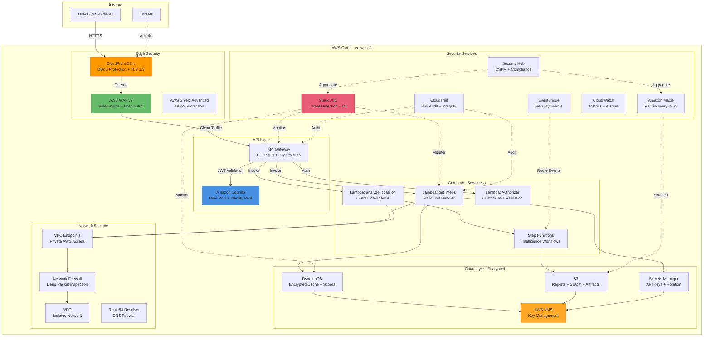
```mermaid
graph TB
    subgraph "Internet"
        USER[Users / MCP Clients]
        ATTACKER[Threats]
    end

    subgraph "AWS Cloud - eu-west-1"
        subgraph "Edge Security"
            CF[CloudFront CDN<br/>DDoS Protection + TLS 1.3]
            WAF[AWS WAF v2<br/>Rule Engine + Bot Control]
            SHIELD[AWS Shield Advanced<br/>DDoS Protection]
        end

        subgraph "API Layer"
            APIGW[API Gateway<br/>HTTP API + Cognito Auth]
            COGNITO[Amazon Cognito<br/>User Pool + Identity Pool]
        end

        subgraph "Compute - Serverless"
            L1[Lambda: get_meps<br/>MCP Tool Handler]
            L2[Lambda: analyze_coalition<br/>OSINT Intelligence]
            L3[Lambda: Authorizer<br/>Custom JWT Validation]
            SF[Step Functions<br/>Intelligence Workflows]
        end

        subgraph "Data Layer - Encrypted"
            DDB[DynamoDB<br/>Encrypted Cache + Scores]
            S3[S3<br/>Reports + SBOM + Artifacts]
            SM[Secrets Manager<br/>API Keys + Rotation]
            KMS[AWS KMS<br/>Key Management]
        end

        subgraph "Security Services"
            GD[GuardDuty<br/>Threat Detection + ML]
            SH[Security Hub<br/>CSPM + Compliance]
            MACIE[Amazon Macie<br/>PII Discovery in S3]
            CT[CloudTrail<br/>API Audit + Integrity]
            CW[CloudWatch<br/>Metrics + Alarms]
            EB[EventBridge<br/>Security Events]
        end

        subgraph "Network Security"
            VPC[VPC<br/>Isolated Network]
            VE[VPC Endpoints<br/>Private AWS Access]
            NF[Network Firewall<br/>Deep Packet Inspection]
            DNS_FW[Route53 Resolver<br/>DNS Firewall]
        end
    end

    USER -->|HTTPS| CF
    ATTACKER -.->|Attacks| CF
    CF -->|Filtered| WAF
    WAF -->|Clean Traffic| APIGW
    APIGW -->|JWT Validation| COGNITO
    APIGW -->|Invoke| L1
    APIGW -->|Invoke| L2
    APIGW -->|Auth| L3

    L1 --> DDB
    L1 --> SM
    L2 --> SF
    SF --> S3
    DDB --> KMS
    S3 --> KMS
    SM --> KMS

    L1 --> VE
    L2 --> VE
    VE --> NF
    NF --> VPC

    GD -.->|Monitor| APIGW
    GD -.->|Monitor| L1
    GD -.->|Monitor| DDB
    MACIE -.->|Scan PII| S3
    CT -.->|Audit| APIGW
    CT -.->|Audit| L1
    SH -.->|Aggregate| GD
    SH -.->|Aggregate| MACIE
    EB -.->|Route Events| SF

    style CF fill:#FF9900,stroke:#FF6600
    style WAF fill:#66BB6A,stroke:#43A047
    style GD fill:#E85D75,stroke:#A53F52
    style KMS fill:#FFA726,stroke:#F57C00
    style COGNITO fill:#4A90E2,stroke:#2E5C8A
```

**Security Enhancements**:

1. **AWS WAF v2 Rules for EP MCP**:
   - SQL injection prevention (EP API query parameters)
   - XSS protection (search inputs)
   - Rate limiting (per IP, per user, geographic)
   - IP reputation filtering (AWS managed rules)
   - Bot Control (automated scraping prevention)
   - Custom rules for MCP protocol patterns

2. **DDoS Protection**:
   - AWS Shield Advanced subscription
   - CloudFront edge absorption
   - API Gateway automatic throttling
   - Lambda concurrency limits per function

3. **Serverless Network Isolation**:
   - Lambda functions in VPC private subnets
   - VPC endpoints for DynamoDB, S3, Secrets Manager (no internet routing)
   - Security groups: Lambda → DynamoDB only, no inbound
   - Network Firewall for egress to EP API (domain allowlist)

4. **Encryption Everywhere**:
   - TLS 1.3 at CloudFront edge
   - DynamoDB encryption at rest with KMS CMK
   - S3 SSE-KMS with bucket key
   - Secrets Manager automatic rotation (30-day cycle)
   - Lambda environment variable encryption with KMS

---

## 🤖 Phase 3: AI-Powered Threat Detection (Q4 2026)

### Behavioral Analytics with Amazon Bedrock

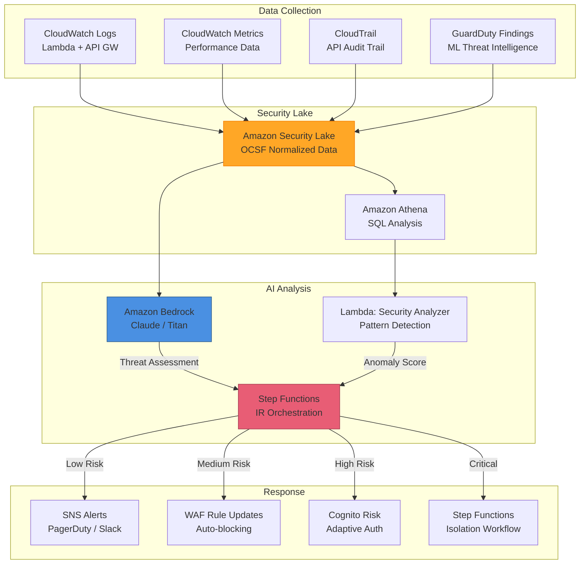
```mermaid
graph TB
    subgraph "Data Collection"
        LOGS[CloudWatch Logs<br/>Lambda + API GW]
        METRICS[CloudWatch Metrics<br/>Performance Data]
        AUDIT[CloudTrail<br/>API Audit Trail]
        GD_FINDINGS[GuardDuty Findings<br/>ML Threat Intelligence]
    end

    subgraph "Security Lake"
        SL[Amazon Security Lake<br/>OCSF Normalized Data]
        ATHENA[Amazon Athena<br/>SQL Analysis]
    end

    subgraph "AI Analysis"
        BEDROCK[Amazon Bedrock<br/>Claude / Titan]
        LAMBDA_AI[Lambda: Security Analyzer<br/>Pattern Detection]
        SF_IR[Step Functions<br/>IR Orchestration]
    end

    subgraph "Response"
        SNS[SNS Alerts<br/>PagerDuty / Slack]
        WAF_UPDATE[WAF Rule Updates<br/>Auto-blocking]
        COGNITO_RISK[Cognito Risk<br/>Adaptive Auth]
        SF_BLOCK[Step Functions<br/>Isolation Workflow]
    end

    LOGS --> SL
    METRICS --> SL
    AUDIT --> SL
    GD_FINDINGS --> SL

    SL --> ATHENA
    SL --> BEDROCK
    ATHENA --> LAMBDA_AI

    BEDROCK -->|Threat Assessment| SF_IR
    LAMBDA_AI -->|Anomaly Score| SF_IR

    SF_IR -->|Low Risk| SNS
    SF_IR -->|Medium Risk| WAF_UPDATE
    SF_IR -->|High Risk| COGNITO_RISK
    SF_IR -->|Critical| SF_BLOCK

    style BEDROCK fill:#4A90E2,stroke:#2E5C8A
    style SF_IR fill:#E85D75,stroke:#A53F52
    style SL fill:#FFA726,stroke:#F57C00
```

**ML-Based Detection for EP MCP Context**:

1. **Anomaly Detection**:
   - Unusual MEP data access patterns (bulk harvesting)
   - Abnormal political analysis query volumes
   - Geographic anomalies (unexpected access regions for EU data)
   - Time-based patterns (off-hours bulk downloads)
   - Coalition analysis abuse (competitive intelligence extraction)

2. **Threat Intelligence Integration**:
   - GuardDuty threat intelligence feeds
   - AWS Partner network IP reputation
   - CVE correlation with Lambda runtime
   - Known attack TTPs (MITRE ATT&CK)

3. **Automated Response Pipeline**:
```typescript
// Future: Step Functions IR workflow definition
interface ThreatResponse {
  severity: 'low' | 'medium' | 'high' | 'critical';
  finding: GuardDutyFinding | BedrockAnalysis;
  action: IRAction;
}

type IRAction =
  | { type: 'log'; destination: 'security-lake' }
  | { type: 'rate_limit'; userId: string; durationMinutes: number }
  | { type: 'block_ip'; ipAddress: string; wafRuleName: string }
  | { type: 'suspend_user'; cognitoUserId: string; notify: string[] }
  | { type: 'isolate'; lambdaArn: string; escalate: boolean };

// Step Functions state machine handles orchestration
const irWorkflow = {
  low: 'log-to-security-lake',
  medium: 'rate-limit-and-notify',
  high: 'block-and-suspend',
  critical: 'isolate-and-escalate',
};
```

---

## 🔒 Phase 4: Zero-Trust Architecture (Q1 2027)

### AWS Verified Access & mTLS

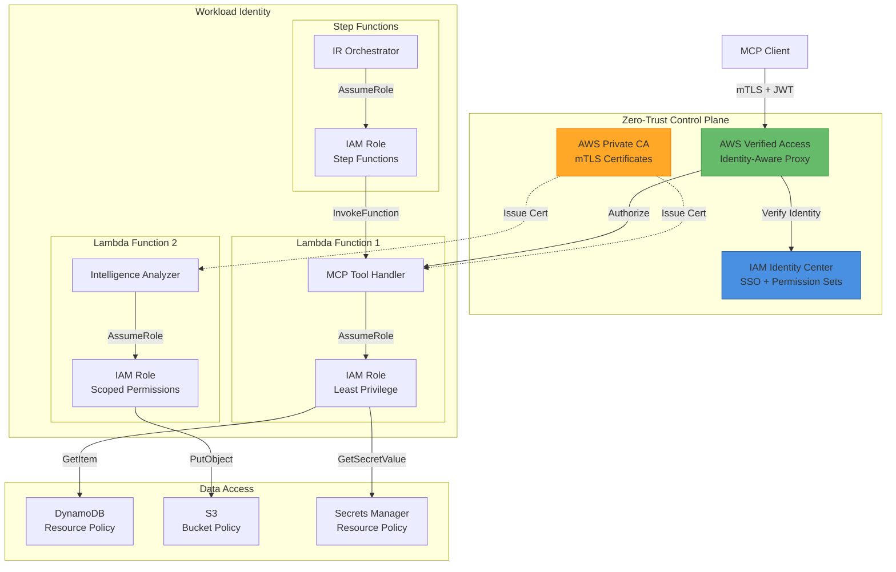
```mermaid
graph TB
    subgraph "Zero-Trust Control Plane"
        VA[AWS Verified Access<br/>Identity-Aware Proxy]
        IAM_IC[IAM Identity Center<br/>SSO + Permission Sets]
        CA[AWS Private CA<br/>mTLS Certificates]
    end

    subgraph "Workload Identity"
        subgraph "Lambda Function 1"
            L1[MCP Tool Handler]
            ROLE1[IAM Role<br/>Least Privilege]
        end

        subgraph "Lambda Function 2"
            L2[Intelligence Analyzer]
            ROLE2[IAM Role<br/>Scoped Permissions]
        end

        subgraph "Step Functions"
            SF[IR Orchestrator]
            ROLE3[IAM Role<br/>Step Functions]
        end
    end

    subgraph "Data Access"
        DDB[DynamoDB<br/>Resource Policy]
        S3[S3<br/>Bucket Policy]
        SM[Secrets Manager<br/>Resource Policy]
    end

    CLIENT[MCP Client] -->|mTLS + JWT| VA
    VA -->|Verify Identity| IAM_IC
    VA -->|Authorize| L1

    L1 -->|AssumeRole| ROLE1
    L2 -->|AssumeRole| ROLE2
    SF -->|AssumeRole| ROLE3

    ROLE1 -->|GetItem| DDB
    ROLE1 -->|GetSecretValue| SM
    ROLE2 -->|PutObject| S3
    ROLE3 -->|InvokeFunction| L1

    CA -.->|Issue Cert| L1
    CA -.->|Issue Cert| L2

    style VA fill:#66BB6A,stroke:#43A047
    style IAM_IC fill:#4A90E2,stroke:#2E5C8A
    style CA fill:#FFA726,stroke:#F57C00
```

**Zero-Trust Principles for Serverless EP MCP**:

1. **Never Trust, Always Verify**:
   - Cognito JWT validation on every API Gateway request
   - IAM role assumption with session tags
   - Resource-based policies on DynamoDB/S3
   - VPC endpoint policies restricting access to specific Lambda roles

2. **Least Privilege Access** (per Lambda function):
   - `get_meps` Lambda: DynamoDB `GetItem` on cache table only
   - `intelligence_analyzer` Lambda: S3 `PutObject` on reports prefix only
   - `ir_orchestrator` Step Functions: Lambda `InvokeFunction` on IR functions only
   - All functions: explicit deny for `*` actions

3. **Assume Breach**:
   - Lambda concurrency limits prevent blast radius expansion
   - DynamoDB condition expressions prevent unauthorized writes
   - CloudTrail integrity validation detects tampering
   - Automated containment via Step Functions on detection

**IAM Boundary Policy Example**:
```json
{
  "Version": "2012-10-17",
  "Statement": [
    {
      "Sid": "AllowEPMCPTools",
      "Effect": "Allow",
      "Action": [
        "dynamodb:GetItem",
        "dynamodb:PutItem",
        "dynamodb:Query"
      ],
      "Resource": "arn:aws:dynamodb:eu-west-1:*:table/ep-mcp-cache",
      "Condition": {
        "StringEquals": {
          "aws:RequestedRegion": "eu-west-1"
        }
      }
    },
    {
      "Sid": "DenyAllElse",
      "Effect": "Deny",
      "NotAction": [
        "dynamodb:GetItem",
        "dynamodb:PutItem",
        "dynamodb:Query",
        "secretsmanager:GetSecretValue",
        "logs:CreateLogGroup",
        "logs:CreateLogStream",
        "logs:PutLogEvents"
      ],
      "Resource": "*"
    }
  ]
}
```

---

## 📊 Phase 5: Advanced Monitoring & Analytics (Q1 2027)

### Observability Stack

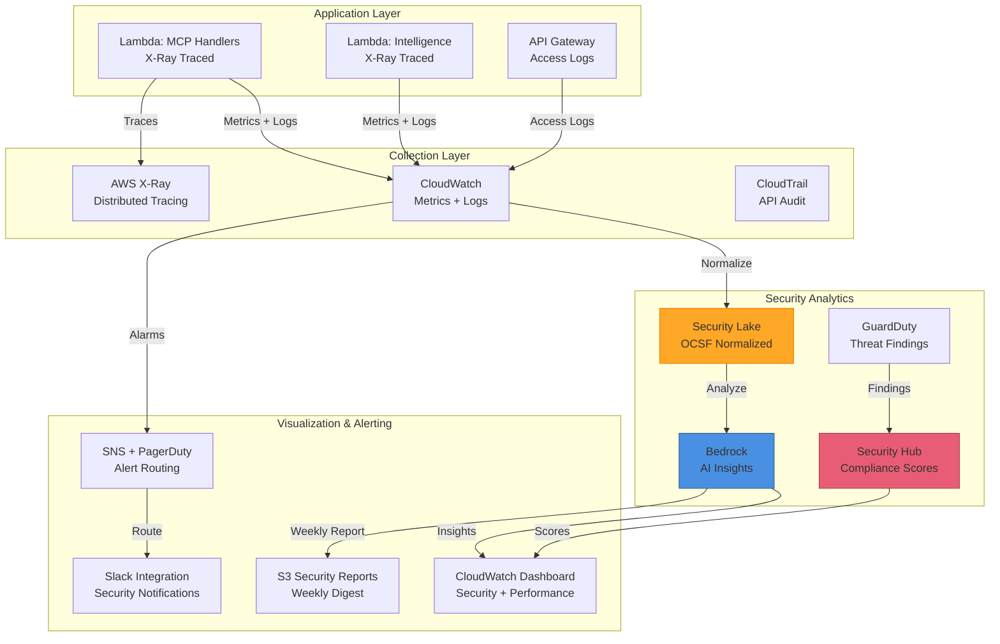
```mermaid
graph TB
    subgraph "Application Layer"
        L1[Lambda: MCP Handlers<br/>X-Ray Traced]
        L2[Lambda: Intelligence<br/>X-Ray Traced]
        APIGW[API Gateway<br/>Access Logs]
    end

    subgraph "Collection Layer"
        CW[CloudWatch<br/>Metrics + Logs]
        XRAY[AWS X-Ray<br/>Distributed Tracing]
        CT[CloudTrail<br/>API Audit]
    end

    subgraph "Security Analytics"
        SL[Security Lake<br/>OCSF Normalized]
        GD[GuardDuty<br/>Threat Findings]
        SH[Security Hub<br/>Compliance Scores]
        BEDROCK[Bedrock<br/>AI Insights]
    end

    subgraph "Visualization & Alerting"
        CW_DASH[CloudWatch Dashboard<br/>Security + Performance]
        SNS[SNS + PagerDuty<br/>Alert Routing]
        SLACK[Slack Integration<br/>Security Notifications]
        REPORT[S3 Security Reports<br/>Weekly Digest]
    end

    L1 -->|Metrics + Logs| CW
    L2 -->|Metrics + Logs| CW
    L1 -->|Traces| XRAY
    APIGW -->|Access Logs| CW
    CW -->|Normalize| SL

    GD -->|Findings| SH
    SH -->|Scores| CW_DASH
    SL -->|Analyze| BEDROCK
    BEDROCK -->|Insights| CW_DASH

    CW -->|Alarms| SNS
    SNS -->|Route| SLACK
    BEDROCK -->|Weekly Report| REPORT

    style SL fill:#FFA726,stroke:#F57C00
    style BEDROCK fill:#4A90E2,stroke:#2E5C8A
    style SH fill:#E85D75,stroke:#A53F52
```

**Security Metrics**:

1. **Authentication & Authorization**:
   - Cognito authentication success/failure rates by user pool
   - API Gateway 4xx/5xx rates by endpoint and user
   - JWT validation failures (potential token replay attacks)
   - RBAC authorization denials by role and tool

2. **Threat Detection**:
   - GuardDuty finding counts by severity (Critical/High/Medium/Low)
   - Anomaly score distribution (Bedrock behavioral analysis)
   - WAF block rates by rule group
   - Shield DDoS event frequency

3. **EP Data Access Metrics**:
   - Tool invocation counts by type (get_meps, analyze_coalition, etc.)
   - Cache hit/miss rates for EP API responses
   - EP API error rates and latency percentiles (p50, p95, p99)
   - OSINT intelligence tool usage patterns

4. **Compliance Metrics**:
   - Security Hub compliance score (CIS AWS Foundations, NIST CSF)
   - Failed compliance checks by control
   - GDPR data retention policy adherence (cache TTL violations)
   - Vulnerability remediation SLA adherence

---

## 🏢 Phase 6: Multi-Tenancy & Enterprise Features (Q2 2027)

### Tenant Isolation Architecture

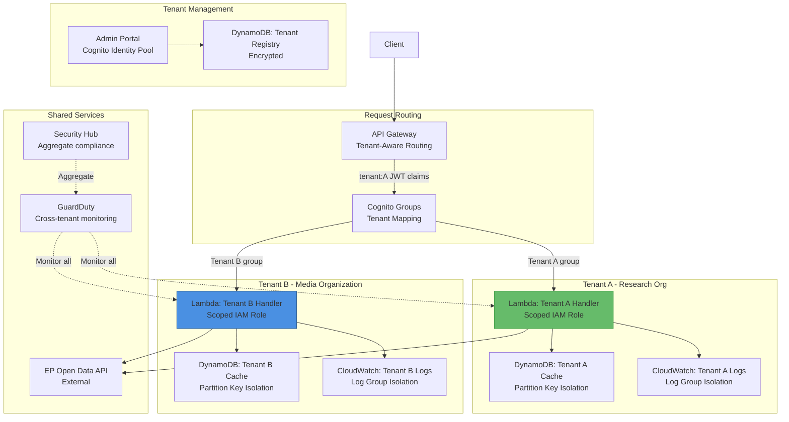
```mermaid
graph TB
    subgraph "Tenant Management"
        PORTAL[Admin Portal<br/>Cognito Identity Pool]
        TENANT_DB[DynamoDB: Tenant Registry<br/>Encrypted]
    end

    subgraph "Request Routing"
        APIGW[API Gateway<br/>Tenant-Aware Routing]
        COGNITO[Cognito Groups<br/>Tenant Mapping]
    end

    subgraph "Tenant A - Research Org"
        L_A[Lambda: Tenant A Handler<br/>Scoped IAM Role]
        DDB_A[DynamoDB: Tenant A Cache<br/>Partition Key Isolation]
        CW_A[CloudWatch: Tenant A Logs<br/>Log Group Isolation]
    end

    subgraph "Tenant B - Media Organization"
        L_B[Lambda: Tenant B Handler<br/>Scoped IAM Role]
        DDB_B[DynamoDB: Tenant B Cache<br/>Partition Key Isolation]
        CW_B[CloudWatch: Tenant B Logs<br/>Log Group Isolation]
    end

    subgraph "Shared Services"
        EP_API[EP Open Data API<br/>External]
        GD[GuardDuty<br/>Cross-tenant monitoring]
        SH[Security Hub<br/>Aggregate compliance]
    end

    PORTAL --> TENANT_DB
    CLIENT[Client] --> APIGW
    APIGW -->|tenant:A JWT claims| COGNITO
    COGNITO -->|Tenant A group| L_A
    COGNITO -->|Tenant B group| L_B

    L_A --> DDB_A
    L_A --> CW_A
    L_A --> EP_API

    L_B --> DDB_B
    L_B --> CW_B
    L_B --> EP_API

    GD -.->|Monitor all| L_A
    GD -.->|Monitor all| L_B
    SH -.->|Aggregate| GD

    style L_A fill:#66BB6A,stroke:#43A047
    style L_B fill:#4A90E2,stroke:#2E5C8A
```

**Multi-Tenancy Security Controls**:

1. **Data Isolation**:
   - DynamoDB partition key includes tenant ID: `TENANT#{tenantId}#MEP#{mepId}`
   - IAM conditions enforce tenant-scoped access: `dynamodb:LeadingKeys` condition
   - S3 prefix-based isolation: `s3://ep-mcp-reports/{tenantId}/`
   - CloudWatch Log Groups per tenant: `/aws/lambda/ep-mcp/{tenantId}/`

2. **Tenant Configuration**:
```typescript
interface TenantConfig {
  id: string;
  name: string;
  plan: 'free' | 'pro' | 'enterprise';
  limits: {
    requestsPerMinute: number;
    requestsPerDay: number;
    intelligenceToolsEnabled: boolean;
    osintReportRetentionDays: number;
  };
  security: {
    requireMFA: boolean;
    allowedIPRanges: string[];
    dataResidency: 'eu-west-1' | 'eu-central-1';
    encryptionTier: 'standard' | 'enhanced-kms-cmk';
    auditLogRetentionDays: number;
  };
  gdpr: {
    dataProcessingAgreement: boolean;
    dpContactEmail: string;
    consentTrackingEnabled: boolean;
  };
}
```

---

## 🔍 Phase 7: Compliance Automation (Q3 2027)

### Continuous Compliance Monitoring

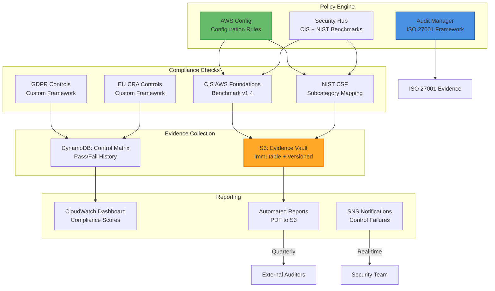
```mermaid
graph TB
    subgraph "Policy Engine"
        CONFIG[AWS Config<br/>Configuration Rules]
        AM[Audit Manager<br/>ISO 27001 Framework]
        SH[Security Hub<br/>CIS + NIST Benchmarks]
    end

    subgraph "Compliance Checks"
        CIS[CIS AWS Foundations<br/>Benchmark v1.4]
        NIST[NIST CSF<br/>Subcategory Mapping]
        GDPR_C[GDPR Controls<br/>Custom Framework]
        CRA_C[EU CRA Controls<br/>Custom Framework]
    end

    subgraph "Evidence Collection"
        S3_EV[S3: Evidence Vault<br/>Immutable + Versioned]
        DDB_EV[DynamoDB: Control Matrix<br/>Pass/Fail History]
    end

    subgraph "Reporting"
        DASH[CloudWatch Dashboard<br/>Compliance Scores]
        REPORT[Automated Reports<br/>PDF to S3]
        NOTIFY[SNS Notifications<br/>Control Failures]
    end

    CONFIG --> CIS
    CONFIG --> NIST
    AM --> ISO[ISO 27001 Evidence]
    SH --> CIS
    SH --> NIST

    CIS --> S3_EV
    NIST --> S3_EV
    GDPR_C --> DDB_EV
    CRA_C --> DDB_EV

    S3_EV --> REPORT
    DDB_EV --> DASH
    REPORT -->|Quarterly| AUDITOR[External Auditors]
    NOTIFY -->|Real-time| SECTEAM[Security Team]

    style CONFIG fill:#66BB6A,stroke:#43A047
    style AM fill:#4A90E2,stroke:#2E5C8A
    style S3_EV fill:#FFA726,stroke:#F57C00
```

**Policy as Code for GDPR Compliance**:
```python
# AWS Config custom rule: GDPR cache TTL enforcement
def evaluate_compliance(configuration_item, rule_parameters):
    """Check DynamoDB TTL settings comply with GDPR 15-minute cache limit."""
    if configuration_item['resourceType'] != 'AWS::DynamoDB::Table':
        return 'NOT_APPLICABLE'

    table_config = configuration_item['configuration']
    ttl_spec = table_config.get('timeToLiveSpecification', {})

    if not ttl_spec.get('enabled', False):
        return {
            'complianceType': 'NON_COMPLIANT',
            'annotation': 'DynamoDB table missing TTL — GDPR data retention risk'
        }

    return {'complianceType': 'COMPLIANT', 'annotation': 'TTL enabled per GDPR policy'}
```

---

## 💾 Data Protection & Encryption Roadmap

### Multi-Layer Encryption Architecture

```mermaid
graph TB
    subgraph "Data Classification"
        PUB[Public EP Data<br/>MEP names, votes, sessions]
        PII[Personal Data (GDPR Art. 4)<br/>MEP contact info, addresses]
        INTEL[Intelligence Reports<br/>Political risk assessments]
        AUDIT_D[Audit Logs<br/>Access + activity records]
    end

    subgraph "Encryption Controls"
        TLS[TLS 1.3<br/>Transit encryption]
        KMS_CMK[KMS Customer Managed Key<br/>EP-MCP-DataKey]
        KMS_AWS[KMS AWS Managed Key<br/>Service integration]
        DLP[Amazon Macie<br/>PII Detection + DLP]
    end

    subgraph "Storage"
        DDB[DynamoDB<br/>SSE with KMS CMK]
        S3[S3<br/>SSE-KMS + Bucket Key]
        CW_L[CloudWatch Logs<br/>KMS encrypted]
        SM_V[Secrets Manager<br/>Envelope encryption]
    end

    PUB -->|TLS| TLS
    PII -->|TLS + KMS CMK| KMS_CMK
    INTEL -->|TLS + KMS CMK| KMS_CMK
    AUDIT_D -->|TLS + KMS AWS| KMS_AWS

    TLS --> DDB
    KMS_CMK --> DDB
    KMS_CMK --> S3
    KMS_AWS --> CW_L
    KMS_CMK --> SM_V

    DLP -.->|Scan for PII| S3
    DLP -.->|Alert on exposure| SNS[SNS Alert]

    style KMS_CMK fill:#E85D75,stroke:#A53F52
    style DLP fill:#FFA726,stroke:#F57C00
    style PII fill:#FF9900,stroke:#FF6600
```

### Data Classification Matrix

| Data Type | Classification | Encryption | Retention | GDPR Basis |
|-----------|---------------|------------|-----------|------------|
| **MEP public profiles** | Public | TLS transit | Cache 15 min | Art. 6(1)(e) — Public interest |
| **MEP contact details** | Personal Data | KMS CMK + TLS | Cache 5 min | Art. 6(1)(e) + DPbD |
| **Voting records** | Public | TLS transit | Cache 1 hr | Art. 6(1)(e) — Public interest |
| **Political risk reports** | Confidential | KMS CMK + TLS | 90 days tenant | Art. 6(1)(f) — Legitimate interest |
| **Authentication tokens** | Confidential | KMS + Cognito | Session only | Security processing |
| **Audit logs** | Internal | KMS AWS | 90 days | Art. 5(2) Accountability |
| **EP API credentials** | Secret | Secrets Manager | Rotation 30d | Security processing |

### Future KMS Architecture

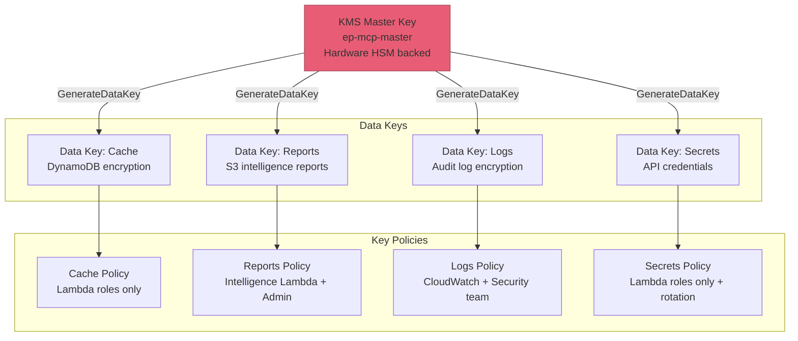
```mermaid
graph TD
    MASTER[KMS Master Key<br/>ep-mcp-master<br/>Hardware HSM backed]

    subgraph "Data Keys"
        DK1[Data Key: Cache<br/>DynamoDB encryption]
        DK2[Data Key: Reports<br/>S3 intelligence reports]
        DK3[Data Key: Logs<br/>Audit log encryption]
        DK4[Data Key: Secrets<br/>API credentials]
    end

    subgraph "Key Policies"
        P1[Cache Policy<br/>Lambda roles only]
        P2[Reports Policy<br/>Intelligence Lambda + Admin]
        P3[Logs Policy<br/>CloudWatch + Security team]
        P4[Secrets Policy<br/>Lambda roles only + rotation]
    end

    MASTER -->|GenerateDataKey| DK1
    MASTER -->|GenerateDataKey| DK2
    MASTER -->|GenerateDataKey| DK3
    MASTER -->|GenerateDataKey| DK4

    DK1 --> P1
    DK2 --> P2
    DK3 --> P3
    DK4 --> P4

    style MASTER fill:#E85D75,stroke:#A53F52
```

### Amazon Macie — EP Data PII Protection

**Macie Configuration for EP MCP**:

| Macie Finding Type | EP MCP Application | Response |
|-------------------|-------------------|----------|
| **Email addresses in S3** | MEP contact exports | Alert + mask in report |
| **Personal identifiers** | Passport/ID numbers in docs | Block + escalate |
| **Financial data** | Budget vote documents | Review + classify |
| **Credentials** | Accidentally stored API keys | Immediate alert + rotate |
| **Names in bulk** | MEP list exports | Audit + rate-limit |

---

## 🔐 Identity & Access Management Evolution

### IAM Identity Center Architecture (Future)

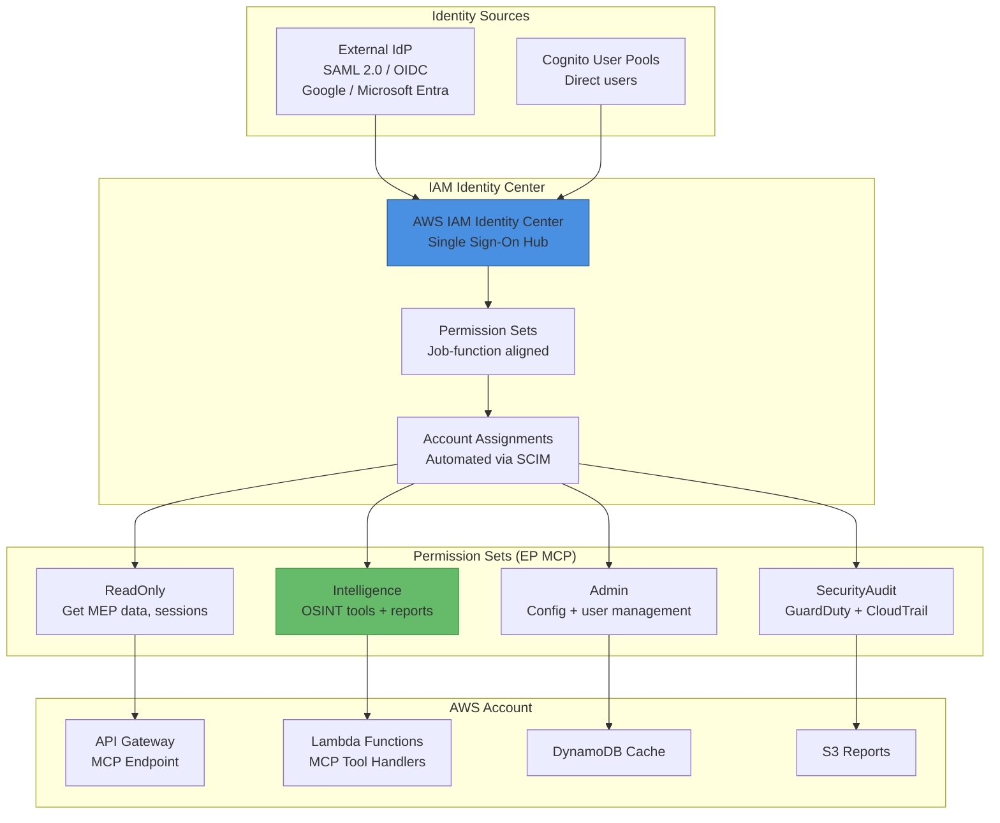
```mermaid
graph TB
    subgraph "Identity Sources"
        EXT_IDP[External IdP<br/>SAML 2.0 / OIDC<br/>Google / Microsoft Entra]
        COGNITO[Cognito User Pools<br/>Direct users]
    end

    subgraph "IAM Identity Center"
        SSO[AWS IAM Identity Center<br/>Single Sign-On Hub]
        PERM[Permission Sets<br/>Job-function aligned]
        ASSIGN[Account Assignments<br/>Automated via SCIM]
    end

    subgraph "Permission Sets (EP MCP)"
        PS_READ[ReadOnly<br/>Get MEP data, sessions]
        PS_INTEL[Intelligence<br/>OSINT tools + reports]
        PS_ADMIN[Admin<br/>Config + user management]
        PS_SEC[SecurityAudit<br/>GuardDuty + CloudTrail]
    end

    subgraph "AWS Account"
        APIGW[API Gateway<br/>MCP Endpoint]
        LAMBDA[Lambda Functions<br/>MCP Tool Handlers]
        DDB[DynamoDB Cache]
        S3[S3 Reports]
    end

    EXT_IDP --> SSO
    COGNITO --> SSO
    SSO --> PERM
    PERM --> ASSIGN

    ASSIGN --> PS_READ
    ASSIGN --> PS_INTEL
    ASSIGN --> PS_ADMIN
    ASSIGN --> PS_SEC

    PS_READ --> APIGW
    PS_INTEL --> LAMBDA
    PS_ADMIN --> DDB
    PS_SEC --> S3

    style SSO fill:#4A90E2,stroke:#2E5C8A
    style PS_INTEL fill:#66BB6A,stroke:#43A047
```

### Privileged Access Management

| Access Type | Current | Phase 1 | Phase 4 |
|-------------|---------|---------|---------|
| **Developer access** | GitHub Actions OIDC | IAM Identity Center + SSO | Just-in-time via IAM JIT |
| **CI/CD pipeline** | GitHub OIDC federation | OIDC + permission boundary | Signed SLSA provenance |
| **Admin operations** | Manual IAM | Permission sets + MFA | Break-glass + audit trail |
| **Lambda execution** | IAM role | IAM role + VPC endpoint | Role + session tags |
| **Emergency access** | Direct IAM | Break-glass account | PIM + approval workflow |

### SCIM Provisioning for Enterprise Tenants

```typescript
// Future: SCIM 2.0 user provisioning integration
interface SCIMUserProvision {
  schemas: ['urn:ietf:params:scim:schemas:core:2.0:User'];
  userName: string; // email
  name: { givenName: string; familyName: string };
  emails: [{ value: string; primary: true }];
  'urn:ietf:params:scim:schemas:extension:enterprise:2.0:User': {
    organization: string;
    department: string;
  };
  // EP MCP custom extension
  'urn:hack23:ep-mcp:User': {
    tenantId: string;
    allowedTools: string[];
    dataResidency: 'eu-west-1' | 'eu-central-1';
  };
}
```

---

## 🌐 Network & DNS Security Architecture

### VPC Architecture for EP MCP Serverless

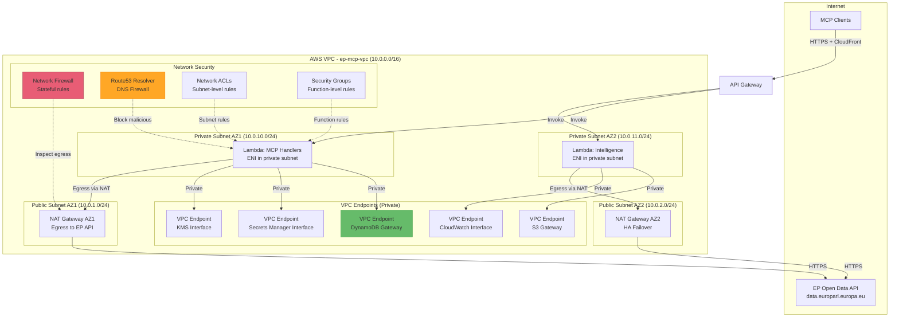
```mermaid
graph TB
    subgraph "Internet"
        USERS[MCP Clients]
        EP_API_EXT[EP Open Data API<br/>data.europarl.europa.eu]
    end

    subgraph "AWS VPC - ep-mcp-vpc (10.0.0.0/16)"
        subgraph "Public Subnet AZ1 (10.0.1.0/24)"
            NATGW1[NAT Gateway AZ1<br/>Egress to EP API]
        end

        subgraph "Public Subnet AZ2 (10.0.2.0/24)"
            NATGW2[NAT Gateway AZ2<br/>HA Failover]
        end

        subgraph "Private Subnet AZ1 (10.0.10.0/24)"
            LAMBDA1[Lambda: MCP Handlers<br/>ENI in private subnet]
        end

        subgraph "Private Subnet AZ2 (10.0.11.0/24)"
            LAMBDA2[Lambda: Intelligence<br/>ENI in private subnet]
        end

        subgraph "VPC Endpoints (Private)"
            VE_DDB[VPC Endpoint<br/>DynamoDB Gateway]
            VE_S3[VPC Endpoint<br/>S3 Gateway]
            VE_SM[VPC Endpoint<br/>Secrets Manager Interface]
            VE_KMS[VPC Endpoint<br/>KMS Interface]
            VE_CW[VPC Endpoint<br/>CloudWatch Interface]
        end

        subgraph "Network Security"
            NF[Network Firewall<br/>Stateful rules]
            DNS_FW[Route53 Resolver<br/>DNS Firewall]
            NACL[Network ACLs<br/>Subnet-level rules]
            SG[Security Groups<br/>Function-level rules]
        end
    end

    USERS -->|HTTPS + CloudFront| APIGW[API Gateway]
    APIGW -->|Invoke| LAMBDA1
    APIGW -->|Invoke| LAMBDA2

    LAMBDA1 -->|Private| VE_DDB
    LAMBDA1 -->|Private| VE_SM
    LAMBDA1 -->|Private| VE_KMS
    LAMBDA2 -->|Private| VE_S3
    LAMBDA2 -->|Private| VE_CW

    LAMBDA1 -->|Egress via NAT| NATGW1
    LAMBDA2 -->|Egress via NAT| NATGW2
    NATGW1 -->|HTTPS| EP_API_EXT
    NATGW2 -->|HTTPS| EP_API_EXT

    NF -.->|Inspect egress| NATGW1
    DNS_FW -.->|Block malicious| LAMBDA1
    NACL -.->|Subnet rules| LAMBDA1
    SG -.->|Function rules| LAMBDA1

    style NF fill:#E85D75,stroke:#A53F52
    style DNS_FW fill:#FFA726,stroke:#F57C00
    style VE_DDB fill:#66BB6A,stroke:#43A047
```

### Network Firewall Rules for EP MCP

| Rule Group | Direction | Protocol | Destination | Action | Rationale |
|------------|-----------|----------|-------------|--------|-----------|
| **AllowEPAPI** | Egress | HTTPS/443 | data.europarl.europa.eu | ALLOW | EP API access |
| **AllowAWS** | Egress | HTTPS/443 | *.amazonaws.com | ALLOW | AWS service calls |
| **DenyHTTP** | Egress | HTTP/80 | Any | DROP | Force HTTPS |
| **BlockMalicious** | Both | Any | Threat intel list | DROP | Known bad actors |
| **DenyUnknownEgress** | Egress | Any | Any | DROP | Default deny |
| **AllowDNS** | Egress | UDP/53 | Route53 Resolver | ALLOW | DNS resolution |

### Route53 DNS Firewall Configuration

```yaml
# Future: Route53 Resolver DNS Firewall rule group
DNSFirewallRuleGroup:
  Name: ep-mcp-dns-firewall
  Rules:
    - Name: BlockMalwareDomains
      Priority: 100
      Action: BLOCK
      BlockResponse: NODATA
      FirewallDomainListId: !Ref AWSManagedMalwareDomains

    - Name: BlockBotnetDomains
      Priority: 200
      Action: BLOCK
      BlockResponse: NODATA
      FirewallDomainListId: !Ref AWSManagedBotnetDomains

    - Name: AllowEPAPI
      Priority: 300
      Action: ALLOW
      FirewallDomainList:
        Domains:
          - "data.europarl.europa.eu"
          - "*.europarl.europa.eu"

    - Name: AllowAWSServices
      Priority: 400
      Action: ALLOW
      FirewallDomainList:
        Domains:
          - "*.amazonaws.com"
          - "*.aws.amazon.com"

    - Name: DenyAll
      Priority: 65000
      Action: BLOCK
      BlockResponse: NXDOMAIN
```

### Security Group Configuration

| Security Group | Inbound | Outbound | Applied To |
|----------------|---------|----------|------------|
| **sg-lambda-tools** | None (no inbound for Lambda) | 443 → EP API endpoint | MCP Tool Lambdas |
| **sg-lambda-intelligence** | None | 443 → AWS services, EP API | Intelligence Lambdas |
| **sg-vpc-endpoints** | 443 from sg-lambda-* | None | VPC Endpoint ENIs |
| **sg-nat-gateway** | None (managed) | Any → Internet | NAT Gateways |

---

## 🔍 Vulnerability Management Program

### Vulnerability Lifecycle Pipeline

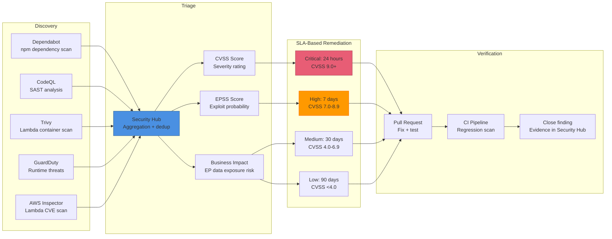
```mermaid
graph LR
    subgraph "Discovery"
        DEP[Dependabot<br/>npm dependency scan]
        CODEQL[CodeQL<br/>SAST analysis]
        TRIVY[Trivy<br/>Lambda container scan]
        GD_VULN[GuardDuty<br/>Runtime threats]
        INSPECTOR[AWS Inspector<br/>Lambda CVE scan]
    end

    subgraph "Triage"
        CVSS[CVSS Score<br/>Severity rating]
        EPSS[EPSS Score<br/>Exploit probability]
        BIZ[Business Impact<br/>EP data exposure risk]
        SH_AGG[Security Hub<br/>Aggregation + dedup]
    end

    subgraph "SLA-Based Remediation"
        CRIT[Critical: 24 hours<br/>CVSS 9.0+]
        HIGH[High: 7 days<br/>CVSS 7.0-8.9]
        MED[Medium: 30 days<br/>CVSS 4.0-6.9]
        LOW[Low: 90 days<br/>CVSS <4.0]
    end

    subgraph "Verification"
        PR[Pull Request<br/>Fix + test]
        CI[CI Pipeline<br/>Regression scan]
        CLOSE[Close finding<br/>Evidence in Security Hub]
    end

    DEP --> SH_AGG
    CODEQL --> SH_AGG
    TRIVY --> SH_AGG
    GD_VULN --> SH_AGG
    INSPECTOR --> SH_AGG

    SH_AGG --> CVSS
    SH_AGG --> EPSS
    SH_AGG --> BIZ

    CVSS --> CRIT
    EPSS --> HIGH
    BIZ --> MED
    BIZ --> LOW

    CRIT --> PR
    HIGH --> PR
    MED --> PR
    LOW --> PR

    PR --> CI
    CI --> CLOSE

    style CRIT fill:#E85D75,stroke:#A53F52
    style HIGH fill:#FF9900,stroke:#FF6600
    style SH_AGG fill:#4A90E2,stroke:#2E5C8A
```

### Scanning Coverage Matrix

| Scanning Tool | Scope | Frequency | Integration | SLA Trigger |
|---------------|-------|-----------|-------------|-------------|
| **Dependabot** | npm packages | Daily | GitHub | Automatic PR |
| **CodeQL** | TypeScript source | Every PR + weekly | GitHub Actions | PR block if critical |
| **Trivy** | Lambda container image | Every build | CI/CD | Build fail if critical |
| **AWS Inspector** | Lambda functions (runtime) | Continuous | Security Hub | SNS alert |
| **GuardDuty** | AWS API calls + network | Continuous | Security Hub | Step Functions IR |
| **Macie** | S3 data (PII discovery) | Weekly + on write | Security Hub | SNS alert |
| **OWASP ZAP** | API Gateway endpoints | Weekly | CI/CD (scheduled) | GitHub issue |

### Patch Management SLAs

| Severity | CVSS Range | SLA | Escalation | Evidence Required |
|----------|-----------|-----|------------|-------------------|
| **Critical** | 9.0–10.0 | 24 hours | CISO + CTO | CVE fix commit + re-scan |
| **High** | 7.0–8.9 | 7 days | Security Lead | Dependabot PR merge |
| **Medium** | 4.0–6.9 | 30 days | Engineering | PR with fix |
| **Low** | 0.1–3.9 | 90 days | Backlog | Next sprint inclusion |
| **Informational** | 0.0 | Best effort | None | Optional |

### Supply Chain Security (SLSA Level 3 Target)

```yaml
# Future: GitHub Actions SLSA provenance generation
- name: Generate SLSA Provenance
  uses: slsa-framework/slsa-github-generator/.github/workflows/generator_generic_slsa3.yml@v1
  with:
    base64-subjects: "${{ needs.build.outputs.hashes }}"
    upload-assets: true

# SBOM generation for EP MCP lambda packages
- name: Generate SBOM
  run: |
    npx @cyclonedx/cyclonedx-npm --output-format JSON \
      --output-file sbom.json
    aws s3 cp sbom.json s3://ep-mcp-security/sbom/$(date +%Y%m%d)/sbom.json
```

---

## ⚙️ Configuration & Compliance Management

### AWS Config for EP MCP

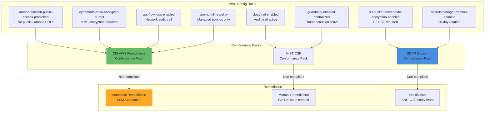
```mermaid
graph TB
    subgraph "AWS Config Rules"
        R1[lambda-function-public-access-prohibited<br/>No public Lambda URLs]
        R2[dynamodb-table-encrypted-at-rest<br/>KMS encryption required]
        R3[s3-bucket-server-side-encryption-enabled<br/>S3 SSE required]
        R4[cloudtrail-enabled<br/>Audit trail active]
        R5[guardduty-enabled-centralized<br/>Threat detection active]
        R6[secretsmanager-rotation-enabled<br/>30-day rotation]
        R7[vpc-flow-logs-enabled<br/>Network audit trail]
        R8[iam-no-inline-policy<br/>Managed policies only]
    end

    subgraph "Conformance Packs"
        CIS_PACK[CIS AWS Foundations<br/>Conformance Pack]
        NIST_PACK[NIST CSF<br/>Conformance Pack]
        GDPR_PACK[GDPR Custom<br/>Conformance Pack]
    end

    subgraph "Remediation"
        AUTO_REM[Automatic Remediation<br/>SSM Automation]
        MANUAL_REM[Manual Remediation<br/>GitHub Issue created]
        NOTIFY_REM[Notification<br/>SNS → Security team]
    end

    R1 --> CIS_PACK
    R2 --> CIS_PACK
    R3 --> GDPR_PACK
    R4 --> NIST_PACK
    R5 --> NIST_PACK
    R6 --> GDPR_PACK
    R7 --> CIS_PACK
    R8 --> CIS_PACK

    CIS_PACK -->|Non-compliant| AUTO_REM
    NIST_PACK -->|Non-compliant| MANUAL_REM
    GDPR_PACK -->|Non-compliant| NOTIFY_REM

    style CIS_PACK fill:#66BB6A,stroke:#43A047
    style GDPR_PACK fill:#4A90E2,stroke:#2E5C8A
    style AUTO_REM fill:#FFA726,stroke:#F57C00
```

### AWS Audit Manager — Compliance Frameworks

| Framework | Controls Mapped | Evidence Sources | Review Cadence |
|-----------|----------------|-----------------|----------------|
| **CIS AWS Foundations v1.4** | 43 controls | AWS Config, CloudTrail | Monthly |
| **NIST CSF v1.1** | 108 subcategories | Security Hub, GuardDuty | Quarterly |
| **ISO 27001 (custom)** | 114 controls | Config, IAM Analyzer | Bi-annually |
| **GDPR (custom)** | 32 articles mapped | Macie, Config, Lambda logs | Quarterly |
| **EU CRA (custom)** | 25 requirements | SBOM, CodeQL, Dependabot | Quarterly |

### Configuration Drift Detection

```typescript
// Future: Lambda function triggered by AWS Config changes
export const configChangeHandler = async (event: ConfigChangeEvent) => {
  const change = event.configurationItemDiff;

  // Check for security-sensitive configuration changes
  const securityRelevantChanges = [
    'securityGroups',
    'iamInstanceProfile',
    'environmentVariables',  // Lambda env vars (potential secret exposure)
    'vpcConfig',
    'kmsKeyArn',
  ];

  const hasSecurityChange = securityRelevantChanges.some(
    key => change.changedProperties[key]
  );

  if (hasSecurityChange) {
    await sendSecurityAlert({
      severity: 'HIGH',
      resource: event.configurationItem.resourceId,
      changes: change.changedProperties,
      actor: event.configurationItem.relatedEvents[0]?.principalId,
    });
  }
};
```

---

## 🧠 AI-Augmented Security Operations

### Amazon Bedrock Security Intelligence for EP MCP

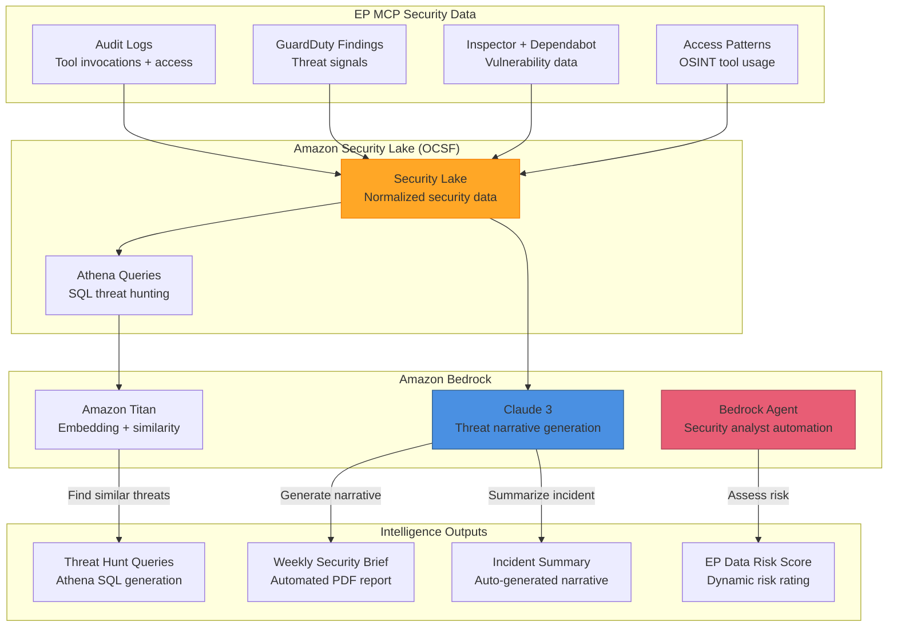
```mermaid
graph TB
    subgraph "EP MCP Security Data"
        AUDIT_L[Audit Logs<br/>Tool invocations + access]
        THREAT_F[GuardDuty Findings<br/>Threat signals]
        VULN_D[Inspector + Dependabot<br/>Vulnerability data]
        ACCESS_P[Access Patterns<br/>OSINT tool usage]
    end

    subgraph "Amazon Security Lake (OCSF)"
        SL[Security Lake<br/>Normalized security data]
        ATHENA_Q[Athena Queries<br/>SQL threat hunting]
    end

    subgraph "Amazon Bedrock"
        CLAUDE[Claude 3<br/>Threat narrative generation]
        TITAN[Amazon Titan<br/>Embedding + similarity]
        AGENT[Bedrock Agent<br/>Security analyst automation]
    end

    subgraph "Intelligence Outputs"
        WEEKLY[Weekly Security Brief<br/>Automated PDF report]
        HUNT[Threat Hunt Queries<br/>Athena SQL generation]
        RISK_SCORE[EP Data Risk Score<br/>Dynamic risk rating]
        INCIDENT[Incident Summary<br/>Auto-generated narrative]
    end

    AUDIT_L --> SL
    THREAT_F --> SL
    VULN_D --> SL
    ACCESS_P --> SL

    SL --> ATHENA_Q
    SL --> CLAUDE
    ATHENA_Q --> TITAN

    CLAUDE -->|Generate narrative| WEEKLY
    CLAUDE -->|Summarize incident| INCIDENT
    TITAN -->|Find similar threats| HUNT
    AGENT -->|Assess risk| RISK_SCORE

    style CLAUDE fill:#4A90E2,stroke:#2E5C8A
    style SL fill:#FFA726,stroke:#F57C00
    style AGENT fill:#E85D75,stroke:#A53F52
```

### Bedrock Security Use Cases for EP MCP

| Use Case | Bedrock Model | Input | Output | Benefit |
|----------|--------------|-------|--------|---------|
| **Weekly security briefing** | Claude 3 Sonnet | Security Lake OCSF events | Narrative PDF report | Executive-ready summary |
| **Threat hunting query generation** | Claude 3 Haiku | Threat hypothesis | Athena SQL queries | Accelerate investigation |
| **Incident narrative** | Claude 3 Sonnet | GuardDuty finding + context | Plain-language summary | Faster triage |
| **Anomaly explanation** | Claude 3 Haiku | Statistical anomaly | Human-readable explanation | Reduce alert fatigue |
| **OSINT abuse detection** | Titan Embeddings | Tool invocation sequences | Similarity score vs benign baseline | Political scraping detection |
| **Compliance gap analysis** | Claude 3 Opus | Control matrix + audit evidence | Gap assessment narrative | ISO 27001 preparation |

### Security Lake OCSF Schema for EP MCP

```json
{
  "ocsf_version": "1.0.0",
  "class_uid": 3002,
  "category_uid": 3,
  "activity_id": 1,
  "severity_id": 2,
  "time": "2026-06-15T14:32:00Z",
  "metadata": {
    "product": {
      "name": "European Parliament MCP Server",
      "vendor_name": "Hack23 AB",
      "version": "1.5.0"
    }
  },
  "actor": {
    "user": {
      "name": "researcher@example.org",
      "uid": "cognito-user-id-xyz",
      "groups": [{"name": "researcher"}]
    },
    "session": {
      "uid": "session-abc-123",
      "is_mfa": true
    }
  },
  "api": {
    "service": {"name": "ep-mcp-server"},
    "operation": "analyze_coalition_dynamics",
    "response": {"code": 200}
  },
  "http_request": {
    "url": {"path": "/mcp/v1/tools/analyze_coalition_dynamics"},
    "http_method": "POST"
  },
  "cloud": {
    "provider": "AWS",
    "region": "eu-west-1",
    "account": {"uid": "123456789012"}
  }
}
```

---

## 🚨 Security Operations Center

### SOC Architecture for EP MCP

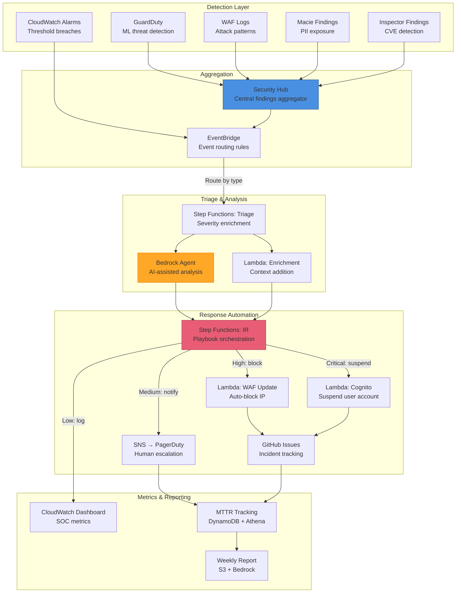
```mermaid
graph TB
    subgraph "Detection Layer"
        GD[GuardDuty<br/>ML threat detection]
        WAFLOG[WAF Logs<br/>Attack patterns]
        CW_ALARM[CloudWatch Alarms<br/>Threshold breaches]
        MACIE_F[Macie Findings<br/>PII exposure]
        INSP_F[Inspector Findings<br/>CVE detection]
    end

    subgraph "Aggregation"
        SH[Security Hub<br/>Central findings aggregator]
        EB[EventBridge<br/>Event routing rules]
    end

    subgraph "Triage & Analysis"
        SF_TRIAGE[Step Functions: Triage<br/>Severity enrichment]
        BEDROCK_A[Bedrock Agent<br/>AI-assisted analysis]
        LAMBDA_ENRICH[Lambda: Enrichment<br/>Context addition]
    end

    subgraph "Response Automation"
        SF_IR[Step Functions: IR<br/>Playbook orchestration]
        WAF_UPDATE[Lambda: WAF Update<br/>Auto-block IP]
        COGNITO_LOCK[Lambda: Cognito<br/>Suspend user account]
        SNS_PAGE[SNS → PagerDuty<br/>Human escalation]
        JIRA[GitHub Issues<br/>Incident tracking]
    end

    subgraph "Metrics & Reporting"
        CW_DASH[CloudWatch Dashboard<br/>SOC metrics]
        WEEKLY_RPT[Weekly Report<br/>S3 + Bedrock]
        MTTR_TRACK[MTTR Tracking<br/>DynamoDB + Athena]
    end

    GD --> SH
    WAFLOG --> SH
    CW_ALARM --> EB
    MACIE_F --> SH
    INSP_F --> SH

    SH --> EB
    EB -->|Route by type| SF_TRIAGE

    SF_TRIAGE --> BEDROCK_A
    SF_TRIAGE --> LAMBDA_ENRICH
    BEDROCK_A --> SF_IR
    LAMBDA_ENRICH --> SF_IR

    SF_IR -->|Low: log| CW_DASH
    SF_IR -->|Medium: notify| SNS_PAGE
    SF_IR -->|High: block| WAF_UPDATE
    SF_IR -->|Critical: suspend| COGNITO_LOCK

    WAF_UPDATE --> JIRA
    COGNITO_LOCK --> JIRA
    SNS_PAGE --> MTTR_TRACK
    JIRA --> MTTR_TRACK

    MTTR_TRACK --> WEEKLY_RPT

    style SF_IR fill:#E85D75,stroke:#A53F52
    style SH fill:#4A90E2,stroke:#2E5C8A
    style BEDROCK_A fill:#FFA726,stroke:#F57C00
```

### Incident Response Playbooks

| Incident Type | Detection Source | Automated Response | Human Escalation | Target MTTD | Target MTTR |
|---------------|-----------------|-------------------|-----------------|------------|------------|
| **Credential compromise** | GuardDuty + Cognito | Suspend account, rotate secrets | Security Lead (P1) | 5 min | 1 hr |
| **DDoS attack** | Shield + CloudWatch | Scale Lambda + WAF rate rules | On-call engineer | 2 min | 30 min |
| **Data exfiltration (MEP data)** | Macie + GuardDuty | Block IP, suspend user | CISO + DPO | 10 min | 2 hr |
| **Critical CVE in runtime** | Inspector + Dependabot | Create P0 GitHub issue | Engineering Lead | 1 hr | 24 hr |
| **WAF rule breach** | WAF logs | Auto-block IP for 1 hr | On-call (if critical) | 1 min | 15 min |
| **Cognito account takeover** | Cognito + GuardDuty | Force MFA re-enrollment | Security Lead | 5 min | 2 hr |
| **Lambda function anomaly** | GuardDuty + X-Ray | Throttle function | Engineering (on-call) | 5 min | 1 hr |
| **PII exposure in S3** | Macie | Remove public access, alert | DPO + CISO | 15 min | 4 hr |

### Security Metrics & KPIs

| Metric | Target 2026 Q3 | Target 2027 | Measurement |
|--------|---------------|------------|-------------|
| **Mean Time to Detect (MTTD)** | < 30 min | < 5 min | GuardDuty finding time |
| **Mean Time to Respond (MTTR)** | < 4 hr | < 1 hr | Incident close time |
| **Critical vulnerability patching** | < 7 days | < 24 hr | Dependabot SLA adherence |
| **Security Hub compliance score** | > 80% | > 95% | CIS AWS Foundations |
| **WAF block effectiveness** | > 99% | > 99.9% | WAF sampled requests |
| **False positive rate** | < 10% | < 3% | GuardDuty suppression rate |
| **Authentication success rate** | > 99% | > 99.9% | Cognito metrics |
| **Zero-day incident count** | 0 | 0 | Security incidents |

### OWASP ASVS Compliance Roadmap

| ASVS Category | Level Target | Phase | Key Controls |
|---------------|-------------|-------|--------------|
| **V1: Architecture** | ASVS L2 | Phase 2 | Threat model, security architecture review |
| **V2: Authentication** | ASVS L2 | Phase 1 | Cognito + MFA + RBAC |
| **V3: Session Management** | ASVS L2 | Phase 1 | JWT + short-lived tokens |
| **V4: Access Control** | ASVS L2 | Phase 1 | RBAC + resource policies |
| **V5: Validation** | ASVS L2 | Current | Zod schema validation |
| **V7: Error Handling** | ASVS L2 | Phase 1 | Structured error responses |
| **V8: Data Protection** | ASVS L2 | Phase 2 | KMS + DLP + Macie |
| **V9: Communication** | ASVS L2 | Current | TLS 1.3 enforced |
| **V10: Malicious Code** | ASVS L2 | Phase 2 | CodeQL + Inspector |
| **V12: Files & Resources** | ASVS L2 | Phase 2 | S3 policies + Macie |
| **V14: Configuration** | ASVS L2 | Phase 2 | AWS Config + Config rules |

---

## 📈 Implementation Timeline

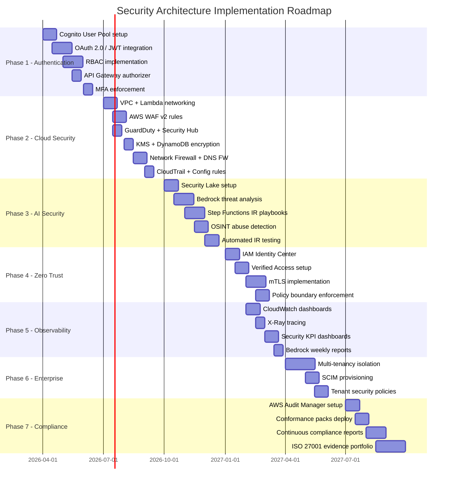
```mermaid
gantt
    title Security Architecture Implementation Roadmap
    dateFormat YYYY-MM-DD

    section Phase 1 - Authentication
    Cognito User Pool setup        :2026-04-01, 21d
    OAuth 2.0 / JWT integration    :2026-04-15, 30d
    RBAC implementation            :2026-05-01, 30d
    API Gateway authorizer         :2026-05-15, 14d
    MFA enforcement                :2026-06-01, 14d

    section Phase 2 - Cloud Security
    VPC + Lambda networking        :2026-07-01, 21d
    AWS WAF v2 rules              :2026-07-15, 21d
    GuardDuty + Security Hub       :2026-07-15, 14d
    KMS + DynamoDB encryption      :2026-08-01, 14d
    Network Firewall + DNS FW      :2026-08-15, 21d
    CloudTrail + Config rules      :2026-09-01, 14d

    section Phase 3 - AI Security
    Security Lake setup            :2026-10-01, 21d
    Bedrock threat analysis        :2026-10-15, 30d
    Step Functions IR playbooks    :2026-11-01, 30d
    OSINT abuse detection          :2026-11-15, 21d
    Automated IR testing           :2026-12-01, 21d

    section Phase 4 - Zero Trust
    IAM Identity Center            :2027-01-01, 21d
    Verified Access setup          :2027-01-15, 21d
    mTLS implementation            :2027-02-01, 30d
    Policy boundary enforcement    :2027-02-15, 21d

    section Phase 5 - Observability
    CloudWatch dashboards          :2027-02-01, 21d
    X-Ray tracing                  :2027-02-15, 14d
    Security KPI dashboards        :2027-03-01, 21d
    Bedrock weekly reports         :2027-03-15, 14d

    section Phase 6 - Enterprise
    Multi-tenancy isolation        :2027-04-01, 45d
    SCIM provisioning              :2027-05-01, 21d
    Tenant security policies       :2027-05-15, 21d

    section Phase 7 - Compliance
    AWS Audit Manager setup        :2027-07-01, 21d
    Conformance packs deploy       :2027-07-15, 21d
    Continuous compliance reports  :2027-08-01, 30d
    ISO 27001 evidence portfolio   :2027-08-15, 45d
```

---

## 💰 Investment & ROI

### Cost Breakdown (Annual AWS Spend)

| Phase | Component | Estimated Annual Cost | Security Benefit | ROI Metric |
|-------|-----------|----------------------|-----------------|------------|
| 1 | Cognito User Pool | $2,400 | Auth for 10K MAU | Prevent unauthorized access |
| 1 | API Gateway auth | $1,200 | JWT validation | Replace custom auth code |
| 2 | AWS WAF v2 | $3,600 | Web application firewall | Block 99%+ web attacks |
| 2 | Shield Advanced | $3,000/mo | DDoS protection | Prevent service outages |
| 2 | GuardDuty | $4,800 | ML threat detection | 5-min MTTD |
| 2 | Security Hub | $1,200 | CSPM + compliance | Centralized visibility |
| 2 | AWS Config | $2,400 | Configuration compliance | Drift detection |
| 2 | Macie | $1,800 | PII discovery | GDPR compliance |
| 3 | Bedrock (AI security) | $6,000 | AI threat analysis | 80% faster investigation |
| 3 | Security Lake | $3,600 | OCSF-normalized data | Threat hunting capability |
| 4 | IAM Identity Center | Included | Zero-trust SSO | Consolidated IAM |
| 5 | X-Ray + advanced CW | $2,400 | Full observability | 50% faster MTTR |
| 6 | Multi-tenant isolation | $12,000 | Tenant data protection | Enterprise readiness |
| 7 | Audit Manager | $3,600 | Automated evidence | Reduce audit cost 70% |

**Total Annual Investment**: ~$80,000  
**Expected Security Incident Prevention**: $500,000+ (average breach cost)  
**Audit Cost Reduction**: $50,000/year (automated vs. manual)  
**Enterprise Customer Revenue**: $200,000+ annually (security-required features)

---

## 🎯 Success Metrics

### Target KPIs (2027 Q4)

| Metric | Current | 2026 Q3 Target | 2027 Q4 Target | Status |
|--------|---------|---------------|---------------|--------|
| **Security Incidents** | 0 | 0 | 0 | 🎯 Maintain |
| **MTTD (Mean Time to Detect)** | N/A (no SOC) | < 30 min | < 5 min | 🚀 Build |
| **MTTR (Mean Time to Recovery)** | Manual (~days) | < 4 hr | < 1 hr | 🚀 Build |
| **Authentication Success Rate** | N/A | > 99% | > 99.9% | 🚀 New |
| **Security Hub Compliance Score** | N/A | > 75% | > 95% | 🚀 New |
| **Critical Vuln Patch SLA** | Best effort | < 7 days | < 24 hr | ⬆️ Improve |
| **Availability SLA** | ~99% | 99.9% | 99.99% | ⬆️ Improve |
| **OWASP ASVS Level** | L1 partial | L1 complete | L2 complete | ⬆️ Improve |
| **OpenSSF Scorecard** | > 7/10 | > 8/10 | > 9/10 | ⬆️ Improve |
| **GDPR Compliance Score** | 70% | 85% | 98% | ⬆️ Improve |
| **EU CRA Readiness** | 40% | 65% | 90% | ⬆️ Improve |
| **Enterprise Customers** | 0 | 5+ | 50+ | 🚀 New |

### Security Maturity Model Progression

| Domain | CMM Level Today | Target 2026 Q3 | Target 2027 Q4 |
|--------|----------------|---------------|---------------|
| **Identity & Access** | 1 - Initial | 3 - Defined | 4 - Managed |
| **Data Protection** | 2 - Repeatable | 3 - Defined | 4 - Managed |
| **Threat Detection** | 1 - Initial | 3 - Defined | 5 - Optimizing |
| **Incident Response** | 1 - Initial | 3 - Defined | 4 - Managed |
| **Vulnerability Mgmt** | 2 - Repeatable | 3 - Defined | 4 - Managed |
| **Compliance** | 1 - Initial | 2 - Repeatable | 4 - Managed |
| **Supply Chain** | 2 - Repeatable | 3 - Defined | 4 - Managed |

---

## 🔗 Related Documentation

| Document | Description | Link |
|----------|-------------|------|
| **SECURITY_ARCHITECTURE.md** | Current security implementation | [View](./SECURITY_ARCHITECTURE.md) |
| **ARCHITECTURE.md** | System architecture (C4 model) | [View](./ARCHITECTURE.md) |
| **FUTURE_ARCHITECTURE.md** | Serverless AWS architecture roadmap | [View](./FUTURE_ARCHITECTURE.md) |
| **SECURITY.md** | Security policy and vulnerability disclosure | [View](./SECURITY.md) |
| **THREAT_MODEL.md** | STRIDE threat model | [View](./THREAT_MODEL.md) |
| **CRA-ASSESSMENT.md** | EU Cyber Resilience Act assessment | [View](./CRA-ASSESSMENT.md) |
| **BCPPlan.md** | Business Continuity Plan | [View](./BCPPlan.md) |
| **Hack23 ISMS Policies** | ISO 27001 ISMS framework | [View](https://github.com/Hack23/ISMS-PUBLIC) |
| **Secure Development Policy** | SDL and DevSecOps policy | [View](https://github.com/Hack23/ISMS-PUBLIC/blob/main/Secure_Development_Policy.md) |
| **Risk Management Policy** | Risk identification and treatment | [View](https://github.com/Hack23/ISMS-PUBLIC/blob/main/Risk_Management_Policy.md) |
| **Access Control Policy** | IAM and authentication policy | [View](https://github.com/Hack23/ISMS-PUBLIC/blob/main/Access_Control_Policy.md) |
| **Incident Response Policy** | IR procedures and SLAs | [View](https://github.com/Hack23/ISMS-PUBLIC/blob/main/Incident_Response_Policy.md) |
| **Open Source Policy** | Supply chain governance | [View](https://github.com/Hack23/ISMS-PUBLIC/blob/main/Open_Source_Policy.md) |

---

<p align="center">
  <strong>Built with ❤️ by <a href="https://hack23.com">Hack23 AB</a></strong><br>
  <em>Transparent Security Roadmap demonstrating continuous improvement toward enterprise-grade AWS serverless security</em>
</p>
