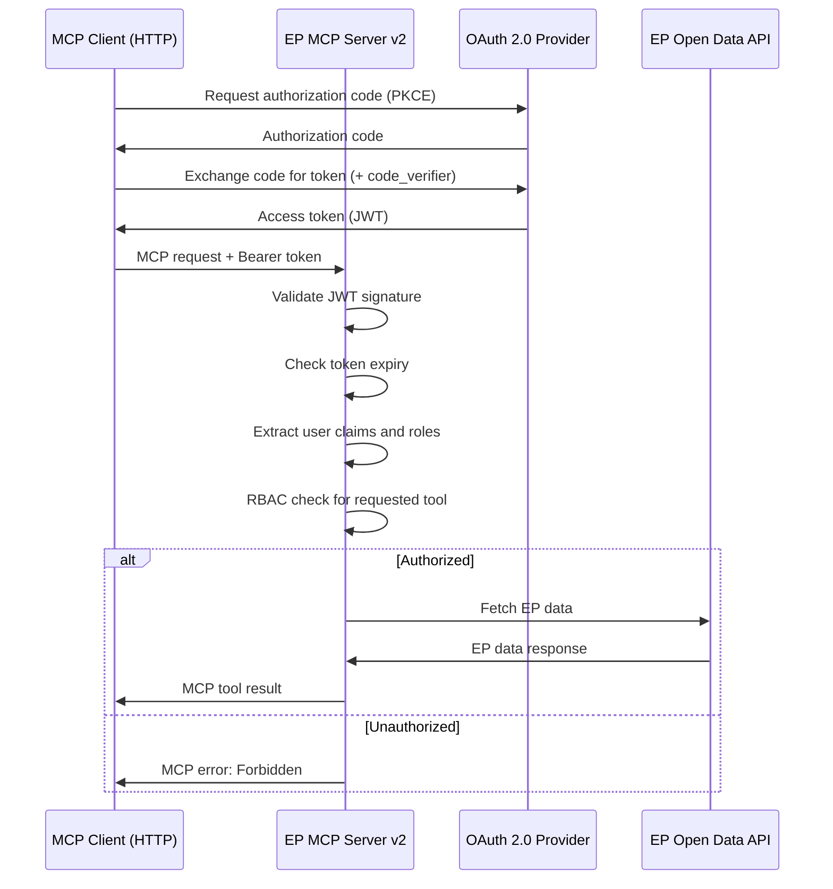
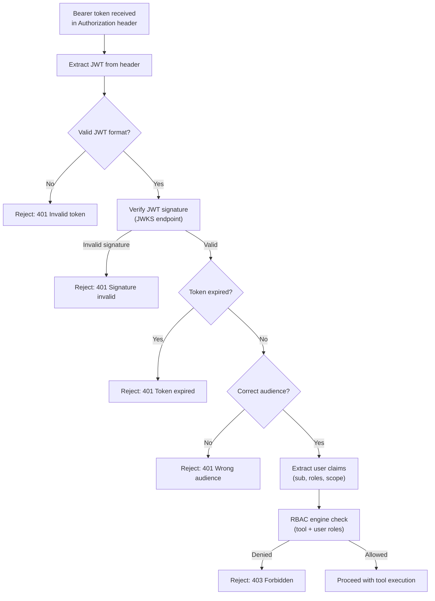
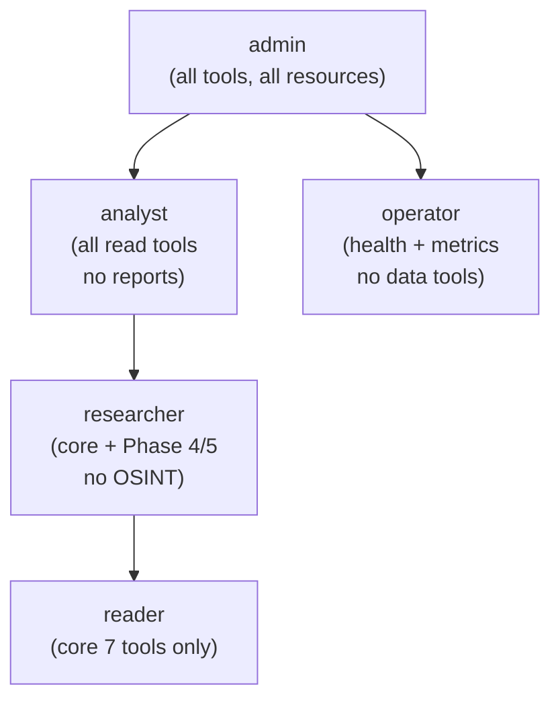
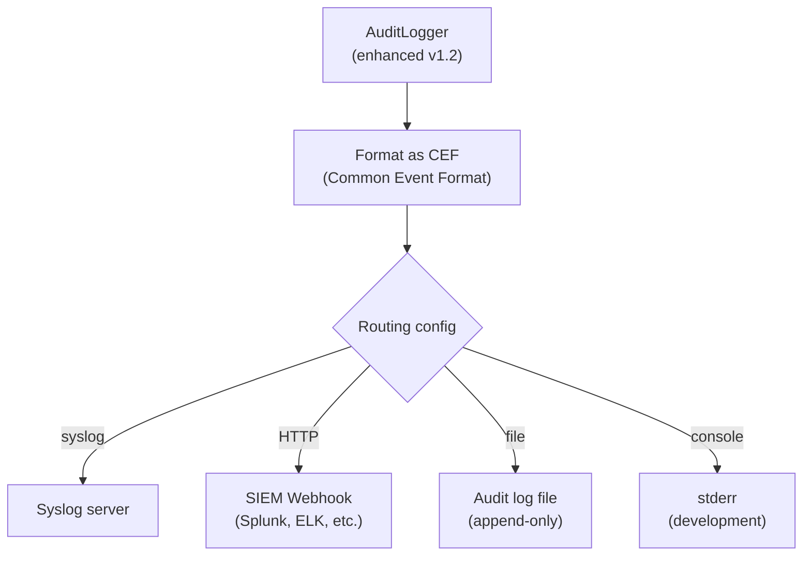
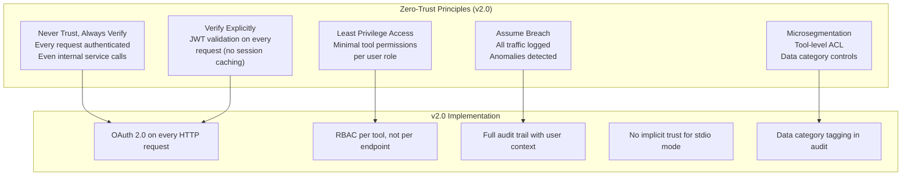

```mermaid
flowchart LR
    subgraph L1["Level 1 - v1.0 Current"]
        S1["4-layer defense\nZod + Rate + Audit + GDPR"]
        S2["Process isolation\n(stdio only)"]
        S3["TLS in transit\n(EP API)"]
        S4["Dependency scanning\n(Dependabot)"]
    end

    subgraph L2["Level 2 - v1.1 Q2 2026"]
        S5["OpenTelemetry\nobservability"]
        S6["Circuit breaker\nresilience"]
        S7["SBOM generation\n(CycloneDX)"]
        S8["SLSA Level 1\nbuild provenance"]
    end

    subgraph L3["Level 3 - v1.2 Q3 2026"]
        S9["mTLS for\nHTTP transport"]
        S10["API key auth\n(HTTP mode)"]
        S11["SIEM integration\n(audit export)"]
        S12["SLSA Level 2\nhosted build"]
    end

    subgraph L4["Level 4 - v2.0 Q4 2026"]
        S13["OAuth 2.0 OIDC\n(full identity)"]
        S14["Fine-grained RBAC\n(per-tool ACL)"]
        S15["Zero-trust\narchitecture"]
        S16["SLSA Level 3\nbuild isolation"]
    end

    L1 --> L2 --> L3 --> L4
```

<p align="center">
  
</p>

<h1 align="center">🔒 European Parliament MCP Server — Future Security Architecture</h1>

<p align="center">
  <strong>Security Roadmap: OAuth 2.0, RBAC, Zero-Trust, and Security Maturity Evolution</strong><br>
  <em>Planned security enhancements aligned with enterprise deployment requirements</em>
</p>

<p align="center">
  <a href="#"></a>
  <a href="#"></a>
  <a href="#"></a>
  <a href="#"></a>
</p>

**📋 Document Owner:** Hack23 | **📄 Version:** 1.0 | **📅 Last Updated:** 2026-02-26 (UTC)
**🔄 Review Cycle:** Quarterly | **⏰ Next Review:** 2026-05-26
**🏷️ Classification:** Public (Open Source MCP Server)
**✅ ISMS Compliance:** ISO 27001 (A.5.1, A.8.1, A.14.2), NIST CSF 2.0 (ID.AM, PR.DS), CIS Controls v8.1 (2.1, 16.1)

---

## 📑 Table of Contents

1. [Security Documentation Map](#security-documentation-map)
2. [Security Maturity Roadmap](#security-maturity-roadmap)
3. [OAuth 2.0 Integration Plan](#oauth-20-integration-plan)
4. [Fine-Grained RBAC Design](#fine-grained-rbac-design)
5. [Enhanced Audit Trails](#enhanced-audit-trails)
6. [Zero-Trust Architecture Evolution](#zero-trust-architecture-evolution)
7. [Security Controls Evolution Matrix](#security-controls-evolution-matrix)
8. [Compliance Roadmap](#compliance-roadmap)

---

## 🗺️ Security Documentation Map

| Document | Current | Future | Description |
|----------|---------|--------|-------------|
| **Architecture** | [ARCHITECTURE.md](./ARCHITECTURE.md) | [FUTURE_ARCHITECTURE.md](./FUTURE_ARCHITECTURE.md) | C4 model, containers, components, ADRs |
| **Security Architecture** | [SECURITY_ARCHITECTURE.md](./SECURITY_ARCHITECTURE.md) | [FUTURE_SECURITY_ARCHITECTURE.md](./FUTURE_SECURITY_ARCHITECTURE.md) | Security controls, threat model |
| **Data Model** | [DATA_MODEL.md](./DATA_MODEL.md) | [FUTURE_DATA_MODEL.md](./FUTURE_DATA_MODEL.md) | Entity relationships, branded types |
| **Flowchart** | [FLOWCHART.md](./FLOWCHART.md) | [FUTURE_FLOWCHART.md](./FUTURE_FLOWCHART.md) | Business process flows |
| **State Diagram** | [STATEDIAGRAM.md](./STATEDIAGRAM.md) | [FUTURE_STATEDIAGRAM.md](./FUTURE_STATEDIAGRAM.md) | System state transitions |
| **Mind Map** | [MINDMAP.md](./MINDMAP.md) | [FUTURE_MINDMAP.md](./FUTURE_MINDMAP.md) | System concepts and relationships |
| **SWOT Analysis** | [SWOT.md](./SWOT.md) | [FUTURE_SWOT.md](./FUTURE_SWOT.md) | Strategic positioning |

---

## 📈 Security Maturity Roadmap



---

## 🔑 OAuth 2.0 Integration Plan

### Target Version: v2.0 (Q4 2026)

OAuth 2.0 with PKCE flow is planned for the HTTP transport mode. The stdio transport remains unauthenticated for local development compatibility.

### Authorization Flow



### Token Validation Pipeline



### Supported OAuth Flows

| Flow | Use Case | v2.0 Support |
|------|----------|-------------|
| Authorization Code + PKCE | Web browser clients | ✅ Planned |
| Client Credentials | Server-to-server M2M | ✅ Planned |
| Device Code | CLI tools, IoT | 🔄 Considered |
| Implicit | Legacy (deprecated) | ❌ Not supported |

---

## 🛡️ Fine-Grained RBAC Design

### Role Hierarchy



### Tool Permission Matrix (Planned v2.0)

| Role | Core (7) | Advanced Analysis (3) | OSINT Phase 1-3 (13) | Phase 4-5 (19) | Admin Tools |
|------|----------|----------------------|---------------------|----------------|-------------|
| **admin** | ✅ | ✅ | ✅ | ✅ | ✅ |
| **analyst** | ✅ | ✅ | ✅ | ✅ | ❌ |
| **researcher** | ✅ | ❌ | ❌ | ✅ | ❌ |
| **reader** | ✅ | ❌ | ❌ | ❌ | ❌ |
| **operator** | ❌ | ❌ | ❌ | ❌ | ✅ |

### RBAC Engine Design

```typescript
// Planned v2.0 RBAC interface
interface RBACPolicy {
  roles: Role[];
  toolPermissions: Record<ToolName, Role[]>;
  resourcePermissions: Record<ResourceURI, Role[]>;
}

interface UserContext {
  sub: string;       // User identifier
  roles: Role[];     // Assigned roles
  scope: string[];   // OAuth scopes
  org?: string;      // Organization (for multi-tenant)
}

function checkToolAccess(
  toolName: ToolName,
  user: UserContext,
  policy: RBACPolicy
): boolean {
  const allowedRoles = policy.toolPermissions[toolName] ?? [];
  return user.roles.some(role => allowedRoles.includes(role));
}
```

---

## 📊 Enhanced Audit Trails

### v2.0 Audit Log Schema

```typescript
interface EnhancedAuditLogEntry {
  // Correlation
  traceId: string;           // OpenTelemetry trace ID
  spanId: string;            // OpenTelemetry span ID
  sessionId: string;         // MCP session identifier

  // Identity (v2.0 addition)
  userId: string;            // OAuth subject (hashed)
  orgId?: string;            // Organization (multi-tenant)
  roles: string[];           // User roles at time of access

  // Tool invocation
  timestamp: string;         // ISO 8601
  toolName: string;
  parameters: Record<string, unknown>;  // PII-stripped

  // Outcome
  resultStatus: 'success' | 'error' | 'rate_limited' | 'forbidden';
  durationMs: number;
  cacheHit: boolean;
  errorType?: string;

  // Data governance
  dataCategories: string[];  // 'mep_identity', 'vote_record', etc.
  gdprBasis: string;         // Legal basis for processing
  retentionPolicy: string;   // Applicable retention policy
}
```

### SIEM Integration (v1.2+)



---

## 🏰 Zero-Trust Architecture Evolution

### Zero-Trust Principles Applied to EP MCP Server



### Trust Model Evolution

| Version | stdio Trust | HTTP Trust | Inter-service Trust |
|---------|-------------|------------|---------------------|
| v1.0 | OS process isolation | N/A | DI container (implicit) |
| v1.2 | OS process isolation | API key validation | DI container (implicit) |
| v2.0 | OS process isolation | OAuth 2.0 JWT | mTLS + service accounts |

---

## 📋 Security Controls Evolution Matrix

| Control | v1.0 | v1.1 | v1.2 | v2.0 |
|---------|------|------|------|------|
| Input Validation | Zod schemas | Zod + stricter regex | Zod + custom validators | Zod + ML anomaly detection |
| Authentication | None (stdio isolation) | None | API key (HTTP) | OAuth 2.0 (HTTP) |
| Authorization | N/A | N/A | Route-level | Tool-level RBAC |
| Rate Limiting | 100/min global | 100/min + circuit breaker | Per-user limits | Per-role adaptive limits |
| Audit Logging | Structured JSON | OpenTelemetry | CEF + SIEM export | Enhanced with identity |
| Encryption in Transit | TLS (EP API) | TLS (EP API) | mTLS (HTTP transport) | mTLS everywhere |
| Secrets Management | env vars | env vars + vault hint | HashiCorp Vault support | Native vault integration |
| SBOM | npm lockfile | CycloneDX generated | CycloneDX + signed | SLSA Level 3 provenance |
| Vulnerability Scanning | Dependabot | Dependabot + Trivy | Trivy + CodeQL | Full DAST/SAST pipeline |

---

## 🎯 Compliance Roadmap

| Standard | v1.0 | v1.1 | v1.2 | v2.0 |
|---------|------|------|------|------|
| ISO 27001 | Partial (documentation) | A.12 monitoring | A.9 access control | Full certification ready |
| NIST CSF 2.0 | ID + PR | ID + PR + DE | ID + PR + DE + RS | All functions |
| CIS Controls v8.1 | Controls 2, 4, 8 | Controls 2, 4, 8, 7 | Controls 2, 4, 8, 7, 12 | Controls 1-18 |
| GDPR | Art. 5, 25 | Art. 5, 25, 30 | Art. 5, 25, 30, 32 | Full compliance |
| SLSA | None | Level 1 | Level 2 | Level 3 |
| SOC 2 Type II | N/A | N/A | Preparation | Ready for audit |

---

*This document represents planned security enhancements. See [SECURITY_ARCHITECTURE.md](./SECURITY_ARCHITECTURE.md) for currently implemented security controls.*
