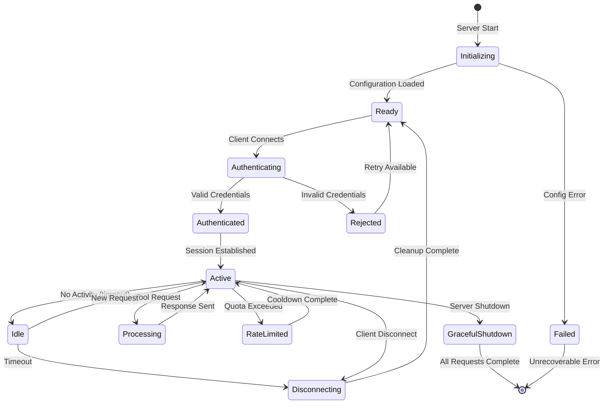
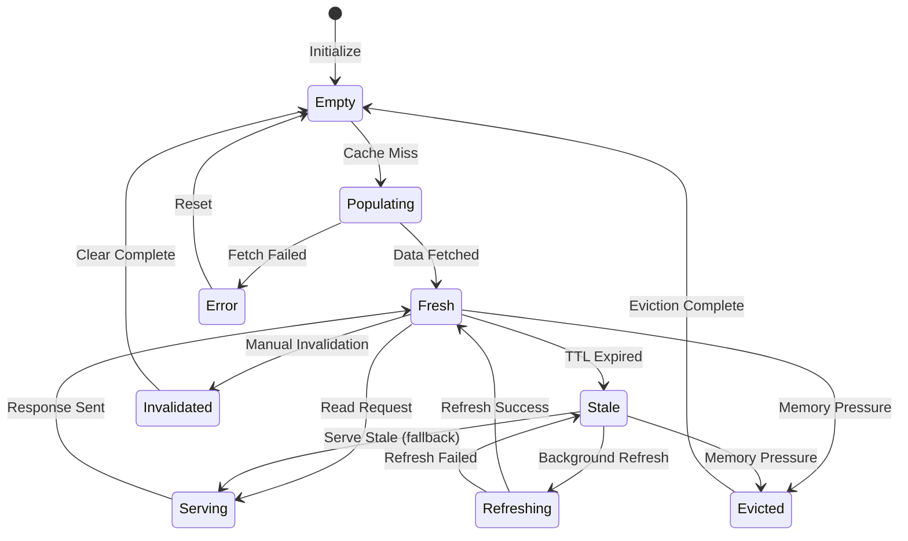
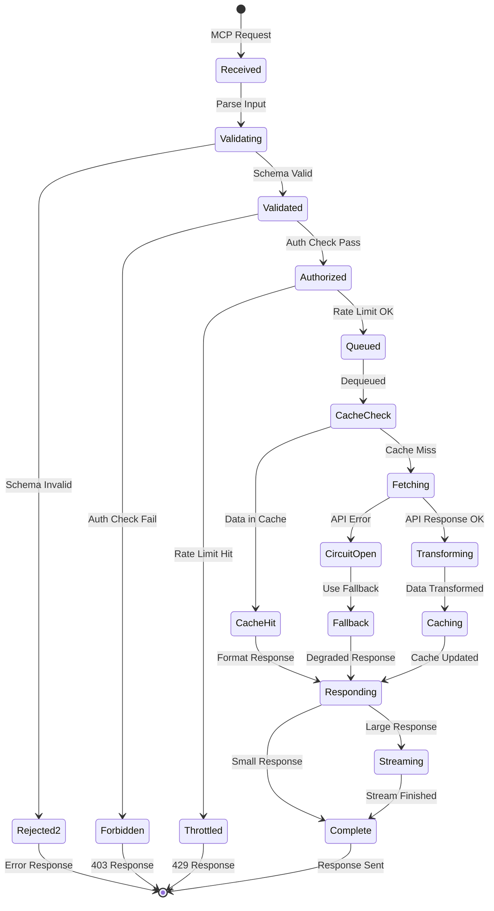
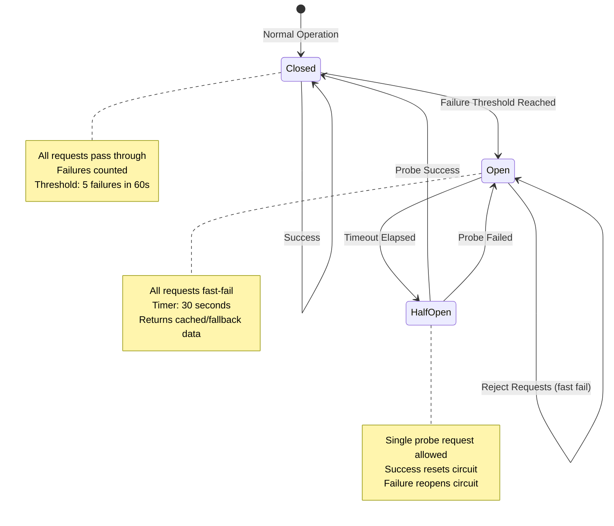
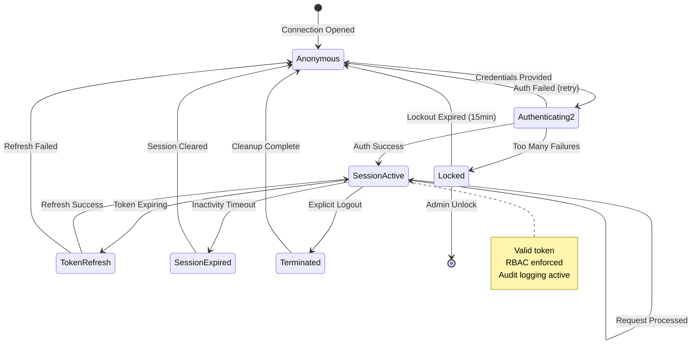

  

<h1 align="center">📈 European Parliament MCP Server — Future State Diagram</h1>

  <strong>🏗️ Advanced State Management</strong> 
  <em>📈 System State Transitions and Lifecycle Evolution</em>

  
  
  
  

**📋 Document Owner:** CEO | **📄 Version:** 1.0 | **📅 Last Updated:** 2026-02-20 (UTC)  
**🔄 Review Cycle:** Quarterly | **⏰ Next Review:** 2026-05-20  
**🏷️ Classification:** Public (Open Source MCP Server)

---

## 📑 Table of Contents

- [Executive Summary](#-executive-summary)
- [Current State Baseline](#-current-state-baseline)
- [Enhanced MCP Connection Lifecycle](#-enhanced-mcp-connection-lifecycle)
- [Cache State Machine](#-cache-state-machine)
- [Request Processing States](#-request-processing-states)
- [API Circuit Breaker States](#-api-circuit-breaker-states)
- [Security Session Lifecycle](#️-security-session-lifecycle)
- [Policy Alignment](#-policy-alignment)
- [Related Documents](#-related-documents)

---

## 🎯 Executive Summary

This document outlines future state management improvements for the European Parliament MCP Server, including enhanced connection lifecycle, multi-tier caching, circuit breaker patterns, and security session management. **All future infrastructure runs on serverless AWS** (Lambda, DynamoDB, API Gateway, Cognito) — see [FUTURE_ARCHITECTURE.md](FUTURE_ARCHITECTURE.md).

---

## 📊 Current State Baseline

Current state diagrams are documented in [STATEDIAGRAM.md](STATEDIAGRAM.md).

---

## 🔄 Enhanced MCP Connection Lifecycle

---

## 📦 Cache State Machine

---

## ⚙️ Request Processing States

---

## 🔄 API Circuit Breaker States

---

## 🛡️ Security Session Lifecycle

---

## 🔗 Policy Alignment

| ISMS Policy | Relevance | Link |
|-------------|-----------|------|
| 🔒 Secure Development | State management security | [Secure_Development_Policy.md](https://github.com/Hack23/ISMS-PUBLIC/blob/main/Secure_Development_Policy.md) |
| 🔑 Access Control | Session lifecycle patterns | [Access_Control_Policy.md](https://github.com/Hack23/ISMS-PUBLIC/blob/main/Access_Control_Policy.md) |
| 🌐 Network Security | Connection state security | [Network_Security_Policy.md](https://github.com/Hack23/ISMS-PUBLIC/blob/main/Network_Security_Policy.md) |
| 🚨 Incident Response | Error state handling | [Incident_Response_Plan.md](https://github.com/Hack23/ISMS-PUBLIC/blob/main/Incident_Response_Plan.md) |

---

## 📚 Related Documents

| Document | Description | Link |
|----------|-------------|------|
| 📈 State Diagram (Current) | Current state transitions | [STATEDIAGRAM.md](STATEDIAGRAM.md) |
| 🚀 Future Architecture | Architecture roadmap | [FUTURE_ARCHITECTURE.md](FUTURE_ARCHITECTURE.md) |
| 🔄 Future Flowchart | Process workflows | [FUTURE_FLOWCHART.md](FUTURE_FLOWCHART.md) |
| 🛡️ Future Security Architecture | Security roadmap | [FUTURE_SECURITY_ARCHITECTURE.md](FUTURE_SECURITY_ARCHITECTURE.md) |

---

  <em>This future state diagram is maintained as part of the <a href="https://github.com/Hack23/ISMS-PUBLIC">Hack23 AB ISMS</a> framework.</em> 
  <em>Licensed under <a href="LICENSE.md">Apache-2.0</a></em>

