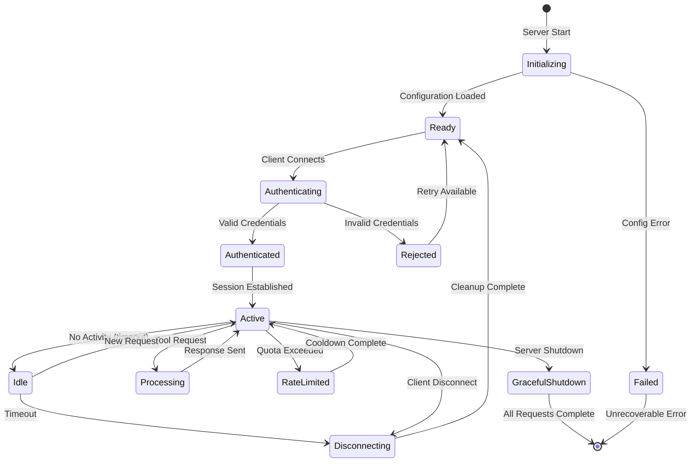
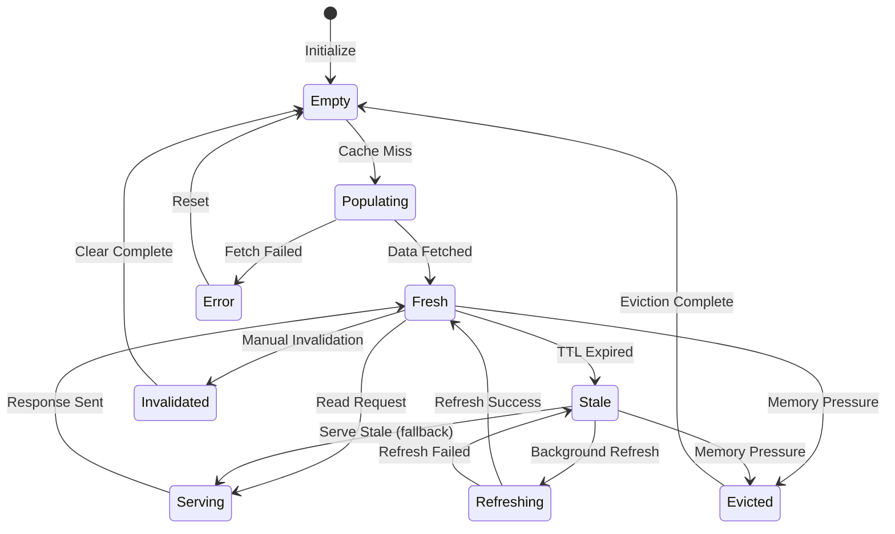
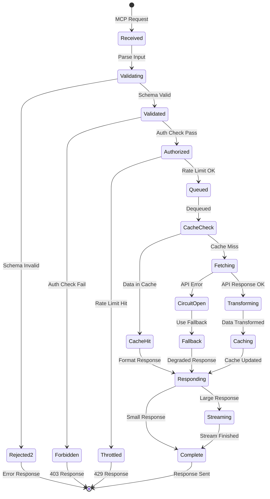
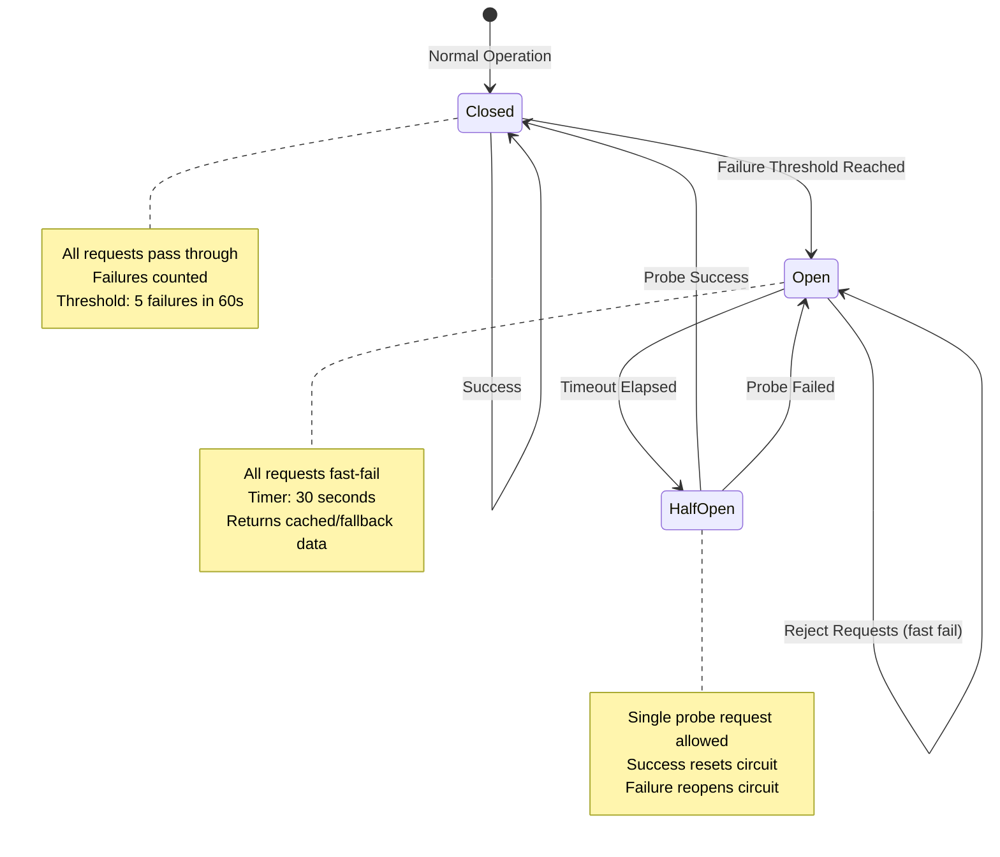
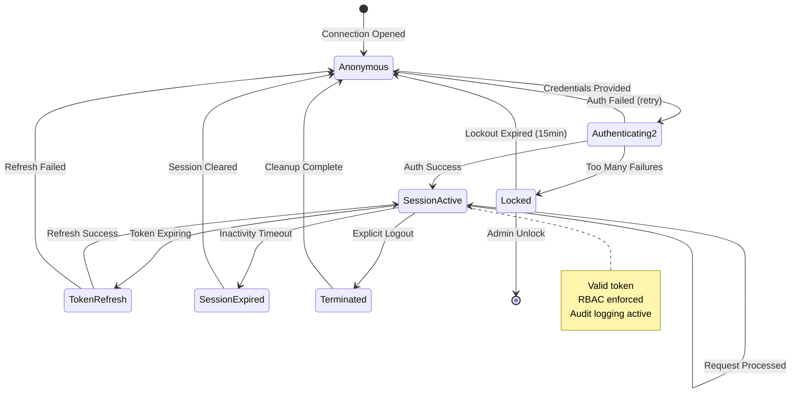
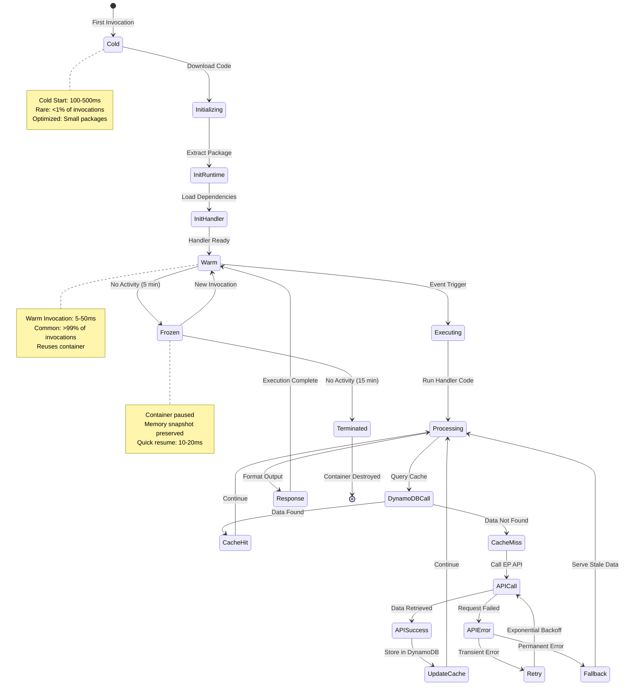
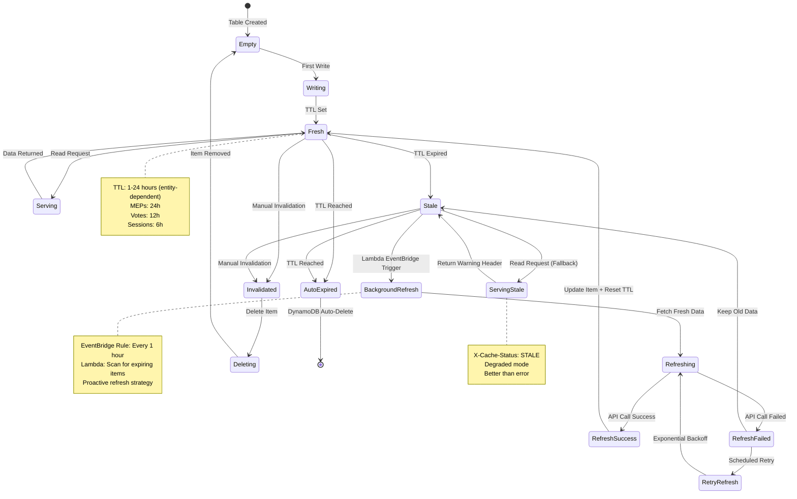
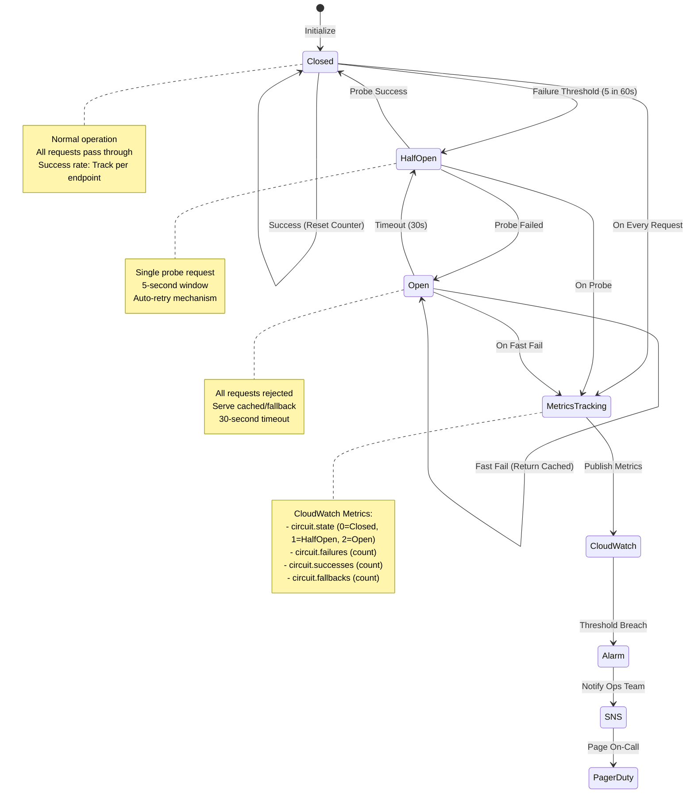
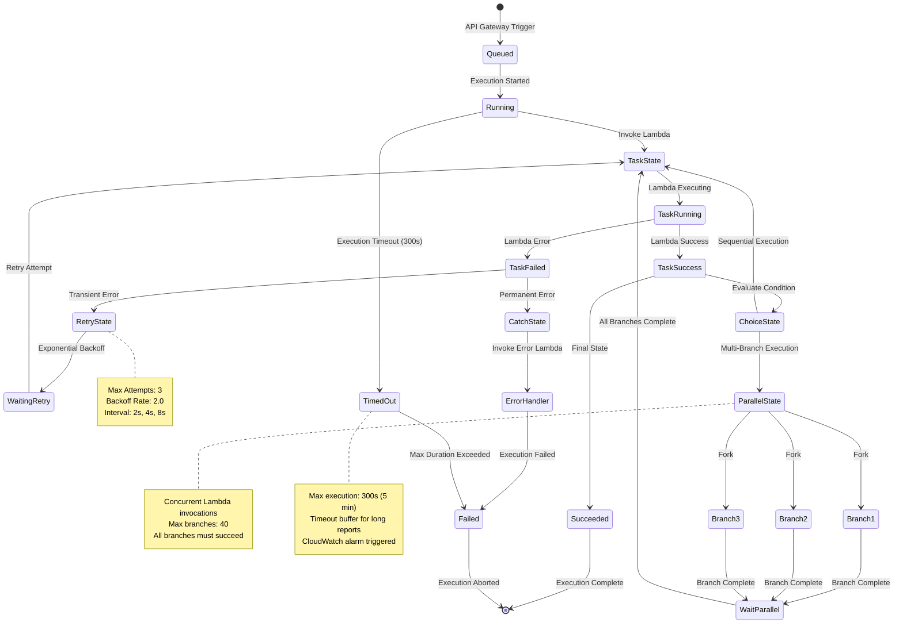

  

<h1 align="center">📈 European Parliament MCP Server — Future State Diagram</h1>

  <strong>🏗️ Advanced State Management</strong> 
  <em>📈 System State Transitions and Lifecycle Evolution</em>

  
  
  
  

**📋 Document Owner:** CEO | **📄 Version:** 1.0 | **📅 Last Updated:** 2026-02-20 (UTC)  
**🔄 Review Cycle:** Quarterly | **⏰ Next Review:** 2026-05-20  
**🏷️ Classification:** Public (Open Source MCP Server)

---

## 📑 Table of Contents

- [Executive Summary](#-executive-summary)
- [Current State Baseline](#-current-state-baseline)
- [Enhanced MCP Connection Lifecycle](#-enhanced-mcp-connection-lifecycle)
- [Cache State Machine](#-cache-state-machine)
- [Request Processing States](#-request-processing-states)
- [API Circuit Breaker States](#-api-circuit-breaker-states)
- [Security Session Lifecycle](#️-security-session-lifecycle)
- [Policy Alignment](#-policy-alignment)
- [Related Documents](#-related-documents)

---

## 🎯 Executive Summary

This document outlines future state management improvements for the European Parliament MCP Server, including enhanced connection lifecycle, multi-tier caching, circuit breaker patterns, and security session management. **All future infrastructure runs on serverless AWS** (Lambda, DynamoDB, API Gateway, Cognito) — see [FUTURE_ARCHITECTURE.md](FUTURE_ARCHITECTURE.md).

---

## 📊 Current State Baseline

Current state diagrams are documented in [STATEDIAGRAM.md](STATEDIAGRAM.md).

---

## 🔄 Enhanced MCP Connection Lifecycle

---

## 📦 Cache State Machine

---

## ⚙️ Request Processing States

---

## 🔄 API Circuit Breaker States

---

## 🛡️ Security Session Lifecycle

---

## ⚡ Lambda Function Execution Lifecycle

### **Lambda Lifecycle Metrics**

| State | Duration | Frequency | Cost Impact |
|-------|----------|-----------|-------------|
| **Cold Start** | 100-500ms | <1% invocations | Billed for full duration |
| **Warm Invocation** | 5-50ms | >99% invocations | Billed for execution only |
| **Frozen** | N/A | After 5 min idle | No cost |
| **Terminated** | N/A | After 15 min idle | No cost |

**Optimization Strategy:**
- **Provisioned Concurrency:** 10 instances for router Lambda (eliminates cold starts)
- **Package Size:** <10 MB (faster cold starts)
- **Runtime:** Node.js 24 (faster initialization than Python)
- **Lazy Loading:** Import modules only when needed

---

## 🗄️ Distributed DynamoDB Cache State Machine

### **Cache TTL Strategy**

| Entity Type | TTL | Refresh Frequency | Rationale |
|------------|-----|-------------------|----------|
| **MEP Profile** | 24 hours | Daily at 2 AM UTC | MEP data changes infrequently |
| **Voting Record** | 12 hours | Twice daily | Vote outcomes finalized quickly |
| **Plenary Session** | 6 hours | Every 6 hours | Session details update during day |
| **Document** | 24 hours | Daily at 3 AM UTC | Documents rarely change after publication |
| **Committee Info** | 48 hours | Twice weekly | Committee composition stable |

---

## 🔄 Enhanced Circuit Breaker with Metrics

### **Circuit Breaker Configuration**

| Parameter | Value | Purpose |
|-----------|-------|----------|
| **Failure Threshold** | 5 failures in 60s | Open circuit after sustained errors |
| **Success Threshold** | 1 success | Close circuit after successful probe |
| **Timeout** | 30 seconds | Time before attempting probe |
| **Probe Interval** | 5 seconds | Frequency of probe attempts in HalfOpen |
| **Fallback Strategy** | Serve cached data + warning header | Graceful degradation |

**Per-Endpoint Circuit Breakers:**
- `/meps` endpoint: Independent circuit breaker
- `/votes` endpoint: Independent circuit breaker
- `/documents` endpoint: Independent circuit breaker

**Rationale:** Isolate failures to specific EP API endpoints, prevent cascade failures

---

## 🔄 Step Functions Workflow Execution States

### **Step Functions Execution Metrics**

| Metric | Target | Alert Threshold |
|--------|--------|------------------|
| **Success Rate** | >99% | <95% |
| **Execution Duration** | <120s | >240s |
| **Timeout Rate** | <0.1% | >1% |
| **Retry Rate** | <5% | >15% |
| **Cost per Execution** | <$0.05 | >$0.10 |

---

## 📊 Implementation Phases

### **Phase 1: Lambda Lifecycle Optimization** (Q3 2026)

**Objectives:**
- Implement provisioned concurrency for router Lambda
- Optimize cold start times to <100ms
- Deploy SnapStart for instant warm starts

**Success Metrics:**
- ✅ Cold start p95: <100ms (down from 500ms)
- ✅ Warm invocation p95: <50ms
- ✅ Provisioned concurrency: 10 instances for router
- ✅ Cold start rate: <1% of invocations

**KPIs:**
- Cold start latency p95: <100ms
- Warm latency p95: <50ms
- Cost increase: <10% (provisioned concurrency)
- User-perceived latency: <200ms p95

---

### **Phase 2: DynamoDB Cache State Machine** (Q4 2026)

**Objectives:**
- Implement TTL-based cache expiration
- Deploy background refresh with EventBridge
- Add stale-while-revalidate pattern

**Success Metrics:**
- ✅ All entities have appropriate TTL values
- ✅ Background refresh Lambda deployed
- ✅ Stale data served with warning header
- ✅ Cache hit rate: >80%

**KPIs:**
- Cache hit rate: >80%
- Stale data served rate: <5%
- Background refresh success rate: >95%
- DynamoDB read cost reduction: 60%

---

### **Phase 3: Circuit Breaker & Step Functions** (Q1 2027)

**Objectives:**
- Deploy per-endpoint circuit breakers
- Implement Step Functions for complex workflows
- Add CloudWatch metrics and alarms
- Deploy PagerDuty integration

**Success Metrics:**
- ✅ Circuit breakers prevent cascade failures
- ✅ Step Functions execute reports in <120s
- ✅ CloudWatch alarms trigger within 1 minute
- ✅ PagerDuty incidents auto-created for P1 alerts

**KPIs:**
- Circuit breaker effectiveness: 90% failure isolation
- Step Functions success rate: >99%
- Mean time to detection (MTTD): <1 minute
- Mean time to recovery (MTTR): <5 minutes

---

## ⚠️ Risk Assessment

### **State Management Risks**

| Risk | Severity | Probability | Impact | Mitigation |
|------|----------|-------------|--------|------------|
| **DynamoDB throttling** | 🟠 High | 🟡 Low | Cache unavailable, increased EP API calls | DynamoDB on-demand mode, auto-scaling |
| **Lambda timeout** | 🟡 Medium | 🟠 Medium | Incomplete processing, poor UX | Increase timeout to 30s, optimize code |
| **Circuit breaker false positive** | 🟡 Medium | 🟡 Low | Unnecessary fast-fails, reduced availability | Tune threshold to 5 failures in 60s |
| **Step Functions cost overrun** | 🟡 Medium | 🟠 Medium | Budget exceeded | Limit to 100 executions/hour, monitor CloudWatch |
| **Stale cache served too long** | 🟢 Low | 🟠 Medium | Outdated data, user confusion | Warning header, TTL monitoring |

### **Risk Mitigation Timeline**

| Risk | Mitigation Action | Owner | Deadline |
|------|-------------------|-------|----------|
| DynamoDB throttling | Enable on-demand mode, set CloudWatch alarms | DevOps | Before Phase 2 |
| Lambda timeout | Optimize handler code, increase timeout to 30s | Engineering | Phase 1 |
| Circuit breaker tuning | Load test with realistic failure scenarios | SRE | Phase 3 |
| Cost overrun | Set Step Functions execution quota, billing alarms | FinOps | Before Phase 3 |
| Stale cache | Implement background refresh, monitor TTL expiry | Engineering | Phase 2 |

---

## 🔗 ISO 27001 Controls Mapping

| Control | Description | Implementation |
|---------|-------------|----------------|
| **A.12.4.1** | Event logging | CloudTrail logs all Lambda state changes, DynamoDB operations |
| **A.12.4.2** | Protection of log information | CloudWatch Logs encrypted with KMS, 90-day retention |
| **A.12.4.3** | Administrator and operator logs | IAM CloudTrail logs capture all administrative actions |
| **A.12.4.4** | Clock synchronization | Lambda uses NTP-synchronized AWS clocks |
| **A.17.2.1** | Availability of information processing facilities | Multi-AZ DynamoDB, Lambda auto-scaling |
| **A.14.1.2** | Securing application services on public networks | API Gateway with WAF, TLS 1.3 |
| **A.14.1.3** | Protecting application services transactions | Circuit breaker prevents cascade failures |

### **NIST CSF 2.0 Mapping**

| Function | Category | Implementation |
|----------|----------|----------------|
| **PR.PT-1** | Audit/log records determined | All state transitions logged to CloudWatch |
| **PR.PT-3** | Access to systems managed | IAM policies enforce least privilege for Lambda execution roles |
| **DE.AE-2** | Detected events analyzed | CloudWatch Insights queries analyze Lambda errors |
| **DE.AE-4** | Impact of events determined | Circuit breaker metrics track failure impact |
| **DE.CM-7** | Monitoring for unauthorized activity | GuardDuty monitors for anomalous Lambda behavior |
| **RS.AN-1** | Notifications from detection systems investigated | PagerDuty integration for P1 incidents |
| **RS.MI-2** | Incidents contained | Circuit breaker isolates failing endpoints |

### **CIS Controls v8.1 Mapping**

| Control | Safeguard | Implementation |
|---------|-----------|----------------|
| **8.2** | Collect audit logs | CloudTrail logs all API calls, 90-day retention |
| **8.3** | Ensure adequate audit log storage | CloudWatch Logs with automatic retention policies |
| **8.5** | Collect detailed audit logs | Lambda execution logs include request ID, duration, errors |
| **8.11** | Conduct audit log reviews | CloudWatch Insights scheduled queries for anomaly detection |
| **12.1** | Ensure network infrastructure is up-to-date | Lambda runtime auto-updates, managed by AWS |
| **13.6** | Collect network traffic flow logs | VPC Flow Logs for Lambda in VPC |
| **17.7** | Conduct routine incident response exercises | Quarterly failure injection testing (chaos engineering) |

---

## 🔗 Policy Alignment

| ISMS Policy | Relevance | Link |
|-------------|-----------|------|
| 🔒 Secure Development | State management security | [Secure_Development_Policy.md](https://github.com/Hack23/ISMS-PUBLIC/blob/main/Secure_Development_Policy.md) |
| 🔑 Access Control | Session lifecycle patterns | [Access_Control_Policy.md](https://github.com/Hack23/ISMS-PUBLIC/blob/main/Access_Control_Policy.md) |
| 🌐 Network Security | Connection state security | [Network_Security_Policy.md](https://github.com/Hack23/ISMS-PUBLIC/blob/main/Network_Security_Policy.md) |
| 🚨 Incident Response | Error state handling | [Incident_Response_Plan.md](https://github.com/Hack23/ISMS-PUBLIC/blob/main/Incident_Response_Plan.md) |

---

## 📚 Related Documents

| Document | Description | Link |
|----------|-------------|------|
| 📈 State Diagram (Current) | Current state transitions | [STATEDIAGRAM.md](STATEDIAGRAM.md) |
| 🚀 Future Architecture | Architecture roadmap | [FUTURE_ARCHITECTURE.md](FUTURE_ARCHITECTURE.md) |
| 🔄 Future Flowchart | Process workflows | [FUTURE_FLOWCHART.md](FUTURE_FLOWCHART.md) |
| 🛡️ Future Security Architecture | Security roadmap | [FUTURE_SECURITY_ARCHITECTURE.md](FUTURE_SECURITY_ARCHITECTURE.md) |

---

  <em>This future state diagram is maintained as part of the <a href="https://github.com/Hack23/ISMS-PUBLIC">Hack23 AB ISMS</a> framework.</em> 
  <em>Licensed under <a href="LICENSE.md">Apache-2.0</a></em>

