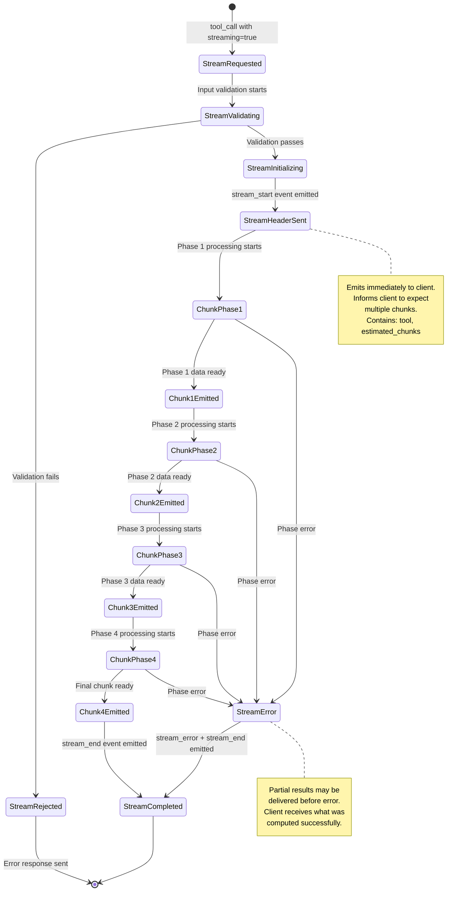
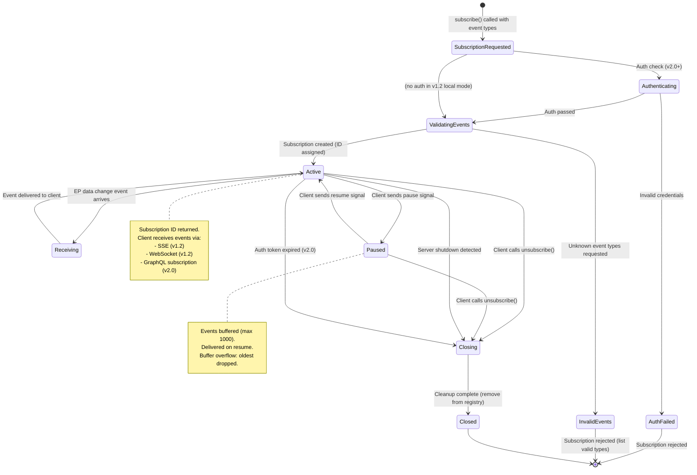
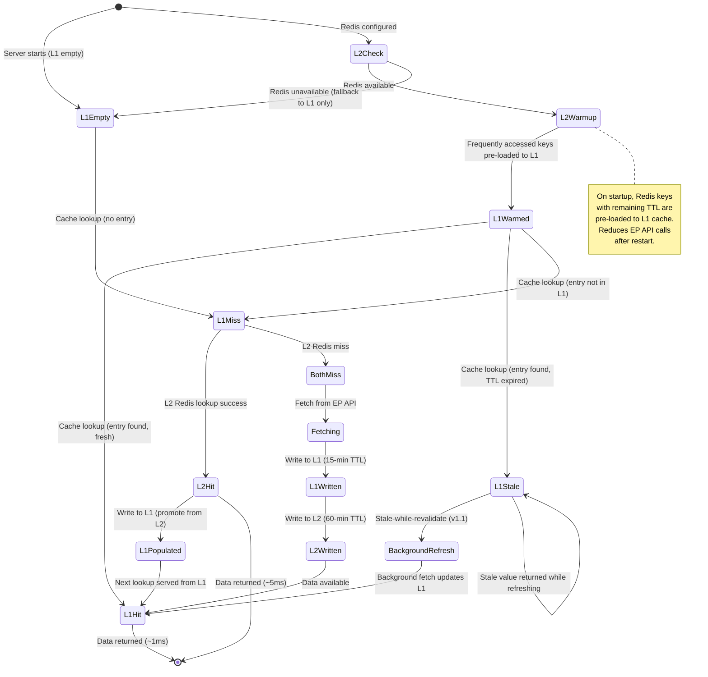
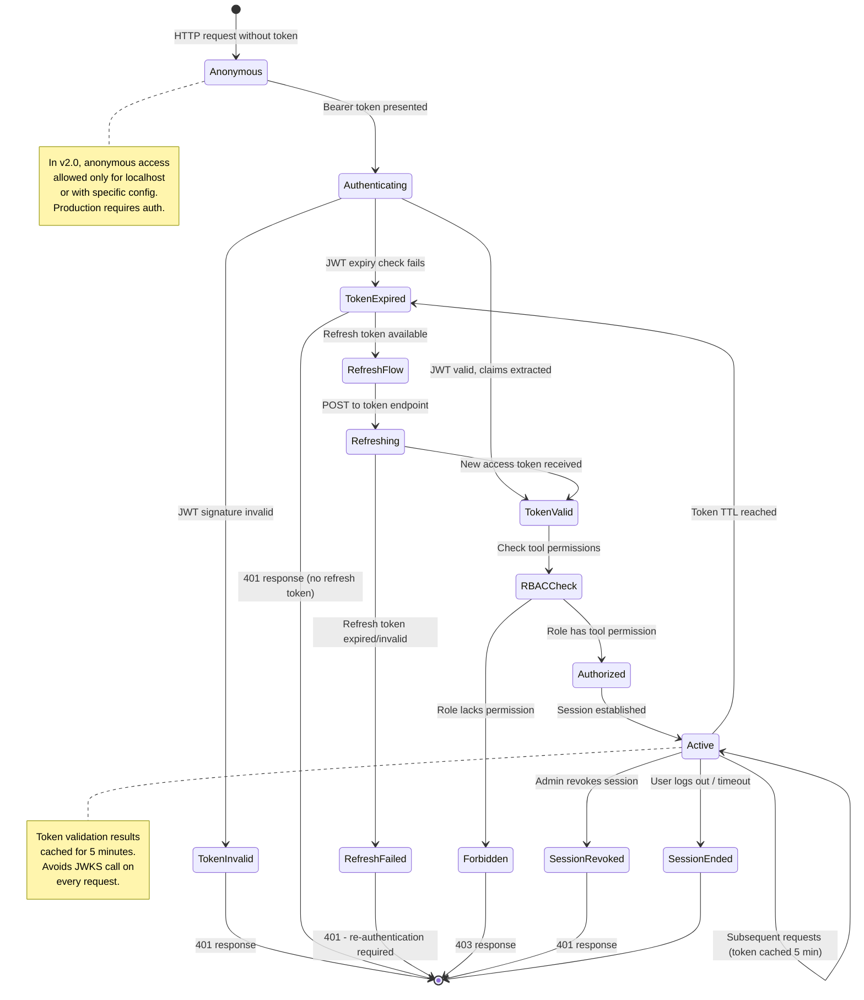
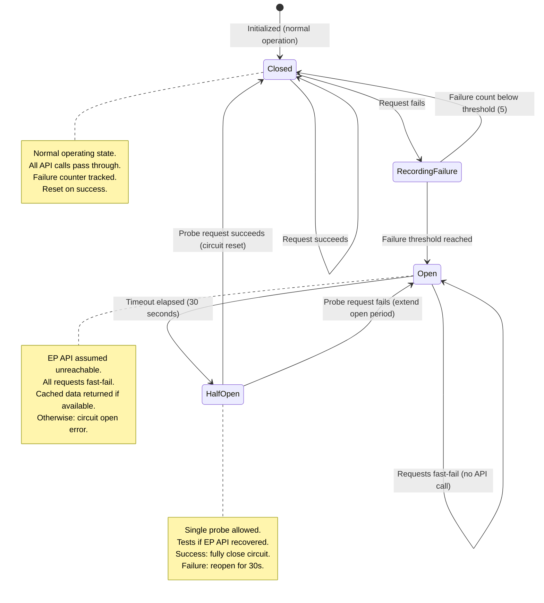
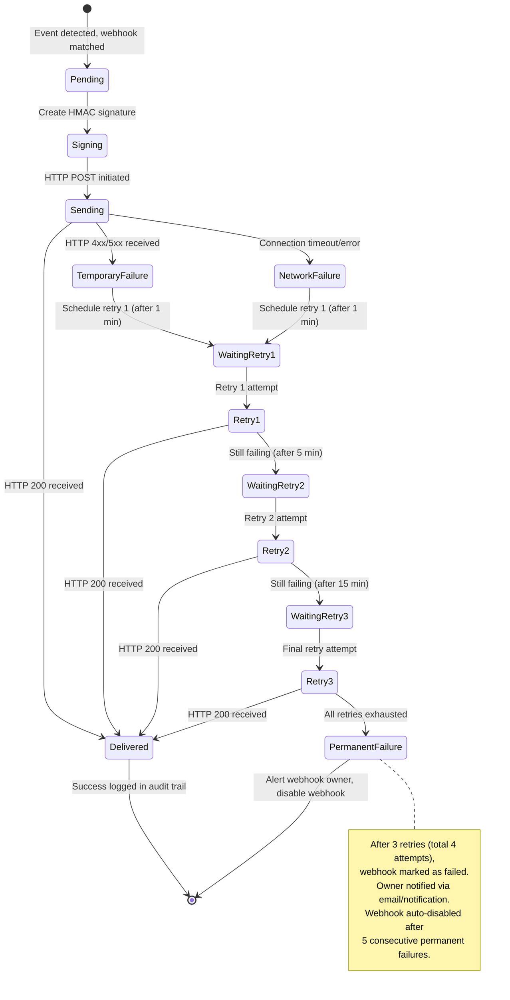

  

<h1 align="center">📈 European Parliament MCP Server — Future State Diagrams</h1>

  <strong>Planned State Management: Streaming, OAuth Sessions, Enhanced Cache, Real-Time Subscriptions</strong> 
  <em>Future state machine documentation for EP MCP Server evolution</em>

  
  
  
  

**📋 Document Owner:** Hack23 | **📄 Version:** 2.0 | **📅 Last Updated:** 2026-02-26 (UTC)
**🔄 Review Cycle:** Quarterly | **⏰ Next Review:** 2026-05-26
**🏷️ Classification:** Public (Open Source MCP Server)
**✅ ISMS Compliance:** ISO 27001 (A.5.1, A.8.1, A.14.2), NIST CSF 2.0 (ID.AM, PR.DS), CIS Controls v8.1 (2.1, 16.1)

---

## 📑 Table of Contents

1. [Security Documentation Map](#security-documentation-map)
2. [Streaming Response States (v1.2)](#streaming-response-states-v12)
3. [Real-Time Subscription States (v1.2)](#real-time-subscription-states-v12)
4. [Enhanced Cache State Machine (v1.1)](#enhanced-cache-state-machine-v11)
5. [OAuth Session States (v2.0)](#oauth-session-states-v20)
6. [Circuit Breaker States (v1.1)](#circuit-breaker-states-v11)
7. [Webhook Delivery States (v2.0)](#webhook-delivery-states-v20)

---

## 🗺️ Security Documentation Map

| Document | Current | Future | Description |
|----------|---------|--------|-------------|
| **Architecture** | [ARCHITECTURE.md](./ARCHITECTURE.md) | [FUTURE_ARCHITECTURE.md](./FUTURE_ARCHITECTURE.md) | C4 model, containers, components, ADRs |
| **Security Architecture** | [SECURITY_ARCHITECTURE.md](./SECURITY_ARCHITECTURE.md) | [FUTURE_SECURITY_ARCHITECTURE.md](./FUTURE_SECURITY_ARCHITECTURE.md) | Security controls, threat model |
| **Data Model** | [DATA_MODEL.md](./DATA_MODEL.md) | [FUTURE_DATA_MODEL.md](./FUTURE_DATA_MODEL.md) | Entity relationships, branded types |
| **Flowchart** | [FLOWCHART.md](./FLOWCHART.md) | [FUTURE_FLOWCHART.md](./FUTURE_FLOWCHART.md) | Business process flows |
| **State Diagram** | [STATEDIAGRAM.md](./STATEDIAGRAM.md) | [FUTURE_STATEDIAGRAM.md](./FUTURE_STATEDIAGRAM.md) | System state transitions |
| **Mind Map** | [MINDMAP.md](./MINDMAP.md) | [FUTURE_MINDMAP.md](./FUTURE_MINDMAP.md) | System concepts and relationships |
| **SWOT Analysis** | [SWOT.md](./SWOT.md) | [FUTURE_SWOT.md](./FUTURE_SWOT.md) | Strategic positioning |

---

## 🌊 Streaming Response States (v1.2)

MCP streaming support for long-running tool operations:

---

## 📡 Real-Time Subscription States (v1.2)

Client subscription lifecycle for EP data change notifications:

---

## 💾 Enhanced Cache State Machine (v1.1)

Two-tier cache (LRU + Redis) state management:

---

## 🔑 OAuth Session States (v2.0)

User session lifecycle for HTTP transport with OAuth 2.0:

---

## ⚡ Circuit Breaker States (v1.1)

EP API circuit breaker state machine:

---

## 🔔 Webhook Delivery States (v2.0)

Individual webhook delivery attempt state machine:

---

*See [STATEDIAGRAM.md](./STATEDIAGRAM.md) for the current implemented state machines.*
