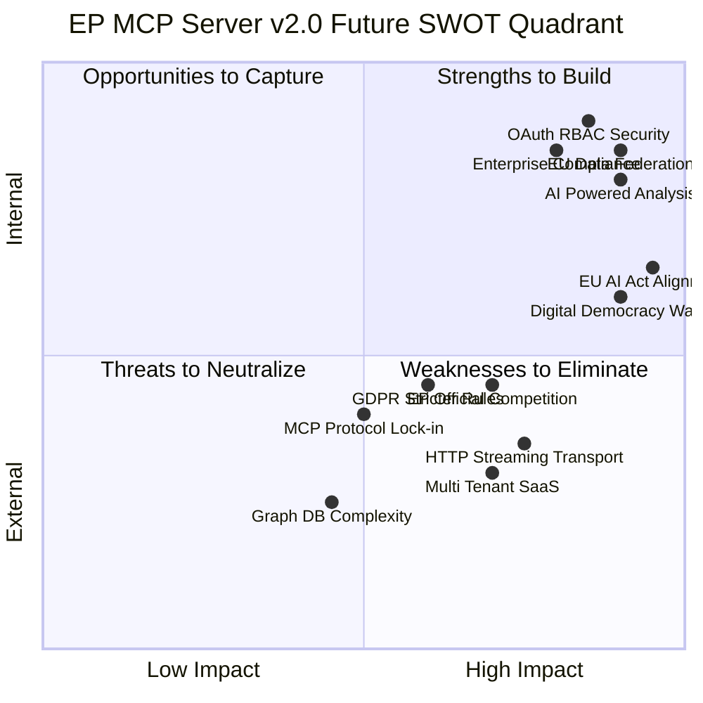

  

<h1 align="center">💼 European Parliament MCP Server — Future SWOT Analysis</h1>

  <strong>Strategic Evolution: Market Positioning, Risk Mitigation, and v2.0 Opportunities</strong> 
  <em>Forward-looking SWOT analysis for the EP MCP Server platform evolution</em>

  
  
  
  

**📋 Document Owner:** Hack23 | **📄 Version:** 1.0 | **📅 Last Updated:** 2026-02-26 (UTC)
**🔄 Review Cycle:** Quarterly | **⏰ Next Review:** 2026-05-26
**🏷️ Classification:** Public (Open Source MCP Server)
**✅ ISMS Compliance:** ISO 27001 (A.5.1, A.8.1, A.14.2), NIST CSF 2.0 (ID.AM, PR.DS), CIS Controls v8.1 (2.1, 16.1)

---

## 📑 Table of Contents

1. [Security Documentation Map](#security-documentation-map)
2. [Future SWOT Overview](#future-swot-overview)
3. [Future Strengths](#future-strengths)
4. [Future Weaknesses to Address](#future-weaknesses-to-address)
5. [Future Opportunities](#future-opportunities)
6. [Future Threats and Mitigations](#future-threats-and-mitigations)
7. [Strategic Expansion Matrix](#strategic-expansion-matrix)
8. [v2.0 Positioning Statement](#v20-positioning-statement)

---

## 🗺️ Security Documentation Map

| Document | Current | Future | Description |
|----------|---------|--------|-------------|
| **Architecture** | [ARCHITECTURE.md](./ARCHITECTURE.md) | [FUTURE_ARCHITECTURE.md](./FUTURE_ARCHITECTURE.md) | C4 model, containers, components, ADRs |
| **Security Architecture** | [SECURITY_ARCHITECTURE.md](./SECURITY_ARCHITECTURE.md) | [FUTURE_SECURITY_ARCHITECTURE.md](./FUTURE_SECURITY_ARCHITECTURE.md) | Security controls, threat model |
| **Data Model** | [DATA_MODEL.md](./DATA_MODEL.md) | [FUTURE_DATA_MODEL.md](./FUTURE_DATA_MODEL.md) | Entity relationships, branded types |
| **Flowchart** | [FLOWCHART.md](./FLOWCHART.md) | [FUTURE_FLOWCHART.md](./FUTURE_FLOWCHART.md) | Business process flows |
| **State Diagram** | [STATEDIAGRAM.md](./STATEDIAGRAM.md) | [FUTURE_STATEDIAGRAM.md](./FUTURE_STATEDIAGRAM.md) | System state transitions |
| **Mind Map** | [MINDMAP.md](./MINDMAP.md) | [FUTURE_MINDMAP.md](./FUTURE_MINDMAP.md) | System concepts and relationships |
| **SWOT Analysis** | [SWOT.md](./SWOT.md) | [FUTURE_SWOT.md](./FUTURE_SWOT.md) | Strategic positioning |

---

## 📊 Future SWOT Overview

---

## 💪 Future Strengths

### FS1: EU Data Federation Platform (v2.0)
Expanding beyond EP data to create a unified EU institutions data platform integrating:
- European Parliament (39+ tools)
- EUR-Lex legislation database
- Council of the EU proceedings
- European Commission proposals
- Eurostat economic data

This creates an **unmatched breadth** of EU intelligence accessible through a single MCP server, far exceeding any competitor's scope.

### FS2: OAuth 2.0 + Fine-Grained RBAC (v2.0)
Enterprise-grade authentication and authorization will unlock institutional adoption by:
- EU affairs consultancies requiring user-level access logs
- NGOs requiring role-based data access
- Academic institutions with IRB data governance requirements
- Government agencies requiring audit trails

### FS3: AI-Powered Intelligence Analysis (v1.2+)
Integration of ML/NLP capabilities directly into MCP tools:
- Vote prediction with confidence scoring
- MEP behavior pattern recognition
- Coalition formation early detection
- NLP-powered speech summarization in 24 EU languages

This transforms the server from a **data access tool** into an **intelligence analysis platform**.

### FS4: Streaming and Real-Time Architecture (v1.2)
HTTP/SSE and WebSocket transports enable:
- Real-time EP data change notifications
- Progressive report generation
- Live procedure tracking dashboards
- Webhook integrations for enterprise workflows

### FS5: Enterprise Compliance Portfolio
Full certification path: ISO 27001, SOC 2 Type II readiness, SLSA Level 3, GDPR Article 30 records, CIS Controls v8.1 full implementation. This enables institutional procurement processes.

---

## ⚠️ Future Weaknesses to Address

### FW1: Graph Database Complexity (v2.0 Challenge)
Implementing a graph database model for parliamentary relationship analysis introduces significant operational complexity. Mitigation: Start with in-memory graph computation before committing to a database.

**Action:** Build graph computation as a library layer over existing relational data before migrating to a graph database.

### FW2: Multi-Tenant Data Isolation
Multi-tenant architecture introduces risks of cross-tenant data leakage if not implemented correctly. This requires extensive security testing.

**Action:** Dedicated security audit for multi-tenant implementation before public release.

### FW3: EP API Version Migration Risk
The transition from EP API v2 to a hypothetical v3 would require updating all 39+ tool implementations simultaneously.

**Action:** Build an EP API abstraction layer that decouples tool implementations from specific API versions.

### FW4: Cold Start Performance
Without Redis pre-warming, server restarts result in cache misses for all initial requests, causing EP API load spikes.

**Action:** Implement cache warmup procedure from Redis on startup (v1.1).

### FW5: 24-Language Support Gap
EU parliamentary data is available in 24 official languages. Current analysis tools are English-centric, limiting use for non-English EP researchers.

**Action:** Build multilingual prompt templates and language-aware analysis tools by v1.2.

---

## 🚀 Future Opportunities

### FO1: EU AI Act Alignment (Critical Opportunity)
The EU AI Act (effective 2025-2026) creates demand for:
- Transparent AI systems that can explain EU regulatory context
- AI tools for compliance analysis and regulatory tracking
- Automated monitoring of AI-related legislation in EP

The EP MCP Server directly enables AI-assisted EU AI Act compliance monitoring, creating a high-value specialized use case.

**Market Size:** Every company operating in the EU needs to track EU AI Act implementation — millions of potential users.

### FO2: Digital Democracy Wave
Globally, there is growing demand for tools that make democratic processes more transparent and accessible:
- Civic tech organizations
- Journalism schools and professional journalists
- Political accountability NGOs
- Democracy monitoring organizations

The EP MCP Server is positioned as foundational infrastructure for this movement.

### FO3: European Parliament Official Partnership
The EP has expressed interest in AI-powered tools for parliamentary transparency. A formal partnership or endorsement from the EP IT department would:
- Provide privileged API access
- Validate the project for institutional users
- Open access to non-public datasets

### FO4: Academic Research Network
European universities studying political science, EU law, and democratic governance need EP data tools. Building an academic partnership network could create:
- Research citations and academic credibility
- Student contributor pipeline
- Grant funding opportunities (Horizon Europe)

### FO5: EU Affairs Industry Vertical
The EU affairs industry (lobbying, government relations, policy consulting) generates €1B+ in annual revenue. These firms need:
- Real-time legislative tracking
- MEP relationship mapping
- Procedure outcome prediction
- Automated EP monitoring reports

**Revenue model:** Professional tier with enhanced rate limits, dedicated support, and ISMS compliance documentation could generate sustainable revenue.

### FO6: MCP Marketplace Listing
As MCP marketplaces emerge (Anthropic's MCP directory, GitHub's MCP hub), early listing and prominent positioning in "Government Data" category could drive significant organic adoption.

---

## ⚡ Future Threats and Mitigations

### FT1: EP Launches Official MCP Server

**Threat Level:** High | **Timeline:** 12-24 months

The European Parliament could launch an official, EP-endorsed MCP server with:
- Privileged API access (higher rate limits)
- Non-public datasets
- Official EP branding and trust

**Mitigation Strategy:**
- Build complementary capabilities (OSINT analysis, cross-institution federation) that EP IT won't build
- Pursue official partnership before competition materializes
- Focus on analysis intelligence, not just raw data access
- Build community and ecosystem that EP cannot easily replicate

### FT2: MCP Protocol Fragmentation

**Threat Level:** Medium | **Timeline:** 6-18 months

If major AI providers (OpenAI, Google) develop competing protocols to MCP, the investment in MCP-specific implementation could be stranded.

**Mitigation Strategy:**
- Abstract the transport layer to support multiple protocols
- Focus on the data and analysis value, not the protocol
- Monitor MCP adoption metrics and pivot if necessary

### FT3: EU GDPR Enforcement Tightening

**Threat Level:** Medium | **Timeline:** Ongoing

Stricter GDPR enforcement on AI systems processing MEP personal data could require:
- DPIAs (Data Protection Impact Assessments)
- Shorter cache TTLs
- Explicit consent mechanisms

**Mitigation Strategy:**
- Proactively conduct DPIA for v2.0 release
- Reduce cache TTL to 5 minutes for personal data categories
- Implement configurable data retention policies

### FT4: EP API Rate Limit Reduction

**Threat Level:** Medium | **Timeline:** 6-12 months

If EP reduces public API rate limits from current generous levels, OSINT tools requiring multiple API calls become impractical.

**Mitigation Strategy:**
- Build longer-TTL persistent caching (Redis) to reduce API dependency
- Negotiate enhanced rate limits via EP partnership
- Implement smart request batching to minimize API calls

### FT5: Open Source Sustainability

**Threat Level:** Low-Medium | **Timeline:** 12-36 months

Open source project sustainability requires ongoing maintenance. Without commercial support or community growth, maintenance burden could outpace contributor capacity.

**Mitigation Strategy:**
- Build community through documentation, tutorials, and examples
- Develop professional support tier revenue to fund maintenance
- Apply for EU open source funding (NLnet, Horizon Europe)

---

## 🎯 Strategic Expansion Matrix

| Initiative | Version | Impact | Effort | Priority |
|-----------|---------|--------|--------|----------|
| Redis persistent cache | v1.1 | Medium | Low | P1 |
| OpenTelemetry observability | v1.1 | High | Medium | P1 |
| HTTP/SSE transport | v1.2 | High | High | P1 |
| AI-powered analysis tools | v1.2 | Very High | Very High | P2 |
| OAuth 2.0 authentication | v2.0 | High | High | P2 |
| Fine-grained RBAC | v2.0 | High | High | P2 |
| EUR-Lex data federation | v2.0 | Very High | Very High | P2 |
| Council of EU data | v2.0 | High | High | P3 |
| Multi-tenant SaaS | v2.0 | High | Very High | P3 |
| Graph database model | v2.1 | Very High | Very High | P3 |
| National parliament data | v3.0 | Very High | Very High | P4 |

---

## 🏆 v2.0 Positioning Statement

> **The European Parliament MCP Server v2.0 will be the definitive AI-native intelligence platform for European democratic data.** Expanding from 39 tools to 60+ with AI-powered analysis, federating data from EP, EUR-Lex, and the Council of the EU, and delivering enterprise-grade OAuth 2.0 security with fine-grained RBAC, v2.0 transforms from a data access server into a comprehensive European parliamentary intelligence platform. With ISO 27001 readiness, SLSA Level 3 provenance, and full GDPR compliance documentation, it will be the trusted infrastructure for institutional, journalistic, and research use cases requiring the highest standards of democratic data intelligence.

**Target Market Expansion (v2.0):**
- v1.0 audience: Developers and AI-powered researchers
- v2.0 audience: EU affairs industry, institutional analysts, academic researchers, civic tech organizations, and government agencies

---

*See [SWOT.md](./SWOT.md) for the current v1.0 strategic analysis.*
