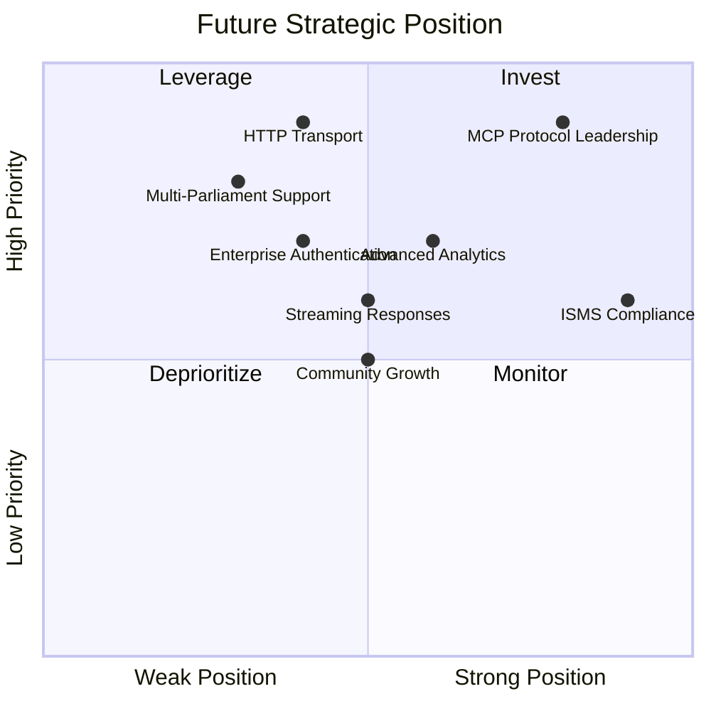
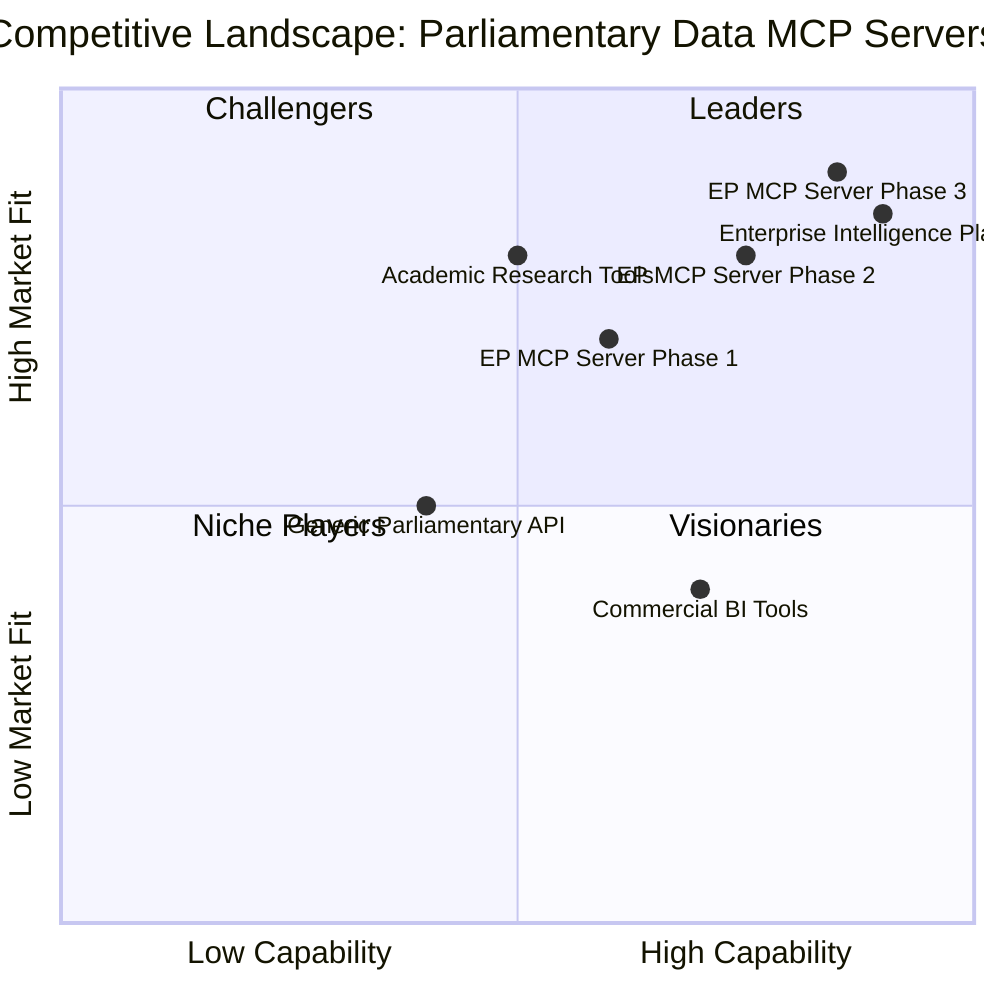
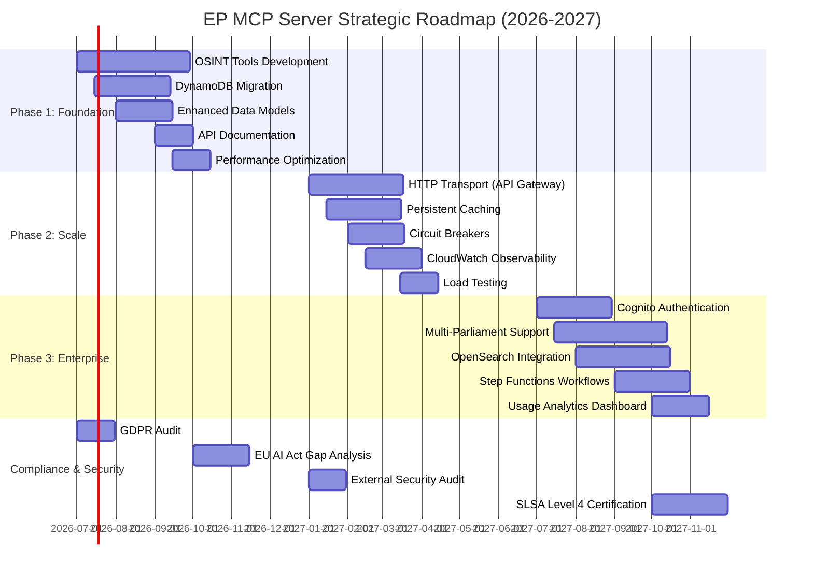
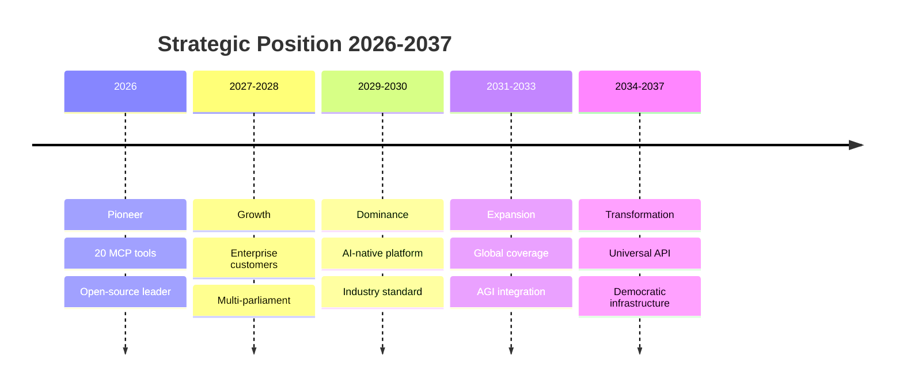

  

<h1 align="center">💼 European Parliament MCP Server — Future SWOT Analysis</h1>

  <strong>🏗️ Future Strategic Opportunities</strong> 
  <em>📈 Strategic Analysis for Parliamentary Data Platform Evolution</em>

  
  
  
  

**📋 Document Owner:** CEO | **📄 Version:** 2.0 | **📅 Last Updated:** 2026-02-23 (UTC)  
**🔄 Review Cycle:** Quarterly | **⏰ Next Review:** 2026-05-23  
**🏷️ Classification:** Public (Open Source MCP Server)

---

## 📑 Table of Contents

- [Executive Summary](#-executive-summary)
- [Future Strengths](#-future-strengths)
- [Future Weaknesses](#-future-weaknesses-to-address)
- [Future Opportunities](#-future-opportunities)
- [Future Threats](#-future-threats-to-mitigate)
- [Strategic Initiatives](#-strategic-initiatives-matrix)
- [🔮 Visionary Roadmap: 2027–2037](#-visionary-roadmap-20272037)
- [Policy Alignment](#-policy-alignment)
- [Related Documents](#-related-documents)

---

## 🎯 Executive Summary

This future SWOT analysis evaluates the strategic trajectory of the European Parliament MCP Server, building on the current state analysis in [SWOT.md](SWOT.md). It identifies how planned **serverless AWS infrastructure** and **OSINT-grade intelligence tools** (inspired by [Hack23 CIA](https://github.com/Hack23/cia)) will strengthen the platform's competitive position.

> **🤖 AI Evolution Context:** Strategic analysis assumes progression from **Anthropic Opus 4.6** (2026) through future AI generations, with **minor platform updates every ~2.3 months** and **major version upgrades annually** through 2037. SWOT factors account for AI model competition, emerging LLM paradigms, potential AGI disruption, and the evolving landscape of democratic technology.

---

## 💪 Future Strengths

| # | Strength | Impact | Timeline |
|---|----------|--------|----------|
| S1 | **Multi-parliament OSINT data access** — Unique cross-parliament intelligence analysis capability | 🟢 High | Phase 3 |
| S2 | **Enterprise-grade AWS security** — Cognito, IAM, KMS, GuardDuty, Security Hub | 🟢 High | Phase 3 |
| S3 | **Serverless auto-scaling** — Lambda + DynamoDB handles any traffic pattern, pay-per-use | 🟢 High | Phase 2 |
| S4 | **20+ MCP tools with OSINT intelligence** — Most comprehensive parliamentary data MCP server | 🟢 High | Phase 1 |
| S5 | **API Gateway HTTP transport** — Remote deployment via AWS CloudFront edge delivery | 🟢 High | Phase 2 |
| S6 | **Full ISMS documentation** — Industry-leading security transparency | 🟡 Medium | Current |
| S7 | **SLSA Level 3 + EU CRA** — Regulatory compliance advantage | 🟡 Medium | Current |
| S8 | **CIA-style intelligence products** — MEP scorecards, coalition analysis, risk assessments, network maps | 🟢 High | Phase 1 |

---

## ⚠️ Future Weaknesses to Address

| # | Weakness | Mitigation | Priority |
|---|----------|------------|----------|
| W1 | **Increased complexity** — More tools and features increase maintenance burden | Modular architecture, automated testing | 🟠 High |
| W2 | **Multi-parliament API differences** — Each parliament API has different formats | Adapter pattern, unified data model | 🟡 Medium |
| W3 | **Authentication overhead** — Auth adds latency and complexity for simple use cases | Optional auth, stdio bypass | 🟡 Medium |
| W4 | **Resource requirements** — Persistent caching and analytics need more resources | Configurable resource limits | 🟢 Low |
| W5 | **Breaking changes risk** — Major version upgrades may break existing clients | Semantic versioning, migration guides | 🟡 Medium |

---

## 🚀 Future Opportunities

| # | Opportunity | Strategy | Potential |
|---|------------|----------|-----------|
| O1 | **MCP protocol adoption growth** — Expanding AI assistant ecosystem | First-mover advantage in parliamentary data | 🟢 High |
| O2 | **EU digital transparency push** — Regulatory mandates for open data access | Position as reference implementation | 🟢 High |
| O3 | **Multi-parliament demand** — Researchers need cross-parliament analysis | Unique value proposition | 🟢 High |
| O4 | **Enterprise AI adoption** — Organizations integrating AI for political analysis | Enterprise features and support | 🟡 Medium |
| O5 | **Academic partnerships** — Universities studying EU politics need data tools | Free tier for academic use | 🟡 Medium |
| O6 | **Journalism & fact-checking** — Growing demand for parliamentary data verification | Specialized reporting tools | 🟡 Medium |

---

## 🔴 Future Threats to Mitigate

| # | Threat | Mitigation | Severity |
|---|--------|------------|----------|
| T1 | **MCP protocol changes** — Breaking changes in MCP specification | Active participation in MCP community | 🟠 High |
| T2 | **EP API changes** — European Parliament API modifications or deprecation | API versioning, adapter pattern | 🟠 High |
| T3 | **Competitor emergence** — Other parliamentary data MCP servers | Feature leadership, community building | 🟡 Medium |
| T4 | **AI regulation** — EU AI Act implications for data processing | GDPR compliance, transparency documentation | 🟡 Medium |
| T5 | **Funding sustainability** — Open-source project long-term maintenance | Community contributions, sponsorship | 🟡 Medium |

---

## 📊 Strategic Initiatives Matrix

| Initiative | Strengths Leveraged | Weaknesses Addressed | Opportunities Captured | Threats Mitigated |
|-----------|-------------------|---------------------|----------------------|-------------------|
| **Multi-parliament expansion** | S1, S4 | W2 | O2, O3 | T2, T3 |
| **Enterprise security suite** | S2, S6, S7 | W3 | O4 | T4 |
| **HTTP transport & streaming** | S3, S5 | W4 | O1, O4 | T1 |
| **Community & partnerships** | S6 | W1, W5 | O5, O6 | T3, T5 |
| **Advanced analytics** | S4 | W1 | O3, O6 | T3 |

---

## 🎯 Competitive Landscape Analysis

### **Market Positioning Quadrant**

### **Competitive Comparison Matrix**

| Feature | EP MCP Server (Current) | Generic API Wrappers | Commercial BI Tools | Enterprise Intelligence Platform | **Future EP MCP** |
|---------|------------------------|---------------------|---------------------|----------------------------------|-------------------|
| **MCP Protocol Support** | ✅ Native | ❌ No | ❌ No | ❌ No | ✅ Enhanced |
| **OSINT Intelligence Tools** | ⚠️ Basic (2) | ❌ No | ⚠️ Limited | ✅ Advanced (15+) | ✅ Advanced (15+) |
| **Multi-Parliament Data** | ❌ No (EP only) | ⚠️ Varies | ✅ Yes | ✅ Yes | ✅ Yes (4+) |
| **Serverless AWS** | ❌ No (local) | ⚠️ Varies | ✅ Yes | ⚠️ Varies | ✅ Yes |
| **Real-Time Streaming** | ❌ No | ❌ No | ✅ Yes | ⚠️ Limited | ✅ Yes |
| **Enterprise Auth** | ❌ No | ⚠️ Limited | ✅ Yes | ✅ Yes | ✅ OAuth 2.0 |
| **ISMS Compliance** | ✅ Full docs | ❌ No | ⚠️ Partial | ⚠️ Partial | ✅ Full + audited |
| **Open Source** | ✅ Apache 2.0 | ⚠️ Varies | ❌ Proprietary | ✅ GPL/Apache | ✅ Apache 2.0 |
| **Cost** | 🟢 Free | 🟢 Free-$ | 🔴 $$ | 🟡 $-$$ | 🟡 Free-$ |

**Legend:** ✅ Full Support | ⚠️ Partial Support | ❌ Not Supported

### **Competitive Advantages (Phase 3)**

| Advantage | Description | Sustainability |
|-----------|-------------|----------------|
| **MCP Protocol First** | Only parliamentary data MCP server with native protocol support | 🟢 High - Early mover advantage |
| **CIA-Grade OSINT** | Intelligence tools inspired by Hack23 CIA methodology | 🟡 Medium - Can be replicated |
| **Full Transparency** | Complete ISMS documentation, public security architecture | 🟢 High - Cultural advantage |
| **Serverless Scalability** | AWS serverless handles any traffic pattern cost-effectively | 🟡 Medium - Others can adopt |
| **Multi-Parliament** | Unique cross-parliament comparison capabilities | 🟢 High - Data integration complexity |

---

## 🛡️ Risk Mitigation Strategy per Threat

### **Threat T1: MCP Protocol Changes**

**Mitigation Strategy:**

| Action | Timeline | Owner | Cost |
|--------|----------|-------|------|
| **Active MCP Community Participation** | Ongoing | CTO | 5 hrs/week |
| **Maintain MCP Protocol Compatibility Layer** | Q3 2026 | Engineering | $10K |
| **Automated Protocol Version Testing** | Q3 2026 | DevOps | $5K |
| **Deprecation Warning System** | Q4 2026 | Engineering | $3K |
| **Backward Compatibility Guarantee (2 versions)** | Policy | Product | $0 |

**Success Criteria:** Zero breaking changes for users during MCP protocol updates

---

### **Threat T2: EP API Changes**

**Mitigation Strategy:**

| Action | Timeline | Owner | Cost |
|--------|----------|-------|------|
| **API Adapter Pattern Implementation** | Q3 2026 | Architecture | $15K |
| **EP API Version Monitoring Service** | Q3 2026 | DevOps | $8K |
| **Automated API Schema Validation** | Q4 2026 | Engineering | $12K |
| **Fallback to Cached Data Strategy** | Q4 2026 | Engineering | $7K |
| **EP API Change Notification System** | Q1 2027 | DevOps | $5K |

**Success Criteria:** <1 hour downtime for any EP API changes

---

### **Threat T3: Competitor Emergence**

**Mitigation Strategy:**

| Action | Timeline | Owner | Cost |
|--------|----------|-------|------|
| **Accelerate OSINT Tool Development** | Q3-Q4 2026 | Product | $40K |
| **Community Building Program** | Ongoing | Marketing | $15K/year |
| **Feature Differentiation (Multi-Parliament)** | Q3 2027 | Engineering | $50K |
| **Documentation Excellence Initiative** | Q4 2026 | Tech Writer | $20K |
| **Academic Partnership Program** | Q1 2027 | Business Dev | $10K |

**Success Criteria:** Maintain #1 GitHub ranking for parliamentary MCP servers

---

### **Threat T4: AI Regulation (EU AI Act)**

**Mitigation Strategy:**

| Action | Timeline | Owner | Cost |
|--------|----------|-------|------|
| **GDPR Compliance Audit** | Q3 2026 | Legal + CISO | $25K |
| **Privacy Impact Assessment (DPIA)** | Q3 2026 | Legal | $15K |
| **EU AI Act Gap Analysis** | Q4 2026 | Legal + CISO | $20K |
| **Transparency Documentation Enhancement** | Q4 2026 | Tech Writer | $10K |
| **External Legal Review** | Q1 2027 | Legal | $30K |

**Success Criteria:** Full compliance with EU AI Act by effective date

---

### **Threat T5: Funding Sustainability**

**Mitigation Strategy:**

| Action | Timeline | Owner | Cost |
|--------|----------|-------|------|
| **GitHub Sponsors Program Launch** | Q3 2026 | Marketing | $5K |
| **Enterprise Support Tier** | Q1 2027 | Sales | $20K |
| **Consulting Services (Implementation)** | Q2 2027 | Consulting | $0 (revenue) |
| **Grant Applications (EU Horizon, NLnet)** | Q3 2026 | Business Dev | $10K |
| **Hackathon & Conference Sponsorships** | Ongoing | Marketing | $15K/year |

**Success Criteria:** $100K annual recurring revenue by Q4 2027

---

## 📅 Strategic Initiative Timeline (Gantt Chart)

---

## 📊 ISMS Compliance Alignment per Strategy

### **SO Strategies (Strengths-Opportunities)**

| Strategy | Strengths Used | Opportunities Captured | ISMS Alignment |
|----------|---------------|------------------------|----------------|
| **Lead MCP parliamentary data space** | S4 (MCP tools), S6 (ISMS docs) | O1 (MCP adoption), O2 (EU transparency) | Secure Development Policy: Architecture documentation requirements |
| **Multi-parliament OSINT platform** | S1 (OSINT data), S8 (CIA-style products) | O3 (Multi-parliament demand), O5 (Academic partnerships) | Data Classification: Public data handling, cross-border compliance |
| **Enterprise AWS scalability** | S2 (AWS security), S3 (Serverless) | O4 (Enterprise AI adoption) | Cloud Security: AWS Well-Architected alignment, auto-scaling controls |

---

### **ST Strategies (Strengths-Threats)**

| Strategy | Strengths Used | Threats Mitigated | ISMS Alignment |
|----------|---------------|-------------------|----------------|
| **Community-driven development** | S6 (ISMS), S7 (SLSA L3) | T3 (Competitor), T5 (Funding) | Open Source Policy: Community governance, contribution guidelines |
| **Adapter pattern for API resilience** | S2 (AWS), S4 (Tools) | T2 (EP API changes) | Business Continuity: API versioning, fallback strategies |
| **Regulatory compliance leadership** | S6 (ISMS), S7 (CRA) | T4 (AI regulation) | Privacy Policy: GDPR compliance, EU AI Act readiness |

---

### **WO Strategies (Weaknesses-Opportunities)**

| Strategy | Weaknesses Addressed | Opportunities Captured | ISMS Alignment |
|----------|---------------------|------------------------|----------------|
| **Modular architecture** | W1 (Complexity) | O1 (MCP adoption), O4 (Enterprise) | Secure Development: Modular design, microservices security |
| **Unified data model** | W2 (Multi-parliament) | O3 (Cross-parliament) | Data Classification: Standardized entity models |
| **Optional authentication** | W3 (Auth overhead) | O5 (Academic), O6 (Journalism) | Access Control: Tiered access, public/private endpoints |

---

### **WT Strategies (Weaknesses-Threats)**

| Strategy | Weaknesses Addressed | Threats Mitigated | ISMS Alignment |
|----------|---------------------|-------------------|----------------|
| **Semantic versioning** | W5 (Breaking changes) | T1 (MCP protocol), T3 (Competitor) | Change Management: Version control, deprecation policy |
| **Configuration management** | W4 (Resource requirements) | T5 (Funding) | Asset Management: Resource inventory, cost optimization |
| **Migration guides** | W5 (Breaking changes) | T2 (EP API), T3 (Competitor) | Documentation Standards: User guides, migration paths |

---

## 📈 KPI Measurement Framework

### **Strategic KPIs (Quarterly Review)**

| KPI | Measurement Method | Target Q3 2026 | Target Q4 2026 | Target Q1 2027 | Owner |
|-----|-------------------|----------------|----------------|----------------|-------|
| **Market Leadership** | GitHub stars rank vs competitors | Top 3 | Top 2 | #1 | Product |
| **Feature Completeness** | Tool count vs roadmap | 20/20 tools | 25/25 tools | 30/30 tools | Engineering |
| **Community Growth** | Monthly active contributors | 5 | 10 | 15 | Community |
| **Revenue** | MRR from enterprise/consulting | $0 | $5K | $15K | Sales |
| **Compliance Maturity** | ISMS policy implementation % | 90% | 95% | 100% | CISO |

---

### **Operational KPIs (Monthly Review)**

| KPI | Measurement Method | Alert Threshold | Target | Owner |
|-----|-------------------|-----------------|--------|-------|
| **System Availability** | API Gateway uptime % | <99.9% | >99.95% | DevOps |
| **Response Time p95** | CloudWatch metrics | >200ms | <150ms | SRE |
| **Error Rate** | Lambda error logs | >1% | <0.5% | Engineering |
| **Cost per Request** | AWS billing / request count | >$0.0001 | <$0.00005 | FinOps |
| **Security Incidents** | Incident log count | >0 | 0 | CISO |

---

### **Business KPIs (Weekly Review)**

| KPI | Measurement Method | Alert Threshold | Target | Owner |
|-----|-------------------|-----------------|--------|-------|
| **API Requests** | CloudWatch request count | <100K/week | >200K/week | Product |
| **User Satisfaction** | GitHub issue sentiment | <80% positive | >90% positive | Support |
| **Documentation Quality** | Readability score + completeness | <85% | >90% | Tech Writer |
| **Pull Request Velocity** | Avg time to merge | >7 days | <3 days | Engineering |
| **Community Engagement** | Issues + PRs + discussions | <10/week | >20/week | Community |

---

## 🔗 ISO 27001 Controls Mapping

| Control | Description | Implementation |
|---------|-------------|----------------|
| **A.6.2.1** | Mobile device policy | All development on managed devices per MDM policy |
| **A.6.2.2** | Teleworking | Remote work security per Acceptable Use Policy |
| **A.9.2.1** | User registration and de-registration | IAM user lifecycle management |
| **A.9.2.2** | User access provisioning | Least privilege access via IAM policies |
| **A.9.2.3** | Management of privileged access rights | MFA required for admin access, CloudTrail logging |
| **A.16.1.1** | Responsibilities and procedures | Incident response plan documents SWOT threat mitigation |
| **A.16.1.5** | Response to information security incidents | PagerDuty integration, runbooks per threat scenario |

### **NIST CSF 2.0 Mapping**

| Function | Category | Implementation |
|----------|----------|----------------|
| **ID.RA-1** | Asset vulnerabilities identified and documented | Risk register tracks all threats and weaknesses |
| **ID.RA-2** | Cyber threat intelligence received | GitHub Security Advisories, AWS Security Bulletins |
| **ID.RA-3** | Threats identified and documented | SWOT threats T1-T5 with mitigation strategies |
| **ID.RA-4** | Potential business impacts identified | Competitive analysis quantifies market risks |
| **ID.RA-5** | Threats, vulnerabilities, likelihoods, impacts determined | Risk mitigation tables with severity ratings |
| **ID.RA-6** | Risk responses identified and prioritized | Strategic initiative timeline prioritizes high-impact actions |

### **CIS Controls v8.1 Mapping**

| Control | Safeguard | Implementation |
|---------|-----------|----------------|
| **17.1** | Designate personnel to manage incident response | CISO owns security incidents, defined in SWOT |
| **17.2** | Establish and maintain contact information | On-call rotation documented, PagerDuty integration |
| **17.3** | Establish and maintain enterprise incident response | Mitigation strategies per threat with owners and timelines |
| **17.5** | Assign key roles and responsibilities | RACI matrix for strategic initiatives (CEO, CTO, CISO, etc.) |
| **17.6** | Define mechanisms for communicating during incident | Threat-specific communication plans documented |
| **17.9** | Establish and maintain security incident thresholds | KPI alert thresholds defined (e.g., <99.9% availability) |

---

## 🔮 Visionary Roadmap: 2027–2037

> **Strategic Analysis Evolution** — From near-term SWOT assessment to decade-long strategic intelligence, accounting for AI model progression from Anthropic Opus 4.6 through future AGI and the transformative impact on democratic technology.

### 📅 Strategic Evolution Timeline

| Year | Version | AI Context | Strategic Milestone |
|------|---------|-----------|-------------------|
| **2026** | v1.0 | Anthropic Opus 4.6 | Foundation: 20-tool MCP server, OSINT intelligence, serverless AWS |
| **2027** | v2.0 | Opus 5.x / Competitors | Cloud Intelligence: multi-region, enterprise customers |
| **2028** | v3.0 | Next-gen multimodal LLMs | Parliament Federation: EU + national parliament integration |
| **2029** | v4.0 | Specialized political AI | AI-Native Platform: autonomous tool orchestration |
| **2030** | v5.0 | Near-AGI reasoning | Knowledge Graph: semantic parliamentary intelligence |
| **2031** | v6.0 | Early AGI | Autonomous Intelligence: self-improving analysis |
| **2032** | v7.0 | AGI-assisted development | Predictive Governance: legislative outcome forecasting |
| **2033** | v8.0 | AGI co-development | Global Democracy: 50+ parliament coverage |
| **2034** | v9.0 | Mature AGI | AGI-Ready: human-AI governance collaboration |
| **2035** | v10.0 | Post-AGI | Decentralized: edge-sovereign deployment |
| **2036** | v11.0 | AGI-native | Universal API: standard for all democracies |
| **2037** | v12.0 | Superintelligent assistants | Transcendent: real-time citizen engagement |

> **Minor updates every ~2.3 months** deliver incremental strategic refinements between major releases.

### 💪 Long-Term Strengths (2027–2037)

| ID | Strength | Impact Period | Strategic Value |
|----|----------|--------------|----------------|
| **S9** | First-mover in MCP parliamentary intelligence | 2027–2030 | Establishes de-facto standard before competitors can replicate |
| **S10** | Open-source trust and transparency | 2027–2037 | Government and NGO adoption favors open over proprietary |
| **S11** | AI model agnosticism via MCP protocol | 2028–2035 | Survives AI model disruptions; works with any LLM/AGI |
| **S12** | Federated multi-parliament architecture | 2028–2033 | Network effects create exponential value with each parliament added |
| **S13** | ISMS/ISO 27001 compliance heritage | 2027–2037 | Enterprise credibility from day one; required for government contracts |
| **S14** | AGI-native design principles | 2031–2037 | Architecture designed for AGI from 2026; competitors must retrofit |

### ⚠️ Long-Term Weaknesses (2027–2037)

| ID | Weakness | Mitigation Window | Strategy |
|----|----------|-------------------|----------|
| **W6** | Single-ecosystem dependency (AWS) | 2028–2030 | Evaluate multi-cloud abstraction layer |
| **W7** | Resource constraints vs. big tech competitors | 2027–2029 | Focus on niche (parliamentary data) where big tech won't compete |
| **W8** | Technical debt from rapid AI evolution | 2029–2033 | Quarterly architecture reviews; ruthless deprecation policy |
| **W9** | Regulatory uncertainty (EU AI Act evolution) | 2027–2030 | Active participation in EU AI Act working groups |

### 🚀 Long-Term Opportunities (2027–2037)

| ID | Opportunity | Timing | Revenue Potential |
|----|------------|--------|-------------------|
| **O7** | Multi-parliament SaaS platform | 2028–2030 | €500K–2M ARR per parliament |
| **O8** | AI-generated parliamentary journalism | 2027–2029 | Disrupts €10B+ political media market |
| **O9** | Government contract intelligence-as-a-service | 2029–2032 | €5M+ annual government contracts |
| **O10** | AGI-powered citizen engagement tools | 2031–2035 | New market category worth €1B+ |
| **O11** | Global democracy monitoring standard | 2033–2037 | UN/EU institutional adoption |
| **O12** | Real-time legislative impact prediction | 2030–2034 | €10M+ from financial sector clients |

### ⚡ Long-Term Threats (2027–2037)

| ID | Threat | Probability | Impact | Mitigation |
|----|--------|------------|--------|------------|
| **T6** | Big tech (Google/Microsoft/OpenAI) enters parliamentary AI | Medium | High | Differentiate on domain expertise and open-source trust |
| **T7** | AGI makes specialized tools obsolete | Low (pre-2033) | Critical | Design for AGI augmentation, not replacement |
| **T8** | EU regulates AI use in governance contexts | High | Medium | Compliance-first design; participate in regulatory process |
| **T9** | Quantum computing breaks current security | Low (pre-2032) | High | Post-quantum cryptography migration path from 2030 |
| **T10** | Open-source fatigue / sustainability crisis | Medium | Medium | Build sustainable business model by 2028 |
| **T11** | Data sovereignty fragmentation across EU | Medium | Medium | Federated architecture with per-country deployment |

### 📊 Strategic Position Evolution

### 🏛️ Competitive Landscape 2027–2037

| Era | Key Competitors | Our Advantage | Strategic Response |
|-----|----------------|---------------|-------------------|
| **2027–2028** | UK Parliament MCP, Congress.gov MCP | First-mover + OSINT depth | Federate, don't compete |
| **2029–2030** | Big tech political AI tools | Domain expertise + open-source trust | Build irreplaceable data moats |
| **2031–2033** | AGI-native startups | Enterprise compliance heritage | Position as governance infrastructure |
| **2034–2037** | Unknown (AGI disruption) | Institutional relationships + data provenance | Evolve from tool to standard |

---

## 🔗 Policy Alignment

| ISMS Policy | Relevance | Link |
|-------------|-----------|------|
| 🔒 Secure Development | Strategic security requirements | [Secure_Development_Policy.md](https://github.com/Hack23/ISMS-PUBLIC/blob/main/Secure_Development_Policy.md) |
| 🌐 Open Source Policy | OSS governance strategy | [Open_Source_Policy.md](https://github.com/Hack23/ISMS-PUBLIC/blob/main/Open_Source_Policy.md) |
| 🏷️ Classification | Strategic impact classification | [CLASSIFICATION.md](https://github.com/Hack23/ISMS-PUBLIC/blob/main/CLASSIFICATION.md) |

---

## 📚 Related Documents

| Document | Description | Link |
|----------|-------------|------|
| 💼 SWOT (Current) | Current strategic analysis | [SWOT.md](SWOT.md) |
| 🚀 Future Architecture | Architecture roadmap | [FUTURE_ARCHITECTURE.md](FUTURE_ARCHITECTURE.md) |
| 🧠 Future Mindmap | Capability expansion | [FUTURE_MINDMAP.md](FUTURE_MINDMAP.md) |
| 🛡️ Future Security Architecture | Security evolution | [FUTURE_SECURITY_ARCHITECTURE.md](FUTURE_SECURITY_ARCHITECTURE.md) |

---

  <em>This future SWOT analysis is maintained as part of the <a href="https://github.com/Hack23/ISMS-PUBLIC">Hack23 AB ISMS</a> framework.</em> 
  <em>Licensed under <a href="LICENSE.md">Apache-2.0</a></em>

