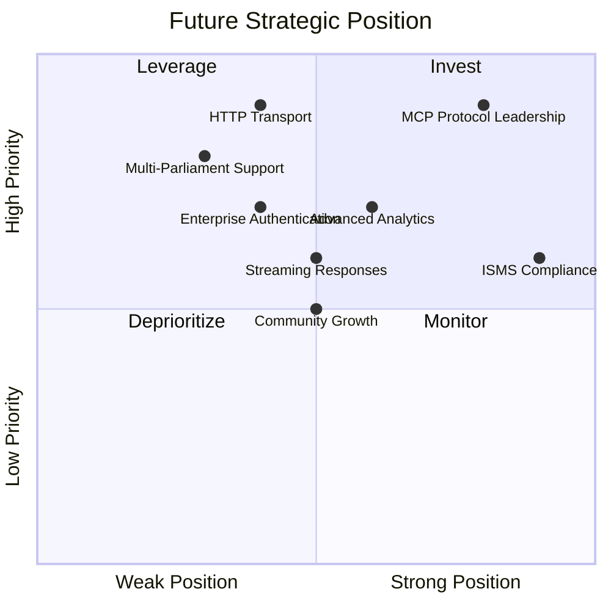

  

<h1 align="center">💼 European Parliament MCP Server — Future SWOT Analysis</h1>

  <strong>🏗️ Future Strategic Opportunities</strong> 
  <em>📈 Strategic Analysis for Parliamentary Data Platform Evolution</em>

  
  
  
  

**📋 Document Owner:** CEO | **📄 Version:** 1.0 | **📅 Last Updated:** 2026-02-20 (UTC)  
**🔄 Review Cycle:** Quarterly | **⏰ Next Review:** 2026-05-20  
**🏷️ Classification:** Public (Open Source MCP Server)

---

## 📑 Table of Contents

- [Executive Summary](#-executive-summary)
- [Future Strengths](#-future-strengths)
- [Future Weaknesses](#-future-weaknesses-to-address)
- [Future Opportunities](#-future-opportunities)
- [Future Threats](#-future-threats-to-mitigate)
- [Strategic Initiatives](#-strategic-initiatives-matrix)
- [Policy Alignment](#-policy-alignment)
- [Related Documents](#-related-documents)

---

## 🎯 Executive Summary

This future SWOT analysis evaluates the strategic trajectory of the European Parliament MCP Server, building on the current state analysis in [SWOT.md](SWOT.md). It identifies how planned **serverless AWS infrastructure** and **OSINT-grade intelligence tools** (inspired by [Hack23 CIA](https://github.com/Hack23/cia)) will strengthen the platform's competitive position.

---

## 💪 Future Strengths

| # | Strength | Impact | Timeline |
|---|----------|--------|----------|
| S1 | **Multi-parliament OSINT data access** — Unique cross-parliament intelligence analysis capability | 🟢 High | Phase 3 |
| S2 | **Enterprise-grade AWS security** — Cognito, IAM, KMS, GuardDuty, Security Hub | 🟢 High | Phase 3 |
| S3 | **Serverless auto-scaling** — Lambda + DynamoDB handles any traffic pattern, pay-per-use | 🟢 High | Phase 2 |
| S4 | **20+ MCP tools with OSINT intelligence** — Most comprehensive parliamentary data MCP server | 🟢 High | Phase 1 |
| S5 | **API Gateway HTTP transport** — Remote deployment via AWS CloudFront edge delivery | 🟢 High | Phase 2 |
| S6 | **Full ISMS documentation** — Industry-leading security transparency | 🟡 Medium | Current |
| S7 | **SLSA Level 3 + EU CRA** — Regulatory compliance advantage | 🟡 Medium | Current |
| S8 | **CIA-style intelligence products** — MEP scorecards, coalition analysis, risk assessments, network maps | 🟢 High | Phase 1 |

---

## ⚠️ Future Weaknesses to Address

| # | Weakness | Mitigation | Priority |
|---|----------|------------|----------|
| W1 | **Increased complexity** — More tools and features increase maintenance burden | Modular architecture, automated testing | 🟠 High |
| W2 | **Multi-parliament API differences** — Each parliament API has different formats | Adapter pattern, unified data model | 🟡 Medium |
| W3 | **Authentication overhead** — Auth adds latency and complexity for simple use cases | Optional auth, stdio bypass | 🟡 Medium |
| W4 | **Resource requirements** — Persistent caching and analytics need more resources | Configurable resource limits | 🟢 Low |
| W5 | **Breaking changes risk** — Major version upgrades may break existing clients | Semantic versioning, migration guides | 🟡 Medium |

---

## 🚀 Future Opportunities

| # | Opportunity | Strategy | Potential |
|---|------------|----------|-----------|
| O1 | **MCP protocol adoption growth** — Expanding AI assistant ecosystem | First-mover advantage in parliamentary data | 🟢 High |
| O2 | **EU digital transparency push** — Regulatory mandates for open data access | Position as reference implementation | 🟢 High |
| O3 | **Multi-parliament demand** — Researchers need cross-parliament analysis | Unique value proposition | 🟢 High |
| O4 | **Enterprise AI adoption** — Organizations integrating AI for political analysis | Enterprise features and support | 🟡 Medium |
| O5 | **Academic partnerships** — Universities studying EU politics need data tools | Free tier for academic use | 🟡 Medium |
| O6 | **Journalism & fact-checking** — Growing demand for parliamentary data verification | Specialized reporting tools | 🟡 Medium |

---

## 🔴 Future Threats to Mitigate

| # | Threat | Mitigation | Severity |
|---|--------|------------|----------|
| T1 | **MCP protocol changes** — Breaking changes in MCP specification | Active participation in MCP community | 🟠 High |
| T2 | **EP API changes** — European Parliament API modifications or deprecation | API versioning, adapter pattern | 🟠 High |
| T3 | **Competitor emergence** — Other parliamentary data MCP servers | Feature leadership, community building | 🟡 Medium |
| T4 | **AI regulation** — EU AI Act implications for data processing | GDPR compliance, transparency documentation | 🟡 Medium |
| T5 | **Funding sustainability** — Open-source project long-term maintenance | Community contributions, sponsorship | 🟡 Medium |

---

## 📊 Strategic Initiatives Matrix

| Initiative | Strengths Leveraged | Weaknesses Addressed | Opportunities Captured | Threats Mitigated |
|-----------|-------------------|---------------------|----------------------|-------------------|
| **Multi-parliament expansion** | S1, S4 | W2 | O2, O3 | T2, T3 |
| **Enterprise security suite** | S2, S6, S7 | W3 | O4 | T4 |
| **HTTP transport & streaming** | S3, S5 | W4 | O1, O4 | T1 |
| **Community & partnerships** | S6 | W1, W5 | O5, O6 | T3, T5 |
| **Advanced analytics** | S4 | W1 | O3, O6 | T3 |

---

## 🔗 Policy Alignment

| ISMS Policy | Relevance | Link |
|-------------|-----------|------|
| 🔒 Secure Development | Strategic security requirements | [Secure_Development_Policy.md](https://github.com/Hack23/ISMS-PUBLIC/blob/main/Secure_Development_Policy.md) |
| 🌐 Open Source Policy | OSS governance strategy | [Open_Source_Policy.md](https://github.com/Hack23/ISMS-PUBLIC/blob/main/Open_Source_Policy.md) |
| 🏷️ Classification | Strategic impact classification | [CLASSIFICATION.md](https://github.com/Hack23/ISMS-PUBLIC/blob/main/CLASSIFICATION.md) |

---

## 📚 Related Documents

| Document | Description | Link |
|----------|-------------|------|
| 💼 SWOT (Current) | Current strategic analysis | [SWOT.md](SWOT.md) |
| 🚀 Future Architecture | Architecture roadmap | [FUTURE_ARCHITECTURE.md](FUTURE_ARCHITECTURE.md) |
| 🧠 Future Mindmap | Capability expansion | [FUTURE_MINDMAP.md](FUTURE_MINDMAP.md) |
| 🛡️ Future Security Architecture | Security evolution | [FUTURE_SECURITY_ARCHITECTURE.md](FUTURE_SECURITY_ARCHITECTURE.md) |

---

  <em>This future SWOT analysis is maintained as part of the <a href="https://github.com/Hack23/ISMS-PUBLIC">Hack23 AB ISMS</a> framework.</em> 
  <em>Licensed under <a href="LICENSE.md">Apache-2.0</a></em>

