  

<h1 align="center">🎯 European Parliament MCP Server — Future Threat Model</h1>

  <strong>🛡️ Threat Analysis for Planned Architecture Evolution</strong> 
  <em>🔍 STRIDE • MITRE ATT&CK • Cloud-Native Security • Enterprise Features</em>

  
  
  
  

**📋 Document Owner:** CEO | **📄 Version:** 1.0 | **📅 Last Updated:** 2026-02-26 (UTC)  
**🔄 Review Cycle:** Quarterly | **⏰ Next Review:** 2026-05-26  
**🏷️ Classification:** Public (Open Source MCP Server)

---

## 📑 Table of Contents

- [Purpose \& Scope](#-purpose--scope)
- [ISMS Policy Alignment](#-isms-policy-alignment)
- [Architecture Evolution Overview](#-architecture-evolution-overview)
- [Future System Classification](#-future-system-classification)
- [New Attack Surface Analysis](#-new-attack-surface-analysis)
- [STRIDE Analysis for Future Components](#-stride-analysis-for-future-components)
- [MITRE ATT\&CK Mapping for Future Threats](#️-mitre-attck-mapping-for-future-threats)
- [Kill Chain Analysis for Cloud Architecture](#-kill-chain-analysis-for-cloud-architecture)
- [Future Threat Agent Evolution](#-future-threat-agent-evolution)
- [Future Scenario-Centric Threats](#-future-scenario-centric-threats)
- [Quantitative Risk Assessment for Future State](#-quantitative-risk-assessment-for-future-state)
- [Future Security Controls \& Mitigations](#️-future-security-controls--mitigations)
- [Compliance Impact Analysis](#-compliance-impact-analysis)
- [Migration Threat Considerations](#-migration-threat-considerations)
- [Related Documents](#-related-documents)

---

## 🎯 Purpose & Scope

This document provides a **forward-looking threat analysis** for the planned architectural evolution of the European Parliament MCP Server, as described in [FUTURE_SECURITY_ARCHITECTURE.md](./FUTURE_SECURITY_ARCHITECTURE.md) and [FUTURE_ARCHITECTURE.md](./FUTURE_ARCHITECTURE.md). It identifies **new threats, expanded attack surfaces, and required security controls** that will emerge as the system evolves from a local stdio-based MCP server to an enterprise-grade cloud-native platform.

### **🔍 Future Architecture Phases Covered**

| Phase | Architecture Change | Timeline | Threat Impact |
|-------|-------------------|----------|---------------|
| **Phase 1** | Authentication & Authorization (OAuth2/OIDC, API keys) | Q2 2026 | 🔴 High — New identity attack surface |
| **Phase 2** | Cloud-Native Security (AWS Lambda, API Gateway, WAF) | Q3 2026 | 🔴 High — Cloud infrastructure threats |
| **Phase 3** | AI-Powered Threat Detection (ML anomaly detection) | Q4 2026 | 🟡 Medium — AI-specific threats |
| **Phase 4** | Zero-Trust Architecture (mTLS, service mesh) | Q1 2027 | 🟡 Medium — Network architecture changes |
| **Phase 5** | Advanced Monitoring & Analytics (SIEM, SOC) | Q1 2027 | 🟢 Low — Enhanced detection capabilities |
| **Phase 6** | Multi-Tenancy & Enterprise Features | Q2 2027 | 🔴 High — Tenant isolation threats |
| **Phase 7** | Compliance Automation | Q3 2027 | 🟢 Low — Compliance risk reduction |

### **🔗 Policy Alignment**

Integrated with:
- [🎯 Hack23 AB Threat Modeling Policy](https://github.com/Hack23/ISMS-PUBLIC/blob/main/Threat_Modeling.md) — STRIDE methodology and multi-strategy framework
- [🛠️ Secure Development Policy](https://github.com/Hack23/ISMS-PUBLIC/blob/main/Secure_Development_Policy.md) — Security architecture documentation requirements
- [🔒 Cryptography Policy](https://github.com/Hack23/ISMS-PUBLIC/blob/main/Cryptography_Policy.md) — Encryption standards for cloud deployments
- [🌐 Network Security Policy](https://github.com/Hack23/ISMS-PUBLIC/blob/main/Network_Security_Policy.md) — VPC and WAF configuration requirements
- [🔑 Access Control Policy](https://github.com/Hack23/ISMS-PUBLIC/blob/main/Access_Control_Policy.md) — IAM and RBAC for multi-tenant access

---

## 🔐 ISMS Policy Alignment

### Related ISMS Policies

| Policy | Relevance to Future State | Link |
|--------|--------------------------|------|
| **Open Source Policy** | Public transparency for cloud-hosted open source | [View](https://github.com/Hack23/ISMS-PUBLIC/blob/main/Open_Source_Policy.md) |
| **Secure Development Policy** | Cloud-native secure development requirements | [View](https://github.com/Hack23/ISMS-PUBLIC/blob/main/Secure_Development_Policy.md) |
| **Risk Management Policy** | Expanded risk assessment for cloud infrastructure | [View](https://github.com/Hack23/ISMS-PUBLIC/blob/main/Risk_Management_Policy.md) |
| **Privacy Policy** | Enhanced GDPR compliance for multi-tenant data | [View](https://github.com/Hack23/ISMS-PUBLIC/blob/main/Privacy_Policy.md) |
| **Network Security Policy** | VPC, WAF, and zero-trust network requirements | [View](https://github.com/Hack23/ISMS-PUBLIC/blob/main/Network_Security_Policy.md) |
| **Cryptography Policy** | KMS, mTLS, and encryption-at-rest standards | [View](https://github.com/Hack23/ISMS-PUBLIC/blob/main/Cryptography_Policy.md) |
| **Incident Response Plan** | Cloud-native incident detection and response | [View](https://github.com/Hack23/ISMS-PUBLIC/blob/main/Incident_Response_Plan.md) |

---

## 🏗️ Architecture Evolution Overview

```mermaid
graph TB
    subgraph "Current Architecture (stdio)"
        CA[🔌 MCP Server<br/>stdio transport]
        CB[🏛️ EP API<br/>HTTPS client]
        CC[💾 In-memory cache]
        CD[📋 stderr logging]
    end

    subgraph "Future Architecture (Cloud-Native)"
        FA[🚪 API Gateway<br/>+ WAF]
        FB[⚡ Lambda Functions<br/>MCP handlers]
        FC[🔐 Cognito/OAuth2<br/>Authentication]
        FD[📊 DynamoDB<br/>Cache + State]
        FE[🔍 CloudWatch<br/>+ GuardDuty]
        FF[🔑 KMS<br/>Encryption]
        FG[🌐 CloudFront<br/>CDN]
    end

    CA -->|Evolution| FA
    CB -->|Enhanced| FB
    CC -->|Persistent| FD
    CD -->|Cloud-native| FE

    style CA fill:#ffcc80
    style FA fill:#81c784
```

---

## 📊 Future System Classification

### **🏷️ Security Classification Matrix (Future State)**

| Dimension | Current Level | Future Level | Change Driver |
|----------|--------------|-------------|---------------|
| **🔐 Confidentiality** | Public | **Internal** (tenant data, API keys, usage analytics) | Multi-tenancy, authentication credentials, tenant-specific data |
| **🔒 Integrity** | Moderate | **High** (SLA-bound data accuracy) | Enterprise customers requiring guaranteed data integrity |
| **⚡ Availability** | Standard | **High** (99.9% SLA target) | Cloud deployment with paid tier availability commitments |

---

## 🎯 New Attack Surface Analysis

The evolution from local stdio to cloud-native introduces significant new attack surfaces:

### **Attack Surface Expansion Map**

```mermaid
mindmap
  root((🎯 Future<br/>Attack Surface))
    🔐 Identity & Access
      OAuth2/OIDC tokens
      API key management
      Session hijacking
      Credential stuffing
      Token replay attacks
    🌐 Network Exposure
      API Gateway endpoints
      CloudFront distribution
      WAF bypass attempts
      DDoS amplification
      TLS termination
    ☁️ Cloud Infrastructure
      Lambda function abuse
      DynamoDB injection
      S3 bucket misconfig
      IAM privilege escalation
      Cross-account access
    💳 Multi-Tenancy
      Tenant data isolation
      Cross-tenant access
      Resource exhaustion
      Billing fraud
      Configuration leakage
    🤖 AI/ML Components
      Model poisoning
      Adversarial inputs
      Training data bias
      Inference manipulation
      ML pipeline compromise
```

### **New Threat Categories (Not in Current Model)**

| # | New Threat | Phase | STRIDE | Impact | Priority |
|---|-----------|-------|--------|--------|----------|
| FT-1 | OAuth2 token theft via XSS or phishing | Phase 1 | S, I | High | 🔴 Critical |
| FT-2 | API key brute-force or enumeration | Phase 1 | S, E | High | 🔴 Critical |
| FT-3 | Lambda cold start timing attacks | Phase 2 | I, D | Medium | 🟡 Medium |
| FT-4 | DynamoDB injection via crafted queries | Phase 2 | T, E | High | 🔴 High |
| FT-5 | Cross-tenant data leakage in shared Lambda | Phase 6 | I, E | Critical | 🔴 Critical |
| FT-6 | WAF rule bypass via encoded payloads | Phase 2 | S, E | High | 🟠 High |
| FT-7 | CloudFront cache poisoning | Phase 2 | T, I | Medium | 🟡 Medium |
| FT-8 | ML model adversarial manipulation | Phase 3 | T, I | High | 🟠 High |
| FT-9 | KMS key rotation failure exposure | Phase 2 | I | Medium | 🟡 Medium |
| FT-10 | Multi-tenant billing fraud via resource abuse | Phase 6 | D, E | Medium | 🟡 Medium |

---

## 🎭 STRIDE Analysis for Future Components

### **Component: API Gateway + WAF (Phase 2)**

| STRIDE | Threat | Attack Vector | Planned Mitigation | Priority |
|--------|--------|---------------|-------------------|----------|
| **S** | Spoofed API requests bypassing WAF | Forged headers, IP spoofing | WAF geo-blocking, request signing, mTLS | 🔴 High |
| **T** | API response tampering in transit | CDN cache manipulation | Signed responses, integrity headers, cache validation | 🟠 Medium |
| **R** | Unattributed API requests | Missing request correlation | CloudTrail, API Gateway access logs, request IDs | 🟡 Medium |
| **I** | API key leakage in logs/errors | Verbose error responses | API key masking, structured logging, secret scanning | 🔴 High |
| **D** | DDoS via API Gateway | Volumetric attacks, application-layer flood | AWS Shield Advanced, WAF rate limiting, CloudFront | 🔴 High |
| **E** | API Gateway misconfiguration | Overly permissive IAM, missing authorization | Infrastructure as Code, least privilege IAM, API key scopes | 🟠 Medium |

### **Component: Authentication Service (Phase 1)**

| STRIDE | Threat | Attack Vector | Planned Mitigation | Priority |
|--------|--------|---------------|-------------------|----------|
| **S** | Credential stuffing attacks | Automated login with leaked credentials | MFA enforcement, rate limiting, CAPTCHA | 🔴 Critical |
| **T** | JWT token manipulation | Algorithm confusion, key confusion attacks | RS256 only, key rotation, token validation | 🔴 High |
| **R** | Authentication event forgery | Tampered audit logs | CloudTrail immutable logging, log integrity | 🟡 Medium |
| **I** | User data exposure via token claims | Over-scoped JWT claims | Minimal claims, token encryption, short expiry | 🟠 Medium |
| **D** | Authentication service DoS | Login flood, MFA bombing | Cognito throttling, adaptive rate limiting | 🟠 High |
| **E** | OAuth2 scope escalation | Token scope manipulation, consent bypass | Server-side scope validation, consent verification | 🔴 High |

### **Component: DynamoDB Data Store (Phase 2)**

| STRIDE | Threat | Attack Vector | Planned Mitigation | Priority |
|--------|--------|---------------|-------------------|----------|
| **S** | Cross-tenant data access | Partition key manipulation | Row-level security, IAM conditions, tenant isolation | 🔴 Critical |
| **T** | Data corruption via injection | NoSQL injection in query parameters | Input validation, parameterized queries, Zod schemas | 🔴 High |
| **R** | Unaudited data modifications | Missing change tracking | DynamoDB Streams, CloudTrail data events | 🟡 Medium |
| **I** | Encryption key compromise | KMS key exposure or misconfiguration | AWS-managed KMS, automatic key rotation, key policies | 🟠 Medium |
| **D** | Read/write capacity exhaustion | Hot partition attacks, throughput flooding | Auto-scaling, on-demand capacity, request throttling | 🟠 High |
| **E** | IAM role assumption abuse | Overly permissive Lambda execution role | Least privilege IAM, resource-based policies | 🔴 High |

---

## 🎖️ MITRE ATT&CK Mapping for Future Threats

### **New ATT&CK Techniques (Cloud Matrix)**

| Technique ID | Technique Name | Future Component | Planned Mitigation | Priority |
|-------------|----------------|-----------------|-------------------|----------|
| **T1078** | Valid Accounts | OAuth2/Cognito authentication | MFA, anomalous login detection, session management | 🔴 Critical |
| **T1098** | Account Manipulation | API key management | Key rotation, scope limitations, usage monitoring | 🔴 High |
| **T1530** | Data from Cloud Storage | DynamoDB, S3 buckets | Encryption at rest (KMS), IAM policies, VPC endpoints | 🟠 High |
| **T1537** | Transfer Data to Cloud Account | Multi-tenant data exfiltration | VPC flow logs, data loss prevention, egress monitoring | 🔴 High |
| **T1190** | Exploit Public-Facing Application | API Gateway endpoints | WAF OWASP rules, input validation, rate limiting | 🔴 Critical |
| **T1526** | Cloud Service Discovery | AWS service enumeration | IAM least privilege, CloudTrail monitoring, GuardDuty | 🟡 Medium |
| **T1580** | Cloud Infrastructure Discovery | Lambda/DynamoDB reconnaissance | Minimal error details, service quotas, access logging | 🟡 Medium |
| **T1110** | Brute Force | Authentication endpoints | Account lockout, CAPTCHA, rate limiting, MFA | 🔴 Critical |
| **T1556** | Modify Authentication Process | OAuth2 flow manipulation | Server-side validation, PKCE enforcement, token binding | 🟠 High |
| **T1613** | Container Discovery | Lambda function enumeration | Function URL restrictions, IAM authorization, VPC isolation | 🟡 Medium |

---

## 🔗 Kill Chain Analysis for Cloud Architecture

| Kill Chain Phase | Future Attack Activity | New Defensive Controls | New Detection Mechanisms |
|-----------------|----------------------|----------------------|------------------------|
| **1️⃣ Reconnaissance** | Cloud service fingerprinting, API schema discovery, tenant enumeration | WAF bot protection, API schema obfuscation, generic error responses | GuardDuty reconnaissance alerts, CloudTrail API enumeration detection |
| **2️⃣ Weaponization** | OAuth2 exploit preparation, API key generation tooling, cloud exploit kits | Threat intelligence integration, proactive vulnerability scanning | Threat intelligence feeds, dark web monitoring |
| **3️⃣ Delivery** | Credential stuffing, phishing for API keys, malicious OAuth client registration | MFA enforcement, CAPTCHA, OAuth client vetting, API key rate limiting | Cognito authentication anomalies, failed login monitoring, GuardDuty |
| **4️⃣ Exploitation** | API injection, WAF bypass, Lambda function abuse, DynamoDB injection | WAF OWASP rules, Lambda function validation, parameterized queries | WAF blocked request logs, Lambda error monitoring, DynamoDB Streams |
| **5️⃣ Installation** | Persistent API keys, backdoor OAuth clients, Lambda layer manipulation | Key rotation policies, OAuth client audit, Lambda layer restrictions | API key usage anomalies, OAuth client inventory, Lambda layer monitoring |
| **6️⃣ Command & Control** | Abuse of legitimate API endpoints for C2, data tunneling via DynamoDB | Egress filtering, VPC flow logs, behavioral analysis | CloudWatch anomaly detection, VPC flow log analysis, GuardDuty |
| **7️⃣ Actions on Objectives** | Cross-tenant data access, bulk data exfiltration, service disruption | Tenant isolation, DLP controls, rate limiting, encryption | Data access pattern monitoring, billing anomalies, CloudTrail alerts |

---

## 👥 Future Threat Agent Evolution

### **New Threat Actors for Cloud Architecture**

| Threat Actor | Motivation Change | Capability Change | New TTPs |
|-------------|------------------|------------------|----------|
| **Nation-State APT** | Interest in API-level mass surveillance of parliamentary data users | Cloud exploitation capabilities | T1078 (Valid Accounts), T1537 (Cloud Data Transfer) |
| **Cybercriminal** | **New actor:** Monetization via stolen API keys, tenant data ransom | Cloud credential theft, ransomware-as-a-service | T1110 (Brute Force), T1098 (Account Manipulation) |
| **Insider Threat** | Expanded access via cloud admin roles, multi-tenant data access | AWS console access, IAM privilege escalation | T1078 (Valid Accounts), T1530 (Cloud Storage) |
| **Competitor** | API scraping via legitimate accounts, usage pattern intelligence | Automated API abuse, multi-account evasion | T1530 (Cloud Storage), T1526 (Service Discovery) |
| **Automated Bots** | API endpoint abuse, credential stuffing, rate limit evasion | Cloud-scale bot infrastructure | T1110 (Brute Force), T1190 (Public Application Exploit) |

---

## 🎬 Future Scenario-Centric Threats

### **Scenario F1: Multi-Tenant Data Breach (Phase 6)**

**🎯 Attack Objective:** Access parliamentary data belonging to another tenant's subscription

```mermaid
graph LR
    A[1️⃣ Register free tier account] --> B[2️⃣ Discover tenant isolation flaw]
    B --> C[3️⃣ Craft cross-tenant query]
    C --> D[4️⃣ Access premium tenant data]
    D --> E[5️⃣ Exfiltrate competitor intelligence]
    
    style A fill:#ffa726
    style B fill:#ff6b6b
    style C fill:#ef5350
    style D fill:#ef5350
    style E fill:#ef5350
```

**🛡️ Planned Mitigations:** DynamoDB partition-key tenant isolation, IAM condition-based access, API Gateway tenant context validation, data access audit logging

**📉 Risk Score:** 🔴 **Critical (9.0/10)** — Tenant data confidentiality is paramount

### **Scenario F2: OAuth2 Token Theft Campaign (Phase 1)**

**🎯 Attack Objective:** Steal OAuth2 access tokens to impersonate legitimate API users

```mermaid
graph LR
    A[1️⃣ Phishing campaign targeting EP researchers] --> B[2️⃣ Steal OAuth2 refresh token]
    B --> C[3️⃣ Generate access tokens]
    C --> D[4️⃣ Systematic MEP data harvesting]
    D --> E[5️⃣ GDPR violation + data sale]
    
    style A fill:#ffa726
    style B fill:#ff6b6b
    style C fill:#ef5350
    style D fill:#ef5350
    style E fill:#ef5350
```

**🛡️ Planned Mitigations:** Short-lived access tokens (15 min), refresh token rotation, anomalous usage detection, IP-based session binding, MFA enforcement

**📉 Risk Score:** 🟠 **High (8.0/10)** — GDPR implications and user trust impact

### **Scenario F3: Cloud Infrastructure Compromise (Phase 2)**

**🎯 Attack Objective:** Compromise AWS Lambda functions to manipulate parliamentary data at scale

```mermaid
graph LR
    A[1️⃣ Exploit Lambda layer vulnerability] --> B[2️⃣ Inject malicious code in runtime]
    B --> C[3️⃣ Intercept all EP API responses]
    C --> D[4️⃣ Manipulate voting records at scale]
    D --> E[5️⃣ Widespread disinformation]
    
    style A fill:#ff6b6b
    style B fill:#ef5350
    style C fill:#ef5350
    style D fill:#ef5350
    style E fill:#ef5350
```

**🛡️ Planned Mitigations:** Lambda layer pinning, function code signing, VPC isolation, GuardDuty Lambda protection, runtime integrity monitoring

**📉 Risk Score:** 🔴 **Critical (9.5/10)** — Democratic integrity threat at scale

---

## 📊 Quantitative Risk Assessment for Future State

### **Future Risk Matrix**

### **Future Risk Priority Table**

| Priority | Risk | Likelihood | Impact | Phase | Planned Mitigation |
|----------|------|-----------|--------|-------|-------------------|
| 🔴 P1 | Cross-tenant data breach | Medium | Critical | Phase 6 | Partition isolation, IAM conditions, audit logging |
| 🔴 P2 | Lambda function compromise | Low | Critical | Phase 2 | Code signing, VPC isolation, GuardDuty |
| 🟠 P3 | OAuth2 token theft | Medium-High | High | Phase 1 | Short-lived tokens, MFA, anomaly detection |
| 🟠 P4 | Credential stuffing | High | Medium | Phase 1 | Rate limiting, CAPTCHA, account lockout |
| 🟡 P5 | API DDoS attack | High | Medium | Phase 2 | AWS Shield, WAF, CloudFront |
| 🟡 P6 | DynamoDB injection | Low | High | Phase 2 | Parameterized queries, Zod validation |

---

## 🛡️ Future Security Controls & Mitigations

### **Defense-in-Depth Evolution**

```mermaid
graph TB
    subgraph "🏰 Layer 1: Edge Security (New)"
        L1A[🌐 CloudFront CDN]
        L1B[🛡️ AWS WAF v2]
        L1C[⚡ AWS Shield Advanced]
        L1D[🔒 TLS 1.3 Termination]
    end
    
    subgraph "🔐 Layer 2: Identity (New)"
        L2A[👤 Cognito User Pools]
        L2B[🔑 OAuth2/OIDC]
        L2C[📱 MFA Enforcement]
        L2D[🎫 API Key Management]
    end
    
    subgraph "🏗️ Layer 3: Application (Enhanced)"
        L3A[✅ Zod Input Validation]
        L3B[📝 TypeScript Strict Mode]
        L3C[⚡ Lambda Function Isolation]
        L3D[🔍 Runtime Integrity Checks]
    end
    
    subgraph "💾 Layer 4: Data (New)"
        L4A[🔐 KMS Encryption at Rest]
        L4B[🏷️ Tenant Isolation]
        L4C[📊 DynamoDB Streams Audit]
        L4D[🗄️ S3 Bucket Policies]
    end
    
    subgraph "📦 Layer 5: Supply Chain (Maintained)"
        L5A[🏅 SLSA Level 3]
        L5B[🤖 Dependabot + Snyk]
        L5C[📋 SBOM CycloneDX]
        L5D[🔐 npm Provenance]
    end
    
    subgraph "🔍 Layer 6: Monitoring (Enhanced)"
        L6A[🔍 GuardDuty]
        L6B[📊 Security Hub]
        L6C[📋 CloudTrail]
        L6D[🚨 SIEM Integration]
    end
    
    L1A --> L2A --> L3A --> L4A --> L5A --> L6A
    
    style L1A fill:#ff6b6b
    style L2A fill:#ffa726
    style L3A fill:#feca57
    style L4A fill:#48dbfb
    style L5A fill:#1dd1a1
    style L6A fill:#9b59b6
```

---

## 📋 Compliance Impact Analysis

### **Framework Alignment for Future State**

| Framework | Current Coverage | Future Coverage | New Controls Required |
|-----------|-----------------|----------------|----------------------|
| **ISO 27001:2022** | A.5.1, A.8.2, A.8.8, A.8.25 | + A.5.15 (Access Control), A.5.23 (Cloud), A.8.11 (Data Masking), A.8.16 (Monitoring) | Identity management, cloud security, data masking |
| **NIST CSF 2.0** | ID.AM, ID.RA, PR.DS, PR.IP | + PR.AC (Access Control), PR.AT (Awareness), DE.AE (Anomaly), RS.MI (Mitigation) | Authentication, training, anomaly detection |
| **CIS Controls v8.1** | 1.1, 2.7, 3.3, 6.2, 7.1 | + 3.11 (Encrypt Sensitive Data), 5.4 (MFA), 6.8 (Log Management), 8.5 (Audit Logs) | Encryption at rest, MFA, centralized logging |
| **AWS Well-Architected** | N/A (local deployment) | SEC-1 through SEC-10 (full Security Pillar) | IAM, detective controls, infrastructure protection, data protection, incident response |

---

## 🔄 Migration Threat Considerations

### **Transition Period Risks**

During the migration from stdio to cloud-native architecture, specific transition threats must be managed:

| Transition Risk | Description | Mitigation | Timeline |
|----------------|-------------|-----------|----------|
| **Dual-mode operation** | Running both stdio and cloud endpoints increases attack surface | Feature flags, phased rollout, separate security monitoring | Phase 1-2 |
| **Credential migration** | Moving from no-auth to OAuth2 introduces credential management complexity | Gradual auth enforcement, backward-compatible API | Phase 1 |
| **Data migration** | Moving from in-memory cache to DynamoDB introduces data persistence risks | Encryption at rest from day one, minimal data retention | Phase 2 |
| **Configuration drift** | IaC and manual configuration divergence during migration | Terraform/CDK enforcement, drift detection, compliance scans | Phase 2-3 |

---

## 📚 Related Documents

| Document | Description | Link |
|----------|-------------|------|
| 🎯 Current Threat Model | Active threat analysis for current architecture | [THREAT_MODEL.md](./THREAT_MODEL.md) |
| 🛡️ Security Architecture | Current security design and controls | [SECURITY_ARCHITECTURE.md](./SECURITY_ARCHITECTURE.md) |
| 🚀 Future Security Architecture | Planned security enhancements and roadmap | [FUTURE_SECURITY_ARCHITECTURE.md](./FUTURE_SECURITY_ARCHITECTURE.md) |
| 🏛️ Future Architecture | Planned system architecture evolution | [FUTURE_ARCHITECTURE.md](./FUTURE_ARCHITECTURE.md) |
| 🔄 Business Continuity Plan | Recovery objectives and procedures | [BCPPlan.md](./BCPPlan.md) |
| 📋 CRA Assessment | EU Cyber Resilience Act conformity | [CRA-ASSESSMENT.md](./CRA-ASSESSMENT.md) |

---

  <em>This future threat model is maintained as part of the <a href="https://github.com/Hack23/ISMS-PUBLIC">Hack23 AB ISMS</a> framework.</em> 
  <em>Licensed under <a href="LICENSE.md">Apache-2.0</a></em>

