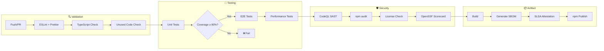
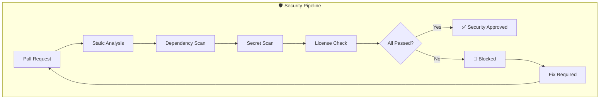
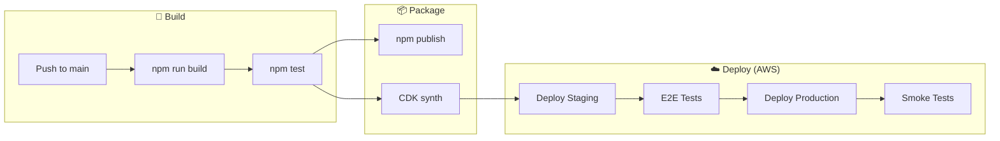
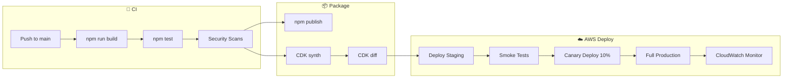
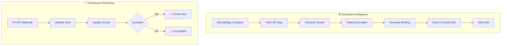

  

<h1 align="center">⚙️ European Parliament MCP Server — Future Workflows</h1>

  <strong>🏗️ CI/CD Pipeline Evolution</strong> 
  <em>📈 Advanced Automation and DevSecOps Practices</em>

  
  
  
  

**📋 Document Owner:** CEO | **📄 Version:** 1.0 | **📅 Last Updated:** 2026-02-20 (UTC)  
**🔄 Review Cycle:** Quarterly | **⏰ Next Review:** 2026-05-20  
**🏷️ Classification:** Public (Open Source MCP Server)

---

## 📑 Table of Contents

- [Executive Summary](#-executive-summary)
- [Current Workflows Baseline](#-current-workflows-baseline)
- [Enhanced CI Pipeline](#-enhanced-ci-pipeline)
- [Security Automation](#️-security-automation)
- [Release Management](#-release-management)
- [Quality Gates Evolution](#-quality-gates-evolution)
- [Monitoring & Observability](#-monitoring--observability)
- [Policy Alignment](#-policy-alignment)
- [Related Documents](#-related-documents)

---

## 🎯 Executive Summary

This document outlines the future CI/CD workflow evolution for the European Parliament MCP Server, enhancing automation, security scanning, and release management practices. **All future deployment targets serverless AWS** (Lambda, CDK, CloudFormation) — see [FUTURE_ARCHITECTURE.md](FUTURE_ARCHITECTURE.md).

---

## 📊 Current Workflows Baseline

Current workflows are documented in [WORKFLOWS.md](WORKFLOWS.md) and [.github/WORKFLOWS.md](.github/WORKFLOWS.md).

**Current Workflows (11 total):**

| # | Workflow | Purpose |
|---|---------|---------|
| 1 | `test-and-report.yml` | Build, lint, test, coverage |
| 2 | `codeql.yml` | SAST security scanning |
| 3 | `release.yml` | npm publish with attestations |
| 4 | `integration-tests.yml` | Live API and E2E tests |
| 5 | `sbom-generation.yml` | Software Bill of Materials |
| 6 | `slsa-provenance.yml` | Build provenance attestation |
| 7 | `scorecard.yml` | OpenSSF security assessment |
| 8 | `dependency-review.yml` | Vulnerability & license scan |
| 9 | `labeler.yml` | Automatic PR labeling |
| 10 | `setup-labels.yml` | Repository label management |
| 11 | `copilot-setup-steps.yml` | Copilot agent environment |

**Current Tool Count:** 16 MCP tools (10 core data + 6 OSINT intelligence)

---

## 🔄 Enhanced CI Pipeline

### **🆕 Pipeline Enhancements**

| Enhancement | Current | Future | Benefit |
|-------------|---------|--------|---------|
| Performance tests | ❌ None | ✅ Response time benchmarks | Regression detection |
| Mutation testing | ❌ None | ✅ Stryker mutation testing | Test quality validation |
| API compatibility | ❌ None | ✅ Contract tests | Breaking change detection |
| Multi-Node testing | Single version | Node.js 24 + next LTS (e.g., 26) matrix | Forward compatibility |
| Canary releases | ❌ None | ✅ npm dist-tag canary | Risk reduction |

---

## 🛡️ Security Automation

### **📋 Enhanced Security Gates**

| Gate | Current | Future | Priority |
|------|---------|--------|----------|
| SAST | CodeQL | CodeQL + Semgrep | 🟢 Active |
| SCA | Dependabot + npm audit | + Snyk integration | 📋 Planned |
| License | FOSSA | FOSSA + license-checker | 🟢 Active |
| Secrets | GitHub secret scanning | + gitleaks pre-commit | 📋 Planned |
| Container | N/A | Docker image scanning | 📋 Planned |
| DAST | N/A | OWASP ZAP (for HTTP transport) | 📋 Planned |

### **🔒 Security Workflow**

---

## 📦 Release Management

### **🔄 Future Release Process**

| Phase | Actions | Automation | AWS Target |
|-------|---------|------------|------------|
| **Pre-release** | Version bump, changelog generation | `standard-version` | — |
| **Validation** | Full test suite, security scans | GitHub Actions | — |
| **Build** | TypeScript compilation, artifact creation | `tsc`, npm pack | — |
| **Attestation** | SLSA Level 3 provenance, SBOM | GitHub attestation | — |
| **Publish npm** | npm publish with provenance | Automated | npm registry |
| **Deploy AWS** | CDK deploy Lambda + API Gateway | GitHub Actions → CDK | Lambda, API GW, DynamoDB |
| **Post-release** | GitHub release, notification | Automated | SNS notification |

### **☁️ AWS Deployment Pipeline**

---

## 📊 Quality Gates Evolution

| Quality Gate | Current Threshold | Future Threshold |
|-------------|-------------------|-----------------|
| Unit test coverage | 80% lines | 85% lines, 75% branches |
| E2E test pass rate | 100% | 100% |
| ESLint violations | 0 errors | 0 errors, 0 warnings |
| TypeScript errors | 0 | 0 |
| npm audit | 0 critical/high | 0 critical/high/moderate |
| OpenSSF Scorecard | 8.0+ | 9.0+ |
| Bundle size | No limit | < 500KB |
| Performance regression | No check | < 10% regression |

---

## 📡 Monitoring & Observability

### **📊 Future Metrics**

| Metric | Source | Alert Threshold |
|--------|--------|----------------|
| Build duration | GitHub Actions | > 10 minutes |
| Test flakiness | Test results history | > 2% flaky rate |
| Dependency age | Dependabot | > 30 days behind |
| Security score | OpenSSF Scorecard | < 8.0 |
| npm download trend | npm stats | > 50% drop week-over-week |
| Coverage trend | Vitest coverage | > 2% decrease |
| OSINT tool accuracy | Intelligence validation | < 90% confidence |
| API response time | Performance monitoring | > 200ms p95 |

---

## 🚀 Visionary Workflow Advancements

### **🤖 AI-Augmented CI/CD**

| Feature | Description | Timeline |
|---------|-------------|----------|
| **AI Code Review** | LLM-powered code review for MCP tool patterns | Q3 2026 |
| **Intelligent Test Generation** | AI-generated tests for new OSINT tools | Q4 2026 |
| **Predictive Failure Detection** | ML model to predict build failures before they occur | Q1 2027 |
| **Auto-remediation** | Automated fix suggestions for common CI failures | Q1 2027 |
| **Copilot Agent Workflows** | GitHub Copilot agents for automated issue resolution | Q2 2027 |

### **☁️ AWS CDK Deployment Pipeline**

### **🔄 Multi-Environment Promotion**

| Environment | Trigger | Validation | AWS Region |
|------------|---------|------------|------------|
| **Development** | Every push | Unit tests, linting | `eu-west-1` |
| **Staging** | Merge to main | Integration + E2E tests | `eu-west-1` |
| **Canary** | After staging pass | 10% traffic, error rate <0.1% | `eu-west-1` |
| **Production** | After canary pass | Full traffic, CloudWatch alarms | `eu-west-1` + `us-east-1` |

### **📊 Intelligence Pipeline Automation**

Future workflows will include automated OSINT intelligence pipelines:

### **🧪 Advanced Testing Evolution**

| Capability | Current | Future | Target |
|-----------|---------|--------|--------|
| **Mutation Testing** | ❌ None | Stryker mutation testing | >80% mutation score |
| **Chaos Testing** | ❌ None | API failure injection | 100% graceful degradation |
| **Load Testing** | ❌ None | k6 performance tests | <200ms p95 under load |
| **Contract Testing** | Basic mocks | Pact contract tests | 100% EP API compatibility |
| **Visual Regression** | ❌ None | Report output validation | Zero visual regressions |
| **OSINT Validation** | Confidence scores | Ground truth comparison | >90% accuracy |

---

## 🔗 Policy Alignment

| ISMS Policy | Relevance | Link |
|-------------|-----------|------|
| 🔒 Secure Development | CI/CD security requirements | [Secure_Development_Policy.md](https://github.com/Hack23/ISMS-PUBLIC/blob/main/Secure_Development_Policy.md) |
| 🔍 Vulnerability Management | Automated scanning | [Vulnerability_Management.md](https://github.com/Hack23/ISMS-PUBLIC/blob/main/Vulnerability_Management.md) |
| 🌐 Open Source Policy | OSS release governance | [Open_Source_Policy.md](https://github.com/Hack23/ISMS-PUBLIC/blob/main/Open_Source_Policy.md) |
| 🚨 Incident Response | Automated alerting | [Incident_Response_Plan.md](https://github.com/Hack23/ISMS-PUBLIC/blob/main/Incident_Response_Plan.md) |

---

## 📚 Related Documents

| Document | Description | Link |
|----------|-------------|------|
| ⚙️ Workflows (Current) | Current CI/CD documentation | [WORKFLOWS.md](WORKFLOWS.md) |
| ⚙️ Workflows (Detailed) | Detailed GitHub workflow docs | [.github/WORKFLOWS.md](.github/WORKFLOWS.md) |
| 🚀 Future Architecture | Architecture roadmap | [FUTURE_ARCHITECTURE.md](FUTURE_ARCHITECTURE.md) |
| 🔄 Future Flowchart | Process evolution | [FUTURE_FLOWCHART.md](FUTURE_FLOWCHART.md) |
| 🛡️ Security Architecture | Security controls | [SECURITY_ARCHITECTURE.md](SECURITY_ARCHITECTURE.md) |

---

  <em>This future workflows document is maintained as part of the <a href="https://github.com/Hack23/ISMS-PUBLIC">Hack23 AB ISMS</a> framework.</em> 
  <em>Licensed under <a href="LICENSE.md">Apache-2.0</a></em>

