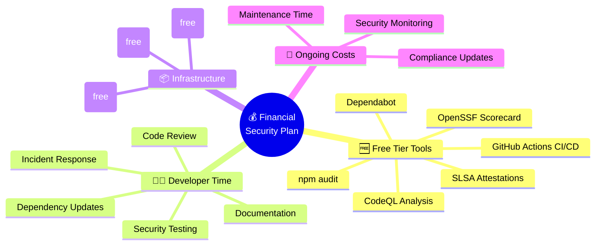
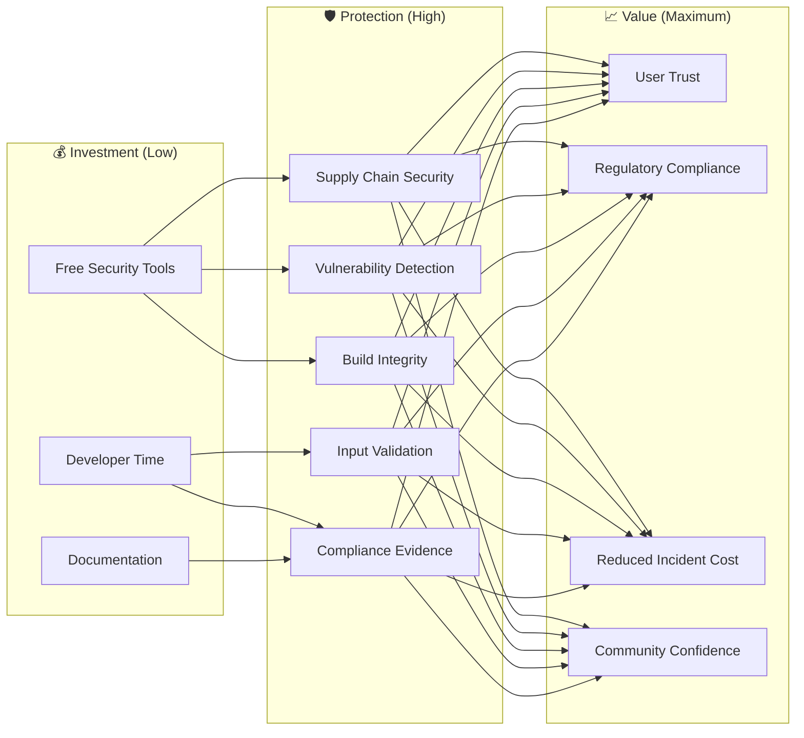

  

<h1 align="center">💰 European Parliament MCP Server — Financial Security Plan</h1>

  <strong>🛡️ Cost-Effective Security Investment Strategy</strong> 
  <em>💼 Optimizing Security ROI Through Strategic Resource Allocation</em>

  
  
  
  

**📋 Document Owner:** CEO | **📄 Version:** 1.0 | **📅 Last Updated:** 2026-02-20 (UTC)  
**🔄 Review Cycle:** Annual | **⏰ Next Review:** 2027-02-20  
**🏷️ Classification:** Public (Open Source MCP Server)

---

## 📑 Table of Contents

- [Purpose Statement](#-purpose-statement)
- [Cost Structure Overview](#-cost-structure-overview)
- [Security Investment Categories](#-security-investment-categories)
- [Security ROI Analysis](#-security-roi-analysis)
- [Risk-Based Budget Allocation](#️-risk-based-budget-allocation)
- [Operational Cost Optimization](#-operational-cost-optimization)
- [Financial Contingency](#-financial-contingency)
- [Classification Alignment](#️-classification-alignment)
- [Policy Alignment](#-policy-alignment)
- [Related Documents](#-related-documents)

---

## 🎯 Purpose Statement

This Financial Security Plan establishes a cost-effective security investment strategy for the European Parliament MCP Server. As an open-source project, the server leverages free-tier security tooling and community resources to maximize security ROI while minimizing financial burden.

The plan demonstrates how systematic security investment creates **competitive advantage** through comprehensive protection at minimal cost, aligning with Hack23 AB's commitment to security excellence.

*— James Pether Sörling, CEO/Founder*

---

## 📊 Cost Structure Overview

### **💵 Cost Breakdown**

| Category | Monthly Cost | Annual Cost | Notes |
|----------|-------------|-------------|-------|
| GitHub Actions (CI/CD) | $0 | $0 | Free tier for public repos |
| Dependabot | $0 | $0 | Included with GitHub |
| CodeQL Analysis | $0 | $0 | Free for public repos |
| npm Registry | $0 | $0 | Free for public packages |
| OpenSSF Scorecard | $0 | $0 | Free service |
| SLSA Attestations | $0 | $0 | GitHub-provided |
| FOSSA License Scanning | $0 | $0 | Free for open source |
| **Developer Time** | **Variable** | **Variable** | **Primary cost driver** |

---

## 💰 Security Investment Categories

| Category | Tools/Activities | Cost | ROI Impact |
|----------|-----------------|------|------------|
| **🔍 Static Analysis** | CodeQL, TypeScript strict mode, ESLint | $0 | 🟢 High |
| **📦 Dependency Security** | Dependabot, npm audit, lockfile | $0 | 🟢 High |
| **🏗️ Supply Chain** | SLSA Level 3, SBOM, attestations | $0 | 🟢 High |
| **✅ Input Validation** | Zod schemas, parameter sanitization | Dev time | 🟢 High |
| **🧪 Testing** | Vitest, 80%+ coverage, E2E tests | Dev time | 🟢 High |
| **📋 Documentation** | Security docs, threat model, BCP | Dev time | 🟡 Medium |
| **👀 Code Review** | PR reviews, branch protection | Dev time | 🟢 High |
| **📊 Monitoring** | OpenSSF Scorecard, security alerts | $0 | 🟡 Medium |

---

## 📈 Security ROI Analysis

### **Investment vs. Risk Reduction**

### **ROI Metrics**

| Metric | Value | Impact |
|--------|-------|--------|
| Cost of free security tools | $0/year | Maximum ROI |
| Vulnerabilities auto-detected | 95%+ of known CVEs | Prevents costly incidents |
| Build provenance coverage | 100% (SLSA Level 3) | Supply chain trust |
| Test coverage | 80%+ | Defect prevention |
| Time to vulnerability patch | < 7 days (high severity) | Reduced exposure window |
| OpenSSF Scorecard | 8.5+/10 | Community trust signal |

---

## 🛡️ Risk-Based Budget Allocation

| Risk Priority | Area | Allocation | Justification |
|--------------|------|------------|---------------|
| 🔴 Critical | Supply chain security | 30% of dev time | Highest impact attack vector |
| 🟠 High | Input validation & testing | 25% of dev time | Prevents runtime exploits |
| 🟡 Medium | Security documentation | 20% of dev time | Compliance and transparency |
| 🟡 Medium | Code review & quality | 15% of dev time | Defect prevention |
| 🟢 Low | Security monitoring | 10% of dev time | Automated detection |

---

## 📋 Operational Cost Optimization

### **🆓 Leveraging Free Security Tools**

| Tool | Purpose | Alternative (Paid) | Savings |
|------|---------|-------------------|---------|
| GitHub Actions | CI/CD | Jenkins, CircleCI | $50-500/mo |
| Dependabot | Dependency updates | Snyk Pro, Mend | $100-1000/mo |
| CodeQL | Static analysis | SonarCloud Pro, Checkmarx | $200-2000/mo |
| OpenSSF Scorecard | Security posture | Custom assessment | $500-5000/assessment |
| npm audit | Vulnerability scan | Snyk, WhiteSource | $100-500/mo |
| FOSSA | License compliance | Black Duck | $500-5000/mo |

### **💡 Cost Optimization Strategies**

1. **Automate Everything:** CI/CD handles security scanning automatically
2. **Shift Left:** Catch issues in development, not production
3. **Community Leverage:** Open source benefits from community security reviews
4. **Documentation as Code:** Security docs maintained alongside code
5. **Free Tier Maximization:** Use GitHub's comprehensive free offering for public repos

---

## 🔄 Financial Contingency

### **🚨 Security Incident Cost Estimates**

| Scenario | Estimated Cost | Mitigation |
|----------|---------------|------------|
| Critical vulnerability fix | 8-16 hours dev time | Automated detection, rapid response |
| Supply chain compromise | 16-40 hours dev time | SLSA, SBOM, provenance verification |
| npm package recall | 4-8 hours dev time | Automated publishing, version management |
| Security advisory creation | 2-4 hours dev time | Template-based process |
| Full security audit | 40-80 hours dev time | Continuous assessment reduces need |

### **📊 Contingency Reserve**

| Reserve Type | Allocation | Purpose |
|-------------|------------|---------|
| Critical response | 20 hours/quarter | Zero-day and critical CVE response |
| Routine maintenance | 10 hours/month | Dependency updates, monitoring |
| Documentation updates | 5 hours/quarter | ISMS compliance maintenance |

---

## 🏷️ Classification Alignment

| Dimension | Level | Financial Implication |
|----------|-------|----------------------|
| **🔐 Confidentiality** |  | No encryption-at-rest costs |
| **🔒 Integrity** |  | SLSA attestation costs (free) |
| **⚡ Availability** |  | No HA infrastructure costs |

---

## 🔗 Policy Alignment

| ISMS Policy | Relevance | Link |
|-------------|-----------|------|
| 🔒 Secure Development | Security investment requirements | [Secure_Development_Policy.md](https://github.com/Hack23/ISMS-PUBLIC/blob/main/Secure_Development_Policy.md) |
| 🔍 Vulnerability Management | Remediation cost planning | [Vulnerability_Management.md](https://github.com/Hack23/ISMS-PUBLIC/blob/main/Vulnerability_Management.md) |
| 🔄 Backup & Recovery | Recovery cost alignment | [Backup_Recovery_Policy.md](https://github.com/Hack23/ISMS-PUBLIC/blob/main/Backup_Recovery_Policy.md) |
| 🚨 Incident Response | Incident cost planning | [Incident_Response_Plan.md](https://github.com/Hack23/ISMS-PUBLIC/blob/main/Incident_Response_Plan.md) |
| 🏷️ Classification | Classification-driven costs | [CLASSIFICATION.md](https://github.com/Hack23/ISMS-PUBLIC/blob/main/CLASSIFICATION.md) |

---

## 📚 Related Documents

| Document | Description | Link |
|----------|-------------|------|
| 🎯 Threat Model | Risk assessment and mitigations | [THREAT_MODEL.md](THREAT_MODEL.md) |
| 🔄 Business Continuity Plan | Recovery objectives | [BCPPlan.md](BCPPlan.md) |
| 🛡️ CRA Assessment | Regulatory compliance costs | [CRA-ASSESSMENT.md](CRA-ASSESSMENT.md) |
| 📦 End-of-Life Strategy | Lifecycle management costs | [End-of-Life-Strategy.md](End-of-Life-Strategy.md) |
| 🛡️ Security Architecture | Security control implementation | [SECURITY_ARCHITECTURE.md](SECURITY_ARCHITECTURE.md) |

---

  <em>This financial security plan is maintained as part of the <a href="https://github.com/Hack23/ISMS-PUBLIC">Hack23 AB ISMS</a> framework.</em> 
  <em>Licensed under <a href="LICENSE.md">Apache-2.0</a></em>

