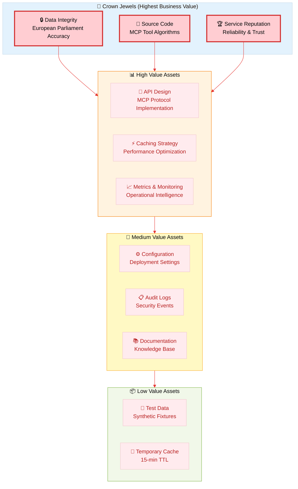
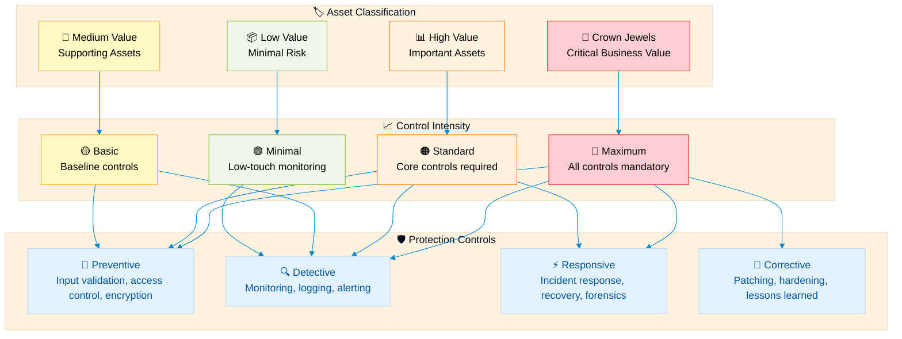

  

<h1 align="center">📊 European Parliament MCP Server — Information Classification</h1>

  <strong>🛡️ Asset-Centric Security Through Systematic Classification</strong> 
  <em>🔍 CIA Triad Analysis • Business Value Alignment • Risk-Based Protection</em>

  
  
  
  

**📋 Document Owner:** CEO | **📄 Version:** 1.0 | **📅 Last Updated:** 2026-02-17 (UTC)  
**🔄 Review Cycle:** Quarterly | **⏰ Next Review:** 2026-05-17  
**🏷️ Classification:** Public (Open MCP Protocol Implementation)

---

## 📑 Related Documents

| Document | Purpose | Link |
|----------|---------|------|
| 🛡️ **Security Architecture** | Current security implementation | [SECURITY_ARCHITECTURE.md](./SECURITY_ARCHITECTURE.md) |
| 🎯 **Threat Model** | STRIDE threat analysis | [THREAT_MODEL.md](./THREAT_MODEL.md) |
| 🏗️ **Architecture** | C4 model & system design | [ARCHITECTURE.md](./ARCHITECTURE.md) |
| 📊 **Data Model** | Entity relationships & schemas | [DATA_MODEL.md](./DATA_MODEL.md) |
| 🔐 **Security Policy** | Security practices & disclosure | [SECURITY.md](./SECURITY.md) |
| 📜 **Open Source Policy** | ISMS governance requirements | [Open_Source_Policy.md](./Open_Source_Policy.md) |

---

## 🎯 Purpose & Scope

Establish comprehensive information classification for the European Parliament MCP Server to enable **risk-based security controls** and **protection requirements** aligned with business value and regulatory obligations.

### **🌟 Transparency Commitment**
This classification demonstrates **🛡️ cybersecurity consulting expertise** through public documentation of systematic asset protection methodology, showcasing our **🏆 competitive advantage** via transparent risk management and **🤝 customer trust** through evidence-based security.

*— Based on Hack23 AB's commitment to security through transparency and excellence*

### **📚 Classification Framework**
- **🔐 CIA Triad Assessment:** Confidentiality, Integrity, Availability analysis
- **⚖️ Regulatory Mapping:** GDPR, EU CRA, ISO 27001 compliance requirements
- **💎 Business Value Alignment:** Crown jewel identification with revenue/trust impact
- **🎯 Risk-Based Controls:** Protection requirements scaled to classification level
- **📊 Asset Inventory:** Complete enumeration of information assets

### **🔍 Scope Definition**
**Included Assets:**
- 🗄️ European Parliament data (MEPs, sessions, votes, documents, committees)
- 💻 Source code & intellectual property (MCP tools, algorithms)
- 🔧 Configuration & infrastructure code (deployment, CI/CD)
- 📊 Operational data (logs, metrics, cache)
- 🔑 Credentials & secrets (API keys, service tokens)

**Out of Scope:**
- European Parliament's own data classification (we consume public data)
- End-user client applications (Claude Desktop, VS Code)
- Third-party MCP client implementations

### **🔗 Policy Alignment**
Integrated with [🎯 Hack23 AB Open Source Policy](https://github.com/Hack23/ISMS-PUBLIC/blob/main/Open_Source_Policy.md) and [🛡️ Secure Development Policy](https://github.com/Hack23/ISMS-PUBLIC/blob/main/Secure_Development_Policy.md) requirements.

---

## 📊 System Classification Matrix

### **🏷️ CIA Triad Assessment**

| Dimension | Level | Rationale | Business Impact | Controls |
|-----------|-------|-----------|----------------|----------|
| **🔐 Confidentiality** |  | European Parliament data is public open data |  | Public access, no encryption at rest required |
| **🔒 Integrity** |  | Data accuracy critical for political intelligence |  | Input validation, schema checks, immutable cache, audit logging |
| **⚡ Availability** |  | MCP protocol service for AI assistants; tolerates brief outages |  | Rate limiting, caching, monitoring, graceful degradation |

### **⚖️ Regulatory & Compliance Profile**

| Compliance Area | Classification | Implementation Status | Evidence |
|-----------------|----------------|----------------------|----------|
| **🇪🇺 GDPR** | Minimal Personal Data | MEP contact info (public role), no EU citizen tracking | [Privacy Policy](./SECURITY.md#privacy-policy) |
| **🇪🇺 EU CRA (Cyber Resilience Act)** | Medium Baseline | Non-safety-critical data service; secure development controls | [Security Architecture](./SECURITY_ARCHITECTURE.md) |
| **📋 ISO 27001** | Applicable Controls | A.8.2 (Classification), A.12.6 (Vulnerability Mgmt), A.14.2 (Security in Development) | [Compliance Mapping](./SECURITY_ARCHITECTURE.md#compliance-framework-mapping) |
| **🎯 NIST CSF 2.0** | Core Functions | ID.AM (Asset Mgmt), ID.RA (Risk Assessment), PR.DS (Data Security) | [NIST CSF Alignment](./SECURITY_ARCHITECTURE.md#nist-csf-20-alignment) |
| **🛡️ CIS Controls v8.1** | Priority Controls | 1.1 (Asset Inventory), 4.1 (Config Mgmt), 18.3 (Threat Modeling) | [CIS Controls](./SECURITY_ARCHITECTURE.md#cis-controls-v81-alignment) |
| **📊 SLA Targets** | 99.5% Availability | Single-region deployment with resilience roadmap | [Future Architecture](./FUTURE_SECURITY_ARCHITECTURE.md#high-availability) |
| **🔄 RPO / RTO** | RPO ≤ 1h / RTO ≤ 30min | Stateless server; cache rebuild acceptable | [Deployment Guide](./DEPLOYMENT_GUIDE.md#backup-and-recovery) |

---

## 💎 Asset Classification & Business Value

### **🏗️ Crown Jewel Analysis**

Following [Hack23 AB Asset-Centric Threat Modeling](https://github.com/Hack23/ISMS-PUBLIC/blob/main/Threat_Modeling.md#asset-centric-threat-modeling) methodology:

### **📋 Asset Inventory with Classification**

| Asset Category | Classification | Confidentiality | Integrity | Availability | Business Value | Protection Requirements |
|----------------|----------------|-----------------|-----------|--------------|----------------|------------------------|
| **💎 Crown Jewels** |
| 🔒 **Data Integrity** | Critical | Public | **High** | **Medium-High** |  | Input validation, schema checks, immutable audit, EP API verification |
| 🧠 **Source Code** | Critical | Internal | **High** | Medium |  | Private repo (public after release), dependency scanning, SLSA Level 3 |
| 🏆 **Service Reputation** | Critical | Public | **High** | **Medium-High** |  | Rate limiting, monitoring, graceful error handling, SLA tracking |
| **📊 High Value** |
| 🔧 **MCP Tool Logic** | High | Public (Open Source) | **High** | Medium |  | Code review, type safety, test coverage ≥80% |
| ⚡ **Caching Strategy** | High | Public | Medium | **High** |  | LRU eviction, 15-min TTL, cache integrity checks |
| 📈 **Metrics & Monitoring** | High | Internal | Medium | **High** |  | Prometheus metrics, structured logging, alerting |
| **📁 Medium Value** |
| ⚙️ **Configuration** | Medium | Confidential (secrets) | **High** | Medium |  | Secret management, env vars, no hardcoded credentials |
| 📋 **Audit Logs** | Medium | Internal | **High** | Medium |  | Immutable logging, retention policy, GDPR compliance |
| 📚 **Documentation** | Medium | Public | Medium | Low |  | Version control, accuracy reviews, cross-references |
| **📦 Low Value** |
| 🧪 **Test Fixtures** | Low | Public | Low | Low |  | Synthetic data only, no secrets |
| 💾 **Temporary Cache** | Low | Public | Medium | Medium |  | 15-min TTL, automatic eviction |

---

## 🔐 Confidentiality Levels

### **📊 Classification Scheme**

| Level | Description | Examples | Handling Requirements | Breach Impact |
|-------|-------------|----------|----------------------|---------------|
| **🔴 Highly Confidential** | Critical business secrets, regulatory protected | ❌ None in this system | Encryption at rest & transit, access logging, need-to-know | Severe: Legal liability, competitive disadvantage |
| **🟠 Confidential** | Internal use only, competitive intelligence | 🔑 Service credentials, 🔧 Internal config | Environment variables, secret management, no version control | High: Operational disruption, security incident |
| **🟡 Internal** | Business operations, non-public | 📋 Audit logs, 📈 Metrics data, 🧪 Test results | Access control, internal networks only | Medium: Privacy concerns, reputational risk |
| **🟢 Public** | Open data, published information | 🏛️ European Parliament data, 💻 Open source code, 📚 Documentation | No confidentiality controls | Low: Already public |

### **🗂️ European Parliament MCP Server Data Classification**

| Data Type | Confidentiality Level | Rationale | Protection |
|-----------|----------------------|-----------|------------|
| **🏛️ European Parliament Data** | 🟢 **Public** | Official EU open data portal | None required; verify source integrity |
| **💻 MCP Tool Source Code** | 🟢 **Public** (post-release) | Apache 2.0 open source | Private during development; public GitHub release |
| **🔑 Service Credentials** | 🟠 **Confidential** | EP API access (none required currently) | Environment variables, secret management |
| **📋 Audit Logs** | 🟡 **Internal** | Contains API usage patterns | Access control, retention policy, GDPR compliance |
| **📈 Performance Metrics** | 🟡 **Internal** | Operational intelligence | Internal dashboards only |
| **🧪 Test Data** | 🟢 **Public** | Synthetic fixtures only | No real data in tests |
| **⚙️ Deployment Config** | 🟡 **Internal** | Infrastructure settings (no secrets) | Version control, infrastructure as code |

---

## 🔒 Integrity Levels

### **📊 Classification Scheme**

| Level | Description | Examples | Verification Requirements | Tampering Impact |
|-------|-------------|----------|--------------------------|------------------|
| **🔴 Critical** | Business-critical accuracy | ❌ None in this system (no financial transactions) | Cryptographic signatures, immutable ledger | Catastrophic: Financial loss, legal liability |
| **🟠 High** | Operational correctness required | 🏛️ **EP data integrity**, 🧠 **Source code**, 📊 **Cached data** | Input validation, schema verification, checksums | High: Incorrect decisions, reputational damage |
| **🟡 Medium** | Important but recoverable | ⚙️ Configuration, 📋 Audit logs | Version control, change tracking | Medium: Operational confusion, recovery needed |
| **🟢 Low** | Informational, easily regenerated | 💾 Temporary cache, 📚 Documentation drafts | Minimal controls | Low: Inconvenience only |

### **🛡️ Integrity Controls by Classification**

| Asset | Integrity Level | Controls Implemented | Verification Method | Recovery Process |
|-------|-----------------|---------------------|---------------------|------------------|
| **🏛️ EP Data (Source API)** | 🟠 **High** | Schema validation, type checking, null handling | Zod runtime validation | Re-fetch from EP API |
| **📊 Cached EP Data** | 🟠 **High** | LRU cache with 15-min TTL, immutable entries | Cache key integrity | Auto-eviction & rebuild |
| **🧠 Source Code** | 🟠 **High** | Git commit signing, branch protection, code review | CI/CD verification, SLSA attestation | Git revert, incident response |
| **📋 Audit Logs** | 🟡 **Medium** | Winston immutable logging, structured format | Log aggregation monitoring | Cannot alter past logs |
| **⚙️ Configuration** | 🟡 **Medium** | Infrastructure as code, version control | Deployment pipeline validation | Rollback to previous version |
| **💾 Temporary Cache** | 🟡 **Medium** | In-memory only, 15-min expiry | None (regenerated) | Clear cache & rebuild |
| **📚 Documentation** | 🟢 **Low** | Markdown linting, link checking | Manual review | Edit & re-publish |

---

## ⚡ Availability Levels

### **📊 Classification Scheme**

| Level | Description | RTO Target | RPO Target | Downtime Impact | Controls |
|-------|-------------|------------|------------|-----------------|----------|
| **🔴 Critical** | Zero-tolerance downtime | < 5 minutes | < 5 minutes | Severe: Revenue loss, SLA breach | Multi-region, auto-failover, hot standby |
| **🟠 High** | Business hours required | < 30 minutes | < 1 hour | High: Customer complaints, productivity loss | Load balancing, health checks, monitoring |
| **🟡 Medium-High** | Best-effort availability | < 4 hours | < 24 hours | Medium: User frustration, degraded service | Single-region, graceful degradation, alerting |
| **🟢 Low** | Planned maintenance acceptable | < 24 hours | < 1 week | Low: Minor inconvenience | Basic monitoring, manual recovery |

### **⚡ Service Availability Requirements**

| Component | Availability Level | RTO | RPO | SLA Target | Justification | Controls |
|-----------|-------------------|-----|-----|------------|---------------|----------|
| **🌐 MCP Server** | 🟡 **Medium-High** | 30 min | 1 hour | 99.5% | AI assistant integration; tolerates brief outages | Rate limiting, health checks, monitoring, graceful error handling |
| **📡 EP API Access** | 🟡 **Medium-High** | 1 hour | 1 hour | Best-effort | Dependent on EP infrastructure | Caching (15-min TTL), fallback responses, retry logic |
| **💾 Cache Service** | 🟠 **High** | 5 min | 1 hour | 99.9% | Performance critical; affects all queries | LRU in-memory cache, automatic rebuild, metrics |
| **📊 Metrics & Logging** | 🟡 **Medium** | 4 hours | 24 hours | 99% | Operational visibility; not user-facing | Prometheus, Winston, structured logging |
| **📚 Documentation** | 🟢 **Low** | 24 hours | 1 week | Best-effort | Static content; cached by CDN | GitHub Pages, version control |

---

## 🎯 Protection Requirements by Classification

### **🛡️ Control Matrix**

### **📋 Control Requirements Table**

| Classification | Preventive Controls | Detective Controls | Responsive Controls | Corrective Controls |
|----------------|-------------------|-------------------|--------------------|--------------------|
| **💎 Crown Jewels** | ✅ Input validation ✅ Schema checks ✅ Access control ✅ Rate limiting ✅ Encryption (transit) | ✅ Real-time monitoring ✅ Anomaly detection ✅ Audit logging ✅ Performance metrics ✅ Security alerts | ✅ Incident response plan ✅ Automated failover ✅ Data recovery ✅ Forensics capability ✅ Communication plan | ✅ Root cause analysis ✅ Security patches ✅ Hardening ✅ Post-incident review ✅ Control improvements |
| **📊 High Value** | ✅ Input validation ✅ Type safety ✅ Code review ✅ Dependency scanning | ✅ CI/CD monitoring ✅ Test coverage ✅ Error tracking ✅ Performance baselines | ✅ Incident escalation ✅ Rollback capability ✅ Recovery procedures | ✅ Vulnerability patching ✅ Security updates ✅ Lessons learned |
| **📁 Medium Value** | ✅ Basic validation ✅ Access control ✅ Version control | ✅ Log monitoring ✅ Change tracking ✅ Basic alerts | ✅ Manual recovery ✅ Backup restoration | ✅ Config updates ✅ Documentation fixes |
| **📦 Low Value** | ⚪ Minimal controls | ✅ Basic monitoring | ⚪ Best-effort recovery | ⚪ Optional updates |

---

## 📊 Data Classification Details

### **🏛️ European Parliament Data Types**

| Data Type | Classification | CIA Levels | Volume | Retention | Special Handling |
|-----------|----------------|------------|--------|-----------|------------------|
| **👤 MEP Information** | 🟢 **Public** | C:Low, I:High, A:Medium | ~700 MEPs | Permanent (historical) | Public role data; GDPR Art. 9 exemption (political role) |
| **🗳️ Voting Records** | 🟢 **Public** | C:Low, I:High, A:Medium | ~10K votes/year | Permanent (historical) | Public legislative record |
| **📄 Legislative Documents** | 🟢 **Public** | C:Low, I:High, A:Medium | ~100K documents | Permanent (archived) | Official EU publications |
| **🏛️ Plenary Sessions** | 🟢 **Public** | C:Low, I:High, A:Medium | ~50 sessions/year | Permanent (historical) | Public meeting records |
| **👥 Committee Information** | 🟢 **Public** | C:Low, I:High, A:Medium | ~20 committees | Permanent (historical) | Public organizational structure |
| **❓ Parliamentary Questions** | 🟢 **Public** | C:Low, I:High, A:Medium | ~5K questions/year | Permanent (historical) | Public accountability mechanism |

### **💾 Operational Data Types**

| Data Type | Classification | CIA Levels | Retention | Protection Requirements |
|-----------|----------------|------------|-----------|------------------------|
| **📊 Cache Data** | 🟡 **Internal** | C:Low, I:High, A:High | 15 minutes (TTL) | In-memory only; LRU eviction; automatic rebuild |
| **📋 Audit Logs** | 🟡 **Internal** | C:Internal, I:High, A:Medium | 90 days | Immutable logging; structured format; GDPR compliance |
| **📈 Performance Metrics** | 🟡 **Internal** | C:Internal, I:Medium, A:High | 30 days | Prometheus aggregation; internal dashboards only |
| **🔑 API Keys (Future)** | 🟠 **Confidential** | C:High, I:High, A:High | Rotated every 90 days | Secret management; environment variables; never in code |
| **⚙️ Configuration** | 🟡 **Internal** | C:Internal, I:High, A:Medium | Version controlled | Infrastructure as code; peer review required |

---

## 🛡️ Handling & Storage Guidelines

### **📋 Data Lifecycle Management**

| Stage | Crown Jewels | High Value | Medium Value | Low Value |
|-------|--------------|------------|--------------|-----------|
| **📥 Creation** | Schema validation, type checking, audit trail | Code review, testing, documentation | Version control, basic validation | Minimal controls |
| **💾 Storage** | Immutable cache, integrity checks, backup | Version control, dependency management | Standard storage, access control | Temporary only |
| **🔄 Processing** | Input sanitization, error handling, monitoring | Type safety, test coverage, performance tracking | Standard processing, logging | Best-effort |
| **📤 Transmission** | TLS 1.3, rate limiting, compression | HTTPS, caching, CDN | Standard protocols | No special requirements |
| **🗑️ Disposal** | Secure deletion, audit trail, verification | Standard deletion, git history | Standard deletion | Automatic expiry |

### **🔐 Access Control Requirements**

| Asset Classification | Authentication | Authorization | Audit Logging | Encryption |
|---------------------|----------------|---------------|---------------|------------|
| **💎 Crown Jewels** | Multi-factor (planned) | Role-based (planned) | All access logged | TLS 1.3 in transit |
| **📊 High Value** | Service authentication | Tool-based access | Critical operations logged | TLS 1.3 in transit |
| **📁 Medium Value** | Basic authentication | Team access | Change events logged | TLS 1.3 in transit |
| **📦 Low Value** | None required | Public access | Optional logging | Standard HTTPS |

---

## 📈 Compliance Framework Alignment

### **🎯 ISO 27001:2022 Controls**

| Control | Requirement | Implementation | Evidence |
|---------|-------------|----------------|----------|
| **A.8.2 Information Classification** | Classify information assets | This document | [INFORMATION_CLASSIFICATION.md](./INFORMATION_CLASSIFICATION.md) |
| **A.8.3 Handling of Assets** | Procedures for handling classified information | Protection requirements per classification | [SECURITY_ARCHITECTURE.md](./SECURITY_ARCHITECTURE.md) |
| **A.5.15 Access Control** | Access control based on classification | Tool-based access, rate limiting | [ARCHITECTURE.md](./ARCHITECTURE.md) |
| **A.12.3 Backup** | Backup procedures for classified information | Cache rebuild, git version control | [DEPLOYMENT_GUIDE.md](./DEPLOYMENT_GUIDE.md) |

### **🛡️ NIST CSF 2.0 Functions**

| Function | Category | Implementation | Evidence |
|----------|----------|----------------|----------|
| **ID.AM** | Asset Management | Complete asset inventory with business value | This document, [DATA_MODEL.md](./DATA_MODEL.md) |
| **ID.RA** | Risk Assessment | CIA triad analysis, classification levels | This document, [THREAT_MODEL.md](./THREAT_MODEL.md) |
| **PR.DS** | Data Security | Protection requirements by classification | [SECURITY_ARCHITECTURE.md](./SECURITY_ARCHITECTURE.md) |
| **PR.IP** | Information Protection | Handling guidelines, lifecycle management | This document |

### **🔒 CIS Controls v8.1**

| Control | Requirement | Implementation | Evidence |
|---------|-------------|----------------|----------|
| **1.1 Asset Inventory** | Maintain inventory of information assets | Complete asset classification table | This document |
| **3.1 Data Classification** | Establish data classification scheme | CIA triad levels with protection requirements | This document |
| **3.2 Data Sensitivity** | Document data sensitivity | Crown jewel analysis, business value alignment | This document |
| **3.3 Data Disposal** | Secure disposal procedures | Lifecycle management guidelines | This document |

---

## 🔄 Review & Maintenance

### **📅 Classification Review Schedule**

| Event | Frequency | Responsibility | Deliverable |
|-------|-----------|----------------|-------------|
| **Quarterly Review** | Every 3 months | CEO/Security Lead | Updated classification if changes |
| **New Asset Addition** | As needed | Repository Maintainer | Classification decision documented |
| **Incident-Driven** | Post-incident | Incident Response Team | Impact assessment & re-classification |
| **Regulatory Change** | As required | Compliance Officer | Compliance mapping update |
| **Architecture Change** | Major releases | Technical Lead | Asset inventory update |

### **🎯 Classification Criteria Changes**

Triggers for re-classification:
- 🔴 **Regulatory changes** (GDPR, EU CRA, industry standards)
- 🟠 **Business model evolution** (new revenue streams, customer types)
- 🟡 **Threat landscape shifts** (new attack vectors, threat actors)
- 🟢 **Technology changes** (new data types, processing methods)
- ⚪ **Incident learnings** (post-breach analysis, vulnerability discoveries)

---

## 📞 Contact & Escalation

| Role | Responsibility | Contact |
|------|----------------|---------|
| **CEO/Founder** | Classification policy owner | [GitHub: @pethers](https://github.com/pethers) |
| **Security Lead** | Classification implementation | [Security Policy](./SECURITY.md) |
| **Repository Maintainer** | Day-to-day classification decisions | [CODEOWNERS](./.github/CODEOWNERS) |

### **🚨 Security Classification Concerns**

- **Mis-classification reporting:** [Security Policy](./SECURITY.md#reporting-a-vulnerability)
- **Over-classification appeal:** Create GitHub issue with label `classification`
- **Under-classification escalation:** Private security advisory to @pethers

---

## 📚 References

- [🎯 Hack23 AB Open Source Policy](https://github.com/Hack23/ISMS-PUBLIC/blob/main/Open_Source_Policy.md)
- [🛡️ Hack23 AB Secure Development Policy](https://github.com/Hack23/ISMS-PUBLIC/blob/main/Secure_Development_Policy.md)
- [📋 ISO 27001:2022 Information Security Management](https://www.iso.org/standard/27001)
- [🎯 NIST CSF 2.0 Cybersecurity Framework](https://www.nist.gov/cyberframework)
- [🔒 CIS Controls v8.1 Implementation Guide](https://www.cisecurity.org/controls/v8)
- [🇪🇺 GDPR Data Protection Regulation](https://gdpr.eu/)
- [🇪🇺 EU Cyber Resilience Act](https://digital-strategy.ec.europa.eu/en/policies/cyber-resilience-act)

---

  <em>🛡️ Systematic Classification • 🎯 Risk-Based Protection • 🏆 Business Value Alignment</em> 
  <strong>Hack23 AB — Security Through Transparency</strong>

