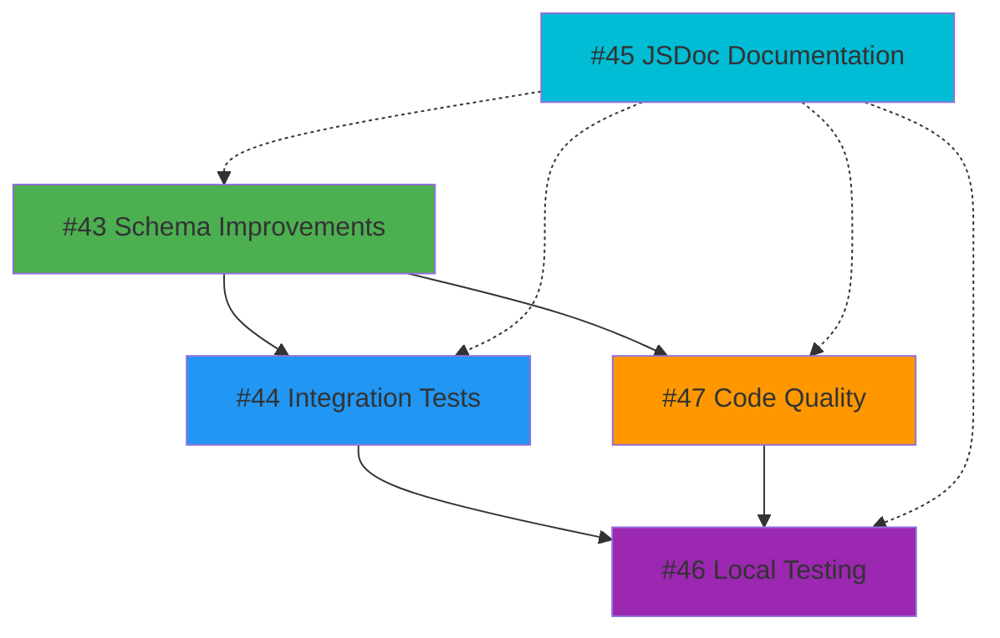

# 📋 Issue Summary: Schema Improvements & Comprehensive Testing

**Date Created**: 2026-02-18  
**Created By**: GitHub Copilot Task Agent  
**Purpose**: Track improvements to data schema validation, integration testing, documentation, and local installation workflow

---

## 🎯 Overview

This document tracks 5 comprehensive GitHub issues created to improve the European Parliament MCP Server's data quality, testing infrastructure, documentation, and developer experience.

## 📊 Issues Created

### Issue #43: Improve Zod Schemas to Match Real API Data
**URL**: https://github.com/Hack23/European-Parliament-MCP-Server/issues/43  
**PR**: #49 (In Progress)  
**Priority**: High  
**Estimated Effort**: 16-20 hours

**Objectives**:
- Analyze real European Parliament API responses
- Update all Zod schemas to match actual data structures
- Add branded types for IDs (MEPId, CommitteeId, SessionId)
- Create test fixtures from real API data
- Achieve 95%+ test coverage for schema validation

**Key Deliverables**:
- Updated `src/schemas/europeanParliament.ts`
- Test fixtures in `tests/fixtures/real-api/`
- Schema validation tests
- Documentation of all schema changes

**Recommended Agent**: `frontend-specialist` or `zod-schema-architect`

**ISMS Compliance**: 
- ISO 27001 (SI-10): Input Validation
- NIST CSF 2.0 (PR.DS-5): Data Integrity
- GDPR Article 5: Data accuracy

---

### Issue #44: Create Comprehensive Integration Tests
**URL**: https://github.com/Hack23/European-Parliament-MCP-Server/issues/44  
**PR**: #52 (In Progress)  
**Priority**: High  
**Estimated Effort**: 20-24 hours

**Objectives**:
- Create integration tests for all 10 MCP tools
- Test against real European Parliament API
- Validate response structures match schemas
- Test pagination, error handling, rate limiting
- Save real API responses as test fixtures

**Key Deliverables**:
- Complete integration test suite in `tests/integration/`
- Real API response fixtures
- Integration test configuration
- `INTEGRATION_TESTING.md` documentation

**Recommended Agent**: `hack23-test-specialist` or `test-engineer`

**ISMS Compliance**:
- ISO 27001 (AU-2): Audit Events
- NIST CSF 2.0 (DE.CM-6): External Service Monitoring
- GDPR: PII handling in tests

**Important Notes**:
- Respect EP API rate limits (100 req/15min)
- Use `EP_INTEGRATION_TESTS=true` environment variable
- Tests can be skipped in CI to avoid rate limiting

---

### Issue #45: Add Comprehensive JSDoc Documentation
**URL**: https://github.com/Hack23/European-Parliament-MCP-Server/issues/45  
**PR**: Pending  
**Priority**: Medium  
**Estimated Effort**: 24-28 hours

**Objectives**:
- Add JSDoc to all exported functions and classes
- Document parameters, return values, exceptions
- Add usage examples for complex functions
- Include security and GDPR considerations
- Generate TypeDoc API documentation

**Key Deliverables**:
- JSDoc comments on all public API
- Updated TypeDoc configuration
- Generated API docs in `docs/api/`
- `DOCUMENTATION_STANDARDS.md` style guide

**Recommended Agent**: `hack23-isms-ninja` or `documentation-writer`

**ISMS Compliance**:
- ISO 27001 (SA-5): Developer Documentation
- NIST CSF 2.0 (PR.IP-1): Baseline Configuration
- CIS Controls v8.1 (14.4): Documentation Management

**JSDoc Standards**:
- Include `@security` tags for security considerations
- Include `@gdpr` tags for PII handling
- Link to ISMS policies with `@see` tags
- Provide real usage examples with `@example`

---

### Issue #46: Enable Local Installation and Testing
**URL**: https://github.com/Hack23/European-Parliament-MCP-Server/issues/46  
**PR**: Pending  
**Priority**: High  
**Estimated Effort**: 16-20 hours

**Objectives**:
- Ensure `npx european-parliament-mcp-server` works
- Add --health, --version, --help CLI commands
- Create comprehensive local testing guide
- Test with MCP Inspector
- Verify multi-platform installation (Linux/macOS/Windows)

**Key Deliverables**:
- CLI command handlers in `src/index.ts`
- Testing CLI tool: `scripts/test-mcp-server.js`
- Pre-publish verification: `scripts/verify-package.js`
- `LOCAL_TESTING.md` comprehensive guide
- Platform-specific installation guides

**Recommended Agent**: `hack23-devops-engineer` or `hack23-test-specialist`

**ISMS Compliance**:
- ISO 27001 (SA-10): Developer Testing
- NIST CSF 2.0 (PR.DS-6): Integrity Checking
- SLSA Level 3: Supply Chain Security

**Testing Workflow**:
```bash
# Build and test locally
npm run build
npm run verify-package

# Test with npx
npm link
npx european-parliament-mcp-server --health

# Test with MCP Inspector
mcp-inspector npx european-parliament-mcp-server
```

---

### Issue #47: Code Quality Improvements
**URL**: https://github.com/Hack23/European-Parliament-MCP-Server/issues/47  
**PR**: Pending  
**Priority**: Medium  
**Estimated Effort**: 24-32 hours

**Objectives**:
- Eliminate all `any` types (use `unknown`)
- Add branded types for IDs and sensitive data
- Create custom error classes
- Add request timeout handling
- Enhance audit logging
- Optimize performance

**Key Deliverables**:
- Branded types in `src/types/branded.ts`
- Custom error classes in `src/utils/errors.ts`
- Performance monitoring in `src/utils/performance.ts`
- Timeout utilities in `src/utils/timeout.ts`
- Enhanced audit logger
- Refactoring recommendations document

**Recommended Agent**: `hack23-code-quality-engineer` or `hack23-performance-engineer`

**ISMS Compliance**:
- ISO 27001 (SI-10, SC-5): Input Validation, DoS Prevention
- NIST CSF 2.0 (PR.IP-1): Baseline Configuration
- CIS Controls v8.1 (16.1): Application Software Security

**Quality Metrics**:
- Current: ~85% type coverage, some `any` types
- Target: 95%+ type coverage, zero `any` types
- Cyclomatic complexity: <10 per function
- Test coverage: 80%+ maintained

---

## 🔄 Dependencies Between Issues



**Recommended Order**:
1. **Issue #43** (Schemas) - Foundation for validation ✅ In Progress
2. **Issue #44** (Integration Tests) - Validates schemas ✅ In Progress
3. **Issue #45** (JSDoc) - Can run in parallel ⏳ Pending
4. **Issue #47** (Code Quality) - Builds on schemas ⏳ Pending
5. **Issue #46** (Local Testing) - Final integration ⏳ Pending

---

## 📈 Expected Outcomes

### Data Quality
- ✅ Schemas match 100% of real API response structures
- ✅ All data validated with Zod before use
- ✅ Branded types prevent ID mixing errors
- ✅ Test fixtures enable offline testing

### Testing Coverage
- ✅ 80%+ overall test coverage
- ✅ 95%+ coverage for security-critical code
- ✅ All 10 MCP tools tested against real API
- ✅ Integration tests can run locally

### Documentation
- ✅ 100% JSDoc coverage on public API
- ✅ TypeDoc API documentation generated
- ✅ Security and GDPR considerations documented
- ✅ Examples for all complex functions

### Developer Experience
- ✅ `npx european-parliament-mcp-server` works out of box
- ✅ Health check, version, help commands available
- ✅ Local testing workflow documented
- ✅ Works with MCP Inspector
- ✅ Multi-platform support (Linux/macOS/Windows)

### Code Quality
- ✅ Zero `any` types
- ✅ Custom error classes
- ✅ Branded types for type safety
- ✅ Performance optimizations
- ✅ Enhanced error handling

---

## 🤖 Copilot Assignment Status

| Issue | Assigned | PR Created | Status | Agent |
|-------|----------|------------|--------|-------|
| #43 | ✅ Yes | #49 | 🔄 In Progress | frontend-specialist |
| #44 | ✅ Yes | #52 | 🔄 In Progress | test-engineer |
| #45 | ✅ Yes | Pending | ⏳ Pending | isms-ninja |
| #46 | ✅ Yes | Pending | ⏳ Pending | devops-engineer |
| #47 | ✅ Yes | Pending | ⏳ Pending | code-quality-engineer |

**Custom Instructions Provided**:
- Follow MCP specification strictly
- Use TypeScript strict mode
- Maintain ISMS compliance
- Respect EP API rate limits
- Document security considerations
- Maintain or improve test coverage

---

## 🔗 Related Documentation

**Project Documentation**:
- [README.md](./README.md) - Project overview
- [ARCHITECTURE.md](./ARCHITECTURE.md) - Architecture documentation
- [SECURITY.md](./SECURITY.md) - Security policy
- [DEVELOPER_GUIDE.md](./DEVELOPER_GUIDE.md) - Development guidelines

**ISMS Policies**:
- [Secure Development Policy](https://github.com/Hack23/ISMS-PUBLIC/blob/main/Secure_Development_Policy.md)
- [Open Source Policy](https://github.com/Hack23/ISMS-PUBLIC/blob/main/Open_Source_Policy.md)
- [Privacy Policy](https://github.com/Hack23/ISMS-PUBLIC/blob/main/Privacy_Policy.md)

**European Parliament Resources**:
- [Open Data Portal](https://data.europarl.europa.eu/)
- [Developer Corner](https://data.europarl.europa.eu/en/developer-corner)
- [API Documentation](https://data.europarl.europa.eu/api/v2/)

**MCP Protocol**:
- [MCP Specification](https://spec.modelcontextprotocol.io/)
- [MCP SDK](https://github.com/modelcontextprotocol/sdk)
- [MCP Documentation](https://modelcontextprotocol.io/docs)

---

## 📞 Support

For questions or issues:
- Create a GitHub issue
- Check [TROUBLESHOOTING.md](./TROUBLESHOOTING.md)
- Review [CONTRIBUTING.md](./CONTRIBUTING.md)
- Contact: Hack23 AB

---

## 📝 Change Log

| Date | Change | Author |
|------|--------|--------|
| 2026-02-18 | Created 5 comprehensive issues | GitHub Copilot Task Agent |
| 2026-02-18 | Assigned all issues to Copilot | GitHub Copilot Task Agent |
| 2026-02-18 | PRs #49 and #52 created | Copilot SWE Agent |

---

**Last Updated**: 2026-02-18  
**Status**: All issues created and assigned ✅
