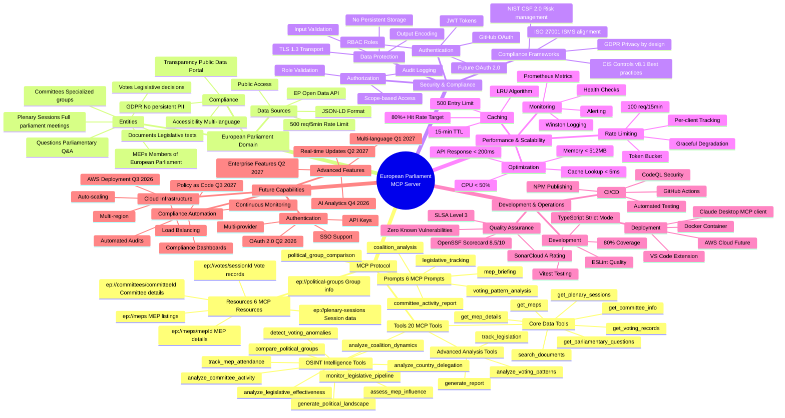
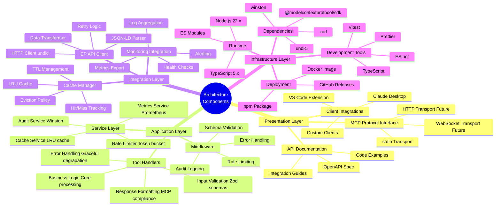
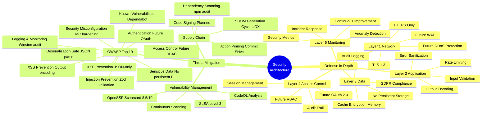
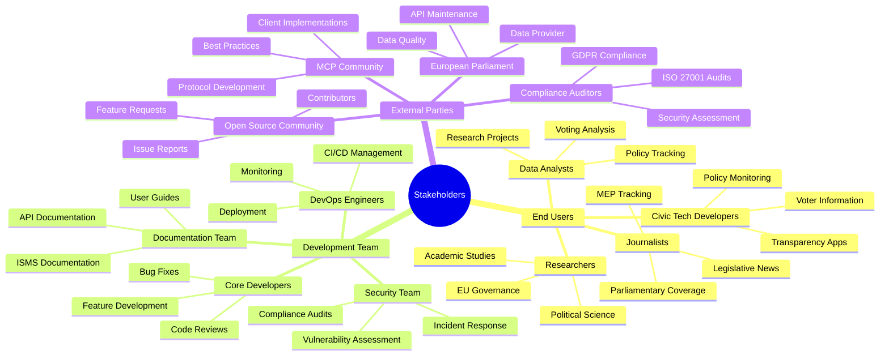
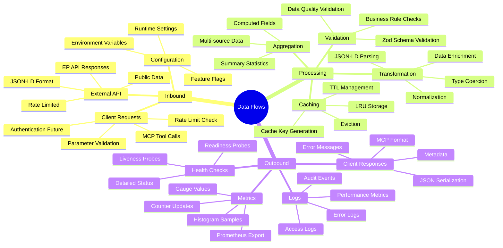
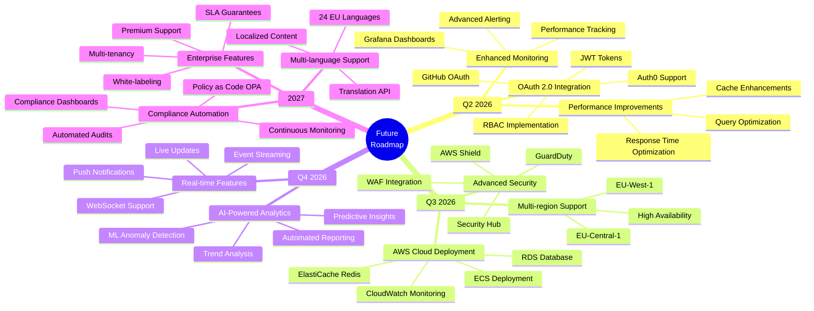

  

<h1 align="center">🧠 European Parliament MCP Server - System Mind Map</h1>

  <strong>System Conceptual Relationships</strong> 
  <em>Visual Map of Components, Concepts, and Stakeholder Interactions</em>

  
  
  
  

**📋 Document Owner:** Architecture Team | **📄 Version:** 1.0 | **📅 Last Updated:** 2026-02-17 (UTC)  
**🔄 Review Cycle:** Quarterly | **⏰ Next Review:** 2026-05-17  
**🏷️ Classification:** Public (Open Source MCP Server)  
**✅ ISMS Compliance:** ISO 27001 (A.5.1), NIST CSF 2.0 (ID.AM), CIS Controls v8.1 (1.1)

---

## 📋 Overview

This mind map visualizes the conceptual relationships and organizational structure of the European Parliament MCP Server system. It demonstrates how different components, concepts, and stakeholders interact within the ecosystem.

---

## 🗺️ Complete System Mind Map

---

## 🏗️ Architecture Components Mind Map

---

## 🔐 Security Mind Map

---

## 👥 Stakeholder Mind Map

---

## 📊 Data Flow Mind Map

---

## 🎯 Future Capabilities Mind Map

---

## 📋 ISMS Compliance

### ISO 27001 Controls
- **A.5.1** - Information Security Policies: System scope documented
- **A.8.1** - Asset Inventory: All components mapped
- **A.18.1** - Compliance Review: Stakeholder obligations identified

### NIST CSF 2.0 Functions
- **ID.AM-1** - Physical Devices: Infrastructure components mapped
- **ID.AM-2** - Software Platforms: Technology stack documented
- **ID.AM-4** - External Information Systems: EP API integration documented

### CIS Controls v8.1
- **1.1** - Asset Inventory: Complete component catalog
- **2.1** - Software Inventory: All dependencies documented
- **4.1** - Configuration Management: System relationships defined

---

## 🔗 Related Documentation

- [ARCHITECTURE.md](./ARCHITECTURE.md) - C4 model architecture
- [DATA_MODEL.md](./DATA_MODEL.md) - Data structures
- [FLOWCHART.md](./FLOWCHART.md) - Process flows
- [STATEDIAGRAM.md](./STATEDIAGRAM.md) - State transitions
- [SWOT.md](./SWOT.md) - Strategic analysis

---

  <strong>Built with ❤️ by <a href="https://hack23.com">Hack23 AB</a></strong> 
  <em>Mind map documentation following ISMS standards</em>

