  

<h1 align="center">🧠 European Parliament MCP Server — System Mind Map</h1>

  <strong>Conceptual Overview of the European Parliament MCP Server v0.6.2</strong> 
  <em>Visual Map of MCP Tools, Resources, Prompts, OSINT Intelligence, and System Architecture</em>

  
  
  

---

## 📚 Architecture Documentation Map

| Document | Focus | Description | Link |
| --- | --- | --- | --- |
| **[Architecture](ARCHITECTURE.md)** | 🏛️ Architecture | C4 model — current system structure | [View Source](https://github.com/Hack23/European-Parliament-MCP-Server/blob/main/ARCHITECTURE.md) |
| **[Future Architecture](FUTURE_ARCHITECTURE.md)** | 🏛️ Architecture | C4 model — future system structure | [View Source](https://github.com/Hack23/European-Parliament-MCP-Server/blob/main/FUTURE_ARCHITECTURE.md) |
| **[Mindmaps](MINDMAP.md)** | 🧠 Concept | Current system component relationships | [View Source](https://github.com/Hack23/European-Parliament-MCP-Server/blob/main/MINDMAP.md) |
| **[Future Mindmaps](FUTURE_MINDMAP.md)** | 🧠 Concept | Future capability evolution | [View Source](https://github.com/Hack23/European-Parliament-MCP-Server/blob/main/FUTURE_MINDMAP.md) |
| **[SWOT Analysis](SWOT.md)** | 💼 Business | Current strategic assessment | [View Source](https://github.com/Hack23/European-Parliament-MCP-Server/blob/main/SWOT.md) |
| **[Future SWOT Analysis](FUTURE_SWOT.md)** | 💼 Business | Future strategic opportunities | [View Source](https://github.com/Hack23/European-Parliament-MCP-Server/blob/main/FUTURE_SWOT.md) |
| **[Data Model](DATA_MODEL.md)** | 📊 Data | Current data structures and relationships | [View Source](https://github.com/Hack23/European-Parliament-MCP-Server/blob/main/DATA_MODEL.md) |
| **[Future Data Model](FUTURE_DATA_MODEL.md)** | 📊 Data | Enhanced parliamentary data architecture | [View Source](https://github.com/Hack23/European-Parliament-MCP-Server/blob/main/FUTURE_DATA_MODEL.md) |
| **[Flowcharts](FLOWCHART.md)** | 🔄 Process | Current data processing workflows | [View Source](https://github.com/Hack23/European-Parliament-MCP-Server/blob/main/FLOWCHART.md) |
| **[Future Flowcharts](FUTURE_FLOWCHART.md)** | 🔄 Process | Enhanced AI-driven workflows | [View Source](https://github.com/Hack23/European-Parliament-MCP-Server/blob/main/FUTURE_FLOWCHART.md) |
| **[State Diagrams](STATEDIAGRAM.md)** | 🔄 Behavior | Current system state transitions | [View Source](https://github.com/Hack23/European-Parliament-MCP-Server/blob/main/STATEDIAGRAM.md) |
| **[Future State Diagrams](FUTURE_STATEDIAGRAM.md)** | 🔄 Behavior | Enhanced adaptive state transitions | [View Source](https://github.com/Hack23/European-Parliament-MCP-Server/blob/main/FUTURE_STATEDIAGRAM.md) |
| **[CI/CD Workflows](WORKFLOWS.md)** | 🔧 DevOps | Current automation processes | [View Source](https://github.com/Hack23/European-Parliament-MCP-Server/blob/main/WORKFLOWS.md) |
| **[Future Workflows](FUTURE_WORKFLOWS.md)** | 🔧 DevOps | Enhanced CI/CD with ML | [View Source](https://github.com/Hack23/European-Parliament-MCP-Server/blob/main/FUTURE_WORKFLOWS.md) |
| **[Security Architecture](SECURITY_ARCHITECTURE.md)** | 🔐 Security | Defense-in-depth security design | [View Source](https://github.com/Hack23/European-Parliament-MCP-Server/blob/main/SECURITY_ARCHITECTURE.md) |
| **[Future Security](FUTURE_SECURITY_ARCHITECTURE.md)** | 🔐 Security | Enhanced security architecture | [View Source](https://github.com/Hack23/European-Parliament-MCP-Server/blob/main/FUTURE_SECURITY_ARCHITECTURE.md) |
| **[Threat Model](THREAT_MODEL.md)** | 🛡️ Security | Threat analysis and mitigations | [View Source](https://github.com/Hack23/European-Parliament-MCP-Server/blob/main/THREAT_MODEL.md) |
| **[End-of-Life Strategy](End-of-Life-Strategy.md)** | 📅 Lifecycle | Maintenance and EOL planning | [View Source](https://github.com/Hack23/European-Parliament-MCP-Server/blob/main/End-of-Life-Strategy.md) |
| **[Financial Security Plan](FinancialSecurityPlan.md)** | 💰 Security | Cost and security implementation | [View Source](https://github.com/Hack23/European-Parliament-MCP-Server/blob/main/FinancialSecurityPlan.md) |
| **[EP MCP Features](https://hack23.com/european-parliament-mcp-features.html)** | 🚀 Features | Platform features overview | [View on hack23.com](https://hack23.com/european-parliament-mcp-features.html) |

---

## 🧩 System Overview Mindmap

**🏛️ Architecture Focus:** Provides a hierarchical view of the European Parliament MCP Server's components, showing their organization and relationships. See the [full architecture documentation](ARCHITECTURE.md) for a detailed C4 model.

**💼 Business Focus:** Maps the parliamentary intelligence capabilities to the technical components that implement them. Explore [EP MCP features](https://hack23.com/european-parliament-mcp-features.html) for detailed descriptions.

```mermaid
mindmap
  root((European Parliament<br/>MCP Server<br/>v0.6.2))
    🔌 MCP Protocol
      🛠️ Tools — 28 MCP Tools
        Core Data Tools — 7
        OSINT Intelligence Tools — 21
      📦 Resources — 6
        ep://meps
        ep://meps/mepId
        ep://committees/committeeId
        ep://plenary-sessions
        ep://votes/sessionId
        ep://political-groups
      💬 Prompts — 6
        mep_briefing
        coalition_analysis
        legislative_tracking
        political_group_comparison
        committee_activity_report
        voting_pattern_analysis
      🚌 Transport
        stdio — Current
        HTTP — Future
    🏛️ European Parliament Data
      👥 MEPs
        Member Profiles
        Party Affiliations
        Committee Assignments
        Voting History
      🏢 Committees
        Committee Composition
        Activity Reports
        Document Processing
        Workload Analysis
      📝 Documents
        Legislative Texts
        Adopted Texts
        Procedures
        Parliamentary Questions
      🗳️ Votes
        Plenary Voting Records
        Individual MEP Votes
        Vote Outcome Analysis
        Anomaly Detection
      📅 Procedures & Events
        Legislative Pipeline
        Plenary Sessions
        Meeting Activities
        Meeting Decisions
    🔍 OSINT Intelligence
      📊 Voting Analysis
        Voting Pattern Detection
        Voting Anomaly Detection
        Party Defection Tracking
        Cross-group Comparisons
      🤝 Coalition Dynamics
        Coalition Cohesion Scoring
        Coalition Stress Analysis
        Alliance Stability Metrics
        Power Distribution
      📜 Legislative Tracking
        Pipeline Monitoring
        Bottleneck Detection
        Legislative Effectiveness
        Amendment Analysis
      🌍 Country Delegation
        Delegation Composition
        Country Voting Patterns
        National Representation
        Cross-party Analysis
      👤 MEP Profiling
        5-Dimension Influence Model
        Attendance Tracking
        Speech Analysis
        Declaration Monitoring
    🔐 Security & Compliance
      🛡️ Input Validation
        Zod Schema Validation
        Branded Types
        Parameter Sanitization
        Error Handling
      🇪🇺 GDPR Compliance
        No Persistent PII Storage
        Public Data Only
        Privacy by Design
        Data Minimization
      ⏱️ Rate Limiting
        Token Bucket Algorithm
        Per-client Tracking
        Graceful Degradation
        EP API Rate Respect
      📋 Audit & Compliance
        Audit Logging
        ISO 27001 Alignment
        NIST CSF 2.0
        CIS Controls v8.1
    ⚙️ DevOps & Quality
      🔄 CI/CD — 11 Workflows
        test-and-report
        codeql
        release
        integration-tests
        sbom-generation
      🧪 Testing
        Vitest Unit Tests
        E2E Integration Tests
        80%+ Code Coverage
        API Contract Testing
      📏 Quality Gates
        ESLint Strict Mode
        TypeScript Strict
        OpenSSF Scorecard
        SLSA Level 3
      📦 Releases
        npm Publishing
        GitHub Releases
        SBOM CycloneDX
        Provenance Attestation
```

---

## 🛠️ MCP Tool Ecosystem Mindmap

**🔧 Tools Focus:** Shows the complete hierarchy of all 28 MCP tools organized by functional category. See the [API Usage Guide](API_USAGE_GUIDE.md) for detailed parameter and response documentation.

```mermaid
mindmap
  root((MCP Tools<br/>28 Total))
    🔵 Core Data Tools — 7
      getMEPs
        List MEPs with filtering
        Country/party filters
        Active status filtering
      getMEPDetails
        Full MEP profile
        Committee memberships
        Contact information
      getPlenarySessions
        Session listings
        Date range filtering
        Agenda items
      getVotingRecords
        Vote results
        Individual MEP votes
        Session-based lookup
      searchDocuments
        Full-text search
        Document type filtering
        Date range queries
      getCommitteeInfo
        Committee details
        Member listings
        Activity summary
      getParliamentaryQuestions
        Written questions
        Oral questions
        MEP-based filtering
    🟢 Additional Data Tools — 8
      getCurrentMEPs
        Current term MEPs
        Real-time listing
      getSpeeches
        Plenary speeches
        MEP speech history
      getProcedures
        Legislative procedures
        Procedure tracking
      getAdoptedTexts
        Adopted legislation
        Final text access
      getEvents
        Parliamentary events
        Calendar data
      getMeetingActivities
        Meeting agendas
        Activity tracking
      getMeetingDecisions
        Decision outcomes
        Meeting results
      getMEPDeclarations
        Financial declarations
        Interest declarations
    🟣 Analysis & OSINT Tools — 10
      analyzeVotingPatterns
        Pattern detection
        Trend analysis
      trackLegislation
        Pipeline tracking
        Status monitoring
      generateReport
        Formatted reports
        Multi-source aggregation
      assessMepInfluence
        5-dimension scoring
        Influence ranking
      analyzeCoalitionDynamics
        Cohesion scoring
        Stress analysis
      detectVotingAnomalies
        Anomaly detection
        Deviation flagging
      comparePoliticalGroups
        Cross-group metrics
        Performance comparison
      analyzeLegislativeEffectiveness
        Success rate scoring
        Impact assessment
    🟠 Advanced Intelligence — 3
      monitorLegislativePipeline
        Bottleneck detection
        Stage tracking
      analyzeCommitteeActivity
        Workload metrics
        Engagement scoring
      trackMepAttendance
        Attendance patterns
        Trend analysis
    🔴 Landscape & Delegation — 2
      analyzeCountryDelegation
        National composition
        Voting alignment
      generatePoliticalLandscape
        Parliament-wide view
        Political positioning
```

---

## 📊 Political Data Ecosystem Mindmap

**🏛️ Political Focus:** Shows the relationships between different European Parliament entities tracked by the system. See the [Data Model](DATA_MODEL.md) for entity relationship details.

**🔗 Integration Focus:** Illustrates how data flows from the EP Open Data Portal API v2 into the MCP server. See [README.md](README.md) for integration setup.

```mermaid
mindmap
  root((European Parliament<br/>Data Ecosystem))
    🏛️ European Parliament
      👥 Members of European Parliament
        Member Profiles
        National Delegations
        Committee Assignments
        Voting History
      🏢 Parliamentary Committees
        Standing Committees
        Special Committees
        Committee of Inquiry
        Subcommittees
      📝 Legislative Documents
        Legislative Proposals
        Committee Reports
        Adopted Texts
        Parliamentary Questions
      🗳️ Plenary Voting Records
        Roll-Call Votes
        Vote Results
        Individual Positions
        Abstention Records
    🏛️ Political Groups
      👥 Group Membership
        PPE — European People's Party
        S&D — Socialists & Democrats
        Renew — Renew Europe
        Greens/EFA — Greens
        ECR — Conservatives
        ID — Identity & Democracy
        The Left — GUE/NGL
        Non-attached Members
      📊 Group Analytics
        Voting Cohesion
        Policy Positions
        Coalition Patterns
        Internal Discipline
      🤝 Cross-Group Dynamics
        Alliance Formation
        Opposition Patterns
        Compromise Building
        Power Distribution
    🌍 Member State Delegations
      🇩🇪 National Delegations
        Delegation Composition
        Party Distribution
        Voting Alignment
        National Interest Patterns
      📊 Country Analytics
        Representation Metrics
        Influence Assessment
        Cross-party Alignment
        Policy Priorities
    📅 Parliamentary Calendar
      🏛️ Plenary Sessions
        Session Agendas
        Debate Topics
        Vote Scheduling
        Attendance Records
      📋 Committee Meetings
        Meeting Agendas
        Activity Reports
        Decision Records
        Working Documents
      📌 Legislative Procedures
        Ordinary Legislative Procedure
        Consent Procedure
        Consultation Procedure
        Budget Procedure
```

---

## 🖥️ Technical Component Map

This flowchart visualizes the relationship between components in the system architecture. For a more formal C4 architecture model, see the [Architecture documentation](ARCHITECTURE.md).

---

## 🔍 Key MCP Server Features

These features align with the [EP MCP platform capabilities](https://hack23.com/european-parliament-mcp-features.html) providing comprehensive European Parliament intelligence. See the [API Usage Guide](API_USAGE_GUIDE.md) for detailed usage.

| Feature | Data Sources | Purpose | Implementation |
| --- | --- | --- | --- |
| 👤 MEP Profiling | EP API — MEP endpoint | Comprehensive MEP intelligence | 5-dimension influence scoring with committee and voting data |
| 🗳️ Voting Analysis | EP API — Vote records | Detect voting patterns and anomalies | Pattern detection, anomaly flagging, party defection tracking |
| 🤝 Coalition Analysis | EP API — Votes, Groups | Analyze cross-group dynamics | Cohesion scoring, stress analysis, alliance stability metrics |
| 📜 Legislative Tracking | EP API — Procedures, Documents | Monitor legislative pipeline | Pipeline monitoring, bottleneck detection, effectiveness scoring |
| 🏢 Committee Intelligence | EP API — Committees | Track committee activity | Workload analysis, engagement metrics, output assessment |
| 🌍 Country Delegation | EP API — MEPs, Votes | Analyze national representation | Delegation composition, voting alignment, cross-party analysis |
| 📊 Political Landscape | All EP data sources | Parliament-wide intelligence | Multi-dimensional political positioning and group comparison |
| 📝 Document Search | EP API — Documents | Full-text legislative search | Document type filtering, date ranges, keyword matching |
| 📅 Event Monitoring | EP API — Events, Meetings | Track parliamentary calendar | Session tracking, meeting activities, decision records |
| 📋 Report Generation | All EP data sources | Formatted intelligence reports | Multi-source aggregation with structured output |

---

## 🔄 Data Integration Flow

For technical details on implementation, see the [Developer Guide](DEVELOPER_GUIDE.md) and [API Documentation](https://hack23.github.io/European-Parliament-MCP-Server/api/).

```mermaid
graph TD
    A[EP Open Data Portal API v2] --> B{EP API Client — undici}
    B -->|MEP Data| C1[MEP Service]
    B -->|Vote Data| C2[Voting Service]
    B -->|Document Data| C3[Document Service]
    B -->|Committee Data| C4[Committee Service]
    B -->|Procedure Data| C5[Procedure Service]
    B -->|Event Data| C6[Event Service]

    C1 --> D1[MEP Entity Models]
    C2 --> D2[Vote Entity Models]
    C3 --> D3[Document Entity Models]
    C4 --> D4[Committee Entity Models]
    C5 --> D5[Procedure Entity Models]
    C6 --> D6[Event Entity Models]

    D1 & D2 & D3 & D4 & D5 & D6 --> E[LRU Cache — 15-min TTL]
    E --> F[Tool Handler Layer]

    F --> G[Core Data Tools — 7]
    F --> H[OSINT Intelligence Tools — 21]

    G & H --> I[MCP Response Formatter]
    I --> J[MCP Client — stdio]

    classDef sources fill:#bbdefb,stroke:#333,stroke-width:1px,color:black
    classDef integration fill:#a0c8e0,stroke:#333,stroke-width:1px,color:black
    classDef models fill:#c8e6c9,stroke:#333,stroke-width:1px,color:black
    classDef cache fill:#d1c4e9,stroke:#333,stroke-width:1px,color:black
    classDef services fill:#ffecb3,stroke:#333,stroke-width:1px,color:black
    classDef ui fill:#ffccbc,stroke:#333,stroke-width:1px,color:black

    class A sources
    class B,C1,C2,C3,C4,C5,C6 integration
    class D1,D2,D3,D4,D5,D6 models
    class E cache
    class F,G,H services
    class I,J ui
```

---

These mindmaps provide a conceptual overview of the European Parliament MCP Server, showing how MCP tools, resources, and prompts relate to European Parliament data domains, OSINT intelligence capabilities, and the underlying technical architecture. The maps help stakeholders understand the scope and organization of the server's 28 tools, 6 resources, and 6 prompts.

For practical demonstrations, visit the <a href="https://hack23.com/european-parliament-mcp-features.html">EP MCP Features page</a> which provides detailed explanations of the platform's capabilities.

The color schemes across diagrams help to identify similar types of information:

- 🔵 Blues represent core MCP server components and architecture elements
- 🟢 Greens represent European Parliament entities and data tools
- 🟣 Purples represent OSINT intelligence capabilities and caching
- 🟠 Oranges/yellows represent service layers and processing

## 🎨 Color Legend

The color scheme used in these mindmaps follows these conventions:

| Element Type | Color | Description |
| --- | --- | --- |
| Core Components | #a0c8e0 (Medium Blue) | MCP server and transport layer |
| Parliament Entities | #bbdefb (Light Blue) | MEPs, committees, political groups |
| Data & Tools | #c8e6c9 (Light Green) | MCP tools, data processing |
| Cache & Infrastructure | #d1c4e9 (Light Purple) | LRU cache, rate limiting, infrastructure |
| Services | #ffecb3 (Light Yellow) | Service layer, tool handlers |
| Client & Output | #ffccbc (Light Orange) | MCP client, response formatting |
| Tool Categories | #e8f5e9 (Very Light Green) | Individual tool instances |

This color scheme provides visual consistency across the architecture documentation while making it easy to distinguish between different types of components in the system.

---

## 📋 ISMS Compliance

This documentation aligns with [Hack23 ISMS policies](https://github.com/Hack23/ISMS-PUBLIC) and maps to the following security controls:

### ISO 27001 Controls

- **A.5.1** — Information Security Policies: System scope and component relationships documented
- **A.8.1** — Asset Inventory: All 28 tools, 6 resources, 6 prompts, and 4 dependencies cataloged
- **A.14.2** — Secure Development: TypeScript strict mode, Zod validation, branded types documented
- **A.18.1** — Compliance Review: GDPR, data protection, and audit obligations identified

### NIST CSF 2.0 Functions

- **ID.AM-1** — Physical Devices: Infrastructure components mapped across all diagrams
- **ID.AM-2** — Software Platforms: Technology stack (TypeScript, Node.js, MCP SDK) documented
- **ID.AM-4** — External Information Systems: EP Open Data Portal API v2 integration documented
- **PR.DS-1** — Data-at-Rest: No persistent storage, LRU in-memory cache documented

### CIS Controls v8.1

- **1.1** — Asset Inventory: Complete component catalog across system overview mindmap
- **2.1** — Software Inventory: All dependencies (@modelcontextprotocol/sdk, lru-cache, undici, zod) documented
- **4.1** — Configuration Management: System relationships and data flows defined
- **16.1** — Security Architecture: Defense-in-depth controls mapped to technical components

---

## 🔗 Related Documentation

- [Architecture](ARCHITECTURE.md) — C4 model architecture documentation
- [Future Architecture](FUTURE_ARCHITECTURE.md) — Planned architectural evolution
- [Future Mindmap](FUTURE_MINDMAP.md) — Future capability evolution mindmaps
- [Data Model](DATA_MODEL.md) — Data structures and entity relationships
- [Flowcharts](FLOWCHART.md) — Data processing and request flow diagrams
- [State Diagrams](STATEDIAGRAM.md) — System state transitions
- [SWOT Analysis](SWOT.md) — Strategic assessment
- [Security Architecture](SECURITY_ARCHITECTURE.md) — Defense-in-depth security design
- [Threat Model](THREAT_MODEL.md) — Threat analysis and mitigations
- [API Usage Guide](API_USAGE_GUIDE.md) — Detailed tool parameter documentation
- [Developer Guide](DEVELOPER_GUIDE.md) — Development setup and contribution guide
- [End-of-Life Strategy](End-of-Life-Strategy.md) — Maintenance and EOL planning
- [Financial Security Plan](FinancialSecurityPlan.md) — Cost and security implementation
- [EP MCP Features](https://hack23.com/european-parliament-mcp-features.html) — Platform feature showcase

---

  <strong>Built with ❤️ by <a href="https://hack23.com">Hack23 AB</a></strong> 
  <em>Mind map documentation following <a href="https://github.com/Hack23/ISMS-PUBLIC">Hack23 ISMS</a> standards</em>

