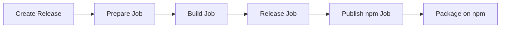

# npm Publishing Implementation Summary

## 🎯 Overview

This document summarizes the npm publishing implementation for the European Parliament MCP Server package. The implementation enables automated publishing to the npm registry as part of the release flow, with SLSA Level 3 provenance for supply chain security.

## ✅ What Was Implemented

### 1. Package Configuration

**File: `package.json`**

Added npm publishing configuration:

```json
{
  "publishConfig": {
    "access": "public",
    "provenance": true,
    "registry": "https://registry.npmjs.org/"
  },
  "files": [
    "dist",
    "README.md",
    "LICENSE.md",
    "SECURITY.md",
    "CHANGELOG.md"
  ]
}
```

Added lifecycle hooks:
- `prepublishOnly`: Runs lint, knip, unit tests, and build before publishing
- `prepack`: Ensures build runs before creating package

### 2. Build Configuration

**File: `.npmrc`**

Created npm configuration for build-time settings:
- `audit=true` - Enable security audits
- `fund=false` - Disable funding messages
- `save-exact=true` - Save exact versions
- `engine-strict=true` - Enforce engine requirements
- `loglevel=warn` - Set appropriate logging level

**File: `.npmignore`**

Created exclusion list to keep package minimal:
- Source files (`src/`, `tests/`)
- Configuration files (`.github/`, `.vscode/`, etc.)
- Build artifacts (`coverage/`, `*.log`)
- Extensive documentation (keep only essentials)

Result: Package size ~69KB with only essential files

### 3. CI/CD Workflow

**File: `.github/workflows/release.yml`**

Added new `publish-npm` job that:

1. **Runs after GitHub release** (`needs: [prepare, build, release]`)
2. **Updates package version** from git tag
3. **Builds the package** with TypeScript compilation
4. **Verifies package contents** before publishing
5. **Publishes with provenance** using npm 9.5.0+ features
6. **Outputs verification instructions**

Key security features:
- ✅ Uses `id-token: write` for OIDC authentication
- ✅ Enables npm provenance (`--provenance` flag)
- ✅ Sets `NPM_CONFIG_PROVENANCE=true` environment variable
- ✅ Requires `NPM_TOKEN` secret in GitHub

### 4. Documentation

**File: `README.md`**

Updated with:
- npm installation instructions (global and project-level)
- npm version and downloads badges
- Two configuration examples (npm install vs source install)
- Clear distinction between installation methods

**File: `NPM_PUBLISHING.md`**

Created comprehensive guide covering:
- Package configuration and contents
- Security and provenance verification
- Publishing process (automated and manual)
- Required secrets setup
- Version management
- Package testing
- Troubleshooting

**File: `SECURITY.md`**

Added npm provenance section:
- Package verification instructions
- npm audit signatures command
- SLSA Level 3 compliance notes
- Link to publishing documentation

## 🔐 Security Features

### SLSA Level 3 Provenance

The implementation achieves SLSA Level 3 compliance through:

1. **Build Provenance**: Cryptographic proof of build integrity
2. **Transparent Build**: All builds run on GitHub Actions with public logs
3. **Hermetic Build**: Reproducible builds with pinned dependencies
4. **Attestations**: Every package includes provenance attestation

### Verification Methods

Users can verify package integrity using:

```bash
# Verify npm provenance signatures
npm audit signatures

# View package provenance metadata
npm view european-parliament-mcp-server --json | jq '.dist.attestations'

# Verify GitHub attestation
gh attestation verify european-parliament-mcp-server@<version> \
  --owner Hack23 \
  --repo European-Parliament-MCP-Server
```

## 📋 Required Setup

### Before First Release

1. **Create npm account** at https://www.npmjs.com/
2. **Generate Automation token**:
   - Go to npm Account Settings → Access Tokens
   - Create new Automation token
   - Copy token (starts with `npm_`)

3. **Add token to GitHub**:
   - Go to repository Settings → Secrets → Actions
   - Create new secret: `NPM_TOKEN`
   - Paste npm token value

### Verification

Test the setup by:
1. Creating a test release tag (e.g., `v0.0.2`)
2. Workflow triggers automatically
3. Check GitHub Actions logs for publish-npm job
4. Verify package appears on npm: https://www.npmjs.com/package/european-parliament-mcp-server

## 🚀 Publishing Workflow

### Automated (Recommended)



1. **Trigger**: Push git tag `v*` or manual workflow dispatch
2. **Prepare**: Update version, run tests
3. **Build**: Compile TypeScript, generate SBOM, create attestations
4. **Release**: Create GitHub release with artifacts
5. **Publish**: Publish to npm with provenance

### Manual (Emergency Only)

```bash
npm version patch
npm run prepublishOnly
npm publish --provenance --access public
git push origin main --tags
```

## 📦 Package Details

### Published Contents

```
european-parliament-mcp-server/
├── dist/                    # Compiled JavaScript + TypeScript definitions
│   ├── index.js            # Main entry point
│   ├── index.d.ts          # Type definitions
│   ├── tools/              # MCP tool implementations
│   ├── clients/            # European Parliament API client
│   ├── schemas/            # Zod validation schemas
│   └── ...                 # Other compiled modules
├── package.json            # Package metadata
├── README.md               # Usage documentation
├── LICENSE.md              # Apache 2.0 license
├── SECURITY.md             # Security policy
└── CHANGELOG.md            # Version history
```

### Installation Methods

**Global installation:**
```bash
npm install -g european-parliament-mcp-server
european-parliament-mcp-server  # Run directly
```

**Project dependency:**
```bash
npm install european-parliament-mcp-server
npx european-parliament-mcp-server  # Run via npx
```

**MCP client configuration:**
```json
{
  "mcpServers": {
    "european-parliament": {
      "command": "npx",
      "args": ["european-parliament-mcp-server"]
    }
  }
}
```

## 🧪 Testing

### Verification Commands

All tests pass before any publish:

```bash
# Linting
npm run lint                 # ✅ Passes

# Unused dependencies
npm run knip                 # ✅ Passes

# Unit tests
npm run test:unit            # ✅ 268 tests pass

# License compliance
npm run test:licenses        # ✅ All dependencies compliant

# Build
npm run build                # ✅ TypeScript compiles

# Package creation
npm pack                     # ✅ 121 files, ~69KB
```

### Package Quality

- ✅ **Size**: 68,875 bytes (optimal for npm)
- ✅ **Files**: 121 files (dist/ + docs only)
- ✅ **Dependencies**: 4 runtime dependencies
- ✅ **Type Definitions**: Full TypeScript support
- ✅ **License**: Apache-2.0 (OSI approved)
- ✅ **Security**: No known vulnerabilities

## 📊 Compliance Alignment

### Hack23 ISMS Policies

This implementation aligns with:

- ✅ **[Open Source Policy](https://github.com/Hack23/ISMS-PUBLIC/blob/main/Open_Source_Policy.md)**
  - Public transparency requirements
  - SBOM generation
  - Supply chain security

- ✅ **[Secure Development Policy](https://github.com/Hack23/ISMS-PUBLIC/blob/main/Secure_Development_Policy.md)**
  - SLSA Level 3 compliance
  - Build attestations
  - Artifact signing

### Industry Standards

- ✅ **SLSA Level 3**: Build provenance and hermetic builds
- ✅ **npm Provenance**: Cryptographic package verification
- ✅ **OpenSSF Best Practices**: Supply chain security
- ✅ **Semantic Versioning**: Version management

## 🎉 Benefits

### For Users

- 📦 **Easy Installation**: `npm install european-parliament-mcp-server`
- 🔒 **Verifiable Security**: Check package integrity with npm audit
- 📚 **Type Safety**: Full TypeScript definitions included
- 🚀 **Quick Setup**: Works with npx, no manual builds needed

### For Maintainers

- 🤖 **Automated Publishing**: No manual npm publish needed
- 🔐 **Security by Default**: Provenance enabled automatically
- 📊 **Quality Assurance**: Tests run before every publish
- 📈 **Supply Chain**: SLSA Level 3 compliance out of the box

### For the Project

- 🌟 **Professional Distribution**: Published on official npm registry
- 📈 **Discoverability**: Searchable on npmjs.com
- 🔍 **Transparency**: Public build logs and provenance
- 🛡️ **Trust**: Cryptographic verification available

## 📚 Additional Resources

- **npm Package**: https://www.npmjs.com/package/european-parliament-mcp-server
- **Publishing Guide**: [NPM_PUBLISHING.md](./NPM_PUBLISHING.md)
- **Security Policy**: [SECURITY.md](./SECURITY.md)
- **npm Provenance**: https://docs.npmjs.com/generating-provenance-statements
- **SLSA Framework**: https://slsa.dev/

## 🔮 Future Enhancements

Potential improvements for future releases:

- [ ] Add npm package size badge to README
- [ ] Set up npm package analytics
- [ ] Add download statistics dashboard
- [ ] Implement automated changelog generation
- [ ] Add package deprecation workflow
- [ ] Create npm organization scope (@hack23/european-parliament-mcp-server)
- [ ] Add semantic-release automation
- [ ] Implement pre-release channel (beta, alpha)

## 📞 Support

For npm publishing issues:

1. Review [NPM_PUBLISHING.md](./NPM_PUBLISHING.md)
2. Check GitHub Actions workflow logs
3. Verify npm registry status: https://status.npmjs.org/
4. Open GitHub issue with `npm` label

---

**Implementation Date**: 2026-02-18  
**Implementation Version**: 1.0.0  
**Next Review**: After first successful npm publish  
**Maintained by**: Hack23 AB
